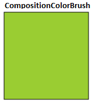

# 컴퍼지션 브러시

\[ Windows 10의 UWP 앱에 맞게 업데이트되었습니다. Windows 8.x 문서는 [보관](http://go.microsoft.com/fwlink/p/?linkid=619132)을 참조하세요. \]

브러시는 해당 출력으로 [**Visual**](https://msdn.microsoft.com/library/windows/apps/Dn706858) 영역을 그립니다. 각 브러시의 출력 유형은 서로 다릅니다. 컴퍼지션 API는 세 가지 브러시 형식을 제공합니다.

-   [
            **CompositionColorBrush**](https://msdn.microsoft.com/library/windows/apps/Mt589399)는 단색으로 시각적 개체를 그립니다.
-   [
            **CompositionSurfaceBrush**](https://msdn.microsoft.com/library/windows/apps/Mt589415)는 컴퍼지션 표면의 콘텐츠로 시각적 개체를 그립니다.
-   [
            **CompositionEffectBrush**](https://msdn.microsoft.com/library/windows/apps/Mt589406)는 컴퍼지션 효과의 콘텐츠로 시각적 개체를 그립니다.

모든 브러시는 [**CompositionBrush**](https://msdn.microsoft.com/library/windows/apps/Mt589398)에서 상속되며 [**Compositor**](https://msdn.microsoft.com/library/windows/apps/Dn706789)에 의해 직접 또는 간접적으로 만들어지는 장치 독립적 리소스입니다. 브러시는 장치 독립적이지만 [**CompositionSurfaceBrush**](https://msdn.microsoft.com/library/windows/apps/Mt589415) 및 [**CompositionEffectBrush**](https://msdn.microsoft.com/library/windows/apps/Mt589406)는 장치 종속적인 컴퍼지션 표면의 콘텐츠로 [**Visual**](https://msdn.microsoft.com/library/windows/apps/Dn706858)을 그립니다.

-   [필수 조건](./composition-brushes.md#prerequisites)
-   [색 기본 사항](./composition-brushes.md#color-basics)
    -   [알파 모드](./composition-brushes.md#alpha-modes)
-   [색 브러시 사용](./composition-brushes.md#using-color-brush)
-   [표면 브러시 사용](./composition-brushes.md#using-surface-brush)
-   [늘이기 및 맞춤 구성](./composition-brushes.md#configuring-stretch-and-alignment)

## 필수 조건

이 개요에서는 [컴퍼지션 UI](visual-layer.md)에 설명된 기본 컴퍼지션 응용 프로그램 구조에 익숙하다는 것을 전제로 합니다.

## 색 기본 사항

[
            **CompositionColorBrush**](https://msdn.microsoft.com/library/windows/apps/Mt589399)를 사용하여 그리려면 먼저 색을 선택해야 합니다. 컴퍼지션 API는 Windows 런타임 구조인 색상을 사용하여 색을 나타냅니다. 색상 구조는 sRGB 인코딩을 사용합니다. sRGB 인코딩은 색을 네 개의 채널(알파, 빨간색, 녹색 및 파란색)로 구분합니다. 각 구성 요소는 일반적으로 0.0 ~ 1.0 범위의 부동 소수점 값으로 나타냅니다. 값이 0.0이면 해당 색이 완전히 없는 것이고 값이 1.0이면 해당 색이 전체적으로 나타난다는 의미입니다. 알파 구성 요소의 경우 0.0은 완전히 투명한 색이고 1.0은 완전히 불투명한 색을 나타냅니다.

### 알파 모드

[
            **CompositionColorBrush**](https://msdn.microsoft.com/library/windows/apps/Mt589399)의 색상 값은 항상 스트레이트 알파로 해석됩니다.

## 색 브러시 사용

색 브러시를 만들려면 [**CompositionColorBrush**](https://msdn.microsoft.com/library/windows/apps/Mt589399)를 반환하는 Compositor.[**CreateColorBrush**](https://msdn.microsoft.com/en-us/library/windows/apps/windows.ui.composition.compositor.createcolorbrush.aspx) 메서드를 호출합니다. **CompositionColorBrush**의 기본 색은 \#00000000입니다. 다음 그림 및 코드에서는 검은색 브러시로 선을 긋고 색상 값이 0x9ACD32인 단색 브러시로 칠한 사각형을 만드는 작은 시각적 트리를 보여 줍니다.


```cs
Compositor _compositor;
ContainerVisual _container;
SpriteVisual visual1, visual2;
CompositionColorBrush _blackBrush, _greenBrush; 

_compositor = new Compositor();
_container = _compositor.CreateContainerVisual();

_blackBrush = _compositor.CreateColorBrush(Colors.Black);
visual1 = _compositor.CreateSpriteVisual();
visual1.Brush = _blackBrush;
visual1.Size = new Vector2(156, 156);
visual1.Offset = new Vector3(0, 0, 0);

_ greenBrush = _compositor.CreateColorBrush(Color.FromArgb(0xff, 0x9A, 0xCD, 0x32));
Visual2 = _compositor.CreateSpriteVisual();
Visual2.Brush = _greenBrush;
Visual2.Size = new Vector2(150, 150);
Visual2.Offset = new Vector3(3, 3, 0);
```

다른 브러시와는 달리 [**CompositionColorBrush**](https://msdn.microsoft.com/library/windows/apps/Mt589399) 만들기는 비교적 리소스를 적게 사용하는 작업입니다. 렌더링할 때마다 성능에 거의 또는 전혀 영향을 주지 않고 **CompositionColorBrush** 개체를 만들 수 있습니다.

## 표면 브러시 사용

[
            **CompositionSurfaceBrush**](https://msdn.microsoft.com/library/windows/apps/Mt589415)는 컴퍼지션 표면([**ICompositionSurface**](https://msdn.microsoft.com/library/windows/apps/Dn706819) 개체에 의해 표시됨)으로 시각적 개체를 그립니다. 다음 그림에서는 D2D를 사용하여 **ICompositionSurface**에 렌더링된 licorice 비트맵으로 그려진 정사각형을 보여 줍니다.


첫 번째 예제에서는 브러시를 사용하기 위해 컴퍼지션 표면을 초기화합니다. 컴퍼지션 표면은 [**CompositionSurfaceBrush**](https://msdn.microsoft.com/library/windows/apps/Mt589415)에서 사용되고 URL을 문자열로 사용하는 도우미 메서드인 LoadImage를 통해 만들어집니다. 이 메서드는 URL에서 이미지를 로드하여 이 이미지를 [**ICompositionSurface**](https://msdn.microsoft.com/library/windows/apps/Dn706819)에 렌더링하고 해당 표면을 **CompositionSurfaceBrush**의 콘텐츠로 설정합니다. 단, **ICompositionSurface**은 네이티브 코드로만 표시되므로 LoadImage 메서드가 네이티브 코드로 구현됩니다.

```cs
LoadImage(Brush,
          "ms-appx:///Assets/liqorice.png");
```

표면 브러시를 만들려면 Compositor.[**CreateSurfaceBrush**](https://msdn.microsoft.com/en-us/library/windows/apps/windows.ui.composition.compositor.createsurfacebrush.aspx) 메서드를 호출합니다. 이 메서드는 [**CompositionSurfaceBrush**](https://msdn.microsoft.com/library/windows/apps/Mt589415) 개체를 반환합니다. 아래 코드에서는 **CompositionSurfaceBrush**의 콘텐츠로 시각적 개체를 그리는 데 사용할 수 있는 코드를 보여 줍니다.

```cs
Compositor _compositor;
ContainerVisual _container;
SpriteVisual visual;
CompositionSurfaceBrush _surfaceBrush;

_surfaceBrush = _compositor.CreateSurfaceBrush();
LoadImage(_surfaceBrush, "ms-appx:///Assets/liqorice.png");
visual.Brush = _surfaceBrush;
```

## 늘이기 및 맞춤 구성

[
            **CompositionSurfaceBrush**](https://msdn.microsoft.com/library/windows/apps/Mt589415)의 [**ICompositionSurface**](https://msdn.microsoft.com/library/windows/apps/Dn706819) 콘텐츠로 작업 중인 시각적 개체의 영역을 완전히 채우지 못하는 경우가 있습니다. 이런 경우 컴퍼지션 API에서는 브러시의 [**HorizontalAlignmentRatio**](https://msdn.microsoft.com/en-us/library/windows/apps/windows.ui.composition.compositionsurfacebrush.horizontalalignmentratio.aspx), [**VerticalAlignmentRatio**](https://msdn.microsoft.com/library/windows/apps/windows.ui.composition.compositionsurfacebrush.verticalalignmentratio) 및 [**Stretch**](https://msdn.microsoft.com/library/windows/apps/windows.ui.composition.compositionsurfacebrush.stretch) 모드 설정을 사용하여 나머지 영역을 채우는 방법을 결정합니다.

-   [
            **HorizontalAlignmentRatio**](https://msdn.microsoft.com/en-us/library/windows/apps/windows.ui.composition.compositionsurfacebrush.horizontalalignmentratio.aspx) 및 [**VerticalAlignmentRatio**](https://msdn.microsoft.com/library/windows/apps/windows.ui.composition.compositionsurfacebrush.verticalalignmentratio)는 float 형식이며 시각적 개체 경계 내에서 브러시의 위치를 제어하는 데 사용할 수 있습니다.
    -   값이 0.0이면 브러시의 왼쪽/위 모서리를 시각적 개체의 왼쪽/위 모서리에 맞춥니다.
    -   값이 0.5이면 브러시의 중앙을 시각적 개체의 중앙에 맞춥니다.
    -   값이 1.0이면 브러시의 오른쪽/아래 모서리를 시각적 개체의 오른쪽/아래 모서리에 맞춥니다.
-   [
            **Stretch**](https://msdn.microsoft.com/library/windows/apps/windows.ui.composition.compositionsurfacebrush.stretch) 속성에는 [**CompositionStretch**](https://msdn.microsoft.com/library/windows/apps/Dn706786) 열거형에서 정의하는 다음 값을 사용할 수 있습니다.
    -   None: 시각적 개체 경계를 채우기 위해 브러시가 늘어나지 않습니다. 브러시가 시각적 개체의 경계보다 크면 브러시 콘텐츠가 잘리므로 늘이기 설정을 사용할 때는 주의해야 합니다. 시각적 개체 경계를 그리는 데 사용되는 브러시 부분은 [**HorizontalAlignmentRatio**](https://msdn.microsoft.com/en-us/library/windows/apps/windows.ui.composition.compositionsurfacebrush.horizontalalignmentratio.aspx) 및 [**VerticalAlignmentRatio**](https://msdn.microsoft.com/library/windows/apps/windows.ui.composition.compositionsurfacebrush.verticalalignmentratio) 속성을 사용하여 제어할 수 있습니다.
    -   Uniform: 브러시가 시각적 개체 경계에 맞게 크기가 조정됩니다. 가로 세로 비율은 유지됩니다. 기본값입니다.
    -   UUniformToFillniform: 브러시가 시각적 개체 경계를 완전히 채우도록 크기가 조정됩니다. 가로 세로 비율은 유지됩니다.
    -   Fill: 브러시가 시각적 개체 경계에 맞게 크기가 조정됩니다. 브러시의 높이와 너비가 따로 조정되므로 브러시의 원래 가로 세로 비율은 유지될 수 없습니다. 즉, 시각적 개체 경계를 완전히 채우기 위해 브러시가 왜곡될 수 있습니다.

 

 


<!--HONumber=Mar16_HO1-->


