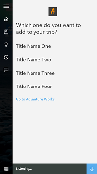
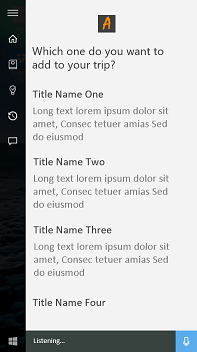
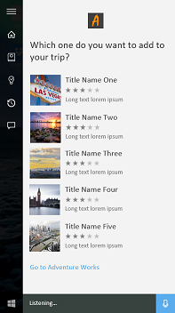
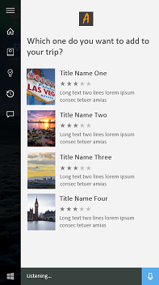
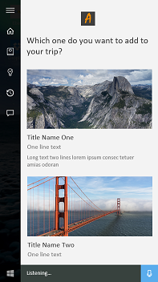
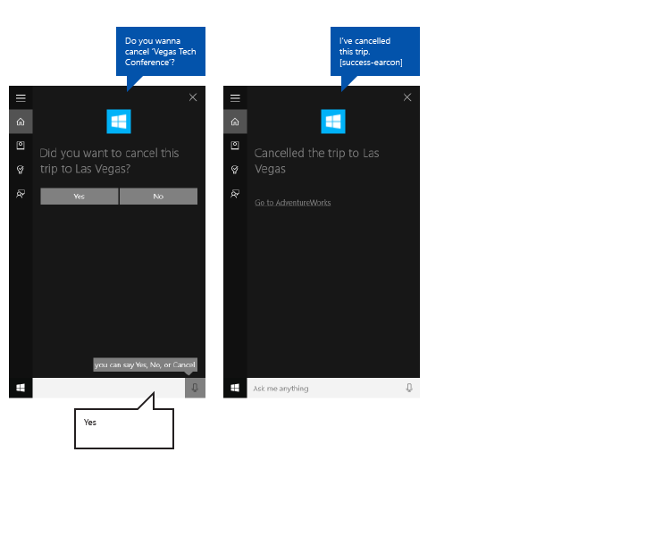

# Cortana 디자인 지침

이러한 지침 및 권장 사항에서는 앱에서 **Cortana**를 가장 잘 활용하여 사용자와 상호 작용하고 사용자가 작업을 수행하는 데 도움을 주며 어떻게 모든 작업이 수행되는지를 명확하게 전달할 수 있는 방법에 대해 설명합니다.

백그라운드에서 실행되는 응용 프로그램은 **Cortana**를 통해 사용자에게 확인 또는 명확성 관련 메시지를 표시할 수 있으며, 이에 대한 응답으로 사용자에게 음성 명령 상태에 대한 피드백을 제공할 수 있습니다. 프로세스는 간단하고 빠르며, 사용자에게 **Cortana** 환경을 나가거나 컨텍스트를 응용 프로그램으로 전환하도록 강제하지 않습니다.

사용자는 **Cortana**가 프로세스를 가능한 한 간단하고 쉽게 만드는 데 도움이 된다고 느끼는 한편, 개발자는 **Cortana**를 통해 자신이 개발한 앱이 작업을 수행하고 있음을 드러내기를 바랄 것입니다.

아래 그림의 **Cortana** UI로 통합된 **Adventure Works**라는 여행 계획 및 관리 앱을 사용하여 Cortana 디자인의 다양한 개념 및 기능을 설명합니다.

## 대화형 쓰기

성공적으로 **Cortana**을(를) 조작하려면 TTS(텍스트 음성 변환) 및 GUI 문자열을 만들 때 몇 가지 기본 원칙을 따라야 합니다.

<table>
<colgroup>
<col width="33%" />
<col width="33%" />
<col width="33%" />
</colgroup>
<thead>
<tr class="header">
<th align="left">원칙</th>
<th align="left">잘못된 예</th>
<th align="left">좋은 예</th>
</tr>
</thead>
<tbody>
<tr class="odd">
<td align="left">

<dl>
<dt>효율</dt>
<dd>
가능한 한 적은 수의 단어를 사용하고 가장 중요한 정보를 맨 앞에 배치합니다.

</dd>
</dl></td>
<td align="left">
물론입니다. 오늘은 어떤 영화를 검색하고 싶으세요? 저희는 대규모 컬렉션을 보유하고 있습니다.
</td>
<td align="left">
물론입니다. 어떤 영화를 찾고 계세요?
</td>
</tr>
<tr class="even">
<td align="left">

<dl>
<dt>관련성</dt>
<dd>
작업, 콘텐츠 및 컨텍스트와 관련 있는 정보만 제공합니다.

</dd>
</dl></td>
<td align="left">
이 항목을 재생 목록에 추가했습니다. 참고로 말씀드리면 배터리가 부족합니다.
</td>
<td align="left">
이 항목을 재생 목록에 추가했습니다.
</td>
</tr>
<tr class="odd">
<td align="left">

<dl>
<dt>확실성</dt>
<dd>
모호성을 피합니다. 기술적인 전문 용어 대신 일상 언어를 사용합니다.

</dd>
</dl></td>
<td align="left">
&quot;라스베이거스 여행&quot; 쿼리에 대한 결과가 없습니다.
</td>
<td align="left">
라스베이거스 여행을 찾을 수 없습니다.
</td>
</tr>
<tr class="even">
<td align="left">

<dl>
<dt>신뢰성 </dt>
<dd>
최대한 정확해야 합니다. 백그라운드에서 수행되고 있는 작업을 솔직하게 말합니다. 아직 완료되지 않은 작업을 완료되었다고 하면 안 됩니다. 소중한 개인 정보를 소리 내어 읽지 마세요.

</dd>
</dl></td>
<td align="left">
그 영화를 찾을 수 없습니다. 아직 출시되지 않았습니다.
</td>
<td align="left">
당사 카탈로그에서 그 영화를 찾을 수 없습니다.
</td>
</tr>
</tbody>
</table>

 

사람이 말하는 방식을 쓰세요. 자연스럽게 들리는 것보다 문법 정확도를 더 강조하지 마세요. 예를 들어 "~하고 싶어" 또는 "~할 거야"와 같이 친숙하게 들리는 축약형은 TTS로 읽어도 좋습니다.

가능하고 자연스러운 경우 암묵적인 1인칭 시제를 사용하세요. 예를 들어 "다음 Adventure Works 여행을 찾는 중입니다."는 누군가가 보고 있지만 이를 지정하기 위해 "나"라는 단어를 사용하지 않습니다.

앱이 더 자연스럽게 들리도록 변형을 사용하세요. 효과적으로 동일한 것을 말하기 위해 다양한 버전의 TTS 및 GUI 문자열을 제공하세요. 예를 들어 "어떤 영화를 보시겠어요?"는 "어떤 영화를 시청하시겠어요?"로 대체될 수 있습니다. 사람은 매번 정확하게 동일한 방식으로 말하지는 않습니다. TTS 및 GUI 버전의 동기화 상태를 유지하도록 합니다.

사려 깊게 "그렇군요." 및 "알겠습니다."와 같은 말을 응답에 사용합니다. 이러한 말은 내용이 제대로 전달되었음을 알리고 진행률에 대한 정보를 제공할 수 있지만 너무 자주 똑같은 말을 사용할 경우 단조롭게 반복적으로 응답하고 있다고 느낄 수도 있습니다.

**참고** 내용이 제대로 전달되었음을 알리는 말은 TTS에만 사용하세요. **Cortana** 캔버스의 공간이 제한되어 있으므로 해당 GUI 문자열에 이를 반복하지 마세요.

 

보다 자연스러운 조작과 **Cortana** 캔버스의 추가 공간 절약을 위해 응답에 축약형을 사용하세요. 예를 들어 "그 영화를 찾을 수 없습니다." 대신 "그 영화를 찾을 수 없어요."를 사용합니다. 시각이 아닌 청각에 맞게 작성합니다.

시스템에서 이해하는 언어를 사용합니다. 사용자는 나타내려는 용어를 반복하는 경향이 있습니다. 표시하는 내용을 알아야 합니다.

대체 응답 컬렉션에서 교대로 또는 임의로 선택하여 응답에 약간씩 다른 표현을 사용하세요. 예를 들어 "어떤 영화를 보시겠어요?"와 "어떤 영화를 시청하시겠어요?"와 같이 합니다. 이렇게 하면 앱이 보다 자연스럽고 독특하게 들립니다.

## 지역화

음성 명령을 사용하여 작업을 시작하려면 앱에서 사용자가 해당 디바이스(설정 &gt; 시스템 &gt; 음성 &gt; 음성 언어)에서 선택한 언어로 음성 명령을 등록해야 합니다.

앱이 응답하는 음성 명령과 모든 TTS 및 GUI 문자열을 지역화해야 합니다.

긴 GUI 문자열은 피해야 합니다. **Cortana** 캔버스는 응답에 세 줄을 제공하고 그보다 긴 문자열은 자릅니다.

자세한 내용은 [세계화 및 지역화 섹션](../globalizing/globalizing-portal.md)을 참조하세요.

## 이미지 리소스 및 크기 조정

UWP(유니버설 Windows 플랫폼) 앱에서 특정 설정 및 장치 기능(고대비, 유효 픽셀, 로캘 등)에 따라 가장 적절한 앱 로고 이미지를 자동으로 선택할 수 있습니다. 단지 이미지를 제공하고 앱 프로젝트 내에서 다른 리소스 버전에 대한 적절한 명명 규칙 및 폴더 조직을 사용하면 됩니다. 권장 리소스 버전을 제공하지 않으면 사용자의 기본 설정, 능력, 장치 유형 및 위치에 따라 접근성, 지역화 및 이미지 품질이 떨어질 수 있습니다.

고대비 및 배율 인수용 이미지 리소스에 대한 자세한 내용은 [타일 및 아이콘 자산에 대한 지침](../controls-and-patterns/tiles-and-notifications-app-assets.md)을 참조하세요.

한정자를 사용하여 리소스 이름을 지정합니다. 리소스 한정자는 특정 리소스 버전을 사용할 컨텍스트를 식별하는 폴더 및 파일 이름 한정자입니다.

표준 명명 규칙은 "foldername/qualifiername-value\[\_qualifiername-value\]/filename.qualifiername-value\[\_qualifiername-value\].ext"입니다. 예를 들어 images/en-US/logo.scale-100\_contrast-white.png는 images/logo.png라는 루트 폴더 및 파일 이름을 사용하여 코드에서 단순히 참조됩니다. [세계화 및 지역화](../globalizing/globalizing-portal.md)와 [한정자를 사용하여 리소스 이름을 지정하는 방법](https://msdn.microsoft.com/library/windows/apps/xaml/hh965324)을 참조하세요.

문자열 리소스 파일(예: "en-US\\resources.resw")의 기본 언어 및 이미지(예: "logo.scale-100.png")의 기본 배율 요소를 표시하는 것이 좋습니다. 이는 지역화된 해상도 리소스 또는 여러 해상도 리소스를 제공하지 않으려는 경우에도 마찬가지입니다. 그러나 최소한 100, 200 및 400 배율 인수에 대한 자산을 제공하는 것이 좋습니다.

**중요**  
Cortana 캔버스의 제목 영역에서 사용되는 앱 아이콘은 "Package.appxmanifest" 파일에 지정된 Square44x44Logo 아이콘입니다. 

또한 사용자 쿼리에 대한 각 결과 타일에 대해 아이콘을 지정할 수도 있습니다. 결과 아이콘에 대한 유효한 이미지 크기는 다음과 같습니다.

-   68w x 68h
-   68w x 92h
-   280w x 140h

## 결과 타일 템플릿

Cortana 캔버스에 표시하는 결과 타일에 대해 템플릿 집합이 제공됩니다. 이 템플릿을 사용하여 타일 제목과, 타일에 텍스트와 결과 아이콘 이미지를 포함할지 여부를 지정합니다. 각 타일에는 지정된 템플릿에 따라 최대 3줄의 텍스트와 한 개의 이미지를 포함할 수 있습니다.

다음은 지원되는 템플릿(예제 포함)입니다.

| 이름 | 예제 |
| --- | --- |
| 제목만  |  |
| 텍스트가 있는 제목   |  |
| 68x68 아이콘이 있는 제목   | 이미지 없음 |
| 68x68 아이콘 및 텍스트가 있는 제목   |  |
| 68x92 아이콘이 있는 제목   | 이미지 없음 |
| 68x92 아이콘 및 텍스트가 있는 제목    |  |
| 280x140 아이콘이 있는 제목   | 이미지 없음 |
| 280x140 아이콘 및 텍스트가 있는 제목    |  |

Cortana 템플릿에 대한 자세한 내용은 [VoiceCommandContentTileType](https://msdn.microsoft.com/library/windows/apps/windows.applicationmodel.voicecommands.voicecommandcontenttiletype.aspx)을 참조하세요.

## 예제

이 예는 **Cortana**에서 백그라운드 앱의 종단 간 작업 흐름을 보여 줍니다. **Adventure Works** 앱을 사용하여 라스베이거스 여행을 취소합니다. 이 예제에서는 "68x68 아이콘 및 텍스트가 있는 제목" 템플릿을 사용합니다.

이 이미지에 설명된 단계는 다음과 같습니다.

1.  사용자가 마이크를 탭하여 **Cortana**를 시작합니다.
2.  사용자가 "내 Adventure Works 라스베이거스 여행을 취소해 줘."라고 말하여 백그라운드에서 **Adventure Works** 앱이 시작됩니다. 앱에서 **Cortana** 음성과 캔버스를 둘 다 사용하여 사용자와 상호 작용합니다.
3.  **Cortana**가 사용자에게 내용이 제대로 전달되었음을 알리는 피드백("Adventure Works를 실행합니다."), 상태 표시줄 및 취소 단추를 제공하는 전달 화면으로 전환됩니다.
4.  이 경우 사용자에게 쿼리와 일치하는 여행이 여러 개 있으므로 앱은 일치하는 모든 결과가 나열된 명확성 화면을 제공하고 "어떤 여행을 취소하시겠어요?"라고 묻습니다.
5.  사용자가 "라스베이거스 기술 회의" 항목을 지정합니다.
6.  취소는 실행 취소될 수 없으므로 앱은 사용자에게 의도를 확인할 것인지 묻는 확인 화면을 제공합니다.
7.  사용자가 "예"라고 말합니다.
8.  그러면 앱은 작업 결과를 보여 주는 완료 화면을 제공합니다.

여기서 이러한 단계를 더 자세히 살펴보겠습니다.

### 전달

|  |
|--- |
| 전달 화면 없는 여행 찾기 |

|  |
|--- |
| 전달 화면 있는 여행 취소 | 

앱이 응답하는 데 500밀리초 미만의 시간이 걸리고 사용자로부터의 추가 정보가 불필요한 작업은 완료 화면을 표시하는 것 이외에는 **Cortana**의 추가 참여 없이 완료될 수 있습니다.

응용 프로그램이 응답하는 데 500밀리초 이상의 시간이 필요한 경우 **Cortana**는 전달 화면을 제공합니다. 앱 아이콘 및 이름이 표시되고, 음성 명령을 올바르게 이해했음을 나타내기 위해 GUI 및 TTS 전달 문자열을 둘 다 제공해야 합니다. 전달 화면은 최대 5초간 표시됩니다. 앱이 이 시간 내에 응답하지 않으면 **Cortana**가 일반 오류 화면을 제공합니다.

### 전달 화면에 대한 GUI 및 TTS 지침

작업이 진행 중임을 명확하게 나타냅니다.

현재 시제를 사용합니다.

작업이 시작하는 내용을 확인하는 동작 동사를 사용하고 특정 엔터티를 참조합니다.

요청된 미완료 동작으로 커밋되지 않는 일반 동사를 사용합니다. 예를 들어 "여행을 취소하는 중입니다" 대신 "여행을 찾는 중입니다"를 사용합니다. 이 경우 결과가 반환되지 않으면 사용자에게 "라스베이거스 여행을 취소하는 중입니다... 라스베이거스 여행을 찾을 수 없습니다"와 같은 말이 들리지 않습니다.

앱에서 요청된 엔터티를 계속 확인해야 하는 경우 작업이 아직 수행되지 않았음을 명확히 합니다. 예를 들어 0개 이상의 여행이 일치할 수 있고 결과를 아직 모르므로 “여행을 취소하는 중입니다.” 대신 어떻게 “여행을 찾는 중입니다.”라고 말할지에 신경 쓰세요.

GUI 문자열과 TTS 문자열은 같을 수 있지만 반드시 그럴 필요는 없습니다. 잘리거나 다른 시각적 자산과 중복되지 않도록 GUI 문자열은 짧게 유지하세요.

| TTS                                                    | GUI                                 |
|--------------------------------------------------------|-------------------------------------|
| 다음 Adventure Works 여행을 찾는 중입니다.            | 다음 여행을 찾는 중입니다...         |
| Adventure Works 폴스 시티 여행을 검색 중입니다. | 폴스 시티 여행을 검색 중입니다... |

 

### 진행률

|  |
| --- |
| 진행률 화면이 있는 여행 취소 |  

작업 단계 간에 시간이 다소 걸리는 경우 앱이 개입하여 진행률 화면에서 일어나고 있는 상황에 대해 사용자에게 업데이트해서 알려야 합니다. 앱 아이콘이 표시되고, 작업이 진행 중임을 나타내기 위해 GUI 및 TTS 진행률 문자열을 둘 다 제공해야 합니다.

앱에 적절한 상태로 앱을 시작하기 위한 시작 매개 변수가 포함된 링크를 제공해야 합니다. 이렇게 하면 사용자가 작업을 보거나 완료할 수 있습니다. **Cortana**가 링크 텍스트(예: "Adventure Works로 이동")를 제공합니다.

진행률 화면은 각각 5초간 표시됩니다. 이후에는 다른 화면이 표시되어야 하거나 작업 제한 시간이 초과됩니다.

진행률 화면 다음에 다음과 같은 화면이 표시될 수 있습니다.

-   진행률
-   확인(명시적, 나중에 설명함)
-   명확성
-   완료

### 진행률 화면에 대한 GUI 및 TTS 지침

현재 시제를 사용합니다.

작업이 진행 중임을 확인하는 동작 동사를 사용합니다.

**GUI**: 엔터티가 표시된 경우 그에 대한 참조를 사용합니다("이 여행을 취소하는 중입니다..."). 엔터티가 표시되지 않은 경우 명시적으로 엔터티를 호출합니다("'라스베이거스 기술 회의'를 취소하는 중입니다.").

**TTS**: 첫 번째 진행률 화면에만 TTS 문자열을 포함해야 합니다. 추가 진행률 화면이 필요한 경우 빈 문자열 {}를 TTS 문자열로 보내고 GUI 문자열만 제공합니다.

| 조건                                              | TTS                            | GUI                            |
|---------------------------------------------------------|--------------------------------|--------------------------------|
| 이전 차례에서 엔터티를 읽은 경우/디스플레이에 엔터티가 표시된 경우     | 이 여행을 취소하는 중입니다...          | 이 여행을 취소하는 중입니다...          |
| 이전 차례에서 엔터티를 읽지 않은 경우/디스플레이에 엔터티가 표시된 경우 | 라스베이거스 여행을 취소하는 중입니다... | 이 여행을 취소하는 중입니다...          |
| 이전 차례에서 엔터티를 읽지 않은 경우/엔터티가 표시되지 않은 경우        | 라스베이거스 여행을 취소하는 중입니다... | 라스베이거스 여행을 취소하는 중입니다... |

 

### 확인

|  |
| --- |
| 확인 화면이 있는 여행 취소 | 

일부 작업은 사용자 명령의 특성에 의해 암시적으로 확인될 수 있습니다. 다른 작업은 잠재적으로 더 민감하여 명시적 확인이 필요합니다. 암시적 확인을 사용할 경우와 명시적 확인을 사용할 경우에 대한 몇 가지 지침은 다음과 같습니다.

확인 화면의 GUI 및 TTS 문자열은 둘 다 앱에서 지정하며, **Cortana** 아바타 대신 앱 아이콘(제공된 경우)이 표시됩니다.

고객이 확인에 대해 응답한 후 응용 프로그램이 500밀리초 이내에 다음 화면을 제공해야 진행률 화면으로 이동되지 않습니다.

다음의 경우 명시적 확인을 사용하세요.

-   콘텐츠가 사용자를 떠나는 경우(예: 문자 메시지, 메일 또는 소셜 게시물)
-   작업을 실행 취소할 수 없는 경우(예: 구매 또는 항목 삭제)
-   결과가 당혹스러울 수 있는 경우(예: 잘못된 사람에게 전화함)
-   보다 복잡한 인식이 필요한 경우(예: 개방형 기록)

다음의 경우 암시적 확인을 사용하세요.

-   콘텐츠가 사용자 전용으로 저장되는 경우(예: 자체 메모)
-   쉽게 취소할 수 있는 경우(예: 알람 설정 또는 해제)
-   작업을 빨리 수행해야 하는 경우(예: 잊어버리기 전에 빨리 아이디어 캡처)
-   정확도가 높은 경우(예: 간단한 메뉴)

### 확인 화면에 대한 GUI 및 TTS 지침

현재 시제를 사용합니다.

사용자에게 "예" 또는 "아니요"로 대답할 수 있는 모호하지 않은 질문을 합니다. 질문은 사용자가 하려고 하는 작업을 명시적으로 확인해야 하고 다른 명백한 옵션이 없어야 합니다.

음성 명령을 처음에 이해하지 못할 경우를 대비하여 재확인을 위한 변형된 질문을 제공합니다.

**GUI**: 엔터티가 표시된 경우 그에 대한 참조를 사용합니다. 엔터티가 표시되지 않은 경우 명시적으로 엔터티를 호출합니다.

**TTS**: 명확성을 위해, 이전 차례에서 시스템이 특정 항목 또는 엔터티를 읽지 않은 한 항상 해당 항목 또는 엔터티를 참조합니다.

| 조건                                              | TTS                                        | GUI                                           |
|---------------------------------------------------------|--------------------------------------------|-----------------------------------------------|
| 이전 차례에서 엔터티를 읽지 않은 경우/디스플레이에 엔터티가 표시된 경우 | 라스베이거스 기술 회의를 취소하시겠어요? | 이 여행을 취소하시겠어요?                             |
| 이전 차례에서 엔터티를 읽지 않은 경우/엔터티가 표시되지 않은 경우        | 라스베이거스 기술 회의를 취소하시겠어요? | 라스베이거스 기술 회의를 취소하시겠어요?                 |
| 이전 차례에서 엔터티를 읽은 경우/엔터티가 표시되지 않은 경우            | 이 여행을 취소하시겠어요?             | 이 여행을 취소하시겠어요?                             |
| 엔터티가 표시되었고 재확인하는 경우                              | 이 여행을 취소하려고 하셨나요?            | 이 여행을 취소하려고 하셨나요?             |
| 엔터티가 표시되지 않았고 재확인하는 경우                          | 이 여행을 취소하려고 하셨나요?            | 라스베이거스 기술 회의를 취소하려고 하셨나요? |

 

### 명확성

|  |
| --- |
| 명확성 화면이 있는 여행 취소 | 

일부 작업의 경우 작업을 완료하기 위해 사용자에게 엔터티 목록에서 선택하도록 요구할 수 있습니다.

명확성 화면의 GUI 및 TTS 문자열은 둘 다 앱에서 지정하며, **Cortana** 아바타 대신 앱 아이콘(제공된 경우)이 표시됩니다.

고객이 명확성 질문에 대해 응답한 후 응용 프로그램이 500밀리초 이내에 다음 화면을 제공해야 진행률 화면으로 이동되지 않습니다.

### 명확성 화면에 대한 GUI 및 TTS 지침

현재 시제를 사용합니다.

사용자에게 표시된 엔터티의 제목 또는 텍스트 줄로 대답할 수 있는 모호하지 않은 질문을 합니다.

최대 10개의 엔터티를 표시할 수 있습니다.

각 엔터티에는 고유한 제목이 있어야 합니다.

음성 명령을 처음에 이해하지 못할 경우를 대비하여 재확인을 위한 변형된 질문을 제공합니다.

**TTS**: 명확성을 위해, 이전 차례에서 특정 항목 또는 엔터티를 말하지 않은 한 항상 해당 항목 또는 엔터티를 참조합니다.

**TTS**: 세 개 이하의 엔터티가 있고 해당 엔터티가 짧지 않은 한 엔터티 목록을 읽지 마세요.

| 조건                 | TTS                                                                            | GUI                              |
|----------------------------|--------------------------------------------------------------------------------|----------------------------------|
| 프롬프트 - 3개 이하의 항목  | 어느 라스베이거스 여행을 취소하시겠어요? 라스베이거스 기술 회의인가요? 라스베이거스 파티인가요? | 어느 것을 취소하시겠습니까? |
| 프롬프트 - 4개 이상의 항목 | 어느 라스베이거스 여행을 취소하시겠어요?                                          | 어느 것을 취소하시겠습니까? |
| 재확인                   | 어느 라스베이거스 여행을 취소하려고 하셨나요?                                         | 어느 것을 취소하시겠습니까? |

 

### 완료

|  |
| --- |
| 완료 화면이 있는 여행 취소 |

 

작업을 성공적으로 완료했을 경우 앱에서 사용자에게 요청한 작업이 성공적으로 완료되었음을 알려야 합니다.

완료 화면의 GUI 및 TTS 문자열은 둘 다 앱에서 지정하며, **Cortana** 아바타 대신 앱 아이콘(제공된 경우)이 표시됩니다.

앱에 적절한 상태로 앱을 시작하기 위한 시작 매개 변수가 포함된 링크를 제공해야 합니다. 이렇게 하면 사용자가 작업을 보거나 완료할 수 있습니다. **Cortana**가 링크 텍스트(예: "Adventure Works로 이동")를 제공합니다.

### 완료 화면에 대한 GUI 및 TTS 지침

과거 시제를 사용합니다.

동작 동사를 사용하여 작업이 완료되었음을 명시적으로 나타냅니다.

엔터티가 표시되었거나 이전 차례에서 참조된 경우 해당 엔터티만 참조합니다.

| 조건                                       | TTS                                             | GUI                                |
|--------------------------------------------------|-------------------------------------------------|------------------------------------|
| 엔터티가 표시된 경우/이전 차례에서 엔터티를 읽은 경우         | 이 여행을 취소했습니다.                       | 이 여행이 취소되었습니다.               |
| 엔터티가 표시되지 않은 경우/이전 차례에서 엔터티를 읽지 않은 경우 | 라스베이거스 기술 회의 여행을 취소했습니다. | "라스베이거스 기술 회의"가 취소되었습니다. |

 

### 오류

|  |
| --- |
| 오류 화면이 있는 여행 취소 |

 

다음 오류 중 하나가 발생하는 경우 **Cortana**가 동일한 일반 오류 메시지를 표시합니다.

-   앱 서비스가 갑자기 종료됩니다.
-   **Cortana**가 앱 서비스와 통신하지 못합니다.
-   **Cortana**가 5초간 전달 화면 또는 진행률 화면을 표시한 후 앱이 화면을 제공하지 못합니다.

## 관련 문서

* [음성 조작](speech-interactions.md)  

**개발자**
* [Cortana 조작](https://msdn.microsoft.com/library/windows/apps/mt185598)
* [음성 조작](https://msdn.microsoft.com/library/windows/apps/mt185614)
 

 

<!--HONumber=Jun16_HO3-->

