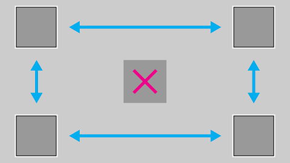
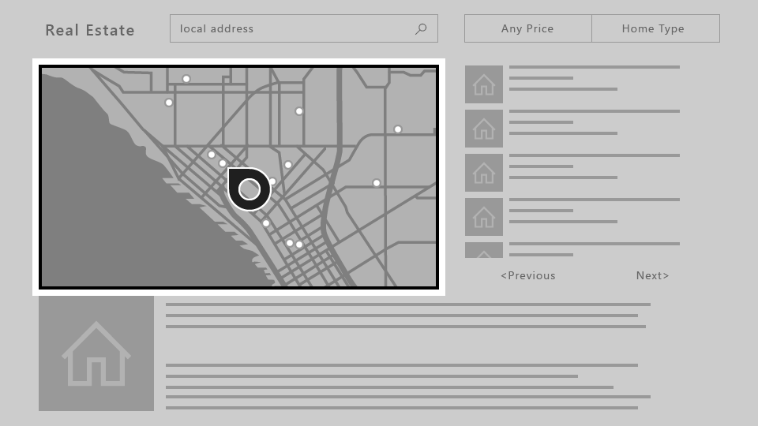
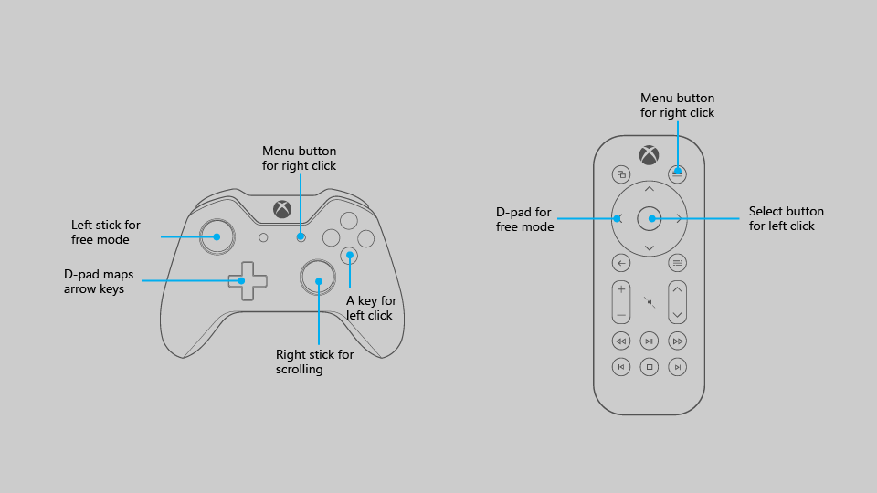
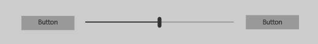
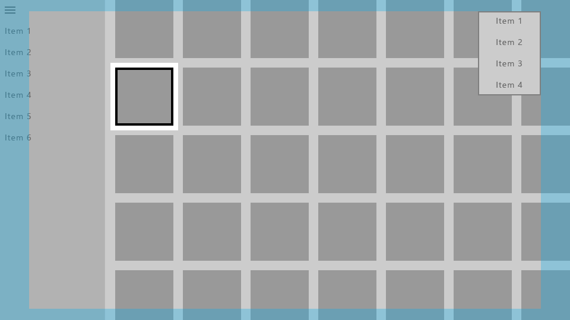
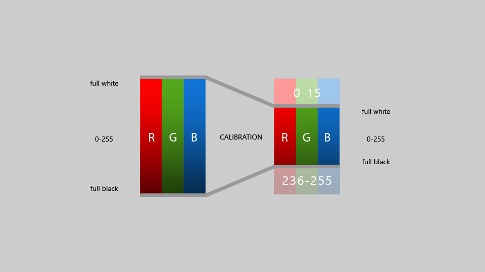
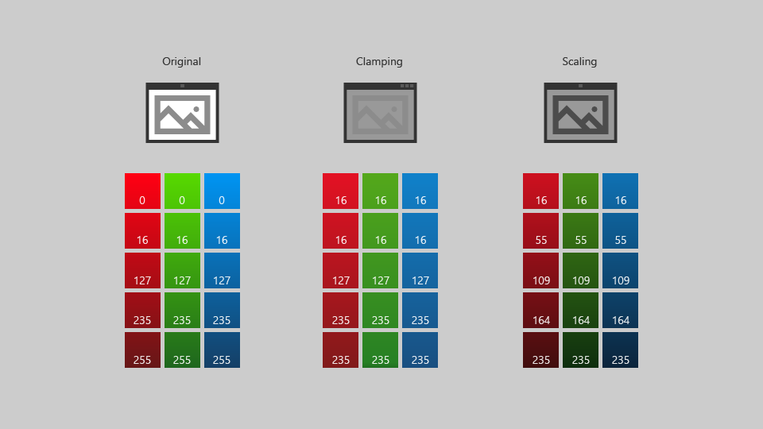

> \[이 문서에서 설명하는 기능은 아직 사용할 수 없습니다. 이 기능은 상업용으로 출시되기 전에 상당 부분 수정될 수 있습니다. Microsoft는 여기에 제공된 정보에 대해 명시적 또는 묵시적 보증을 하지 않습니다.\]

# Xbox 및 TV용 디자인

Xbox One 및 TV 화면에서 멋지게 보이고 제대로 작동하도록 UWP(유니버설 Windows 플랫폼) 앱을 디자인합니다.

## 개요

유니버설 Windows 플랫폼을 사용하면 여러 Windows 10 디바이스에서 흥미로운 환경을 만들 수 있습니다. UWP 프레임워크에서 제공하는 대부분의 기능은 추가 작업 없이 앱이 이러한 디바이스에서 동일한 UI(사용자 인터페이스)를 사용할 수 있게 합니다. 그러나 Xbox One 및 TV 화면에서 잘 작동하도록 앱을 조정하고 최적화하려면 특별한 고려 사항이 필요합니다.

실내의 소파에 앉아 TV와 상호 작용 하는 게임 패드 또는 리모컨을 사용하여 TV를 조작하는 환경을 **10피트 환경**이라고 합니다. 일반적으로 사용자가 화면에서 약 10피트 떨어진 곳에 앉아 있기 때문에 이렇게 이름이 지정되었습니다. 이 경우 가령 *2피트* 환경이나 PC 조작 시에는 존재하지 않는 고유한 과제가 발생합니다. Xbox One 또는 TV 화면에 출력되고 입력에 컨트롤러를 사용하는 다른 모든 디바이스용 앱을 개발하는 경우 항상 이 점에 유의해야 합니다.

이 문서의 모든 단계가 10피트 환경에 적합한 앱을 만드는 데 필요한 것은 아니지만 이해하고 앱에 적절한 결정을 하면 앱의 특정 요구에 맞는 더 나은 10피트 환경을 만들 수 있습니다. 10피트 환경에 맞는 앱을 만들려면 다음 디자인 원칙을 고려합니다.

### 단순

10피트 환경에 맞게 디자인하려면 일련의 고유한 과제를 처리해야 합니다. 해상도 및 시청 거리 때문에 사용자가 너무 많은 정보를 처리하기 어려울 수 있습니다. 가능한 가장 간단한 구성 요소로 줄여 디자인을 명확하게 유지합니다. TV에 표시되는 정보량은 데스크톱이 아니라 휴대폰에 표시되는 정보량과 일치해야 합니다.


### 일관성

10피트 환경의 UWP 앱은 직관적이고 사용하기 쉬워야 합니다. 포커스를 명확하게 유지합니다. 공간에서의 이동이 일관되고 예측 가능하도록 콘텐츠를 정렬합니다. 사용자에게 수행하려는 작업에 대한 최단 경로를 제공합니다.


_**스크린샷에 표시된 모든 영화는 Microsoft 영화 및 TV에서 시청할 수 있습니다.**_  

### 흥미 유발

영화 같은 가장 몰입형 환경이 큰 화면에 표시됩니다. 횡단 간 장면, 세련된 동작 및 생생한 색과 입력 체계 사용을 통해 앱을 한 단계 더 발전시킬 수 있습니다. 대담하고 아름답게 구현하세요.


### 10피트 환경에 최적화

10피트 환경에 적합한 UWP 앱 디자인의 원칙을 배웠으므로 이제 앱을 최적화하고 뛰어난 사용자 환경을 만들 수 있는 특정 방법에 대한 다음 개요를 살펴보세요.

| 기능        | 설명           |
| -------------------------------------------------------------- |--------------------------------|
| [게임 패드 및 리모컨](#gamepad-and-remote-control)      | 앱이 게임 패드와 리모컨으로 잘 작동하도록 하는 것이 10피트 환경에 최적화하는 작업의 가장 중요한 단계입니다. 동작이 다소 제한된 디바이스에서 사용자 조작 환경을 최적화하기 위한 게임 패드 및 리모컨 관련 개선 사항이 여러 개 있습니다. |
| [XY 포커스 탐색 및 조작](#xy-focus-navigation-and-interaction) | UWP는 사용자가 앱의 UI를 탐색할 수 있게 하는 **XY 포커스 탐색** 기능을 제공합니다. 그러나 사용자가 위, 아래, 왼쪽 및 오른쪽으로만 탐색할 수 있도록 제한됩니다. 이 섹션에는 이 문제를 해결하기 위한 권장 사항과 기타 고려 사항이 요약되어 있습니다. |
| [마우스 모드](#mouse-mode)|지도, 그리기 화면 등의 일부 사용자 인터페이스에서는 XY 포커스 탐색을 사용할 수 없거나 비실용적입니다. 이러한 인터페이스에 대해 UWP는 게임 패드/리모컨이 데스크톱 컴퓨터의 마우스처럼 자유롭게 이동할 수 있게 하는 **마우스 모드**를 제공합니다.|
| [포커스 화면 효과](#focus-visual)  | 포커스 화면 효과는 현재 포커스가 있는 UI 요소를 둘러싸는 테두리입니다. 이 기능은 사용자가 헤매지 않고 UI를 쉽게 탐색하는 데 도움이 됩니다. 포커스가 명확하게 표시되지 않으면 사용자가 UI에서 헤맬 수 있으며 사용자 경험이 저하될 수 있습니다.  |
| [포커스 연결](#focus-engagement) | UI 요소에 포커스 연결을 설정하려면 사용자는 **A/선택** 단추를 눌러 조작해야 합니다. 이렇게 하면 앱의 UI를 탐색할 때 사용자에게 더 나은 환경을 제공할 수 있습니다.
| [UI 요소 크기 조정](#ui-element-sizing)  | 유니버설 Windows 플랫폼은 [크기 조정 및 유효 픽셀](..\layout\design-and-ui-intro.md#effective-pixels-and-scaling)을 사용하여 시청 거리에 따라 UI의 크기를 조정합니다. 크기 조정을 이해하고 UI 전체에 적용하면 10피트 환경에 앱을 최적화하는 데 도움이 됩니다.  |
|  [TV 안전 영역](#tv-safe-area) | UWP는 기본적으로 안전하지 않은 TV 영역(화면 가장자리에 가까운 영역)에 UI가 표시되는 것을 자동으로 방지합니다. 그러나 이 때문에 UI가 레터박스처럼 보이는 "박스" 효과가 발생합니다. TV에서 진정한 몰입형 앱이 되려면 지원하는 TV에서 화면 가장자리까지 확장되도록 앱을 수정하는 것이 좋습니다. |
| [색](#colors)  |  UWP는 색 테마를 지원하며, 시스템 테마를 적용하는 앱은 Xbox One에서 기본적으로 **어둡게**로 설정됩니다. 앱에 특정 색 테마가 있는 경우 일부 색은 TV에서 제대로 작동하지 않으며 피해야 한다는 것을 고려해야 합니다. |
| [소리](../style/sound.md)    | 소리는 사용자를 몰두하게 하고 피드백을 제공하는 데 도움이 되어 10ft 환경에 중요한 역할을 합니다. UWP는 앱이 Xbox One에서 실행 중일 때 공통 컨트롤에 대한 소리를 자동으로 켜는 기능을 제공합니다. UWP에 기본 제공되는 소리 지원 기능에 대한 자세한 내용을 살펴보고 이를 활용하는 방법을 알아봅니다.    |
| [UI 컨트롤에 대한 지침](#guidelines-for-ui-controls)  |  여러 UI 컨트롤이 다양한 디바이스에서 잘 작동하지만 TV에서 사용할 경우 특별히 고려해야 할 사항이 있습니다. 10ft 환경용으로 디자인할 경우 이러한 컨트롤 사용을 위한 몇 가지 모범 사례에 대해 알아봅니다. |

<!--[elcowle] We may uncomment this now that the Sound article is live-->
<!--| [Sound](../style/sound.md)  |  Sounds play a key role in the 10-foot experience, helping to immerse and give feedback to the user. The UWP provides functionality that automatically turns on sounds for common controls when the app is running on Xbox One. Find out more about the sound support built into the UWP and learn how to take advantage of it. |-->

## 게임 패드 및 리모컨

PC의 키보드 및 마우스, 휴대폰과 태블릿의 터치와 마찬가지로 게임 패드 및 리모컨은 10피트 환경의 주요 입력 디바이스입니다. 이 섹션에서는 하드웨어 단추란 무엇이며 어떤 기능을 수행하는지를 소개합니다. [XY 포커스 탐색 및 조작](#xy-focus-navigation-and-interaction)과 [마우스 모드](#mouse-mode)에서 이러한 입력 디바이스를 사용할 때 앱을 최적화하는 방법을 살펴보겠습니다.

기본적으로 사용할 수 있는 게임 패드 및 리모컨 동작의 품질은 앱에서 키보드가 얼마나 잘 지원되는지에 따라 달라집니다. 앱이 게임 패드/리모컨으로 잘 작동하게 하는 한 가지 효율적인 방법은 PC에서 키보드로 잘 작동하는지 확인하고 게임 패드/리모컨으로 테스트하여 UI에서 취약한 부분을 찾는 것입니다.

### 하드웨어 단추

이 설명서 전체에서 단추는 다음 다이어그램에 제공된 이름으로 나타냅니다.


다이어그램에서 알 수 있듯이, 게임 패드에서 지원되지만 리모컨에서는 지원되지 않는 단추도 있고 그 반대의 경우도 있습니다. UI를 더 빠르게 탐색할 수 있도록 하나의 입력 디바이스에서만 지원되는 단추를 사용할 수 있지만 중요한 조작에 이러한 단추를 사용할 경우 사용자가 UI의 특정 부분을 조작할 수 없는 상황이 생길 수 있습니다.

다음 표에서는 UWP 앱이 지원하는 모든 하드웨어 단추 및 해당 단추를 지원하는 입력 디바이스를 보여 줍니다.

| 단추                    | 게임 패드   | 원격 제어    |
|---------------------------|-----------|-------------------|
| A/선택 단추           | 예       | 예               |
| B/뒤로 단추             | 예       | 예               |
| 방향 패드(D-패드)   | 예       | 예               |
| 메뉴 단추               | 예       | 예               |
| 보기 단추               | 예       | 예               |
| X 및 Y 단추           | 예       | 아니요                |
| 왼쪽 스틱                | 예       | 아니요                |
| 오른쪽 스틱               | 예       | 아니요                |
| 왼쪽 및 오른쪽 트리거   | 예       | 아니요                |
| 왼쪽 및 오른쪽 범퍼    | 예       | 아니요                |
| OneGuide 단추           | 아니요        | 예               |
| 볼륨 버튼             | 아니요        | 예               |
| 채널 단추            | 아니요        | 예               |
| 미디어 컨트롤 단추     | 아니요        | 예               |
| 음소거 단추               | 아니요        | 예               |

### 기본 제공 단추 지원

UWP는 기존의 키보드 입력 동작을 게임 패드 및 리모컨 입력에 자동으로 매핑합니다. 다음 표에서는 이러한 기본 제공 매핑을 보여 줍니다.

| 키보드              | 게임 패드/리모컨                        |
|-----------------------|---------------------------------------|
| 화살표 키            | D-패드(또한 게임 패드의 왼쪽 스틱)    |
| 스페이스바              | A/선택 단추                       |
| Enter                 | A/선택 단추                       |
| 이스케이프                | B/뒤로 단추*                        |

\*B 단추에 대한 [KeyDown](https://msdn.microsoft.com/library/windows/apps/br208941) 및 [KeyUp](https://msdn.microsoft.com/en-us/library/windows/apps/windows.ui.xaml.uielement.keyup.aspx) 이벤트가 앱에서 처리되지 않는 경우 [SystemNavigationManager.BackRequested](https://msdn.microsoft.com/en-us/library/windows/apps/windows.ui.core.systemnavigationmanager.backrequested.aspx) 이벤트가 발생하여 앱 내에서 뒤로 탐색됩니다.

### 바로 연결 지원

바로 연결 단추는 UI 탐색 속도를 높이는 데 사용할 수 있는 단추입니다. 그러나 이러한 단추는 특정 입력 디바이스에 고유할 수 있으므로 모든 사용자가 이러한 기능을 사용할 수 있는 것은 아닙니다. 실제로, 현재 Xbox One에서 UWP 앱에 대해 바로 연결 기능을 지원하는 입력 디바이스는 게임 패드뿐입니다.

다음 표에서는 UWP에 기본 제공되는 바로 연결 지원 및 직접 구현할 수 있는 바로 연결 지원을 보여 줍니다. 사용자 지정 UI에서 이러한 동작을 활용하여 일관되고 친숙한 사용자 환경을 제공합니다.

| 조작   | 키보드   | 게임 패드      | 기본 제공:  | 맞춤 항목: |
|---------------|------------|--------------|----------------|------------------|
| 이동       | 없음       | 오른쪽 스틱  | 없음           |      [ScrollViewer](https://msdn.microsoft.com/en-us/library/windows/apps/windows.ui.xaml.controls.scrollviewer.aspx) |
| 페이지 위로/아래로  | 페이지 위로/아래로 | 왼쪽/오른쪽 트리거 | 없음 | `ScrollViewer` 및 목록/그리드
| 페이지 왼쪽/오른쪽으로 | 없음 | 왼쪽/오른쪽 범퍼 | [피벗](https://msdn.microsoft.com/en-us/library/windows/apps/windows.ui.xaml.controls.pivot.aspx) | `ScrollViewer`
| 확대/축소        | Ctrl +/- | 왼쪽/오른쪽 트리거 | `ScrollViewer` | 확대 및 축소를 지원하는 보기

## XY 포커스 탐색 및 조작

앱이 키보드에 대해 적절한 포커스 탐색을 지원하는 경우 게임 패드 및 리모컨에도 잘 전송됩니다. 화살표 키를 사용한 탐색은 **D-패드**(및 게임 패드의 **왼쪽 스틱**)에 매핑되고, UI 요소 조작은 **Enter/선택** 키에 매핑됩니다([게임 패드 및 리모컨 참조](#gamepad-and-remote-control)). 키보드 디자인 지침은 [키보드 조작](keyboard-interactions.md)을 참조하세요.

키보드 지원을 제대로 구현하면 앱이 제대로 작동합니다. 그러나 모든 시나리오를 지원하려면 몇 가지 추가 작업이 필요할 수 있습니다. 가능한 최상의 사용자 환경을 제공하기 위해 앱의 특정 요구를 고려해 보세요.

### 액세스할 수 없는 UI

XY 포커스 탐색은 사용자가 위쪽, 아래쪽, 왼쪽 및 오른쪽으로 이동하도록 제한하기 때문에 UI 부분에 액세스할 수 없는 시나리오가 발생할 수 있습니다. 다음 다이어그램은 XY 포커스 탐색이 지원하지 않는 UI 레이아웃 종류의 예를 보여 줍니다. 세로 및 가로 탐색에 우선 순위가 지정되고 가운데 요소는 포커스를 받을 만큼 우선 순위가 높게 지정되지 않기 때문에 가운데 요소는 게임 패드/리모컨으로 액세스할 수 없습니다.



어떤 이유로든 UI를 다시 정렬할 수 없는 경우 다음 섹션에서 설명하는 방법 중 하나를 사용하여 기본 포커스 동작을 재정의합니다.

### 기본 탐색 재정의 <a name="overriding-the-default-navigation"></a>

UWP는 D-패드/왼쪽 스틱 탐색이 사용자에게 타당한지 확인하지만 앱의 의도에 최적화된 동작을 보장할 수는 없습니다. 탐색이 앱에 최적화되었는지 확인하는 가장 좋은 방법은 게임 패드로 테스트하여 사용자가 앱의 시나리오에 타당한 방식으로 모든 UI 요소에 액세스할 수 있는지 확인하는 것입니다. 앱의 시나리오에서 제공된 XY 포커스 탐색으로 얻을 수 없는 동작을 요구하는 경우 다음 섹션에 있는 권장 사항을 따르고 동작을 재정의하여 논리적 항목에 포커스를 배치하는 것이 좋습니다.

다음 코드 조각은 XY 포커스 탐색 동작을 재정의하는 방법을 보여 줍니다.

```xml
<StackPanel>
    <Button x:Name="MyBtnLeft" 
            Content="Search" />
    <Button x:Name="MyBtnRight" 
            Content="Delete"/>
    <Button x:Name="MyBtnTop" 
            Content="Update" />
    <Button x:Name="MyBtnDown" 
            Content="Undo" />
    <Button Content="Home"  
            XYFocusLeft="{x:Bind MyBtnLeft}" 
            XYFocusRight="{x:Bind MyBtnRight}"
            XYFocusDown="{x:Bind MyBtnDown}"
            XYFocusUp="{x:Bind MyBtnTop}" />
</StackPanel>
```

이 경우 `Home` 단추에 포커스가 있고 사용자가 왼쪽으로 이동하면 포커스가 `MyBtnLeft` 단추로 이동합니다. 사용자가 오른쪽에는 이동하면 포커스가 `MyBtnRight` 단추로 이동합니다.

포커스가 컨트롤에서 특정 방향으로 이동하지 않도록 하려면 `XYFocus*` 속성을 사용하여 동일한 컨트롤을 가리킵니다.

```xml
<Button Name="HomeButton"  
        Content="Home"  
        XYFocusLeft ="{x:Bind HomeButton}" />
```

### 최소 클릭 경로 <a name="path-of-least-clicks"></a>

사용자가 가장 일반적인 작업을 최소 클릭 수로 수행할 수 있게 합니다. 다음 예제에서는 [TextBlock](https://msdn.microsoft.com/en-us/library/windows/apps/windows.ui.xaml.controls.textblock.aspx)이 **재생** 단추(처음 포커스를 받음)와 자주 사용하는 요소 사이에 있으므로 우선 순위 작업 사이에 불필요한 요소가 배치됩니다.


다음 예제에서는 [TextBlock](https://msdn.microsoft.com/en-us/library/windows/apps/windows.ui.xaml.controls.textblock.aspx)이 **재생** 단추 위에 있습니다. 우선 순위 작업 사이에 불필요한 요소가 배치되지 않도록 UI를 다시 정렬하기만 해도 앱의 유용성이 크게 향상됩니다.


### CommandBar 및 ContextFlyout

[CommandBar](https://msdn.microsoft.com/en-us/library/windows/apps/windows.ui.xaml.controls.commandbar.aspx)를 사용하는 경우 [문제: 긴 스크롤 목록/그리드 뒤에 UI 요소가 있음](#problem-ui-elements-located-after-long-scrolling-list-grid)에서 설명한 대로 목록을 스크롤하는 문제에 유의하세요. 다음 그림은 `CommandBar`가 목록/그리드 맨 아래에 있는 UI 레이아웃을 보여 줍니다. 사용자는 `CommandBar`에 접근하기 위해 목록/그리드 맨 아래까지 스크롤해야 합니다.


목록/그리드 `CommandBar`*위에* 배치하면 어떻게 될까요? 목록/그리드를 스크롤한 사용자가 `CommandBar`에 접근하기 위해 다시 위로 스크롤해야 하지만 이전 구성보다는 탐색이 약간 줄어듭니다. 여기서는 앱의 초기 포커스가 `CommandBar` 옆이나 위에 있다고 가정합니다. 초기 포커스가 목록/그리드 아래에 있으면 이 방식은 제대로 작동하지 않습니다. 이러한 `CommandBar` 항목이 자주 액세스할 필요가 없는 전역 작업 항목인 경우(예: **동기화** 단추) 목록/그리드 위에 배치해도 됩니다.

사용자가 항목에 쉽게 액세스할 수 있어야 하는 `CommandBar`이 앱에 있는 경우 이러한 항목을 `ContextFlyout` 내부에 배치하고 `CommandBar`에서 제거하는 것이 좋습니다. 

`CommandBar`의 항목을 세로로 겹칠 수는 없지만 스크롤 방향과 반대로(예: 세로로 스크롤되는 목록의 왼쪽 또는 오른쪽이나 가로로 스크롤되는 목록의 위쪽 또는 아래쪽) 배치하는 것도 UI 레이아웃에 적합한 경우 고려할 수 있는 또 다른 옵션입니다.

### UI 레이아웃 문제

일부 UI 레이아웃은 XY 포커스 탐색의 특성으로 인해 더 까다로우며, 사례별로 평가해야 합니다. 하나의 "올바른" 방법은 없으며 선택하는 해결 방법은 앱의 특정 요구에 따라 다르지만 멋진 TV 환경을 만들기 위해 활용할 수 있는 몇 가지 방법이 있습니다.

이 내용을 이해하기 쉽도록 이러한 몇 가지 문제와 해결 방법을 보여 주는 가상 앱을 살펴보겠습니다.

> **참고** &nbsp;&nbsp;이 가상 앱은 UI 문제와 잠재적인 해결 방법을 설명하는 데 사용되며, 특정 앱에 대한 최상의 사용자 환경을 보여 주기 위한 것이 아닙니다.

다음은 판매용 주택 목록, 지도, 속성 설명 및 기타 정보를 보여 주는 가상 부동산 앱입니다. 이 앱은 다음과 같은 방법으로 해결할 수 있는 세 가지 문제를 제기합니다.

- [UI 다시 정렬](#ui-rearrange)
- [포커스 연결](#engagement)
- [마우스 모드](#mouse-mode)


#### 문제: UI 요소가 긴 스크롤 목록/그리드 뒤에 있음 <a name="problem-ui-elements-located-after-long-scrolling-list-grid"></a>

다음 그림에 표시된 속성의 [ListView](https://msdn.microsoft.com/en-us/library/windows/apps/windows.ui.xaml.controls.listview.aspx)는 매우 긴 스크롤 목록입니다. `ListView`에서 [연결](#focus-engagement)이 요구되지 *않는* 경우 사용자가 목록으로 이동하면 목록의 첫 번째 항목에 포커스가 배치됩니다. 사용자가 **이전** 또는 **다음** 단추에 접근하려면 목록에 있는 모든 항목을 탐색해야 합니다. 이처럼 사용자가 전체 목록을 트래버스하는 것이 힘든 경우&mdash;즉, 이러한 경험이 허용될 만큼&mdash;목록이 짧지 않은 경우에는 다른 옵션을 고려하는 것이 좋습니다.


#### 해결 방법

##### UI 다시 정렬 <a name="ui-rearrange"></a>

초기 포커스가 페이지 맨 아래에 배치되지 않는 경우 일반적으로 긴 스크롤 목록 위에 있는 UI 요소가 아래에 배치된 UI 요소보다 액세스하기 더 쉽습니다. 이 새로운 레이아웃이 다른 디바이스에도 적합한 경우 Xbox One용으로 특수 UI 변경을 수행하는 대신 모든 디바이스 패밀리에 대한 레이아웃을 변경하는 것이 비용을 줄이는 방법일 수 있습니다. 또한 스크롤 방향과 반대로 UI 요소를 배치하면(즉, 세로로 스크롤되는 목록에 가로로 배치 또는 가로로 스크롤되는 목록에 세로로 배치) 접근성이 더 향상됩니다.


##### 포커스 연결 <a name="engagement"></a>

연결이 *필수*이면 전체 `ListView`가 단일 포커스 대상이 됩니다. 사용자가 다음 포커스 가능 요소에 액세스하기 위해 목록 내용을 무시할 수 있습니다. 연결을 지원하는 컨트롤 및 사용 방법에 대한 자세한 내용은 [포커스 연결](#focus-engagement)을 참조하세요.


#### 문제: 포커스 가능 요소가 없는 ScrollViewer

XY 포커스 탐색은 한 번에 하나씩 포커스 가능 UI요소로 이동하므로 포커스 가능 요소가 없는 [ScrollViewer](https://msdn.microsoft.com/en-us/library/windows/apps/windows.ui.xaml.controls.scrollviewer.aspx)(예: 이 예제와 같이 텍스트만 포함된 경우)에서는 사용자가 `ScrollViewer`의 일부 콘텐츠를 볼 수 없는 시나리오가 발생할 수 있습니다. 이 시나리오 및 기타 관련 시나리오에 대한 해결 방법은 [포커스 연결](#focus-engagement)을 참조하세요.


#### 문제: 자유 스크롤 UI

앱에 그리기 화면 또는 이 예제의 지도와 같은 자유 스크롤 UI가 필요한 경우 XY 포커스 탐색이 작동하지 않습니다. 이런 경우에는 [마우스 모드](#mouse-mode)를 켜서 사용자가 UI 요소 내에서 자유롭게 탐색하도록 할 수 있습니다.



## 마우스 모드

[XY 포커스 탐색 및 조작](#xy-focus-navigation-and-interaction)에 설명된 대로 Xbox One에서는 XY 탐색 시스템을 통해 포커스가 이동되어 사용자가 위쪽, 아래쪽, 왼쪽 및 오른쪽으로 이동하여 컨트롤 간에 포커스를 전환할 수 있게 합니다. 그러나 [WebView](https://msdn.microsoft.com/en-us/library/windows/apps/windows.ui.xaml.controls.webview.aspx) 및 [MapControl](https://msdn.microsoft.com/en-us/library/windows/apps/windows.ui.xaml.controls.maps.mapcontrol.aspx)과 같은 일부 컨트롤에서는 사용자가 컨트롤의 경계 안으로 포인터를 자유롭게 이동할 수 있는 마우스와 유사한 조작이 필요합니다. 사용자가 전체 페이지에서 포인터를 이동하여 PC에서 마우스로 찾을 수 있는 것과 유사한 경험을 게임 패드/리모컨으로 얻을 수 있어야 하는 앱도 있습니다.

이러한 시나리오의 경우 전체 페이지 또는 페이지 내부 컨트롤에 대한 포인터(마우스 모드)를 요청해야 합니다. 예를 들어 컨트롤 내부에 있는 동안에만 마우스 모드를 사용하고 다른 곳에서는 XY 포커스 탐색을 사용하는 `WebView` 컨트롤이 포함된 페이지가 앱에 있을 수 있습니다. 포인터를 요청하려면 필요한 경우가 **컨트롤 또는 페이지를 연결할 때**인지, 아니면 **페이지에 포커스가 있을 때**인지를 지정할 수 있습니다.

> **참고** &nbsp;&nbsp;컨트롤이 포커스를 받을 때 포인터를 요청하는 기능은 지원되지 않습니다.

다음 다이어그램은 마우스 모드의 게임 패드/리모컨에 대한 단추 매핑을 보여 줍니다.



> **참고** &nbsp;&nbsp;마우스 모드는 Xbox One에서 게임 패드/리모컨으로만 지원됩니다. 다른 디바이스 패밀리 및 입력 형식에서는 자동으로 무시됩니다.

컨트롤 또는 페이지의 `RequiresPointer` 속성을 사용하여 마우스 모드를 활성화합니다. `RequiresPointer` 에 사용 가능한 세 가지 값은 `Never`(기본값), `WhenEngaged` 및 `WhenFocused`입니다.

> **참고** &nbsp;&nbsp;`RequiresPointer`는 새로운 API로 아직 문서화되지 않았습니다. 

<!--TODO: Link to doc-->

### 컨트롤에서 마우스 모드 활성화

사용자가 컨트롤을 `RequiresPointer="WhenEngaged"`에 연결하면 연결 해제할 때까지 컨트롤에서 마우스 모드가 활성화됩니다. 다음 코드 조각은 연결 시 마우스 모드를 활성화하는 간단한 `MapControl`을 보여 줍니다.

```xml
<Page>
    <Grid>
        <MapControl IsEngagementRequired="true" 
                    RequiresPointer="WhenEngaged"/>
    </Grid>
</Page> 
```

> **참고** &nbsp;&nbsp;연결 시 컨트롤이 마우스 모드를 활성화하는 경우 `IsEngagementRequired="true"`와의 연결도 요구해야 합니다. 그렇지 않으면 마우스 모드가 활성화되지 않습니다.

컨트롤이 마우스 모드이면 중첩된 컨트롤도 마우스 모드가 됩니다. 요청된 자식 모드는 무시됩니다. 부모가 마우스 모드인데&mdash; 자식이 마우스 모드가 아닌 경우는 불가능합니다.

또한 요청된 컨트롤 모드는 포커스를 받을 때만 적용되므로 포커스가 있는 동안에는 모드가 동적으로 변경되지 않습니다.

### 페이지에서 마우스 모드 활성화

페이지에 `RequiresPointer="WhenFocused"` 속성이 있는 경우 포커스를 받을 때 전체 페이지에 대해 마우스 모드가 활성화됩니다. 다음 코드 조각은 페이지에 이 속성을 제공하는 방법을 보여 줍니다.

```xml
<Page RequiresPointer="WhenFocused">
    ...
</Page> 
```

> **참고** &nbsp;&nbsp;`WhenFocused` 값은 [페이지](https://msdn.microsoft.com/en-us/library/windows/apps/windows.ui.xaml.controls.page.aspx) 개체에서만 지원됩니다. 컨트롤에 이 값을 설정하려고 하면 예외가 발생합니다.

## 포커스 화면 효과

포커스 화면 효과는 현재 포커스가 있는 UI 요소를 둘러싸는 테두리입니다. 이 기능은 사용자가 헤매지 않고 UI를 쉽게 탐색하는 데 도움이 됩니다.

포커스 화면 효과에 추가된 다양한 사용자 지정 옵션 및 시각적 업데이트를 통해 개발자는 단일 포커스 화면 효과가 원격 PC와 Xbox One은 물론 키보드 및/또는 게임 패드/리모컨을 지원하는 다른 Windows 10 디바이스에서도 잘 작동할 것이라고 신뢰할 수 있습니다.

여러 플랫폼에서 동일한 포커스 화면 효과를 사용할 수 있지만 10피트 환경의 경우 사용자에게 발생하는 컨텍스트가 약간 다릅니다. 사용자가 전체 TV 화면에 완전히 집중하지 않는다고 가정해야 하므로 시각 효과를 쉽게 검색할 수 있도록 현재 포커스가 있는 요소가 항상 사용자에게 명확하게 표시되어야 합니다.

또한 게임 패드 또는 리모컨을 사용할 때는 포커스 화면 효과가 기본적으로 표시되지만 키보드를 사용할 때는 표시되지 *않는다는* 것에 유의해야 합니다. 따라서 구현하지 않더라도 Xbox One에서 앱을 실행할 때는 표시됩니다.

### 초기 포커스 화면 효과 배치

앱을 시작하거나 페이지로 이동할 때 사용자가 작업을 수행하는 첫 번째 요소로 타당한 UI 요소에 포커스를 배치합니다. 예를 들어 사진 앱은 갤러리의 첫 번째 항목에 포커스를 배치할 수 있고, 노래 자세히 보기로 이동된 음악 앱은 음악을 재생하기 쉽도록 재생 단추에 포커스를 배치할 수 있습니다.

앱의 왼쪽 위 영역(또는 오른쪽에서 왼쪽 흐름의 경우 오른쪽 위)에 초기 포커스를 배치합니다. 일반적으로 여기서 앱 콘텐츠 흐름이 시작되기 때문에 대부분의 사용자는 먼저 해당 모서리에 집중하는 경향이 있습니다.

### 포커스가 명확하게 표시되도록 만들기

사용자가 포커스를 검색하지 않고도 중단한 위치를 선택할 수 있도록 항상 포커스 화면 효과가 화면에 표시되어야 합니다. 마찬가지로, 항상 화면에 포커스 가능 항목이 있어야 합니다. &mdash;예를 들어 텍스트만 있고 포커스 가능 요소가 없는 팝업은 사용하지 마세요.

### 오버레이 빠른 해제

사용자가 현재 게임 컨트롤러 또는 리모컨으로 조작하는 UI 요소에 집중하도록 UWP는 Xbox One에서 앱을 실행할 경우 팝업 UI 외부 영역을 덮는 "연기" 계층을 자동으로 추가합니다. 추가 작업은 필요 없지만 UI를 디자인할 때 이 점에 유의해야 합니다.

## 포커스 연결

포커스 연결은 게임 패드 또는 리모컨을 사용하여 앱을 조작하기 쉽게 하려는 것입니다. 

> **참고** &nbsp;&nbsp;포커스 연결을 설정해도 키보드 또는 기타 입력 디바이스에는 영향을 주지 않습니다.

[FrameworkElement](https://msdn.microsoft.com/en-us/library/windows/apps/windows.ui.xaml.frameworkelement.aspx) 개체의 `IsFocusEngagementEnabled` 속성이 `True`로 설정된 경우 컨트롤이 포커스 연결 필요로 표시됩니다. 즉, 사용자가 **A/선택** 단추를 눌러 컨트롤을 "연결"하고 조작해야 합니다. 작업이 끝나면 **B/뒤로** 단추를 눌러 컨트롤 연결을 해제하고 벗어날 수 있습니다.

> **참고** &nbsp;&nbsp;`IsFocusEngagementEnabled`는 새로운 API로 아직 문서화되지 않았습니다.

### 포커스 트래핑

포커스 트래핑은 사용자가 앱의 UI를 탐색하는 동안 컨트롤 내에 "트래핑"되어 해당 컨트롤 외부로 이동하기 어렵거나 불가능할 때 발생합니다.

다음 예제에서는 포커스 트래핑을 만드는 UI를 보여 줍니다.



사용자가 왼쪽 단추에서 오른쪽 단추로 이동하려는 경우 D-패드/왼쪽 스틱에서 오른쪽을 두 번 누르기만 하면 된다고 가정하는 것이 논리적입니다. 그러나 [Slider](https://msdn.microsoft.com/en-us/library/windows/apps/windows.ui.xaml.controls.slider.aspx)에 연결이 필요하지 않은 경우 다음과 같은 동작이 발생합니다. 사용자가 처음 오른쪽을 누르면 포커스가 `Slider`으로 전환되고, 다시 오른쪽을 누르면 `Slider`의 핸들이 오른쪽으로 이동합니다. 사용자는 핸들을 계속 오른쪽으로 이동하려 하지만 단추에 접근할 수 없습니다.

이 문제를 해결하는 방법에는 여러 가지가 있습니다. 하나는 [XY 포커스 탐색 및 조작](#xy-focus-navigation-and-interaction)의 부동산 앱 예제와 유사하게 다른 레이아웃을 디자인하는 것입니다. 해당 예제에서는 **이전** 및 **다음** 단추의 위치를 `ListView` 위로 옮겼습니다. 다음 이미지와 같이 가로가 아니라 세로로 컨트롤을 겹치면 문제가 해결됩니다.


이제 사용자가 D-패드/왼쪽 스틱에서 위쪽 및 아래쪽을 눌러 각 컨트롤로 이동할 수 있으며, `Slider`에 포커스가 있을 경우 왼쪽 및 오른쪽을 눌러 `Slider` 핸들을 예상대로 이동할 수 있습니다.

이 문제를 해결하는 또 다른 방법은 `Slider`에서 연결을 요구하는 것입니다. `IsFocusEngagementEnabled="True"`를 설명하면 다음과 같은 동작이 발생합니다.


`Slider`에 포커스 연결이 필요한 경우 사용자가 D-패드/왼쪽 스틱에서 오른쪽을 두 번 누르기만 하면 오른쪽에 있는 단추에 접근할 수 있습니다. 이 해결 방법은 UI를 조정할 필요 없이 필요한 동작을 생성하기 때문에 유용합니다.

### 항목 컨트롤

[Slider](https://msdn.microsoft.com/en-us/library/windows/apps/windows.ui.xaml.controls.slider.aspx) 컨트롤 외에도 연결을 요구할 수 있는 다음과 같은 컨트롤이 있습니다.

- [ListBox](https://msdn.microsoft.com/en-us/library/windows/apps/windows.ui.xaml.controls.listbox.aspx)
- [ListView](https://msdn.microsoft.com/en-us/library/windows/apps/windows.ui.xaml.controls.listview.aspx)
- [GridView](https://msdn.microsoft.com/en-us/library/windows/apps/windows.ui.xaml.controls.gridview.aspx)
- [FlipView](https://msdn.microsoft.com/en-us/library/windows/apps/xaml/windows.ui.xaml.controls.flipview)

`Slider` 컨트롤과 달리 이러한 컨트롤은 해당 컨트롤 내에 포커스를 트래핑하지 않습니다. 그러나 대량 데이터를 포함할 경우 유용성 문제가 발생할 수 있습니다. 다음은 대량 데이터를 포함하는 `ListView`의 예입니다.


`Slider` 예제와 유사하게, 게임 패드/리모컨을 사용하여 위쪽에 있는 단추에서 아래쪽에 있는 단추로 이동해 보겠습니다. 먼저 위쪽 단추에 포커스를 놓고 D-패드/스틱에서 아래쪽을 누르면 포커스가 `ListView`의 첫 번째 항목("항목 1")에 배치됩니다. 사용자가 다시 아래쪽을 누르면 아래쪽에 있는 단추가 아니라 목록의 다음 항목이 포커스를 받습니다. 단추에 접근하려면 사용자가 `ListView`에 있는 모든 항목을 먼저 탐색해야 합니다. `ListView`에 대량 데이터가 포함되어 있는 경우 이는 불편하고 최적 사용자 경험이 아닙니다.

이 문제를 해결하려면 연결을 요구하도록 `ListView`의 `IsFocusEngagementEnabled="True"` 속성을 설정합니다. 이렇게 하면 사용자가 간단하게 아래쪽을 눌러 `ListView`를 건너뛸 수 있습니다. 하지만 포커스가 있을 때 **A/선택** 단추를 눌러 연결하고 **B/뒤로** 단추를 눌러 연결 해제하지 않을 경우 목록을 스크롤하고 목록에서 항목을 선택할 수 없습니다.


#### ScrollViewer

[ScrollViewer](https://msdn.microsoft.com/en-us/library/windows/apps/windows.ui.xaml.controls.scrollviewer.aspx)는 이러한 컨트롤과 약간 다르며 고려해야 하는 자체 쿼크가 있습니다. 포커스 가능 콘텐츠를 포함하는 `ScrollViewer`가 있는 경우 기본적으로 `ScrollViewer`로 이동하면 포커스 가능 요소를 탐색할 수 있습니다. `ListView`에서와 마찬가지로, `ScrollViewer` 외부로 이동하려면 각 항목을 스크롤해야 합니다. 

`ScrollViewer`에 포커스 가능 콘텐츠가 *없는* 경우&mdash;예: 텍스트만 포함된 경우&mdash; 사용자가 **A/선택** 단추를 사용하여 `ScrollViewer`를 연결할 수 있도록 `IsFocusEngagementEnabled="True"`를 설정할 수 있습니다. 연결한 후 **D-패드/왼쪽 스틱**을 사용하여 텍스트를 스크롤한 다음 작업이 끝나면 **B/뒤로** 단추를 눌러 연결 해제할 수 있습니다.

또 다른 방법은 사용자가 컨트롤을 연결할 필요가 없도록 `IsTabStop="True"`의 `ScrollViewer`를 설정하는 것입니다. &mdash;사용자는 포커스를 배치한 다음 `ScrollViewer` 내에 포커스 가능 요소가 있을 경우 **D-패드/왼쪽 스틱**을 사용하여 스크롤하면 됩니다.

### 포커스 연결 기본값

일부 컨트롤은 기본 설정에서 연결을 요구할 만큼 포커스 트래핑이 자주 발생하는 반면, 다른 컨트롤은 포커스 연결이 기본적으로 꺼져 있지만 켜면 도움이 될 수 있습니다. 다음 표에서는 이러한 컨트롤 및 해당 기본 포커스 연결 동작을 보여 줍니다.

| 컨트롤               | 포커스 연결 기본값  |
|-----------------------|---------------------------|
| CalendarDatePicker    | Windows                        |
| FlipView              | 꺼짐                       |
| GridView              | 꺼짐                       |
| ListBox               | 꺼짐                       |
| ListView              | 꺼짐                       |
| ScrollViewer          | 꺼짐                       |
| SemanticZoom          | 꺼짐                       |
| 슬라이더                | Windows                        |

다른 모든 UWP 컨트롤은 `IsFocusEngagementEnabled="True"`일 때 동작 또는 시각적 변경이 없습니다.

## UI 요소 크기 조정

10피트 환경에서 앱의 사용자는 리모컨이나 게임 패드를 사용하고 화면에서 몇 피트 떨어진 곳에 앉아 있으므로 디자인에 고려해야 하는 몇 가지 UI 고려 사항이 있습니다. UI의 콘텐츠 밀도를 적절하게 유지하고, 사용자가 요소를 쉽게 탐색하고 선택할 수 있도록 UI가 너무 혼잡하지 않도록 합니다. 단순성이 중요하다는 것을 명심하세요.

### 배율 인수 및 적응형 레이아웃

**배율 인수**는 앱을 실행하는 디바이스에 맞는 크기로 UI 요소가 표시되도록 하는 데 도움이 됩니다. 데스크톱에서 이 설정은 **설정 &gt; 시스템 &gt; 디스플레이**에 슬라이딩 값으로 제공됩니다. 디바이스에서 지원하는 경우 휴대폰에도 이 동일한 설정이 있습니다.

 

Xbox One에는 이러한 시스템 설정이 없지만 UWP UI 요소가 TV에 적절한 크기로 조정되도록 **200%** 기본값으로 배율이 지정됩니다. UI 요소가 다른 디바이스에 적절한 크기로 조정되기만 하면 TV에서도 적절한 크기로 조정됩니다. Xbox One은 앱을 1080p(1920 x 1080 픽셀)로 렌더링합니다. 따라서 PC 등의 다른 디바이스에서 앱을 가져오는 경우 [적응형 기술](https://msdn.microsoft.com/en-us/windows/uwp/layout/screen-sizes-and-breakpoints-for-responsive-design) 이용하여 100%의 960 x 540px에서 UI가 멋지게 표시되도록 합니다.

Xbox용 디자인은 하나의 해상도, 1920 x 1080에 대해서만 고려하면 되기 때문에 PC용 디자인과 약간 다릅니다. 사용자에게 더 나은 해상도의 TV가 있는지 여부는 중요하지 않습니다. &mdash;UWP 앱은 항상 1080p로 크기가 조정됩니다.

TV 해상도에 관계없이 Xbox One에서 실행되는 경우 200% 세트에서 올바른 자산 크기를 앱에 대해서도 가져옵니다.

### 콘텐츠 밀도

앱을 디자인할 때 사용자가 일정 거리에서 UI를 보고 리모컨이나 게임 컨트롤러를 사용하여 조작하기 때문에 마우스나 터치 입력을 사용할 때보다 이동 시간이 더 오래 걸린다는 것에 유의하세요.

#### UI 컨트롤의 크기

대화형 UI 요소는 32epx(유효 픽셀)의 최소 높이로 크기를 조정해야 합니다. 이는 일반적인 UWP 컨트롤의 기본값이며, 200% 배율로 사용할 때 일정 거리에서 UI 요소를 볼 수 있게 하며 콘텐츠 밀도를 줄이는 데 도움이 됩니다. 


#### 클릭 수

UI를 간소화하려면 사용자가 TV 화면의 한쪽 가장자리에서 다른 쪽 가장자리로 이동할 때 **6번 클릭**을 넘지 않도록 해야 합니다. 여기서도 다시 **단순성**의 원칙이 적용됩니다. 자세한 내용은 [최소 클릭 경로](#path-of-least-clicks)를 참조하세요.


### 텍스트 크기

일정 거리에서 UI를 볼 수 있게 하려면 다음과 같은 경험적 규칙을 따르세요.

* 기본 텍스트 및 읽기용 콘텐츠: 최소 15epx
* 중요하지 않은 텍스트 및 보충 콘텐츠: 최소 12epx

UI에 큰 텍스트를 사용하는 경우 다른 콘텐츠가 채울 수 있는 공간을 사용하여 화면 공간을 너무 제한하지 않는 크기를 선택합니다.

### 배율 인수 옵트아웃

각 디바이스 유형에 맞게 조정하여 모든 디바이스에서 적절하게 실행되도록 하는 배율 인수 지원을 앱에서 활용하는 것이 좋습니다. 그러나 이 동작에서 옵트아웃하고 모든 UI를 100% 배율로 디자인할 수 있습니다. 100% 이외의 값으로 배율 인수를 변경할 수는 없습니다.

다음 코드 조각을 사용하여 배율 인수를 옵트아웃(opt out)할 수 있습니다.

```csharp
bool result = Windows.UI.ViewManagement.ApplicationViewScaling.TrySetDisableLayoutScaling(true);
```

`result` 에서 성공적으로 옵트아웃 했는지 여부를 알려줍니다.

이 항목에 설명된 *유효* 픽셀 값의 두 배인 *실제* 픽셀 값을 구하여 UI 요소의 적절한 크기를 계산해야 합니다.

## TV 안전 영역

기록 및 기술적 이유로 인해 일부 TV는 화면의 가장자리까지 콘텐츠를 표시하지 않습니다. 기본적으로 UWP는 안전하지 않은 TV 영역에 UI 콘텐츠가 표시되지 않도록 하고 페이지 배경만 그립니다.

안전하지 않은 TV 영역은 다음 이미지에서 파란색 영역으로 표시됩니다.


다음 코드 조각과 같이 배경을 정적 또는 테마 색이나 이미지로 설정할 수 있습니다.

### 테마 컬러

```xml
<Page x:Class="Sample.MainPage"
      Background="{ThemeResource ApplicationPageBackgroundThemeBrush}"/>
```

### 이미지

```xml
<Page x:Class="Sample.MainPage"
      Background="\Assets\Background.png"/>
```

추가 작업 없이 앱이 표시되는 모양입니다.


지금은 탐색 창과 그리드 같은 UI 부분이 잘린 것처럼 보이는 "박스" 효과가 앱에 나타나기 때문에 최적 상태가 아닙니다. 그러나 화면 가장자리로 UI 부분을 확장하여 앱에 보다 영화 같은 효과를 주면 최적화할 수 있습니다.

### 가장자리까지 UI 그리기

사용자에게 더 몰입감을 제공하기 위해 특정 UI 요소를 사용하여 화면 가장자리까지 확장하는 것이 좋습니다. 여기에는 [ScrollViewers](https://msdn.microsoft.com/en-us/library/windows/apps/windows.ui.xaml.controls.scrollviewer.aspx), [탐색 창](https://msdn.microsoft.com/en-us/windows/uwp/controls-and-patterns/nav-pane), [CommandBars](https://msdn.microsoft.com/en-us/library/windows/apps/windows.ui.xaml.controls.commandbar.aspx) 등이 포함됩니다.

반면, 대화형 요소와 텍스트의 경우 항상 화면 가장자리를 피하여 일부 TV에서 잘리지 않도록 하는 것이 중요합니다. 화면 가장자리의 5% 내에는 중요하지 않은 시각 효과만 그리는 것이 좋습니다. [UI 요소 크기 지정](#ui-element-sizing)에 설명된 것처럼 Xbox One 콘솔의 기본 배율 인수 200%를 따르는 UWP 앱은 960 x 540 epx 영역을 이용하므로 앱의 UI에서 다음 영역에는 필수 UI를 배치하지 않도록 해야 합니다.

- 위쪽 및 아래쪽에서 27epx
- 왼쪽 및 오른쪽에서 48epx

화면 가장자리까지 UI를 확장하는 두 가지 방법은 *핵심 창 경계* 및 *음수 여백*입니다.

### 핵심 창 경계

10피트 환경만을 대상으로 하는 UWP 앱의 경우 핵심 창 경계를 사용하는 것이 더 간단한 옵션입니다.

`App.xaml.cs`의 `OnLaunched` 메서드에 다음 코드를 추가합니다.

```csharp
Windows.UI.ViewManagement.ApplicationView.GetForCurrentView().SetDesiredBoundsMode
    (Windows.UI.ViewManagement.ApplicationViewBoundsMode.UseCoreWindow);
```

이 코드 줄을 사용하면 앱 창이 화면 가장자리까지 확장되므로 모든 대화형 필수 UI를 앞에서 설명한 TV 안전 영역으로 이동해야 합니다. 상황에 맞는 메뉴, 열린 [ComboBoxes](https://msdn.microsoft.com/en-us/library/windows/apps/windows.ui.xaml.controls.combobox.aspx) 등의 임시 UI는 TV 안전 영역 안에 자동으로 유지됩니다.



### 음수 여백

모바일, 데스크톱, Xbox One 등 다양한 디바이스를 대상으로 하는 UWP 앱의 경우 음수 여백이 적응형 레이아웃을 조정하는 보다 직관적인 방법일 수 있습니다. [사용자 지정 트리거](#custom-visual-state-trigger-for-xbox-one)를 만들고 TV 레이아웃의 여백을 수정하는 것이 좋습니다.

#### 창 배경 

탐색 창은 일반적으로 화면 가장자리 근처에 그려지므로 어색한 간격이 생기지 않도록 배경이 안전하지 않은 TV 영역까지 확장되어야 합니다. 이렇게 하려면 일반적으로 탐색 창 문서 블록으로 사용되는 [SplitView](https://msdn.microsoft.com/en-us/library/windows/apps/windows.ui.xaml.controls.splitview.aspx) 컨트롤에 음수 여백을 사용하고 `SplitView` 콘텐츠에 양수 여백을 사용하여 TV 안전 영역 내에 유지하면 됩니다.


여기서는 탐색 항목을 TV 안전 영역에 유지하는 동시에 탐색 창의 배경이 화면 가장자리까지 확장되었습니다. 그리드 위쪽은 여전히 TV 안전 영역 내에 유지하는 동시에 연속된 것처럼 보이고 잘리지 않도록 `SplitView` 콘텐츠(이 경우 항목 그리드)가 화면 아래쪽까지 확장되었습니다. 이 섹션의 뒷부분에서 포커스가 있는 항목을 TV 안전 영역에 유지하는 방법도 살펴보겠습니다.

다음 코드 조각을 사용하여 이 효과를 만들 수 있습니다.

```xml
<SplitView x:Name="RootSplitView"
           Margin="-48, -27">
            <SplitView.Pane>
                 <ListView x:Name="NavMenuList"
                           Margin="0,75,0,27"
                           ContainerContentChanging=
                                "NavMenuItemContainerContentChanging"
                           ItemContainerStyle="{StaticResource 
                                NavMenuItemContainerStyle}"
                           ItemTemplate="{StaticResource NavMenuItemTemplate}"
                           ItemInvoked="NavMenuList_ItemInvoked"/>
            </SplitView.Pane>
            <Frame x:Name="frame"
                   Margin="0,27,48,27"
                   Navigating="OnNavigatingToPage"
                   Navigated="OnNavigatedToPage"/>
    </SplitView>
```

[CommandBar](https://msdn.microsoft.com/en-us/library/windows/apps/windows.ui.xaml.controls.commandbar.aspx)는 앱의 하나 이상 가장자리 근처에 자주 배치되는 창의 또 다른 예이므로 TV에서는 배경이 화면 가장자리까지 확장되어야 합니다. 또한 일반적으로 TV 안전 영역에 유지되어야 하는 **자세히** 단추(“...”로 표시됨)가 오른쪽에 있습니다. 다음은 원하는 조작 및 시각 효과를 얻기 위한 몇 가지 전략입니다.

**옵션 1**: `CommandBar` 배경색을 투명 또는 페이지 배경과 동일한 색으로 변경합니다.

```xml
<CommandBar x:Name="topbar" 
            Background="{ThemeResource SystemControlBackgroundAltHighBrush}">
            ...
</CommandBar>
```

이렇게 하면 `CommandBar`이 페이지의 나머지 부분과 동일한 배경 위에 있는 것처럼 표시되므로 배경이 화면 가장자리까지 매끄럽게 이어집니다.

**옵션 2**: 채우기가 `CommandBar` 배경과 동일한 색인 사각형을 추가하고 음수 여백을 사용하여 화면 가장자리까지 확장합니다.

```xml
<Rectangle VerticalAlignment="Top" 
            HorizontalAlignment="Stretch" 
            Margin="0,-27,-48,0"      
            Fill="{ThemeResource SystemControlBackgroundChromeMediumBrush}"/>
<CommandBar x:Name="topbar" 
            VerticalAlignment="Top" 
            HorizontalContentAlignment="Stretch">
            ...
</CommandBar>
```

> **참고** &nbsp;&nbsp;이 방식을 사용하는 경우 **자세히** 단추는 필요에 따라 `AppBarButton`의 레이블을 아이콘 아래에 표시하기 위해 열린 `CommandBar`의 높이를 변경한다는 것에 유의하세요. 이러한 크기 조정을 방지하려면 레이블을 아이콘의 *오른쪽*으로 이동하는 것이 좋습니다.

#### 배경 이미지 및 미디어 요소

대부분의 이미지 및 기타 미디어 요소는 가장자리에 중요한 정보를 포함하지 않으므로 몰입형 환경을 제공하기 위해 이러한 UI 요소를 화면 가장자리까지 그려도 안전합니다. 다음 코드 조각은 화면 가장자리까지 이미지를 그리는 방법의 예를 보여 줍니다.

```xml
<Image Source="\Assets\HeaderBackground.png" 
       Stretch="Uniform" 
       Height="227" 
       VerticalAlignment="Top" 
       Margin="-48,-27,-48,0"/>
```

물론 동영상 등의 미디어에 대해서도 동일한 작업을 수행할 수 있습니다.

#### 목록 및 그리드의 스크롤 끝

목록 및 그리드에는 동시에 화면에 들어가는 것보다 많은 항목이 포함되어 있는 경우가 많습니다. 이 경우 목록이나 그리드를 화면 가장자리까지 확장하는 것이 좋습니다. 가로로 스크롤되는 목록 및 그리드는 오른쪽 가장자리까지 확장되어야 하고, 세로로 스크롤되는 목록 및 그리드는 아래쪽까지 확장되어야 합니다.


목록이나 그리드가 이렇게 확장되는 경우에도 포커스 화면 효과 및 관련 항목은 TV 안전 영역 안에 유지하는 것이 중요합니다.


UWP에는 포커스 화면 효과를 [VisibleBounds](https://msdn.microsoft.com/en-us/library/windows/apps/windows.ui.viewmanagement.applicationview.visiblebounds.aspx) 안에 유지하는 기능이 있지만 안쪽 여백을 추가하여 목록/그리드 항목이 안전 영역의 보기로 스크롤될 수 있도록 해야 합니다. 구체적으로, 다음 코드 조각과 같이 [ListView](https://msdn.microsoft.com/en-us/library/windows/apps/windows.ui.xaml.controls.listview.aspx) 또는 [GridView](https://msdn.microsoft.com/en-us/library/windows/apps/windows.ui.xaml.controls.gridview.aspx)의 [ItemsPresenter](https://msdn.microsoft.com/en-us/library/windows/apps/windows.ui.xaml.controls.itemspresenter.aspx)에 양수 여백을 추가합니다.

```xml
<Style x:Key="TitleSafeListViewStyle" 
       TargetType="ListView">
    <Setter Property="Margin" 
            Value="0,0,0,-27"/>
        <Setter Property="Template">
            <Setter.Value>
                <ControlTemplate TargetType="ListView">
                    <Border BorderBrush="{TemplateBinding BorderBrush}" 
                            Background="{TemplateBinding Background}" 
                            BorderThickness="{TemplateBinding BorderThickness}">
                        <ScrollViewer x:Name="ScrollViewer"
                                      TabNavigation="{TemplateBinding TabNavigation}"
                                      HorizontalScrollMode="{TemplateBinding ScrollViewer.HorizontalScrollMode}"
                                      HorizontalScrollBarVisibility="{TemplateBinding ScrollViewer.HorizontalScrollBarVisibility}"
                                      IsHorizontalScrollChainingEnabled="{TemplateBinding ScrollViewer.IsHorizontalScrollChainingEnabled}"
                                      VerticalScrollMode="{TemplateBinding ScrollViewer.VerticalScrollMode}"
                                      VerticalScrollBarVisibility="{TemplateBinding ScrollViewer.VerticalScrollBarVisibility}"
                                      IsVerticalScrollChainingEnabled="{TemplateBinding ScrollViewer.IsVerticalScrollChainingEnabled}"
                                      IsHorizontalRailEnabled="{TemplateBinding ScrollViewer.IsHorizontalRailEnabled}"
                                      IsVerticalRailEnabled="{TemplateBinding ScrollViewer.IsVerticalRailEnabled}"
                                      ZoomMode="{TemplateBinding ScrollViewer.ZoomMode}"
                                      IsDeferredScrollingEnabled="{TemplateBinding ScrollViewer.IsDeferredScrollingEnabled}"
                                      BringIntoViewOnFocusChange="{TemplateBinding ScrollViewer.BringIntoViewOnFocusChange}"
                                      AutomationProperties.AccessibilityView="Raw">
                            <ItemsPresenter Header="{TemplateBinding Header}"
                                            HeaderTemplate="{TemplateBinding HeaderTemplate}"
                                            HeaderTransitions="{TemplateBinding HeaderTransitions}"
                                            Footer="{TemplateBinding Footer}"
                                            FooterTemplate="{TemplateBinding FooterTemplate}"
                                            FooterTransitions="{TemplateBinding FooterTransitions}"
                                            Padding="{TemplateBinding Padding}" 
                                            Margin="0,27,0,27"/>
                    </ScrollViewer>
                </Border>
            </ControlTemplate>
        </Setter.Value>
    </Setter>
</Style>
```

페이지 또는 앱 리소스에 이전 코드 조각을 배치한 후 다음과 같은 방법으로 액세스합니다.

```xml
<Page>
    <Grid>
        <ListView Style="{StaticResource TitleSafeListViewStyle}"
                  ... />
```

> **참고** &nbsp;&nbsp;이 코드 조각은 `ListView`용으로 특별히 작성되었습니다. `GridView` 스타일의 경우 [ControlTemplate](https://msdn.microsoft.com/en-us/library/windows/apps/windows.ui.xaml.controls.controltemplate.aspx) 및 [Style](https://msdn.microsoft.com/en-us/library/windows/apps/windows.ui.xaml.style.aspx) 둘 다의 [TargetType](https://msdn.microsoft.com/en-us/library/windows/apps/windows.ui.xaml.controls.controltemplate.targettype.aspx) 특성을 `GridView`로 설정합니다.


### Xbox One에 대한 사용자 지정 시각적 상태 트리거 <a name="custom-visual-state-trigger-for-xbox-one"></a>

10피트 환경에 맞게 UWP 앱을 조정하려면 앱이 Xbox 콘솔에서 시작된 것을 감지할 때 레이아웃을 변경하는 것이 좋습니다. 다음 코드 조각과 같이 사용자 지정 시각적 상태 트리거를 사용하면 됩니다.

```xml
<VisualStateManager.VisualStateGroups>
    <VisualStateGroup>
        <VisualState>
            <VisualState.StateTriggers>
                <triggers:DeviceFamilyTrigger DeviceFamily="Windows.Xbox"/>
            </VisualState.StateTriggers>
            <VisualState.Setters>
                <Setter Target="RootSplitView.Margin" 
                        Value="-48,-27"/>
                <Setter Target="RootSplitView.OpenPaneLength" 
                        Value="368"/>
                <Setter Target="RootSplitView.CompactPaneLength" 
                        Value="96"/>
                <Setter Target="NavMenuList.Margin" 
                        Value="0,75,0,27"/>
                <Setter Target="Frame.Margin" 
                        Value="0,27,48,27"/>
                <Setter Target="NavMenuList.ItemContainerStyle" 
                        Value="{StaticResource NavMenuItemContainerXboxStyle}"/>
            </VisualState.Setters>
        </VisualState>
    </VisualStateGroup>
</VisualStateManager.VisualStateGroups>
```

트리거를 만들려면 다음 클래스를 앱에 추가합니다. 이전 XAML 코드에서 참조한 클래스입니다.

```csharp
class DeviceFamilyTrigger : StateTriggerBase
{
    private string _currentDeviceFamily, _queriedDeviceFamily;

    public string DeviceFamily
    {
        get
        {
            return _queriedDeviceFamily;
        }
        
        set
        {
            _queriedDeviceFamily = value;
            _currentDeviceFamily = AnalyticsInfo.VersionInfo.DeviceFamily;
            SetActive(_queriedDeviceFamily == _currentDeviceFamily);
        }
    }
}
```

사용자 지정 트리거를 추가하면 앱은 Xbox One 콘솔에서 실행되는 것을 감지할 때마다 XAML 코드에 지정된 대로 레이아웃을 자동으로 수정합니다.

## 색

기본적으로 유니버설 Windows 플랫폼은 앱의 색을 변경하기 위해 아무 작업도 수행하지 않습니다. 즉, TV의 시각적 환경을 개선하기 위해 앱에서 사용하는 색 집합을 향상할 수 있습니다.

### 응용 프로그램 테마

앱에 적합한 테마에 따라 **응용 프로그램 테마**(어둡게 또는 밝게)를 선택하거나 테마를 옵트아웃할 수 있습니다. [색 테마](../style/color.md#color-themes)에서 테마에 대한 일반적인 권장 사항을 읽어보세요.

UWP를 사용하면 앱이 실행되는 디바이스에서 제공하는 시스템 설정에 따라 테마를 동적으로 설정할 수도 있습니다. UWP는 항상 사용자가 지정한 테마 설정을 따르지만 각 디바이스에서도 적절한 기본 테마를 제공합니다. *생산성* 경험보다 *미디어* 경험이 더 많을 것으로 예상되는 Xbox One의 특성 때문에 기본적으로 어두운 시스템 테마로 설정됩니다. 앱의 테마가 시스템 설정을 기반으로 하는 경우 Xbox One에서는 기본적으로 어둡게 설정됩니다.

### 테마 컬러

UWP는 사용자가 시스템 설정에서 선택한 **테마 컬러**를 표시하는 편리한 방법을 제공합니다.

Xbox One에서는 사용자가 PC에서 테마 컬러를 선택할 수 있는 것처럼 사용자 색을 선택할 수 있습니다. 앱에서 브러시 또는 색 리소스를 통해 이러한 테마 컬러를 호출하기만 하면 사용자가 시스템 설정에서 선택한 색이 사용됩니다. Xbox One의 테마 컬러는 시스템 단위가 아니라 사용자 단위로 설정됩니다.

또한 Xbox One의 사용자 색 집합은 PC, 휴대폰 및 기타 디바이스와 다릅니다. 이는 부분적으로 Xbox One에서 최상의 10피트 환경을 구현하기 위해 이 문서에 설명된 것과 동일한 방법론 및 전략에 따라 이러한 색이 수동으로 선택되기 때문입니다.

앱에서 **SystemControlForegroundAccentBrush** 등의 브러시 리소스 또는 색 리소스(**SystemAccentColor**)를 사용하거나 [UIColorType.Accent*](https://msdn.microsoft.com/en-us/library/windows/apps/windows.ui.viewmanagement.uicolortype.aspx) API를 통해 직접 테마 컬러를 호출하기만 하면 해당 색이 TV에 적합한 테마 컬러로 바뀝니다. 고대비 브러시 색도 PC 및 휴대폰과 동일한 방식으로 시스템에서 가져오지만 TV에 적합한 색이 사용됩니다.

일반적인 테마 컬러에 대한 자세한 내용은 [테마 컬러](../style/color.md#accent-color)를 참조하세요.

### TV 간의 색 차이

TV용으로 디자인할 때는 렌더링되는 TV에 따라 색이 완전히 다르게 표시된다는 것에 유의하세요. 색이 모니터와 동일하게 표시될 것이라고 가정하지 마세요. 앱이 색의 미묘한 차이를 사용하여 UI 부분을 구분하는 경우 색이 혼합되어 사용자가 혼동할 수 있습니다. 사용하는 TV에 관계없이 사용자가 명확하게 구분할 수 있을 만큼 다른 색을 사용합니다.

### TV에 적합한 색

색의 RGB 값은 빨강, 녹색 및 파랑의 농도를 나타냅니다. TV는 극단적인 농도를 제대로 처리하지 못하기 때문에 10피트 환경용으로 디자인할 때는 이러한 색을 사용하지 않도록 해야 합니다. 특정 TV에서 이상한 밴드 효과를 생성하거나 흐리게 표시될 수 있습니다. 또한 고농도 색을 사용할 경우 블루밍(주변 픽셀이 동일한 색을 그리기 시작)이 발생할 수도 있습니다. 

TV에 적합한 색에 대해서는 의견이 분분하지만, 일반적으로 RGB 값 16-235(또는 16진수에서 10-EB) 내의 색이 TV에 사용하기에 적합합니다.



### TV에 적합하지 않은 색 수정

RGB 값을 TV 안전 범위 이내로 조정하여 TV에 적합하지 않은 색을 개별적으로 수정하는 것을 일반적으로 **색 고정**이라고 합니다. 이 방법은 풍부한 색상표를 사용하지 않는 앱에 적합할 수 있습니다. 그러나 이 방식만 사용하여 색을 수정할 경우 색이 서로 충돌할 수 있으며 최상의 10피트 환경을 제공할 수 없습니다.

색상표를 TV에 최적화하려면 먼저 색 고정과 같은 방법으로 TV에 적합한 색으로 색을 지정한 다음 **배율**이라고 하는 방법을 사용하는 것이 좋습니다.

이 경우 TV 안전 범위 이내가 되도록 모든 색의 RGB 값에 특정 인수를 곱합니다. 모든 앱의 색에 배율을 사용하면 색 충돌을 방지할 수 있으며 10피트 환경이 개선됩니다.



### 자산

색을 변경하는 경우 자산도 적절하게 업데이트해야 합니다. 앱이 자산 색과 동일하게 표시되어야 하는 색을 XAML에서 사용하지만 XAML 코드만 업데이트할 경우 자산은 색 없이 표시됩니다.

### UWP 색 샘플

[UWP 색 테마](../style/color.md#color-themes)는 **검은색**(어두운 테마) 또는 **흰색**(밝은 테마) 앱 배경을 중심으로 디자인되었습니다. 검은색과 흰색은 모두 TV에 적합하지 않으므로 *고정*을 사용하여 해당 색을 수정해야 합니다. 두 색을 수정한 후 필요한 대비를 유지하기 위해 *배율*을 통해 다른 모든 색을 조정해야 합니다.

<!--[v-lcap to eliot]why is the above paragraph in the past tense?-->
<!--[elcowle] Because this is something that Microsoft had to do to the UWP color themes to accommodate TV-safe colors for Xbox. These themes are then provided in the below code sample.-->

다음 샘플 코드는 TV 사용에 최적화된 색 테마를 제공합니다.

```xml
<Application.Resources>
    <ResourceDictionary>
        <ResourceDictionary.ThemeDictionaries>
            <ResourceDictionary x:Key="Default">
                <SolidColorBrush x:Key="ApplicationPageBackgroundThemeBrush" 
                                 Color="#FF101010"/>
                <Color x:Key="SystemAltHighColor">#FF101010</Color>
                <Color x:Key="SystemAltLowColor">#33101010</Color>
                <Color x:Key="SystemAltMediumColor">#99101010</Color>
                <Color x:Key="SystemAltMediumHighColor">#CC101010</Color>
                <Color x:Key="SystemAltMediumLowColor">#66101010</Color>
                <Color x:Key="SystemBaseHighColor">#FFEBEBEB</Color>
                <Color x:Key="SystemBaseLowColor">#33EBEBEB</Color>
                <Color x:Key="SystemBaseMediumColor">#99EBEBEB</Color>
                <Color x:Key="SystemBaseMediumHighColor">#CCEBEBEB</Color>
                <Color x:Key="SystemBaseMediumLowColor">#66EBEBEB</Color>
                <Color x:Key="SystemChromeAltLowColor">#FFDDDDDD</Color>
                <Color x:Key="SystemChromeBlackHighColor">#FF101010</Color>
                <Color x:Key="SystemChromeBlackLowColor">#33101010</Color>
                <Color x:Key="SystemChromeBlackMediumLowColor">#66101010</Color>
                <Color x:Key="SystemChromeBlackMediumColor">#CC101010</Color>
                <Color x:Key="SystemChromeDisabledHighColor">#FF333333</Color>
                <Color x:Key="SystemChromeDisabledLowColor">#FF858585</Color>
                <Color x:Key="SystemChromeHighColor">#FF767676</Color>
                <Color x:Key="SystemChromeLowColor">#FF1F1F1F</Color>
                <Color x:Key="SystemChromeMediumColor">#FF262626</Color>
                <Color x:Key="SystemChromeMediumLowColor">#FF2B2B2B</Color>
                <Color x:Key="SystemChromeWhiteColor">#FFEBEBEB</Color>
                <Color x:Key="SystemListLowColor">#19EBEBEB</Color>
                <Color x:Key="SystemListMediumColor">#33EBEBEB</Color>
            </ResourceDictionary>
            <ResourceDictionary x:Key="Light">
                <SolidColorBrush x:Key="ApplicationPageBackgroundThemeBrush" 
                                 Color="#FFEBEBEB" /> 
                <Color x:Key="SystemAltHighColor">#FFEBEBEB</Color>
                <Color x:Key="SystemAltLowColor">#33EBEBEB</Color>
                <Color x:Key="SystemAltMediumColor">#99EBEBEB</Color>
                <Color x:Key="SystemAltMediumHighColor">#CCEBEBEB</Color>
                <Color x:Key="SystemAltMediumLowColor">#66EBEBEB</Color>
                <Color x:Key="SystemBaseHighColor">#FF101010</Color>
                <Color x:Key="SystemBaseLowColor">#33101010</Color>
                <Color x:Key="SystemBaseMediumColor">#99101010</Color>
                <Color x:Key="SystemBaseMediumHighColor">#CC101010</Color>
                <Color x:Key="SystemBaseMediumLowColor">#66101010</Color>
                <Color x:Key="SystemChromeAltLowColor">#FF1F1F1F</Color>
                <Color x:Key="SystemChromeBlackHighColor">#FF101010</Color>
                <Color x:Key="SystemChromeBlackLowColor">#33101010</Color>
                <Color x:Key="SystemChromeBlackMediumLowColor">#66101010</Color>
                <Color x:Key="SystemChromeBlackMediumColor">#CC101010</Color>
                <Color x:Key="SystemChromeDisabledHighColor">#FFCCCCCC</Color>
                <Color x:Key="SystemChromeDisabledLowColor">#FF7A7A7A</Color>
                <Color x:Key="SystemChromeHighColor">#FFB2B2B2</Color>
                <Color x:Key="SystemChromeLowColor">#FFDDDDDD</Color>
                <Color x:Key="SystemChromeMediumColor">#FFCCCCCC</Color>
                <Color x:Key="SystemChromeMediumLowColor">#FFDDDDDD</Color>
                <Color x:Key="SystemChromeWhiteColor">#FFEBEBEB</Color>
                <Color x:Key="SystemListLowColor">#19101010</Color>
                <Color x:Key="SystemListMediumColor">#33101010</Color>
            </ResourceDictionary> 
        </ResourceDictionary.ThemeDictionaries>
    </ResourceDictionary>
</Application.Resources>
```

> **참고** &nbsp;&nbsp;밝은 테마 **SystemChromeMediumLowColor** 및 **SystemChromeMediumLowColor**는 의도적으로 같은 색이며 고정의 결과로 발생한 것이 아닙니다. 

> **참고** &nbsp;&nbsp;16 진수 색은 **ARGB**(알파 빨강 녹색 파랑)로 지정됩니다.

고정 없이 전체 범위를 표시할 수 있는 모니터에서 TV에 적합한 색을 사용하면 색이 흐리게 표시되므로 사용하지 않는 것이 좋습니다. 대신, Xbox에서 앱을 실행하고 다른 플랫폼에서는 실행하지 *않는* 경우 리소스 사전(이전 샘플)을 로드합니다. `App.xaml.cs`의 `OnLaunched` 메서드에 다음 검사를 추가합니다.

```csharp
if (Windows.System.Profile.AnalyticsInfo.VersionInfo.DeviceFamily == "Windows.Xbox")
{ 
    this.Resources.MergedDictionaries.Add(new ResourceDictionary 
    { 
        Source = new Uri("ms-appx:///TenFootStylesheet.xaml") 
    }); 
}
```

이렇게 하면 어떤 디바이스에서 앱을 실행하든 올바른 색이 표시되어 사용자에게 더 멋지고 즐거운 경험을 제공합니다.

## UI 컨트롤에 대한 지침

여러 UI 컨트롤이 다양한 디바이스에서 잘 작동하지만 TV에서 사용할 경우 특별히 고려해야 할 사항이 있습니다. 10ft 환경용으로 디자인할 경우 이러한 컨트롤 사용을 위한 몇 가지 모범 사례에 대해 알아봅니다.

### Pivot 컨트롤

[Pivot](https://msdn.microsoft.com/en-us/library/windows/apps/windows.ui.xaml.controls.pivot.aspx) 컨트롤에는 휴대폰 및 태블릿에서와 같이 헤더가 화면을 래핑하지 않도록 설정할 수 있는 속성이 있습니다. TV와 같은 큰 화면 표시에서는 헤더 래핑이 사용자에게 방해가 될 수 있으므로 환경이 개선됩니다. 자세한 내용은 [탭 및 피벗](https://msdn.microsoft.com/windows/uwp/controls-and-patterns/tabs-pivot)을 참조하세요.

### 탐색 창

UWP는 모든 디바이스에서 일관된 모양과 느낌을 허용합니다. 탐색 창이 다양한 화면 크기에서 동작하는 방식 및 게임 패드/리모컨 탐색 모범 사례에 대한 자세한 내용은 [탐색 창](https://msdn.microsoft.com/windows/uwp/controls-and-patterns/nav-pane)을 참조하세요.

### CommandBar 레이블

[CommandBar](https://msdn.microsoft.com/en-us/library/windows/apps/windows.ui.xaml.controls.commandbar.aspx) 컨트롤에는 아이콘 옆에 있는 레이블이 항상 표시되게 하는 속성이 있습니다. 이 속성은 사용자가 단추의 기능을 확인하기 위한 클릭 수를 최소화하기 때문에 10피트 환경에 효과적입니다. 다른 디바이스 유형에도 적용할 수 있는 멋진 모델이기도 합니다.

### Tooltip

[Tooltip](https://msdn.microsoft.com/en-us/library/windows/apps/windows.ui.xaml.controls.tooltip.aspx) 컨트롤은 사용자가 요소를 마우스로 가리키거나 요소를 손가락으로 길게 누 때 UI에 자세한 정보를 제공하는 방법으로 도입되었습니다. 게임 패드 및 리모컨의 경우 요소가 포커스를 받을 때 잠시 후에 `Tooltip`이 나타나고 짧은 시간 동안 화면에 있다가 사라집니다. `Tooltip`을 너무 많이 사용할 경우 이 동작이 방해가 될 수 있습니다. TV용으로 디자인할 때는 Tooltip을 사용하지 않도록 합니다.

### 단추 스타일

표준 UWP 단추는 TV에서 잘 작동하지만 단추의 일부 시각적 스타일은 UI를 더 명확하게 표시하므로 모든 플랫폼, 특히 포커스가 있는 위치를 명확하게 전달하면 도움이 되는 10피트 환경에서 고려하는 것이 좋습니다. 이러한 스타일에 대한 자세한 내용은 [단추](https://msdn.microsoft.com/windows/uwp/controls-and-patterns/buttons)를 참조하세요.

### 중첩된 UI 요소

UI 요소가 다른 UI 요소 안에 중첩된 경우 기본 동작은 사용자가 중첩된 UI 요소에 액세스할 수 없는 것입니다.

주요 시나리오 중 하나는 사용자가 중첩된 UI 요소를 마우스로 가리킬 때 표시되는 UI가 있지만 그렇지 않은 경우 해당 UI가 표시되지 않는 경우입니다.


게임 패드/리모컨 입력에 대해 이 시나리오를 처리하는 권장 방법은 이러한 UI 요소를 `ContextFlyout`에 배치하는 것입니다.

## 요약

10피트 환경용으로 디자인할 경우 다른 플랫폼용으로 디자인할 때와 달라야 함을 고려해야 합니다. UWP 앱을 Xbox One에 직접 포팅할 수 있고 실제로 작동하기도 하지만 이 방식은 10피트 환경용으로 최적화되지는 않았으며 이로 인해 사용자가 불만을 느낄 수 있습니다. 앱이 TV에서도 정상일 수 있도록 이 문서의 지침을 따르세요.

## 관련 문서

- [UWP(유니버설 Windows 플랫폼) 앱용 디바이스 입문서](device-primer.md)
- [게임 패드 및 리모콘 조작](gamepad-and-remote-interactions.md)
- [UWP 앱의 소리](../style/sound.md)


<!--HONumber=Jun16_HO3-->


