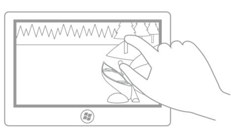
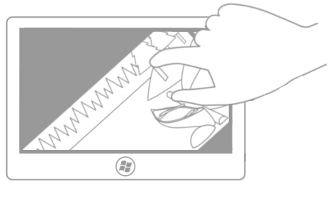
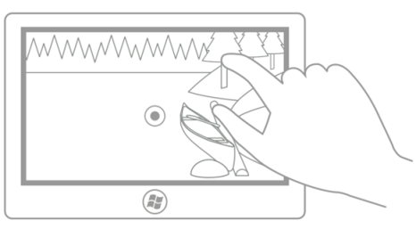

# 회전
<link rel="stylesheet" href="https://az835927.vo.msecnd.net/sites/uwp/Resources/css/custom.css">

이 문서에서는 회전하기 위한 새로운 Windows UI에 대해 설명하고 UWP 앱에서 이러한 새로운 조작 방식 메커니즘을 사용할 때 고려해야 할 사용자 환경 지침을 제공합니다.

<b>중요 API</b> 
<ul>
<li>[**Windows.UI.Input**](https://msdn.microsoft.com/library/windows/apps/br242084)</li>
<li>[**Windows.UI.Xaml.Input**](https://msdn.microsoft.com/library/windows/apps/br227994)</li>
</ul>

## 권장 사항 및 금지 사항

-   사용자들이 UI 요소를 직접 회전하는 데 도움을 주려는 경우 회전을 사용합니다.

## 추가 사용법 지침

**회전의 개요**

회전은 사용자가 회전 방향(시계 방향 또는 시계 반대 방향)으로 개체를 돌릴 수 있도록 하기 위해 UWP 앱에서 사용되는 터치 최적화 기술입니다.

입력 장치에 따라 회전 조작은 다음 방식으로 수행됩니다.

-   선택한 개체의 회전 위치 조정 막대를 이동하려는 경우 마우스 또는 액티브 펜/스타일러스
-   회전 동작을 사용하여 원하는 방향으로 개체를 돌리려는 경우 터치식 또는 패시브 펜/스타일러스

**회전을 사용하는 경우**

사용자들이 UI 요소를 직접 회전하는 데 도움을 주려는 경우 회전을 사용합니다. 다음 다이어그램은 회전 조작 시 지원되는 손가락 위치를 보여 줍니다.

**참고**  
간단히 말해서 대부분의 경우 회전 지점은 사용자가 접촉 지점과 관련되지 않은 회전 지점을 지정할 수 있는 경우(예: 그리기 또는 레이아웃 응용 프로그램)가 아니면 두 가지 터치 지점 중 하나가 됩니다. 다음 이미지는 이러한 방식으로 회전 지점이 제한되지 않을 경우 사용자 환경이 어떻게 저하될 수 있는지를 보여 줍니다.

첫 번째 그림은 엄지손가락과 집게손가락의 터치 지점을 보여 줍니다. 집게손가락은 나무를 터치하고 엄지손가락은 통나무를 터치하고 있습니다.

두 번째 그림에서는 초기(엄지 손가락) 터치 지점에 대해 회전이 수행되었습니다. 회전 후에 검지 손가락은 여전히 나무 줄기를 터치하고 있고 엄지 손가락도 여전히 통나무(회전 지점)를 터치하고 있습니다.

세 번째 그립에서는 회전 중심이 응용 프로그램에 의해(또는 사용자가 설정) 그림의 중심점으로 정의되었습니다. 회전한 후에 그림은 손가락 중 하나로 인해 회전되지 않았으므로 직접 조작했다는 착시 효과가 깨집니다(사용자가 이 설정을 선택하지 않은 경우).

마지막 그립에서는 회전 중심이 응용 프로그램에 의해(또는 사용자가 설정) 그림 왼쪽 가장자리 중앙에 있는 지점으로 정의되었습니다. 마찬가지로 사용자가 이 설정을 선택한 것이 아니므로 직접 조작했다는 착시 효과가 깨집니다.

 

Windows 8에서는 자유형, 제한형 및 조합형의 세 가지 회전 유형을 지원합니다.

<table>
<colgroup>
<col width="50%" />
<col width="50%" />
</colgroup>
<thead>
<tr class="header">
<th align="left">유형</th>
<th align="left">설명</th>
</tr>
</thead>
<tbody>
<tr class="odd">
<td align="left">자유형 회전</td>
<td align="left">
자유형 회전을 사용하면 어디에서든지 360도 방향으로 콘텐츠를 자유롭게 회전할 수 있습니다. 사용자가 개체를 놓으면 개체는 선택된 위치에 남아 있습니다. 자유형 회전은 Microsoft PowerPoint, Word, Visio 및 Paint와 Adobe Photoshop, Illustrator, Flash와 같은 그리기 및 레이아웃 응용 프로그램에 유용합니다.
</td>
</tr>
<tr class="even">
<td align="left">제한형 회전</td>
<td align="left">
제한형 회전은 조작 중에 자유로운 회전을 지원하지만 개체를 놓으면 끌기 지점이 90도 간격(0, 90, 180, 270)으로 바뀝니다. 사용자가 개체를 놓으면 개체는 자동으로 가장 가까운 끌기 지점으로 회전합니다.

제한형 회전은 가장 일반적인 회전 방법이며 콘텐츠 스크롤과 비슷하게 기능합니다. 끌기 지점은 부정확한 측면이 있지만 목표에 도달할 수 있도록 합니다. 제한형 회전은 웹 브라우저 및 사진 앨범과 같은 응용 프로그램에 유용합니다.
</td>
</tr>
<tr class="odd">
<td align="left">조합형 회전</td>
<td align="left">
조합형 회전은 제한된 회전에 의해 적용된 각각의 90도 끌기 지점에서 구역을 통한 자유형 회전([이동에 대한 지침](guidelines-for-panning.md)의 이동 경로와 비슷)을 지원합니다. 사용자가 90도 구역 중 하나 밖에서 개체를 놓으면 개체는 해당 위치에 그대로 남아 있고 그렇지 않은 경우 자동으로 끌기 지점으로 회전합니다.

<strong>참고</strong>  사용자 인터페이스 이동 경로는 대상 주변 영역이 선택에 영향을 미칠 수 있는 특정 값이나 위치로의 이동을 제한하는 기능입니다.

 

</td>
</tr>
</tbody>
</table>

 

## 관련 항목

**샘플**
* [기본 입력 샘플](http://go.microsoft.com/fwlink/p/?LinkID=620302)
* [짧은 대기 시간 입력 샘플](http://go.microsoft.com/fwlink/p/?LinkID=620304)
* [사용자 조작 모드 샘플](http://go.microsoft.com/fwlink/p/?LinkID=619894)
* [포커스 화면 효과 샘플](http://go.microsoft.com/fwlink/p/?LinkID=619895)

**보관 샘플**
* [입력: XAML 사용자 입력 이벤트 샘플](http://go.microsoft.com/fwlink/p/?linkid=226855)
* [입력: 디바이스 기능 샘플](http://go.microsoft.com/fwlink/p/?linkid=231530)
* [입력: 터치 적중 횟수 테스트 샘플](http://go.microsoft.com/fwlink/p/?linkid=231590)
* [XAML 스크롤, 이동 및 확대/축소 샘플](http://go.microsoft.com/fwlink/p/?linkid=251717)
* [입력: 간단한 잉크 샘플](http://go.microsoft.com/fwlink/p/?linkid=246570)
* [입력: GestureRecognizer를 사용한 조작 및 제스처](http://go.microsoft.com/fwlink/p/?LinkId=264995)
* [입력: 조작 및 제스처(C++) 샘플](http://go.microsoft.com/fwlink/p/?linkid=231605)
* [DirectX 터치 입력 샘플](http://go.microsoft.com/fwlink/p/?LinkID=231627)
 

 

