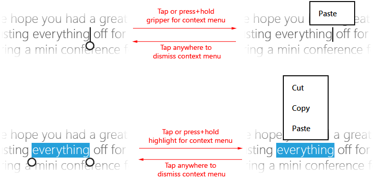

# 시각적 피드백에 대한 지침

시각적 피드백을 사용하여 조작이 감지, 해석 및 처리될 때 사용자에게 표시할 수 있습니다. 시각적 피드백은 조작 의지를 북돋아 사용자에게 도움이 될 수 있습니다. 시각적 피드백은 조작이 성공했음을 표시하여 사용자의 제어 감각을 향상합니다. 또한 시스템 상태를 전달하고 오류를 줄여 줍니다.

**중요 API**

-   [**Windows.Devices.Input**](https://msdn.microsoft.com/library/windows/apps/br225648)
-   [**Windows.UI.Input**](https://msdn.microsoft.com/library/windows/apps/br242084)
-   [**Windows.UI.Core**](https://msdn.microsoft.com/library/windows/apps/br208383)

## 권장 사항 및 금지 사항

-   접촉이 아무리 짧아도 시각적 피드백을 제공합니다. 이렇게 하면 사용자가 다음 작업을 하는 데 도움이 됩니다.
    -   터치 스크린이 제대로 작동하고 있는지 확인합니다.
    -   대상에 터치를 사용할 수 있는지 또는 대상이 응답하는지 식별합니다.
    -   사용자가 의도한 대상을 빗나갔는지 확인합니다.
-   모든 조작 이벤트에 대해 즉시 피드백을 표시합니다.
-   사용자에게 방해가 되지 않는 교묘하고 직관적인 신호로 구성된 피드백을 제공합니다.
-   모든 조작 중에 터치 대상이 손가락에 붙어 있도록 합니다.
-   이동이 한 방향으로 제한되면 살짝 밀기 제스처로 항목을 선택할 수 있습니다.
-   앱 사용에 방해가 될 수 있는 경우에는 터치 시각화를 사용하지 마세요. 자세한 내용은 [**ShowGestureFeedback**](https://msdn.microsoft.com/library/windows/apps/br241969)를 참조하세요.
-   반드시 필요한 경우가 아니면 피드백을 표시하지 마세요. 다른 곳에서 제공되지 않는 가치를 추가하는 경우가 아니면 시각적 피드백을 표시하지 않고 UI를 깔끔하고 간결하게 유지합니다. 이미 표시되는 텍스트를 반복하는 경우 도구 설명을 표시하지 마세요. 도구 설명은 항목을 선택할 경우 표시되지 않는 잘린 텍스트(줄임표가 있는 텍스트), 앱을 이해하거나 사용하기 위해 추가 정보 필요 등 특정한 경우에만 사용해야 합니다.
-   정보용 UI 이외의 항목에 길게 누르기 제스처를 사용하지 마세요.  
    **중요** 길게 누르기는 가로 및 세로 이동을 사용하는 경우 선택에 사용할 수 있습니다.    
-   기본 제공 Windows 8 제스처의 시각적 피드백 동작을 사용자 지정하지 마세요. 사용자 지정하면 일관되지 않고 혼란을 주는 사용자 환경이 생성될 수 있습니다.
-   이동하거나 끄는 동안에는 시각적 피드백을 표시하지 마세요. 화면에서 개체를 실제로 이동하는 것만으로도 충분합니다. 하지만 콘텐츠 영역이 이동하거나 스크롤되지 않는 경우 시각화를 사용하여 경계 조건을 표시합니다. 자세한 내용은 [이동에 대한 지침](guidelines-for-panning.md)을 참조하세요.
-   대상으로 식별되지 않은 컨트롤에 대해서는 피드백을 표시하지 마세요. 위치에 따라 정확도와 정밀도를 요구하는 활동에 터치식 입력을 사용할 경우 시각적 피드백이 중요합니다. 터치식 입력이 감지될 때마다 피드백을 표시하면 사용자가 앱 및 컨트롤이 정의하는 사용자 지정 타기팅 추론을 이해하는 데 도움이 됩니다.
-   피드백 동작은 하나의 입력 유형에 대해서만 사용하세요. 예를 들어 키보드 포커스 사각형은 터치가 아닌 키보드 입력에서만 사용해야 합니다.

## 추가 사용법 지침

접촉 시각화는 정확도 및 정밀도를 요구하는 터치 조작에 특히 중요합니다. 예를 들어 앱은 사용자가 대상을 빗나갔는지 여부, 빗나간 간격 및 필요한 조정을 알 수 있도록 탭 위치를 명확하게 표시해야 합니다.

Windows 스토어 앱 언어 프레임워크(JavaScript로 작성한 Windows 스토어 앱 및 C++, C\# 또는 Visual Basic으로 작성한 Windows 스토어 앱)를 통해 표시된 플랫폼 컨트롤을 사용하여 Windows 8 시각화를 무료로 가져옵니다. 앱에서 사용자 지정 피드백이 필요한 사용자 지정 조작을 사용하는 경우 피드백이 적절하고 여러 입력 디바이스를 포괄하며 사용자 주의를 분산시키지 않는지 확인해야 합니다. 이 사항은 시각적 피드백이 중요한 UI와 충돌하거나 가릴 수 있는 게임 또는 그리기 앱에서 특히 문제가 됩니다.

[!IMPORTANT] 기본 제공 제스처의 조작 동작은 변경하지 않는 것이 좋습니다. 

### 피드백 UI

피드백 UI는 일반적으로 입력 디바이스(터치, 터치 패드, 마우스, 펜/스타일러스, 키보드 등)에 따라 달라집니다. 예를 들어 마우스에 대한 기본 제공 피드백은 대체로 커서 이동 및 변경인 반면 터치와 펜에는 접촉 시각화가 필요하고 키보드 입력 및 탐색은 포커스 사각형과 강조 표시를 사용합니다.

[
            **ShowGestureFeedback**](https://msdn.microsoft.com/library/windows/apps/br241969)을 사용하여 플랫폼 제스처에 대한 피드백 동작을 설정합니다.

피드백 UI를 사용자 지정하는 경우 모든 입력 모드를 지원하고 모든 입력 모드에 적합한 피드백을 제공해야 합니다.

다음은 Windows에 포함된 몇 가지 기본 제공 접촉 시각화의 예입니다.

|  |  |  |  | 
| --- | --- | --- | --- |
| 터치 시각화 | 마우스/터치 패드 시각화 | 펜 시각화 | 키보드 시각화 |

### 정보용 UI(팝업)

시각적 피드백의 주요 형식 중 하나는 정보용 UI(또는 명확성 UI)입니다. 정보용 UI는 개체에 대한 정보를 식별 및 표시하고, 기능과 액세스 방법을 설명하고, 필요한 경우 지침을 제공합니다.

다음은 Windows 스토어 앱이 지원하는 여러 가지 정보용 UI 유형입니다.

-   도구 설명
-   풍부한 도구 설명
-   메뉴
-   메시지 대화 상자
-   플라이아웃

정보용 UI는 특히 손가락 폐색(가려짐)을 피하고 앱의 터치 조작을 향상시키는 데 유용합니다. 전용 기본 제공 제스처인 길게 누르기도 있습니다.

길게 누르기는 시간이 제한된 조작이며, 일반적으로 Windows 8에서 사용하지 않는 것이 좋습니다. 시간이 제한된 조작은 학습 및 탐색을 위한 도구로 사용되는 이러한 경우에 적합합니다. 권장 기간은 정보용 UI의 유형에 따라 달라집니다. 다음은 권장 시간 임계값입니다.

| 정보용 UI 유형 | 타이밍 | 활성화 | 사용 |
| --- | --- | --- | --- |
| 스크러빙 및 작은 대상을 위한 폐색 도구 설명 | 0ms | 예 | 빠른 동작 설명을 위해 제공됩니다. 일반적으로 명령에 사용됩니다. |
| 동작에 대한 폐색 도구 설명 | 200ms | 예 | |
| 풍부한 도구 설명 | ~2000ms | 아니요 | 더 천천히 신중하게 생각해야 하는 탐색 및 학습을 위해 제공됩니다. 일반적으로 컬렉션 항목과 함께 사용됩니다. |
| 자체 노출 조작 | ~2000ms | 아니요 | |
| 상황에 맞는 메뉴 | ~2000ms | 아니요 | 선택된 개체와 관련된 제한된 명령 집합을 표시합니다. |
| 플라이아웃 | ~2000ms | 아니요 | 선택된 개체와 관련된 제한된 명령 집합을 표시합니다. |

정보용 UI 제공에 대한 자세한 내용은 [UI 배치](https://msdn.microsoft.com/library/windows/apps/hh465304) 및 [팝업 표시](https://msdn.microsoft.com/library/windows/apps/hh738362)를 참조하세요.

### 도구 설명

사용자에게 작업을 수행하도록 요청하기 전에 컨트롤에 대한 추가 정보를 도구 설명에 표시하세요.

도구 설명([**Tooltip**](https://msdn.microsoft.com/library/windows/apps/br229763))은 사용자가 컨트롤이나 개체에 대해 길게 누르기 제스처를 수행하거나 가리키기 이벤트가 검색될 때 자동으로 나타납니다. 접촉 또는 커서가 컨트롤이나 개체를 벗어나면 도구 설명이 사라집니다. 도구 설명에는 텍스트와 이미지가 포함될 수 있지만 대화형은 아닙니다.

### 작은 대상을 위한 폐색 도구 설명

폐색 도구 설명은 폐색된 대상을 설명합니다. 이러한 도구 설명은 웹 페이지의 하이퍼링크처럼 표준 터치 대상 크기보다 더 작은 항목을 대상으로 지정하고 활성화할 때 유용합니다.

정해진 시간 임계값이 경과된 후에 이러한 도구 설명을 정보용 팝업으로 바꿀 수 있습니다. 예를 들어 폐색 도구 설명을 사용하여 하이퍼링크의 폐색된 텍스트를 표시한 다음 도구 설명을 URL이 포함된 팝업으로 바꿉니다.

### 동작 및 명령에 대한 폐색 도구 설명

이러한 도구 설명은 사용자가 요소에서 손가락을 뗄 때 발생하는 동작이나 명령을 설명합니다. 또한 단추나 이와 유사한 컨트롤을 대상으로 지정하고 활성화할 때 유용합니다.

작은 대상용 도구 설명이 표시되고 일정한 시간 임계값이 경과된 후에 동작 도구 설명이 표시될 수 있습니다. 이 경우 작은 대상용 도구 설명이 확장되어 동작 도구 설명의 추가 정보를 포함해야 합니다.

### 풍부한 도구 설명

이러한 도구 설명은 요소에 대한 보조 정보를 표시합니다. 예를 들어 풍부한 도구 설명은 이미지에 대한 텍스트 설명, 잘린 제목의 원문 또는 대상과 관련된 기타 정보가 될 수 있습니다.

풍부한 도구 설명은 일반적으로 즉시 사용할 수 없어도 되고 너무 빠르게 표시되면 주의를 분산시킬 수 있는 정보를 포함합니다. 시간 임계값이 길수록 사용자가 정보를 얻는 방법에 대해 좀 더 신중하게 생각할 여유가 생깁니다.

풍부한 도구 설명이 표시된 후에는 사용자가 손가락을 떼도 개체가 더 이상 활성화되지 않습니다. 그 이유는 도구 설명에서 얻은 정보 때문에 사용자가 해당 항목을 활성화하지 않을 수 있기 때문입니다.

풍부한 도구 설명의 시각적 디자인과 포함된 정보는 명확하고 표준 도구 설명보다 좀 더 풍부한 내용을 담고 있는 것이 좋습니다.

### 상황에 맞는 메뉴

상황에 맞는 메뉴([**PopupMenu**](https://msdn.microsoft.com/library/windows/apps/br208693))는 Windows 스토어 앱에서 텍스트 또는 UI 개체에 대한 작업(예: 클립보드 명령)에 바로 액세스할 수 있는 경량 메뉴입니다.

터치 최적화된 상황에 맞는 메뉴는 두 부분으로 구성되어 있습니다. 시각 신호인 힌트는 길게 누르기 조작의 결과로 표시됩니다. 힌트가 사라지고 사용자가 손가락을 떼면 상황에 맞는 메뉴 자체가 표시됩니다.

다음 그림은 선택 영역 내부나 위치 조정 막대를 탭하여 텍스트에 대한 기본 상황에 맞는 메뉴를 호출하는 방법을 보여 줍니다(길게 누르기를 사용할 수도 있음).

[상황에 맞는 메뉴 추가](https://msdn.microsoft.com/library/windows/apps/hh465300)를 참조하세요.

### 메시지 대화 상자

메시지 대화 상자([**MessageDialog**](https://msdn.microsoft.com/library/windows/apps/br208674))를 사용하여 계속하기 전에 사용자 작업이나 앱 상태에 따라 사용자 응답을 확인하는 메시지를 표시할 수 있습니다. 명시적 사용자 조작이 필요하며, 사용자가 응답할 때까지 앱에 대한 입력이 차단됩니다.

다음은 메시지 대화 상자를 표시하는 몇 가지 일반적인 이유입니다.

-   긴급한 정보 제공
-   실행을 계속하기 전에 확인
-   오류 메시지 표시

[메시지 대화 상자 추가](https://msdn.microsoft.com/library/windows/apps/hh738361)를 참조하세요.

### 플라이아웃

플라이아웃([**Flyout**](https://msdn.microsoft.com/library/windows/apps/br211726))은 탭하기, 클릭 또는 기타 활성화 시 표시되고 정보, 질문 또는 현재 활동과 관련된 옵션 메뉴를 사용자에게 제공하는 데 사용되는 경량 UI 패널입니다. 가볍게 해제할 수 있습니다(사용자가 플라이아웃 패널 바깥쪽을 터치 또는 클릭하거나 Esc 키를 누르면 사라짐). 즉, 플라이아웃은 무시할 수 있습니다.

도구 설명과 달리 플라이아웃은 입력을 받을 수 있습니다. 메시지 대화 상자와 달리 앱이 여전히 활성 상태이며 입력을 받아들입니다.

[플라이아웃 및 메뉴 추가](https://msdn.microsoft.com/library/windows/apps/hh465325)를 참조하세요.

## 관련 문서

**디자이너용**
* [이동에 대한 지침](guidelines-for-panning.md)

**개발자용**
* [사용자 지정 사용자 조작](https://msdn.microsoft.com/library/windows/apps/mt185599)

**샘플**
* [기본 입력 샘플](http://go.microsoft.com/fwlink/p/?LinkID=620302)
* [짧은 대기 시간 입력 샘플](http://go.microsoft.com/fwlink/p/?LinkID=620304)
* [사용자 조작 모드 샘플](http://go.microsoft.com/fwlink/p/?LinkID=619894)
* [포커스 화면 효과 샘플](http://go.microsoft.com/fwlink/p/?LinkID=619895)

**보관 샘플**
* [입력: XAML 사용자 입력 이벤트 샘플](http://go.microsoft.com/fwlink/p/?linkid=226855)
* [입력: 디바이스 기능 샘플](http://go.microsoft.com/fwlink/p/?linkid=231530)
* [입력: 터치 적중 횟수 테스트 샘플](http://go.microsoft.com/fwlink/p/?linkid=231590)
* [XAML 스크롤, 이동 및 확대/축소 샘플](http://go.microsoft.com/fwlink/p/?linkid=251717)
* [입력: 간단한 잉크 샘플](http://go.microsoft.com/fwlink/p/?linkid=246570)
* [입력: Windows 8 제스처 샘플](http://go.microsoft.com/fwlink/p/?LinkId=264995)
* [입력: 조작 및 제스처(C++) 샘플](http://go.microsoft.com/fwlink/p/?linkid=231605)
* [DirectX 터치 입력 샘플](http://go.microsoft.com/fwlink/p/?LinkID=231627)
 

 

<!--HONumber=May16_HO2-->

