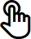

---
UWP(유니버설 Windows 플랫폼)에서 사용자 조작은 환경을 확장할 수 있는 다양한 모드 또는 한정자(마우스 휠 및 단추, 펜 지우개 및 펜 단추, 터치 키보드 및 백그라운드 앱 서비스)와 함께 입력 및 출력 소스(마우스, 키보드, 펜, 터치, 터치 패드, 음성, Cortana, 컨트롤러, 제스처, 응시 등)를 조합한 것입니다.
조작 입문서
ms.assetid: 73008F80-FE62-457D-BAEC-412ED6BAB0C8
조작 입문서
template: detail.hbs
---

# 조작 입문서

\[ Windows 10의 UWP 앱에 맞게 업데이트되었습니다. Windows 8.x 문서는 [보관](http://go.microsoft.com/fwlink/p/?linkid=619132)을 참조하세요. \]

UWP(유니버설 Windows 플랫폼)에서 사용자 조작은 환경을 확장할 수 있는 다양한 모드 또는 한정자(마우스 휠 및 단추, 펜 지우개 및 펜 단추, 터치 키보드 및 백그라운드 앱 서비스)와 함께 입력 및 출력 소스(마우스, 키보드, 펜, 터치, 터치 패드, 음성, **Cortana**, 컨트롤러, 제스처, 응시 등)를 조합한 것입니다.

UWP는 "스마트"한 상황별 상호 작용 시스템을 사용하여 대부분의 경우에 앱에서 수신하는 고유한 입력 유형을 개별적으로 처리할 필요가 없습니다. 터치, 터치 패드, 마우스 및 펜 입력을 일반적인 포인터 형식으로 처리하여 탭이나 길게 누르기와 같은 정적 제스처, 밀어서 이동하기와 같은 조작 제스처 또는 디지털 잉크 렌더링을 지원하는 것도 여기에 포함됩니다.

특정 폼 팩터와 짝을 이룰 경우 각 입력 장치 유형 및 동작, 기능 및 제한 사항을 알아보세요. 이 작업은 플랫폼 컨트롤 및 어포던스가 앱에 충분한지, 아니면 사용자 지정 조작 환경을 제공해야 하는지 결정하는 데 유용할 수 있습니다.

##      Cortana

Windows 10에서 **Cortana** 확장성을 통해 사용자의 음성 명령을 처리하고 응용 프로그램을 시작하여 단일 작업을 수행할 수 있습니다.

디바이스 지원
-   휴대폰 및 패블릿
-   태블릿
-   PC와 노트북
-   Surface Hub
-   IoT
-   Xbox
-   HoloLens

일반적인 용도
음성 명령은 **Cortana**를 통해 설치된 앱에 대한 VCD(음성 명령 정의) 파일에 정의된 한 번의 말하기입니다. 조작의 수준 및 복잡성에 따라 앱은 포그라운드 또는 백그라운드에서 시작될 수 있습니다. 예를 들어 추가 컨텍스트 또는 사용자 입력을 요구하는 음성 명령은 포그라운드에서 가장 잘 처리되는 반면, 기본 명령은 백그라운드에서 처리될 수 있습니다.

앱의 기본 기능을 통합하고 사용자가 앱을 직접 열지 않고도 대부분의 작업을 수행할 수 있는 중앙 진입점을 제공하면 **Cortana**가 앱과 사용자 간의 연락을 담당하는 역할을 할 수 있습니다. 많은 경우 이렇게 하면 사용자의 시간과 노력을 상당히 줄일 수 있습니다. 자세한 내용은 [Cortana 디자인 지침](https://msdn.microsoft.com/library/windows/apps/dn974233)을 참조하세요.

추가 정보
[Cortana 디자인 지침](https://msdn.microsoft.com/library/windows/apps/dn974233)
 

##      음성

음성은 사람들이 응용 프로그램을 조작하는 효과적이고 자연스러운 방법입니다. 응용 프로그램과 통신하는 쉽고 정확한 방법이며 다양한 상황에서 사람들이 생산성을 유지하고 최신 정보를 얻을 수 있도록 합니다.

음성은 보완 장치로 사용되거나 대부분의 경우에 사용자의 장치에 따라 기본 입력 장치로 사용될 수 있습니다. 예를 들어 HoloLens 및 Xbox와 같은 장치는 기존의 입력 유형(특정 시나리오에서 소프트웨어 키보드 외에)을 지원하지 않습니다. 대신 대부분의 사용자 조작에 대해 음성 입력 및 출력(종종 시선 및 제스처와 같은 일반적이지 않은 입력 유형과 결합)을 사용합니다.

텍스트 음성 변환(TTS 또는 음성 합성이라고도 함)은 사용자에게 알리거나 안내할 때 사용됩니다.

장치 지원
-   휴대폰 및 패블릿
-   태블릿
-   PC와 노트북
-   Surface Hub
-   IoT
-   Xbox
-   HoloLens

일반적인 용도

음성 조작에는 세 가지 모드가 있습니다.

     자연어  
자연어는 정기적으로 사람들과 구두로 상호 작용하는 방법입니다. 음성은 사람마다 그리고 상황마다 다르며 일반적으로 이해할 수 있습니다. 그렇지 않은 경우 동일한 아이디어를 나타내는 데 종종 다른 단어와 단어 순서를 사용하기도 합니다.

자연어로 앱을 조작하는 것은 마치 사람에게 하는 것처럼 디바이스를 통해 앱에 말하고 그에 따라 이해하여 반응하기를 원하는 점에서 유사합니다.

자연어는 가장 뛰어난 음성 조작 모드이며 **Cortana**를 통해 구현되고 표시될 수 있습니다.

     명령 및 제어  
명령 및 제어는 음성 명령을 사용하여 단추를 클릭하거나 메뉴 항목을 선택하는 등의 컨트롤 및 기능을 활성화하는 것입니다.

성공적인 사용자 환경에서는 명령 및 제어가 중요하므로 단일 입력 형식은 일반적으로 권장되지 않습니다. 음성은 일반적으로 기본 설정이나 하드웨어 기능을 기반으로 사용자에게 제공되는 여러 가지 입력 옵션 중 하나입니다.

     받아쓰기  
가장 기본적인 음성 입력 방법입니다. 각 말하기가 텍스트로 변환됩니다.

받아쓰기는 일반적으로 앱이 의미나 의도를 이해할 필요가 없을 때 사용됩니다.

추가 정보
[음성 디자인 지침](https://msdn.microsoft.com/library/windows/apps/dn596121)
 

##      펜

펜(또는 스타일러스)은 마우스와 같은 픽셀 단위의 정밀성을 지닌 포인팅 디바이스 역할을 할 수 있으며 디지털 잉크 입력에 최적화된 디바이스입니다.

**참고** 펜 디바이스의 유형으로는 활성과 수동 두 가지가 있습니다.
-   수동 펜은 전자 디바이스를 포함하지 않으며 손가락의 터치식 입력을 효과적으로 에뮬레이트합니다. 접촉 압력을 기반으로 입력을 인식하는 기본 장치 디스플레이가 필요합니다. 사용자가 입력 표면에 무언가를 쓰는 것처럼 손을 두는 경우 입력 데이터가 실패한 팜 거부로 인해 훼손될 수 있습니다.
-   활성 펜은 전자 장치를 포함하며 복잡한 장치 디스플레이와 함께 작동하여 훨씬 더 광범위한 입력 데이터(가리키기 또는 근접 데이터 포함)를 시스템 및 앱에 제공할 수 있습니다. 팜 거부는 훨씬 더 강력합니다.

 

여기서 펜 장치를 지칭하는 경우 풍부한 입력 데이터를 제공하고 주로 정밀한 잉크 및 포인팅 조작에 사용되는 활성 펜을 의미합니다.

장치 지원
-   휴대폰 및 패블릿
-   태블릿
-   PC와 노트북
-   Surface Hub
-   IoT

일반적인 용도
펜과 더불어 Windows 잉크 플랫폼은 필기 메모, 드로잉 및 주석을 만드는 자연스러운 방법을 제공합니다. 이 플랫폼은 디지타이저 입력에서 잉크 데이터를 캡처하고, 잉크 데이터를 생성하고, 해당 데이터를 출력 장치에 잉크 스트로크로 렌더링하고, 잉크 데이터를 관리하고, 필기 인식을 수행할 수 있도록 지원합니다. 앱은 사용자가 필기를 하거나 그림을 그릴 때 펜의 공간 움직임을 캡처하는 것 외에 압력, 셰이프, 색상 및 불투명도와 같은 정보를 수집하여 펜, 연필 또는 브러쉬로 종이에 그리는 것과 거의 비슷한 느낌의 사용자 환경을 제공할 수 있습니다.

펜 및 터치식 입력이 분리되는 위치는 해당 개체에 대해 수행된 실제 제스처(예: 살짝 밀기, 밀기, 끌기, 회전 등)를 통해 화면에서 UI 요소의 직접 조작을 에뮬레이트하는 터치의 기능입니다.

이러한 조작을 지원하려면 펜 관련 UI 명령 또는 기능을 제공해야 합니다. 예를 들어 이전 및 다음(또는 + 및 -) 단추를 사용하여 콘텐츠 페이지를 차례로 전환하거나 개체를 회전, 크기 조정 및 확대/축소할 수 있습니다.

추가 정보
[펜 디자인 지침](https://msdn.microsoft.com/library/windows/apps/dn456352)
 

##      터치

터치를 사용할 경우 하나 이상의 손가락을 사용한 물리적 제스처로 UI 요소의 직접 조작(예: 이동, 회전, 크기 조정)을 에뮬레이트하거나, 이러한 제스처를 대체 입력 방법(마우스 또는 펜과 유사함) 또는 보조 입력 방법(펜으로 그린 잉크 스트로크를 문지르는 등 다른 입력 측면을 수정)으로 사용할 수 있습니다. 이와 같은 촉각 환경은 사용자가 화면의 요소를 조작할 때 보다 자연스러운 실제 느낌을 제공할 수 있습니다.

장치 지원
-   휴대폰 및 패블릿
-   태블릿
-   PC와 노트북
-   Surface Hub
-   IoT

일반적인 용도
터치식 입력에 대한 지원은 장치에 따라 크게 달라질 수 있습니다.

일부 장치는 터치를 전혀 지원하지 않고 일부 장치는 단일 터치 접촉을 지원하는 반면에 또 다른 장치는 멀티 터치(두 번 이상의 접촉)를 지원합니다.

멀티 터치 입력을 지원하는 대부분의 장치는 일반적으로 10개의 고유한 동시 접촉을 인식합니다.

Surface Hub 장치는 100개의 고유한 동시 터치 접촉을 인식합니다.

일반적으로 터치는 다음 특징이 있습니다.

-   공동 작업이 강조되는 Surface Hub와 같은 Microsoft Team 장치와 함께 사용되지 않는 한 단일 사용자입니다.
-   장치 방향으로 제한되지 않습니다.
-   텍스트 입력(터치 키보드) 및 수동 입력(앱 구성)을 포함하여 모든 조작에 사용됩니다.

추가 정보
[터치 디자인 지침](https://msdn.microsoft.com/library/windows/apps/hh465370)
 

##      터치 패드

터치 패드는 간접 멀티 터치 입력을 마우스와 같은 포인팅 디바이스의 정밀도 입력과 결합합니다. 이러한 결합을 통해 터치 패드는 터치 최적화된 UI와 생산성 앱의 작은 대상에 모두 적합합니다.

장치 지원
-   PC와 노트북
-   IoT

일반적인 용도
터치 패드는 일반적으로 개체 및 UI의 직접 조작에 대한 터치와 유사한 지원을 제공하는 일련의 터치 제스처를 지원합니다.

터치 패드에서 지원하는 이 조작 환경 수렴 때문에 전적으로 터치식 입력에만 의존할 것이 아니라 마우스 스타일 UI 명령 또는 기능도 제공하는 것이 좋습니다. 이러한 조작을 지원하려면 터치 패드 관련 UI 명령 또는 기능을 제공하세요.

이러한 조작을 지원하려면 마우스 관련 UI 명령 또는 기능을 제공해야 합니다. 예를 들어 이전 및 다음(또는 + 및 -) 단추를 사용하여 콘텐츠 페이지를 차례로 전환하거나 개체를 회전, 크기 조정 및 확대/축소할 수 있습니다.

추가 정보
[터치 패드 디자인 지침](https://msdn.microsoft.com/library/windows/apps/dn456353)
 

##      키보드

키보드는 텍스트를 위한 기본 입력 디바이스이며, 일반적으로 키보드가 앱을 조작하는 보다 빠르고 효율적인 방법이라고 생각하는 사용자나 일정한 장애가 있는 사람들에게는 필수 도구입니다.

Windows 10 Mobile 장치와 호환 가능한 새로운 환경인 [휴대폰용 Continuum](http://go.microsoft.com/fwlink/p/?LinkID=699431)을 사용하여 사용자는 휴대폰을 마우스와 키보드에 연결하여 노트북처럼 사용할 수 있습니다.

장치 지원
-   휴대폰 및 패블릿
-   태블릿
-   PC와 노트북
-   Surface Hub
-   IoT
-   Xbox
-   HoloLens

일반적인 용도
사용자는 하드웨어 키보드 및 두 가지 가상 키보드(OSK(화상 키보드) 및 터치 키보드)를 통해 유니버설 Windows 앱을 조작할 수 있습니다.

OSK는 실제 키보드 대신 터치, 마우스, 펜/스타일러스 또는 기타 포인팅 장치로 데이터를 입력하는 데 사용할 수 있는 시각적 가상 키보드입니다(터치 스크린이 필요하지 않음). 실제 키보드가 없는 시스템이나 움직일 수 없어서 일반적인 입력 장치를 사용할 수 없는 사용자는 OSK를 사용할 수 있습니다. OSK는 하드웨어 키보드의 기능을 전부는 아니라도 대부분 에뮬레이트합니다.

터치 키보드는 터치식 입력과 함께 텍스트 입력에 사용되는 시각적 가상 키보드입니다. 터치 키보드는 텍스트 입력에만 사용되고(하드웨어 키보드를 에뮬레이트하지 않음) 텍스트 필드나 다른 편집 가능한 텍스트 컨트롤에 포커스가 있을 때만 표시되므로 OSK를 대체하지 않습니다. 터치 키보드는 앱 또는 시스템 명령을 지원하지 않습니다.

**참고** OSK는 터치 키보드보다 우선하며, 현재 OSK가 사용 중이면 터치 키보드는 나타나지 않습니다.

 

일반적으로 키보드는 다음 특징이 있습니다.

-   단일 사용자입니다.
-   장치 방향으로 제한되지 않습니다.
-   텍스트 입력, 탐색, 게임 플레이 및 접근성에 사용됩니다.
-   사전 또는 사후에 항상 사용할 수 있습니다.

추가 정보
[키보드 디자인 지침](https://msdn.microsoft.com/library/windows/apps/hh972345)
 

##      마우스

마우스는 사용자 조작에 따라 타기팅 및 명령에 픽셀 수준 정밀도가 필요한 고밀도 UI 및 생산성 앱을 지원해야 하는 경우에 가장 적합합니다.

장치 지원
-   휴대폰 및 패블릿
-   태블릿
-   PC와 노트북
-   Surface Hub
-   IoT

일반적인 용도
다양한 키보드 키(Ctrl, Shift, Alt 등)를 추가하여 마우스 입력을 수정할 수 있습니다. 이러한 키를 마우스 왼쪽 단추, 마우스 오른쪽 단추, 휠 단추 및 X 단추(확장된 마우스에 최적화된 명령 집합의 경우)와 결합할 수 있습니다. 일부 Microsoft 마우스 장치에는 X 단추라는 두 개의 추가 단추가 있으며, 주로 웹 브라우저에서 앞뒤로 이동하는 데 사용됩니다.

펜과 마찬가지로 마우스 및 터치식 입력이 분리되는 위치는 해당 개체에 대해 수행된 실제 제스처(예: 살짝 밀기, 밀기, 끌기, 회전 등)를 통해 화면에서 UI 요소의 직접 조작을 에뮬레이트하는 터치의 기능입니다.

이러한 조작을 지원하려면 마우스 관련 UI 명령 또는 기능을 제공해야 합니다. 예를 들어 이전 및 다음(또는 + 및 -) 단추를 사용하여 콘텐츠 페이지를 차례로 전환하거나 개체를 회전, 크기 조정 및 확대/축소할 수 있습니다.

추가 정보
[마우스 디자인 지침](https://msdn.microsoft.com/library/windows/apps/dn456351)
 

##      제스처

제스처는 응용 프로그램을 제어하거나 조작하기 위한 입력으로 인식되는 모든 형태의 사용자 동작입니다. 제스처는 단순히 손을 사용하여 화면에서 무언가를 타기팅하는 것에서부터 구체적인 학습된 동작 패턴, 장시간 몸 전체를 사용하는 연속 동작에 이르기까지 다양한 형태를 취합니다. 사용자 지정 제스처를 디자인할 때는 해당 의미가 로캘 및 문화권에 따라 다를 수 있으므로 주의해야 합니다.

장치 지원
-   PC와 노트북
-   IoT
-   Xbox
-   HoloLens

일반적인 용도
터치 패드는 일반적으로 개체 및 UI의 직접 조작에 대한 터치와 유사한 지원을 제공하는 일련의 터치 제스처를 지원합니다.

터치 패드에서 지원하는 이 조작 환경 수렴 때문에 전적으로 터치식 입력에만 의존할 것이 아니라 마우스 스타일 UI 명령 또는 기능도 제공하는 것이 좋습니다. 이러한 조작을 지원하려면 터치 패드 관련 UI 명령 또는 기능을 제공하세요.

이러한 조작을 지원하려면 마우스 관련 UI 명령 또는 기능을 제공해야 합니다. 예를 들어 이전 및 다음(또는 + 및 -) 단추를 사용하여 콘텐츠 페이지를 차례로 전환하거나 개체를 회전, 크기 조정 및 확대/축소할 수 있습니다.

 

##      게임 패드/컨트롤러

게임 패드/컨트롤러는 일반적으로 게임 플레이 전용으로 고안된 고도의 특수 디바이스입니다. 그러나 기본 키보드 입력을 에뮬레이트하는 데도 사용되며 키보드와 매우 유사한 UI 탐색 환경을 제공합니다.

장치 지원
-   PC와 노트북
-   IoT
-   Xbox

일반적인 용도
터치 패드는 일반적으로 개체 및 UI의 직접 조작에 대한 터치와 유사한 지원을 제공하는 일련의 터치 제스처를 지원합니다.

터치 패드에서 지원하는 이 조작 환경 수렴 때문에 전적으로 터치식 입력에만 의존할 것이 아니라 마우스 스타일 UI 명령 또는 기능도 제공하는 것이 좋습니다. 이러한 조작을 지원하려면 터치 패드 관련 UI 명령 또는 기능을 제공하세요.

이러한 조작을 지원하려면 마우스 관련 UI 명령 또는 기능을 제공해야 합니다. 예를 들어 이전 및 다음(또는 + 및 -) 단추를 사용하여 콘텐츠 페이지를 차례로 전환하거나 개체를 회전, 크기 조정 및 확대/축소할 수 있습니다.

 

##      여러 입력

가능한 한 많은 사용자와 디바이스를 수용하고 가능한 한 많은 입력 유형(제스처, 음성, 터치, 터치 패드, 마우스 및 키보드)과 작동하도록 앱을 디자인하면 유연성, 유용성 및 접근성이 극대화됩니다.

장치 지원
-   휴대폰 및 패블릿
-   태블릿
-   PC와 노트북
-   Surface Hub
-   IoT
-   Xbox
-   HoloLens

일반적인 용도
사람이 서로 커뮤니케이션할 때 음성과 제스처를 결합해서 사용하는 것처럼, 앱을 조작할 때도 여러 유형 및 모드의 입력이 유용할 수 있습니다. 그러나 이러한 결합된 조작은 매우 혼란스러운 환경을 만들 수도 있으므로 가능한 한 직관적이고 자연스러워야 합니다.

\[이 문서에는 UWP 앱 및 Windows 10과 관련된 정보가 있습니다. Windows 8.1 참고 자료는 [Windows 8.1 지침 PDF](https://go.microsoft.com/fwlink/p/?linkid=258743)를 다운로드하세요.\]

 

 

<!--HONumber=Mar16_HO1-->

