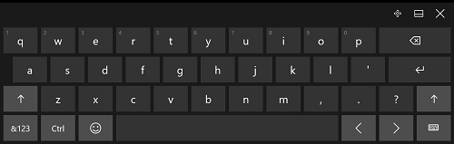
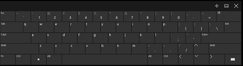
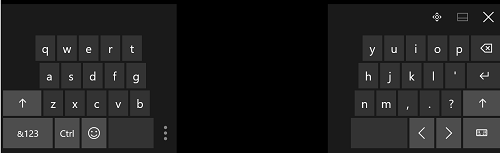

# 키보드 조작


키보드 입력은 앱용 전체 사용자 조작 환경에서 중요한 부분을 차지합니다. 키보드가 앱을 조작하는 보다 효율적인 방법이라고 생각하는 사용자나 특정 장애를 가진 사람들에게는 키보드가 필수 도구입니다. 예를 들어 사용자가 Tab 및 화살표 키를 사용하여 앱을 탐색하고, 스페이스바 및 Enter 키를 사용하여 UI 요소를 활성화하고, 바로 가기 키를 사용하여 명령에 액세스할 수 있어야 합니다.  


**중요 API**

-   [**KeyDown**](https://msdn.microsoft.com/library/windows/apps/br208941)
-   [**KeyUp**](https://msdn.microsoft.com/library/windows/apps/br208942)
-   [**KeyRoutedEventArgs**](https://msdn.microsoft.com/library/windows/apps/hh943072)


잘 디자인된 키보드 UI는 소프트웨어 접근성의 중요한 측면입니다. 시각 장애나 특정 거동 장애가 있는 사용자는 키보드 UI를 사용하여 앱을 탐색하고 기능을 조작할 수 있습니다. 이러한 사용자는 마우스를 작동할 수 없으며 다양한 보조 기술(예: 키보드 향상 도구, 화상 키보드, 화면 확대기, 화면 낭독 프로그램 및 음성 입력 유틸리티)을 대신 사용할 수 있습니다.

사용자는 하드웨어 키보드 및 두 가지 가상 키보드(OSK(화상 키보드) 및 터치 키보드)를 통해 유니버설 앱을 조작할 수 있습니다.

화상 키보드  
화상 키보드는 실제 키보드 대신 터치, 마우스, 펜/스타일러스 또는 기타 포인팅 장치로 데이터를 입력하는 데 사용할 수 있는 시각적 가상 키보드입니다(터치 스크린이 필요하지 않음). 실제 키보드가 없는 시스템이나 움직일 수 없어서 일반적인 입력 디바이스를 사용할 수 없는 사용자는 화상 키보드를 사용할 수 있습니다. 화상 키보드는 하드웨어 키보드의 기능을 전부는 아니라도 대부분 에뮬레이트합니다.

화상 키보드는 설정 &gt; 접근성의 키보드 페이지에서 켤 수 있습니다.

**참고** 화상 키보드는 터치 키보드보다 우선하며, 현재 화상 키보드가 사용 중이면 터치 키보드는 나타나지 않습니다.

 


<sup>화상 키보드</sup>

터치 키보드  
터치 키보드는 터치식 입력과 함께 텍스트 입력에 사용되는 시각적 가상 키보드입니다. 터치 키보드는 텍스트 입력용으로만 사용되므로 화상 키보드를 대체하지 않습니다(하드웨어 키보드를 에뮬레이트하지 않음).

디바이스에 따라, 터치 키보드는 텍스트 필드나 다른 편집 가능한 텍스트 컨트롤이 포커스를 받을 때 또는 사용자가 **알림 센터**를 통해 수동으로 설정할 때 나타납니다.


**참고** 터치 키보드를 자동으로 표시하려면 설정 &gt; 시스템의 **태블릿 모드** 화면으로 이동하여 "태블릿과 같은 디바이스를 사용할 때 Windows에서 더 쉽게 터치할 수 있습니다."를 켜야 할 수 있습니다.

 

앱에서 포커스를 프로그래밍 방식으로 텍스트 입력 컨트롤로 설정하는 경우에는 터치 키보드가 호출되지 않습니다. 이는 사용자가 직접 실시하지 않은 예기치 않은 동작을 제거합니다. 그러나 포커스가 프로그래밍 방식으로 텍스트 입력 컨트롤이 아닌 컨트롤로 이동하는 경우에는 키보드가 자동으로 숨겨집니다.

터치 키보드는 사용자가 양식에서 컨트롤 사이를 이동하는 동안 일반적으로 표시된 상태로 유지됩니다. 이 동작은 양식 내에 있는 다른 컨트롤 형식에 따라 다를 수 있습니다.

다음은 터치 키보드를 사용하는 텍스트 입력 세션 중에 키보드를 해제하지 않고 포커스를 받을 수 있는 비편집 컨트롤 목록입니다. 사용자는 터치 키보드에서 컨트롤과 텍스트 입력 사이를 왔다 갔다 하는 경향이 있으므로 터치 키보드를 뷰에 고정하여 불필요하게 UI를 이리 저리 찾아다니거나 혼란에 빠지지 않게 합니다.

-   확인란
-   콤보 상자
-   라디오 단추
-   스크롤 막대
-   트리
-   트리 항목
-   메뉴
-   메뉴 모음
-   메뉴 항목
-   도구 모음
-   목록
-   목록 항목

다음은 터치 키보드의 다양한 모드의 예입니다. 첫 번째 이미지는 기본 레이아웃이고, 두 번째 이미지는 미리 보기 레이아웃으로 일부 언어에서는 사용할 수 없습니다.

다음은 터치 키보드의 다양한 모드의 예입니다. 첫 번째 이미지는 기본 레이아웃이고, 두 번째 이미지는 미리 보기 레이아웃으로 일부 언어에서는 사용할 수 없습니다.
<table>
<tr>
    <td>**기본 레이아웃 모드의 터치 키보드:  **</td>
    <td></td>
</tr>
<tr>
    <td>**확장 레이아웃 모드의 터치 키보드:  **</td>
    <td></td>
</tr>
<tr>
    <td>**기본 미리 보기 레이아웃 모드의 터치 키보드:  **</td>
    <td></td>
</tr>
<tr>
    <td>**숫자 미리 보기 레이아웃 모드의 터치 키보드:  **</td>
    <td></td>
</tr>
</table>


성공적인 키보드 조작을 통해 사용자는 키보드만 사용하여 기본 앱 시나리오를 수행할 수 있습니다. 즉, 사용자는 모든 대화형 요소에 액세스하고 기본 기능을 활성화할 수 있습니다. 키보드 탐색, 내게 필요한 옵션에 대한 선택키, 고급 사용자를 위한 바로 가기 등 다양한 요소가 성공의 수준에 영향을 미칠 수 있습니다.

**참고** 터치 키보드는 토글 및 대부분의 시스템 명령을 지원하지 않습니다([패턴](#keyboard_command_patterns) 참조).

## 탐색


키보드에서 컨트롤(탐색 요소 포함)을 사용하려면 컨트롤에 포커스가 있어야 합니다. 컨트롤에서 키보드 포커스를 받는 한 가지 방법은 탭 탐색을 통해 액세스할 수 있도록 하는 것입니다. 잘 디자인된 키보드 탐색 모델은 사용자가 앱을 빠르고 효율적으로 탐색 및 사용할 수 있도록 해주는 논리적이고 예측 가능한 탭 순서를 제공합니다.

모든 대화형 컨트롤에는 탭 정지(그룹으로 묶인 경우 제외)가 있어야 하는 반면, 레이블과 같은 비대화형 컨트롤에는 탭 정지가 없어야 합니다.

관련 컨트롤 집합을 컨트롤 그룹으로 만들고 단일 탭 정지를 할당할 수 있습니다. 컨트롤 그룹은 라디오 단추와 같은 단일 컨트롤처럼 작동하는 컨트롤 집합에 사용됩니다. 또한 컨트롤이 너무 많아 Tab 키만으로는 효율적으로 탐색할 수 없는 경우에도 사용될 수 있습니다. 화살표 키, Home, End, Page Up 및 Page Down은 그룹 내의 컨트롤 간에 입력 포커스를 이동합니다(이러한 키를 사용하여 컨트롤 그룹 밖으로 이동할 수는 없음).

앱이 시작되면 사용자가 처음에 직관적으로 상호 작용하거나 가장 먼저 상호 작용하게 되는 요소에 초기 키보드 포커스를 설정해야 합니다. 이는 사용자가 화살표 키를 사용하여 앱 콘텐츠 스크롤을 즉시 시작할 수 있는 앱의 기본 콘텐츠 보기입니다.

잠재적으로 부정적이거나 치명적인 결과를 초래하는 요소에 초기 키보드 포커스를 설정하지 마세요. 그러면 데이터 또는 시스템 액세스 손실을 방지할 수 있습니다.

명령, 컨트롤 및 콘텐츠의 순위를 정하고 탭 순서와 표시 순서(또는 시각적 계층 구조) 모두에서 가장 중요한 항목을 처음에 제공해 보세요. 그러나 실제 표시 위치는 부모 레이아웃 컨테이너 및 레이아웃에 영향을 주는 자식 요소의 특정 속성에 따라 달라질 수 있습니다. 특히, 그리드 메타포 또는 테이블 메타포를 사용하는 레이아웃은 읽기 순서가 탭 순서와 상당히 다를 수 있습니다. 이것이 항상 문제가 되는 것은 아니지만 터치 가능한 UI와 키보드로 액세스 가능한 UI 모두로 앱의 기능을 테스트해야 합니다.

탭 순서는 가능한 경우 읽기 순서를 따라야 합니다. 이는 혼동을 줄일 수 있으며, 로캘 및 언어에 따라 달라집니다.

키보드 단추를 앱의 적절한 UI(뒤로 및 앞으로 단추)에 연결합니다.

최대한 쉽고 간편하게 앱의 시작 화면으로 돌아가고 주요 콘텐츠 간에 이동할 수 있도록 해보세요.

복합 요소의 하위 요소 간의 적절한 내부 탐색을 위해 화살표 키를 바로 가기 키로 사용합니다. 트리 뷰 노드에 확장/축소 처리와 노드 활성화에 대한 별도의 하위 요소가 있는 경우 왼쪽 및 오른쪽 화살표 키를 사용하여 키보드 확장/축소 기능을 제공합니다. 이는 플랫폼 컨트롤과 일치합니다.

터치 키보드는 화면의 많은 부분을 가리기 때문에 UWP(유니버설 Windows 플랫폼)에서는 사용자가 현재 보기에 없는 컨트롤을 포함하여 양식의 컨트롤을 탐색할 때 포커스가 있는 입력 필드가 보기로 스크롤되도록 합니다. 사용자 지정 컨트롤은 이 동작을 에뮬레이트해야 합니다.


경우에 따라 전체 시간 동안 화면에 유지해야 하는 UI 요소가 있습니다. 양식 컨트롤은 이동 영역에 포함되고 중요한 UI 요소는 고정되도록 UI를 디자인해 보세요. 예를 들면 다음과 같습니다.


## 활성화


현재 포커스가 있는지 여부에 상관없이 다양한 방식으로 컨트롤을 활성화할 수 있습니다.

스페이스바, Enter 키 및 Esc 키  
스페이스바는 입력 포커스가 있는 컨트롤을 활성화해야 합니다. Enter 키는 기본 컨트롤 또는 입력 포커스가 있는 컨트롤을 활성화해야 합니다. 기본 컨트롤은 초기 포커스가 있는 컨트롤 또는 Enter 키에만 응답하는 컨트롤입니다(일반적으로 입력 포커스와 함께 변경됨). 또한 Esc 키는 메뉴 및 대화 상자와 같은 일시적인 UI를 닫거나 종료해야 합니다.

여기에 표시된 계산기 앱은 스페이스바를 사용하여 포커스가 있는 단추를 활성화하며, Enter 키를 "=" 단추에 잠그고 Esc 키를 "C" 단추에 잠급니다.


키보드 한정자  
키보드 한정자는 다음 범주로 나뉩니다.


| 범주 | 설명 |
|----------|-------------|
| 바로 가기 키 | UI 없이 일반적인 작업을 수행합니다(예: **저장**의 경우 "Ctrl-S"). 주요 앱 기능에 대한 바로 가기 키를 구현합니다. 일부 명령에는 바로 가기가 없거나 필요하지 않습니다. |   
| 선택키/바로 가기 키 | 표시되는 모든 최상위 컨트롤에 할당됩니다(예: **파일** 메뉴의 경우 "Alt-F"). 선택키는 명령을 호출하거나 활성화하지 않습니다. |
| 바로 가기 키 | 기본 시스템 또는 앱 정의 명령을 수행합니다(예: 화면 캡처의 경우 "Alt-PrtScrn", 앱 전환의 경우 "Alt-Tab", 도움말의 경우 "F1"). 바로 가기 키와 관련된 명령은 메뉴 항목이 아니어도 됩니다. |
| 응용 프로그램 키/메뉴 키 | 상황에 맞는 메뉴를 표시합니다. |
| 창 키/명령 키 | **시스템 메뉴**, **잠금 화면** 또는 **바탕 화면 보기**와 같은 시스템 명령을 활성화합니다. |

선택키와 바로 가기 키는 Tab 키를 사용하여 컨트롤로 이동하는 대신 직접 컨트롤을 조작하는 기능을 지원합니다.
> 명령 단추, 확인란, 라디오 단추 등의 일부 컨트롤에는 내부 레이블이 있는 반면, 목록 보기와 같은 다른 컨트롤에는 외부 레이블이 있습니다. 외부 레이블이 있는 컨트롤에는 호출된 경우 연결된 컨트롤 내의 요소 또는 값으로 포커스를 설정하는 선택키가 레이블에 할당됩니다.


다음 예제에서는 **Word**의 **페이지 레이아웃** 탭에 대한 선택키를 보여 줍니다.


이 예제에서는 연결된 레이블에서 식별된 선택키를 입력한 후 왼쪽에서 들여쓰기 텍스트 필드 값이 강조 표시되어 있습니다.


## 유용성 및 접근성


잘 디자인된 키보드 조작 환경은 소프트웨어 접근성의 중요한 측면입니다. 시각 장애나 특정 거동 장애가 있는 사용자는 키보드 UI를 사용하여 앱을 탐색하고 기능을 조작할 수 있습니다. 이러한 사용자는 마우스를 작동할 수 없으며, 대신 다양한 보조 기술(예: 키보드 향상 도구, 화상 키보드, 화면 확대기, 화면 판독기 및 음성 입력 유틸리티)을 사용해야 합니다. 이러한 사용자에게는 포괄성이 일관성보다 더 중요합니다.

숙련된 사용자는 키보드 기반 명령이 더 빠르게 입력할 수 있고 키보드에서 손을 떼지 않아도 되기 때문에 키보드를 사용하는 것을 더 선호하는 경향이 많습니다. 이러한 사용자에게는 효율성과 일관성이 매우 중요합니다. 포괄성은 가장 자주 사용하는 명령에만 중요합니다.

유용성과 접근성을 디자인할 때는 미묘한 차이가 있으며, 이 때문에 두 가지 키보드 액세스 메커니즘이 지원됩니다.

선택키의 특성은 다음과 같습니다.

-   선택키는 앱의 UI 요소에 대한 바로 가기입니다.
-   선택키는 Alt 키와 영숫자 키를 사용합니다.
-   선택키는 주로 접근성을 위한 기능입니다.
-   선택키는 모든 메뉴와 대부분의 대화 상자 컨트롤에 할당됩니다.
-   선택키는 기억할 필요가 없으므로 해당 컨트롤 레이블 문자에 밑줄을 그어 UI에 직접 기록됩니다.
-   선택키는 현재 창에만 영향을 주며 해당 메뉴 항목이나 컨트롤로 이동합니다.
-   선택키는 항상 존재할 수 없으므로 일관적으로 할당되지 않습니다. 그러나 자주 사용하는 명령, 특히 커밋 단추에는 일관적으로 할당해야 합니다.
-   선택키는 지역화됩니다.

선택키는 기억할 필요가 없으므로 레이블의 뒷부분에 나타나는 키워드가 있는 경우에도 쉽게 찾을 수 있도록 레이블의 앞부분에 있는 문자에 할당됩니다.

반면, 바로 가기 키의 특성은 다음과 같습니다.

-   바로 가기 키는 앱 명령에 대한 바로 가기입니다.
-   바로 가기 키는 주로 Ctrl 키와 기능 키의 시퀀스를 사용합니다(Windows 시스템 바로 가기 키도 Alt+영숫자가 아닌 키 및 Windows 로고 키를 사용함).
-   바로 가기 키는 주로 고급 사용자의 효율성을 위해 제공됩니다.
-   바로 가기 키는 가장 자주 사용하는 명령에만 할당됩니다.
-   바로 가기 키는 기억해야 하며, 메뉴, 도구 설명 및 도움말에만 기록됩니다.
-   바로 가기 키는 전체 프로그램에서 효과가 있지만 적용되지 않는 경우에는 효과가 없습니다.
-   바로 가기 키는 기억해야 하고 직접 기록되지 않으므로 일관적으로 할당해야 합니다.
-   바로 가기 키는 지역화되지 않습니다.

바로 가기 키는 기억해야 하므로 가장 자주 사용되는 바로 가기 키는 복사의 경우 Ctrl+C, 요청의 경우 Ctrl+Q와 같이 명령 키워드 내 첫 번째 또는 가장 기억하기 쉬운 문자를 사용하는 것이 가장 좋습니다.

사용자가 하드웨어 키보드 또는 화상 키보드만 사용하여 앱이 지원하는 모든 작업을 수행할 수 있어야 합니다.

따라서 화면 판독기 및 다른 보조 기술을 사용하는 사용자에게 앱의 바로 가기 키를 찾을 수 있는 손쉬운 방법을 제공해야 합니다. 도구 설명, 접근성 있는 이름, 접근성 있는 설명 또는 몇 가지 다른 형식의 화면 통신을 사용하여 바로 가기 키를 제공합니다. 최소한 선택키와 바로 가기 키에 대한 설명이 앱의 도움말 콘텐츠에 잘 나타나 있어야 합니다.

잘 알려진 바로 가기 키 또는 표준 바로 가기 키를 다른 기능에 할당하지 마세요. 예를 들어 Ctrl+F는 일반적으로 찾기 또는 검색에 사용됩니다.

조밀한 UI의 모든 대화형 컨트롤에 선택키를 할당하려고 하지 마세요. 가장 중요하고 자주 사용되는 기능에만 선택키를 두세요. 그렇지 않으면 컨트롤 그룹을 사용하고 컨트롤 그룹 레이블에 선택키를 할당하세요.

키보드 한정자를 사용하여 명령을 변경하지 마세요. 이렇게 하면 검색할 수 없게 되며 혼동을 일으킬 수 있습니다.

입력 포커스가 있는 동안 컨트롤을 비활성화하지 마세요. 이는 키보드 입력을 방해할 수 있습니다.

성공적인 키보드 조작 환경을 위해서는 키보드로만 앱을 철저히 테스트해야 합니다.

## 텍스트 입력


키보드 입력을 사용할 경우 할상 장치 기능을 쿼리합니다. 휴대폰과 같은 일부 디바이스의 경우 터치 키보드는 Alt 키, 기능 키 또는 Windows 로고 키처럼 하드웨어 키보드에 포함된 다양한 바로 가기 또는 명령 키를 제공하지 않으므로 텍스트 입력에만 사용될 수 있습니다.

사용자가 터치 키보드를 사용하여 앱을 탐색하지 않도록 합니다. 포커스를 가져오는 컨트롤에 따라 터치 키보드가 해제될 수도 있습니다.

전체 양식 조작에서 키보드를 표시해 보세요. 그러면 양식이나 텍스트를 입력하는 도중에 사용자를 혼동시킬 수 있는 UI 변동이 제거됩니다.

사용자가 입력 중인 입력 필드를 항상 볼 수 있도록 합니다. 터치 키보드는 화면의 절반을 가리므로 포커스가 있는 입력 필드는 사용자가 양식을 트래버스할 때 보기로 스크롤되어야 합니다.

표준 하드웨어 키보드 또는 OSK는 각각 고유한 기능을 지원하는 7가지 유형의 키로 구성됩니다.

-   문자 키: 입력 포커스가 있는 창으로 리터럴 문자를 보냅니다.
-   보조 키: 동시에 누를 경우 기본 키의 기능을 변경합니다(예: Ctrl, Alt, Shift 및 Windows 로고 키).
-   탐색 키: 입력 포커스 또는 텍스트 입력 위치를 이동합니다(예: Tab, Home, End, Page Up, Page Down 및 방향 화살표 키).
-   편집 키: 텍스트를 조작합니다(예: Shift, Tab, Enter, Insert, 백스페이스 및 Delete 키).
-   기능 키: 특수 기능을 수행합니다(예: F1~F12 키).
-   토글 키: 시스템을 특정 모드로 전환합니다(예: Caps Lock, ScrLk 및 Num Lock 키).
-   명령 키: 시스템 작업이나 명령 활성화를 수행합니다(예: 스페이스바, Enter, Esc, Pause/Break 및 Print Screen 키).

이러한 범주 외에 앱 기능에 대한 바로 가기로 사용될 수 있는 보조 클래스의 키 및 키 조합이 있습니다.

-   선택키: 메뉴의 선택키 문자 할당에 밑줄이 그어지거나 오버레이로 선택키 문자를 표시하는 방식으로 지정된 문자 키를 Alt 키와 함께 누르면 컨트롤 또는 메뉴 항목을 표시합니다.
-   바로 가기 키: 기능 키 또는 Ctrl 키를 문자 키와 함께 누르면 앱 명령을 표시합니다. 앱에는 명령과 일치하는 UI가 있을 수도 있고 없을 수도 있습니다.

앱에서 SAS(보안 키 입력)라는 키 조합의 다른 클래스를 가로챌 수 없습니다. 이 보안 기능은 로그인 시 사용자의 시스템을 보호하도록 설계되었으며 Ctrl-Alt-Del 및 Win-L을 포함합니다.

메모장 앱은 선택키와 바로 가기 키를 모두 포함하는 확장된 파일 메뉴와 함께 여기에 표시됩니다.


## 키보드 명령


다음은 키보드 입력을 지원하는 다양한 장치에서 제공되는 키보드 조작의 포괄적인 목록입니다. 일부 디바이스 및 플랫폼에는 기본 키 입력과 조작이 필요하며, 이러한 사항이 나와 있습니다.

사용자 지정 컨트롤 및 조작을 디자인할 때 이 키보드 언어를 일관성 있게 사용하면 앱이 친숙하고 신뢰할 수 있으며 쉽게 배울 수 있게 됩니다.

기본 바로 가기 키를 다시 정의하지 마세요.

다음 표에서는 자주 사용하는 키보드 명령을 보여 줍니다. 전체 키보드 명령 목록은 [Windows 바로 가기 키](http://go.microsoft.com/fwlink/p/?linkid=325424)를 참조하세요.

**탐색 명령**

| 작업                               | 키 명령                                      |
|--------------------------------------|--------------------------------------------------|
| 뒤로                                 | Alt+왼쪽 또는 특수 키보드의 뒤로 단추 |
| 전달                              | Alt+오른쪽                                        |
| 위로                                   | Alt+위쪽                                           |
| 취소 또는 현재 모드 끝내기   | Esc                                              |
| 목록의 항목을 차례로 선택         | 화살표 키(왼쪽, 오른쪽, 위쪽, 아래쪽)                |
| 다음 항목 목록으로 이동           | Ctrl+왼쪽                                        |
| 시맨틱 줌                        | Ctrl++ 또는 Ctrl+-                                 |
| 컬렉션에서 명명된 항목으로 이동 | 항목 이름 입력 시작                           |
| 다음 페이지                            | Page Up, Page Down 또는 스페이스바                   |
| 다음 탭                             | Ctrl+Tab                                         |
| 이전 탭                         | Ctrl+Shift+Tab                                   |
| 앱 바 열기                         | Windows+Z                                        |
| 활성화 또는 항목으로 이동    | Enter                                            |
| 선택                               | 스페이스바                                         |
| 계속해서 선택                  | Shift+화살표 키                                  |
| 모두 선택                           | Ctrl+A                                           |

 

**일반 명령**

| 작업                                                 | 키 명령     |
|--------------------------------------------------------|-----------------|
| 항목 고정                                            | Ctrl+Shift+1    |
| 저장                                                   | Ctrl+S          |
| 찾기                                                   | Ctrl+F          |
| 인쇄                                                  | Ctrl+P          |
| 복사                                                   | Ctrl+C          |
| 잘라내기                                                    | Ctrl+X          |
| 새 항목                                               | Ctrl+N          |
| 붙여넣기                                                  | Ctrl+V          |
| 열기                                                   | Ctrl+O          |
| 주소 열기(예: Internet Explorer의 URL) | Ctrl+L 또는 Alt+D |

 

**미디어 탐색 명령**

| 작업       | 키 명령 |
|--------------|-------------|
| 재생/일시 중지   | Ctrl+P      |
| 다음 항목    | Ctrl+F      |
| 항목 미리 보기 | Ctrl+B      |

 

참고: 재생/일시 중지와 다음 항목에 대한 미디어 탐색 키 명령은 각각 인쇄 및 찾기의 키 명령과 같습니다. 일반적인 명령이 미디어 탐색 명령보다 우선 순위가 높아야 합니다. 예를 들어 앱이 미디어 재생과 인쇄를 둘 다 지원하는 경우 키 명령 Ctrl+P는 인쇄를 수행해야 합니다.
## 시각적 피드백


키보드 조작 시에만 포커스 사각형을 사용합니다. 사용자가 터치 조작을 시작하는 경우 키보드 UI가 점점 사라지도록 합니다. 이렇게 하면 UI가 깔끔하고 간결하게 유지됩니다.

요소가 조작을 지원하지 않는 경우(예제: 정적 테스트) 시각적 피드백을 표시하지 마세요. 이렇게 하면 UI가 깔끔하고 간결하게 유지됩니다.

동일한 입력 대상을 나타내는 모든 요소에 대해 동시에 시각적 피드백을 표시해 보세요.

이동, 회전, 확대/축소 등의 터치 기반 조작을 에뮬레이트하기 위한 힌트로 화상 단추(예: + 및 -)를 제공해 보세요.

시각적 피드백에 대한 일반적인 내용은 [시각적 피드백에 대한 지침](guidelines-for-visualfeedback.md)을 참조하세요.


## 키보드 이벤트 및 포커스


다음 키보드 이벤트는 하드웨어 및 터치 키보드 둘 다에서 발생할 수 있습니다.

| 이벤트                                      | 설명                    |
|--------------------------------------------|--------------------------------|
| [**KeyDown**](https://msdn.microsoft.com/library/windows/apps/br208941) | 키를 누를 때 발생합니다.  |
| [**KeyUp**](https://msdn.microsoft.com/library/windows/apps/br208942)     | 키를 놓을 때 발생합니다. |


**중요**  
일부 Windows 런타임 컨트롤은 입력 이벤트를 내부적으로 처리합니다. 이 경우 이벤트 수신기가 연결된 처리기를 호출하지 않으므로 입력 이벤트가 발생하지 않는 것처럼 보일 수도 있습니다. 일반적으로 이러한 키 하위 집합은 기본 키보드 접근성을 기본적으로 지원하기 위해 클래스 처리기에서 처리됩니다. 예를 들어 [**Button**](https://msdn.microsoft.com/library/windows/apps/br209265) 클래스는 Space 키와 Enter 키 둘 다에 대해 [**OnKeyDown**](https://msdn.microsoft.com/library/windows/apps/hh967982) 이벤트(및 [**OnPointerPressed**](https://msdn.microsoft.com/library/windows/apps/hh967989))를 재정의하고 컨트롤의 [**Click**](https://msdn.microsoft.com/library/windows/apps/br227737) 이벤트로 라우팅합니다. 컨트롤 클래스에서 키 누름을 처리하는 경우 [**KeyDown**](https://msdn.microsoft.com/library/windows/apps/br208941) 및 [**KeyUp**](https://msdn.microsoft.com/library/windows/apps/br208942) 이벤트가 발생하지 않습니다.

손가락으로 탭하기 또는 마우스로 클릭과 유사하게 단추를 호출하기 위한 기본 제공 키보드 기능이 제공됩니다. Space 키 또는 Enter 키 이외의 키를 누르면 [**KeyDown**](https://msdn.microsoft.com/library/windows/apps/br208941) 및 [**KeyUp**](https://msdn.microsoft.com/library/windows/apps/br208942) 이벤트가 발생합니다. 클래스 기반 이벤트 처리의 작동 방식(특히 "컨트롤의 입력 이벤트 처리기" 섹션)에 대한 자세한 내용은 [이벤트 및 라우트된 이벤트 개요](https://msdn.microsoft.com/library/windows/apps/mt185584)를 참조하세요.


UI의 컨트롤은 입력 포커스가 있는 경우에만 키보드 이벤트를 생성합니다. 개별 컨트롤은 사용자가 레이아웃에서 해당 컨트롤을 직접 클릭 또는 탭하거나 Tab 키를 사용하여 콘텐츠 영역 내에서 탭 시퀀스를 단계별로 이동할 때 포커스를 얻습니다.

컨트롤의 [**Focus**](https://msdn.microsoft.com/library/windows/apps/hh702161) 메서드를 호출하여 포커스를 강제 적용할 수도 있습니다. 이 작업은 사용자의 UI가 로드될 때 기본적으로 키보드 포커스가 설정되지 않으므로 바로 가기 키를 구현하는 경우에 필요합니다. 자세한 내용은 이 항목의 뒷부분에 있는 [바로 가기 키 예제](#shortcut_keys_example)를 참조하세요.

컨트롤에 입력 포커스를 적용하려면 컨트롤이 활성화되고 표시되어야 하며 [**IsTabStop**](https://msdn.microsoft.com/library/windows/apps/br209422) 및 [**HitTestVisible**](https://msdn.microsoft.com/library/windows/apps/br208933) 속성 값이 **true**여야 합니다. 대부분의 컨트롤은 이것이 기본 상태입니다. 컨트롤에 입력 포커스가 있으면 이 항목의 뒷부분에 설명된 대로 키보드 입력 이벤트를 발생시키고 응답할 수 있습니다. [**GotFocus**](https://msdn.microsoft.com/library/windows/apps/br208927) 및 [**LostFocus**](https://msdn.microsoft.com/library/windows/apps/br208943) 이벤트를 처리하여 포커스를 받거나 잃는 컨트롤에 응답할 수도 있습니다.

기본적으로 컨트롤의 탭 시퀀스는 XAML(Extensible Application Markup Language)에 표시되는 순서입니다. 그러나 이 순서는 [**TabIndex**](https://msdn.microsoft.com/library/windows/apps/br209461) 속성을 사용하여 수정할 수 있습니다. 자세한 내용은 [키보드 접근성 구현](https://msdn.microsoft.com/library/windows/apps/hh868161)을 참조하세요.

## 키보드 이벤트 처리기


입력 이벤트 처리기는 다음 정보를 제공하는 대리자를 구현합니다.

-   이벤트를 보낸 사람. 보낸 사람은 이벤트 처리기가 연결된 개체를 보고합니다.
-   이벤트 데이터. 키보드 이벤트의 경우 이 데이터는 [**KeyRoutedEventArgs**](https://msdn.microsoft.com/library/windows/apps/hh943072)의 인스턴스입니다. 처리기의 대리자는 [**KeyEventHandler**](https://msdn.microsoft.com/library/windows/apps/br227904)입니다. 대부분의 처리기 시나리오에서 **KeyRoutedEventArgs**의 가장 관련된 속성은 [**Key**](https://msdn.microsoft.com/library/windows/apps/hh943074)와 [**KeyStatus**](https://msdn.microsoft.com/library/windows/apps/hh943075)입니다.
-   [**OriginalSource**](https://msdn.microsoft.com/library/windows/apps/br208810). 키보드 이벤트는 라우트된 이벤트이므로 이벤트 데이터에서 **OriginalSource**를 제공합니다. 의도적으로 이벤트가 개체 트리를 통해 버블 업되도록 허용하는 경우 **OriginalSource**가 보낸 사람이 아니라 관련 개체일 수도 있지만 이것은 디자인에 따라 달라집니다. 보낸 사람 대신 **OriginalSource**를 사용하는 방법에 대한 자세한 내용은 이 항목의 "키보드 라우트된 이벤트" 섹션 또는 [이벤트 및 라우트된 이벤트 개요](https://msdn.microsoft.com/library/windows/apps/mt185584)를 참조하세요.

### 키보드 이벤트 처리기 연결

이벤트를 멤버로 포함하는 모든 개체에 대해 키보드 이벤트 처리기 함수를 연결할 수 있습니다. 임의의 [**UIElement**](https://msdn.microsoft.com/library/windows/apps/br208911) 파생 클래스도 여기에 포함됩니다. 다음 XAML 예제는 [**Grid**](https://msdn.microsoft.com/library/windows/apps/br242704)의 [**KeyUp**](https://msdn.microsoft.com/library/windows/apps/br208942) 이벤트에 대해 처리기를 연결하는 방법을 보여 줍니다.

```XAML
<Grid KeyUp="Grid_KeyUp">
  ...
</Grid>
```

코드에서 이벤트 처리기를 연결할 수도 있습니다. 자세한 내용은 [이벤트 및 라우트된 이벤트 개요](https://msdn.microsoft.com/library/windows/apps/mt185584)를 참조하세요.

### 키보드 이벤트 처리기 정의

다음 예제에서는 이전 예제에서 연결된 [**KeyUp**](https://msdn.microsoft.com/library/windows/apps/br208942) 이벤트 처리기의 불완전한 이벤트 처리기 정의를 보여 줍니다.

```CSharp
void Grid_KeyUp(object sender, KeyRoutedEventArgs e)
{
    //handling code here
}
```

```VisualBasic
Private Sub Grid_KeyUp(ByVal sender As Object, ByVal e As KeyRoutedEventArgs)
    &#39;handling code here
End Sub
```

```ManagedCPlusPlus
void MyProject::MainPage::Grid_KeyUp(
  Platform::Object^ sender,
  Windows::UI::Xaml::Input::KeyRoutedEventArgs^ e)
{//handling code here}
```

### KeyRoutedEventArgs 사용

모든 키보드 이벤트는 이벤트 데이터에 [**KeyRoutedEventArgs**](https://msdn.microsoft.com/library/windows/apps/hh943072)를 사용하며 **KeyRoutedEventArgs**에 다음 속성이 포함되어 있습니다.

-   [**키**](https://msdn.microsoft.com/library/windows/apps/hh943074)
-   [**KeyStatus**](https://msdn.microsoft.com/library/windows/apps/hh943075)
-   [**Handled**](https://msdn.microsoft.com/library/windows/apps/hh943073)
-   [**OriginalSource**](https://msdn.microsoft.com/library/windows/apps/br208810)([**RoutedEventArgs**](https://msdn.microsoft.com/library/windows/apps/br208809)에서 상속됨)

### 키

키를 누르면 [**KeyDown**](https://msdn.microsoft.com/library/windows/apps/br208941) 이벤트가 발생합니다. 마찬가지로, 키를 놓으면 [**KeyUp**](https://msdn.microsoft.com/library/windows/apps/br208942)이 발생합니다. 일반적으로 특정 키 값을 처리하기 위해 이벤트를 수신 대기합니다. 어떤 키를 누르거나 놓았는지 알아보려면 이벤트 데이터에서 [**Key**](https://msdn.microsoft.com/library/windows/apps/hh943074) 값을 확인하세요. **Key**는 [**VirtualKey**](https://msdn.microsoft.com/library/windows/apps/br241812) 값을 반환합니다. **VirtualKey** 열거형에는 지원되는 모든 키가 포함됩니다.

### 보조 키

보조 키는 Ctrl 또는 Shift 키와 같이 사용자가 일반적으로 다른 키와 함께 누르는 키입니다. 앱에서 이러한 조합을 바로 가기 키로 사용하여 앱 명령을 호출할 수 있습니다.

[**KeyDown**](https://msdn.microsoft.com/library/windows/apps/br208941) 및 [**KeyUp**](https://msdn.microsoft.com/library/windows/apps/br208942) 이벤트 처리기에 코드를 사용하여 바로 가기 키 조합을 검색합니다. 그런 후 관심 있는 보조 키의 누른 상태를 추적할 수 있습니다. 비보조 키에 대해 키보드 이벤트가 발생하는 경우 보조 키가 누른 상태인지 여부도 동시에 확인할 수 있습니다.

**참고** Alt 키는 **VirtualKey.Menu** 값으로 표시됩니다.

 

## 바로 가기 키 예제


다음 예제에서는 바로 가기 키를 구현하는 방법을 보여 줍니다. 이 예제에서 사용자는 [재생], [일시 중지] 및 [증지] 단추나 .Ctrl+P, Ctrl+A 및 Ctrl+S 바로 가기 키를 사용하여 미디어 재생을 제어할 수 있습니다. 단추 XAML은 단추 레이블의 [**AutomationProperties**](https://msdn.microsoft.com/library/windows/apps/br209081) 속성 및 도구 설명을 사용하여 바로 가기를 표시합니다. 이 자체 설명서는 앱의 유용성과 접근성을 향상시키는 데 중요합니다. 자세한 내용은 [키보드 접근성](https://msdn.microsoft.com/library/windows/apps/mt244347)을 참조하세요.

페이지를 로드하면 입력 포커스가 페이지 자체에 설정됩니다. 이 단계가 없으면 컨트롤에 초기 입력 포커스가 없으며, 사용자가 컨트롤을 탭하거나 클릭하여 입력 포커스를 수동으로 설정할 때까지 앱에서 입력 이벤트를 발생시키지 않습니다.

```XAML
<Grid KeyDown="Grid_KeyDown">

  <Grid.RowDefinitions>
    <RowDefinition Height="Auto" />
    <RowDefinition Height="Auto" />
  </Grid.RowDefinitions>

  <MediaElement x:Name="DemoMovie" Source="xbox.wmv"
    Width="500" Height="500" Margin="20" HorizontalAlignment="Center" />

  <StackPanel Grid.Row="1" Margin="10"
    Orientation="Horizontal" HorizontalAlignment="Center">

    <Button x:Name="PlayButton" Click="MediaButton_Click"
      ToolTipService.ToolTip="Shortcut key: Ctrl+P"
      AutomationProperties.AcceleratorKey="Control P">
      <TextBlock>Play</TextBlock>
    </Button>

    <Button x:Name="PauseButton" Click="MediaButton_Click"
      ToolTipService.ToolTip="Shortcut key: Ctrl+A"
      AutomationProperties.AcceleratorKey="Control A">
      <TextBlock>Pause</TextBlock>
    </Button>

    <Button x:Name="StopButton" Click="MediaButton_Click"
      ToolTipService.ToolTip="Shortcut key: Ctrl+S"
      AutomationProperties.AcceleratorKey="Control S">
      <TextBlock>Stop</TextBlock>
    </Button>

  </StackPanel>

</Grid>
```

```ManagedCPlusPlus
//showing implementations but not header definitions
void MainPage::OnNavigatedTo(NavigationEventArgs^ e)
{
    (void) e;    // Unused parameter
    this->Loaded+=ref new RoutedEventHandler(this,&amp;MainPage::ProgrammaticFocus);
}
void MainPage::ProgrammaticFocus(Object^ sender, RoutedEventArgs^ e) {
    this->Focus(Windows::UI::Xaml::FocusState::Programmatic);
}

void KeyboardSupport::MainPage::MediaButton_Click(Platform::Object^ sender, Windows::UI::Xaml::RoutedEventArgs^ e)
{
    FrameworkElement^ fe = safe_cast<FrameworkElement^>(sender);
    if (fe->Name == "PlayButton") {DemoMovie->Play();}
    if (fe->Name == "PauseButton") {DemoMovie->Pause();}
    if (fe->Name == "StopButton") {DemoMovie->Stop();}
}


void KeyboardSupport::MainPage::Grid_KeyDown(Platform::Object^ sender, Windows::UI::Xaml::Input::KeyRoutedEventArgs^ e)
{
    if (e->Key == VirtualKey::Control) isCtrlKeyPressed = true;
}


void KeyboardSupport::MainPage::Grid_KeyUp(Platform::Object^ sender, Windows::UI::Xaml::Input::KeyRoutedEventArgs^ e)
{
    if (e->Key == VirtualKey::Control) isCtrlKeyPressed = true;
    else if (isCtrlKeyPressed) {
        if (e->Key==VirtualKey::P) {
            DemoMovie->Play();
        }
        if (e->Key==VirtualKey::A) {DemoMovie->Pause();}
        if (e->Key==VirtualKey::S) {DemoMovie->Stop();}
    }
}
```

```CSharp
protected override void OnNavigatedTo(NavigationEventArgs e)
{
    // Set the input focus to ensure that keyboard events are raised.
    this.Loaded += delegate { this.Focus(FocusState.Programmatic); };
}

private void Grid_KeyUp(object sender, KeyRoutedEventArgs e)
{
    if (e.Key == VirtualKey.Control) isCtrlKeyPressed = false;
}

private void Grid_KeyDown(object sender, KeyRoutedEventArgs e)
{
    if (e.Key == VirtualKey.Control) isCtrlKeyPressed = true;
    else if (isCtrlKeyPressed)
    {
        switch (e.Key)
        {
            case VirtualKey.P: DemoMovie.Play(); break;
            case VirtualKey.A: DemoMovie.Pause(); break;
            case VirtualKey.S: DemoMovie.Stop(); break;
        }
    }
}

private void MediaButton_Click(object sender, RoutedEventArgs e)
{
    switch ((sender as Button).Name)
    {
        case "PlayButton": DemoMovie.Play(); break;
        case "PauseButton": DemoMovie.Pause(); break;
        case "StopButton": DemoMovie.Stop(); break;
    }
}
```

```VisualBasic
Private isCtrlKeyPressed As Boolean
Protected Overrides Sub OnNavigatedTo(e As Navigation.NavigationEventArgs)

End Sub

Private Sub Grid_KeyUp(sender As Object, e As KeyRoutedEventArgs)
    If e.Key = Windows.System.VirtualKey.Control Then
        isCtrlKeyPressed = False
    End If
End Sub

Private Sub Grid_KeyDown(sender As Object, e As KeyRoutedEventArgs)
    If e.Key = Windows.System.VirtualKey.Control Then isCtrlKeyPressed = True
    If isCtrlKeyPressed Then
        Select Case e.Key
            Case Windows.System.VirtualKey.P
                DemoMovie.Play()
            Case Windows.System.VirtualKey.A
                DemoMovie.Pause()
            Case Windows.System.VirtualKey.S
                DemoMovie.Stop()
        End Select
    End If
End Sub

Private Sub MediaButton_Click(sender As Object, e As RoutedEventArgs)
    Dim fe As FrameworkElement = CType(sender, FrameworkElement)
    Select Case fe.Name
        Case "PlayButton"
            DemoMovie.Play()
        Case "PauseButton"
            DemoMovie.Pause()
        Case "StopButton"
            DemoMovie.Stop()
    End Select
End Sub
```

**참고** XAML에서 [**AutomationProperties.AcceleratorKey**](https://msdn.microsoft.com/library/windows/apps/hh759762) 또는 [**AutomationProperties.AccessKey**](https://msdn.microsoft.com/library/windows/apps/hh759763)를 설정하면 문자열 정보(해당 특정 작업을 호출하는 바로 가기 키를 문서화함)를 제공합니다. 이 정보는 Narrator와 같은 Microsoft UI 자동화 클라이언트에 의해 캡처되며 보통 사용자에게 직접 제공됩니다. **AutomationProperties.AcceleratorKey** 또는 **AutomationProperties.AccessKey**를 설정해도 그 자체로는 작업이 수행되지 않습니다. 앱에서 바로 가기 키 동작을 실제로 구현하려면 [**KeyDown**](https://msdn.microsoft.com/library/windows/apps/br208941) 또는 [**KeyUp**](https://msdn.microsoft.com/library/windows/apps/br208942) 이벤트에 대한 처리기를 연결해야 합니다. 또한 액세스 키에 대한 밑줄로 표시된 텍스트 장식은 자동으로 제공되지 않습니다. UI에서 밑줄로 표시된 텍스트를 표시하려면 니모닉에서 명시적으로 특정 키의 텍스트에 밑줄을 인라인 [**Underline**](https://msdn.microsoft.com/library/windows/apps/br209982) 서식으로 표시해야 합니다.

 

## 키보드 라우트된 이벤트


[**KeyDown**](https://msdn.microsoft.com/library/windows/apps/br208941), [**KeyUp**](https://msdn.microsoft.com/library/windows/apps/br208942) 등의 특정 이벤트는 라우트된 이벤트입니다. 라우트된 이벤트는 버블링 라우팅 전략을 사용합니다. 버블링 라우팅 전략은 이벤트가 자식 개체에서 발생한 다음 개체 트리에서 다음 부모 개체로 라우트됨을 의미합니다. 이 경우 동일한 이벤트를 처리하고 동일한 이벤트 데이터로 상호 작용할 수 있는 기회가 제공됩니다.

[**Canvas**](https://msdn.microsoft.com/library/windows/apps/br209267)와 두 개의 [**Button**](https://msdn.microsoft.com/library/windows/apps/br209265) 개체에 대해 [**KeyUp**](https://msdn.microsoft.com/library/windows/apps/br208942) 이벤트를 처리하는 다음 XAML 예제를 살펴보세요. 이 경우 포커스가 **Button** 개체 중 하나에 있을 때 키를 놓으면 **KeyUp** 이벤트가 발생합니다. 이 이벤트는 부모 **Canvas**로 버블 업됩니다.

```XAML
<StackPanel KeyUp="StackPanel_KeyUp">
  <Button Name="ButtonA" Content="Button A"/>
  <Button Name="ButtonB" Content="Button B"/>
  <TextBlock Name="statusTextBlock"/>
</StackPanel>
```

다음 예제에서는 이전 예제의 해당 XAML 콘텐츠에 대해 [**KeyUp**](https://msdn.microsoft.com/library/windows/apps/br208942) 이벤트 처리기를 구현하는 방법을 보여 줍니다.

```CSharp
void StackPanel_KeyUp(object sender, KeyRoutedEventArgs e)
{
    statusTextBlock.Text = String.Format(
        "The key {0} was pressed while focus was on {1}",
        e.Key.ToString(), (e.OriginalSource as FrameworkElement).Name);
}
```

이전 처리기의 [**OriginalSource**](https://msdn.microsoft.com/library/windows/apps/br208810) 속성 사용을 살펴보세요. 여기서 **OriginalSource**는 이벤트를 발생시킨 개체를 보고합니다. [**StackPanel**](https://msdn.microsoft.com/library/windows/apps/br209635)은 컨트롤이 아니며 포커스를 가질 수 없으므로 개체가 **StackPanel**일 수는 없습니다. **StackPanel** 내의 두 단추 중 하나만 이벤트를 발생시킬 수 있는데 어떤 단추일까요? 부모 개체에서 이벤트를 처리하는 경우 **OriginalSource**를 사용하여 실제 이벤트 원본 개체를 구별합니다.

### 이벤트 데이터의 Handled 속성

이벤트 처리 전략에 따라 하나의 이벤트 처리기만 버블링 이벤트에 반응하도록 할 수 있습니다. 예를 들어 특정 [**KeyUp**](https://msdn.microsoft.com/library/windows/apps/br208942) 처리기가 [**Button**](https://msdn.microsoft.com/library/windows/apps/br209265) 컨트롤 중 하나에 연결되어 있는 경우 해당 이벤트를 처리할 수 있는 첫 번째 기회가 제공됩니다. 이 경우 부모 패널에서는 이벤트를 처리하지 않는 것이 좋습니다. 이 시나리오에서는 이벤트 데이터에 [**Handled**](https://msdn.microsoft.com/library/windows/apps/hh943073) 속성을 사용할 수 있습니다.

라우트된 이벤트 데이터 클래스의 [**Handled**](https://msdn.microsoft.com/library/windows/apps/hh943073) 속성은 이전에 이벤트 경로에 등록한 다른 처리기가 이미 적용되었음을 보고하는 데 사용됩니다. 이 속성은 라우트된 이벤트 시스템의 동작에 영향을 줍니다. 이벤트 처리기에서 **Handled**를 **true**로 설정하면 이 이벤트는 라우팅을 중지하고 다음 부모 요소로 전송되지 않습니다.

### AddHandler 및 이미 처리된 키보드 이벤트

이미 처리된 것으로 표시된 이벤트에서 작동할 수 있는 처리기를 연결하는 특별한 기술을 사용할 수 있습니다. 이 기술은 XAML 특성 또는 C\#에서 += 등의 처리기를 추가하는 언어별 구문을 사용하는 대신 [**AddHandler**](https://msdn.microsoft.com/library/windows/apps/hh702399) 메서드를 사용하여 처리기를 등록합니다. 이 기술의 제한 사항은 일반적으로 **AddHandler** API가 해당 라우트된 이벤트를 식별하는 [**RoutedEvent**](https://msdn.microsoft.com/library/windows/apps/br208808) 유형의 매개 변수를 사용한다는 데 있습니다. 일부 라우트된 이벤트는 **RoutedEvent** 식별자를 제공하지 않으므로 이 경우 [**Handled**](https://msdn.microsoft.com/library/windows/apps/hh943073)에서 처리할 수 있는 라우트된 이벤트에 영향을 미칠 수 있습니다. [**KeyDown**](https://msdn.microsoft.com/library/windows/apps/br208941) 및 [**KeyUp**](https://msdn.microsoft.com/library/windows/apps/br208942) 이벤트는 [**UIElement**](https://msdn.microsoft.com/library/windows/apps/br208911)에 라우트된 이벤트 식별자([**KeyDownEvent**](https://msdn.microsoft.com/library/windows/apps/hh702416) 및 [**KeyUpEvent**](https://msdn.microsoft.com/library/windows/apps/hh702418))가 있습니다. 그러나 [**TextBox.TextChanged**](https://msdn.microsoft.com/library/windows/apps/br209706) 등의 다른 이벤트에는 라우트된 이벤트 식별자가 없으므로 **AddHandler** 기술에 사용할 수 없습니다.

## 명령


일부 UI 요소는 명령 지원을 기본 제공합니다. 기본 구현에서 명령은 입력 관련 라우트된 이벤트를 사용합니다. 단일 명령 처리기를 호출하여 특정 포인터 작업이나 특정 액셀러레이터 키와 같은 관련 UI 입력을 처리할 수 있습니다.

UI 요소에 명령을 사용할 수 있는 경우 불연속 입력 이벤트 대신 명령 API를 사용하는 것이 좋습니다. 자세한 내용은 [**ButtonBase.Command**](https://msdn.microsoft.com/library/windows/apps/br227740)를 참조하세요.

[**ICommand**](https://msdn.microsoft.com/library/windows/apps/br227885)를 구현하여 일반 이벤트 처리기에서 호출하는 명령 기능을 캡슐화할 수도 있습니다. 이렇게 하면 사용 가능한 **Command** 속성이 없는 경우에도 명령을 사용할 수 있습니다.

## 텍스트 입력 및 컨트롤


일부 컨트롤은 직접 처리를 통해 키보드 이벤트에 반응합니다. 예를 들어 [**TextBox**](https://msdn.microsoft.com/library/windows/apps/br209683)는 키보드로 입력된 텍스트를 캡처한 다음 시각적으로 표현하는 컨트롤입니다. 해당 논리에 [**KeyUp**](https://msdn.microsoft.com/library/windows/apps/br208942) 및 [**KeyDown**](https://msdn.microsoft.com/library/windows/apps/br208941)을 사용하여 키 입력을 캡처한 다음 텍스트가 실제로 변경된 경우 고유한 [**TextChanged**](https://msdn.microsoft.com/library/windows/apps/br209706) 이벤트도 발생시킵니다.

일반적으로 [**KeyUp**](https://msdn.microsoft.com/library/windows/apps/br208942) 및 [**KeyDown**](https://msdn.microsoft.com/library/windows/apps/br208941)에 대한 처리기를 [**TextBox**](https://msdn.microsoft.com/library/windows/apps/br209683) 또는 텍스트 입력을 처리하도록 고안된 관련 컨트롤에 추가할 수 있습니다. 그러나 디자인에서 의도된 대로 컨트롤이 키 이벤트를 통해 전달되는 모든 키 값에 응답하지 않을 수 있습니다. 동작은 각 컨트롤마다 다릅니다.

한 가지 예로 [**ButtonBase**](https://msdn.microsoft.com/library/windows/apps/br227736)([**Button**](https://msdn.microsoft.com/library/windows/apps/br209265)의 기본 클래스)는 스페이스바 또는 Enter 키를 확인할 수 있게 [**KeyUp**](https://msdn.microsoft.com/library/windows/apps/br208942)을 처리합니다. **ButtonBase**는 **KeyUp**을 [**Click**](https://msdn.microsoft.com/library/windows/apps/br227737) 이벤트를 발생시키기 위해 마우스 왼쪽 단추를 누르는 것과 동일한 것으로 간주합니다. 이러한 이벤트 처리는 **ButtonBase**가 가상 메서드 [**OnKeyUp**](https://msdn.microsoft.com/library/windows/apps/hh967983)을 재정의할 때 수행됩니다. 구현 시 [**Handled**](https://msdn.microsoft.com/library/windows/apps/hh943073)를 **true**로 설정합니다. 이 결과, 스페이스바의 경우 키 이벤트를 수신 대기하는 단추의 부모가 이미 처리된 이벤트를 해당 처리기에 받지 않습니다.

또 다른 예로 [**TextBox**](https://msdn.microsoft.com/library/windows/apps/br209683)를 들 수 있습니다. 화살표 키와 같은 일부 키는 **TextBox**에서 텍스트로 간주되지 않고 컨트롤 UI 동작과 관련된 것으로 간주됩니다. **TextBox**는 이러한 이벤트를 처리된 것으로 표시합니다.

사용자 지정 컨트롤은 [**OnKeyDown**](https://msdn.microsoft.com/library/windows/apps/hh967982) / [**OnKeyUp**](https://msdn.microsoft.com/library/windows/apps/hh967983)을 재정의하여 키 이벤트에 대해 유사한 재정의 동작을 구현할 수 있습니다. 사용자 지정 컨트롤이 특정 액셀러레이터 키를 처리하거나 [**TextBox**](https://msdn.microsoft.com/library/windows/apps/br209683)에 대해 설명된 시나리오와 비슷한 컨트롤 또는 포커스 동작을 갖는 경우 이 논리를 해당 **OnKeyDown** / **OnKeyUp** 재정의에 적용해야 합니다.

## 터치 키보드


텍스트 입력 컨트롤은 터치 키보드를 자동으로 지원합니다. 사용자가 터치식 입력을 사용하여 텍스트 컨트롤에 입력 포커스를 설정하면 터치 키보드가 자동으로 나타납니다. 텍스트 컨트롤에 입력 포커스가 없으면 터치 키보드가 숨겨집니다.

터치 키보드가 나타나면 포커스가 있는 요소가 표시되도록 UI 위치가 자동으로 조정됩니다. 이로 인해 UI의 다른 중요한 영역이 화면 바깥쪽으로 이동할 수 있습니다. 그러나 기본 동작을 사용하지 않도록 설정하고 터치 키보드가 나타날 때 직접 UI를 조정할 수 있습니다. 자세한 내용은 [화상 키보드의 모양에 응답 샘플](http://go.microsoft.com/fwlink/p/?linkid=231633)을 참조하세요.

텍스트 입력이 필요하지만 표준 텍스트 입력 컨트롤에서 파생되지 않는 사용자 지정 컨트롤을 만드는 경우 올바른 UI 자동화 제어 패턴을 구현하여 터치 키보드 지원을 추가할 수 있습니다. 자세한 내용은 [터치 키보드의 현재 상태에 응답](respond-to-the-presence-of-the-touch-keyboard.md) 및 [터치 키보드 샘플](http://go.microsoft.com/fwlink/p/?linkid=246019)을 참조하세요.

터치 키보드의 키를 누르면 하드웨어 키보드의 키를 누른 것처럼 [**KeyDown**](https://msdn.microsoft.com/library/windows/apps/br208941) 및 [**KeyUp**](https://msdn.microsoft.com/library/windows/apps/br208942) 이벤트가 발생합니다. 그러나 터치 키보드는 입력 컨트롤에서 텍스트 조작에 예약된 Ctrl+A, Ctrl+Z, Ctrl+X, Ctrl+C 및 Ctrl+V에 대해 입력 이벤트를 발생시키지 않습니다.

사용자가 입력할 것으로 예상되는 데이터 종류와 일치하도록 텍스트 컨트롤의 입력 범위를 설정하여 사용자가 앱에서 데이터를 쉽고 빠르게 입력할 수 있도록 지원할 수 있습니다. 입력 범위는 시스템에서 해당 입력 형식에 맞는 특수한 터치 키보드를 제공할 수 있도록 컨트롤에서 예상되는 텍스트 입력 형식에 대한 힌트를 제공합니다. 예를 들어 텍스트 상자가 4자리 숫자의 PIN을 입력하는 목적으로만 사용될 경우 [**InputScope**](https://msdn.microsoft.com/library/windows/apps/hh702632) 속성을 [**Number**](https://msdn.microsoft.com/library/windows/apps/hh702028)로 설정합니다. 이렇게 하면 사용자가 PIN을 쉽게 입력할 수 있도록 시스템에서 숫자 키패드 레이아웃이 표시됩니다. 자세한 내용은 [입력 범위를 사용해서 터치 키보드 변경](https://msdn.microsoft.com/library/windows/apps/mt280229)을 참조하세요.


## 이 섹션의 추가 문서
<table>
<colgroup>
<col width="50%" />
<col width="50%" />
</colgroup>
<thead>
<tr class="header">
<th align="left">항목</th>
<th align="left">설명</th>
</tr>
</thead>
<tbody>
<tr class="odd">
<td align="left"><p>[터치 키보드의 현재 상태에 응답](respond-to-the-presence-of-the-touch-keyboard.md)</p></td>
<td align="left"><p>터치 키보드를 표시하거나 숨길 때 앱의 UI를 세부 조정하는 방법을 알아봅니다.</p></td>
</tr>
</tbody>
</table>

 


## 관련 문서


**개발자**
* [입력 디바이스 식별](identify-input-devices.md)
* [터치 키보드의 현재 상태에 응답](respond-to-the-presence-of-the-touch-keyboard.md)

**디자이너**
* [키보드 디자인 지침](https://msdn.microsoft.com/library/windows/apps/hh972345)

**샘플**
* [기본 입력 샘플](http://go.microsoft.com/fwlink/p/?LinkID=620302)
* [짧은 대기 시간 입력 샘플](http://go.microsoft.com/fwlink/p/?LinkID=620304)
* [포커스 화면 효과 샘플](http://go.microsoft.com/fwlink/p/?LinkID=619895)

**보관 샘플**
* [입력 샘플](http://go.microsoft.com/fwlink/p/?linkid=226855)
* [입력: 디바이스 기능 샘플](http://go.microsoft.com/fwlink/p/?linkid=231530)
* [입력: 터치 키보드 샘플](http://go.microsoft.com/fwlink/p/?linkid=246019)
* [화상 키보드의 모양에 응답 샘플](http://go.microsoft.com/fwlink/p/?linkid=231633)
* [XAML 텍스트 편집 샘플](http://go.microsoft.com/fwlink/p/?LinkID=251417)
 

 


<!--HONumber=Aug16_HO3-->


