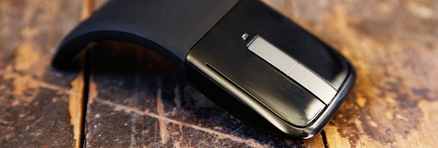
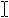

# 마우스 조작
<link rel="stylesheet" href="https://az835927.vo.msecnd.net/sites/uwp/Resources/css/custom.css">

UWP(유니버설 Windows 플랫폼) 앱 디자인을 터치식 입력에 최적화하고 기본적으로 기본 마우스 지원을 받으세요.

 

마우스 입력은 가리키고 클릭할 때 정밀도가 필요한 사용자 조작에 가장 적합합니다. 이러한 고유 정밀도는 터치의 부정확한 특성에 최적화된 Windows의 UI에서 자연스럽게 지원됩니다.

마우스 및 터치식 입력이 분리되는 위치는 해당 개체에서 직접 수행되는 실제 제스처(예: 살짝 밀기, 밀기, 끌기, 회전 등)를 통해 UI 요소의 직접 조작을 보다 밀접하게 에뮬레이트하는 터치의 기능입니다. 마우스 조작에는 일반적으로 개체를 회전하거나 크기를 조정하는 데 핸들을 사용하는 것과 같은 일부 다른 UI 어포던스가 필요합니다.

이 항목에서는 마우스 조작에 대한 디자인 고려 사항을 설명합니다.

## UWP 앱 마우스 언어

마우스 조작의 축약된 집합이 전체 시스템에서 일관되게 사용됩니다.

<table>
<colgroup>
<col width="50%" />
<col width="50%" />
</colgroup>
<thead>
<tr class="header">
<th align="left">용어</th>
<th align="left">설명</th>
</tr>
</thead>
<tbody>
<tr class="odd">
<td align="left">
가리켜서 배우기
</td>
<td align="left">
요소를 가리켜서 동작을 커밋하지 않고 자세한 정보나 학습용 시각 요소(예제: 도구 설명)를 표시합니다.
</td>
</tr>
<tr class="even">
<td align="left">
마우스 왼쪽 단추를 클릭하여 기본 동작 수행
</td>
<td align="left">
요소를 마우스 왼쪽 단추로 클릭하여 앱 시작이나 명령 실행과 같은 기본 동작을 호출합니다.
</td>
</tr>
<tr class="odd">
<td align="left">
스크롤하여 보기 변경
</td>
<td align="left">
스크롤 막대를 표시하여 콘텐츠 영역 내에서 위쪽, 아래쪽, 왼쪽 및 오른쪽으로 이동합니다. 사용자는 스크롤 막대를 클릭하거나 마우스 휠을 돌려 스크롤할 수 있습니다. 스크롤 막대는 콘텐츠 영역 내에서 현재 보기의 위치를 나타낼 수 있습니다. 터치를 사용하여 이동하면 유사한 UI가 표시됩니다.
</td>
</tr>
<tr class="even">
<td align="left">
마우스 오른쪽 단추를 클릭하여 명령 선택
</td>
<td align="left">
마우스 오른쪽 단추를 클릭하여 탐색 모음 (사용 가능한 경우) 및 글로벌 명령이 포함된 앱 바를 표시합니다. 요소를 마우스 오른쪽 단추로 클릭하여 선택하고 선택한 요소에 대한 상황에 맞는 명령이 포함된 앱 바를 표시합니다.

<strong>참고</strong>  선택 또는 앱 바 명령이 적합한 UI 동작이 아닌 경우 마우스 오른쪽 단추를 클릭하여 상황에 맞는 메뉴를 표시합니다. 그러나 모든 명령 동작에 앱 바를 사용하는 것이 좋습니다.

 

</td>
</tr>
<tr class="odd">
<td align="left">
UI 확대/축소 명령
</td>
<td align="left">
앱 바에 UI 명령(+ 및 -)을 표시하거나, Ctrl을 누르고 마우스 휠을 돌려 확대/축소를 위한 손가락 모으기 및 확대 제스처를 에뮬레이트합니다.
</td>
</tr>
<tr class="even">
<td align="left">
UI 회전 명령
</td>
<td align="left">
앱 바에 UI 명령을 표시하거나, Ctrl+Shift를 누르고 마우스 휠을 돌려 회전을 위한 회전 제스처를 에뮬레이트합니다. 장치 자체를 돌리면 전체 화면이 회전합니다.
</td>
</tr>
<tr class="odd">
<td align="left">
마우스 왼쪽 단추를 클릭하고 끌어서 다시 정렬
</td>
<td align="left">
요소를 마우스 왼쪽 단추로 클릭하고 끌어서 이동합니다.
</td>
</tr>
<tr class="even">
<td align="left">
마우스 왼쪽 단추를 클릭하고 끌어서 텍스트 선택
</td>
<td align="left">
선택 가능한 텍스트 내에서 마우스 왼쪽 단추를 클릭하고 끌어서 선택합니다. 단어를 선택하려면 두 번 클릭합니다.
</td>
</tr>
</tbody>
</table>

## 마우스 이벤트

터치 및 펜 입력에 사용하는 것과 동일한 기본 포인터 이벤트를 처리하여 앱에서 마우스 입력에 응답합니다.

[**UIElement**](https://msdn.microsoft.com/library/windows/apps/br208911) 이벤트를 사용하여 각 포인터 입력 장치에 대한 코드를 작성하지 않고 기본적인 입력 기능을 구현합니다. 그러나 이 개체의 포인터, 제스처 및 조작 이벤트를 사용하여 이 개체의 각 장치의 특수 기능(예: 마우스 휠 이벤트)을 활용할 수도 있습니다.

**샘플:**  이 기능의 작동 방식을 보려면 [앱 샘플](http://go.microsoft.com/fwlink/p/?LinkID=264996)을 참조하세요.

- [입력: 장치 기능 샘플](http://go.microsoft.com/fwlink/p/?linkid=231530)

- [입력 샘플](http://go.microsoft.com/fwlink/p/?linkid=226855)

- [입력: GestureRecognizer를 사용한 조작 및 제스처](http://go.microsoft.com/fwlink/p/?LinkID=231605)

## 시각적 피드백에 대한 지침

-   이동 또는 가리키기 이벤트를 통해 마우스가 검색되면 마우스 관련 UI를 표시하여 이벤트에 의해 노출되는 기능을 나타냅니다. 마우스가 정해진 시간 동안 이동하지 않거나 사용자가 터치 조작을 시작하면 마우스 UI가 점점 사라지도록 합니다. 이렇게 하면 UI가 깔끔하고 간결하게 유지됩니다.
-   가리키기 피드백에 커서를 사용하지 마세요. 요소에서 제공하는 피드백만으로 충분합니다(아래 커서 참조).
-   요소가 조작을 지원하지 않는 경우(예: 정적 테스트) 시각적 피드백을 표시하지 마세요.
-   마우스 조작 시 포커스 사각형을 사용하지 마세요. 포커스 사각형은 키보드 조작에 예약합니다.
-   동일한 입력 대상을 나타내는 모든 요소에 대해 동시에 시각적 피드백을 표시합니다.
-   이동, 회전, 확대/축소 등의 터치 기반 조작을 에뮬레이트하기 위한 단추(예: + 및 -)를 제공합니다.

시각적 피드백에 대한 일반적인 내용은 [시각적 피드백에 대한 지침](guidelines-for-visualfeedback.md)을 참조하세요.

## 커서

마우스 포인터에 일련의 표준 커서를 사용할 수 있습니다. 이러한 커서는 요소의 기본 동작을 나타내는 데 사용됩니다.

각 표준 커서에는 해당 기본 이미지가 연결되어 있습니다. 사용자나 앱은 언제든지 표준 커서와 연결된 기본 이미지를 바꿀 수 있습니다. [**PointerCursor**](https://msdn.microsoft.com/library/windows/apps/br208273) 함수를 통해 커서 이미지를 지정합니다.

마우스 커서를 사용자 지정해야 하는 경우

-   클릭 가능한 요소에는 항상 화살표 커서()를 사용합니다. 링크 또는 다른 대화형 요소에 가리키는 손 모양 커서()를 사용하지 마세요. 대신 앞에서 설명한 가리키기 효과를 사용합니다.
-   선택 가능한 텍스트에는 텍스트 커서()를 사용합니다.
-   이동이 기본 동작인 경우(예제: 끌기 또는 자르기) 이동 커서()를 사용합니다. 기본 동작이 탐색인 요소(예제: 시작 타일)에는 이동 커서를 사용하지 마세요.
-   개체 크기를 조정할 수 있는 경우 가로, 세로 및 대각선 크기 조정 커서(, , , )를 사용합니다.
-   고정 캔버스 내에서 콘텐츠를 이동하는 경우(예제: 지도) 잡는 손 모양 커서(, )를 사용합니다.

## 관련 문서

* [포인터 입력 처리](handle-pointer-input.md)
* [입력 장치 식별](identify-input-devices.md)

**샘플**
* [기본 입력 샘플](http://go.microsoft.com/fwlink/p/?LinkID=620302)
* [짧은 대기 시간 입력 샘플](http://go.microsoft.com/fwlink/p/?LinkID=620304)
* [사용자 조작 모드 샘플](http://go.microsoft.com/fwlink/p/?LinkID=619894)
* [포커스 화면 효과 샘플](http://go.microsoft.com/fwlink/p/?LinkID=619895)

**보관 샘플**
* [입력: 장치 기능 샘플](http://go.microsoft.com/fwlink/p/?linkid=231530)
* [입력: XAML 사용자 입력 이벤트 샘플](http://go.microsoft.com/fwlink/p/?linkid=226855)
* [XAML 스크롤, 이동 및 확대/축소 샘플](http://go.microsoft.com/fwlink/p/?linkid=251717)
* [입력: GestureRecognizer를 사용한 조작 및 제스처](http://go.microsoft.com/fwlink/p/?LinkID=231605)
 
 

 

<!--HONumber=Dec16_HO2-->

