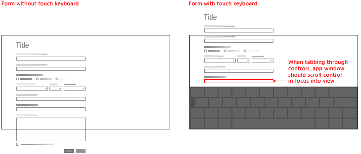

# 터치 키보드의 현재 상태에 응답

터치 키보드를 표시하거나 숨길 때 앱의 UI를 세부 조정하는 방법을 알아봅니다.


**중요 API**

-   [**AutomationPeer**](https://msdn.microsoft.com/library/windows/apps/br209185)
-   [**InputPane**](https://msdn.microsoft.com/library/windows/apps/br242255)


<sup>기본\\ 레이아웃\\ 모드의\\ 터치\\ 키보드</sup>

터치 키보드는 터치 지원 디바이스의 텍스트 입력을 가능하게 합니다. 사용자가 편집 가능한 입력 필드를 탭하면 UWP(유니버설 Windows 플랫폼) 텍스트 입력 컨트롤은 기본적으로 터치 키보드를 호출합니다. 터치 키보드는 일반적으로 사용자가 양식에서 컨트롤 사이를 이동하는 동안 계속 표시되지만, 이 동작은 양식 내의 다른 컨트롤 유형에 따라 다를 수 있습니다.

표준 텍스트 입력 컨트롤에서 파생되지 않은 사용자 지정 텍스트 입력 컨트롤에서 해당 터치 키보드 동작을 지원하려면 [**AutomationPeer**](https://msdn.microsoft.com/library/windows/apps/br209185) 클래스를 사용하여 컨트롤을 Microsoft UI 자동화에 노출하고 올바른 UI 자동화 컨트롤 패턴을 구현해야 합니다. [키보드 접근성](https://msdn.microsoft.com/library/windows/apps/mt244347) 및 [사용자 지정 자동화 피어](https://msdn.microsoft.com/library/windows/apps/mt297667)를 참조하세요.

이 지원이 사용자 지정 컨트롤에 추가되고 나면 터치 키보드의 존재에 적절하게 응답할 수 있습니다.

**필수 조건:  **

이 항목은 [키보드 조작](keyboard-interactions.md)을 기반으로 합니다.

표준 키보드 조작, 키보드 입력 처리, UI 자동화에 대한 기본적인 지식이 있어야 합니다.

UWP(유니버설 Windows 플랫폼) 앱을 처음 개발하는 경우 다음 항목을 검토하여 여기서 설명하는 기술에 대해 알아보세요.

-   [첫 번째 앱 만들기](https://msdn.microsoft.com/library/windows/apps/bg124288)
-   이벤트에 대한 자세한 내용은 [이벤트 및 라우트된 이벤트 개요](https://msdn.microsoft.com/library/windows/apps/mt185584)를 참조하세요.

**사용자 환경 지침:  **

키보드 입력에 최적화된 유용하고 매력적인 앱을 디자인하는 데 도움이 되는 팁은 [키보드 디자인 지침](https://msdn.microsoft.com/library/windows/apps/hh972345)을 참조하세요.

## <span id="Touch_keyboard_and_a_custom_UI"></span><span id="touch_keyboard_and_a_custom_ui"></span><span id="TOUCH_KEYBOARD_AND_A_CUSTOM_UI"></span>터치 키보드 및 사용자 지정 UI


사용자 지정 텍스트 입력 컨트롤에 대한 몇 가지 기본 권장 사항은 다음과 같습니다.

-   전체 양식 조직에서 터치 키보드를 표시합니다.

-   텍스트 입력 컨텍스트에 있는 동안 포커스가 텍스트 입력 필드에서 다른 위치로 이동될 때 키보드가 지속되도록 하기 위해 사용자 지정 컨트롤에 적절한 UI 자동화 [**AutomationControlType**](https://msdn.microsoft.com/library/windows/apps/br209182)이 있는지 확인합니다. 예를 들어 텍스트 입력 시나리오 중간에 열린 메뉴가 있으며 키보드를 지속하려는 경우 메뉴에 **AutomationControlType** 메뉴가 있어야 합니다.

-   UI 자동화 속성을 조작하여 터치 키보드를 제어하지는 않도록 합니다. 다른 접근성 도구는 UI 자동화 속성의 정확도에 의존합니다.

-   사용자가 조작 중인 입력 필드를 항상 볼 수 있도록 합니다.

    터치 키보드는 화면의 많은 부분을 가리기 때문에 UWP에서는 사용자가 현재 보기에 없는 컨트롤을 포함하여 양식의 컨트롤을 탐색할 때 포커스가 있는 입력 필드가 보기로 스크롤되도록 합니다.

    UI를 사용자 지정할 때 [**InputPane**](https://msdn.microsoft.com/library/windows/apps/br242255) 개체에 의해 노출되는 [**Showing**](https://msdn.microsoft.com/library/windows/apps/br242262) 및 [**Hiding**](https://msdn.microsoft.com/library/windows/apps/br242260) 이벤트를 처리하여 터치 키보드 모양에 대해 유사한 동작을 제공합니다.

    

    경우에 따라 전체 시간 동안 화면에 유지해야 하는 UI 요소가 있습니다. 양식 컨트롤은 이동 영역에 포함되고 중요한 UI 요소는 고정되도록 UI를 디자인해 보세요. 예를 들면 다음과 같습니다.

    

## <span id="handling_events"></span><span id="HANDLING_EVENTS"></span>Showing 이벤트 및 Hiding 이벤트 처리


다음은 터치 키보드의 [**showing**](https://msdn.microsoft.com/library/windows/apps/br242262) 및 [**hiding**](https://msdn.microsoft.com/library/windows/apps/br242260) 이벤트에 대해 이벤트 처리기를 연결하는 예제입니다.

```CSharp
public class MyApplication
{
    public MyApplication()
    {
        // Grab the input pane for the main application window and attach
        // touch keyboard event handlers.
        Windows.Foundation.Application.InputPane.GetForCurrentView().Showing  
            += new EventHandler(_OnInputPaneShowing);
        Windows.Foundation.Application.InputPane.GetForCurrentView().Hiding 
            += new EventHandler(_OnInputPaneHiding);
    }

    private void _OnInputPaneShowing(object sender, IInputPaneVisibilityEventArgs eventArgs)
    {
        // If the size of this window is going to be too small, the app uses 
        // the Showing event to begin some element removal animations.
        if (eventArgs.OccludedRect.Top < 400)
        {
            _StartElementRemovalAnimations();

            // Don&#39;t use framework scroll- or visibility-related 
            // animations that might conflict with the app&#39;s logic.
            eventArgs.EnsuredFocusedElementInView = true; 
        }
    }

    private void _OnInputPaneHiding(object sender, IInputPaneVisibilityEventArgs eventArgs)
    {
        if (_ResetToDefaultElements())
        {
            eventArgs.EnsuredFocusedElementInView = true; 
        }
    }

    private void _StartElementRemovalAnimations()
    {
        // This function starts the process of removing elements 
        // and starting the animation.
    }

    private void _ResetToDefaultElements()
    {
        // This function resets the window&#39;s elements to their default state.
    }
}
```

## <span id="related_topics"></span>관련 문서

* [키보드 조작](keyboard-interactions.md)
* [키보드 접근성](https://msdn.microsoft.com/library/windows/apps/mt244347)
* [사용자 지정 자동화 피어](https://msdn.microsoft.com/library/windows/apps/mt297667)


**보관 샘플**
* [입력: 터치 키보드 샘플](http://go.microsoft.com/fwlink/p/?linkid=246019)
* [화상 키보드의 모양에 응답 샘플](http://go.microsoft.com/fwlink/p/?linkid=231633)
* [XAML 텍스트 편집 샘플](http://go.microsoft.com/fwlink/p/?LinkID=251417)
* [XAML 접근성 샘플](http://go.microsoft.com/fwlink/p/?linkid=238570)
 

 


<!--HONumber=Jun16_HO3-->


