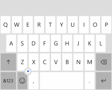

# 입력 범위를 사용하여 터치 키보드 변경

\[ Windows 10의 UWP 앱에 맞게 업데이트되었습니다. Windows 8.x 문서는 [보관](http://go.microsoft.com/fwlink/p/?linkid=619132)을 참조하세요. \]

**중요 API**

-   [**InputScope**](https://msdn.microsoft.com/library/windows/apps/hh702632)
-   [**InputScopeNameValue**](https://msdn.microsoft.com/library/windows/apps/hh702028)

사용자가 입력할 것으로 예상되는 데이터 종류와 일치하도록 텍스트 컨트롤의 입력 범위를 설정하여 터치 키보드나 SIP(Soft Input Panel)를 사용한 데이터 입력을 도울 수 있습니다.

터치 키보드는 앱이 터치 스크린이 있는 디바이스에서 실행될 때 텍스트 입력에 사용할 수 있습니다. 터치 키보드는 사용자가 [**TextBox**](https://msdn.microsoft.com/library/windows/apps/br209683) 또는 [**RichEditBox**](https://msdn.microsoft.com/library/windows/apps/br227548) 같이 편집 가능한 입력 필드를 탭할 때 호출됩니다. 사용자가 입력할 것으로 예상되는 데이터 종류와 일치하도록 텍스트 컨트롤의 *입력 범위*를 설정하여 사용자가 앱에서 데이터를 쉽고 빠르게 입력할 수 있도록 지원할 수 있습니다. 입력 범위는 시스템에서 해당 입력 형식에 맞는 특수한 터치 키보드를 제공할 수 있도록 컨트롤에서 예상되는 텍스트 입력 형식에 대한 힌트를 시스템에 제공합니다.

예를 들어 텍스트 상자가 4자리 숫자의 PIN을 입력하는 목적으로만 사용될 경우 [**InputScope**](https://msdn.microsoft.com/library/windows/apps/hh702632) 속성을 **Number**로 설정합니다. 이렇게 하면 사용자가 PIN을 쉽게 입력할 수 있도록 시스템에서 숫자 키패드 레이아웃이 표시됩니다.

> **중요**&nbsp;&nbsp;
- 이 정보는 SIP에만 적용됩니다. Windows 접근성 옵션에서 제공되는 화상 키보드 또는 하드웨어 키보드에는 적용되지 않습니다.
- 입력 범위는 입력 유효성 검사가 수행되지 않으며 사용자가 하드웨어 키보드 또는 다른 입력 디바이스를 사용해서 입력을 제공하지 못하도록 방지하지 않습니다. 따라서 필요에 따라 입력 코드에 대한 유효성을 검사해야 합니다.

## 텍스트 컨트롤의 입력 범위 변경

앱에서 사용할 수 있는 입력 범위는 [**InputScopeNameValue**](https://msdn.microsoft.com/library/windows/apps/hh702028) 열거의 멤버입니다. [
            **TextBox**](https://msdn.microsoft.com/library/windows/apps/br209683) 또는 [**RichEditBox**](https://msdn.microsoft.com/library/windows/apps/br227548)의 **InputScope** 속성을 이러한 값 중 하나로 설정할 수 있습니다.

> **중요**&nbsp;&nbsp;[**PasswordBox**](https://msdn.microsoft.com/library/windows/apps/br227519)에 대한 [**InputScope**](https://msdn.microsoft.com/library/windows/apps/dn996570) 속성은 **Password** 및 **NumericPin** 값만 지원합니다. 다른 값이 무시됩니다.

여기서는 여러 텍스트 상자의 예상 데이터와 일치하도록 각 텍스트 상자의 입력 범위를 변경할 수 있습니다.

**XAML에서 입력 범위를 변경하려면**

1.  페이지의 XAML 파일에서 변경하려는 텍스트 컨트롤에 대한 태그를 찾습니다.
2.  [
            **InputScope**](https://msdn.microsoft.com/library/windows/apps/hh702632) 특성을 태그에 추가하고 예상되는 입력과 일치하는 [**InputScopeNameValue**](https://msdn.microsoft.com/library/windows/apps/hh702028) 값을 지정합니다.

    다음은 일반적인 고객 연락처 양식에서 볼 수 있는 몇 가지 입력란입니다. [
            **InputScope**](https://msdn.microsoft.com/library/windows/apps/hh702632)가 설정된 상태에서 데이터에 적합한 레이아웃의 터치 키보드가 각 입력란에 대해 표시됩니다.

    ```xaml
    <StackPanel Width="300">
        <TextBox Header="Name" InputScope="Default"/>
        <TextBox Header="Email Address" InputScope="EmailSmtpAddress"/>
        <TextBox Header="Telephone Number" InputScope="TelephoneNumber"/>
        <TextBox Header="Web site" InputScope="Url"/>
    </StackPanel>
    ```

**코드에서 입력 범위를 변경하려면**

1.  페이지의 XAML 파일에서 변경하려는 텍스트 컨트롤에 대한 태그를 찾습니다. 설정되지 않은 경우, 해당 코드에서 컨트롤을 참조할 수 있도록 [x:Name 특성](https://msdn.microsoft.com/library/windows/apps/mt204788)을 설정합니다.

    ```csharp
    <TextBox Header="Telephone Number" x:Name="phoneNumberTextBox"/>
    ```

2.  새 [**InputScope**](https://msdn.microsoft.com/library/windows/apps/hh702025) 개체를 인스턴스화합니다.

    ```csharp
    InputScope scope = new InputScope();
    ```

3.  새 [**InputScopeName**](https://msdn.microsoft.com/library/windows/apps/hh702027) 개체를 인스턴스화합니다.
    
    ```csharp
    InputScopeName scopeName = new InputScopeName();
    ```

4.  [
            **InputScopeName**](https://msdn.microsoft.com/library/windows/apps/hh702027) 개체의 [**NameValue**](https://msdn.microsoft.com/library/windows/apps/hh702032) 속성을 [**InputScopeNameValue**](https://msdn.microsoft.com/library/windows/apps/hh702028) 열거형 값으로 설정합니다.

    ```csharp
    scopeName.NameValue = InputScopeNameValue.TelephoneNumber;
    ```

5.  [
            **InputScopeName**](https://msdn.microsoft.com/library/windows/apps/hh702027) 개체를 [**InputScope**](https://msdn.microsoft.com/library/windows/apps/hh702025) 개체의 [**Names**](https://msdn.microsoft.com/library/windows/apps/hh702034) 컬렉션에 추가합니다.

    ```csharp
    scope.Names.Add(scopeName);
    ```

6.  [
            **InputScope**](https://msdn.microsoft.com/library/windows/apps/hh702025) 개체를 텍스트 컨트롤의 [**InputScope**](https://msdn.microsoft.com/library/windows/apps/hh702632) 속성 값으로 설정합니다.

    ```csharp
    phoneNumberTextBox.InputScope = scope;
    ```

코드를 모두 합하면 다음과 같습니다.

```CSharp
InputScope scope = new InputScope();
InputScopeName scopeName = new InputScopeName();
scopeName.NameValue = InputScopeNameValue.TelephoneNumber;
scope.Names.Add(scopeName);
phoneNumberTextBox.InputScope = scope;
```

다음과 같은 단축형 코드를 사용해서 위와 동일한 단계를 압축시킬 수 있습니다.

```CSharp
phoneNumberTextBox.InputScope = new InputScope() 
{
    Names = {new InputScopeName(InputScopeNameValue.TelephoneNumber)}
};
```

## 텍스트 자동 완성, 맞춤법 검사 및 자동 고침

[
            **TextBox**](https://msdn.microsoft.com/library/windows/apps/br209683) 및 [**RichEditBox**](https://msdn.microsoft.com/library/windows/apps/br227548) 컨트롤은 SIP의 동작에 영향을 주는 몇 가지 속성을 포함합니다. 사용자에게 최상의 환경을 제공하기 위해서는 이러한 속성이 터치를 사용한 텍스트 입력에 어떤 영향을 주는지 이해하는 것이 중요합니다.

-   [
            **IsSpellCheckEnabled**](https://msdn.microsoft.com/library/windows/apps/br209688) - 텍스트 컨트롤에서 맞춤법 검사를 사용하도록 설정된 경우, 이 컨트롤은 시스템의 맞춤법 검사 엔진과 상호 작용하여 인식되지 않는 단어를 표시합니다. 단어를 탭하면 제안된 수정 단어 목록을 볼 수 있습니다. 기본적으로 맞춤법 검사는 사용하도록 설정되어 있습니다.

    **Default** 입력 범위의 경우 이 속성은 문장의 첫 번째 단어 자동 대문자 표시 및 입력 단어 자동 고침을 활성화합니다. 이러한 자동 수정 기능은 다른 입력 범위에서 비활성화할 수 있습니다. 자세한 내용은 이 항목의 뒷부분에 있는 표를 참조하세요.

-   [
            **IsTextPredictionEnabled**](https://msdn.microsoft.com/library/windows/apps/br209690) - 텍스트 컨트롤에 대해 텍스트 자동 완성이 활성화된 경우 시스템은 사용자가 입력을 시작한 단어의 예상 목록을 보여 줍니다. 전체 단어를 입력하는 대신 목록에서 쉽게 선택할 수 있습니다. 텍스트 자동 완성은 기본적으로 사용됩니다.

    입력 범위가 **Default**가 아니면 [**IsTextPredictionEnabled**](https://msdn.microsoft.com/library/windows/apps/br209690) 속성이 **true**이더라도 텍스트 자동 완성이 비활성화될 수 있습니다. 자세한 내용은 이 항목의 뒷부분에 있는 표를 참조하세요.

    **참고**&nbsp;&nbsp;모바일 디바이스 패밀리에서 텍스트 자동 완성 및 맞춤법 수정 사항이 SIP의 키보드 위 영역에 표시됩니다. [
            **IsTextPredictionEnabled**](https://msdn.microsoft.com/library/windows/apps/br209690)가 **false**로 설정되면, [**IsSpellCheckEnabled**](https://msdn.microsoft.com/library/windows/apps/br209688)가 **true**이더라도 이 SIP 부분이 숨겨지고 자동 수정이 비활성화됩니다.

-   [
            **PreventKeyboardDisplayOnProgrammaticFocus**](https://msdn.microsoft.com/library/windows/apps/dn299273) 이 속성을 **true**로 설정하면 텍스트 컨트롤에서 포커스가 프로그래밍 방식으로 설정될 경우 SIP가 표시되지 않도록 할 수 있습니다. 대신 사용자가 컨트롤을 사용할 때만 키보드가 표시됩니다.

## Windows 및 Windows Phone의 터치 키보드 인덱스

이 표는 일반적인 입력 범위 값에 대한 데스크톱 및 모바일 디바이스의 SIP(Soft Input Panel) 레이아웃을 보여 줍니다. **IsSpellCheckEnabled** 및 **IsTextPredictionEnabled** 속성으로 활성화되는 기능에 입력 범위가 미치는 효과가 각 입력 범위에 대해 나열되어 있습니다. 이 목록은 사용 가능한 입력 범위에 대한 전체 목록이 아닙니다.

> **참고**&nbsp;&nbsp;특히 모바일 앱의 경우 모바일 디바이스의 SIP의 크기가 작기 때문에 올바른 입력 범위를 설정하는 것이 중요합니다. 여기에 표시된 것처럼 Windows Phone은 다양한 종류의 특수한 키보드 레이아웃을 제공합니다. Windows 스토어 앱에서 입력 범위를 설정할 필요가 없는 텍스트 필드는 Windows Phone 스토어 앱에서 이를 설정할 수 있는 이점이 있습니다.

> **팁**&nbsp;&nbsp;대부분의 터치 키보드는 영문자 레이아웃과 숫자 및 기호 레이아웃으로 전환할 수 있습니다. Windows에서는 **&123** 키로 전환합니다. Windows Phone에서 **&123** 키를 눌러 숫자 및 기호 레이아웃을 변경하고 **abcd** 키를 눌러 영문자 레이아웃을 변경합니다.

### 기본값

`<TextBox InputScope="Default"/>`

기본 키보드입니다.

| Windows                                                    | Windows Phone                                                    |
|------------------------------------------------------------|------------------------------------------------------------------|
|  |  |

기능 사용 가능 여부:

-   맞춤법 검사: **IsSpellCheckEnabled** = **true**의 경우 활성화, **IsSpellCheckEnabled** = **false**의 경우 비활성화
-   자동 고침: **IsSpellCheckEnabled** = **true**의 경우 활성화, **IsSpellCheckEnabled** = **false**의 경우 비활성화
-   자동 대문자화: **IsSpellCheckEnabled** = **true**의 경우 활성화, **IsSpellCheckEnabled** = **false**의 경우 비활성화
-   텍스트 자동 완성: **IsTextPredictionEnabled** = **true**의 경우 활성화, **IsTextPredictionEnabled** = **false**의 경우 비활성화

### CurrencyAmountAndSymbol

`<TextBox InputScope="CurrencyAmountAndSymbol"/>`

기본 숫자 및 기호 키보드 레이아웃입니다.

| Windows                                                    | Windows Phone                                                    |
|------------------------------------------------------------|------------------------------------------------------------------|
| <br>추가 기호를 표시하기 위한 페이지 왼쪽/오른쪽 키도 포함됩니다.|  |
|기능 사용 가능 여부:<ul><li>맞춤법 검사: 기본적으로 설정되어 있으며, 비활성화할 수 있음</li><li>자동 수정: 항상 비활성화됨</li><li>자동 대문자화: 항상 비활성화됨</li><li>텍스트 자동 완성: 항상 비활성화됨</li></ul>**Number** 및 **TelephoneNumber**와 동일합니다. | 기능 사용 가능 여부:<ul><li>맞춤법 검사: 기본적으로 설정되어 있으며, 비활성화할 수 있음</li><li>자동 수정: 기본적으로 설정되어 있으며, 비활성화할 수 있음</li><li>자동 대문자화: 항상 비활성화됨</li><li>텍스트 자동 완성: 기본적으로 설정되어 있으며, 비활성화할 수 있음</li>| 

### URL

`<TextBox InputScope="Url"/>`

**.com** 및 를 포함합니다. **.com** 키를 길게 눌러 추가 옵션(**.org**, **.net** 및 지역별 접미사)을 표시합니다.

| Windows                                                    | Windows Phone                                                    |
|------------------------------------------------------------|------------------------------------------------------------------|
| <br>**:**, **-** 및 **/** 키도 포함됩니다.| <br>마침표 키를 길게 누르면 추가 옵션( - + &quot; / &amp; : , )이 표시됩니다. |
|기능 사용 가능 여부:<ul><li>맞춤법 검사: 기본적으로 설정되어 있으며, 비활성화할 수 있음</li><li>자동 수정: 기본적으로 설정되어 있으며, 비활성화할 수 있음</li><li>자동 대문자화: 항상 비활성화됨</li><li>텍스트 자동 완성: 항상 비활성화됨</li></ul> | 기능 사용 가능 여부:<ul><li>맞춤법 검사: 기본적으로 해제되어 있으며, 활성화할 수 있음</li><li>자동 수정: 기본적으로 해제되어 있으며, 활성화할 수 있음</li><li>자동 대문자화: 기본적으로 해제되어 있으며, 활성화할 수 있음</li><li>텍스트 자동 완성: 기본적으로 해제되어 있으며, 활성화할 수 있음</li></ul> |

### EmailSmtpAddress

`<TextBox InputScope="EmailSmtpAddress"/>`

**@** 및 **.com** 키를 포함합니다. **.com** 키를 길게 눌러 추가 옵션(**.org**, **.net** 및 지역별 접미사)을 표시합니다.

| Windows                                                    | Windows Phone                                                    |
|------------------------------------------------------------|------------------------------------------------------------------|
| <br>**_** 및 **-** 키도 포함됩니다.| <br>마침표 키를 길게 누르면 추가 옵션( - _ , ; )이 표시됩니다. |
|기능 사용 가능 여부:<ul><li>맞춤법 검사: 기본적으로 설정되어 있으며, 비활성화할 수 있음</li><li>자동 수정: 기본적으로 설정되어 있으며, 비활성화할 수 있음</li><li>자동 대문자화: 항상 비활성화됨</li><li>텍스트 자동 완성: 항상 비활성화됨</li></ul> | 기능 사용 가능 여부:<ul><li>맞춤법 검사: 기본적으로 해제되어 있으며, 활성화할 수 있음</li><li>자동 수정: 기본적으로 해제되어 있으며, 활성화할 수 있음</li><li>자동 대문자화: 기본적으로 해제되어 있으며, 활성화할 수 있음</li><li>텍스트 자동 완성: 기본적으로 해제되어 있으며, 활성화할 수 있음</li></ul> |

### 숫자

`<TextBox InputScope="Number"/>`

| Windows                                                    | Windows Phone                                                    |
|------------------------------------------------------------|------------------------------------------------------------------|
| | <br>키보드에 숫자 및 소수점이 포함됩니다. 마침표 키를 길게 누르면 추가 옵션( , - )이 표시됩니다. |
|**CurrencyAmountAndSymbol** 및 **TelephoneNumber**와 동일합니다. | 기능 사용 가능 여부:<ul><li>맞춤법 검사: 항상 비활성화됨</li><li>자동 수정: 항상 비활성화됨</li><li>자동 대문자화: 항상 비활성화됨</li><li>텍스트 자동 완성: 항상 비활성화됨</li></ul> |

### TelephoneNumber

`<TextBox InputScope="TelephoneNumber"/>`

| Windows                                                    | Windows Phone                                                    |
|------------------------------------------------------------|------------------------------------------------------------------|
| | <br>키보드가 전화 키패드와 비슷합니다. 마침표 키를 길게 누르면 추가 옵션( , ( ) X . ). +를 입력하려면 0 키를 길게 누릅니다. |
|**CurrencyAmountAndSymbol** 및 **TelephoneNumber**와 동일합니다. | 기능 사용 가능 여부:<ul><li>맞춤법 검사: 항상 비활성화됨</li><li>자동 수정: 항상 비활성화됨</li><li>자동 대문자화: 항상 비활성화됨</li><li>텍스트 자동 완성: 항상 비활성화됨</li></ul> |

### 검색

`<TextBox InputScope="Search"/>`

**Enter** 키 대신 **검색** 키가 포함됩니다.

| Windows                                                    | Windows Phone                                                    |
|------------------------------------------------------------|------------------------------------------------------------------|
| | |
|기능 사용 가능 여부:<ul><li>맞춤법 검사: 기본적으로 설정되어 있으며, 비활성화할 수 있음</li><li>자동 수정: 항상 비활성화됨</li><li>자동 대문자화: 항상 비활성화됨</li><li>텍스트 자동 완성: 기본적으로 설정되어 있으며, 비활성화할 수 있음</li></ul> | 기능 사용 가능 여부:<ul><li>맞춤법 검사: 기본적으로 설정되어 있으며, 비활성화할 수 있음</li><li>자동 수정: 기본적으로 설정되어 있으며, 비활성화할 수 있음</li><li>자동 대문자화: 항상 비활성화됨</li><li>텍스트 자동 완성: 기본적으로 설정되어 있으며, 비활성화할 수 있음</li></ul> |

### SearchIncremental

`<TextBox InputScope="SearchIncremental"/>`

| Windows                                                    | Windows Phone                                                    |
|------------------------------------------------------------|------------------------------------------------------------------|
| <br>**Default**와 동일한 레이아웃입니다.| |
|기능 사용 가능 여부:<ul><li>맞춤법 검사: 기본적으로 해제되어 있으며, 활성화할 수 있음</li><li>자동 수정: 항상 비활성화됨</li><li>자동 대문자화: 항상 비활성화됨</li><li>텍스트 자동 완성: 항상 비활성화됨</li></ul> | **Default.**과(와) 동일합니다. |

### 수식

`<TextBox InputScope="Formula"/>`

**=** 키가 포함됩니다.

| Windows                                                    | Windows Phone                                                    |
|------------------------------------------------------------|------------------------------------------------------------------|
| <br>**%**, **$** 및 **+** 키도 포함됩니다.| <br>마침표 키를 길게 누르면 추가 옵션( - ! ? , ). **=** 키를 길게 누르면 추가 옵션( ( ) : &lt; &gt; )이 표시됩니다. |
|기능 사용 가능 여부:<ul><li>맞춤법 검사: 기본적으로 해제되어 있으며, 활성화할 수 있음</li><li>자동 수정: 항상 비활성화됨</li><li>자동 대문자화: 항상 비활성화됨</li><li>텍스트 자동 완성: 항상 비활성화됨</li></ul> | 기능 사용 가능 여부:<ul><li>맞춤법 검사: 기본적으로 설정되어 있으며, 비활성화할 수 있음</li><li>자동 수정: 기본적으로 설정되어 있으며, 비활성화할 수 있음</li><li>자동 대문자화: 항상 비활성화됨</li><li>텍스트 자동 완성: 기본적으로 설정되어 있으며, 비활성화할 수 있음</li></ul> |

### 채팅

`<TextBox InputScope="Chat"/>`

| Windows                                                    | Windows Phone                                                    |
|------------------------------------------------------------|------------------------------------------------------------------|
| <br>**Default**와 동일한 레이아웃입니다.| <br>**Default**와 동일한 레이아웃입니다.|
|기능 사용 가능 여부:<ul><li>맞춤법 검사: 기본적으로 해제되어 있으며, 활성화할 수 있음</li><li>자동 수정: 항상 비활성화됨</li><li>자동 대문자화: 항상 비활성화됨</li><li>텍스트 자동 완성: 항상 비활성화됨</li></ul> | 기능 사용 가능 여부:<ul><li>맞춤법 검사: 기본적으로 설정되어 있으며, 비활성화할 수 있음</li><li>자동 수정: 기본적으로 설정되어 있으며, 비활성화할 수 있음</li><li>자동 대문자화: 기본적으로 설정되어 있으며, 비활성화할 수 있음</li><li>텍스트 자동 완성: 기본적으로 설정되어 있으며, 비활성화할 수 있음</li></ul> |

### NameOrPhoneNumber

`<TextBox InputScope="NameOrPhoneNumber"/>`

| Windows                                                    | Windows Phone                                                    |
|------------------------------------------------------------|------------------------------------------------------------------|
| <br>**Default**와 동일한 레이아웃입니다.| <br>**;** 및 **@** 키가 포함됩니다. **&amp;123** 키가 전화 키패드를 여는 **123** 키로 대체됩니다(**TelephoneNumber** 참조).|
|기능 사용 가능 여부:<ul><li>맞춤법 검사: 기본적으로 설정되어 있으며, 비활성화할 수 있음</li><li>자동 수정: 항상 비활성화됨</li><li>자동 대문자화: 항상 활성화됨</li><li>텍스트 자동 완성: 항상 비활성화됨</li></ul> | 기능 사용 가능 여부:<ul><li>맞춤법 검사: 기본적으로 해제되어 있으며, 활성화할 수 있음</li><li>자동 수정: 기본적으로 해제되어 있으며, 활성화할 수 있음</li><li>자동 대문자화: 기본적으로 해제되어 있으며, 활성화할 수 있음 각 단어의 첫 번째 문자가 대문자로 표시됩니다.</li><li>텍스트 자동 완성: 기본적으로 해제되어 있으며, 활성화할 수 있음</li></ul> |


<!--HONumber=Mar16_HO4-->


