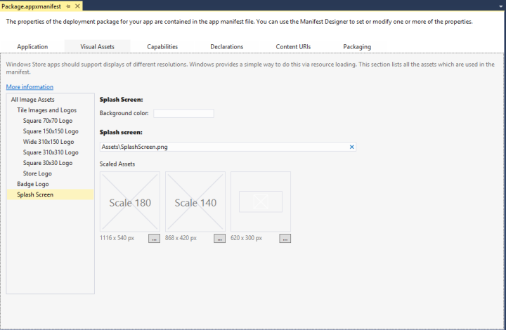

# <a name="add-a-splash-screen"></a>시작 화면 추가

Microsoft Visual Studio를 사용하여 앱의 시작 화면 이미지와 배경색을 설정합니다.

## <a name="set-the-splash-screen-image-and-background-color-in-visual-studio"></a>Visual Studio에서 시작 화면 이미지와 배경색을 설정합니다.

Visual Studio 템플릿을 사용하여 앱을 만드는 경우 기본 이미지가 프로젝트에 추가되고 시작 화면 이미지로 설정됩니다. 시작 화면의 배경색은 기본적으로 연한 회색으로 설정됩니다. 앱 시작 화면의 기본 이미지 또는 색을 변경하려면 다음 단계를 따르세요.

1. Visual Studio에서 기존 UWP(유니버설 Windows 플랫폼) 앱 프로젝트를 엽니다.
2. **솔루션 탐색기**에서 "Package.appxmanifest" 파일을 엽니다. **프로젝트** &gt; **스토어** &gt; **앱 매니페스트 편집**을 선택하여 메뉴 모음에서 이 파일을 열 수도 있습니다.
3. **시각적 자산** 탭을 열고 "Package.appxmanifest" 창 왼쪽의 **모든 시각적 자산** 창에서 **시작 화면**을 선택합니다. 시작 화면을 처음 변경하는 경우 **시작 화면** 필드에 "Assets\\SplashScreen.png" 경로가 표시됩니다.

    다음 스크린샷은 Visual Studio의 "Package.appxmanifest" 창을 보여 줍니다. 프로젝트 유형에 따라 약간 다른 시각적 자산 집합이 표시됩니다.

    

    텍스트 편집기에서 "Package.appxmanifest"를 열면 [**SplashScreen 요소**](https://msdn.microsoft.com/library/windows/apps/br211467)가 [**VisualElements 요소**](https://msdn.microsoft.com/library/windows/apps/br211471)의 자식 요소로 표시됩니다. 매니페스트 파일의 기본 시작 화면 태그는 텍스트 편집기에서 다음과 같이 나타납니다.

    ```xml
    <uap:SplashScreen Image="Assets\SplashScreen.png" />
    ```

4. UWP 앱에 대해 새로운 시작 화면 이미지를 선택하려면 **크기 조정된 자산** 아래의 **1240x600 px** 레이블 옆에 표시되는 줄임표 단추를 누릅니다. 시작 화면 이미지로 사용하려는 1240x600 픽셀 이미지(.png, .jpg 또는 .jpeg)를 선택합니다.

    **중요 한**선택 하면 시작 화면 이미지는 1x 배율 인수를 사용 하는 620x300 픽셀 이어야 합니다. 또한 스플래시 화면을 디자인할 때는 화면 가운데에 표시되고 화면보다 작아야 한다는 것에 주의해야 합니다. Windows Phone 스토어 앱용 시작 화면과 같이 화면을 모두 채우지 않습니다.

5. Windows Phone 스토어 앱에 대해 새로운 시작 화면 이미지를 선택하려면 **크기 조정된 자산** 아래의 **1152x1920 px** 레이블 옆에 표시되는 줄임표 단추를 누릅니다. 시작 화면 이미지로 사용하려는 1152x1920 픽셀 이미지(.png, .jpg 또는 .jpeg)를 선택합니다.

    **중요 한**시작 화면 이미지를 선택 하면 1152x1920 픽셀 이어야는 2.4 배율 인수에 올바른 크기인 합니다. 이 자산이 사용자가 제공하는 유일한 자산인 경우, 1.4 및 1배율 인수로 축소됩니다.

6. **시작 화면** 섹션의 **배경색** 필드에서 시작 화면 이미지와 함께 표시할 배경색을 설정합니다. 색 이름이나 '\#'과 색의 16진수 값을 입력할 수 있습니다. 사용 가능한 색 이름 목록은 [**SplashScreen element**](https://msdn.microsoft.com/library/windows/apps/br211467)를 참조하세요. 시작 화면의 배경색을 설정하는 것은 선택적인 작업입니다. UWP 앱의 색을 지정하지 않으면 시작 화면 배경색이 기본적으로 연한 회색(16진수 값 \#464646)으로 설정됩니다. 이 색은 기본 **타일** 배경색과 같습니다(**시각적 자산** 탭에 있는 **타일 이미지 및 로고** 섹션의 **배경색** 필드 참조). Windows Phone의 색을 지정하지 않거나 "투명"으로 설정하면 시작 화면 배경색이 투명하게 됩니다.

## <a name="summary-and-next-steps"></a>요약 및 다음 단계

앱을 로드하는 데 시간이 걸리는 경우 연장된 시작 화면을 추가하는 것이 좋습니다. 단계별 지침은 [사용자 지정된 시작 화면 만들기](create-a-customized-splash-screen.md)를 참조하세요.

## <a name="related-topics"></a>관련 항목

* [사용자 지정된 시작 화면 만들기](create-a-customized-splash-screen.md)
* [패키지 매니페스트 스키마 참조: SplashScreen 요소](https://msdn.microsoft.com/library/windows/apps/br211467)
* [Windows.ApplicationModel.Activation.SplashScreen 클래스](https://msdn.microsoft.com/library/windows/apps/br224763)