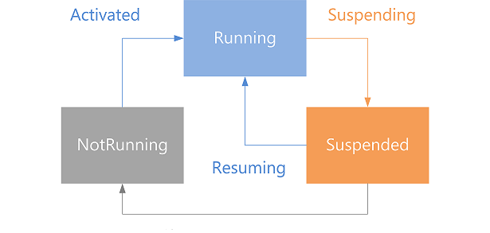

# 앱 수명 주기

\[ Windows 10의 UWP 앱에 맞게 업데이트되었습니다. Windows 8.x 문서는 [보관](http://go.microsoft.com/fwlink/p/?linkid=619132)을 참조하세요. \]

**중요 API**

-   [**Windows.UI.Xaml.Application 클래스**](https://msdn.microsoft.com/library/windows/apps/br242324)
-   [**Windows.ApplicationModel.Activation 네임스페이스**](https://msdn.microsoft.com/library/windows/apps/br224766)

이 항목에서는 활성화된 시점부터 닫힐 때까지의 UWP(유니버설 Windows 플랫폼) 앱 수명 주기에 대해 설명합니다. 많은 사용자가 여러 장치 및 앱에서 작업을 분산하고 재생합니다. 이제 사용자는 장치에서 여러 작업을 수행할 때 앱이 해당 상태를 기억하기를 원합니다. 예를 들어 페이지가 이전과 동일한 위치로 스크롤되고 모든 컨트롤이 이전과 동일한 상태가 되기를 기대합니다. 시작, 일시 중단 및 다시 시작의 응용 프로그램 수명 주기를 이해하면 이러한 종류의 원활한 동작을 제공할 수 있습니다.

## 앱 실행 상태

다음 그림은 앱 실행 상태의 전환을 나타냅니다. 다음에 나오는 여러 섹션에서 이러한 상태 및 이벤트에 대해 설명합니다. 각 상태 전환과 앱이 어떻게 응답해야 하는지에 대한 자세한 내용은 [**ApplicationExecutionState**](https://msdn.microsoft.com/library/windows/apps/br224694) 열거형에 대한 참조 자료를 보세요.

## 배포

앱을 활성화하려면 먼저 배포해야 합니다. 앱은 사용자가 앱을 설치할 때 또는 개발자가 Visual Studio를 사용하여 개발 및 테스트 과정에서 앱을 빌드 및 테스트할 때 배포됩니다. 이에 관한 자세한 내용과 고급 배포 시나리오는 [앱 패키지 및 배포](https://msdn.microsoft.com/library/windows/apps/hh464929)를 참조하세요.

## 앱 실행

앱은 **NotRunning** 상태에 있을 때 사용자가 시작 화면 또는 응용 프로그램 목록에서 앱 타일을 탭하면 실행됩니다. 자주 사용하는 앱은 응답성을 최적화하기 위해 사전 실행될 수도 있습니다([앱 사전 실행 처리](handle-app-prelaunch.md) 참조). 앱이 **NotRunning** 상태인 것은 시작된 적이 없거나 실행 후 충돌했거나 중지된 다음 메모리에 상주하지 못하고 시스템에 의해 종료되었기 때문일 수 있습니다. 실행은 활성화와 다릅니다. 활성화는 앱이 검색 계약 등의 계약 또는 확장을 통해 활성화될 때 이루어집니다.

앱이 실행되면 [**OnLaunched**](https://msdn.microsoft.com/library/windows/apps/br242335) 메서드가 호출됩니다. 앱이 현재 메모리에서 일시 중단된 경우도 마찬가지입니다. [**LaunchActivatedEventArgs**](https://msdn.microsoft.com/library/windows/apps/br224731) 매개 변수는 이전 앱 상태 및 활성화 인수를 포함합니다.

사용자가 종료된 앱으로 전환하면 시스템은 [**Kind**](https://msdn.microsoft.com/library/windows/apps/br224728)를 **Launch**로, [**PreviousExecutionState**](https://msdn.microsoft.com/library/windows/apps/br224729)를 **Terminated** 또는 **ClosedByUser**로 설정하여 [**LaunchActivatedEventArgs**](https://msdn.microsoft.com/library/windows/apps/br224731) 인수를 전송합니다. 앱은 저장된 응용 프로그램 데이터를 로드하고 표시 콘텐츠를 새로 고쳐야 합니다.

[**PreviousExecutionState**](https://msdn.microsoft.com/library/windows/apps/br224729) 값이 **NotRunning**인 경우에는 처음 실행하는 것처럼 앱을 시작해야 합니다.

앱이 실행되면 Windows는 앱에 대한 시작 화면을 표시합니다. 시작 화면을 구성하려면 [시작 화면 추가](https://msdn.microsoft.com/library/windows/apps/xaml/hh465331)를 참조하세요.

시작 화면이 표시되는 동안 앱의 사용자 인터페이스를 준비해야 합니다. 앱의 주요 작업은 이벤트 처리기를 등록하고 앱이 첫 페이지를 로드하는 데 필요한 사용자 지정 UI를 설정하는 것입니다. 이 작업은 몇 초 정도밖에 걸리지 않습니다. 앱이 네트워크에서 데이터를 요청해야 하거나 디스크에서 대량의 데이터를 검색해야 하는 경우 이러한 작업은 활성화 외의 기간에 완료해야 합니다. 앱은 이러한 오래 실행되는 작업이 완료될 때까지 자체의 사용자 지정 로드 UI나 확장된 시작 화면을 사용할 수 있습니다. 자세한 내용은 [시작 화면을 더 오래 표시](create-a-customized-splash-screen.md) 및 [시작 화면 샘플](http://go.microsoft.com/fwlink/p/?linkid=234889)을 참조하세요. 앱이 활성화를 완료하고 나면 **Running** 상태 및 시작 화면이 사라지고 모든 리소스와 개체가 지워집니다.

## 앱 활성화

사용자가 공유 계약과 같은 다양한 계약 및 확장을 통해 앱을 활성화할 수 있습니다. 앱을 활성화할 수 있는 방법에 대한 목록은 [**ActivationKind**](https://msdn.microsoft.com/library/windows/apps/br224693)을 참조하세요.

[**Windows.UI.Xaml.Application**](https://msdn.microsoft.com/library/windows/apps/br242324) 클래스는 다양한 활성화 유형을 처리하기 위해 재정의할 수 있는 메서드를 정의합니다. 여러 활성화 유형에 [**OnFileActivated**](https://msdn.microsoft.com/library/windows/apps/br242331), [**OnSearchActivated**](https://msdn.microsoft.com/library/windows/apps/br242336) 등 재정의할 수 있는 특정 메서드가 있습니다. 기타 활성화 유형의 경우 [**OnActivated**](https://msdn.microsoft.com/library/windows/apps/br242330) 메서드를 재정의합니다.

앱의 활성화 코드는 앱이 활성화되어 있는 이유와 이미 **Running** 상태인지 여부를 테스트를 통해 확인할 수 있습니다.

운영 체제에서 앱을 종료하고 이후에 사용자가 앱을 다시 실행하는 경우 앱은 활성화 중에 이전에 저장된 데이터를 복원할 수 있습니다. Windows는 앱이 여러 이유로 일시 중단된 이후에 앱을 종료할 수 있습니다. 사용자가 수동으로 앱을 닫거나, 로그아웃하거나, 시스템의 리소스가 부족한 등이 이유가 될 수 있습니다. Windows에서 앱을 종료한 후 사용자가 앱을 실행하면 앱은 [**Application.OnActivated**](https://msdn.microsoft.com/library/windows/apps/br242330) 콜백을 받고 앱이 활성화될 때까지 앱의 시작 화면이 사용자에게 표시됩니다. 이 이벤트를 사용하여 앱이 마지막으로 일시 중단될 때 저장한 데이터를 복원해야 하는지 여부나 앱의 기본 데이터를 로드해야 하는지 여부를 결정할 수 있습니다. 시작 화면이 표시되기 때문에 앱 코드는 사용자에게 명확한 지연 없이 처리 시간을 벌 수 있지만 다시 시작하거나 계속하는 경우 이전에 언급한 장기 실행 작업에 관한 문제가 여전히 적용됩니다.

[**OnActivated**](https://msdn.microsoft.com/library/windows/apps/br242330) 이벤트 데이터에는 앱이 활성화되기 전의 상태를 알려 주는 [**PreviousExecutionState**](https://msdn.microsoft.com/library/windows/apps/br224729) 속성이 포함되어 있습니다. 이 속성은 [**ApplicationExecutionState**](https://msdn.microsoft.com/library/windows/apps/br224694) 열거형의 값 중 하나입니다.

| 종료 이유                                                        | [**PreviousExecutionState**](https://msdn.microsoft.com/library/windows/apps/br224729) 속성의 값 | 수행할 작업          |
|-------------------------------------------------------------------------------|---------------------------------------------------------------------------------------------------------|-------------------------|
| 시스템이 종료함(예: 리소스 제한 때문)       | **Terminated**                                                                                          | 세션 데이터 복원    |
| 사용자가 닫거나 사용자가 프로세스를 종료                             | **ClosedByUser**                                                                                        | 기본 데이터로 시작 |
| 예기치 않게 종료됨 또는 *현재 사용자 세션* 중 앱이 실행되지 않음 | **NotRunning**                                                                                          | 기본 데이터로 시작 |

 

**참고** *현재 사용자 세션*은 Windows 로그온 기준입니다. 현재 사용자가 확실히 로그오프, 종료하거나 다른 이유로 Windows가 다시 시작되지 않는 한 잠금 화면 인증, 사용자 전환 등의 이벤트가 있어도 현재 사용자 세션이 유지됩니다.

 

[**PreviousExecutionState**](https://msdn.microsoft.com/library/windows/apps/br224729)의 값이 **Running** 또는 **Suspended**일 수도 있지만 이 경우 앱이 이전에 종료되지 않은 것이므로 데이터를 복원할 필요가 없습니다. 모든 데이터가 메모리에 이미 있습니다.

**참고**  

컴퓨터의 Administrator 계정을 사용하여 로그온한 경우 UWP 앱을 활성화할 수 없습니다.

자세한 내용은 [앱 확장](https://msdn.microsoft.com/library/windows/apps/hh464906)을 참조하세요.

### **OnActivated** 및 특정 활성화

[**OnActivated**](https://msdn.microsoft.com/library/windows/apps/br242330) 메서드는 모든 가능한 활성화 유형을 처리하는 수단입니다. 그러나 가장 일반적인 활성화 유형 처리를 위해 다른 메서드를 사용하고 **OnActivated**은(는) 덜 일반적인 활성화 유형을 위한 대체 수단으로 사용하는 것이 보통입니다. 예를 들어 [**Application**](https://msdn.microsoft.com/library/windows/apps/br242324)은 [**ActivationKind**](https://msdn.microsoft.com/library/windows/apps/br224693)가 **Launch**일 때마다 콜백으로 호출되는 [**OnLaunched**](https://msdn.microsoft.com/library/windows/apps/br242335) 메서드를 가지고 있고 이것이 대부분의 앱의 일반적인 활성화입니다. 특정 활성화를 위한 [**OnCachedFileUpdaterActivated**](https://msdn.microsoft.com/library/windows/apps/hh701797), [**OnFileActivated**](https://msdn.microsoft.com/library/windows/apps/br242331), [**OnFileOpenPickerActivated**](https://msdn.microsoft.com/library/windows/apps/hh701799), [**OnFileSavePickerActivated**](https://msdn.microsoft.com/library/windows/apps/hh701801), [**OnSearchActivated**](https://msdn.microsoft.com/library/windows/apps/br242336), [**OnShareTargetActivated**](https://msdn.microsoft.com/library/windows/apps/hh701806)의 6가지 추가 **On\*** 메서드가 있습니다. XAML 앱의 시작 템플릿에는 **OnLaunched**에 대한 구현 및 [**Suspending**](https://msdn.microsoft.com/library/windows/apps/br242341)에 대한 처리기가 있습니다.

## 앱 일시 중단

사용자가 다른 앱이나 데스크톱 또는 시작 화면으로 전환할 때마다 시스템에서 앱을 일시 중단합니다. 장치가 전원 부족 상태가 될 때도 앱이 일시 중단될 수 있습니다. 사용자가 다시 돌아올 때마다 시스템에서 앱을 다시 시작합니다. 시스템에서 앱을 다시 시작할 때, 변수와 데이터 구조의 콘텐츠는 시스템에서 앱을 일시 중단하기 전과 동일합니다. 앱은 중단되었던 곳에서 정확히 복원되므로, 사용자에게는 앱이 배경에서 실행되고 있었던 것처럼 보입니다.

사용자가 앱을 백그라운드로 이동하면 Windows는 신속하게 전환되도록 사용자가 바로 앱으로 다시 전환하는지 알아보기 위해 몇 초간 기다립니다. 사용자가 이 시간 내에 다시 전환하지 않으면 Windows는 앱을 일시 중단합니다.

앱이 일시 중단 상태에서 비동기 작업을 수행해야 할 경우 작업이 완료될 때까지 일시 중단 종료를 지연해야 합니다. 이벤트 인수를 통해 사용할 수 있는 [**SuspendingOperation**](https://msdn.microsoft.com/library/windows/apps/br224688) 개체의 [**GetDeferral**](https://msdn.microsoft.com/library/windows/apps/br224690) 메서드를 사용하여 반환된 [**SuspendingDeferral**](https://msdn.microsoft.com/library/windows/apps/br224684) 개체에서 [**Complete**](https://msdn.microsoft.com/library/windows/apps/br224685) 메서드가 호출될 때까지 일시 중단 완료를 지연할 수 있습니다.

앱이 일시 중단된 동안 시스템은 앱과 데이터를 메모리에 유지하려고 합니다. 그러나 앱을 메모리에 유지할 리소스가 없으면 시스템은 앱을 종료합니다. 앱은 종료된다는 알림을 받지 않으므로 앱의 데이터를 저장할 수 있는 기회는 일시 중단된 동안뿐입니다. 앱이 종료된 후 활성화되었다고 결정하면 앱은 일시 중단된 동안 저장한 응용 프로그램 데이터를 로드하여 앱이 일시 중단된 것과 동일한 상태에 있도록 해야 합니다. 사용자가 일시 중단 후 일시 중단된 앱으로 다시 돌아오면, 앱이 [**OnLaunched**](https://msdn.microsoft.com/library/windows/apps/br242335) 메서드에서 응용 프로그램 데이터를 복원해야 합니다. 시스템은 앱이 종료되었을 때 앱에게 알리지 않으므로, 앱은 일시 중단될 때 응용 프로그램 데이터를 저장하고 단독 리소스와 파일 핸들을 해제하며 앱이 종료 후 활성화될 때 이 리소스와 파일 핸들을 복원해야 합니다.

앱이 [**Application.Suspending**](https://msdn.microsoft.com/library/windows/apps/br242341) 이벤트에 대한 이벤트 처리기를 등록했다면 앱이 일시 중단되기 바로 전에 이 코드가 호출됩니다. 이벤트 처리기를 사용하여 앱 및 사용자 데이터를 저장할 수 있습니다. 이러한 목적으로는 응용 프로그램 데이터 API를 사용하는 것이 좋습니다. 이 API는 앱이 **Suspended** 상태가 되기 전에 완료되기 때문입니다. 자세한 내용은 [설정 및 기타 앱 데이터 저장 및 검색](https://msdn.microsoft.com/library/windows/apps/mt299098)을 참조하세요.

또한 단독 리소스와 파일 핸들을 해제해야만 앱이 이들을 사용하지 않는 동안 다른 앱이 액세스할 수 있습니다. 단독 리소스의 예로는 카메라, I/O 장치, 외부 장치 및 네트워크 리소스가 있습니다. 단독 리소스와 파일 핸들을 명시적으로 해제하면 앱이 해당 리소스와 파일 핸들을 사용하지 않는 동안 다른 앱이 액세스할 수 있습니다. 앱이 종료 후 활성화되면 단독 리소스와 파일 핸들을 다시 열어야 합니다.

대개 앱은 일시 중단 이벤트를 받으면 상태를 저장하고 리소스와 파일 핸들을 즉시 해체해야 하며 코드는 완료까지 일반적으로 1초 이상 걸리지 않습니다. 앱이 일시 중단 이벤트에서 몇 초 이내에 반환되지 않으면 Windows는 앱이 응답을 중지했다고 가정하고 앱을 종료합니다.

앱이 백그라운드 작업을 완료하기 위해 계속 실행되어야 하는 앱 시나리오도 있습니다. 예를 들어 앱이 백그라운드에서 오디오를 계속 재생할 수 있습니다. 자세한 내용은 [배경 오디오](https://msdn.microsoft.com/library/windows/apps/mt282140)를 참조하세요. 또한 앱이 일시 중단되거나 종료된 경우에도 백그라운드 전송 작업은 계속됩니다. 자세한 내용은 [파일을 다운로드하는 방법](https://msdn.microsoft.com/library/windows/apps/xaml/jj152726.aspx#downloading_a_file_using_background_transfer)을 참조하세요.

지침은 [앱 일시 중단 및 다시 시작에 대한 지침](https://msdn.microsoft.com/library/windows/apps/hh465088)을 참조하세요.

**Visual Studio를 사용하는 디버깅에 대한 참고 사항:** Visual Studio에서는 Windows가 디버거에 연결되어 있는 앱을 일시 중단하지 못하도록 합니다. 이렇게 하는 것은 앱이 실행되는 동안 Visual Studio 디버그 UI를 사용자가 볼 수 있도록 하기 위한 것입니다. 앱을 디버그할 때에는 Visual Studio를 사용하여 앱을 일시 중단 이벤트로 보낼 수 있습니다. **디버그 위치** 도구 모음이 표시되는지 확인한 다음 **일시 중단** 아이콘을 클릭합니다.

## 앱 가시성

사용자가 앱에서 다른 앱으로 전환하면 앱은 더 이상 표시되지 않지만 Windows가 앱을 일시 중단할 때까지 **Running** 상태로 유지됩니다. 사용자가 다른 앱으로 전환했지만 앱이 일시 중단되기 전에 다시 앱을 활성화하거나 앱으로 전환하는 경우 앱이 **Running** 상태로 유지됩니다.

앱이 계속 실행 중이므로 앱 가시성이 변경될 때 앱은 활성화 이벤트를 받지 않습니다. Windows는 필요에 따라 단순히 앱 간을 전환합니다. 사용자가 전환할 때 앱에서 특정 작업을 수행해야 하는 경우 [**Window.VisibilityChanged**](https://msdn.microsoft.com/library/windows/apps/hh702458) 이벤트를 처리합니다.

이러한 이벤트의 특정 순서에 의존하지 마세요.

## 앱 다시 시작

일시 중단된 앱은 사용자가 앱으로 다시 전환하거나 장치의 전원 부족 상태가 해소되어 활성 상태가 되면 다시 시작됩니다.

앱이 다시 시작될 때 앱의 상태에 대한 열거형은 [**ApplicationExecutionState**](https://msdn.microsoft.com/library/windows/apps/br224694)을(를) 참조하세요. 앱이 **Suspended** 상태에서 다시 시작되면 앱은 **Running** 상태가 되고 일시 중단되었을 때의 지점에서 계속됩니다. 메모리에 저장된 앱 데이터는 손실되지 않습니다. 따라서 대부분의 앱은 다시 시작될 때 아무것도 수행할 필요가 없습니다. 그러나 앱이 수 시간 또는 며칠 동안 일시 중단되었을 수도 있으므로 앱의 콘텐츠나 네트워크 연결이 최신 상태가 아닌 경우 다시 시작할 때 새로 고쳐야 합니다. 앱이 [**Application.Resuming**](https://msdn.microsoft.com/library/windows/apps/br242339) 이벤트에 대한 이벤트 처리기를 등록했다면 앱이 **Suspended** 상태에서 다시 시작될 경우 이 이벤트 처리기가 호출됩니다. 이 이벤트 처리기를 사용하여 앱 콘텐츠와 데이터를 새로 고칠 수 있습니다.

일시 중단된 앱이 앱 계약 또는 확장에 참여하기 위해 활성화되는 경우 **Resuming** 이벤트를 먼저 받은 다음 **Activated** 이벤트를 받습니다.

앱이 일시 중단되면 받도록 등록한 네트워크 이벤트를 받지 않습니다. 이러한 네트워크 이벤트는 대기하지 않으며, 그대로 누락됩니다. 따라서 앱이 다시 시작될 때 네트워크 상태를 테스트해야 합니다.

**참고** [**Resuming**](https://msdn.microsoft.com/library/windows/apps/br242339) 이벤트는 UI 스레드에서 발생되지 않으므로 다시 시작 처리기의 코드가 UI와 통신하는 경우 디스패처를 사용해야 합니다.

 

지침은 [앱 일시 중단 및 다시 시작에 대한 지침](https://msdn.microsoft.com/library/windows/apps/hh465088)을 참조하세요.

## 앱 종료

일반적으로 사용자는 앱을 닫을 필요가 없으며 Windows에서 관리합니다. 그러나 사용자는 닫기 제스처를 사용하거나 Windows에서 Alt+F4를 누르거나 Windows Phone에서 작업 전환기를 사용하여 앱을 닫도록 선택할 수 있습니다.

사용자가 앱을 닫았음을 나타내는 특별 이벤트는 없습니다.

사용자가 앱을 닫으면 앱이 일시 중단된 다음 종료되어 **NotRunning** 상태가 됩니다.

Windows 8.1 이상에서는 사용자가 앱을 닫으면 앱이 확실히 종료되지 않고 화면과 전환 목록에서만 제거됩니다.

앱이 **Suspending** 이벤트에 대한 이벤트 처리기를 등록했다면 앱이 일시 중단될 때 이 이벤트 처리기가 호출됩니다. 이 이벤트 처리기를 사용하여 관련 응용 프로그램 및 사용자 데이터를 영구적 저장소에 저장할 수 있습니다.

**Closed-by-user behavior:**앱을 사용자가 닫을 때 Windows에서 닫을 때와 다른 작업을 수행해야 하는 경우 활성화 이벤트 처리기를 사용하여 앱을 종료한 주체가 사용자인지 Windows인지를 확인할 수 있습니다. [**ApplicationExecutionState**](https://msdn.microsoft.com/library/windows/apps/br224694) 열거형에 대한 참조에서 **ClosedByUser** 및 **Terminated** 상태에 대한 설명을 참조하세요.

반드시 필요한 경우가 아니면 앱이 자동으로 닫히지 않도록 하는 것이 좋습니다. 예를 들어 앱이 메모리 누수를 발견한 경우 사용자의 개인 데이터 보안을 위해 스스로 닫을 수 있습니다. 앱을 프로그래밍 방식으로 닫는 경우 시스템은 이를 앱 크래시로 처리합니다.

## 앱 크래시

시스템 크래시 환경은 사용자가 가능한 한 빨리 수행하던 작업으로 되돌아가도록 디자인되었습니다. 경고 대화 상자나 다른 알림은 사용자를 지체하게 하므로 제공하지 않아야 합니다.

앱이 중지되거나, 응답하지 않거나, 예외를 생성하는 경우 사용자의 [피드백 및 진단 설정](http://go.microsoft.com/fwlink/p/?LinkID=614828)별로 Microsoft에 문제 보고서가 전송됩니다. Microsoft는 문제 보고서의 오류 데이터 중 일부를 앱을 개선하는 데 사용할 수 있도록 귀하에게 제공합니다. 이 데이터는 대시보드의 앱 품질 페이지에서 볼 수 있습니다.

앱이 중지된 후 사용자가 앱을 활성화하면 앱의 활성화 이벤트 처리기는 **NotRunning**의 [**ApplicationExecutionState**](https://msdn.microsoft.com/library/windows/apps/br224694) 값을 수신하고 앱의 초기 UI 및 데이터를 표시해야 합니다. 충돌 후에는 데이터가 손상되었을 수 있으므로 **Suspended**에서 **Resuming**에 대해 평소처럼 앱 데이터를 사용하지 마세요. [앱 일시 중단 및 다시 시작에 대한 지침](https://msdn.microsoft.com/library/windows/apps/hh465088)을 참조하세요.

## 앱 제거

사용자가 앱을 삭제하면 모든 로컬 데이터와 함께 앱이 제거됩니다. 앱을 제거하더라도 문서 또는 사진 라이브러리 등 공통 위치에 저장되었던 사용자의 데이터에는 영향을 주지 않습니다.

## 앱 수명 주기 및 Visual Studio 프로젝트 템플릿

앱 수명 주기와 관련된 기본 코드가 Visual Studio 프로젝트 템플릿 시작하기에서 제공됩니다. 기본 앱은 실행 활성화를 처리하고, 앱 데이터를 복원할 수 있는 위치를 제공하며, 사용자가 직접 코드를 추가하기도 전에 기본 UI를 표시합니다. 자세한 내용은 [앱용 C#, VB 및 C++ 프로젝트 템플릿](https://msdn.microsoft.com/library/windows/apps/hh768232)을 참조하세요.

## 응용 프로그램 수명 주기 키 API

-   [**Windows.ApplicationModel**](https://msdn.microsoft.com/library/windows/apps/br224691) 네임스페이스
-   [**Windows.ApplicationModel.Activation**](https://msdn.microsoft.com/library/windows/apps/br224766) 네임스페이스
-   [**Windows.ApplicationModel.Core**](https://msdn.microsoft.com/library/windows/apps/br205865) 네임스페이스
-   [**Windows.UI.Xaml.Application**](https://msdn.microsoft.com/library/windows/apps/br242324) 클래스(XAML)
-   [**Windows.UI.Xaml.Window**](https://msdn.microsoft.com/library/windows/apps/br209041) 클래스(XAML)

**참고**  
이 문서는 UWP(유니버설 Windows 플랫폼) 앱을 작성하는 Windows 10 개발자용입니다. Windows 8.x 또는 Windows Phone 8.x를 개발하는 경우 [보관된 문서](http://go.microsoft.com/fwlink/p/?linkid=619132)를 참조하세요.

 

## 관련 항목

* [앱 일시 중단 및 다시 시작에 대한 지침](https://msdn.microsoft.com/library/windows/apps/hh465088)
* [앱 사전 실행 처리](handle-app-prelaunch.md)
* [앱 활성화 처리](activate-an-app.md)
* [앱 일시 중단 처리](suspend-an-app.md)
* [앱 다시 시작 처리](resume-an-app.md)

 

 

<!--HONumber=Jul16_HO2-->

