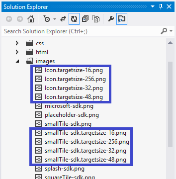

---
파일 활성화 처리
앱을 특정 파일 형식의 기본 처리기로 등록할 수 있습니다.
ms.assetid: A0F914C5-62BC-4FF7-9236-E34C5277C363
---

# 파일 활성화 처리


\[ Windows 10의 UWP 앱에 맞게 업데이트되었습니다. Windows 8.x 문서는 [보관](http://go.microsoft.com/fwlink/p/?linkid=619132)을 참조하세요. \]


**중요 API**

-   [**Windows.ApplicationModel.Activation.FileActivatedEventArgs**](https://msdn.microsoft.com/library/windows/apps/br224716)
-   [**Windows.UI.Xaml.Application.OnFileActivated**](https://msdn.microsoft.com/library/windows/apps/br242331)

앱을 특정 파일 형식의 기본 처리기로 등록할 수 있습니다. CWP(클래식 Windows 플랫폼) 앱과 UWP(유니버설 Windows 플랫폼) 앱 모두 기본 파일 처리기로 등록할 수 있습니다. 사용자가 앱을 특정 파일 형식의 기본 처리기로 선택하면 해당 형식의 파일을 시작할 때 앱이 활성화됩니다.

해당 형식의 파일에 대해 모든 파일 시작을 처리하려는 경우에만 파일 형식을 등록하는 것이 좋습니다. 앱에서 파일 형식을 내부적으로만 사용해야 할 경우에는 기본 처리기로 등록할 필요가 없습니다. 파일 형식을 등록할 경우에는 앱이 해당 파일 형식에 대해 활성화될 때 기대되는 기능을 최종 사용자에게 제공해야 합니다. 예를 들어 사진 뷰어 앱은 .jpg 파일을 표시하도록 등록할 수 있습니다. 파일 연결에 대한 자세한 내용은 [파일 형식 및 URI에 대한 지침](https://msdn.microsoft.com/library/windows/apps/hh700321)을 참조하세요.

다음 단계에서는 사용자 지정 파일 형식인 .alsdk를 등록하는 방법 및 사용자가 .alsdk 파일을 시작할 때 앱을 활성화하는 방법을 보여 줍니다.

> **참고** UWP 앱에서 특정 URI 및 파일 확장명은 기본 제공 앱과 운영 체제에서 사용하기 위해 예약되어 있습니다. 예약된 URI 또는 파일 확장명에 앱을 등록하려고 하면 무시됩니다. 자세한 내용은 [예약된 파일 및 URI 스키마 이름](reserved-uri-scheme-names.md)을 참조하세요.

## 1단계: 패키지 매니페스트에서 확장점 지정


앱은 패키지 매니페스트에 나열된 파일 확장명에 대해서만 활성화 이벤트를 받습니다. 다음은 앱이 `.alsdk` 확장명을 가진 파일을 처리하도록 지정하는 방법입니다.

1.  **솔루션 탐색기**에서 package.appxmanifest를 두 번 클릭하여 매니페스트 디자이너를 엽니다. **선언** 탭을 선택하고 **사용 가능한 선언** 드롭다운 목록에서 **파일 형식 연결**을 선택한 다음 **추가**를 클릭합니다. 파일 연결에서 사용하는 식별자에 대한 자세한 내용은 [프로그래밍 ID](https://msdn.microsoft.com/library/windows/desktop/cc144152)를 참조하세요.

    다음은 매니페스트 디자이너에서 입력할 수 있는 각 필드에 대한 간략한 설명입니다.

| 필드 | 설명 |
|------------------|----------------------------------------------------------------------------------------------------------------------------------------------------------------------------------------------------------------------------------------------------------------------------------------------------------------------------------------------------------------------------------------------------------|
| **표시 이름** | 파일 형식 그룹에 대한 표시 이름을 지정합니다. 표시 이름은 **제어판**의 [기본 프로그램 설정](https://msdn.microsoft.com/library/windows/desktop/cc144154)에서 파일 형식을 식별하는 데 사용됩니다. |
| **로고** | 데스크톱 및 **제어판**의 [기본 프로그램 설정](https://msdn.microsoft.com/library/windows/desktop/cc144154)에서 파일 형식을 식별하는 데 사용되는 로고를 지정합니다. 로고를 지정하지 않으면 응용 프로그램의 작은 로고가 사용됩니다. |
| **정보 팁** | 파일 형식 그룹에 대한 [정보 팁](https://msdn.microsoft.com/library/windows/desktop/cc144152)을 지정합니다. 이 도구 설명 텍스트는 사용자가 이 파일 형식의 아이콘을 가리키면 표시됩니다. |
| **이름** | 동일한 표시 이름, 로고, 정보 팁 및 편집 플래그를 공유하는 파일 형식 그룹의 이름을 선택합니다. 앱 업데이트 간에 동일하게 유지될 수 있는 그룹 이름을 선택합니다. **참고** 이름은 모두 소문자여야 합니다. |
| **콘텐츠 형식** | 특정 파일 형식에 대해 **image/jpeg** 같은 MIME 콘텐츠 형식을 지정합니다. **허용된 콘텐츠 형식에 대한 중요 정보: **다음은 예약되거나 금지되어 있기 때문에 패키지 매니페스트에 입력할 수 없는 MIME 콘텐츠 형식의 사전순 목록입니다. **application/force-download**, **application/octet-stream**, **application/unknown**, **application/x-msdownload**. |
| **파일 형식** | 앞에 마침표를 추가하여 등록할 파일 형식을 지정합니다(예제: ".jpeg"). **예약되거나 금지된 파일 형식** 예약되거나 금지되어 UWP 앱에 등록할 수 없는 기본 제공 앱의 파일 형식에 대한 사전순 목록은 [예약된 URI 체계 이름 및 파일 형식](reserved-uri-scheme-names.md)을 참조하세요. |

2.  **이름**으로 `alsdk`를 입력합니다.
3.  **파일 형식**으로 `.alsdk`를 입력합니다.
4.  "images\\Icon.png"를 로고로 입력합니다.
5.  Ctrl+S를 눌러 package.appxmanifest에 변경 사항을 저장합니다.

위 단계는 이와 같은 [**Extension**](https://msdn.microsoft.com/library/windows/apps/br211400) 요소를 패키지 매니페스트에 추가합니다. **windows.fileTypeAssociation** 범주는 앱이 `.alsdk` 확장명을 가진 파일을 처리한다는 것을 나타냅니다.

```xml
      <Extensions>
        <uap:Extension Category="windows.fileTypeAssociation">
          <uap:FileTypeAssociation Name="alsdk">
            <uap:Logo>images\icon.png</uap:Logo>
            <uap:SupportedFileTypes>
              <uap:FileType>.alsdk</uap:FileType>
            </uap:SupportedFileTypes>
          </uap:FileTypeAssociation>
        </uap:Extension>
      </Extensions>
```

## 2단계: 적절한 아이콘 추가


파일 형식의 기본값이 되는 앱에는 시스템 전체의 다양한 위치에 표시되는 아이콘이 있습니다. 예를 들어 다음과 같은 아이콘이 표시됩니다.

-   Windows 탐색기 항목 보기, 상황에 맞는 메뉴 및 리본
-   기본 프로그램 제어판
-   파일 선택기
-   시작 화면의 검색 결과

앱 타일 로고의 모양을 일치시키고 아이콘을 투명으로 설정하는 대신 앱의 배경색을 사용합니다. 로고를 안쪽 여백 없이 가장자리로 확장합니다. 흰색 배경에서 아이콘을 테스트합니다. 예제 아이콘은 [연결 시작 샘플](http://go.microsoft.com/fwlink/p/?LinkID=620490)를 참조하세요.
.

## 3단계: 활성화된 이벤트 처리


[
            **OnFileActivated**](https://msdn.microsoft.com/library/windows/apps/br242331) 이벤트 처리기는 모든 파일 활성화 이벤트를 받습니다.

> [!div class="tabbedCodeSnippets"]
```vb
Protected Overrides Sub OnFileActivated(ByVal args As Windows.ApplicationModel.Activation.FileActivatedEventArgs)
      ' TODO: Handle file activation
      ' The number of files received is args.Files.Size
      ' The name of the first file is args.Files(0).Name
End Sub
```
```cpp
void App::OnFileActivated(Windows::ApplicationModel::Activation::FileActivatedEventArgs^ args)
{
       // TODO: Handle file activation
       // The number of files received is args->Files->Size
       // The first file is args->Files->GetAt(0)->Name
}
```
```cs
protected override void OnFileActivated(FileActivatedEventArgs args)
{
       // TODO: Handle file activation
       // The number of files received is args.Files.Size
       // The name of the first file is args.Files[0].Name
}
```

    > **Note**  When launched via File Contract, make sure that Back button takes the user back to the screen that launched the app and not to the app's previous content.

앱이 새 페이지를 여는 각 활성화 이벤트에 대해 새 XAML 프레임을 만들도록 하는 것이 좋습니다. 이런 식으로 새 XAML 프레임에 대한 탐색 백 스택에는 앱이 일시 중단될 때 현재 창에 포함될 수 있는 이전 콘텐츠가 포함되지 않습니다. 시작 및 파일 계약에 단일 XAML 프레임을 사용하도록 결정한 앱은 새 페이지를 탐색하기 전에 프레임의 탐색 저널에서 페이지를 지워야 합니다.

파일 활성화를 통해 시작된 경우 앱은 사용자가 앱의 최상위 페이지로 다시 이동할 수 있도록 하는 UI를 포함해야 합니다.

## 설명


받게 되는 파일은 신뢰할 수 없는 원본에서 올 수 있으므로 파일에 대한 작업을 수행하기 전에 파일 내용의 유효성을 검사하는 것이 좋습니다. 입력 유효성 검사에 대한 자세한 내용은 [안전한 코드 작성](http://go.microsoft.com/fwlink/p/?LinkID=142053)을 참조하세요.

> **참고** 이 문서는 UWP(유니버설 Windows 플랫폼) 앱을 작성하는 Windows 10 개발자용입니다. Windows 8.x 또는 Windows Phone 8.x를 개발하는 경우 [보관된 문서](http://go.microsoft.com/fwlink/p/?linkid=619132)를 참조하세요.

 

## 관련 항목

**전체 예제**

* [연결 시작 예제](http://go.microsoft.com/fwlink/p/?LinkID=231484)

**개념**

* [기본 프로그램](https://msdn.microsoft.com/library/windows/desktop/cc144154)
* [파일 형식 및 프로토콜 연결 모델](https://msdn.microsoft.com/library/windows/desktop/hh848047)

**작업**

* [파일에 대한 기본 앱 시작](launch-the-default-app-for-a-file.md)
* [URI 활성화 처리](handle-uri-activation.md)

**지침**

* [파일 형식 및 URI에 대한 지침](https://msdn.microsoft.com/library/windows/apps/hh700321)

**참조**
* [**Windows.ApplicationModel.Activation.FileActivatedEventArgs**](https://msdn.microsoft.com/library/windows/apps/br224716)
* [**Windows.UI.Xaml.Application.OnFileActivated**](https://msdn.microsoft.com/library/windows/apps/br242331)

 

 


<!--HONumber=Mar16_HO1-->


