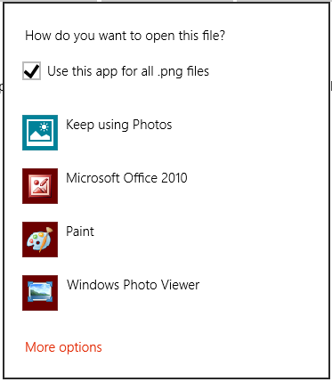
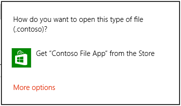

# <a name="launch-the-default-app-for-a-file"></a>파일에 대한 기본 앱 시작

**중요 API**

-   [**Windows.System.Launcher.LaunchFileAsync**](https://msdn.microsoft.com/library/windows/apps/hh701461)

파일에 대한 기본 앱 시작 방법을 학습합니다. 앱에서 처리할 수 없는 파일로 작업해야 하는 경우가 많습니다. 예를 들어 메일 앱은 다양한 파일 형식을 받게 되므로 기본 처리기에서 이러한 파일을 시작하는 방법이 필요합니다. 다음 단계에서는 [**Windows.System.Launcher**](https://msdn.microsoft.com/library/windows/apps/br241801) API를 사용하여 앱에서 처리할 수 없는 파일의 기본 처리기를 시작하는 방법을 보여 줍니다.

## <a name="get-the-file-object"></a>파일 개체 가져오기

먼저 파일에 대한 [**Windows.Storage.StorageFile**](https://msdn.microsoft.com/library/windows/apps/br227171) 개체를 가져옵니다.

파일이 앱 패키지에 포함되어 있는 경우 [**Package.InstalledLocation**](https://msdn.microsoft.com/library/windows/apps/br224681) 속성을 사용하여 [**Windows.Storage.StorageFolder**](https://msdn.microsoft.com/library/windows/apps/br227230) 개체를 가져오고 [**Windows.Storage.StorageFolder.GetFileAsync**](https://msdn.microsoft.com/library/windows/apps/br227272) 메서드를 사용하여 [**StorageFile**](https://msdn.microsoft.com/library/windows/apps/br227171) 개체를 가져옵니다.

알려진 폴더에 파일이 있으면 [**Windows.Storage.KnownFolders**](https://msdn.microsoft.com/library/windows/apps/br227151) 클래스의 속성을 사용하여 [**StorageFolder**](https://msdn.microsoft.com/library/windows/apps/br227230) 개체를 가져오고 [**GetFileAsync**](https://msdn.microsoft.com/library/windows/apps/br227272) 메서드를 사용하여 [**StorageFile**](https://msdn.microsoft.com/library/windows/apps/br227171) 개체를 가져옵니다.

## <a name="launch-the-file"></a>파일 시작

Windows는 파일의 기본 처리기를 시작하는 여러 가지 다양한 옵션을 제공합니다. 이러한 옵션은 이 장과 다음 섹션에서 설명합니다.

| 옵션 | 메서드 | 설명 |
|--------|--------|-------------|
| 기본 시작 | [**LaunchFileAsync(IStorageFile)**](https://msdn.microsoft.com/library/windows/apps/hh701471) | 지정된 파일을 기본 처리기를 사용하여 시작합니다. |
| 연결 프로그램 시작 | [**LaunchFileAsync(IStorageFile, LauncherOptions)**](https://msdn.microsoft.com/library/windows/apps/hh701465) | 사용자가 연결 프로그램 대화 상자를 통해 처리기를 선택하여 지정된 파일을 시작합니다. |
| 권장 앱 폴백으로 시작 | [**LaunchFileAsync(IStorageFile, LauncherOptions)**](https://msdn.microsoft.com/library/windows/apps/hh701465) | 지정된 파일을 기본 처리기를 사용하여 시작합니다. 처리기가 시스템에 설치되어 있지 않으면 스토어의 앱을 사용자에게 권장합니다. |
| 원하는 유지 보기로 시작 | [**LaunchFileAsync(IStorageFile, LauncherOptions)**](https://msdn.microsoft.com/library/windows/apps/hh701465)(Windows만 해당) | 지정된 파일을 기본 처리기를 사용하여 시작합니다. 시작한 후 화면에 유지되도록 기본 설정을 지정하고 특정 창 크기를 요청합니다. [**LauncherOptions.DesiredRemainingView**](https://msdn.microsoft.com/library/windows/apps/dn298314)는 모바일 디바이스 패밀리에서 지원되지 않습니다. |

### <a name="default-launch"></a>기본 시작

기본 앱을 시작하려면 [**Windows.System.Launcher.LaunchFileAsync(IStorageFile)**](https://msdn.microsoft.com/library/windows/apps/hh701471) 메서드를 호출합니다. 이 예제에서는 [**Windows.Storage.StorageFolder.getFileAsync**](https://msdn.microsoft.com/library/windows/apps/br227272) 메서드를 사용하여 앱 패키지에 포함된 이미지 파일 test.png를 시작합니다.

```csharp
async void DefaultLaunch()
{
   // Path to the file in the app package to launch
   string imageFile = @"images\test.png";
   
   var file = await Windows.ApplicationModel.Package.Current.InstalledLocation.GetFileAsync(imageFile);
   
   if (file != null)
   {
      // Launch the retrieved file
      var success = await Windows.System.Launcher.LaunchFileAsync(file);

      if (success)
      {
         // File launched
      }
      else
      {
         // File launch failed
      }
   }
   else
   {
      // Could not find file
   }
}
```

```vb
async Sub DefaultLaunch()
   ' Path to the file in the app package to launch
   Dim imageFile = "images\test.png"
   Dim file = await Windows.ApplicationModel.Package.Current.InstalledLocation.GetFileAsync(imageFile)
   
   If file IsNot Nothing Then
      ' Launch the retrieved file
      Dim success = await Windows.System.Launcher.LaunchFileAsync(file)

      If success Then
         ' File launched
      Else
         ' File launch failed
      End If
   Else
      ' Could not find file
   End If
End Sub
```

```cppwinrt
Windows::Foundation::IAsyncAction MainPage::DefaultLaunch()
{
    auto installFolder{ Windows::ApplicationModel::Package::Current().InstalledLocation() };

    Windows::Storage::StorageFile file{ co_await installFolder.GetFileAsync(L"images\\test.png") };

    if (file)
    {
        // Launch the retrieved file
        bool success = co_await Windows::System::Launcher::LaunchFileAsync(file);
        if (success)
        {
            // File launched
        }
        else
        {
            // File launch failed
        }
    }
    else
    {
        // Could not find file
    }
}
```

```cpp
void MainPage::DefaultLaunch()
{
   auto installFolder = Windows::ApplicationModel::Package::Current->InstalledLocation;

   concurrency::task<Windows::Storage::StorageFile^getFileOperation(installFolder->GetFileAsync("images\\test.png"));
   getFileOperation.then([](Windows::Storage::StorageFile^ file)
   {
      if (file != nullptr)
      {
         // Launch the retrieved file
         concurrency::task<bool> launchFileOperation(Windows::System::Launcher::LaunchFileAsync(file));
         launchFileOperation.then([](bool success)
         {
            if (success)
            {
               // File launched
            }
            else
            {
               // File launch failed
            }
         });
      }
      else
      {
         // Could not find file
      }
   });
}
```

### <a name="open-with-launch"></a>연결 프로그램 시작

[**LauncherOptions.DisplayApplicationPicker**](https://msdn.microsoft.com/library/windows/apps/hh701438)가 **true**로 설정된 [**Windows.System.Launcher.LaunchFileAsync(IStorageFile, LauncherOptions)**](https://msdn.microsoft.com/library/windows/apps/hh701465) 메서드를 호출하여 **연결 프로그램** 대화 상자에서 사용자가 선택하는 앱을 시작합니다.

사용자가 특정 파일에 대한 기본 앱이 아닌 다른 앱을 선택하려 할 경우 **연결 프로그램** 대화 상자를 사용하는 것이 좋습니다. 예를 들어 앱에서 사용자가 이미지 파일을 시작하도록 하려는 경우 기본 처리기는 뷰어 앱이 될 수 있습니다. 경우에 따라 사용자는 이미지를 보는 대신 편집하려 할 수 있습니다. 이러한 유형의 시나리오에서 사용자가 **연결 프로그램** 대화 상자를 표시하고 편집기 앱을 선택할 수 있도록 **앱 바** 또는 상황에 맞는 메뉴의 대체 명령과 함께 **연결 프로그램** 옵션을 사용합니다.



```csharp
async void DefaultLaunch()
{
   // Path to the file in the app package to launch
      string imageFile = @"images\test.png";
      
   var file = await Windows.ApplicationModel.Package.Current.InstalledLocation.GetFileAsync(imageFile);

   if (file != null)
   {
      // Set the option to show the picker
      var options = new Windows.System.LauncherOptions();
      options.DisplayApplicationPicker = true;

      // Launch the retrieved file
      bool success = await Windows.System.Launcher.LaunchFileAsync(file, options);
      if (success)
      {
         // File launched
      }
      else
      {
         // File launch failed
      }
   }
   else
   {
      // Could not find file
   }
}
```

```vb
async Sub DefaultLaunch()

   ' Path to the file in the app package to launch
   Dim imageFile = "images\test.png"

   Dim file = await Windows.ApplicationModel.Package.Current.InstalledLocation.GetFileAsync(imageFile)

   If file IsNot Nothing Then
      ' Set the option to show the picker
      Dim options = Windows.System.LauncherOptions()
      options.DisplayApplicationPicker = True

      ' Launch the retrieved file
      Dim success = await Windows.System.Launcher.LaunchFileAsync(file)

      If success Then
         ' File launched
      Else
         ' File launch failed
      End If
   Else
      ' Could not find file
   End If
End Sub
```

```cppwinrt
Windows::Foundation::IAsyncAction MainPage::DefaultLaunch()
{
    auto installFolder{ Windows::ApplicationModel::Package::Current().InstalledLocation() };

    Windows::Storage::StorageFile file{ co_await installFolder.GetFileAsync(L"images\\test.png") };

    if (file)
    {
        // Set the option to show the picker
        Windows::System::LauncherOptions launchOptions;
        launchOptions.DisplayApplicationPicker(true);

        // Launch the retrieved file
        bool success = co_await Windows::System::Launcher::LaunchFileAsync(file, launchOptions);
        if (success)
        {
            // File launched
        }
        else
        {
            // File launch failed
        }
    }
    else
    {
        // Could not find file
    }
}
```

```cpp
void MainPage::DefaultLaunch()
{
   auto installFolder = Windows::ApplicationModel::Package::Current->InstalledLocation;

   concurrency::task<Windows::Storage::StorageFile^> getFileOperation(installFolder->GetFileAsync("images\\test.png"));
   getFileOperation.then([](Windows::Storage::StorageFile^ file)
   {
      if (file != nullptr)
      {
         // Set the option to show the picker
         auto launchOptions = ref new Windows::System::LauncherOptions();
         launchOptions->DisplayApplicationPicker = true;

         // Launch the retrieved file
         concurrency::task<bool> launchFileOperation(Windows::System::Launcher::LaunchFileAsync(file, launchOptions));
         launchFileOperation.then([](bool success)
         {
            if (success)
            {
               // File launched
            }
            else
            {
               // File launch failed
            }
         });
      }
      else
      {
         // Could not find file
      }
   });
}
```

**권장 앱 폴백으로 시작**

경우에 따라 사용자는 시작할 파일을 처리하는 앱을 설치하지 않으려 할 수 있습니다. 기본적으로 Windows는 이러한 경우 사용자에게 스토어에서 적절한 앱을 검색할 수 있는 링크를 제공합니다. 이러한 경우 사용자에게 필요한 앱에 대한 특정 권장 지침을 제공하려면 시작할 파일과 함께 이 권장 지침을 전달할 수 있습니다. 이렇게 하려면 [**LauncherOptions.PreferredApplicationPackageFamilyName**](https://msdn.microsoft.com/library/windows/apps/hh965482)을 스토어에서 권장하려는 앱의 패키지 패밀리 이름으로 설정하여 [**Windows.System.Launcher.launchFileAsync(IStorageFile, LauncherOptions)**](https://msdn.microsoft.com/library/windows/apps/hh701465) 메서드를 호출합니다. 그런 다음 [**LauncherOptions.PreferredApplicationDisplayName**](https://msdn.microsoft.com/library/windows/apps/hh965481)을 해당 앱의 이름으로 설정합니다. Windows에서는 이 정보를 사용하여 스토어에서 앱을 검색하는 일반적인 옵션을 스토어에서 권장 앱을 다운로드하는 특정 옵션으로 바꿉니다.

> [!NOTE]
> 앱을 권장 하려면 이러한 옵션을 둘 다 설정 해야 합니다. 하나만 설정하면 오류가 발생합니다.



```csharp
async void DefaultLaunch()
{
   // Path to the file in the app package to launch
   string imageFile = @"images\test.contoso";

   // Get the image file from the package's image directory
   var file = await Windows.ApplicationModel.Package.Current.InstalledLocation.GetFileAsync(imageFile);

   if (file != null)
   {
      // Set the recommended app
      var options = new Windows.System.LauncherOptions();
      options.PreferredApplicationPackageFamilyName = "Contoso.FileApp_8wknc82po1e";
      options.PreferredApplicationDisplayName = "Contoso File App";

      // Launch the retrieved file pass in the recommended app
      // in case the user has no apps installed to handle the file
      bool success = await Windows.System.Launcher.LaunchFileAsync(file, options);
      if (success)
      {
         // File launched
      }
      else
      {
         // File launch failed
      }
   }
   else
   {
      // Could not find file
   }
}
```

```vb
async Sub DefaultLaunch()

   ' Path to the file in the app package to launch
   Dim imageFile = "images\test.contoso"

   ' Get the image file from the package's image directory
   Dim file = await Windows.ApplicationModel.Package.Current.InstalledLocation.GetFileAsync(imageFile)

   If file IsNot Nothing Then
      ' Set the recommended app
      Dim options = Windows.System.LauncherOptions()
      options.PreferredApplicationPackageFamilyName = "Contoso.FileApp_8wknc82po1e";
      options.PreferredApplicationDisplayName = "Contoso File App";

      ' Launch the retrieved file pass in the recommended app
      ' in case the user has no apps installed to handle the file
      Dim success = await Windows.System.Launcher.LaunchFileAsync(file)

      If success Then
         ' File launched
      Else
         ' File launch failed
      End If
   Else
      ' Could not find file
   End If
End Sub
```

```cppwinrt
Windows::Foundation::IAsyncAction MainPage::DefaultLaunch()
{
    auto installFolder{ Windows::ApplicationModel::Package::Current().InstalledLocation() };

    Windows::Storage::StorageFile file{ co_await installFolder.GetFileAsync(L"images\\test.png") };

    if (file)
    {
        // Set the recommended app
        Windows::System::LauncherOptions launchOptions;
        launchOptions.PreferredApplicationPackageFamilyName(L"Contoso.FileApp_8wknc82po1e");
        launchOptions.PreferredApplicationDisplayName(L"Contoso File App");

        // Launch the retrieved file, and pass in the recommended app
        // in case the user has no apps installed to handle the file.
        bool success = co_await Windows::System::Launcher::LaunchFileAsync(file, launchOptions);
        if (success)
        {
            // File launched
        }
        else
        {
            // File launch failed
        }
    }
    else
    {
        // Could not find file
    }
}
```

```cpp
void MainPage::DefaultLaunch()
{
   auto installFolder = Windows::ApplicationModel::Package::Current->InstalledLocation;

   concurrency::task<Windows::Storage::StorageFile^> getFileOperation(installFolder->GetFileAsync("images\\test.contoso"));
   getFileOperation.then([](Windows::Storage::StorageFile^ file)
   {
      if (file != nullptr)
      {
         // Set the recommended app
         auto launchOptions = ref new Windows::System::LauncherOptions();
         launchOptions->PreferredApplicationPackageFamilyName = "Contoso.FileApp_8wknc82po1e";
         launchOptions->PreferredApplicationDisplayName = "Contoso File App";
         
         // Launch the retrieved file pass, and in the recommended app
         // in case the user has no apps installed to handle the file.
         concurrency::task<bool> launchFileOperation(Windows::System::Launcher::LaunchFileAsync(file, launchOptions));
         launchFileOperation.then([](bool success)
         {
            if (success)
            {
               // File launched
            }
            else
            {
               // File launch failed
            }
         });
      }
      else
      {
         // Could not find file
      }
   });
}
```

### <a name="launch-with-a-desired-remaining-view-windows-only"></a>원하는 유지 보기로 시작(Windows만 해당)

[**LaunchFileAsync**](https://msdn.microsoft.com/library/windows/apps/hh701461)를 호출하는 원본 앱은 파일이 시작된 후 화면에 유지되도록 요청할 수 있습니다. 기본적으로 Windows는 파일을 처리하는 대상 앱과 원본 앱 사이에 모든 사용 가능한 공간을 동일하게 공유하려고 합니다. 원본 앱은 [**DesiredRemainingView**](https://msdn.microsoft.com/library/windows/apps/dn298314) 속성을 사용하여 앱 창이 거의 모든 사용 가능한 공간을 사용하려고 한다는 것을 운영 체제에 나타냅니다. **DesiredRemainingView**를 사용하여 파일이 시작된 후 원본 앱이 화면에서 유지될 필요가 없고 대상 앱으로 완전히 대체될 수 있다는 것을 나타낼 수도 있습니다. 이 속성은 호출 앱의 기본 창 크기만 지정합니다. 화면에 동시에 나타날 수도 있는 다른 앱의 동작은 지정하지 않습니다.

> [!NOTE]
> Windows 고려 같은 여러 가지 요소 예를 들어 원본 앱의 최종 창 크기를 결정할 때 원본 앱의 기본 설정, 화면, 화면 방향 및 등에서 앱의 수입니다. [**DesiredRemainingView**](https://msdn.microsoft.com/library/windows/apps/dn298314)를 설정해도 원본 앱에 대한 특정 창 작업 동작이 보장되지 않습니다.

**모바일 디바이스 패밀리:** [**LauncherOptions.DesiredRemainingView**](https://msdn.microsoft.com/library/windows/apps/dn298314) 모바일 장치 패밀리에서 지원 되지 않습니다.

```csharp
async void DefaultLaunch()
{
   // Path to the file in the app package to launch
   string imageFile = @"images\test.png";
   
   var file = await Windows.ApplicationModel.Package.Current.InstalledLocation.GetFileAsync(imageFile);

   if (file != null)
   {
      // Set the desired remaining view
      var options = new Windows.System.LauncherOptions();
      options.DesiredRemainingView = Windows.UI.ViewManagement.ViewSizePreference.UseLess;

      // Launch the retrieved file
      bool success = await Windows.System.Launcher.LaunchFileAsync(file, options);
      if (success)
      {
         // File launched
      }
      else
      {
         // File launch failed
      }
   }
   else
   {
      // Could not find file
   }
}
```

```cppwinrt
Windows::Foundation::IAsyncAction MainPage::DefaultLaunch()
{
    auto installFolder{ Windows::ApplicationModel::Package::Current().InstalledLocation() };

    Windows::Storage::StorageFile file{ co_await installFolder.GetFileAsync(L"images\\test.png") };

    if (file)
    {
        // Set the desired remaining view.
        Windows::System::LauncherOptions launchOptions;
        launchOptions.DesiredRemainingView(Windows::UI::ViewManagement::ViewSizePreference::UseLess);

        // Launch the retrieved file.
        bool success = co_await Windows::System::Launcher::LaunchFileAsync(file, launchOptions);
        if (success)
        {
            // File launched
        }
        else
        {
            // File launch failed
        }
    }
    else
    {
        // Could not find file
    }
}
```

```cpp
void MainPage::DefaultLaunch()
{
   auto installFolder = Windows::ApplicationModel::Package::Current->InstalledLocation;

   concurrency::task<Windows::Storage::StorageFile^> getFileOperation(installFolder->GetFileAsync("images\\test.png"));
   getFileOperation.then([](Windows::Storage::StorageFile^ file)
   {
      if (file != nullptr)
      {
         // Set the desired remaining view.
         auto launchOptions = ref new Windows::System::LauncherOptions();
         launchOptions->DesiredRemainingView = Windows::UI::ViewManagement::ViewSizePreference::UseLess;

         // Launch the retrieved file.
         concurrency::task<bool> launchFileOperation(Windows::System::Launcher::LaunchFileAsync(file, launchOptions));
         launchFileOperation.then([](bool success)
         {
            if (success)
            {
               // File launched
            }
            else
            {
               // File launch failed
            }
         });
      }
      else
      {
         // Could not find file
      }
   });
}
```

## <a name="remarks"></a>설명

실행된 앱은 앱에서 선택할 수 없으므로 사용자가 어떤 앱이 실행되고 있는지 확인합니다. 사용자는 UWP(유니버설 Windows 플랫폼) 앱 또는 Windows 데스크톱 앱을 선택할 수 있습니다.

파일을 시작하면 앱은 포그라운드 앱이 되어야 합니다. 즉, 사용자에게 표시되어야 합니다. 이 요구 사항은 사용자가 제어권을 갖도록 하는 데 도움이 됩니다. 이 요구 사항을 충족하려면 모든 파일 실행을 앱의 UI에 직접 연결해야 합니다. 대부분의 경우, 사용자는 항상 파일 실행을 시작하기 위해 일부 작업을 수행해야 합니다.

운영 체제에 의해 자동으로 실행되는 경우 코드 또는 스크립트가 포함된 파일 형식은 시작할 수 없습니다(예: .exe, .msi 및 .js 파일). 이 제한 사항은 운영 체제를 수정할 수 있는 잠재적 악성 파일로부터 사용자를 보호합니다. 이 방법을 사용하면 스크립트를 격리하는 앱에서 실행되는 경우 스크립트가 포함될 수 있는 파일 형식을 시작할 수 있습니다(예: .docx 파일). Microsoft Word와 같은 앱은 .docx 파일의 스크립트가 운영 체제를 수정하는 것을 방지합니다.

제한된 파일 형식을 실행하려고 하면 실행이 실패하고 오류 콜백이 호출됩니다. 앱이 서로 다른 유형의 파일을 처리하는 경우 이러한 오류 발생이 예상되면 사용자에게 대체 환경을 제공하는 것이 좋습니다. 예를 들어, 사용자에게 파일을 바탕 화면에 저장하는 옵션을 줄 수 있고 사용자는 바탕 화면에서 파일을 열 수 있습니다.

## <a name="related-topics"></a>관련 항목

### <a name="tasks"></a>작업

* [URI에 대한 기본 앱 실행](launch-default-app.md)
* [파일 활성화 처리](handle-file-activation.md)

### <a name="guidelines"></a>지침

* [파일 형식 및 URI에 대한 지침](https://msdn.microsoft.com/library/windows/apps/hh700321)

### <a name="reference"></a>참조

* [**Windows.Storage.StorageFile**](https://msdn.microsoft.com/library/windows/apps/br227171)
* [**Windows.System.Launcher.LaunchFileAsync**](https://msdn.microsoft.com/library/windows/apps/hh701461)
