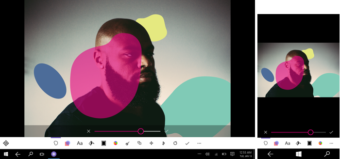

#  UWP 앱의 콘텐츠 디자인 기본 사항

<link rel="stylesheet" href="https://az835927.vo.msecnd.net/sites/uwp/Resources/css/custom.css"> 

모든 앱의 기본 목적은 콘텐츠에 액세스할 수 있도록 하는 것입니다. 사진 편집 앱에서는 사진이 콘텐츠이고, 여행 앱에서는 여행 목적지에 대한 지도와 정보가 콘텐츠인 식입니다. 탐색 요소는 콘텐츠에 액세스할 수 있도록 하고, 명령 요소는 사용자가 콘텐츠를 조작할 수 있도록 하며, 콘텐츠 요소는 실제 콘텐츠를 표시합니다.

이 문서에서는 세 가지 콘텐츠 시나리오에 대한 콘텐츠 디자인 권장 사항을 제공합니다.

## 올바른 콘텐츠 시나리오에 대한 디자인

다음과 같은 세 가지 기본 콘텐츠 시나리오가 있습니다.

-   **사용**: 콘텐츠가 사용되는 기본적으로 단방향 환경입니다. 사용으로는 읽기, 음악 듣기, 동영상 보기, 사진 및 이미지 보기 등의 작업이 있습니다.
-   **만들기**: 포커스가 새 콘텐츠를 만드는 것인 기본적으로 단방향 환경입니다. 만들기는 사진 또는 동영상 촬영, 그리기 앱에서 새 이미지 만들기 또는 새 문서 열기와 같은 처음부터 만들기로 나눌 수 있습니다.
-   **대화형**: 콘텐츠 사용, 만들기 및 수정을 포함하는 양방향 콘텐츠 환경입니다.

## 사용 중심 앱

콘텐츠 요소는 사용 중심 앱에서 최고 우선 순위를 가지며 그 뒤를 사용자가 원하는 콘텐츠를 찾는 데 필요한 [탐색 요소](navigation-basics.md)가 따릅니다. 사용 중심 앱의 예로는 동영상 플레이어, 읽기 앱, 음악 앱 및 사진 뷰어가 있습니다.

사용 중심 앱에 대한 일반 권장 사항:

-   사용자가 원하는 콘텐츠를 찾을 때 집중하여 전용 페이지에서 해당 콘텐츠를 볼 수 있도록 전용 [탐색](navigation-basics.md) 페이지와 콘텐츠 보기 페이지를 만드는 것을 고려하세요.
-   전체 화면을 채우도록 콘텐츠를 확장하고 다른 모든 UI 요소를 숨기는 전체 화면 보기 옵션을 만드는 것을 고려하세요.

## 만들기 중심 앱

콘텐츠 및 [명령](commanding-basics.md) 요소는 만들기 중심 앱에서 가장 중요한 UI 요소이며, 명령 요소를 통해 사용자는 새 콘텐츠를 만들 수 있습니다. 그리기 앱, 사진 편집 앱, 동영상 편집 앱 및 워드 프로세싱 앱을 예로 들 수 있습니다.

예를 들어 도구 및 사진 조작 옵션에 대한 액세스를 제공하기 위해 명령 모음을 사용하는 사진 앱의 디자인이 있습니다. 모든 명령이 명령 모음에 있으므로 앱의 화면 공간 대부분을 콘텐츠 즉, 편집할 사진에 할애할 수 있습니다.

만들기 중심 앱에 대한 일반 권장 사항:

-   [탐색](navigation-basics.md) 요소 사용을 최소화하세요.
-   [명령](commanding-basics.md) 요소는 만들기 중심 앱에서 특히 중요합니다. 사용자가 많은 명령을 실행하므로 명령 기록/실행 취소 기능을 제공하는 것이 좋습니다.

## 대화형 콘텐츠가 있는 앱

대화형 콘텐츠가 있는 앱에서 사용자는 콘텐츠를 만들고 보고 편집합니다. 많은 앱이 이 범주에 속합니다. 이러한 유형의 앱의 예로는 LOB(기간 업무) 앱, 인벤토리 관리 앱, 사용자가 레시피를 만들거나 수정할 수 있는 요리 앱이 있습니다.

이러한 종류의 앱은 다음과 같은 세 가지 UI 요소 전체의 균형이 맞아야 합니다.

-   [탐색](navigation-basics.md) 요소는 사용자가 콘텐츠를 찾고 보는 것을 도와줍니다. 콘텐츠 보기 및 찾기가 가장 중요한 시나리오인 경우 탐색 요소, 필터링 및 정렬, 검색에 우선 순위를 두세요.
-   [명령](commanding-basics.md) 요소를 통해 사용자는 콘텐츠를 만들고 편집하며 조작할 수 있습니다.

대화형 콘텐츠가 있는 앱에 대한 일반 권장 사항:

-   탐색, 콘텐츠 및 명령 요소가 모두 중요한 경우 이들 간의 균형을 맞추기가 어려울 수 있습니다. 가능한 경우 콘텐츠 검색, 만들기 및 편집을 위한 별도의 화면을 만들거나 모드 전환을 제공하는 것을 고려하세요.

## 일반적으로 사용되는 콘텐츠 요소

일반적으로 콘텐츠를 표시하는 데 사용되는 몇 가지 UI 요소는 다음과 같습니다. (전체 UI 요소 목록은 [컨트롤 및 UI 요소](https://msdn.microsoft.com/library/windows/apps/dn611856)를 참조하세요.)

<table>
<colgroup>
<col width="33%" />
<col width="33%" />
<col width="33%" />
</colgroup>
<thead>
<tr class="header">
<th align="left">범주</th>
<th align="left">요소</th>
<th align="left">설명</th>
</tr>
</thead>
<tbody>
<tr class="odd">
<td align="left">오디오 및 비디오</td>
<td align="left">[미디어 재생 및 전송 컨트롤](../controls-and-patterns/media-playback.md)</td>
<td align="left">오디오 및 동영상을 재생합니다.</td>
</tr>
<tr class="even">
<td align="left">이미지 뷰어</td>
<td align="left">[대칭 이동 보기](../controls-and-patterns/flipview.md), [이미지](../controls-and-patterns/images-imagebrushes.md)</td>
<td align="left">이미지를 표시합니다. 대칭 이동 보기는 앨범의 사진이나 제품 세부 정보 페이지의 품목과 같이 한 번에 하나씩 컬렉션의 이미지를 표시합니다.</td>
</tr>
<tr class="odd">
<td align="left">목록</td>
<td align="left">[드롭다운 목록, 목록 상자, 목록 보기 및 그리드 보기](../controls-and-patterns/lists.md)</td>
<td align="left">항목을 대화형 목록이나 그리드로 표시합니다. 사용자가 새 개봉작 목록에서 영화를 선택하거나 인벤토리를 관리할 수 있도록 하려면 이러한 요소를 선택합니다.</td>
</tr>
<tr class="even">
<td align="left">텍스트 및 텍스트 입력</td>
<td align="left">
[텍스트 블록](../controls-and-patterns/text-block.md), [텍스트 상자](../controls-and-patterns/text-box.md), [서식 있는 편집 상자](../controls-and-patterns/rich-edit-box.md)

</td>
<td align="left">텍스트를 표시합니다. 일부 요소를 통해 사용자는 텍스트를 편집할 수 있습니다. 자세한 내용은 [텍스트 컨트롤](../controls-and-patterns/text-controls.md)을 참조하세요.</td>
</tr>
</tbody>
</table>

 

 

