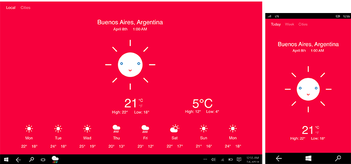
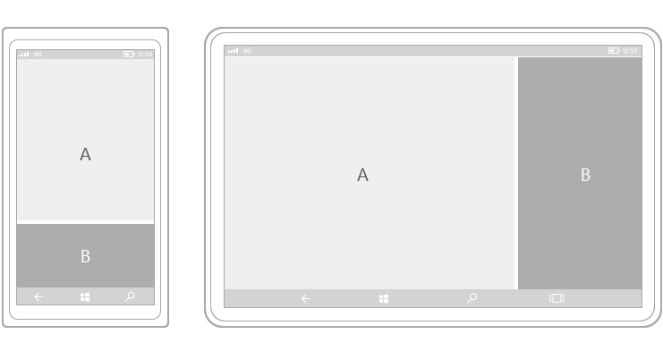
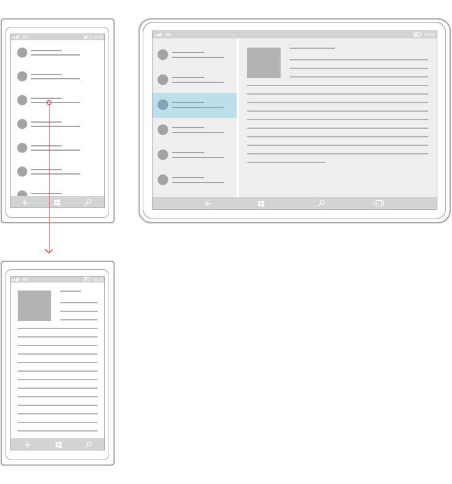

#  UWP 앱 디자인 소개 

<link rel="stylesheet" href="https://az835927.vo.msecnd.net/sites/uwp/Resources/css/custom.css">

UWP(유니버설 Windows 플랫폼) 앱은 휴대폰에서 태블릿 또는 PC에 이르기까지 모든 Windows 기반 디바이스에서 실행할 수 있습니다.

이러한 다양한 디바이스에 잘 어울리는 앱을 디자인하는 것은 아주 어려운 일일 수 있습니다. 그렇다면 서로 다른 화면 크기와 입력 방법으로 디바이스에 뛰어난 UX를 제공하는 앱을 디자인하려면 어떻게 해야 할까요? 다행히 UWP(유니버설 Windows 플랫폼)에서 이 작업에 도움이 되는 기본 제공 기능 집합 및 유니버설 구성 요소를 제공합니다. 

이 문서에서는 UI 기능 및 UWP 앱의 이점을 설명하고 첫 UWP 앱 만들기에 대한 몇 가지 고급 디자인 참조 자료를 제공합니다. UWP 앱을 만들 때 얻게 되는 몇 가지 기능부터 살펴보겠습니다. 

## UWP 앱 기능

### 유효 픽셀 및 크기 조정

UWP 앱은 모든 디바이스에서 읽을 수 있도록 컨트롤, 글꼴 및 다른 UI 요소의 크기를 조정합니다.

디바이스에서 앱이 실행될 때 시스템은 화면에 UI 요소가 표시되는 방식을 정규화하는 알고리즘을 사용합니다. 이 크기 조정 알고리즘은 가시거리 및 화면 밀도(인치당 픽셀)를 고려하여 물리적 크기가 아닌 인식되는 크기를 최적화합니다. 크기 조정 알고리즘에 따르면 3m 떨어져 있는 Surface Hub의 24픽셀 글꼴은 몇 인치 떨어져 있는 5인치 휴대폰의 24픽셀 글꼴과 마찬가지로 읽힙니다.

크기 조정 시스템의 작동 방식 때문에 UWP 앱을 디자인할 때 실제 물리적 픽셀이 아닌 *유효 픽셀*로 디자인하게 됩니다. 그렇다면 이러한 특성이 앱을 디자인하는 방식에는 어떤 영향을 미치나요?

-   디자인할 때는 픽셀 밀도 및 실제 화면 해상도를 무시해도 됩니다. 대신, 크기 클래스에 대한 유효 해상도(유효 픽셀로 나타낸 해상도)를 고려해서 디자인합니다(자세한 내용은 [화면 크기 및 중단점 문서](screen-sizes-and-breakpoints-for-responsive-design.md) 참조).

-   시스템은 UI 크기를 확장할 때 4의 배수씩 확장합니다. 명확하게 나타내기 위해 디자인을 4x4 픽셀 그리드에 맞추고, UI 요소의 여백, 크기 및 위치를 지정하고, 텍스트의 위치(크기는 지정 안 함, 텍스트는 어떤 크기여도 상관없음)를 4 유효 픽셀의 배수로 설정합니다.

다음 그림에서는 4x4 픽셀 그리드에 매핑되지 않은 디자인 요소를 보여 줍니다. 이 디자인 요소의 가장자리는 항상 선명하고 날카롭게 나타납니다.

다음 그림에서는 4x4 그리드에 매핑되지 않는 디자인 요소를 보여 줍니다. 일부 장치에서 이러한 디자인 요소의 가장자리는 흐릿하고 부드럽게 나타납니다.

> [!TIP]
> 이미지 편집 프로그램에서 화면 모형을 만드는 경우 DPI를 72로 설정하고 이미지 크기를 목표로 하는 크기 클래스의 유효 해상도로 설정하세요. 크기 클래스 및 유효 해상도 목록은 이 문서의 [특정 크기 클래스에 대한 권장 사항](#sizeclasses)을 참조하세요.

### 범용 입력 및 스마트 조작

UWP의 다른 기본 제공 기능은 스마트 조작을 통해 활성화되는 유니버설 입력입니다. 특정 입력 모드 및 디바이스에 대한 앱을 디자인할 수 있지만 그럴 필요는 없습니다. 유니버설 Windows 앱이 기본적으로 스마트 조작을 사용하기 때문입니다. 즉, 클릭이 실제 마우스 클릭인지 또는 손가락으로 탭한 것인지를 알거나 정의하지 않고 클릭 조작을 디자인할 수 있습니다.

### 유니버설 컨트롤 및 스타일

UWP 플랫폼은 여러 디바이스 패밀리를 위한 앱을 더욱 쉽게 디자인할 수 있도록 하는 몇 가지 유용한 기본 구성 요소도 제공합니다.

-   **범용 컨트롤**

    UWP는 모든 Windows 기반 장치에서 원활하게 작동되는 범용 컨트롤 집합을 제공합니다. 이 범용 컨트롤 집합에는 라디오 단추, 텍스트 상자 등의 일반적인 양식 컨트롤부터 데이터 스트림 및 템플릿에서 항목 목록을 생성할 수 있는 그리드 보기 및 목록 보기와 같은 정교한 컨트롤에 이르기까지 모든 컨트롤이 포함됩니다. 이러한 컨트롤은 입력을 인식하고, 각 디바이스 패밀리에 대한 적절한 입력 기능, 이벤트 상태 및 전반적인 기능 집합과 함께 배포됩니다.

    이러한 컨트롤 및 컨트롤에서 만들 수 있는 패턴의 전체 목록을 보려면 [컨트롤 및 패턴](https://dev.windows.com/design/controls-patterns) 섹션을 참조하세요.

-   **범용 스타일**

    UWP 앱은 다음과 같은 기능을 제공하는 기본 스타일 집합을 자동으로 가져옵니다.

    -   앱에 자동으로 밝은 테마 또는 어두운 테마(사용자가 선택)를 지정하고 사용자의 테마 컬러 기본 설정을 통합할 수 있는 스타일 집합입니다.

        

    -   모든 장치에서 앱 텍스트가 선명하게 보이도록 하는 맑은 고딕 기반 형식 램프.
    -   조작에 대한 기본 애니메이션
    -   고대비 모드를 자동으로 지원합니다. 고대비를 고려하여 스타일을 디자인했기 때문에 고대비 모드의 장치에서 앱을 실행하는 경우에도 스타일이 올바르게 표시됩니다.
    -   다른 언어를 자동으로 지원합니다. Microsoft의 기본 스타일시트는 Windows에서 지원하는 모든 언어에 대해 올바른 글꼴을 자동으로 선택합니다. 동일한 앱에서 여러 언어를 사용할 수도 있으며 이러한 언어가 올바르게 표시됩니다.
    -   RTL 읽기 순서에 대해 기본 제공 지원

    이러한 기본 스타일을 사용자 지정하여 앱을 나만의 방식으로 꾸미거나 자체 스타일로 완전히 바꾸어 고유한 시각적 환경을 만들 수 있습니다. 예를 들어 다음은 고유한 시각적 스타일이 있는 날씨 앱의 디자인입니다.

    

UWP 앱의 구성 요소를 설명했으므로 구성 요소를 배치하여 UI를 만드는 방법을 살펴보겠습니다. 
    
## 일반적인 UWP 앱의 구조

최신 사용자 인터페이스는 궁극적으로 사용하는 장치 화면의 개별 픽셀로 만들어진 텍스트, 모양, 색 및 애니메이션으로 구성된 복잡한 것입니다. 사용자 인터페이스 디자인을 시작할 때 순전히 가능한 선택의 수는 굉장히 많습니다.

간단히 하기 위해 디자인 관점에서 앱의 구조를 정의해보겠습니다. 앱은 화면과 페이지로 구성됩니다. 각 페이지에는 세 가지 유형의 UI 요소 즉 탐색, 명령 및 콘텐츠 요소로 구성된 사용자 인터페이스가 있습니다.

<table class="uwpd-noborder" >
<colgroup>
<col width="50%" />
<col width="50%" />
</colgroup>
<tbody>
<tr class="odd">
<td align="left">

</td>
<td align="left"><strong>탐색 요소</strong>

탐색 요소는 사용자가 표시하려는 콘텐츠를 선택하는 데 도움을 줍니다. 탐색 요소의 예로는 [탭 및 피벗](../controls-and-patterns/tabs-pivot.md), [하이퍼링크](../controls-and-patterns/hyperlinks.md) 및 [탐색 창](../controls-and-patterns/nav-pane.md)이 있습니다.

탐색 요소에 대해서는 [탐색 디자인 기본 사항](navigation-basics.md) 문서에 자세히 설명되어 있습니다.

<strong>명령 요소</strong>

명령 요소는 조작, 저장 또는 콘텐츠 공유 등의 작업을 시작합니다. 명령 요소의 예로는 [단추](../controls-and-patterns/buttons.md) 및 [명령 모음](../controls-and-patterns/app-bars.md)이 있습니다. 명령 요소에는 실제로 화면에 표시되지 않는 바로 가기 키도 포함될 수 있습니다.

명령 요소에 대해서는 [명령 디자인 기본 사항](commanding-basics.md) 문서에 자세히 설명되어 있습니다.

<strong>콘텐츠 요소</strong>

콘텐츠 요소는 앱의 콘텐츠를 표시합니다. 그리기 앱의 경우 콘텐츠는 그리기일 수 있습니다. 뉴스 앱의 경우 콘텐츠는 뉴스 기사일 수 있습니다.

콘텐츠 요소에 대해서는 [콘텐츠 디자인 기본 사항](content-basics.md) 문서에 자세히 설명되어 있습니다.
</td>
</tr>
</tbody>
</table>

 

최소한 앱에는 시작 화면과 사용자 인터페이스를 정의하는 홈페이지가 포함되어 있습니다. 일반적인 앱은 여러 페이지 및 화면을 포함하며, 탐색, 명령 및 콘텐츠 요소는 페이지별로 다를 수 있습니다.

앱에 알맞은 UI 요소를 결정할 때에는 앱에서 실행되는 디바이스 및 화면 크기를 고려해야 할 수 있습니다.

## 특정 디바이스 및 화면 크기에 맞게 앱 조정

UWP 앱은 유효 픽셀을 사용하여 모든 Windows 기반 디바이스에서 디자인 요소를 읽고 사용할 수 있습니다. 그렇다면 특정 디바이스 패밀리에 대한 앱의 UI를 사용자 지정하려는 이유는 무엇일까요?

**참고**  
미리 짚고 넘어갈 점은 Windows에서는 앱이 실행되는 특정 디바이스를 앱 내에서 검색하는 방법을 제공하지 않는다는 것입니다. 물론 앱이 실행 중인 디바이스 패밀리(모바일, 데스크톱, 등), 유효 해상도 및 앱에서 사용할 수 있는 화면 공간 크기(앱의 창 크기)는 알 수 있습니다.

 

-   **공간을 가장 효율적으로 사용하고 탐색 필요성을 줄이려면**

    휴대폰과 같이 화면이 작은 장치에서 보기 좋게 디자인한 앱은 더 큰 디스플레이가 있는 PC에서도 사용할 수 있지만 공간이 낭비될 수 있습니다. 화면이 특정 크기보다 클 경우 더 많은 콘텐츠를 표시하도록 앱을 사용자 지정할 수 있습니다. 예를 들어 쇼핑 앱은 휴대폰에서 한 번에 하나의 상품 범주를 표시하지만 PC나 노트북에서는 동시에 여러 범주와 제품을 표시할 수 있습니다.

    화면에 더 많은 콘텐츠를 배치하여 사용자가 수행해야 하는 이동 작업을 줄입니다.

-   **장치의 기능을 활용하려면**

    특정 장치에 특정 장치 기능이 많을 확률이 높습니다. 예를 들어 휴대폰에는 위치 센서와 카메라가 있을 수 있지만 PC에는 이러한 기능이 없을 수 있습니다. 앱은 사용할 수 있는 기능을 감지하고 이러한 기능을 사용하게 하는 기능을 활성화합니다.

-   **입력을 위해 최적화하려면**

    범용 컨트롤 라이브러리는 모든 입력 유형(터치, 펜, 키보드, 마우스)에서 작동하지만 UI 요소를 다시 정렬하여 특정 입력 유형에 맞게 최적화할 수 있습니다. 예를 들어 화면 아래쪽에 탐색 요소를 배치할 경우 휴대폰 사용자는 더 쉽게 액세스할 수 있지만 대부분의 PC 사용자는 화면의 위쪽에 탐색 요소가 있을 것으로 기대합니다.

## 반응형 디자인 기술

특정 화면 너비에 맞게 앱의 UI를 최적화하는 경우 반응형 디자인을 만든다고 할 수 있습니다. 다음은 앱의 UI를 사용자 지정하는 데 사용할 수 있는 6가지 반응형 디자인 기술입니다.

### 위치 변경

앱 UI 요소의 위치와 배치를 변경하여 각 장치 공간을 최대한 활용할 수 있습니다. 이 예제에서는 한 번에 하나의 전체 프레임만 표시되므로 휴대폰 또는 패블릿의 세로 보기에는 스크롤 UI가 필요합니다. 앱이 세로 방향이든, 가로 방향이든, 두 개의 전체 화면 프레임을 허용하는 장치로 변환되면 프레임 B가 전용 공간을 차지할 수 있습니다. 위치 지정을 위해 그리드를 사용하는 경우 동일한 그리드에 UI 요소를 재배치할 수 있습니다.

사진 앱에 대한 이 예제 디자인에서는 사진 앱이 더 큰 화면에서 해당 콘텐츠의 위치를 변경합니다.

### 크기 조정

UI 요소의 여백과 크기를 조정하여 프레임 크기를 최적화할 수 있습니다. 여기에 나온 예제와 같이 이러한 기능을 사용하여 단순히 콘텐츠 프레임을 늘려 더 넓은 화면에서 읽을 수 있습니다.

### 재배치

장치 및 방향에 따라 UI 요소의 흐름을 변경하여 콘텐츠를 최적 상태로 표시할 수 있습니다. 예를 들어 더 큰 화면으로 전환할 때는 그에 맞게 더 큰 컨테이너로 전환하고, 열을 추가하고, 다른 방식으로 목록 항목을 생성할 수 있습니다.

이 예제에서는 휴대폰 또는 패블릿의 세로로 스크롤되는 콘텐츠의 단일 열을 텍스트의 두 열을 표시하도록 더 큰 화면에 재배치할 수 있는 방법을 보여 줍니다.

###  표시

화면 공간에 따라서나 장치가 추가 기능, 특정 상황 또는 기본 설정 화면 방향을 지원하는 경우 UI를 표시할 수 있습니다.

탭이 있는 이 예제에서 카메라 아이콘이 있는 중간 탭은 휴대폰 또는 패블릿의 앱에 적합할 수 있으며 더 큰 장치에는 적용 가능하지 않아 오른쪽에 있는 장치에서는 표시됩니다. UI를 표시하거나 숨기는 또 다른 일반적인 예제는 미디어 플레이어 컨트롤에 적용됩니다. 이 경우 단추 집합이 작은 장치에서는 줄어들고 큰 장치에서는 확장됩니다. 예를 들어 PC의 미디어 플레이어는 휴대폰에 있을 때보다 훨씬 더 많은 화면 기능을 처리할 수 있습니다.

표시 또는 숨기기 기술에는 더 많은 메타데이터를 표시해야 하는 경우를 선택하는 기능도 포함됩니다. 휴대폰이나 패블릿과 같이 공간이 중요한 경우에는 최소한의 메타데이터를 표시하는 것이 가장 좋습니다. 노트북 또는 데스크톱 PC를 사용할 때는 많은 양의 메타데이터를 표시할 수 있습니다. 메타데이터 표시 또는 숨기기를 처리하는 방법의 몇 가지 예는 다음과 같습니다.

-   메일 앱에서 사용자의 아바타를 표시할 수 있습니다.
-   음악 앱에서 앨범 또는 아티스트에 대한 자세한 내용을 표시할 수 있습니다.
-   동영상 앱에서는 배우 및 스탭 세부 정보를 표시하는 것과 같이 영화나 프로그램에 대한 추가 정보를 표시할 수 있습니다.
-   앱에서는 열을 나누어 좀 더 자세한 내용을 표시할 수 있습니다.
-   앱에서는 세로로 접히고 가로로 펼쳐지는 항목을 사용할 수 있습니다. 휴대폰 또는 패블릿에서 더 큰 장치로 전환할 경우 누적된 목록 항목이 바뀌면서 목록 항목의 행과 메타데이터 열이 표시될 수 있습니다.

### 바꾸기

이 기술은 특정 장치 크기 등급 또는 방향에 맞게 사용자 인터페이스를 전환할 수 있도록 합니다. 이 예제에서 탐색 창과 소형의 임시 UI는 좀 더 작은 장치에서 잘 작동하지만 좀 더 큰 장치에서는 탭을 사용하는 것이 좋습니다.

###  다시 설계

특정 장치에 보다 적합하도록 앱 아키텍처를 축소하거나 분기할 수 있습니다. 이 예제에서는 왼쪽 장치에서 오른쪽 장치로 이동하면서 페이지가 어떻게 연결되는지 보여 줍니다.

스마트 홈 앱의 디자인에 적용된 기술의 예는 다음과 같습니다.

## 관련 문서

- [UWP 앱이란 무엇인가요?](https://msdn.microsoft.com/library/windows/apps/dn726767.aspx)

 

<!--HONumber=Dec16_HO2-->

