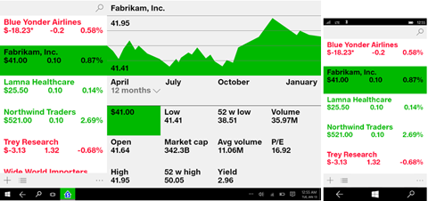

#  UWP 앱의 탐색 디자인 기본 사항

<link rel="stylesheet" href="https://az835927.vo.msecnd.net/sites/uwp/Resources/css/custom.css">

UWP(유니버설 Windows 플랫폼) 앱의 탐색은 탐색 구조, 탐색 요소 및 시스템 수준 기능의 유연한 모델을 기반으로 합니다. 이러한 것이 모여 앱, 페이지, 콘텐츠 간에 이동할 때 다양한 직관적인 사용자 환경을 제공합니다.

경우에 따라 사용자가 이동 작업만으로 해당 콘텐츠를 탐색할 수 있도록 앱의 콘텐츠와 기능을 모두 단일 페이지에 맞출 수도 있습니다. 그러나 대부분의 앱에는 일반적으로 탐색, 참여 및 조작할 여러 페이지의 콘텐츠 및 기능이 있습니다. 앱에 페이지가 두 개 이상 있는 경우 적절한 탐색 환경을 제공해야 합니다.

사용자에게 의미 있는 앱을 제공하기 위해 UWP 앱에는 다중 페이지 탐색 환경에는 다음이 포함되어 있습니다(뒷부분에서 자세히 설명).

-   **적합한 탐색 구조**

    사용자에게 적합한 탐색 구조를 작성하는 것이 직관적인 탐색 환경을 만드는 데 중요합니다.

-   선택한 구조를 지원하는 **호환 가능한 탐색 요소**

    탐색 요소를 통해 사용자는 원하는 콘텐츠로 쉽게 이동하고 앱 내에서의 현재 위치를 쉽게 알 수 있습니다. 그러나 이러한 요소가 콘텐츠 또는 명령 요소에 사용할 수 있는 공간을 차지하므로 앱 구조에 적합한 탐색 요소만 사용하는 것이 중요합니다.

-   **시스템 수준의 탐색 기능(예: 뒤로)에 대한 적절한 응답**

    직관적이라고 생각되는 일관된 환경을 제공하기 위해서는 사용자가 예측 가능한 방식으로 시스템 수준 탐색 기능에 응답합니다.

## 적합한 탐색 구조 구축

앱을 각 페이지에 고유한 콘텐츠 또는 기능 집합이 포함된 페이지 그룹 컬렉션으로 살펴보겠습니다. 예를 들어 사진 앱에는 사진을 촬영하기 위한 페이지, 이미지 편집을 위한 페이지 및 이미지 라이브러리를 관리하기 위한 페이지가 있을 수 있습니다. 이러한 페이지를 그룹으로 정렬하는 방법은 앱의 탐색 구조를 정의합니다. 페이지 그룹을 정렬하는 방법에는 다음 두 가지가 있습니다.

<table class="uwpd-noborder uwpd-top-aligned-table">
<colgroup>
<col width="50%" />
<col width="50%" />
</colgroup>
<thead>
<tr class="header">
<th align="left">계층 구조로</th>
<th align="left">피어로</th>
</tr>
</thead>
<tbody>
<tr class="odd">
<td style="text-align: center;">

</td>
<td style="text-align: center;">

</td>
</tr>
<tr class="even">
<td style="vertical-align: top">페이지가 트리와 같은 구조로 구성됩니다. 각 자식 페이지에는 부모 페이지가 하나만 있지만 부모 페이지에는 자식 페이지가 여러 개 있을 수 있습니다. 자식 페이지로 가려면 부모 페이지를 통해 이동합니다. </td>
<td style="vertical-align: top"> 페이지가 나란히 존재합니다. 순서에 관계 없이 페이지 간을 이동할 수 있습니다. </td>
</tr>
</tbody>
</table>

 

일반적인 앱은 두 가지 정렬 방식을 모두 사용하여 일부는 피어로, 일부는 계층 구조로 정렬됩니다.

그렇다면 언제 페이지를 계층 구조로 배열해야 하고 언제 피어로 배열해야 할까요? 이러한 질문에 답변하려면 그룹에 포함된 페이지 수, 페이지가 특정 순서로 트래버스되는지 여부 및 페이지 간 관계를 고려해야 합니다. 일반적으로 구조가 단순할수록 이해하기 쉽고 탐색이 더 빨라지지만 계층 구조가 깊어야 적합한 경우도 있습니다.

  
계층적 관계 사용이 권장되는 경우
<ul>
<li>사용자가 특정 순서로 페이지를 트래버스할 것으로 예상됩니다. 계층 구조를 정렬하여 해당 순서를 적용합니다.</li>
<li>그룹의 한 페이지와 다른 페이지 간에 명확한 부모-자식 관계가 있습니다.</li>
<li>그룹에 8페이지 이상이 포함되어 있습니다.

그룹에 8페이지 이상이 있는 경우 페이지가 얼마나 고유한지 이해하거나 그룹 내에서 페이지의 현재 위치를 파악하기 어려울 수 있습니다. 이러한 것이 앱에 문제가 되지 않는다면 계속 진행하고 페이지를 피어로 만듭니다. 그러지 않은 경우 계층 구조를 사용하여 페이지를 둘 이상의 더 작은 그룹으로 구분하는 것이 좋습니다. (허브 컨트롤은 페이지를 범주로 그룹화하는 데 도움이 될 수 있습니다.)
</li>
</ul>
  

  
피어 관계 사용이 권장되는 경우
<ul>
<li>순서에 관계없이 페이지를 볼 수 있습니다.</li>
<li>페이지끼리 명확히 구분이 가며 명확한 부모/자식 관계가 없습니다.</li>
<li>
그룹의 페이지 수가 8개 미만입니다.

그룹의 7페이지 이상이 있는 경우 페이지가 고유한 페이지인지를 이해하거나 그룹 내에서의 현재 위치를 파악하기 어려울 수 있습니다. 이러한 것이 앱에 문제가 되지 않는다면 계속 진행하고 페이지를 피어로 만듭니다. 그러지 않은 경우 계층 구조를 사용하여 페이지를 둘 이상의 더 작은 그룹으로 구분하는 것이 좋습니다. (허브 컨트롤은 페이지를 범주로 그룹화하는 데 도움이 될 수 있습니다.)
</li>
</ul>
  

 

## 적절한 탐색 요소 사용

탐색 요소는 두 가지 서비스를 제공할 수 있습니다. 사용자가 원하는 콘텐츠로 이동하도록 도와줍니다. 일부 요소는 사용자가 앱 내에서의 현재 위치를 알 수 있도록 합니다. 그러나 이러한 요소가 앱이 콘텐츠 또는 명령 요소에 사용할 수 있는 공간을 차지하므로 앱 구조에 적합한 탐색 요소만 사용하는 것이 중요합니다.

### 피어 투 피어 탐색 요소

피어 투 피어 탐색 요소는 동일한 하위 트리의 동일한 수준에서 페이지 간 탐색할 수 있도록 합니다.

피어 투 피어 탐색을 위해서는 탭이나 탐색 창을 사용하는 것이 좋습니다.

<table>
<thead>
<tr class="header">
<th align="left">탐색 요소</th>
<th align="left">설명</th>
</tr>
</thead>
<tbody>
<tr class="odd">
<td style="vertical-align:top;">[탭 및 피벗](../controls-and-patterns/tabs-pivot.md)

</td>
<td style="vertical-align:top;">동일한 수준의 페이지에 대한 링크의 영구 목록을 표시합니다.

탭/피벗을 사용하는 경우

<ul>
<li>
2-5페이지가 있습니다.

(5페이지를 초과하는 경우 탭/피벗을 사용할 수 있지만, 화면의 모든 탭/피벗에 맞추기는 어려울 수 있습니다.)
</li>
<li>사용자가 페이지 사이에서 자주 전환할 것으로 예상됩니다.</li>
</ul>

음식점 찾기 앱의 다음 디자인에서는 탭/피벗을 사용합니다.

</td>
</tr>
<tr class="even">
<td style="vertical-align:top;">[탐색 창](../controls-and-patterns/nav-pane.md)

</td>
<td style="vertical-align:top;">최상위 수준 페이지에 대한 링크 목록을 표시합니다.

탐색 창을 사용하는 경우:

<ul>
<li>사용자가 페이지 간을 자주 전환할 것으로 예상되지 않습니다.</li>
<li>탐색 작업이 느려지더라도 공간을 절약하고 싶습니다.</li>
<li>페이지는 최상위 수준에 있습니다.</li>
</ul>

이 스마트 홈 앱 디자인에서는 탐색 창을 사용합니다.

</td>
</tr>
</tbody>
</table>

 

탐색 구조에 수준이 여러 개인 경우 피어 투 피어 탐색 요소를 현재 하위 트리 내 피어에만 연결하는 것이 좋습니다. 세 개의 수준이 있는 탐색 구조를 보여 주는 다음 그림을 참조하세요.

-   수준 1의 경우 피어 투 피어 탐색 요소는 A, B, C 및 D 페이지에 대한 액세스를 제공해야 합니다.
-   수준 2에서 A2 페이지에 대한 피어 투 피어 탐색 요소는 다른 A2 페이지에만 연결되어야 하며 C 하위 트리의 수준 2 페이지에는 연결되지 않아야 합니다.

### 계층적 탐색 요소

계층적 탐색 요소는 부모 페이지와 해당 자식 페이지 간을 탐색할 수 있도록 합니다.

<table>
<thead>
<tr class="header">
<th align="left">탐색 요소</th>
<th align="left">설명</th>
</tr>
</thead>
<tbody>
<tr class="odd">
<td style="vertical-align:top;">[허브](../controls-and-patterns/hub.md)

</td>
<td align="left">허브는 해당 자식 페이지의 미리 보기/요약을 제공하는 특수한 형식의 탐색 컨트롤입니다. 탐색 창 또는 탭과 달리 페이지 자체에 포함된 링크 및 섹션 머리글을 통해 이러한 자식 페이지로 탐색할 수 있습니다.

허브를 사용하는 경우:

<ul>
<li>사용자가 각 페이지로 이동하지 않고도 자식 페이지의 콘텐츠 중 일부를 볼 것으로 예상됩니다.</li>
</ul>

허브에서 검색 및 탐색을 지원하여 미디어, 뉴스 읽기 프로그램 및 쇼핑 앱에 적합합니다.

</td>
</tr>

<tr class="even">
<td style="vertical-align:top;">[마스터/세부](../controls-and-patterns/master-details.md)

</td>
<td align="left">항목 요약 목록(마스터 보기)을 표시합니다. 항목을 선택하면 세부 정보 섹션에 해당 항목 페이지가 표시됩니다.

마스터/세부 요소를 사용하는 경우:

<ul>
<li>사용자가 자식 항목 간을 자주 전환할 것으로 예상됩니다.</li>
<li>개별 항목 또는 항목 그룹에 대해 삭제 또는 정렬과 같은 상위 수준 작업을 수행할 수 있도록 하거나 각 항목에 대한 세부 정보를 보거나 업데이트할 수 있도록 하려고 합니다.</li>
</ul>

마스터/세부 요소는 메일 받은 편지함, 연락처 목록 및 데이터 항목에 적합합니다.

이 주식 추적 앱 디자인에서는 마스터/세부 정보 패턴을 사용합니다.

</td>
</tr>
</tbody>
</table>

 

### 기록 탐색 요소

<table>
<thead>
<tr class="header">
<th align="left">탐색 요소</th>
<th align="left">설명</th>
</tr>
</thead>
<tbody>
<tr class="odd">
<td style="vertical-align:top;">[뒤로](navigation-history-and-backwards-navigation.md)</td>
<td style="vertical-align:top;">사용자가 앱 내에서 그리고 장치에 따라 앱 간에 탐색 기록을 트래버스할 수 있도록 하겠습니다. 자세한 내용은 [탐색 기록 및 뒤로 탐색 문서](navigation-history-and-backwards-navigation.md)를 참조하세요.</td>
</tr>
</tbody>
</table>

 

### 콘텐츠 수준 탐색 요소

<table>
<thead>
<tr class="header">
<th align="left">탐색 요소</th>
<th align="left">설명</th>
</tr>
</thead>
<tbody>
<tr class="odd">
<td style="vertical-align:top;">하이퍼링크 및 단추</td>
<td style="vertical-align:top;">콘텐츠가 포함 탐색 요소는 페이지의 콘텐츠에 나타납니다. 페이지 그룹이나 하위 트리에서 일관되어야 하는 다른 탐색 요소와 달리, 콘텐츠 포함 탐색 요소는 페이지 간에 고유합니다.</td>
</tr>
</tbody>
</table>

 

### 탐색 요소 결합

탐색 요소를 결합하여 앱에 적합한 탐색 환경을 만들 수 있습니다. 예를 들어 앱에서 새 탐색 창을 사용하여 두 번째 수준의 페이지에 액세스할 수 있는 최상위 페이지 및 탭에 대한 액세스를 제공할 수 있습니다.

 

<!--HONumber=Dec16_HO3-->

