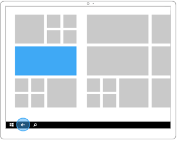
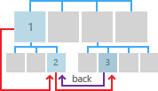
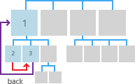
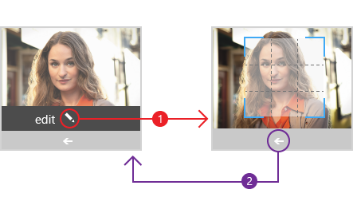

#  <a name="navigation-history-and-backwards-navigation-for-uwp-apps"></a>UWP 앱에 대한 탐색 기록 및 뒤로 탐색

<link rel="stylesheet" href="https://az835927.vo.msecnd.net/sites/uwp/Resources/css/custom.css">

웹의 개별 웹 사이트에서는 목차, 단추, 메뉴, 간단한 링크 목록 등과 같은 자체 탐색 시스템을 이용할 수 있습니다. 탐색 환경은 웹 사이트마다 크게 다를 수 있습니다. 그러나 일관된 한 가지 탐색 환경은 바로 뒤로 기능입니다. 대부분의 브라우저는 웹 사이트와 관계없이 동일한 방식으로 동작하는 뒤로 단추를 제공합니다.

비슷한 이유로, UWP(유니버설 Windows 플랫폼)에서 앱 내에서 그리고 장치에 따라 앱 간에 사용자의 탐색 기록을 트래버스할 수 있도록 일관된 뒤로 탐색 시스템을 제공합니다.

시스템 뒤로 단추의 UI는 각 폼 팩터 및 입력 장치 유형에 최적화되어 있지만 탐색 환경은 장치 및 UWP 앱 전체에서 전역적이고 일관됩니다.

뒤로 단추 UI가 포함된 기본 폼 팩터는 다음과 같습니다.


<table>
    <tr>
        <td colspan="2">장치</td>
        <td style="vertical-align:top;">뒤로 단추 동작</td>
     </tr>
    <tr>
        <td style="vertical-align:top;">Phone</td>
        <td style="vertical-align:top;"></td>
        <td style="vertical-align:top;">
        <ul>
<li>항상 제공됩니다.</li>
<li>장치 아래쪽에 있는 소프트웨어 단추 또는 하드웨어 버튼입니다.</li>
<li>앱 내 및 앱 간의 전역 뒤로 탐색 기능입니다.</li>
</ul>
</td>
     </tr>
     <tr>
        <td style="vertical-align:top;">태블릿</td>
        <td style="vertical-align:top;"></td>
        <td style="vertical-align:top;">
<ul>
<li>태블릿 모드에서 항상 제공됩니다. 데스크톱 모드에서 사용할 수 없습니다. 대신 제목 표시줄의 뒤로 단추를 사용하도록 설정할 수 있습니다. 자세한 내용은 [PC, 노트북, 태블릿](#PC)을 참조하세요.
사용자는 **설정 &gt; 시스템 &gt; 태블릿 모드**로 이동하여 **장치를 태블릿으로 사용할 때 Windows 터치 조작 향상시키기**를 설정하여 태블릿 모드와 데스크톱 모드 간에 전환하여 실행할 수 있습니다.</li>
<li> 장치 아래쪽의 탐색 모음에 있는 소프트웨어 단추입니다.</li>
<li>앱 내 및 앱 간의 전역 뒤로 탐색 기능입니다.</li></ul>        
        </td>
     </tr>
    <tr>
        <td style="vertical-align:top;">PC, 노트북, 태블릿</td>
        <td style="vertical-align:top;"></td>
        <td style="vertical-align:top;">
<ul>
<li>데스크톱 모드에서는 옵션입니다. 태블릿 모드에서는 사용할 수 없습니다. 자세한 내용은 [태블릿](#Tablet)을 참조하세요. 기본적으로 사용하지 않도록 설정되어 있습니다. 사용하도록 설정하려면 옵트인(opt in)해야 합니다.
사용자는 **설정 &gt; 시스템 &gt; 태블릿 모드**로 이동하여 **장치를 태블릿으로 사용할 때 Windows 터치 조작 향상시키기**를 설정하여 태블릿 모드와 데스크톱 모드 간에 전환하여 실행할 수 있습니다.</li>
<li>앱의 제목 표시줄에 있는 소프트웨어 단추입니다.</li>
<li>앱 내에서만 뒤로 탐색 기능을 제공합니다. 앱 간 탐색 기능을 지원하지 않습니다.</li></ul>        
        </td>
     </tr>
    <tr>
        <td style="vertical-align:top;">Surface Hub</td>
        <td style="vertical-align:top;"></td>
        <td style="vertical-align:top;">
<ul>
<li>옵션.</li>
<li>기본적으로 사용하지 않도록 설정되어 있습니다. 사용하도록 설정하려면 옵트인(opt in)해야 합니다.</li>
<li>앱의 제목 표시줄에 있는 소프트웨어 단추입니다.</li>
<li>앱 내에서만 뒤로 탐색 기능을 제공합니다. 앱 간 탐색 기능을 지원하지 않습니다.</li></ul>        
        </td>
     </tr>     
<table>


다음은 뒤로 단추 UI를 사용하지 않지만 정확히 동일한 기능을 제공하는 몇 가지 대체 입력 유형입니다.


<table>
<tr><td colspan="3">입력 장치</td></tr>
<tr><td style="vertical-align:top;">Keyboard</td><td style="vertical-align:top;"></td><td style="vertical-align:top;">Windows 키 + 백스페이스</td></tr>
<tr><td style="vertical-align:top;">Cortana</td><td style="vertical-align:top;"></td><td style="vertical-align:top;">"안녕 코타나, 뒤로 이동"이라고 말하기</td></tr>
</table>
 

앱이 휴대폰이나 태블릿 또는 시스템 뒤로 기능이 설정된 PC 또는 노트북에서 실행될 경우 시스템은 사용자가 뒤로 단추를 누를 때 앱에 알립니다. 사용자는 뒤로 단추를 누르면 앱의 탐색 기록에서 이전 위치로 이동될 것으로 예상합니다. 탐색 기록에 추가할 탐색 동작과 뒤로 단추 누르기에 응답하는 방식은 사용자가 결정해야 합니다.


## <a name="how-to-enable-system-back-navigation-support"></a>시스템 뒤로 탐색 지원을 사용하도록 설정하는 방법


앱은 모든 하드웨어 및 소프트웨어 시스템 뒤로 단추에 대해 뒤로 탐색 기능을 사용하도록 설정해야 합니다. [**BackRequested**](https://msdn.microsoft.com/library/windows/apps/dn893596) 이벤트에 대한 수신기를 등록하고 해당 처리기를 정의하여 이 작업을 수행합니다.

여기서는 App.xaml 코드 숨김 파일에서 [**BackRequested**](https://msdn.microsoft.com/library/windows/apps/dn893596) 이벤트에 대한 전역 수신기를 등록합니다. 뒤로 탐색에서 특정 페이지를 제외하려는 경우 각 페이지에 이 이벤트를 등록하거나, 페이지를 표시하기 전에 페이지 수준 코드를 실행할 수 있습니다.

> [!div class="tabbedCodeSnippets"]
```csharp
Windows.UI.Core.SystemNavigationManager.GetForCurrentView().BackRequested += 
    App_BackRequested;
```
```cpp
Windows::UI::Core::SystemNavigationManager::GetForCurrentView()->
    BackRequested += ref new Windows::Foundation::EventHandler<
    Windows::UI::Core::BackRequestedEventArgs^>(
        this, &amp;App::App_BackRequested);
```

다음은 앱의 루트 프레임에서 [**GoBack**](https://msdn.microsoft.com/library/windows/apps/dn893596)을 호출하는 해당 [**BackRequested**](https://msdn.microsoft.com/library/windows/apps/dn996568) 이벤트 처리기입니다.

이 처리기는 전역 뒤로 이벤트에서 호출됩니다. 앱 내 뒤로 스택이 비어 있으면 시스템이 앱 스택에서 이전 앱으로 이동하거나 시작 화면으로 이동할 수 있습니다. 데스크톱 모드에서는 앱 뒤로 스택이 없으며 사용자는 앱 내 뒤로 스택이 고갈된 경우에도 계속 앱에 있습니다.

> [!div class="tabbedCodeSnippets"]
```csharp
>private void App_BackRequested(object sender, 
>    Windows.UI.Core.BackRequestedEventArgs e)
>{
>    Frame rootFrame = Window.Current.Content as Frame;
>    if (rootFrame == null)
>        return;
>
>    // Navigate back if possible, and if the event has not 
>    // already been handled .
>    if (rootFrame.CanGoBack &amp;&amp; e.Handled == false)
>    {
>        e.Handled = true;
>        rootFrame.GoBack();
>    }
>}
```
```cpp
>void App::App_BackRequested(
>    Platform::Object^ sender, 
>    Windows::UI::Core::BackRequestedEventArgs^ e)
>{
>    Frame^ rootFrame = dynamic_cast<Frame^>(Window::Current->Content);
>    if (rootFrame == nullptr)
>        return;
>
>    // Navigate back if possible, and if the event has not
>    // already been handled.
>    if (rootFrame->CanGoBack && e->Handled == false)
>    {
>        e->Handled = true;
>        rootFrame->GoBack();
>    }
>}
```

## <a name="how-to-enable-the-title-bar-back-button"></a>제목 표시줄 뒤로 단추를 사용하도록 설정하는 방법


데스크톱 모드를 지원하고(일반적으로 PC 및 노트북이지만 일부 태블릿도 해당) 설정이 사용하도록 설정된(**설정 &gt; 시스템 &gt; 태블릿 모드**) 장치는 시스템 뒤로 단추가 포함된 전역 탐색 모음을 제공하지 않습니다.

데스크톱 모드에서는 모든 앱이 제목 표시줄이 있는 창에서 실행됩니다. 이 제목 표시줄에 표시되는 앱에 대체 뒤로 단추를 제공할 수 있습니다.

제목 표시줄 뒤로 단추는 데스크톱 모드의 장치에서 실행되는 앱에서만 사용할 수 있으며 앱 내 탐색 기록만 지원합니다. 즉, 앱 간 탐색 기록을 지원하지 않습니다.

**중요**  기본적으로 제목 표시줄의 뒤로 단추는 표시되지 않습니다. 옵트인(opt in)해야 합니다.

 

|                                                             |                                                        |
|-------------------------------------------------------------|--------------------------------------------------------|
|  |  |
| 데스크톱 모드, 뒤로 탐색 기능이 없습니다.                           | 데스크톱 모드, 뒤로 탐색 기능이 사용하도록 설정되어 있습니다.                 |

 

제목 표시줄 뒤로 단추를 사용하도록 설정할 코드 숨김 파일의 각 페이지에 대해 [**OnNavigatedTo**](https://msdn.microsoft.com/library/windows/apps/br227508) 이벤트를 재정의하고 [**AppViewBackButtonVisibility**](https://msdn.microsoft.com/library/windows/apps/dn986448)를 [**Visible**](https://msdn.microsoft.com/library/windows/apps/dn986276)로 설정합니다.

이 예제에서는 뒤로 스택의 각 페이지를 나열하고 프레임의 [**CanGoBack**](https://msdn.microsoft.com/library/windows/apps/br242685) 속성 값이 **true**인 경우 뒤로 단추를 사용하도록 설정합니다.

> [!div class="tabbedCodeSnippets"]
>```csharp
>protected override void OnNavigatedTo(NavigationEventArgs e)
>{
>    Frame rootFrame = Window.Current.Content as Frame;
>
>    string myPages = "";
>    foreach (PageStackEntry page in rootFrame.BackStack)
>    {
>        myPages += page.SourcePageType.ToString() + "\n";
>    }
>    stackCount.Text = myPages;
>
>    if (rootFrame.CanGoBack)
>    {
>        // Show UI in title bar if opted-in and in-app backstack is not empty.
>        SystemNavigationManager.GetForCurrentView().AppViewBackButtonVisibility = 
>            AppViewBackButtonVisibility.Visible;
>    }
>    else
>    {
>        // Remove the UI from the title bar if in-app back stack is empty.
>        SystemNavigationManager.GetForCurrentView().AppViewBackButtonVisibility = 
>            AppViewBackButtonVisibility.Collapsed;
>    }
>}
>```
>```cpp
>void StartPage::OnNavigatedTo(NavigationEventArgs^ e)
>{
>    auto rootFrame = dynamic_cast<Windows::UI::Xaml::Controls::Frame^>(Window::Current->Content);
>
>    Platform::String^ myPages = "";
>
>    if (rootFrame == nullptr)
>        return;
>
>    for each (PageStackEntry^ page in rootFrame->BackStack)
>    {
>        myPages += page->SourcePageType.ToString() + "\n";
>    }
>    stackCount->Text = myPages;
>
>    if (rootFrame->CanGoBack)
>    {
>        // If we have pages in our in-app backstack and have opted in to showing back, do so
>        Windows::UI::Core::SystemNavigationManager::GetForCurrentView()->AppViewBackButtonVisibility =
>            Windows::UI::Core::AppViewBackButtonVisibility::Visible;
>    }
>    else
>    {
>        // Remove the UI from the title bar if there are no pages in our in-app back stack
>        Windows::UI::Core::SystemNavigationManager::GetForCurrentView()->AppViewBackButtonVisibility =
>            Windows::UI::Core::AppViewBackButtonVisibility::Collapsed;
>    }
>}
>```


### <a name="guidelines-for-custom-back-navigation-behavior"></a>사용자 지정 뒤로 탐색 동작 지침

고유한 뒤로 스택 탐색 기능을 제공하려는 경우 다른 앱과 일관된 환경을 구현해야 합니다. 탐색 작업에 대해 다음과 같은 패턴을 따르는 것이 좋습니다.

<table>
<thead>
<tr class="header">
<th align="left">탐색 작업</th>
<th align="left">탐색 기록에 추가되나요?</th>
</tr>
</thead>
<tbody>
<tr class="odd">
<td style="vertical-align:top;"><strong>페이지 간, 다른 피어 그룹</strong></td>
<td style="vertical-align:top;"><strong>예</strong>
<p>이 그림에서 사용자는 피어 그룹을 교차해서 앱의 수준 1에서 수준 2로 이동하므로 탐색이 탐색 기록에 추가됩니다.</p>
<p></p>
<p>다음 그림에서 사용자는 동일한 수준의 두 피어 그룹 간을 이동하고 피어 그룹을 교차하므로 탐색이 탐색 기록에 추가됩니다.</p>
<p></p></td>
</tr>
<tr class="even">
<td style="vertical-align:top;"><strong>화면의 탐색 요소를 사용하지 않고 동일한 피어 그룹의 페이지 간</strong>
<p>동일한 피어 그룹을 사용하여 페이지 간을 이동합니다. 두 페이지로 직접 이동할 수 있도록 하는 항상 존재하는 탐색 요소(예: 탭/피벗 또는 도킹된 탐색 창)가 없습니다.</p></td>
<td style="vertical-align:top;"><strong>예</strong>
<p>다음 그림에서 사용자는 동일한 피어 그룹의 두 페이지 간을 이동합니다. 페이지에서 탭 또는 도킹된 탐색 창이 사용되지 않으므로 해당 탐색 내용이 탐색 기록에 추가됩니다.</p>
<p></p></td>
</tr>
<tr class="odd">
<td style="vertical-align:top;"><strong>화면의 탐색 요소를 사용하여 페이지 간, 동일한 피어 그룹</strong>
<p>동일한 피어 그룹에서 페이지 간을 이동합니다. 두 페이지 모두 동일한 탐색 요소에 표시됩니다. 예를 들어 두 페이지 모두 동일한 탭/피벗 요소를 사용하거나 두 페이지 모두 도킹된 탐색 창에 표시됩니다.</p></td>
<td style="vertical-align:top;"><strong>아니요</strong>
<p>사용자가 뒤로를 누르면 현재 피어 그룹으로 이동하기 전에 있던 마지막 페이지로 돌아갑니다.</p>
<p></p></td>
</tr>
<tr class="even">
<td style="vertical-align:top;"><strong>임시 UI 표시</strong>
<p>앱은 대화 상자, 시작 화면 또는 화상 키보드와 같은 팝업 또는 자식 창을 표시하거나 다중 선택 모드와 같은 특수 모드를 시작합니다.</p></td>
<td style="vertical-align:top;"><strong>아니요</strong>
<p>사용자가 뒤로 단추를 누르면 임시 UI를 해제하고(화상 키보드 숨기기, 대화 상자 취소 등) 임시 UI를 생성한 페이지로 돌아갑니다.</p>
<p></p></td>
</tr>
<tr class="odd">
<td style="vertical-align:top;"><strong>항목 열거</strong>
<p>앱은 마스터/세부 정보 목록에서 선택한 항목에 대한 세부 정보와 같이 화면상의 항목에 대한 콘텐츠를 표시합니다.</p></td>
<td style="vertical-align:top;"><strong>아니요</strong>
<p>항목을 열거하는 것은 피어 그룹 내를 탐색하는 것과 비슷합니다. 사용자가 뒤로를 누르면 항목이 열거된 현재 페이지의 이전 페이지로 이동됩니다.</p>
</td>
</tr>
</tbody>
</table>


### <a name="resuming"></a>다시 시작

사용자가 다른 앱으로 전환했다가 해당 앱으로 돌아올 경우 탐색 기록의 마지막 페이지로 돌아오는 것이 좋습니다.


## <a name="get-the-samples"></a>샘플 다운로드
*   [뒤로 단추 샘플](https://github.com/Microsoft/Windows-universal-samples/blob/master/Samples/BackButton)<br/>
    뒤로 단추 이벤트에 대한 이벤트 처리기를 설정하고 앱이 창 형식의 데스크톱 모드일 때 사용할 제목 표시줄 뒤로 단추를 설정하는 방법을 보여 줍니다.

## <a name="related-articles"></a>관련 문서
* [탐색 기본 사항](navigation-basics.md)

 


