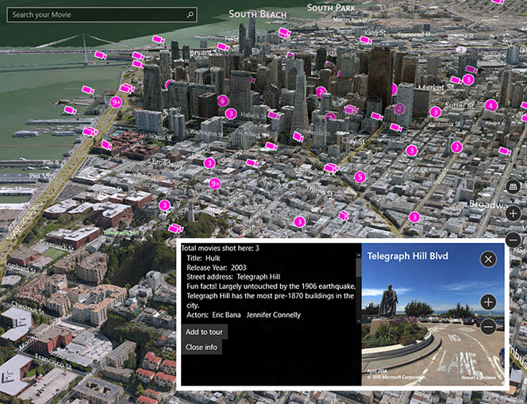

---
지도 컨트롤은 도로 지도와 위성뷰, 길 찾기, 검색 결과, 교통 정보를 표시할 수 있습니다.
지도에 대한 지침
ms.assetid: 7B5B6BC9-D1EC-4978-8876-20B78EF44797
---

# 지도에 대한 지침

\[ Windows 10의 UWP 앱에 맞게 업데이트되었습니다. Windows 8.x 문서는 [보관](http://go.microsoft.com/fwlink/p/?linkid=619132)을 참조하세요. \]

지도 컨트롤은 도로 지도, 위성뷰, 3D, 뷰, 길 찾기, 검색 결과, 교통 정보 등을 표시할 수 있습니다. 지도에서 사용자의 위치, 방향, 관심 지점을 표시할 수 있습니다. 또한 3D 위성뷰, Streetside 뷰, 교통 정보, 대중교통 및 지역 기업을 지도에 표시할 수도 있습니다.

## 올바른 컨트롤인가요?

사용자가 앱 관련 정보 또는 일반 지리 정보를 볼 수 있는 지도를 앱에 포함하려는 경우 지도 컨트롤을 사용합니다. 앱에 지도 컨트롤을 두면 사용자가 해당 정보를 얻기 위해 앱을 벗어나지 않아도 됩니다.

**참고** 사용자가 앱을 벗어나도 상관없는 경우 Windows 지도 앱을 사용하여 해당 정보를 제공하는 것이 좋습니다. 앱에서 Windows 지도 앱을 실행하여 특정 지도, 길 찾기 및 검색 결과를 표시할 수 있습니다. 자세한 내용은 [Windows 지도 앱 실행](https://msdn.microsoft.com/library/windows/apps/mt228341)을 참조하세요.

## 예제

이 예제에서는 Streetside 뷰가 있는 지도를 보여 줍니다.

 

이 예제에서는 3D 위성뷰가 있는 지도를 보여 줍니다.

 

이 예제에서는 3D 위성뷰와 Streetside 뷰가 둘 다 있는 앱을 보여 줍니다.

## 권장 사항

-   사용자가 지리적 정보를 보기 위해 지나치게 이동하거나 확대/축소하지 않도록 충분한 화면 공간이나 전체 화면 공간을 사용하여 지도를 표시합니다.

-   지도를 사용하여 정적 정보 보기만 제공하는 경우에는 더 작은 지도를 사용하는 것이 더 나을 수 있습니다. 더 작은 정적 지도를 사용하려면 사용성에 따라 크기를 결정합니다. 화면 공간을 절약할 수 있을 정도로 작지만 충분히 읽을 수 있는 크기를 지정합니다.

-   [
            **map elements**](https://msdn.microsoft.com/library/windows/apps/dn637034)를 사용하여 지도 장면에 관심 지점을 포함합니다. 지도 장면에 오버레이되는 임시 UI로 모든 추가 정보를 표시할 수 있습니다.

## 관련 항목

* [2D, 3D 및 Streetside 뷰가 있는 지도 표시](https://msdn.microsoft.com/library/windows/apps/mt219695)
* [지도에 POI(관심 지점) 표시](https://msdn.microsoft.com/library/windows/apps/mt219696)
* [Bing 지도 개발자 센터](https://www.bingmapsportal.com/)
* [UWP 지도 샘플](http://go.microsoft.com/fwlink/p/?LinkId=619977)
* [//빌드 2015 동영상: Windows 앱에서 휴대폰, 태블릿 및 PC 간에 지도 및 위치 활용](https://channel9.msdn.com/Events/Build/2015/2-757)
* [Windows 지도 앱 실행](https://msdn.microsoft.com/library/windows/apps/mt228341)
 

 

<!--HONumber=Mar16_HO1-->

