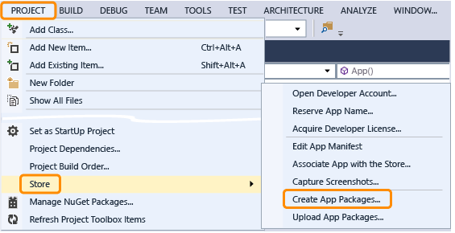

# 앱 광고의 알려진 문제점 및 문제 해결

이 항목은 Microsoft Advertising SDK 최신 릴리스의 알려진 문제를 목록으로 제공합니다. 추가 문제 해결 지침은 다음 항목을 참조하세요.

* [HTML 및 JavaScript 문제 해결 가이드](html-and-javascript-troubleshooting-guide.md)
* [XAML과 C# 문제 해결 가이드](xaml-and-c-troubleshooting-guide.md)

## XAML의 알 수 없는 AdControl 인터페이스

[AdControl](https://docs.microsoft.com/uwp/api/microsoft.advertising.winrt.ui.adcontrol)의 XAML 태그는 해당 인터페이스가 알 수 없음을 암시하는 파란색 곡선을 잘못 표시할 수 있습니다. 이 문제는 X86을 대상으로 하는 경우에만 발생하며 무시해도 됩니다.

## 이전 광고 요청의 lastError

이전 광고 요청에서 남은 **lastError**가 있으면 다음 광고 호출 동안 이 이벤트가 두 번 발생할 수 있습니다. 새 광고 요청은 여전히 진행되고 유효한 광고를 생성할 수 있지만 이 동작 때문에 혼동을 일으킬 수 있습니다.

## 휴대폰의 중간 광고 및 탐색 단추

하드웨어 단추 대신 소프트웨어 **뒤로**, **시작**, 및 **검색** 단추가 있는 휴대폰(또는 에뮬레이터)에서 중간 광고에 대한 카운트다운 타이와 클릭 단추가 가려질 수 있습니다.

## 최근에 생성된 광고가 앱에 제공되지 않음

최근(하루 이내)에 광고를 만든 경우 즉시 사용하지 못할 수도 있습니다. 광고의 편집 콘텐츠가 승인되면 광고 서버에서 해당 광고를 처리하고 광고가 제공됩니다. 그러면 광고를 인벤토리로 사용할 수 있게 됩니다.

## 앱에 광고가 표시되지 않음

광고를 볼 수 없는 이유는 네트워크 오류를 포함하여 다양합니다. 다양한 이유는 다음과 같습니다.

* 앱 코드의 **AdControl** 의 크기 보다 크거나 작은 크기를 사용 하 여 파트너 센터에서 광고 단위를 선택 합니다.

* 라이브 앱을 실행할 때 광고 단위 ID에 대해 [테스트 모드 값](set-up-ad-units-in-your-app.md#test-ad-units)을 사용하는 경우 광고가 표시되지 않습니다.

* 30분 이내에 새 광고 단위 ID를 만든 경우 서버가 시스템을 통해 새 데이터를 전파할 때까지 광고가 표시되지 않을 수 있습니다. 이전에 광고를 표시했던 기존 ID는 광고를 즉시 표시합니다.

앱에서 테스트 광고를 볼 수 있으면 코드가 작동하는 것이며 광고를 표시할 수 있습니다. 문제가 발생하면 [제품 지원](https://developer.microsoft.com/en-us/windows/support)에 문의하세요. 해당 페이지에서 **인앱 광고**를 선택합니다.

[포럼](http://go.microsoft.com/fwlink/p/?LinkId=401266)에서 질문을 게시할 수도 있습니다.

## 라이브 광고가 아닌 테스트 광고가 앱에 표시됨

라이브 광고가 나와야 하는데 테스트 광고가 표시될 수 있습니다. 이러한 상황은 다음과 같은 시나리오에서 발생할 수 있습니다.

* Microsoft의 광고 플랫폼은 스토어에서 사용되는 라이브 응용 프로그램 ID를 확인하거나 찾을 수 없습니다. 이 경우 사용자가 광고 단위를 만들면 해당 상태가 라이브(비테스트)로 시작될 수 있지만 처음 광고 요청이 있고 6시간 이내에 테스트 상태로 전환됩니다. 테스트 앱에서 10일 동안 요청이 없는 경우 라이브로 다시 변경됩니다.

* 테스트용으로 로드된 앱 또는 에뮬레이터에서 실행되는 앱에는 라이브 광고가 표시되지 않습니다.

라이브 광고 단위가 테스트 광고를 제공 하는 경우 광고 단위의 상태가 파트너 센터에서 **활성 및 테스트 광고 제공을** 표시 됩니다. 이러한 특성은 현재 휴대폰 앱에는 적용되지 않습니다.

## 프로젝트에서 모든 CPU를 대상으로 할 경우 발생하는 참조 오류

Microsoft Advertising SDK를 사용할 때는 프로젝트의 **어떤 CPU**도 대상으로 지정할 수 없습니다. 프로젝트의 대상이 **모든 CPU** 플랫폼인 경우 다음과 유사한 참조를 추가한 후 경고가 나타날 수 있습니다.

이 경고를 제거하려면 아키텍처별 빌드 출력(예: **x86**)을 사용하도록 프로젝트를 업데이트합니다. **구성 관리자**를 사용하여 디버그 및 릴리스 구성에 대한 플랫폼 대상을 설정합니다.

스토어 제출용으로 앱 패키지를 만드는 경우(다음 이미지 참조) 대상으로 지정하려는 아키텍처를 포함해야 합니다. x64 OS에서 x86 빌드를 실행하려면 x64를 건너뛰도록 선택할 수 있습니다.

## JavaScript/HTML 앱의 Z-순서

JavaScript/HTML 앱은 예약된 z-순서의 MAX-10 범위에 요소를 배치하지 않아야 합니다. 유일한 예외는 인터럽트 오버레이(예: Skype 앱에 대한 인바운드 호출 알림)입니다.

## 테두리를 사용하지 않음

**AdControl**에 의해 부모 클래스에서 상속된 테두리 관련 속성을 설정하면 광고 배치가 잘못될 수 있습니다.

## 추가 정보

Microsoft Advertising SDK와 관련된 최근의 알려진 문제를 알아보고 질문을 게시하려면 [포럼](http://go.microsoft.com/fwlink/p/?LinkId=401266)을 방문하세요.

 

 
