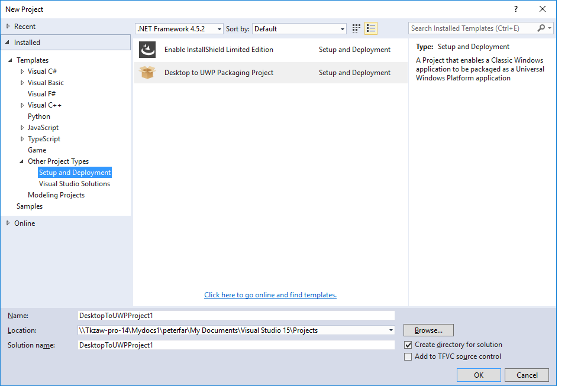
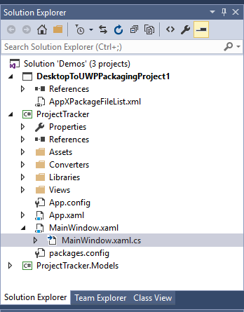

# <a name="desktop-to-uwp-bridge-debug"></a>데스크톱-UWP 브리지: 디버그

이 항목에는 데스크톱-UWP 브리지를 사용하여 앱을 변환한 후 앱을 디버깅하는 데 도움이 되는 정보가 포함되어 있습니다. 변환된 앱 디버깅에 대한 몇 가지 옵션이 있습니다.

## <a name="attach-to-process"></a>프로세스에 연결

Microsoft Visual Studio가 "관리자 권한"으로 실행되는 경우 *디버깅 시작* 및 *디버깅하지 않고 시작* 명령은 변환된 앱의 프로젝트에 작동하지만 시작된 앱은 [중간 무결성 수준](https://msdn.microsoft.com/library/bb625963)으로 실행됩니다. 즉 관리자 권한은 포함되지 않습니다. 시작된 앱에 대해 관리자 권한을 부여하려면 먼저 바로 가기 또는 타일을 통해 "관리자 권한으로" 시작해야 합니다. 앱이 일단 실행되면 "관리자 권한으로" 실행되는 Microsoft Visual Studio 인스턴스에서 __프로세스에 연결__을 호출하고 대화 상자에서 앱 프로세스를 선택합니다.

## <a name="f5-debug"></a>F5 키를 사용한 디버그

이제 visual Studio에서는 새 패키징 프로젝트를 지원합니다. 새 프로젝트를 사용하면 응용 프로그램의 설치 관리자에서 변환기를 통해 만든 Windows 앱 패키지로 응용 프로그램을 빌드할 때 자동으로 복사하고 업데이트할 수 있습니다. 패키징 프로젝트를 구성하면 이제 F5 키를 사용하여 Windows 앱 패키지를 직접 디버그할 수 있습니다.

>참고: 디버그 -> 기타 디버그 대상 -> 설치된 앱 패키지 디버그 옵션을 사용하여 기존 Windows 앱 패키지를 디버그하는 옵션을 사용할 수도 있습니다.

시작하는 방법은 다음과 같습니다.

1. 먼저 Desktop App Converter를 사용하도록 설정해야 합니다. 자세한 내용은 [Desktop App Converter 미리 보기](desktop-to-uwp-run-desktop-app-converter.md)를 참조하세요.

2. Win32 응용 프로그램에 대한 변환기를 실행한 후 설치 관리자를 실행합니다. 변환기는 레이아웃과 레지스트리 변경 내용을 캡처하고, 매니페스트 및 registery.dat가 포함된 Windows 앱 패키지를 출력하여 레지스트리를 가상화합니다.


3. [Visual Studio 2017 RC](https://www.visualstudio.com/downloads/#visual-studio-community-2017-rc)를 설치하고 시작합니다.

4. [Visual Studio 갤러리](http://go.microsoft.com/fwlink/?LinkId=797871)에서 UWP 패키징 VSIX 프로젝트에 데스크톱을 설치합니다.

5. 변환된 해당 Win32 솔루션을 Visual Studio에서 엽니다.

6. 솔루션을 마우스 오른쪽 단추로 클릭하고 "새 프로젝트 추가"를 선택하여 솔루션에 새 패키지 프로젝트를 추가합니다. 그런 다음 설치 및 배포에서 데스크톱에서 UWP 패키징 프로젝트를 선택합니다.

    

    결과 프로젝트가 솔루션에 추가됩니다.

    

    패키징 프로젝트에서 AppXFileList는 Windows 앱 패키지 레이아웃으로의 파일 매핑을 제공합니다. 참조는 처음에는 비어 있지만 빌드 순서 지정을 위해 수동으로 .exe 프로젝트로 설정해야 합니다.

7. DesktopToUWPPackaging 프로젝트에는 Windows 앱 패키지 루트와 실행할 타일을 구성할 수 있는 속성 페이지가 있습니다.

    

    PackageLayout을 변환기에 의해 만들어진 Windows 앱 패키지의 루트 위치로 설정합니다(위 참조). 그런 다음 실행할 타일을 선택합니다.

8.    AppXFileList.xml을 열고 편집합니다. 이 파일은 Win32 디버그 빌드의 출력을 변환기에서 작성한 Windows 앱 패키지 레이아웃으로 복사하는 방법을 정의합니다. 기본적으로 파일에는 예제 태그 및 설명이 있는 자리 표시자가 있습니다.

    ```XML
    <?xml version="1.0" encoding="utf-8"?>
    <Project ToolsVersion="4.0" xmlns="http://schemas.microsoft.com/developer/msbuild/2003">
      <ItemGroup>
    <!— Use the following syntax to copy debug output to the AppX layout
       <AppxPackagedFile Include="$(outdir)\App.exe">
          <PackagePath>App.exe</PackagePath>
        </AppxPackagedFile>
        See http://etc...
    -->
      </ItemGroup>
    </Project>
    ```

    다음은 매핑을 만드는 방법의 예입니다. 이 경우 Win32 빌드 위치에 있는 .exe 및 .dll을 패키지 레이아웃 위치로 복사합니다.

    ```XML
    <?xml version="1.0" encoding=utf-8"?>
    <Project ToolsVersion=14.0" xmlns="http://scehmas.microsoft.com/developer/msbuild/2003">
        <PropertyGroup>
            <MyProjectOutputPath>{relativepath}</MyProjectOutputPath>
        </PropertyGroup>
        <ItemGroup>
            <LayoutFile Include="$(MyProjectOutputPath)\ProjectTracker.exe">
                <PackagePath>$(PackageLayout)\VFS\Program Files (x86)\Contoso Software\Project Tracker\ProjectTracker.exe</PackagePath>
            </LayoutFile>
            <LayoutFile Include="$(MyProjectOutputPath)\ProjectTracker.Models.dll">
                <PackagePath>$(PackageLayout)\VFS\Program Files (x86)\Contoso Software\Project Tracker\ProjectTracker.Models.dll</PackagePath>
            </LayoutFile>
        </ItemGroup>
    </Project>
    ```

    파일은 다음과 같이 정의됩니다.

    먼저 Win32 프로젝트가 빌드되는 위치를 가리키도록 *MyProjectOutputPath*를 정의합니다.

    ```XML
    <?xml version="1.0" encoding="utf-8"?>
    <Project ToolsVersion="14.0" xmlns="http://schemas.microsoft.com/developer/msbuild/2003">
        <PropertyGroup>
            <MyProjectOutputPath>..\ProjectTracker\bin\DesktopUWP</MyProjectOutputPath>
        </PropertyGroup>
    ```

    그런 다음 각 *LayoutFile*은 Win32 빌드 위치에서 Windows 앱 패키지 레이아웃으로 복사할 파일을 지정합니다. 이 경우 먼저 .exe가 복사된 후 .dll이 복사됩니다.

    ```XML
        <ItemGroup>
            <LayoutFile Include="$(MyProjectOutputPath)\ProjectTracker.exe">
                <PackagePath>$(PackageLayout)\VFS\Program Files (x86)\Contoso Software\Project Tracker\ProjectTracker.exe</PackagePath>
            </LayoutFile>
            <LayoutFile Include="$(MyProjectOutputPath)\ProjectTracker.Models.dll">
                <PackagePath>$(PackageLayout)\VFS\Program Files (x86)\Contoso Software\Project Tracker\ProjectTracker.Models.dll</PackagePath>
            </LayoutFile>
        </ItemGroup>
    </Project>
    ```

9. 패키징 프로젝트를 시작 프로젝트로 설정합니다. 이렇게 하면 Win32 파일이 Windows 앱 패키지로 복사된 후 프로젝트가 빌드 및 실행되면 디버거가 시작됩니다.  

    

10.    마지막으로 이제 Win32 코드에 중단점을 설정하고 F5 키를 눌러 디버거를 실행할 수 있습니다. 이렇게 하면 Win32 응용 프로그램에서 업데이트한 내용이 Windows 앱 패키지로 복사되고 Visual Studio 내에서 직접 디버깅할 수 있게 됩니다.

11.    응용 프로그램을 업데이트하는 경우 MakeAppX를 사용하여 앱을 다시 패키징해야 합니다. 자세한 내용은 [앱 패키지 작성 도구(MakeAppx.exe)](https://msdn.microsoft.com/library/windows/desktop/hh446767(v=vs.85).aspx)를 참조하세요.

빌드 구성이 여러 개 있는 경우(예를 들어 릴리스용 및 디버깅용) AppXFileList.xml 파일에 다음을 추가하여 다른 위치에서 Win32 빌드를 복사할 수 있습니다.

```XML
<PropertyGroup>
    <MyProjectOutputPath Condition="$(Configuration) == 'DesktopUWP'">C:\Users\peterfar\Desktop\ProjectTracker\ProjectTracker\bin\DesktopUWP>
    </MyProjectOutputPath>
    <MyProjectOutputPath Condition="$(Configuration) == 'ReleaseDesktopUWP'"> C:\Users\peterfar\Desktop\ProjectTracker\ProjectTracker\bin\ReleaseDesktopUWP</MyProjectOutputPath>
</PropertyGroup>
```

또한 응용 프로그램을 UWP로 업데이트하지만 여전히 Win32용으로 빌드하려는 경우 조건부 컴파일을 사용하여 특정 코드 경로를 사용하도록 설정할 수도 있습니다.

1.    아래 예제에서 코드는 DesktopUWP용으로만 컴파일되고 WinRT API를 사용하여 타일을 표시합니다.

    ```C#
    [Conditional("DesktopUWP")]
    private void showtile()
    {
        XmlDocument tileXml = TileUpdateManager.GetTemplateContent(TileTemplateType.TileSquare150x150Text01);
        XmlNodeList textNodes = tileXml.GetElementsByTagName("text");
        textNodes[0].InnerText = string.Format("Welcome to DesktopUWP!");
        TileNotification tileNotification = new TileNotification(tileXml);
        TileUpdateManager.CreateTileUpdaterForApplication().Update(tileNotification);
    }
    ```

2.    구성 관리자를 사용하여 새 빌드 구성을 추가할 수 있습니다.

    

    

3.    그런 다음 프로젝트 속성에서 조건부 컴파일 기호에 대한 지원을 추가합니다.

    

4.    이제 추가한 UWP API를 대상으로 빌드하려는 경우 빌드 대상을 DesktopUWP로 전환할 수 있습니다.

## <a name="plmdebug"></a>PLMDebug

Visual Studio F5 및 프로세스에 연결은 앱이 실행되는 동안 디버깅하는 데 유용합니다. 그러나 경우에 따라 앱이 시작되기 전에 디버그하는 기능을 포함하여 디버깅 프로세스에서 세부적으로 제어할 수 있습니다. 이러한 고급 시나리오에서 [**PLMDebug**](https://msdn.microsoft.com/library/windows/hardware/jj680085(v=vs.85).aspx)를 사용합니다. 이 도구를 통해 Windows 디버거를 사용하여 변환된 앱을 디버그하고 일시 중단, 다시 시작 및 종료를 비롯한 전체 앱 수명 주기를 제어할 수 있습니다.

PLMDebug는 Windows SDK에 포함되어 있습니다. 자세한 내용은 [**PLMDebug**](https://msdn.microsoft.com/library/windows/hardware/jj680085(v=vs.85).aspx)를 참조하세요.

## <a name="run-another-process-inside-the-full-trust-container"></a>완전 신뢰 컨테이너 내 다른 프로세스 실행

지정한 앱 패키지의 컨테이너 내에서 사용자 지정 프로세스를 호출할 수 있습니다. 이는 시나리오 테스트에 유용할 수 있습니다(예: 사용자 지정 테스트 도구가 있어 앱의 출력을 테스트할 경우). 이렇게 하려면 다음과 같이 ```Invoke-CommandInDesktopPackage``` PowerShell cmdlet을 사용합니다.

```CMD
Invoke-CommandInDesktopPackage [-PackageFamilyName] <string> [-AppId] <string> [-Command] <string> [[-Args]
    <string>]  [<CommonParameters>]
```
