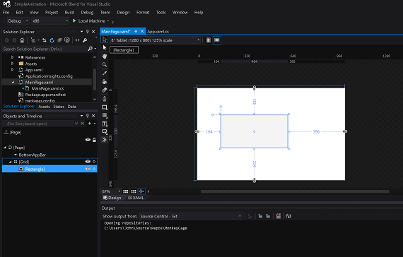
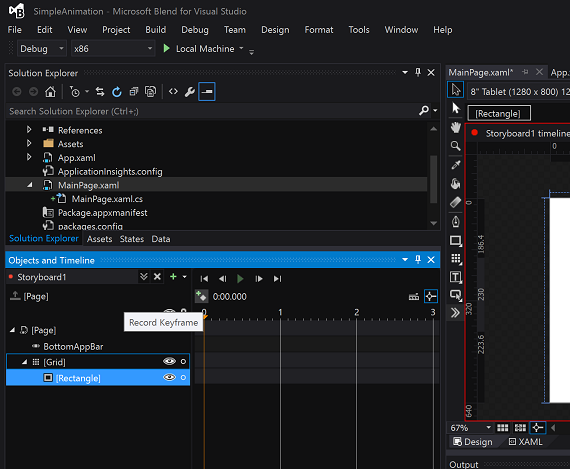
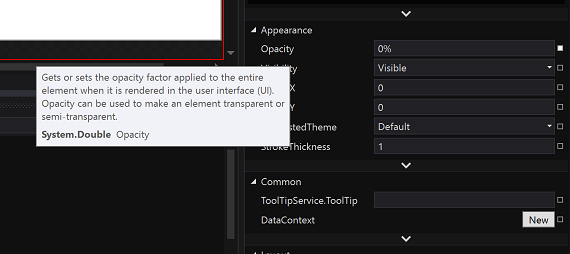

# <a name="getting-started-animation"></a>시작: 애니메이션


## <a name="adding-animations"></a>애니메이션 추가

iOS에서는 애니메이션 효과를 프로그래밍 방식으로 만드는 경우가 많습니다. 예를 들어 블록 기반 **UIView** 클래스의 **animateWithDuration** 메서드 또는 이전의 비블록 기반 메서드에서 제공한 애니메이션을 사용할 수 있습니다. 또는 **CALayer** 클래스를 명시적으로 사용하여 계층에 애니메이션 효과를 줄 수 있습니다. Windows 앱에서는 애니메이션을 프로그래밍 방식으로 만들 수 있지만 XAML(Extensible Application Markup Language)을 사용하여 선언적으로 정의할 수도 있습니다. Microsoft Visual Studio를 사용하여 XAML 코드를 직접 편집할 수 있지만 Visual Studio에서는 디자이너에서 애니메이션 작업을 할 때 XAML 코드를 자동으로 생성하는 **Blend**라는 도구를 제공합니다. 실제로 Blend를 사용하여 전체 Visual Studio 프로젝트를 그래픽적으로 열고, 디자인, 빌드 및 실행할 수 있습니다. 다음 연습을 통해 해보세요.

새 UWP(유니버설 Windows 플랫폼) 앱을 만들고 이름을 "SimpleAnimation" 등으로 지정합니다. 이 프로젝트에서는 사각형을 이동하여 사라지게 한 다음 다시 보기로 가져옵니다. XAML로 작성된 애니메이션은 *스토리보드* 개념을 기반으로 합니다(iOS 스토리보드와 혼동되지 않음). 스토리보드에서는 *키 프레임*을 사용하여 속성 변경에 애니메이션 효과를 적용합니다.

다음 그림과 같이 프로젝트를 열고 **솔루션 탐색기**에서 프로젝트 이름을 마우스 오른쪽 단추로 클릭한 후 **Blend에서 열기** 또는 **Blend에서 디자인**을 선택합니다. Visual Studio는 백그라운드에서 계속 실행됩니다.


Blend가 시작되면 다음과 같은 화면이 나타납니다.


왼쪽에 있는 **솔루션 탐색기**에서 **MainPage.xaml**을 두 번 클릭합니다. 그런 다음 중앙 **디자인 뷰**의 가장자리에 있는 도구의 세로 띠에서 다음 그림과 같이 **사각형** 도구를 클릭한 다음 **디자인 뷰**로 끌어 옵니다.



사각형을 녹색으로 만들려면 **속성** 창의 **브러시** 영역에서 **단색 브러시** 단추, **색 스포이트** 아이콘을 차례로 클릭한 다음 녹색 색상 밴드 내의 아무 곳이나 탭합니다.

사각형에 애니메이션 효과를 적용하려면 **개체 및 타임라인** 창에서 다음 그림과 같이 + 기호(**새로 만들기**) 단추를 탭한 다음 **확인**을 탭합니다.


스토리보드는 **개체 및 타임라인** 창에 표시됩니다(제대로 보려면 뷰 크기를 조정해야 할 수 있음). **디자인 뷰**가 변경되어 **Storyboard1 타임라인 기록이 켜져 있음**이라고 표시됩니다. 사각형의 현재 상태를 캡처하려면 다음 그림과 같이 **개체 및 타임라인** 창에서 노란색 화살표 바로 위에 있는 **키 프레임 기록** 단추를 탭합니다.



이제 사각형을 이동하여 사라지게 합니다. 이렇게 하려면 주황색/노란색 화살표를 2초 위치로 끌어 놓은 다음 녹색 사각형을 오른쪽으로 약간 끕니다. 이제 다음 그림과 같이 **속성** 창의 **모양** 영역에서 **불투명도** 속성을 **0**으로 변경합니다. 애니메이션을 미리 보려면 스토리보드 패널에서 **재생** 단추를 탭합니다.



이제 사각형을 보기로 다시 가져옵니다. **개체 및 타임라인** 창에서 **Storyboard1**을 두 번 클릭합니다. 이제 다음 그림과 같이 **속성** 창의 **일반** 영역에서 **AutoReverse**를 선택합니다.


마지막으로 **재생** 단추를 클릭하여 어떻게 되는지 확인합니다.

창 위쪽의 녹색 실행 단추를 클릭하거나 F5 키를 눌러 프로젝트를 빌드하고 실행할 수 있습니다. 이렇게 하면 프로젝트가 실제로 빌드 및 실행되지만 녹색 사각형은 완전히 정지됩니다. 애니메이션을 시작하려면 프로젝트에 코드 줄을 추가해야 합니다. 다음과 같이 하세요.

**파일** 메뉴를 열고 **MainPage.xaml 저장**을 선택하여 프로젝트를 저장합니다. Visual Studio로 돌아갑니다. Visual Studio에 수정된 파일을 다시 로드할지 여부를 묻는 대화 상자가 표시되면 **예**를 선택합니다. **MainPage.xaml** 아래에 숨겨진 **MainPage.xaml.cs** 파일을 두 번 클릭하여 열고 public MainPage() 메서드 바로 위에 다음 코드를 추가합니다.

```csharp
protected override void OnNavigatedTo(NavigationEventArgs e)
{
    // Add the following line of code.
    Storyboard1.Begin();
}
```

프로젝트를 다시 실행하고 사각형에 애니메이션 효과가 적용되는지 확인합니다. 잘하셨습니다.

MainPage.xaml 파일을 열면 **XAML** 보기에 디자이너에서 작업할 때 Blend에서 추가된 XAML 코드가 표시됩니다. 특히, `<Storyboard>` 및 `<Rectangle>` 요소의 코드를 살펴보세요. 다음 코드에서는 예를 보여 줍니다. 타원은 간결하게 나타내기 위해 생략한 관련 없는 코드를 나타내며, 코드를 읽기 쉽도록 줄 바꿈을 추가했습니다.

```xml
...
<Storyboard 
        x:Name="Storyboard1" 
        AutoReverse="True">
    <DoubleAnimationUsingKeyFrames 
            Storyboard.TargetProperty="(UIElement.RenderTransform).(CompositeTransform.TranslateX)"
            Storyboard.TargetName="rectangle">
        <EasingDoubleKeyFrame 
                KeyTime="0" 
                Value="0"/>
        <EasingDoubleKeyFrame 
                KeyTime="0:0:2" 
                Value="185.075"/>
    </DoubleAnimationUsingKeyFrames>
    <DoubleAnimationUsingKeyFrames 
            Storyboard.TargetProperty="(UIElement.RenderTransform).(CompositeTransform.TranslateY)" 
            Storyboard.TargetName="rectangle">
        <EasingDoubleKeyFrame 
                KeyTime="0" 
                Value="0"/>
        <EasingDoubleKeyFrame 
                KeyTime="0:0:2" 
                Value="2.985"/>
    </DoubleAnimationUsingKeyFrames>
    <DoubleAnimationUsingKeyFrames 
            Storyboard.TargetProperty="(UIElement.Opacity)" 
            Storyboard.TargetName="rectangle">
        <EasingDoubleKeyFrame 
                KeyTime="0" 
                Value="1"/>
        <EasingDoubleKeyFrame 
                KeyTime="0:0:2"
                Value="0"/>
    </DoubleAnimationUsingKeyFrames>
</Storyboard>
...
<Rectangle 
        x:Name="rectangle" 
        Fill="#FF00FF63" 
        HorizontalAlignment="Left" 
        Height="122" 
        Margin="151,312,0,0" 
        Stroke="Black" 
        VerticalAlignment="Top" 
        Width="239" 
        RenderTransformOrigin="0.5,0.5">
    <Rectangle.RenderTransform>
        <CompositeTransform/>
    </Rectangle.RenderTransform>
</Rectangle>
...
```

이 XAML을 수동으로 편집하거나 Blend로 돌아가 작업을 계속할 수 있습니다. Blend를 사용하면 흥미로운 사용자 인터페이스를 재미있게 만들 수 있으며, 그래픽 도구를 사용하여 이를 애니메이션하는 기능으로 개발 시간을 크게 단축할 수 있습니다. 애니메이션에 대한 자세한 내용은 [애니메이션 개요](https://msdn.microsoft.com/library/windows/apps/mt187350)를 참조하세요.

**참고** <span class="legacy-term">JavaScript 및 HTML을 사용 하 여 UWP 앱</span>용 애니메이션에 대 한 자세한 내용은 [UI 애니메이션 (HTML)](https://msdn.microsoft.com/library/windows/apps/hh465165)참조 하세요.

### <a name="next-step"></a>다음 단계

[시작: 다음에 할 일](getting-started-what-next.md)
