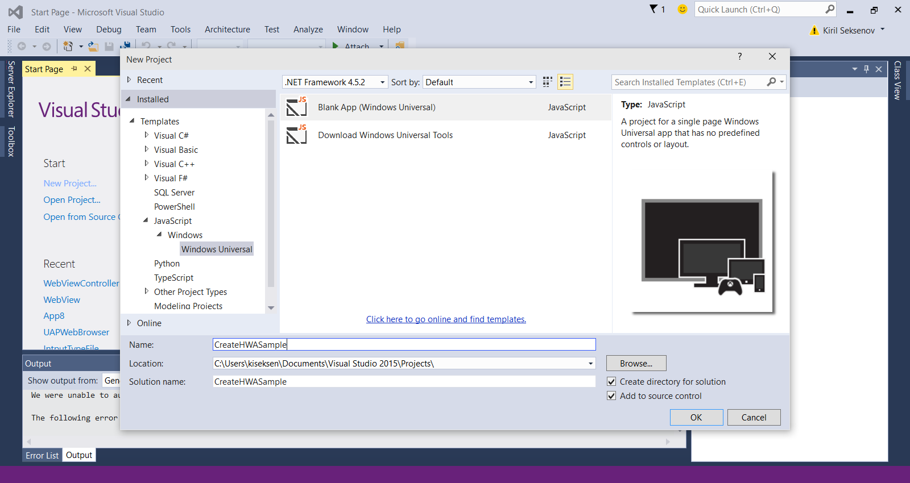

# UWP(유니버설 Windows 플랫폼) 앱으로 웹 응용 프로그램 변환

웹 사이트 URL만으로 시작되는 Windows 10용 유니버설 Windows 플랫폼 앱을 빠르게 만드는 방법을 알아봅니다. 

> [!NOTE]
> 다음 지침은 Windows 개발 플랫폼에서 사용하기 위한 것입니다. Mac 사용자는 [Mac 개발 플랫폼을 사용하는 경우의 지침](/hwa-create-mac.md)을 참조하세요.

## Windows에서 개발하는 데 필요한 사항

- [Visual Studio 2015.](https://www.visualstudio.com/) 모든 기능을 갖춘 무료 Visual Studio Community 2015에는 Windows 10 개발자 도구, 유니버설 앱 템플릿, 코드 편집기, 강력한 디버거, Windows 모바일 에뮬레이터, 풍부한 언어 지원 등이 프로덕션에 바로 사용할 수 있도록 준비되어 있습니다.
- (옵션) [Windows 10용 Windows Standalone SDK.](https://dev.windows.com/downloads/windows-10-sdk) Visual Studio 2015 이외의 개발 환경을 사용하는 경우 Windows 10용 독립 실행형 Windows SDK 설치 관리자를 다운로드할 수 있습니다. Visual Studio 2015를 사용하고 있는 경우 이미 SDK가 포함되어 있으므로 이 SDK를 설치할 필요가 없습니다.

## 1단계: 웹 사이트 URL 선택
단일 페이지 앱으로 제대로 작동할 기존 웹 사이트를 선택합니다. 해당 사이트의 소유자 또는 개발자라면 더욱 좋습니다. 그러면 필요한 모든 내용을 변경할 수 있습니다. 염두에 둔 URL이 없는 경우 웹 사이트로 이 [Codepen 예](http://codepen.io/seksenov/pen/wBbVyb/?editors=101)를 사용해 보세요. 선택한 URL 또는 Codepen URL을 복사하여 이 자습서 전체에서 사용합니다. 


## 2단계: 빈 JavaScript 앱 만들기

Visual Studio를 시작합니다.
1. **파일**을 클릭합니다.
2. **새 프로젝트**를 클릭합니다.
3. **JavaScript**의 **Windows 유니버설**에서 **비어 있는 앱(Windows 유니버설)**을 클릭합니다.



## 3단계: 패키지된 코드 삭제

콘텐츠가 원격 서버에서 제공되는 호스트된 웹앱이므로 기본적으로 JavaScript 템플릿과 함께 제공되는 대부분의 로컬 앱 파일이 필요하지 않습니다. 로컬 HTML, JavaScript 또는 CSS 리소스를 삭제합니다. `package.appxmanifest` 파일만 남아 있어야 합니다. 이 파일에서 앱 및 이미지 리소스 구성할 수 있습니다.


## 4단계: 시작 페이지 URL 설정

1. `package.appxmanifest` 파일을 엽니다.
2. **응용 프로그램** 탭에서 **시작 페이지** 텍스트 필드를 찾습니다.
3. `default.html`을 사용할 웹 사이트 URL로 바꿉니다.


## 5단계: 웹앱의 경계 정의

ACUR(응용 프로그램 콘텐츠 URI 규칙)에서 앱과 유니버설 Windows API에 액세스할 수 있는 원격 URL을 지정합니다. 최소한, 시작 페이지와 해당 페이지에서 사용하는 웹 리소스에 대한 ACUR을 추가해야 합니다. ACUR에 대한 자세한 내용을 보려면 [여기를 클릭하세요](./hwa-access-features.md#keep-your-app-secure-setting-application-content-uri-rules-acurs).
1. `package.appxmanifest` 파일을 엽니다.
2. **콘텐츠 URI** 탭을 클릭합니다.
3. 시작 페이지에 필요한 모든 URI를 추가합니다.

예:
```
1. http://codepen.io/seksenov/pen/wBbVyb/?editors=101
2. http://*.codepen.io/
```
4. 추가한 각각의 URI에 대해 **WinRT 액세스**를 **모두**로 설정합니다.


## 6단계: 앱 실행

이제 유니버설 Windows API에 액세스할 수 있는 완벽하게 작동하는 Windows 10 앱이 준비되었습니다!

Codepen 예를 사용하여 단계를 진행한 경우 **Toast Notification**(알림 메시지) 단추를 클릭하여 호스트된 스크립트에서 Windows API를 호출합니다.


## 보너스: 카메라 캡처 추가

카메라 캡처를 사용하려면 아래 JavaScript 코드를 복사하여 붙여넣습니다. 고유한 웹 사이트를 사용하여 단계를 진행한 경우 `cameraCapture()` 메서드를 호출할 단추를 만듭니다. Codepen 예를 사용하여 단계를 진행한 경우 단추가 HTML에 이미 표시되어 있습니다. 단추를 클릭하여 사진을 찍습니다.

```JavaScript
function cameraCapture() {
  if(typeof Windows != 'undefined') {
   var captureUI = new Windows.Media.Capture.CameraCaptureUI();
   //Set the format of the picture that's going to be captured (.png, .jpg, ...)
   captureUI.photoSettings.format = Windows.Media.Capture.CameraCaptureUIPhotoFormat.png;
   //Pop up the camera UI to take a picture
   captureUI.captureFileAsync(Windows.Media.Capture.CameraCaptureUIMode.photo).then(function (capturedItem) {
      // Do something with the picture
   });
  }
}
```

## 관련 항목

- [UWP(유니버설 Windows 플랫폼) 기능에 액세스하여 웹앱 향상](hwa-access-features.md)
- [UWP(유니버설 Windows 플랫폼) 앱 지침](http://go.microsoft.com/fwlink/p/?LinkID=397871)
- [Windows 스토어 앱용 디자인 자산 다운로드](https://msdn.microsoft.com/library/windows/apps/xaml/bg125377.aspx)


<!--HONumber=Aug16_HO3-->


