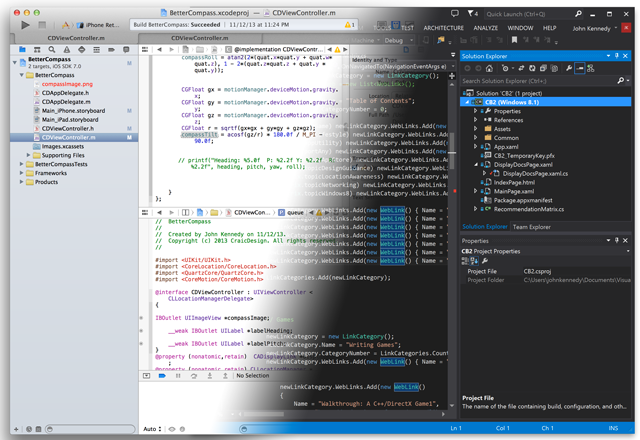

---
iOS에서 UWP로 이동
Search.SourceType: Video
iOS에서 UWP로 이동
ms.assetid: 7a05751d-02df-4240-9ba5-d95f65a7a9c5
---

# iOS에서 UWP로 이동

\[ Windows 10의 UWP 앱에 맞게 업데이트되었습니다. Windows 8.x 문서는 [보관](http://go.microsoft.com/fwlink/p/?linkid=619132)을 참조하세요. \]

**iOS용 Windows 브리지와 함께 Objective-C 코드 다시 사용**

-   이 가이드는 iOS 앱을 Windows 10으로 수동으로 포팅하는 데 도움이 되도록 설계되었습니다. 앱을 전부 Objective-C로 작성한 경우 iOS용 Windows 브리지를 사용하면 기존 코드의 대부분을 다시 사용하면서 앱을 Windows 10으로 빠르게 옮길 수 있습니다. iOS 브리지를 사용하면 Objective-C 코드 및 iOS API 라이브러리를 사용하여 Visual Studio 2015에서 UWP(유니버설 Windows 플랫폼) 앱을 빌드할 수 있습니다. 또한 브리지를 사용하여 Cortana 및 라이브 타일과 같은 고유한 Windows 10 기능으로 Objective-C 코드를 확장할 수 있습니다.
-   [iOS용 Windows 브리지에 대한 자세한 정보](https://dev.windows.com/bridges/ios)

## 왜 Windows여야 할까요?

iOS 개발자로, Windows 10 및 UWP를 이동하는 방법이 궁금한가요? 생각만큼 겁내지 않아도 됩니다. iOS 장치에서와 마찬가지로 Windows에서도 원활하게 작동하는 멋진 앱을 만드는 데 필요한 도구, 기술 및 정보를 갖추었습니다. 이제 더 멋진 앱을 만들 수 있습니다.<iframe src="https://hubs-video.ssl.catalog.video.msn.com/embed/019d3337-80cf-4817-b50a-58f9463a4d27/IA?csid=ux-en-us&MsnPlayerLeadsWith=html&PlaybackMode=Inline&MsnPlayerDisplayShareBar=false&MsnPlayerDisplayInfoButton=false&iframe=true&QualityOverride=HD" width="720" height="405" allowFullScreen="true" frameBorder="0" scrolling="no">Android 또는 iOS 앱을 Windows 및 Windows Phone에 포팅</iframe>

앱을 포팅하거나 Windows 10용 앱을 새로 개발하려는 경우 이제 걱정할 필요가 없습니다. 이 섹션에서는 Visual Studio 사용의 기본 사항과 iOS 개발자에게 유용한 샘플 코드를 제공합니다. 즐겁게 Windows 10용 앱을 작성해 보세요.

코드를 한 번만 작성하면 데스크톱, 랩톱, 휴대폰, 게임, 콘솔, 포함된 장치, 홀로그래픽 디스플레이 등에서 실행되는 모습을 상상해 보세요. Windows 10 및 UWP의 세계로 오세요!

Windows를 이미 알고 있는 경우 iOS로 범위를 확대하려면 Microsoft Visual Studio 2015를 살펴보세요. Xamarin 기반의 모바일 응용 프로그램 개발에 대한 완벽한 지원을 통해 이제 Visual Studio 내에서 iOS 장치용 앱을 만들고 페어링된 Mac 컴퓨터를 사용하여 코드를 컴파일 및 실행할 수 있습니다. Visual Studio는 Windows, Android 및 iOS 간에 코드 및 개발 도구를 공유함으로써 모바일 개발 환경의 핵심이 될 수 있습니다.
 

| 항목 | 설명 |
|-------|-------------|
| [iOS 및 UWP 앱 개발 방법 선택](selecting-an-approach-to-ios-and-uwp-app-development.md) | 플랫폼 간 앱을 개발할 때 어떤 방법을 선택할 수 있나요? |
| [iOS 개발자용 UWP 시작](getting-started-with-uwp-for-ios-developers.md) | Windows 10용 개발을 고려하는 iOS 개발자인 경우 이러한 문서는 시작하는 데 도움이 됩니다. |
| [Windows 10에서 Mac 설정](setting-up-your-mac-with-windows-10.md) | 현재 Mac 컴퓨터를 사용하여 Windows용 앱을 개발합니다. |

## 관련 항목

**디자이너 및 개발자용**
* [모든 Windows 장치용 유니버설 Windows 앱 빌드](http://go.microsoft.com/fwlink/p/?LinkID=397871)
* [Windows 스토어 앱용 디자인 자산 다운로드](https://msdn.microsoft.com/library/windows/apps/xaml/bg125377.aspx)
 

<!--HONumber=Mar16_HO1-->

