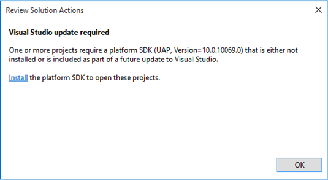

# RTM으로 UWP Microsoft Visual Studio 2015 RC 프로젝트 업데이트

\[ Windows 10의 UWP 앱에 맞게 업데이트되었습니다. Windows 8.x 문서는 [보관](http://go.microsoft.com/fwlink/p/?linkid=619132)을 참조하세요. \]

Microsoft Visual Studio 2015 RC를 사용하여 만든 Windows 10 프로젝트가 있는 경우 Visual Studio 2015 RTM에 적합한 형식으로 프로젝트 파일을 업데이트할 수 있는 두 가지 옵션이 있습니다. 권장되는 방법은 Visual Studio 2015 RTM에서 새 Windows 10 프로젝트를 만들고 해당 프로젝트에 파일을 복사하는 것입니다. 또는 고급 설명서에 따라 기존 프로젝트 파일을 편집하고 새 형식으로 이동할 수 있습니다.

## Visual Studio 2015 RTM에서 Windows 10Visual Studio 2015 RC 프로젝트를 열면 표시되는 항목

Visual Studio 2015 RTM에서 Windows 10Visual Studio 2015 RC 프로젝트를 열면 **솔루션 탐색기**에 "업데이트 필요" 메시지가 표시됩니다.

**솔루션 탐색기**에서 프로젝트의 상황에 맞는 메뉴에 액세스하여 **프로젝트 다시 로드**를 선택하면 이 대화 상자가 표시됩니다.

## 새 프로젝트를 만들어 파일 복사

1.  Visual Studio 2015 RTM을 시작하고 비어 있는 새 응용 프로그램(Windows 유니버설) 프로젝트를 만듭니다. 기본적으로 새 프로젝트는 유니버설 디바이스 패밀리를 대상으로 하는 앱 패키지(appx 파일)를 빌드합니다. 하나 이상의 특정 디바이스 패밀리를 대상으로 하려는 경우 이를 변경합니다.
2.  Visual Studio 2015 RC 프로젝트에서 복사할 모든 소스 코드 파일 및 시각적 자산 파일을 식별합니다. 파일 탐색기를 사용하여 필요한 데이터 모델, 보기 모델, 시각적 자산, 리소스 사전, 폴더 구조 등(AssemblyInfo.cs 포함)을 새 프로젝트에 복사합니다. 필요한 경우 디스크에서 하위 폴더를 복사하거나 만듭니다.
3.  또한 보기(예제: MainPage.xaml 및 MainPage.xaml.cs)를 새 프로젝트에 복사합니다. 필요한 경우 새 하위 폴더를 만들고 기존 보기를 프로젝트에서 제거합니다. 하지만 Visual Studio에서 생성된 보기를 덮어쓰거나 제거하기 전에 나중에 유용하게 참조할 수 있도록 복사본을 유지하세요.
4.  **솔루션 탐색기**에서 **모든 파일 표시**가 설정되어 있는지 확인합니다. 복사한 파일을 선택하여 마우스 오른쪽 단추로 클릭하고 **프로젝트에 포함**을 클릭합니다. 그러면 포함하는 폴더가 자동으로 포함됩니다. 원하는 경우 **모든 파일 표시**를 해제할 수 있습니다. 원하는 경우 대체 워크플로로 **기존 항목 추가** 명령을 사용하여 Visual Studio **솔루션 탐색기**에서 필요한 하위 폴더를 만듭니다. 시각적 자산에서 **빌드 작업**이 **콘텐츠**로 설정되어 있고 **출력 디렉터리로 복사**가 **복사 안 함**으로 설정되어 있는지 다시 확인합니다.
5.  RC 프로젝트에서 참조한 확장 SDK에 대한 참조를 추가하고 이전 Package.appxmanifest의 모든 변경 내용(예: 선언한 모든 접근 권한 값)을 새 RTM 프로젝트의 Package.appxmanifest에 복사합니다.

## 고급: 기존 프로젝트 파일 편집

Visual Studio 2015 RC와 Visual Studio 2015 RTM 간 Windows 10 프로젝트 형식의 중요한 한 가지 차이점은 RTM 형식에서는 [NuGet](http://docs.nuget.org/) 버전 3을 사용한다는 점입니다. 프로젝트를 수동으로 업데이트하려는 경우 이 점을 염두에 두어야 합니다.

프로젝트를 수동으로 업데이트하려는 경우 또는 Visual Studio 2015 RC와 Visual Studio 2015 RTM의 프로젝트 형식 간 차이점이 궁금한 경우 [UWP(유니버설 Windows 플랫폼)로 앱 마이그레이션](http://msdn.microsoft.com/library/mt148501.aspx)을 참조하세요.

