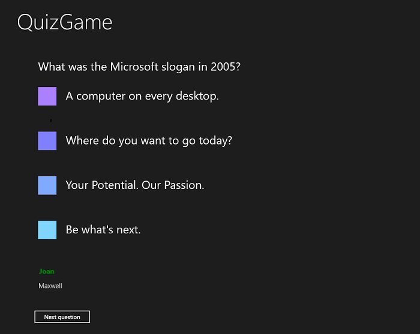

# <a name="windows-runtime-8x-to-uwp-case-study-quizgame-sample-app"></a>Windows 런타임 8.x UWP 사례 연구: QuizGame 샘플 앱


이 항목에서는 작동 피어-투-피어 퀴즈 게임 WinRT 8.1 샘플 앱을 Windows 10 유니버설 Windows 플랫폼 (UWP) 앱을 포팅 사례 연구를 제공 합니다.

유니버설 8.1 앱을 동일 앱의 두 버전을 작성 하는 하나는: Windows 8.1 대 한 하나의 앱 패키지 및 Windows Phone 8.1에 대 한 다양 한 앱 패키지 있습니다. QuizGame의 WinRT 8.1 버전에서는 유니버설 Windows 앱 프로젝트 정렬을 사용하지만 다른 접근 방식을 취하여 두 플랫폼에 대해 기능상 서로 다른 앱을 빌드합니다. Windows 8.1 앱 패키지는 클라이언트의 역할을 호스트에 Windows Phone 8.1 앱 패키지 상태 호스트로 퀴즈 게임 세션에 대 한 지원 합니다. 퀴즈 게임 세션의 두 절반은 피어 투 피어 네트워킹을 통해 통신합니다.

두 절반을 각각 PC와 휴대폰에 맞게 맞춤화하면 합리적입니다. 그러나 선택하는 거의 모든 디바이스에서 호스트와 클라이언트를 둘 다 실행할 수 있다면 훨씬 더 낫지 않을까요? 이 경우 연구, 여기서는 각 빌드됩니다 광범위 한 장치에 사용자가 설치할 수 있는 단일 앱 패키지에는 Windows 10 앱을 모두 포트 됩니다 것입니다.

앱에서는 보기 및 보기 모델을 활용하는 패턴을 사용합니다. 이렇게 명확하게 분리한 결과, 앞으로 살펴보게 되겠지만 이 앱의 포팅 프로세스는 매우 간단합니다.

**참고**  이 샘플에서는 네트워크를 사용자 지정 UDP를 주고받도록 구성 된 가정 멀티 캐스트 패킷 수 (대부분의 홈 네트워크 인 작업 네트워크 하지 않더라도)를 그룹화 합니다. 샘플에서는 TCP 패킷도 보내고 받습니다.

 

**참고**    때의 단계에 따라 다음 "Visual Studio 업데이트 필요", 메시지가 표시 되 면 QuizGame10 Visual Studio에서 열기 [TargetPlatformVersion](w8x-to-uwp-troubleshooting.md)합니다.

 

## <a name="downloads"></a>다운로드

[QuizGame 유니버설 8.1 앱을 다운로드합니다](https://go.microsoft.com/fwlink/?linkid=532953). 포팅하기 전 앱의 초기 상태입니다. 

[Windows 10 앱 다운로드를 QuizGame10](https://go.microsoft.com/fwlink/?linkid=532954)합니다. 포팅한 직후 앱의 상태입니다. 

[GitHub에서 이 샘플의 최신 버전을 참조하세요](https://github.com/microsoft/Windows-appsample-networkhelper).

## <a name="the-winrt-81-solution"></a>WinRT 8.1 솔루션


다음은 포팅할 앱인 QuizGame의 모습입니다.



Windows에서 실행되는 QuizGame 호스트 앱

 


Windows Phone에서 실행되는 QuizGame 클라이언트 앱

## <a name="a-walkthrough-of-quizgame-in-use"></a>사용 중인 QuizGame 연습

다음은 사용 중인 앱에 대해 간단한 가상 설명이지만, 무선 네트워크를 통해 앱을 사용해 보려는 경우 유용한 정보를 제공합니다.

바에서 재미 있는 퀴즈 게임이 열리고 있습니다. 바에는 모든 사람이 볼 수 있는 대형 TV가 있습니다. 퀴즈 진행자는 출력이 TV에 표시되는 PC를 가지고 있습니다. 해당 PC에는 실행 중인 "호스트 앱"이 있습니다. 퀴즈에 참여하려는 사람은 자신의 휴대폰이나 Surface에 "클라이언트 앱"만 설치하면 됩니다.

호스트 앱은 대기실 모드이고 대형 TV에서 클라이언트 앱을 연결할 준비가 되었다고 광고합니다. Joan은 자신의 모바일 디바이스에서 클라이언트 앱을 실행합니다. 자신의 이름을 **플레이어 이름** 텍스트 상자에 입력하고 **임 참가**를 누릅니다. 호스트 앱에서 Joan의 이름을 표시하여 Joan이 게임에 참가했음을 알리고 Joan의 클라이언트 앱에 게임이 시작되기를 기다리는 중이라고 표시됩니다. 다음으로, Maxwell도 모바일 디바이스에서 동일한 단계를 거칩니다.

퀴즈 진행자가 **게임 시작**을 클릭하면 호스트 앱에 질문과 가능한 응답이 표시됩니다(또한 참가한 플레이어 목록이 기본 글꼴 두께와 회색으로 표시됨). 동시에 참가한 클라이언트 디바이스의 단추에 응답이 표시됩니다. Joan이 응답이 "1975"인 단추를 탭한 결과 모든 단추가 비활성화됩니다. 호스트 앱에서 Joan의 응답을 받았다는 표시로 Joan의 이름이 녹색으로 칠해지고 굵게 표시됩니다. Maxwell도 응답합니다. 퀴즈 진행자는 모든 플레이어의 이름이 녹색임에 주목하고 **다음 질문**을 클릭합니다.

이러한 동일한 주기로 계속 질문을 하고 응답하게 됩니다. 마지막 질문이 호스트 앱에 표시되면 **다음 질문**이 아니라 **결과 표시**가 단추의 내용이 됩니다. **결과 표시**를 클릭하면 결과가 표시됩니다. **대기실로 돌아가기**를 클릭하면 참가한 플레이어가 참가한 상태로 유지되는 점을 제외하고는 게임 수명 주기의 시작으로 돌아갑니다. 그러나 대기실로 돌아가면 새 플레이어에게 게임에 참가할 수 있는 기회가 제공되며, 참가한 플레이어는 편리하게 게임에서 나갈 수 있습니다(그러나 참가한 플레이어는 언제든지 **게임 나가기**를 탭하여 게임에서 나갈 수 있음).

## <a name="local-test-mode"></a>로컬 테스트 모드

여러 디바이스에 걸쳐 분산된 것이 아니라 단일 PC에서 앱과 해당 조작을 사용해 보려면 로컬 테스트 모드에서 호스트 앱을 빌드하면 됩니다. 이 모드는 네트워크 사용을 완전히 무시합니다. 대신 호스트 앱의 UI에서 창의 왼쪽에 호스트 부분이 표시되고, 오른쪽에 클라이언트 앱 UI의 두 복사본이 세로 막대형으로 표시됩니다(이 버전에서 로컬 테스트 모드 UI는 PC 디스플레이에 대해 고정되며 소형 디바이스에 맞게 조정되지 않음에 주의). 모두 동일한 앱에 있는 이러한 UI 세그먼트는 모의 클라이언트 Communicator를 통해 서로 통신하며, 이는 그러지 않은 경우 네트워크를 통해 발생하는 조작을 시뮬레이트합니다.

로컬 테스트 모드를 활성화하려면 프로젝트 속성의 **LOCALTESTMODEON**을 조건부 컴파일 기호로 정의하고 다시 빌드합니다.

## <a name="porting-to-a-windows10-project"></a>Windows 10 프로젝트에 이식

QuizGame에는 다음과 같은 부분에 있습니다.

-   P2PHelper. 피어 투 피어 네트워킹 논리를 포함하는 포팅 가능한 클래스 라이브러리입니다.
-   QuizGame.Windows. Windows 8.1 대상으로 하는 호스트 앱 용 앱 패키지를 빌드하는 프로젝트입니다.
-   QuizGame.WindowsPhone. Windows Phone 8.1을 대상으로 하는 클라이언트 앱용 앱 패키지를 빌드하는 프로젝트입니다.
-   QuizGame.Shared. 두 프로젝트 모두에서 사용되는 소스 코드, 태그 파일, 기타 자산 및 리소스가 포함된 프로젝트입니다.

이 사례 연구를 위해 지원할 장치와 관련하여 [유니버설 8.1 앱이 있는 경우](w8x-to-uwp-root.md)에 설명된 일반적인 옵션을 제공합니다.

이러한 옵션에 따라 QuizGame.Windows QuizGameHost 라는 새 Windows 10 프로젝트를 포트 됩니다 것입니다. 및 QuizGameClient 라는 새 Windows 10 프로젝트를 QuizGame.WindowsPhone를 포트에서는 했습니다. 이러한 프로젝트는 유니버설 디바이스 패밀리를 대상으로 하므로 모든 디바이스에서 실행됩니다. 또한 QuizGame.Shared 원본 파일 등을 자체 폴더에 유지하고 해당 공유 파일을 두 개의 새 프로젝트에 연결합니다. 이전과 마찬가지로, 모든 항목을 하나의 솔루션에 유지하고 이름을 QuizGame10으로 지정합니다.

**QuizGame10 솔루션**

-   새 솔루션을 만듭니다 (**새 프로젝트** &gt; **기타 프로젝트 형식** &gt; **Visual Studio 솔루션**) QuizGame10 이라는 이름을 지정 합니다.

**P2PHelper**

-   솔루션에서 새 Windows 10 클래스 라이브러리 프로젝트를 만듭니다 (**새 프로젝트** &gt; **Windows 범용** &gt; **클래스 라이브러리 (Windows 유니버설)** ) P2PHelper 이라는 이름을 지정 합니다.
-   새 프로젝트에서 Class1.cs를 삭제합니다.
-   P2PSession.cs, P2PSessionClient.cs 및 P2PSessionHost.cs를 새 프로젝트 폴더에 복사하고 복사된 파일을 새 프로젝트에 포함합니다.
-   추가로 변경할 필요 없이 프로젝트가 빌드됩니다.

**공유 파일**

-   일반적인, 모델, 뷰 및 ViewModel에서 폴더에 복사 \\QuizGame.Shared\\ 하 \\QuizGame10\\합니다.
-   Common, Model, View 및 ViewModel은 디스크의 공유 폴더를 참조할 때 의미하는 내용입니다.

**QuizGameHost**

-   새 Windows 10 앱 프로젝트를 만듭니다 (**추가** &gt; **새 프로젝트** &gt; **Windows 유니버설** &gt; **빈 응용 프로그램 (Windows 유니버설)** ) QuizGameHost 이라는 이름을 지정 합니다.
-   P2PHelper에 대 한 참조를 추가 합니다. (**참조 추가** &gt; **프로젝트** &gt; **솔루션** &gt; **P2PHelper**).
-   **솔루션 탐색기**에서 디스크의 각 공유 폴더에 대한 새 폴더를 만듭니다. 따라서 방금 만든 각 폴더를 마우스 오른쪽 단추로 클릭 하 고 클릭 **추가** &gt; **기존 항목** 폴더를 이동 합니다. 적절한 공유 폴더를 열고 모든 파일을 선택한 후 **링크로 추가**를 클릭합니다.
-   MainPage.xaml을 복사 \\QuizGame.Windows\\ 하 \\QuizGameHost\\ QuizGameHost를 네임 스페이스를 변경 합니다.
-   App.xaml에서 복사 \\QuizGame.Shared\\ 하 \\QuizGameHost\\ QuizGameHost를 네임 스페이스를 변경 합니다.
-   app.xaml.cs를 덮어쓰는 대신 새 프로젝트에 해당 버전을 유지하고 로컬 테스트 모드를 지원하기 위한 단 하나의 대상이 지정된 변경 내용을 수행합니다. app.xaml.cs에서 이 코드 줄을

```CSharp
rootFrame.Navigate(typeof(MainPage), e.Arguments);
```

다음과 같이 바꿉니다.

```CSharp
#if LOCALTESTMODEON
    rootFrame.Navigate(typeof(TestView), e.Arguments);
#else
    rootFrame.Navigate(typeof(MainPage), e.Arguments);
#endif
```

-   **속성** &gt; **빌드** &gt; **조건부 컴파일 기호**, LOCALTESTMODEON를 추가 합니다.
-   이제 app.xaml.cs에 추가한 코드로 돌아가서 TestView 형식을 확인할 수 있습니다.
-   package.appxmanifest에서 internetClient의 접근 권한 값 이름을 internetClientServer로 변경합니다.

**QuizGameClient**

-   새 Windows 10 앱 프로젝트를 만듭니다 (**추가** &gt; **새 프로젝트** &gt; **Windows 유니버설** &gt; **빈 응용 프로그램 (Windows 유니버설)** ) QuizGameClient 이라는 이름을 지정 합니다.
-   P2PHelper에 대 한 참조를 추가 합니다. (**참조 추가** &gt; **프로젝트** &gt; **솔루션** &gt; **P2PHelper**).
-   **솔루션 탐색기**에서 디스크의 각 공유 폴더에 대한 새 폴더를 만듭니다. 따라서 방금 만든 각 폴더를 마우스 오른쪽 단추로 클릭 하 고 클릭 **추가** &gt; **기존 항목** 폴더를 이동 합니다. 적절한 공유 폴더를 열고 모든 파일을 선택한 후 **링크로 추가**를 클릭합니다.
-   MainPage.xaml을 복사 \\QuizGame.WindowsPhone\\ 하 \\QuizGameClient\\ QuizGameClient를 네임 스페이스를 변경 합니다.
-   App.xaml에서 복사 \\QuizGame.Shared\\ 하 \\QuizGameClient\\ QuizGameClient를 네임 스페이스를 변경 합니다.
-   package.appxmanifest에서 internetClient의 접근 권한 값 이름을 internetClientServer로 변경합니다.

이제 빌드하고 실행할 수 있습니다.

## <a name="adaptive-ui"></a>적응 UI

QuizGameHost Windows 10 앱 (즉 큰 화면을 사용 하 여 장치에서 가능한) 와이드 창에서 앱을 실행 하는 경우 정상적으로 보입니다. 그러나 앱의 창이 좁은 경우(소형 디바이스에서 이렇고 대형 디바이스에서도 이럴 수 있음) UI가 너무 압축되어 읽을 수 없습니다.

설명에 따라이 해결 하기 위해 적응 Visual State Manager 기능을 사용할 수에서는 [사례 연구: Bookstore2](w8x-to-uwp-case-study-bookstore2.md)합니다. 먼저, 기본적으로 UI가 좁은 상태로 배치되도록 시각적 요소에 대한 속성을 설정합니다. 이러한 모든 변경 수행 \\보기\\HostView.xaml 합니다.

-   주 **Grid**에서 첫 번째 **RowDefinition**의 **Height**을(를) "140"에서 "Auto"로 변경합니다.
-   `pageTitle`(이)라는 **TextBlock**을 포함하는 **Grid**에서 `x:Name="pageTitleGrid"` 및 `Height="60"`을(를) 설정합니다. 이러한 처음 두 단계는 시각적 상태의 setter를 통해 해당 **RowDefinition**의 높이를 효과적으로 제어할 수 있게 해줍니다.
-   `pageTitle`에서 `Margin="-30,0,0,0"`을(를) 설정합니다.
-   주석 `<!-- Content -->`이(가) 표시된 **Grid**에서 `x:Name="contentGrid"` 및 `Margin="-18,12,0,0"`을(를) 설정합니다.
-   주석 `<!-- Options -->` 바로 위에 있는 **TextBlock**에서 `Margin="0,0,0,24"`을(를) 설정합니다.
-   기본 **TextBlock** 스타일(파일의 첫 번째 리소스)에서 **FontSize** setter의 값을 "15"로 변경합니다.
-   `OptionContentControlStyle`에서 **FontSize** setter의 값을 "20"으로 변경합니다. 이 단계 및 이전 단계는 모든 디바이스에서 잘 작동하는 좋은 유형 램프를 제공합니다. 이들은 "30"가 포함 된 Windows 8.1 앱에 대 한 사용 하 던 것 보다 훨씬 더 유연한 크기입니다.
-   마지막으로, 적절한 Visual State Manager 태그를 루트 **Grid**에 추가합니다.

```xml
<VisualStateManager.VisualStateGroups>
    <VisualStateGroup>
        <VisualState x:Name="WideState">
            <VisualState.StateTriggers>
                <AdaptiveTrigger MinWindowWidth="548"/>
            </VisualState.StateTriggers>
            <VisualState.Setters>
                <Setter Target="pageTitleGrid.Height" Value="140"/>
                <Setter Target="pageTitle.Margin" Value="0,0,30,40"/>
                <Setter Target="contentGrid.Margin" Value="40,40,0,0"/>
            </VisualState.Setters>
        </VisualState>
    </VisualStateGroup>
</VisualStateManager.VisualStateGroups>
```

## <a name="universal-styling"></a>범용 스타일 지정


Windows 10에서 단추 없는 동일한 터치 대상 해당 템플릿에서 패딩 알 수 있습니다. 두 가지 사소한 변경으로 이 문제를 해결할 수 있습니다. 먼저, QuizGameHost 및 QuizGameClient 둘 다에서 app.xaml에 이 태그를 추가합니다.

```xml
<Style TargetType="Button">
    <Setter Property="Margin" Value="12"/>
</Style>
```

둘째,에이 setter를 추가 하 고 `OptionButtonStyle` 에 \\보기\\ClientView.xaml 합니다.

```xml
<Setter Property="Margin" Value="6"/>
```

이러한 마지막 조정으로 앱이 포팅 이전과 동일하게 동작하고 동일한 모습을 가지며, 이제 모든 곳에서 실행된다는 가치가 더해졌습니다.

## <a name="conclusion"></a>결론

이 사례 연구에서 포팅한 앱은 여러 프로젝트, 클래스 라이브러리 1개 및 상당한 양의 코드 및 사용자 인터페이스가 관련된 상대적으로 복잡한 앱이었습니다. 그럼에도 불구하고 포팅은 간단했습니다. 간편 하 게 이식 중 일부는 Windows 10 개발자 플랫폼 및 Windows 8.1 및 Windows Phone 8.1 플랫폼 간의 유사성으로 높기 때문에 직접입니다. 또 다른 이유는 원래 앱이 모델, 보기 모델 및 보기를 별도로 유지하도록 설계된 방식 때문입니다.
