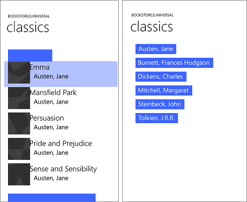
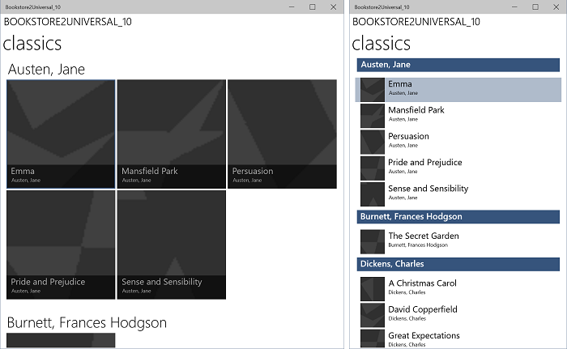

# <a name="windows-phone-silverlight-to-uwp-case-study-bookstore2"></a>UWP에 대한 Windows Phone Silverlight 사례 연구: Bookstore2

\[ Windows 10의 UWP 앱에 맞게 업데이트되었습니다. Windows 8.x 문서는 [보관](http://go.microsoft.com/fwlink/p/?linkid=619132)을 참조하세요. \]

[Bookstore1](wpsl-to-uwp-case-study-bookstore1.md)에 제공된 정보를 기반으로 하는 이 사례 연구는 **LongListSelector**에서 그룹화된 데이터를 표시하는 Windows Phone Silverlight 앱으로 시작합니다. 보기 모델에서 **Author** 클래스의 각 인스턴스는 해당 저자가 쓴 책의 그룹을 나타내며, **LongListSelector**에서 저자가 그룹화한 책 목록을 보거나 저자의 점프 목록을 축소할 수 있습니다. 점프 목록은 책 목록을 스크롤할 때보다 훨씬 더 빠른 탐색이 가능케 합니다. 앱을 Windows 10 UWP(유니버설 Windows 플랫폼) 앱으로 포팅하는 단계를 안내합니다.

**참고** Visual Studio에서 Bookstore2Universal\_10을 열 때 "Visual Studio 업데이트 필요"라는 메시지가 표시되면 [TargetPlatformVersion](w8x-to-uwp-troubleshooting.md)에서 대상 플랫폼 버전 설정 단계를 따르세요.

## <a name="downloads"></a>다운로드

[Bookstore2WPSL8 Windows Phone Silverlight 앱을 다운로드하세요.](http://go.microsoft.com/fwlink/p/?linkid=522601).

[Bookstore2Universal\_10 Windows 10 앱을 다운로드합니다](http://go.microsoft.com/fwlink/?linkid=532952).

##  <a name="the-windows-phone-silverlight-app"></a>Windows Phone Silverlight 앱

포팅할 Bookstore2WPSL8 앱은 다음과 같습니다. 저자가 그룹화한 책의 **LongListSelector**을 세로로 스크롤 하는 것입니다. 점프 목록으로 축소할 수 있으며 점프 목록에서 어떤 그룹으로도 다시 이동할 수 있습니다. 이 앱에는 두 가지 주요 특징이 있습니다. 그룹화된 데이터 원본를 제공하는 보기 모델 및 보기 모델에 바인딩하는 사용자 인터페이스가 그것입니다. 앞으로 자세히 알아보겠지만, 이 두 가지 특징 모두 Windows Phone Silverlight 기술에서 UWP(유니버설 Windows 플랫폼)로 쉽게 포팅합니다.


##  <a name="porting-to-a-windows-10-project"></a>Windows 10 프로젝트로 포팅

Visual Studio에서 새 프로젝트를 만들고 Bookstore2WPSL8의 파일을 이 프로젝트로 복사한 후 복사한 파일을 새 프로젝트에 포함하는 과정은 빠르게 진행되는 작업입니다. 비어 있는 응용 프로그램(Windows 유니버설) 프로젝트를 새로 만들어 시작합니다. Bookstore2Universal\_10이라고 이름을 지정합니다. 다음은 Bookstore2WPSL8에서 Bookstore2Universal\_10으로 복사할 파일입니다.

-   책 표지 이미지 PNG 파일이 들어 있는 폴더를 복사합니다(폴더는 \\Assets\\CoverImages임) 폴더를 복사한 후에 **솔루션 탐색기**에서 **모든 파일 표시**가 설정되어 있는지 확인합니다. 복사한 폴더를 마우스 오른쪽 단추로 클릭하고 **프로젝트에 포함**을 클릭합니다. 이 명령은 파일이나 폴더를 프로젝트에 "포함"하여 우리가 의도한 작업을 진행합니다. 파일이나 폴더를 복사할 때마다 **솔루션 탐색기**에서 **새로 고침**을 클릭한 다음 프로젝트에 파일 또는 폴더를 포함합니다. 대상에서 바꾸려는 파일에 대해서는 이 작업을 수행하지 않아도 됩니다.
-   보기 모델 소스 파일이 포함된 폴더(\\ViewModel)를 복사합니다.
-   MainPage.xaml을 복사한 후 대상의 파일을 바꿉니다.

Windows 10 프로젝트에서 Visual Studio를 통해 생성한 App.xaml 및 App.xaml.cs를 유지할 수 있습니다.

방금 복사한 소스 코드 및 태그 파일을 편집하고 Bookstore2WPSL8 네임스페이스에 대한 참조를 Bookstore2Universal\_10으로 변경합니다. **파일에서 바꾸기** 기능을 사용하면 이 작업을 빠르게 수행할 수 있습니다. 보기 모델 소스 파일의 명령적 코드에서 다음과 같은 포팅 변경이 필요합니다.

-   `System.ComponentModel.DesignerProperties`을(를) `DesignMode`(으)로 변경한 다음 **확인** 명령을 사용합니다. `IsInDesignTool` 속성을 삭제하고 IntelliSense를 사용하여 올바른 속성 이름(`DesignModeEnabled`)을 추가합니다.
-   `ImageSource`에서 **확인** 명령을 사용합니다.
-   `BitmapImage`에서 **확인** 명령을 사용합니다.
-   `using System.Windows.Media;` 및 `using System.Windows.Media.Imaging;`을(를) 삭제합니다.
-   **Bookstore2Universal\_10.BookstoreViewModel.AppName** 속성에 의해 반환된 값을 "BOOKSTORE2WPSL8"에서 "BOOKSTORE2UNIVERSAL"로 변경합니다.
-   [Bookstore1](wpsl-to-uwp-case-study-bookstore1.md)의 경우에서 그랬던 것처럼, **BookSku.CoverImage** 속성 구현을 업데이트합니다([이미지를 보기 모델에 바인딩](wpsl-to-uwp-case-study-bookstore1.md) 참조).

MainPage.xaml에서 다음과 같은 초기 포팅 변경이 필요합니다.

-   `phone:PhoneApplicationPage`에서 `Page`(으)로 변경합니다(속성 요소 구문에서의 발생 횟수 포함).
-   `phone` 및 `shell` 네임스페이스 접두사 선언을 삭제합니다.
-   나머지 네임스페이스 접두사 선언에서 ‘clr 네임스페이스’를 ‘사용’으로 변경합니다.
-   `SupportedOrientations="Portrait"` 및 `Orientation="Portrait"`를 삭제하고 새 프로젝트의 앱 패키지 매니페스트에서 **세로**를 구성합니다.
-   `shell:SystemTray.IsVisible="True"`을(를) 삭제합니다.
-   점프 목록 항목 변환기 유형(태그에서 리소스로 존재)이 [**Windows.UI.Xaml.Controls.Primitives**](https://msdn.microsoft.com/library/windows/apps/br209818) 네임스페이스로 이동했습니다. 따라서 네임스페이스 접두사 선언 Windows\_UI\_Xaml\_Controls\_Primitives를 추가하고 **Windows.UI.Xaml.Controls.Primitives**로 매핑합니다. 점프 목록의 항목 변환기 리소스에서 접두사를 `phone:`에서 `Windows_UI_Xaml_Controls_Primitives:`(으)로 변경합니다.
-   [Bookstore1](wpsl-to-uwp-case-study-bookstore1.md)의 경우에서 그랬던 것처럼, `PhoneTextExtraLargeStyle` **TextBlock** 스타일에 대한 모든 참조를 `SubtitleTextBlockStyle`에 대한 참조로 바꾸고, `PhoneTextSubtleStyle`은(는) `SubtitleTextBlockStyle`(으)로, `PhoneTextNormalStyle`은(는) `CaptionTextBlockStyle`(으)로, `PhoneTextTitle1Style`은(는) `HeaderTextBlockStyle`(으)로 바꿉니다.
-   `BookTemplate`의 한 가지 예외가 있습니다. 두 번째 **TextBlock**의 스타일은 `CaptionTextBlockStyle`을 참조해야 합니다.
-   `AuthorGroupHeaderTemplate` 내부의 **TextBlock**에서 FontFamily 특성을 제거하고, **Border**의 Background가 `PhoneAccentBrush` 대신 `SystemControlBackgroundAccentBrush`를 참조하도록 설정합니다.
-   [보기 픽셀 관련 변경](wpsl-to-uwp-porting-xaml-and-ui.md)으로 인해, 태그를 살펴보고 고정된 크기 치수(여백, 너비, 높이 등)를 0.8로 곱해야 합니다.

## <a name="replacing-the-longlistselector"></a>LongListSelector 교체


**LongListSelector**를 [**SemanticZoom**](https://msdn.microsoft.com/library/windows/apps/hh702601) 컨트롤로 바꾸는 과정은 여러 단계가 필요합니다. 이제 시작하겠습니다. **LongListSelector**는 그룹화된 데이터 원본에 직접 바인딩하지만 **SemanticZoom**은 [**ListView**](https://msdn.microsoft.com/library/windows/apps/br242878) 또는 [**GridView**](https://msdn.microsoft.com/library/windows/apps/br242705) 컨트롤을 포함합니다. 후자의 경우 [**CollectionViewSource**](https://msdn.microsoft.com/library/windows/apps/br209833) 어댑터를 통해 데이터로 간접적으로 바인딩합니다. **CollectionViewSource**는 태그의 리소스로 존재해야 하기 때문에 먼저 `<Page.Resources>` 내 MainPage.xaml의 태그에 추가하겠습니다.

```xml
    <CollectionViewSource
        x:Name="AuthorHasACollectionOfBookSku"
        Source="{Binding Authors}"
        IsSourceGrouped="true"/>
```

**LongListSelector.ItemsSource**에서 바인딩하는 경우 **CollectionViewSource.Source** 값이 되며, **LongListSelector.IsGroupingEnabled**은(는) **CollectionViewSource.IsSourceGrouped**이(가) 됩니다. **CollectionViewSource**은(는) 이름이 있기에(참고: 예상처럼 키가 아님) 그 이름에 바인딩할 수 있습니다.

다음으로 `phone:LongListSelector`를 이 태그로 바꿉니다. 이 태그는 다음과 같이 작업할 임시 **SemanticZoom**을 제공합니다.

```xml
    <SemanticZoom>
        <SemanticZoom.ZoomedInView>
            <ListView
                ItemsSource="{Binding Source={StaticResource AuthorHasACollectionOfBookSku}}"
                ItemTemplate="{StaticResource BookTemplate}">
                <ListView.GroupStyle>
                    <GroupStyle
                        HeaderTemplate="{StaticResource AuthorGroupHeaderTemplate}"
                        HidesIfEmpty="True"/>
                </ListView.GroupStyle>
            </ListView>
        </SemanticZoom.ZoomedInView>
        <SemanticZoom.ZoomedOutView>
            <ListView
                ItemsSource="{Binding CollectionGroups, Source={StaticResource AuthorHasACollectionOfBookSku}}"
                ItemTemplate="{StaticResource ZoomedOutAuthorTemplate}"/>
        </SemanticZoom.ZoomedOutView>
    </SemanticZoom>
```

단순 목록과 점프 목록 모드의 **LongListSelector** 개념에 대한 답변은 확대 및 축소 보기의 **SemanticZoom** 개념에 각각 나와 있습니다. 확대 보기는 하나의 속성이며 **ListView**의 인스턴스에 이 속성을 설정합니다. 이 경우 축소 보기도 **ListView**에 설정되며, 두 **ListView** 컨트롤 모두 **CollectionViewSource**에 바인딩됩니다. 확대 보기는 **LongListSelector**의 단순 목록에서 그랬던 것처럼 동일한 항목 템플릿, 그룹 헤더 템플릿, 그리고 **HideEmptyGroups** 설정(이제는 **HidesIfEmpty**(으)로 명명)을 사용합니다. 또한 축소 보기는 **LongListSelector**의 점프 목록 스타일(`AuthorNameJumpListStyle`) 내에 있는 것과 매우 유사한 항목 템플릿을 사용합니다. 그리고 축소 보기는 **CollectionGroups**라는 이름의 **CollectionViewSource**의 특수 속성에 바인딩됩니다. 이는 항목이 아닌 그룹이 포함된 컬렉션입니다.

더 이상 `AuthorNameJumpListStyle`이(가) 필요 없습니다(적어도 전체가 필요하지는 않음). 축소 보기에서 그룹(이 앱의 저자 그룹)에 대한 데이터 템플릿만 필요합니다. 따라서 `AuthorNameJumpListStyle` 스타일을 삭제하고 다음과 같은 데이터 템플릿으로 바꿉니다.

```xml
   <DataTemplate x:Key="ZoomedOutAuthorTemplate">
        <Border Margin="9.6,0.8" Background="{Binding Converter={StaticResource JumpListItemBackgroundConverter}}">
            <TextBlock Margin="9.6,0,9.6,4.8" Text="{Binding Group.Name}" Style="{StaticResource SubtitleTextBlockStyle}"
            Foreground="{Binding Converter={StaticResource JumpListItemForegroundConverter}}" VerticalAlignment="Bottom"/>
        </Border>
    </DataTemplate>
```

이 데이터 템플릿의 데이터 컨텍스트는 항목이 아니라 그룹이기 때문에 **Group**(이)라는 이름의 특수 속성에 바인딩합니다.

이제 앱을 빌드 및 실행할 수 있습니다. 모바일 에뮬레이터에서 모양은 다음과 같습니다.



스타일 지정 및 템플릿 작업을 조금 더 해야 하는 한 가지 문제가 있긴 하지만 보기 모델, 확대 및 축소 보기는 다 함께 올바르게 작동됩니다. 예를 들어 올바른 스타일 및 브러시가 아직 사용되지 않아 텍스트가 클릭하여 축소할 수 있는 그룹 헤더에 표시되지 않습니다. 데스크톱 장치에서 앱을 실행하면 창이 모바일 장치 화면보다 훨씬 클 수 있는 큰 장치에서 최상의 환경 및 사용 공간을 제공하도록 앱에서 해당 사용자 인터페이스를 아직 적용하지 않은 두 번째 문제가 있다는 것을 알게 됩니다. 따라서 다음의 몇몇 섹션([초기 스타일 지정 및 템플릿 작업](#initial-styling-and-templating), [적응 UI](#adaptive-ui) 및 [최종 스타일 지정](#final-styling))에서는 이러한 문제를 해결합니다.

## <a name="initial-styling-and-templating"></a>초기 스타일 지정 및 템플릿 작업

그룹 헤더의 간격을 보기 좋게 지정하려면 `AuthorGroupHeaderTemplate`을 편집하여 **Border**의 **Margin**을 `"0,0,0,9.6"`(으)로 설정합니다.

Book 항목의 간격을 보기 좋게 공간을 지정하려면 `BookTemplate`을 편집하여 두 **TextBlock**에서 **Margin**을 `"9.6,0"`으로 설정합니다.

앱 이름 및 페이지 제목을 조금 더 보기 좋게 배치하려면 `TitlePanel` 내부에서 값을 `"7.2,0,0,0"`으로 설정하여 두 번째 **TextBlock**의 위쪽 **Margin**을 제거합니다. 그리고 `TitlePanel` 자체에서 여백을 `0`(또는 적절해 보이는 값)으로 설정합니다.

`LayoutRoot`의 Background를 `"{ThemeResource ApplicationPageBackgroundThemeBrush}"`로 변경합니다.

## <a name="adaptive-ui"></a>적응 UI

휴대폰 앱에서 시작하였으므로 프로세스의 이 단계에서 포팅된 앱의 UI 레이아웃이 소형 장치와 좁은 창에만 적합한 게 놀라운 일은 아닙니다. 그러나 실제로 앱이 넓은 창(큰 화면이 있는 장치에서만 가능함)에서 실행될 경우 UI 레이아웃이 자체적으로 조정되고 공간을 효과적으로 사용하기를 원하며 앱의 창이 좁은 경우(좁은 창은 작은 장치에서 표시되며 큰 장치에서도 표시될 수 있음)에는 현재 UI를 사용하기를 원합니다.

이를 위해 적응 Visual State Manager 기능을 사용할 수 있습니다. 기본적으로 현재 사용하고 있는 템플릿을 사용하여 좁은 상태에 UI가 배치되도록 시각적 요소에서 속성을 설정합니다. 그런 다음 앱의 창이 특정 크기([유효 픽셀](wpsl-to-uwp-porting-xaml-and-ui.md)의 단위로 측정)보다 넓거나 같은 경우를 감지하고 그에 따라 더 크고 넓은 레이아웃을 가져오도록 시각적 요소의 속성을 변경합니다. 시각적 상태에서 해당 속성 변경을 적용하고 적응 트리거를 사용하여 끊임없이 모니터링하고 유효 픽셀의 창 너비에 따라 해당 시각적 상태를 적용할지 여부를 결정합니다. 이 경우 창 너비에서 트리거하지만 창 높이에서도 트리거할 수 있습니다.

548epx의 최소 창 너비가 넓은 레이아웃을 표시하려는 가장 작은 장치의 크기이므로 548epx가 이 사용 사례에 적합합니다. 휴대폰은 일반적으로 548epx보다 작으므로 이와 같은 소형 장치에서는 기본적으로 좁은 레이아웃 상태를 유지합니다. PC에서는 기본적으로 250x250 크기의 항목을 표시할 넓은 상태로의 전환을 트리거하기에 충분히 넓은 상태로 창이 시작됩니다. 이러한 넓은 창에서, 창을 끌어 최소한 250x250 항목의 두 열을 표시할 정도로 좁힐 수 있습니다. 그보다 너비를 더 좁히면 트리거가 비활성화되고 넓은 시각적 상태가 제거되며 기본값인 좁은 레이아웃이 적용됩니다.

적응 Visual State Manager 기능을 사용하기 전에 먼저 넓은 상태를 디자인해야 합니다. 즉, 새로운 몇몇 시각적 요소 및 템플릿을 태그에 추가합니다. 다음 단계에서 이 작업을 수행하는 방법을 설명합니다. 시각적 요소 및 템플릿의 명명 규칙을 통해 넓은 상태에 적합한 요소 또는 템플릿의 이름에 "wide"라는 단어를 포함합니다. 요소 또는 템플릿에 "wide"라는 단어가 포함되어 있지 않으면 요소 또는 템플릿이 좁은 상태에 적합하며 좁은 상태가 기본 상태이고 해당 속성 값이 페이지에서 시각적 요소의 로컬 값으로 설정되었다고 가정할 수 있습니다. 넓은 상태의 속성 값만 태그의 실제 시각적 상태를 통해 설정됩니다.

-   태그에서 [**SemanticZoom**](https://msdn.microsoft.com/library/windows/apps/hh702601) 컨트롤의 복사본을 만들고 복사본에서 `x:Name="narrowSeZo"`를 설정합니다. 원본에서 `x:Name="wideSeZo"`를 설정하고 기본적으로 넓은 보기가 표시되지 않도록 `Visibility="Collapsed"`도 설정합니다.
-   `wideSeZo`에서 확대 보기와 축소 보기 둘 다의 **ListView**를 **GridView**로 변경합니다.
-   세 가지 리소스 즉, `AuthorGroupHeaderTemplate`, `ZoomedOutAuthorTemplate` 및 `BookTemplate`의 복사본을 만들고 `Wide`라는 단어를 복사본의 키에 추가합니다. 또한 `wideSeZo`도 업데이트하여 이러한 새 리소스의 키를 참조하도록 합니다.
-   `AuthorGroupHeaderTemplateWide`의 내용을 `<TextBlock Style="{StaticResource SubheaderTextBlockStyle}" Text="{Binding Name}"/>`으로 바꿉니다.
-   `ZoomedOutAuthorTemplateWide`의 내용을 다음으로 바꿉니다.

```xml
    <Grid HorizontalAlignment="Left" Width="250" Height="250" >
        <Border Background="{StaticResource ListViewItemPlaceholderBackgroundThemeBrush}"/>
        <StackPanel VerticalAlignment="Bottom" Background="{StaticResource ListViewItemOverlayBackgroundThemeBrush}">
          <TextBlock Foreground="{StaticResource ListViewItemOverlayForegroundThemeBrush}"
              Style="{StaticResource SubtitleTextBlockStyle}"
            Height="80" Margin="15,0" Text="{Binding Group.Name}"/>
        </StackPanel>
    </Grid>
```

-   `BookTemplateWide`의 내용을 다음으로 바꿉니다.

```xml
    <Grid HorizontalAlignment="Left" Width="250" Height="250">
        <Border Background="{StaticResource ListViewItemPlaceholderBackgroundThemeBrush}"/>
        <Image Source="{Binding CoverImage}" Stretch="UniformToFill"/>
        <StackPanel VerticalAlignment="Bottom" Background="{StaticResource ListViewItemOverlayBackgroundThemeBrush}">
            <TextBlock Style="{StaticResource SubtitleTextBlockStyle}"
                Foreground="{StaticResource ListViewItemOverlaySecondaryForegroundThemeBrush}"
                TextWrapping="NoWrap" TextTrimming="CharacterEllipsis"
                Margin="12,0,24,0" Text="{Binding Title}"/>
            <TextBlock Style="{StaticResource CaptionTextBlockStyle}" Text="{Binding Author.Name}"
                Foreground="{StaticResource ListViewItemOverlaySecondaryForegroundThemeBrush}" TextWrapping="NoWrap"
                TextTrimming="CharacterEllipsis" Margin="12,0,12,12"/>
        </StackPanel>
    </Grid>
```

-   넓은 상태의 경우 확대 보기의 그룹은 주변에 더 많은 세로 공간을 필요로 합니다. 항목 패널 템플릿을 생성 및 참조하면 원하는 결과를 얻을 수 있습니다. 태그 모양은 다음과 같습니다.

```xml
   <ItemsPanelTemplate x:Key="ZoomedInItemsPanelTemplate">
        <ItemsWrapGrid Orientation="Horizontal" GroupPadding="0,0,0,20"/>
    </ItemsPanelTemplate>
    ...

    <SemanticZoom x:Name="wideSeZo" ... >
        <SemanticZoom.ZoomedInView>
            <GridView
            ...
            ItemsPanel="{StaticResource ZoomedInItemsPanelTemplate}">
            ...
```

-   마지막으로, 적절한 Visual State Manager 태그를 `LayoutRoot`의 첫 번째 자식으로 추가합니다.

```xml
    <Grid x:Name="LayoutRoot" ... >
        <VisualStateManager.VisualStateGroups>
            <VisualStateGroup>
                <VisualState x:Name="WideState">
                    <VisualState.StateTriggers>
                        <AdaptiveTrigger MinWindowWidth="548"/>
                    </VisualState.StateTriggers>
                    <VisualState.Setters>
                        <Setter Target="wideSeZo.Visibility" Value="Visible"/>
                        <Setter Target="narrowSeZo.Visibility" Value="Collapsed"/>
                    </VisualState.Setters>
                </VisualState>
            </VisualStateGroup>
        </VisualStateManager.VisualStateGroups>

    ...
```

## <a name="final-styling"></a>최종 스타일 지정

이제 몇 가지 최종 스타일 조정 작업이 남아 있습니다.

-   `AuthorGroupHeaderTemplate`에서, 모바일 디바이스 패밀리에서 실행될 때 올바르게 표시되도록 **TextBlock**에서 `Foreground="White"`를 설정합니다.
-   `FontWeight="SemiBold"`를 `AuthorGroupHeaderTemplate`과 `ZoomedOutAuthorTemplate` 둘 다의 **TextBlock**에 추가합니다.
-   `narrowSeZo`에서 축소 보기의 그룹 헤더와 저자는 확대되지 않고 왼쪽 맞춤 정렬됩니다. 이제 시작해보겠습니다. [**HorizontalContentAlignment**](https://msdn.microsoft.com/library/windows/apps/br209417)가 `Stretch`로 설정된 확대 보기의 [**HeaderContainerStyle**](https://msdn.microsoft.com/library/windows/apps/dn251841)을 생성합니다. 또한 동일한 [**Setter**](https://msdn.microsoft.com/library/windows/apps/br208817)를 포함하고 있는 축소 보기의 [**ItemContainerStyle**](https://msdn.microsoft.com/library/windows/apps/br242817)을 생성합니다. 다음과 같이 표시됩니다.

```xml
   <Style x:Key="AuthorGroupHeaderContainerStyle" TargetType="ListViewHeaderItem">
        <Setter Property="HorizontalContentAlignment" Value="Stretch"/>
    </Style>

    <Style x:Key="ZoomedOutAuthorItemContainerStyle" TargetType="ListViewItem">
        <Setter Property="HorizontalContentAlignment" Value="Stretch"/>
    </Style>

    ...

    <SemanticZoom x:Name="narrowSeZo" ... >
        <SemanticZoom.ZoomedInView>
            <ListView
            ...
                <ListView.GroupStyle>
                    <GroupStyle
                    ...
                    HeaderContainerStyle="{StaticResource AuthorGroupHeaderContainerStyle}"
                    ...
        <SemanticZoom.ZoomedOutView>
            <ListView
                ...
                ItemContainerStyle="{StaticResource ZoomedOutAuthorItemContainerStyle}"
                ...
```

스타일 작업의 마지막 시퀀스를 진행하면 앱이 다음과 같은 모양을 유지합니다.



데스크톱 디바이스에서 실행되는 포팅된 Windows 10 앱, 축소 보기, 두 개의 창 크기  


데스크톱 디바이스에서 실행되는 포팅된 Windows 10 앱, 축소 보기, 두 개의 창 크기


모바일 디바이스에서 실행되는 포팅된 Windows 10 앱, 확대 보기


모바일 디바이스에서 실행되는 포팅된 Windows 10 앱, 축소 보기

## <a name="making-the-view-model-more-flexible"></a>보기 모델을 보다 유연하게 만들기

UWP를 사용하도록 앱을 이동함으로써 사용 가능해진 기능의 한 가지 예가 이 섹션에 포함되어 있습니다. 여기에서는 **CollectionViewSource**을(를) 통해 액세스한 경우 내 보기 모델을 보다 유연하게 하기 위해 따를 수 있는 선택적 단계에 대해 설명합니다. Windows Phone Silverlight 앱 Bookstore2WPSL8에서 포팅한 보기 모델(소스 파일은 ViewModel\\BookstoreViewModel.cs에 있음)은 Author라는 클래스를 포함합니다. 이 클래스는 **T**가 BookSku인 **List&lt;T&gt;**에서 파생됩니다. 즉, ‘저자’ 클래스 *은(는) BookSku의* 그룹입니다.

**CollectionViewSource.Source**을(를) '저자들'에 바인딩할 때 중요한 것은 바로 '저자들' 속의 각 '저자'는 *무엇*의 그룹이라는 점입니다. 이 경우에 '저자'가 BookSku의 그룹이라는 점을 **CollectionViewSource**에서 결정하도록 맡깁니다. 이 경우 실행되지만 유연하지 않습니다. '저자'가 BookSku 그룹 *그리고* 저자가 살았던 주소 그룹 *둘 다*이길 바라는 경우에는 어떻게 할까요? '저자'는 양 그룹이 동시에 *될 수 없습니다*. 그러나 '저자'가 가질 수 있는 그룹 수에는 *제한이 없습니다*. 다음과 같이 하면 해결할 수 있습니다. 현재 사용하고 있는 *~는 그룹이다* 패턴 대신 또는 그에 추가로 *~그룹이 있다* 패턴을 사용하는 것입니다. 방법은 다음과 같습니다.

-   저자를 변경하여 그것이 더 이상 **List&lt;T&gt;**에서 파생되지 않도록 합니다.
-   `private ObservableCollection<BookSku> bookSkus = new ObservableCollection<BookSku>();` 이 필드를 ‘저자’에 추가합니다.
-   `public ObservableCollection<BookSku> BookSkus { get { return this.bookSkus; } }` 이 속성을 '저자'에 추가합니다.
-   물론 위의 두 단계를 반복하여 필요한 만큼의 '저자들'을 추가할 수 있습니다.
-   AddBookSku 메서드의 구현을 `this.BookSkus.Add(bookSku);`(으)로 변경합니다.
-   이제 '작성자'가 하나 이상의 그룹을 *가졌으므로*, **CollectionViewSource**과(와) 통신해야 합니다. 이렇게 하려면 이 속성을 **CollectionViewSource**에 추가합니다. `ItemsPath="BookSkus"`

이런 변경 내용으로도 앱의 기능은 변경되지 않지만 필요할 경우 '저자'와 **CollectionViewSource**을(를) 확장할 수 있는 방법을 우리는 이미 알고 있습니다. '저자'에 대한 마지막 변경 내용입니다. 이 변경을 통해 **CollectionViewSource.ItemsPath**을(를) 지정하지 *않고* '저자'를 사용하는 경우, 선택하는 기본 그룹이 사용됩니다.

```csharp
    public class Author : IEnumerable<BookSku>
    {
        ...

        public IEnumerator<BookSku> GetEnumerator()
        {
            return this.BookSkus.GetEnumerator();
        }
        System.Collections.IEnumerator System.Collections.IEnumerable.GetEnumerator()
        {
            return this.BookSkus.GetEnumerator();
        }
    }
```

원할 경우 `ItemsPath="BookSkus"`을(를) 제거할 수 있으며 앱은 동일한 방식으로 작동합니다.

## <a name="conclusion"></a>결론

이 사례 연구는 이전보다 더욱 복잡한 사용자 인터페이스를 포함합니다. Windows Phone Silverlight  **LongListSelector**의 모든 기능, 개념 등이 **SemanticZoom**, **ListView**, **GridView** 및 **CollectionViewSource**의 형태로 UWP 앱에서 사용될 수 있습니다. 가장 좁고 가장 넓은 Windows 디바이스 폼 팩터 및 중간의 모든 크기에 맞게 조정된 기능, UI 및 조작 방식을 구현하기 위해 UWP 앱에서 명령적 코드와 태그를 둘 다 다시 사용하거나 복사 및 편집하는 방법을 살펴보았습니다.
