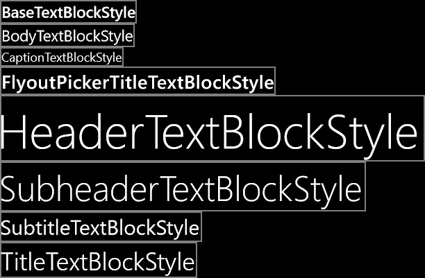

#  <a name="porting-windowsphone-silverlight-xaml-and-ui-to-uwp"></a>WindowsPhone Silverlight XAML 및 UI를 UWP로 포팅


이전 항목에서는 [문제 해결](wpsl-to-uwp-troubleshooting.md)에 대해 살펴보았습니다.

선언적 XAML 태그 형식으로 UI를 정의 하는 방법이 매우 원활 하 게 WindowsPhone Silverlight에서에서 유니버설 Windows 플랫폼 (UWP) 앱으로 변환 합니다. 시스템 리소스 키 참조를 업데이트하고 일부 요소 형식 이름을 변경하고 "clr-namespace"를 "using"으로 변경한 경우 태그의 많은 부분이 호환됩니다. 또한 표시 계층의 대부분의 명령적 코드(보기 모델, UI 요소를 조작하는 코드)는 쉽게 포팅됩니다.

## <a name="a-first-look-at-the-xaml-markup"></a>XAML 태그 살펴보기

이전 항목에서는 XAML 및 코드 숨김에 복사 하는 방법을 설명 했습니다. 새 Windows10 Visual Studio 프로젝트에 파일. Visual Studio XAML 디자이너에서 가장 두드러지는 문제 중 하나로 XAML 파일의 루트에 있는 `PhoneApplicationPage` 요소가 UWP(유니버설 Windows 플랫폼) 프로젝트에 적합하지 않습니다. 이전 항목에서는 Windows10 프로젝트를 만들 때 Visual Studio에서 생성 된 XAML 파일의 복사본을 저장 합니다. MainPage.xaml의 해당 버전을 열면 [**Windows.UI.Xaml.Controls**](https://msdn.microsoft.com/library/windows/apps/br227716) 네임스페이스에 있는 [**Page**](https://msdn.microsoft.com/library/windows/apps/br227503) 형식이 루트에 표시됩니다. 따라서 모든 `<phone:PhoneApplicationPage>` 요소를 `<Page>`로 변경하고(속성 요소 구문을 기억해야 함) `xmlns:phone` 선언을 삭제할 수 있습니다.

WindowsPhone Silverlight 형식에 해당 하는 UWP 형식의 찾을 보다 일반적인 접근 방식에 대 한 [Namespace 및 클래스 매핑](wpsl-to-uwp-namespace-and-class-mappings.md)참조할 수 있습니다.

## <a name="xaml-namespace-prefix-declarations"></a>XAML 네임스페이스 접두사 선언


보기에서 사용자 지정 형식의 인스턴스(예: 보기 모델 인스턴스 또는 값 변환기)를 사용하는 경우 XAML 태그에 XAML 네임스페이스 접두사 선언이 있습니다. 이러한 구문은 WindowsPhone Silverlight와 UWP 간에 차이가 있습니다. 예를 들면 다음과 같습니다.

```xml
    xmlns:ContosoTradingCore="clr-namespace:ContosoTradingCore;assembly=ContosoTradingCore"
    xmlns:ContosoTradingLocal="clr-namespace:ContosoTradingLocal"
```

"clr-namespace"를 "using"으로 변경하고 어셈블리 토큰과 세미콜론을 삭제합니다(어셈블리가 유추됨). 결과는 다음과 같습니다.

```xml
    xmlns:ContosoTradingCore="using:ContosoTradingCore"
    xmlns:ContosoTradingLocal="using:ContosoTradingLocal"
```

시스템에서 리소스의 형식이 정의될 수 있습니다.

```xml
    xmlns:System="clr-namespace:System;assembly=mscorlib"
    /* ... */
    <System:Double x:Key="FontSizeLarge">40</System:Double>
```

UWP에서는 "System" 접두사 선언을 생략하고 이미 선언된 "x" 접두사를 대신 사용합니다.

```xml
    <x:Double x:Key="FontSizeLarge">40</x:Double>
```

## <a name="imperative-code"></a>명령적 코드


보기 모델은 UI 형식을 참조하는 명령적 코드가 있는 장소 중 하나입니다. 다른 장소로는 UI 요소를 직접 조작하는 코드 숨김 파일이 있습니다. 예를 들어 다음과 같은 코드 줄이 아직 컴파일되지 않았을 수 있습니다.


```csharp
    return new BitmapImage(new Uri(this.CoverImagePath, UriKind.Relative));
```

**BitmapImage** 가 WindowsPhone Silverlight 및 using **System.Windows.Media.Imaging** 네임 스페이스에 동일한 파일에서 지시문 **BitmapImage** 위의 코드 조각 에서처럼 네임 스페이스 자격 부여 없이 사용할 수 있습니다. 다음과 같은 경우 Visual Studio에서 형식 이름(**BitmapImage**)을 마우스 오른쪽 단추로 클릭하고 상황에 맞는 메뉴에서 **Resolve** 명령을 사용하여 새 네임스페이스 지시문을 파일에 추가할 수 있습니다. 이 경우 UWP에서 형식이 있는 위치에 [**Windows.UI.Xaml.Media.Imaging**](https://msdn.microsoft.com/library/windows/apps/br243258) 네임스페이스가 추가됩니다. **System.Windows.Media.Imaging** using 지시문만 제거하면 위의 코드 조각에서처럼 코드를 포팅할 수 있습니다. 확인을 완료 하는 경우 모든 WindowsPhone Silverlight 네임 스페이스를 제거 됩니다.

이 경우처럼 단순히 이전 네임스페이스의 형식을 새 네임스페이스의 동일한 형식으로 매핑할 경우 Visual Studio의 **Find and Replace** 명령을 사용하여 소스 코드를 대량 변경할 수 있습니다. 형식의 새 네임스페이스를 검색하려면 **Resolve** 명령을 사용하는 것이 좋습니다. 다른 예로 모든 "System.Windows"를 "Windows.UI.Xaml"로 바꿀 수 있습니다. 기본적으로 해당 네임스페이스를 참조하는 모든 using 지시문과 모든 정규화된 형식 이름을 포팅합니다.

모든 이전 using 지시문을 제거하고 새 지시문을 추가한 후 Visual Studio의 **Organize Usings** 명령을 사용하여 지시문을 정렬하고 사용되지 않는 지시문을 제거할 수 있습니다.

때로는 명령적 코드 수정이 매개 변수 형식 변경과 같은 사소한 것일 수 있습니다. 다른 경우 8.x 앱 용 Windows 런타임 용.NET Api 대신 UWP Api를 사용 해야 합니다. 지원 되는 Api를 식별 하 [.NET에 대 한 Windows 런타임 8.x 앱 개요](https://msdn.microsoft.com/library/windows/apps/xaml/br230302.aspx) 및 [Windows 런타임 참조](https://msdn.microsoft.com/library/windows/apps/br211377)와 함께에서이 포팅 가이드의 나머지 부분을 사용 합니다.

프로젝트 빌드 단계로 진행하려면 필수가 아닌 코드에 주석이나 설명을 추가할 수 있습니다. 그런 다음 문제를 한 번에 하나씩 반복하고 이 섹션의 다음 항목과 이전 [문제 해결](wpsl-to-uwp-troubleshooting.md) 항목을 참조하여 모든 빌드 및 런타임 문제를 해결하고 포팅을 완료합니다.

## <a name="adaptiveresponsive-ui"></a>적응/반응형 UI

Windows10 앱 잠재적으로 광범위 한 디바이스에서 실행 될 수도 있으므로-각각 고유한 화면 크기와 해상도-앱을 포팅하는 최소한의 단계 이상을 진행 하는 것이 좋습니다 및 모양을 보기 좋게 해당 장치에서 UI를 조정 하는 것이 좋습니다. 적응 Visual State Manager 기능을 사용하여 동적으로 창 크기를 검색하고 그 결과에 따라 레이아웃을 변경할 수 있으며, 이러한 작업을 수행하는 방법에 대한 예제는 Bookstore2 사례 연구 항목의 [적응 UI](wpsl-to-uwp-case-study-bookstore2.md) 섹션에 나와 있습니다.

## <a name="alarms-and-reminders"></a>알람 및 미리 알림

[**BackgroundTaskBuilder**](https://msdn.microsoft.com/library/windows/apps/br224768) 클래스를 사용하여 백그라운드 작업을 만들어 등록하고 해당 시간에 알림을 표시하려면 **Alarm** 또는 **Reminder** 클래스를 사용하는 코드를 포팅해야 합니다. [후순위 처리](wpsl-to-uwp-business-and-data.md) 및 [알림](#toasts)을 참조하세요.

## <a name="animation"></a>애니메이션

키 프레임 애니메이션 및 시작/종료 애니메이션에 대한 기본 대안으로 이제 UWP 앱에서 UWP 애니메이션 라이브러리를 사용할 수 있습니다. 이러한 애니메이션은 부드럽게 실행하고, 멋있게 보이고, 기본 제공 앱처럼 앱이 Windows에 통합된 것처럼 보이도록 설계되고 조정되어 있습니다. [빠른 시작: 라이브러리 애니메이션을 사용하여 UI에 애니메이션 효과 주기](https://msdn.microsoft.com/library/windows/apps/xaml/hh452703)를 참조하세요.

UWP 앱에서 키 프레임 애니메이션 또는 시작/종료 애니메이션을 사용하는 경우 새 플랫폼에 도입된 독립 애니메이션과 종속 애니메이션 간의 차이점을 이해하려고 할 수 있습니다. [애니메이션 및 미디어 최적화](https://msdn.microsoft.com/library/windows/apps/mt204774)를 참조하세요. UI 스레드에서 실행되는 애니메이션(예: 레이아웃 속성에 애니메이션 효과를 주는 애니메이션)을 종속 애니메이션이라고 하며, 이러한 애니메이션은 새 플랫폼에서 실행될 경우 둘 중 하나를 수행하지 않는 한 효과가 없습니다. 독립 애니메이션으로 만들어 대상을 다시 지정함으로써 다른 속성(예: [**RenderTransform**](https://msdn.microsoft.com/library/windows/apps/br208980))에 애니메이션 효과를 줄 수 있습니다. 또는 애니메이션 요소에서 `EnableDependentAnimation="True"`를 설정하여 부드러운 실행이 보장되지 않는 애니메이션을 실행하도록 확인할 수 있습니다. Blend for Visual Studio를 사용하여 새 애니메이션을 제작할 경우 필요에 따라 해당 속성이 자동으로 설정됩니다.

## <a name="back-button-handling"></a>뒤로 단추 처리

Windows10 앱에서는 뒤로 단추를 처리 하는 단일 접근 방법을 사용할 수 및 모든 장치에서 작동 합니다. 모바일 장치에서는 단추가 장치의 용량성 단추로 또는 셸의 단추로 제공됩니다. 데스크톱 장치에서는 앱 내에서 뒤로 탐색이 가능할 때마다 앱의 크롬에 단추를 추가합니다. 그러면 해당 단추는 태블릿 모드의 작업 표시줄에 또는 창으로 표시된 앱의 제목 표시줄에 표시됩니다. 뒤로 단추 이벤트는 모든 디바이스 패밀리에서 범용 개념이며, 하드웨어 또는 소프트웨어에서 구현된 단추는 동일한 [**BackRequested**](https://msdn.microsoft.com/library/windows/apps/dn893596) 이벤트를 발생시킵니다.

아래 예제는 모든 디바이스 패밀리에서 작동하며, 동일한 처리가 모든 페이지에 적용되고 확인 탐색(예: 저장되지 않은 변경에 대한 경고)이 필요 없는 경우에 적합합니다.

```csharp
   // app.xaml.cs

    protected override void OnLaunched(LaunchActivatedEventArgs e)
    {
        [...]

        Windows.UI.Core.SystemNavigationManager.GetForCurrentView().BackRequested += App_BackRequested;
        rootFrame.Navigated += RootFrame_Navigated;
    }

    private void RootFrame_Navigated(object sender, NavigationEventArgs e)
    {
        Frame rootFrame = Window.Current.Content as Frame;

        // Note: On device families that have no title bar, setting AppViewBackButtonVisibility can safely execute 
        // but it will have no effect. Such device families provide a back button UI for you.
        if (rootFrame.CanGoBack)
        {
            Windows.UI.Core.SystemNavigationManager.GetForCurrentView().AppViewBackButtonVisibility = 
                Windows.UI.Core.AppViewBackButtonVisibility.Visible;
        }
        else
        {
            Windows.UI.Core.SystemNavigationManager.GetForCurrentView().AppViewBackButtonVisibility = 
                Windows.UI.Core.AppViewBackButtonVisibility.Collapsed;
        }
    }

    private void App_BackRequested(object sender, Windows.UI.Core.BackRequestedEventArgs e)
    {
        Frame rootFrame = Window.Current.Content as Frame;

        if (rootFrame.CanGoBack)
        {
            rootFrame.GoBack();
        }
    }
```

또한 모든 디바이스 패밀리에서 프로그래밍 방식으로 앱을 종료하는 단일 접근 방식도 있습니다.

```csharp
   Windows.UI.Xaml.Application.Current.Exit();
```

## <a name="binding-and-compiled-bindings-with-xbind"></a>바인딩 및 {x:Bind}로 컴파일된 바인딩

바인딩 항목에는 다음 내용이 포함됩니다.

-   UI 요소를 "데이터"(즉, 보기 모델의 속성 및 명령)에 바인딩
-   UI 요소를 다른 UI 요소에 바인딩
-   관찰 가능한 보기 모델 작성(즉, 속성 값이 변경되거나 명령의 가용성이 변경될 경우 알림 표시)

이러한 모든 측면은 대개 여전히 지원되지만 네임스페이스가 다릅니다. 예를 들어 **System.Windows.Data.Binding**은 [**Windows.UI.Xaml.Data.Binding**](https://msdn.microsoft.com/library/windows/apps/br209820)에 매핑되고, **System.ComponentModel.INotifyPropertyChanged**는 [**Windows.UI.Xaml.Data.INotifyPropertyChanged**](https://msdn.microsoft.com/library/windows/apps/br209899)에 매핑되고, **System.Collections.Specialized.INotifyPropertyChanged**는 [**Windows.UI.Xaml.Interop.INotifyCollectionChanged**](https://msdn.microsoft.com/library/windows/apps/hh702001)에 매핑됩니다.

UWP 앱에서 수 WindowsPhone Silverlight 앱 바 및 앱 바 단추 바인딩할 수 없습니다. 앱 바와 앱 바 단추를 생성하여 속성 및 지역화된 문자열에 바인딩하고 해당 이벤트를 처리하는 명령적 코드를 사용할 수 있습니다. 그럴 경우 명령적 코드를 속성과 명령에 바인딩되는 선언적 태그 및 고정 리소스 참조로 바꾸어 해당 명령적 코드를 포팅함으로써 앱을 더 안전하고 더 쉽게 유지 관리할 수 있습니다. Visual Studio 또는 Blend for Visual Studio를 사용하여 다른 XAML 요소처럼 UWP 앱 바 단추를 바인딩하고 스타일을 지정할 수 있습니다. UWP 앱에서 사용하는 형식 이름은 [**CommandBar**](https://msdn.microsoft.com/library/windows/apps/dn279427) 및 [**AppBarButton**](https://msdn.microsoft.com/library/windows/apps/dn279244)입니다.

UWP 앱의 바인딩 관련 기능에는 현재 다음과 같은 제한이 있습니다.

-   데이터 입력 유효성 검사와 [**IDataErrorInfo**](https://msdn.microsoft.com/library/system.componentmodel.idataerrorinfo.aspx) 및 [**INotifyDataErrorInfo**](https://msdn.microsoft.com/library/system.componentmodel.inotifydataerrorinfo.aspx) 인터페이스를 기본적으로 지원하지 않습니다.
-   [**Binding**](https://msdn.microsoft.com/library/windows/apps/br209820) 클래스 WindowsPhone Silverlight에서 사용할 수 있는 확장된 서식 속성 포함 되지 않습니다. 그러나 사용자 지정 서식을 제공하기 위해 여전히 [**IValueConverter**](https://msdn.microsoft.com/library/windows/apps/br209903) 를 구현할 수 있습니다.
-   [**IValueConverter**](https://msdn.microsoft.com/library/windows/apps/br209903) 메서드는 [**CultureInfo**](https://msdn.microsoft.com/library/system.globalization.cultureinfo.aspx) 개체 대신 언어 문자열을 매개 변수로서 가져옵니다.
-   [**CollectionViewSource**](https://msdn.microsoft.com/library/windows/apps/br209833) 클래스는 정렬과 필터링, 그리고 작업을 달리 그룹화하는 기능을 기본적으로 지원하지 않습니다. 자세한 내용은 [데이터 바인딩 심층 분석](https://msdn.microsoft.com/library/windows/apps/mt210946) 및 [데이터 바인딩 샘플](http://go.microsoft.com/fwlink/p/?linkid=226854)을 참조하세요.

동일한 바인딩 기능이 대개 여전히 지원 되지만 Windows10 새 옵션을 제공 하 고 바인딩 이라는 메커니즘 성능이 컴파일된 바인딩 {x: Bind} 태그 확장을 사용 합니다. [XAML 데이터 바인딩의 새로운 향상 기능을 통해 앱 성능 개선](http://channel9.msdn.com/Events/Build/2015/3-635)(영문) 및 [x:Bind 샘플](http://go.microsoft.com/fwlink/p/?linkid=619989)(영문)을 참조하세요.

## <a name="binding-an-image-to-a-view-model"></a>이미지를 보기 모델에 바인딩

[**Image.Source**](https://msdn.microsoft.com/library/windows/apps/br242760) 속성을 [**ImageSource**](https://msdn.microsoft.com/library/windows/apps/br210107) 형식을 가진 보기 모델의 속성에 바인딩할 수 있습니다. WindowsPhone Silverlight 앱에서 이러한 속성의 일반적인 구현은 다음과 같습니다.

```csharp
    // this.BookCoverImagePath contains a path of the form "/Assets/CoverImages/one.png".
    return new BitmapImage(new Uri(this.CoverImagePath, UriKind.Relative));
```

UWP 앱에서 ms-appx[URI 체계](https://msdn.microsoft.com/library/windows/apps/jj655406)를 사용할 수 있습니다. 코드의 나머지 부분을 동일하게 유지할 수 있도록 **System.Uri** 생성자의 다른 오버로드를 사용하여 ms-appx URI 스키마를 기본 URI에 삽입하고 나머지 경로를 URI에 추가합니다. 다음과 같습니다.

```csharp
    // this.BookCoverImagePath contains a path of the form "/Assets/CoverImages/one.png".
    return new BitmapImage(new Uri(new Uri("ms-appx://"), this.CoverImagePath));
```

이렇게 하면 나머지 보기 모델, 이미지 경로 속성의 경로 값 및 XAML 태그의 바인딩을 모두 동일하게 유지할 수 있습니다.

## <a name="controls-and-control-stylestemplates"></a>컨트롤 및 컨트롤 스타일/템플릿

WindowsPhone Silverlight 앱 **Microsoft.Phone.Controls** 네임 스페이스와 **System.Windows.Controls** 네임 스페이스에 정의 된 컨트롤을 사용 합니다. XAML UWP 앱은 [**Windows.UI.Xaml.Controls**](https://msdn.microsoft.com/library/windows/apps/br227716) 네임스페이스에 정의된 컨트롤을 사용합니다. 아키텍처 및 uwp에서 XAML 컨트롤의 디자인은 거의 WindowsPhone Silverlight 컨트롤와 동일 합니다. 하지만 사용 가능한 컨트롤 집합을 개선하고 Windows 앱과 통합하기 위해 일부를 변경했습니다. 다음은 구체적인 예입니다.

| 컨트롤 이름 | 변경 |
|--------------|--------|
| ApplicationBar | [Page.TopAppBar](https://msdn.microsoft.com/library/windows/apps/hh702575) 속성입니다. |
| ApplicationBarIconButton | 해당하는 UWP 속성은 [Glyph](https://msdn.microsoft.com/library/windows/apps/dn279538) 속성입니다. PrimaryCommands는 CommandBar의 콘텐츠 속성입니다. XAML 파서는 요소의 내부 xml을 해당 콘텐츠 속성의 값으로 해석합니다. |
| ApplicationBarMenuItem | 해당하는 UWP 속성은 메뉴 항목 텍스트로 설정된 [AppBarButton.Label](https://msdn.microsoft.com/library/windows/apps/dn279261)입니다. |
| ContextMenu(Windows Phone Toolkit에서) | 단일 선택 플라이아웃의 경우 [Flyout](https://msdn.microsoft.com/library/windows/apps/dn279496)을 사용합니다. |
| ControlTiltEffect.TiltEffect 클래스 | UWP 애니메이션 라이브러리의 애니메이션은 공용 컨트롤의 기본 스타일로 기본 제공됩니다. [포인터 동작 애니메이션](https://msdn.microsoft.com/library/windows/apps/xaml/jj649432)을 참조하세요. |
| 그룹화된 데이터를 포함하는 LongListSelector | 작동 하며 콘서트에서 사용할 수 있는 두 가지 방법으로 WindowsPhone Silverlight LongListSelector 작동 합니다. 첫째, 키로 그룹화된 데이터(예: 머리글자 문자로 그룹화된 이름 목록)를 표시할 수 있습니다. 둘째, 두 시맨틱 보기 즉, 그룹화된 항목 목록(예: 이름)과 그룹 키 목록(예: 머리글자 문자) 간에 "확대/축소"할 수 있습니다. UWP를 사용하면 [목록 및 그리드 보기 컨트롤에 대한 지침](https://msdn.microsoft.com/library/windows/apps/mt186889)에 따라 그룹화된 데이터를 표시할 수 있습니다. |
| 플랫 데이터를 포함하는 LongListSelector | 성능상의 이유로 매우 긴 목록의 경우 그룹화 되지 않은 플랫 데이터에 대해서도 목록 상자를 대신 WindowsPhone Silverlight LongListSelector 좋습니다 했습니다. UWP 앱에서는 데이터를 그룹화할 수 있는지 여부와 상관없이 긴 항목 목록에 대해 [GridView](https://msdn.microsoft.com/library/windows/apps/br242705)가 우선적으로 사용됩니다. |
| Panorama | WindowsPhone Silverlight Panorama 컨트롤 허브 컨트롤에 대 한 [Windows 런타임 8.x 앱의 허브 컨트롤에 대 한 지침](https://msdn.microsoft.com/library/windows/apps/dn449149) 및 지침에 매핑됩니다. <br/> Panorama 컨트롤은 마지막 섹션에서 첫 번째 섹션까지 래핑하며, 해당 배경 이미지는 섹션을 기준으로 시차 효과를 내면서 이동합니다. [Hub](https://msdn.microsoft.com/library/windows/apps/dn251843) 섹션은 주변을 래핑하지 않으며 시차 효과가 사용되지 않습니다. |
| Pivot | UWP 해당 WindowsPhone Silverlight Pivot 컨트롤의 [Windows.UI.Xaml.Controls.Pivot](https://msdn.microsoft.com/library/windows/apps/dn608241)입니다. 모든 디바이스 패밀리에서 사용할 수 있습니다. |

**참고**  PointerOver 시각적 상태는 사용자 지정 스타일/템플릿에서 Windows10 앱에서 하지만 WindowsPhone Silverlight 앱에 없습니다. 이유는 기존 사용자 지정 스타일/템플릿이 적절 하지 않을 Windows10 앱을 사용 하는 시스템 리소스 키를 포함 하 여 집합을 사용 하는 시각적 상태 및 Windows10 기본 스타일을 수행한 성능 개선의 변경에 대 한 다른 이유는 / 템플릿입니다. Windows10에 대 한 컨트롤의 기본 템플릿의 복사본을 편집한 편집 하 고 되도록 스타일 및 템플릿 사용자 지정을 다시 적용 하는 것이 좋습니다.

UWP 컨트롤에 대한 자세한 내용은 [기능별 컨트롤](https://msdn.microsoft.com/library/windows/apps/mt185405), [컨트롤 목록](https://msdn.microsoft.com/library/windows/apps/mt185406) 및 [컨트롤에 대한 지침](https://msdn.microsoft.com/library/windows/apps/dn611856)을 참조하세요.

##  <a name="design-language-in-windows10"></a>Windows10의 디자인 언어

WindowsPhone Silverlight 앱과 Windows10 앱 사이의 디자인 언어에 차이점이 몇 가지 있습니다. 자세한 내용은 [디자인](http://dev.windows.com/design)을 참조하세요. 디자인 언어의 변경에도 불구하고 디자인 원칙은 일관되게 유지됩니다. 즉, 세부 정보에 신경을 쓰지만 항상 크롬이 아니라 콘텐츠에 집중하여 간결함을 추구하며, 시각적 요소를 적극적으로 최소화하고, 디지털 도메인에 대한 인증 상태를 유지하며, 특히 입력 체계에 시각적 계층 구조를 사용하며, 그리드에 디자인을 사용하고 유연한 애니메이션을 사용하여 독창적인 사용자 환경을 제공합니다.

## <a name="localization-and-globalization"></a>지역화 및 전역화

지역화 된 문자열에 대 한 UWP 앱 프로젝트에서 WindowsPhone Silverlight 프로젝트에서.resx 파일을 다시 사용할 수 있습니다. 조회 메커니즘에서 기본적으로 파일을 찾도록 파일을 복사하여 프로젝트에 추가하고 이름을 Resources.resw로 바꿉니다. **빌드 작업**을 **PRIResource**로 설정하고 **출력 디렉터리로 복사**를 **복사 안 함**으로 설정합니다. 그런 다음 XAML 요소에서 **x:Uid** 특성을 지정하여 태그에서 문자열을 사용할 수 있습니다. [빠른 시작: 문자열 리소스 사용](https://msdn.microsoft.com/library/windows/apps/xaml/hh965329)을 참조하세요.

WindowsPhone Silverlight 앱 **CultureInfo** 클래스를 사용 하 여 앱을 세계화 할 수 있도록 합니다. UWP 앱은 MRT(Modern Resource Technology)를 사용합니다. MRT는 Visual Studio 디자인 화면에서 런타임 시 앱 리소스(지역화, 배율 및 테마)를 동적으로 로드할 수 있도록 합니다. 자세한 내용은 [파일, 데이터 및 세계화 지침](https://msdn.microsoft.com/library/windows/apps/dn611859)을 참조하세요.

[**ResourceContext.QualifierValues**](https://msdn.microsoft.com/library/windows/apps/br206071)에서는 디바이스 패밀리 리소스 선택 배율에 따라 디바이스 패밀리 관련 리소스를 로드하는 방법에 대해 설명합니다.

## <a name="media-and-graphics"></a>미디어 및 그래픽

UWP 미디어 및 그래픽을 참조할 때 그래픽 복잡성, 혼란 등과 같은 불필요한 항목을 대폭 줄이는 것이 Windows 디자인 원칙입니다. Windows 디자인은 일반적으로 시각 효과, 서체, 동작 등이 선명하고 명확합니다. 앱에서 동일한 원칙을 따를 경우 기본 제공 앱처럼 보입니다.

WindowsPhone Silverlight에 다른 [**브러시**](/uwp/api/Windows.UI.Xaml.Media.Brush) 유형은 있지만 uwp에서는 존재 하지 않는 **RadialGradientBrush** 형식이 있습니다. 경우에 따라 비트맵으로 비슷한 효과를 얻을 수 있습니다. [Microsoft DirectX](https://msdn.microsoft.com/library/windows/desktop/ee663274) 및 XAML C++ UWP에서 Direct2D를 사용하여 [방사형 그라데이션 브러시](https://msdn.microsoft.com/library/windows/desktop/dd756679)를 만들 수 있습니다.

WindowsPhone Silverlight 속성 UWP [**UIElement**](https://msdn.microsoft.com/library/windows/apps/br208911) 형식의 구성원이 아닙니다. 하지만 해당 **System.Windows.UIElement.OpacityMask** 속성을 있습니다. 경우에 따라 비트맵으로 비슷한 효과를 얻을 수 있습니다. [Microsoft DirectX](https://msdn.microsoft.com/library/windows/desktop/ee663274) 및 XAML C++ UWP 앱에서 Direct2D를 사용하여 [방사형 불투명 마스크](https://msdn.microsoft.com/library/windows/desktop/ee329947)를 만들 수 있습니다. 하지만 **OpacityMask**의 일반 사용 사례는 밝은 테마와 어두운 테마 모두에 맞게 조정되는 단일 비트맵을 사용하는 것입니다. 벡터 그래픽의 경우 테마 인식 시스템 브러시(예: 아래 그림의 원형 차트)를 사용할 수 있습니다. 하지만 테마 인식 비트맵(예: 아래 그림의 확인 표시)을 만들려면 다른 방식으로 접근해야 합니다.


WindowsPhone Silverlight 앱에서는 방법은 전경 브러시로 채운 (비트맵 형식의)에 알파 마스크 **OpacityMask** 으로 **사각형** 을 사용 하려면:

```xml
    <Rectangle Fill="{StaticResource PhoneForegroundBrush}" Width="26" Height="26">
        <Rectangle.OpacityMask>
            <ImageBrush ImageSource="/Assets/wpsl_check.png"/>
        </Rectangle.OpacityMask>
    </Rectangle>
```

이를 UWP 앱에 포팅하는 가장 쉬운 방법은 다음과 같이 [**BitmapIcon**](https://msdn.microsoft.com/library/windows/apps/dn279306)을 사용하는 것입니다.

```xml
    <BitmapIcon UriSource="Assets/winrt_check.png" Width="21" Height="21"/>
```

여기서 winrt\_check.png는 wpsl\_check.png처럼 비트맵 형식의 알파 마스크이며 동일한 파일일 수도 있습니다. 하지만 다양한 배율 인수에 사용하도록 다양한 크기의 winrt\_check.png를 제공할 수도 있습니다. 이에 대한 자세한 내용과 **Width** 및 **Height** 값을 변경하는 방법에 대한 설명은 이 항목의 [보기 또는 유효 픽셀, 가시거리 및 배율 인수](#view-or-effective-pixels-viewing-distance-and-scale-factors)를 참조하세요.

비트맵 형식의 밝은 테마와 어두운 테마 간에 차이가 있는 경우에 적절한 일반적인 방법은 어두운 전경(밝은 테마용)과 밝은 전경(어두운 테마용)을 가진 두 이미지 자산을 사용하는 것입니다. 비트맵 자산이 집합의 이름을 지정 하는 방법에 대 한 자세한 내용은 [조정 언어, 규모 및 기타 한정자에 대 한 리소스를](../app-resources/tailor-resources-lang-scale-contrast.md)참조 하세요. 이미지 파일 집합의 이름을 올바르게 지정한 후 다음과 같이 루트 이름을 사용하여 이미지 파일 집합을 추상적으로 참조할 수 있습니다.

```xml
    <Image Source="Assets/winrt_check.png" Stretch="None"/>
```

WindowsPhone Silverlight **UIElement.Clip** 속성 **기 하 도형** 으로 표현할 수 및 **StreamGeometry** 미니 언어로 XAML 태그에서 일반적으로 직렬화 됩니다 있는 모양이 될 수 있습니다. UWP에서는 [**Clip**](https://msdn.microsoft.com/library/windows/apps/br208919) 속성의 형식이 [**RectangleGeometry**](https://msdn.microsoft.com/library/windows/apps/br210259)이므로 직사각형 영역만 자를 수 있습니다. 미니 언어로 직사각형을 정의하도록 허용하는 것은 너무 관대한 것입니다. 따라서 태그에서 클리핑 영역을 포팅하려면 **Clip** 특성 구문을 바꾸고 다음과 비슷한 속성 요소 구문으로 만듭니다.

```xml
    <UIElement.Clip>
        <RectangleGeometry Rect="10 10 50 50"/>
    </UIElement.Clip>
```

[Microsoft DirectX](https://msdn.microsoft.com/library/windows/desktop/ee663274) 및 XAML C++ UWP 앱에서 Direct2D를 통해 [임의 기하 도형을 계층의 마스크로 사용](https://msdn.microsoft.com/library/windows/desktop/dd756654)할 수 있습니다.

## <a name="navigation"></a>탐색

WindowsPhone Silverlight 앱의 페이지를 탐색할 때 리소스 URI (Uniform Identifier) 주소 지정 체계를 사용 합니다.

```csharp
    NavigationService.Navigate(new Uri("/AnotherPage.xaml", UriKind.Relative)/*, navigationState*/);
```

UWP 앱에서 [**Frame.Navigate**](https://msdn.microsoft.com/library/windows/apps/br242694) 메서드를 호출하고 페이지 XAML 태그 정의의 **x:Class** 특성에 정의된 대로 대상 페이지의 형식을 지정합니다.


```csharp
    // In a page:
    this.Frame.Navigate(typeof(AnotherPage)/*, parameter*/);

    // In a view model, perhaps inside an ICommand implementation:
    var rootFrame = Windows.UI.Xaml.Window.Current.Content as Windows.UI.Xaml.Controls.Frame;
    rootFrame.Navigate(typeof(AnotherPage)/*, parameter*/);
```

WMAppManifest.xml에서 WindowsPhone Silverlight 앱에 대 한 시작 페이지를 정의 합니다.

```xml
    <DefaultTask Name="_default" NavigationPage="MainPage.xaml" />
```

UWP 앱에서 명령적 코드를 사용하여 시작 페이지를 정의합니다. 다음은 방법을 설명하는 App.xaml.cs의 일부 코드입니다.

```csharp
    if (!rootFrame.Navigate(typeof(MainPage), e.Arguments))
```

URI 매핑 및 조각 탐색은 URI 탐색 기술이므로 URI를 기반으로 하지 않는 UWP 탐색에는 적용되지 않습니다. URI 매핑은 URI 문자열로 대상 페이지를 식별하는 약한 형식의 특성에 응답하여 제공되므로 페이지를 다른 폴더로 이동하여 상대 경로가 달라지면 취약성 및 유지 관리 문제가 발생합니다. UWP 앱은 컴파일러를 통해 확인되는 강력한 형식의 형식 기반 탐색을 사용하므로 URI 매핑으로 해결되는 문제가 없습니다. 조각 탐색 사용 사례에서는 일부 컨텍스트를 대상 페이지에 전달하여 페이지에서 표시되지 않은 콘텐츠의 특정 조각이 보기에 스크롤되도록 할 수 있습니다. [**Navigate**](https://msdn.microsoft.com/library/windows/apps/br242694) 메서드를 호출할 때 탐색 매개 변수를 전달하여 동일한 목적을 달성할 수도 있습니다.

자세한 내용은 [탐색](https://msdn.microsoft.com/library/windows/apps/mt187344)을 참조하세요.

## <a name="resource-key-reference"></a>리소스 키 참조

Windows10에 대 한 디자인 언어가 발전 하 고 따라서 특정 시스템 스타일이 변경 되었으며, 및 여러 시스템 리소스 키가 제거 되거나 이름이 변경 되었습니다. Visual Studio의 XAML 태그 편집기는 확인할 수 없는 리소스 키에 대한 참조를 강조 표시합니다. 예를 들어 XAML 태그 편집기에서는 스타일 키 `PhoneTextNormalStyle`에 대한 참조에 빨간색 구부러진 곡선으로 밑줄을 표시합니다. 문제가 수정되지 않은 경우 해당 키를 에뮬레이터 또는 장치에 배포하려고 하면 앱이 즉시 종료됩니다. 따라서 XAML 태그가 정확한지 유의해야 합니다. Visual Studio는 이러한 문제를 식별하는 데 유용한 도구입니다.

또한 아래 [텍스트](#text)를 참조하세요.

## <a name="status-bar-system-tray"></a>상태 표시줄(시스템 트레이)

XAML 태그에 `shell:SystemTray.IsVisible`로 설정되는 시스템 트레이를 상태 표시줄이라고 합니다. 시스템 트레이는 기본적으로 표시됩니다. [**Windows.UI.ViewManagement.StatusBar.ShowAsync**](https://msdn.microsoft.com/library/windows/apps/dn610343) 및 [**HideAsync**](https://msdn.microsoft.com/library/windows/apps/dn610339) 메서드를 호출하여 명령적 코드에서 표시 여부를 제어할 수 있습니다.

## <a name="text"></a>Text

텍스트(또는 입력 체계)는 UWP 앱의 중요한 측면이며, 포팅하는 동안 보기가 새 디자인 언어와 조화를 이루도록 보기의 시각적 디자인을 다시 검토할 수 있습니다. 다음 그림을 사용하여 사용 가능한 UWP  **TextBlock** 시스템 스타일을 찾을 수 있습니다. 사용한 WindowsPhone Silverlight 스타일에 해당 하는 것을 찾습니다. 또는 범용 스타일을 만들 수 있으며으로 WindowsPhone Silverlight 시스템 스타일의 속성을 복사.



Windows10 앱의 시스템 TextBlock 스타일

WindowsPhone Silverlight 앱에서 기본 글꼴 패밀리는 맑은 고딕입니다. Windows10 앱에서 기본 글꼴 패밀리는 맑은 고딕입니다. 결과적으로 앱에서 글꼴 메트릭은 다르게 보일 수 있습니다. WindowsPhone Silverlight 텍스트의 모양을 재현 하려는 경우 [**LineHeight**](https://msdn.microsoft.com/library/windows/apps/br209671) , [**LineStackingStrategy**](https://msdn.microsoft.com/library/windows/apps/br244362)등의 속성을 사용 하 여 고유한 메트릭을 설정할 수 있습니다. 자세한 내용은 [글꼴에 대한 지침](https://msdn.microsoft.com/library/windows/apps/hh700394.aspx) 및 [UWP 앱 디자인](http://dev.windows.com/design)을 참조하세요.

## <a name="theme-changes"></a>테마 변경

WindowsPhone Silverlight 앱에 대 한 기본 테마는 기본적으로 어둡습니다. Windows10 장치에 대 한 기본 테마를 변경 되었지만 App.xaml에서 요청된 된 테마를 선언 하 여 사용 되는 테마를 제어할 수 있습니다. 예를 들어 모든 디바이스에서 어두운 테마를 사용하려면 루트 응용 프로그램 요소에 `RequestedTheme="Dark"`를 추가합니다.

## <a name="tiles"></a>타일

UWP 앱에 대 한 타일 일부의 차이점이 있지만 WindowsPhone Silverlight 앱에 대 한 라이브 타일에 유사한 동작이 있습니다. 예를 들어 **Microsoft.Phone.Shell.ShellTile.Create** 메서드를 호출하여 보조 타일을 만드는 코드를 포팅해야 [**SecondaryTile.RequestCreateAsync**](https://msdn.microsoft.com/library/windows/apps/br230606)를 호출할 수 있습니다. 다음은 및 이후 예제 먼저 합니다 WindowsPhone Silverlight 버전:


```csharp
    var tileData = new IconicTileData()
    {
        Title = this.selectedBookSku.Title,
        WideContent1 = this.selectedBookSku.Title,
        WideContent2 = this.selectedBookSku.Author,
        SmallIconImage = this.SmallIconImageAsUri,
        IconImage = this.IconImageAsUri
    };

    ShellTile.Create(this.selectedBookSku.NavigationUri, tileData, true);
```

UWP 해당 버전:

```csharp
    var tile = new SecondaryTile(
        this.selectedBookSku.Title.Replace(" ", string.Empty),
        this.selectedBookSku.Title,
        this.selectedBookSku.ArgumentString,
        this.IconImageAsUri,
        TileSize.Square150x150);

    await tile.RequestCreateAsync();
```

**Microsoft.Phone.Shell.ShellTile.Update** 메서드 또는 **Microsoft.Phone.Shell.ShellTileSchedule** 클래스로 타일을 업데이트하는 코드를 포팅해야 [**TileUpdateManager**](https://msdn.microsoft.com/library/windows/apps/br208622), [**TileUpdater**](https://msdn.microsoft.com/library/windows/apps/br208628), [**TileNotification**](https://msdn.microsoft.com/library/windows/apps/br208616) 및/또는 [**ScheduledTileNotification**](https://msdn.microsoft.com/library/windows/apps/hh701637) 클래스를 사용할 수 있습니다.

타일, 알림, 배지 및 배너에 대한 자세한 내용은 [타일 만들기](https://msdn.microsoft.com/library/windows/apps/xaml/hh868260) 및 [타일, 배지 및 알림 메시지 작업](https://msdn.microsoft.com/library/windows/apps/xaml/hh868259)을 참조하세요. UWP 타일에 사용되는 시각적 자산의 크기에 대한 자세한 내용은 [타일 및 알림 시각적 자산](https://msdn.microsoft.com/library/windows/apps/hh781198)을 참조하세요.

## <a name="toasts"></a>알림

**Microsoft.Phone.Shell.ShellToast** 클래스로 알림을 표시하는 코드를 포팅해야 [**ToastNotificationManager**](https://msdn.microsoft.com/library/windows/apps/br208642), [**ToastNotifier**](https://msdn.microsoft.com/library/windows/apps/br208653), [**ToastNotification**](https://msdn.microsoft.com/library/windows/apps/br208641) 및/또는 [**ScheduledToastNotification**](https://msdn.microsoft.com/library/windows/apps/br208607) 클래스를 사용할 수 있습니다. 모바일 디바이스에서 "알림"에 대한 소비자 지향 용어는 "배너"입니다.

[타일, 배지 및 알림 메시지 작업](https://msdn.microsoft.com/library/windows/apps/xaml/hh868259)을 참조하세요.

## <a name="view-or-effective-pixels-viewing-distance-and-scale-factors"></a>보기 또는 유효 픽셀, 가시거리 및 배율 인수

WindowsPhone Silverlight 앱 및 Windows10 앱 크기 및 실제 물리적 크기에서 UI 요소의 레이아웃 및 디바이스의 해상도 추상화 방식에서 서로 다릅니다. WindowsPhone Silverlight 앱이 보기 픽셀을 사용 합니다. Windows10, 보기 픽셀의 개념에 유효 픽셀의 구체화 되었습니다. 다음은 해당 용어에 대한 설명, 해당 용어의 의미, 이 개념이 제공하는 추가적인 가치입니다.

“해상도”라는 용어는 일반적으로 생각하는 픽셀 수가 아닌 픽셀 밀도 기준을 의미합니다. “유효 해상도”는 장치의 가시거리와 물리적 픽셀 크기의 차이를 고려하여 이미지 또는 문자 모양을 구성하는 물리적 픽셀 수를 눈으로 확인할 수 있는 방법입니다(픽셀 밀도는 물리적 픽셀 크기의 역). 유효 해상도는 사용자 중심이므로 환경을 구축하는 데 유용한 메트릭입니다. 모든 요소를 이해하고 UI 요소의 크기를 제어하여 유용한 사용자 환경을 구축할 수 있습니다.

WindowsPhone Silverlight 앱에서 모든 휴대폰 화면의 480 보기 픽셀 너비는, 예외 없이 물리적 픽셀 수에 관계 없이 화면의 아니고 어떤와 픽셀 밀도 또는 물리적 크기. 즉, **이미지** 요소와 `Width="48"` WindowsPhone Silverlight 앱을 실행할 수 있는 휴대폰 화면 너비의 정확히 1/10 됩니다.

Windows10 앱은 *하지* 는 모든 장치는 일부 경우 고정 유효 픽셀의 수입니다. UWP 앱을 실행할 수 있는 다양한 장치를 고려할 때 이는 당연합니다. 장치마다 유효 픽셀 수가 다릅니다. 가장 작은 장치의 경우 320epx에서부터 중간 크기 모니터의 경우 최대 1024epx 이상의 상당한 너비에 이르기까지 다양합니다. 기존과 마찬가지로 자동 크기 조정 요소 및 동적 레이아웃 패널을 계속 사용할 수 있습니다. XAML 태그에서 고정 크기로 UI 요소의 속성을 설정할 수 있는 경우가 몇 가지 있습니다. 배율 인수는 앱이 실행되는 장치와 사용자가 지정한 디스플레이 설정에 따라 앱에 자동으로 적용됩니다. 또한 배율 인수는 고정 크기의 모든 UI 요소를 유지하여 다양한 화면 크기에서 사용자에게 거의 일정한 크기의 터치(및 읽기) 대상을 제공하는 역할을 합니다. 또한 동적 레이아웃과 함께 사용되면서 장치에 따라 UI의 크기를 광학적으로 조정하는 것이 아니라 사용 가능한 공간에 적절한 콘텐츠 양을 맞추기 위해 필요한 작업을 수행합니다.

480이 이전에 고정된 너비 때문에 휴대폰 크기 화면의 및 해당 값에 대 한 픽셀은 유효 픽셀에서 일반적으로 더 작은 이제 뷰에, 대략 치수 합니다 WindowsPhone Silverlight 앱에 0.8의 인수 곱해 야 합니다.

앱이 모든 디스플레이에서 최상의 환경을 제공하므로, 각기 특정 배율 인수에 적합한 여러 가지 크기로 각 비트맵 자산을 만드는 것이 좋습니다. 100%, 200% 및 400% 배율의 자산을 제공(해당하는 우선 순위로)하면 대부분의 경우에 중간 배율에서 좋은 결과가 나옵니다.

**참고**경우 어떤 이유로 든 할 수 없습니다 둘 이상의 크기로 자산을 만들을 100% 배율 자산을 만듭니다. Microsoft Visual Studio에서 UWP 앱의 기본 프로젝트 템플릿은 브랜딩 자산(타일 이미지 및 로고)을 하나의 크기로만 제공하지만 100% 배율은 아닙니다. 고유한 앱의 자산을 작성할 때 이 섹션의 지침에 따라 100%, 200% 및 400% 크기를 제공하고 자산 팩을 사용하세요.

복잡한 아트워크가 있으면 훨씬 더 큰 크기로 자산을 제공할 수 있습니다. 벡터 아트를 시작하면 모든 배율에서 고품질의 자산을 생성하기가 비교적 쉽습니다.

모든 배율 인수를 지원 하도록 하지만 전체 Windows10 앱에 대 한 배율 인수 목록은 100%, 125%, 150%, 200%, 250%, 300% 및 400%는 권장 하지 않습니다. 여러 배율의 자산을 제공하면 스토어에서 각 장치에 맞는 올바른 크기의 자산을 선택하고 해당 자산만 다운로드됩니다. 스토어에서 장치의 DPI에 따라 다운로드할 자산을 선택합니다.

자세한 내용은 [UWP 앱용 반응형 디자인 101](https://msdn.microsoft.com/library/windows/apps/dn958435)을 참조하세요.

## <a name="window-size"></a>창 크기

UWP 앱에서 명령 코드로 최소 크기(너비 및 높이)를 지정할 수 있습니다. 기본 최소 크기는 500x320epx이며, 이 크기는 허용되는 가장 작은 최소 크기이기도 합니다. 허용되는 가장 큰 최소 크기는 500x500epx입니다.

```csharp
   Windows.UI.ViewManagement.ApplicationView.GetForCurrentView().SetPreferredMinSize
        (new Size { Width = 500, Height = 500 });
```

다음 항목은 [I/O, 디바이스 및 앱 모델에 대한 포팅](wpsl-to-uwp-input-and-sensors.md)입니다.

## <a name="related-topics"></a>관련 항목

* [네임스페이스 및 클래스 매핑](wpsl-to-uwp-namespace-and-class-mappings.md)
