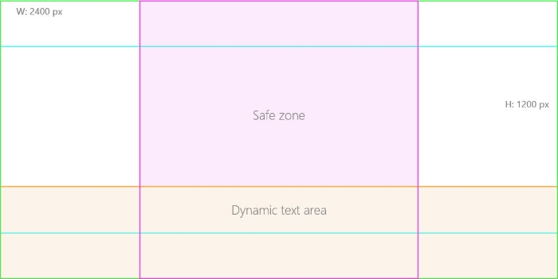
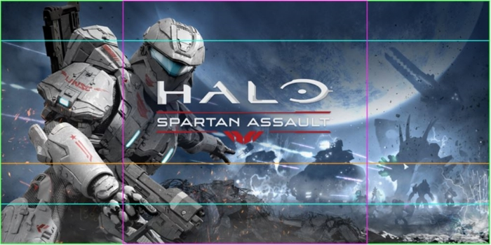

# 앱 스크린샷 및 이미지

앱에 다양한 로고, 스크린샷 및 이미지가 포함되어야 합니다. 일부는 필수이고 일부는 옵션입니다. 이미지는 앱을 나타내는 기본 방식 중 하나입니다. 잘 디자인된 이미지는 앱에 대한 고객의 관심을 끄는 데 큰 도움이 될 수 있습니다.

[앱 제출 프로세스](app-submissions.md) 중에 [스토어 목록](create-app-store-listings.md) 단계에서 [스크린샷](#screenshots) 및 [판촉 아트워크](#promotional-artwork)를 제공합니다. 이들 이미지를 사용하여 스토어에 앱을 표시할 수 있습니다.

또한 스토어에서는 앱의 타일 및 그 밖에 앱 패키지에 포함한 기타 이미지를 사용합니다. [Windows 앱 인증 키트](https://msdn.microsoft.com/library/windows/apps/mt186449)를 실행하여 필수 이미지가 누락되었는지 여부를 확인하세요. 이러한 이미지에 대한 지침과 권장 사항은 [타일 및 아이콘 자산](../controls-and-patterns/tiles-and-notifications-app-assets.md)을 참조하세요.

> **참고**  이미지가 스토어, 고객의 시작 화면 및 앱 자체에서 사용되는 방식은 고객 운영 체제와 기타 요소에 따라 달라집니다.

## 제출 프로세스 중에 제공된 이미지

앱의 스토어 목록 정보를 입력할 때 여러 스크린샷(스크린샷 하나는 필수) 및 판촉 아트워크를 제공할 수 있습니다. 이러한 이미지는 앱 패키지에서 가져오는 것이 아니라 각 언어에 대한 **스토어 목록** 단계에서 제공해야 합니다.

다음 표에는 업로드할 수 있는 다양한 이미지 목록과 그 사용 방법에 관한 설명이 나와 있습니다. 더욱 자세한 내용은 아래 섹션에 나와 있습니다.

| 이미지                                                       | 픽셀 크기                           | 사용                                                                                                                                                                           | 포함할 시기                                                                                                                                            |
|-------------------------------------------------------------|--------------------------------------|---------------------------------------------------------------------------------------------------------------------------------------------------------------------------------|------------------------------------------------------------------------------------------------------------------------------------------------------------|
| [데스크톱 스크린샷](#screenshots)                         | 1366 x 768 이상                 | 데스크톱 장치에서 표시될 때 앱의 스토어 목록에 표시됨                                                                                                          | 특히 앱이 데스크톱 장치용인 경우 모든 앱에 권장됨. 하나 이상의 스크린샷(모든 장치 패밀리 대상) 필요 |
| [모바일 스크린샷](#screenshots)                          | 768 x 1280, 720 x 1280 또는 480 x 800 | 모바일 장치에서 표시될 때 앱의 스토어 목록에 표시됨                                                                                                           | 특히 앱이 모바일 장치용인 경우 모든 앱에 권장됨. 하나 이상의 스크린샷(모든 장치 패밀리에 관한) 필요 |
| [홀로그램 스크린샷](#screenshots)                          | 1268 x 720 이상                 | 홀로그램 장치에서 표시될 때 앱의 스토어 목록에 표시됨                                                                                                           | 앱이 Microsoft HoloLens용인 경우 권장됩니다. 하나 이상의 스크린샷(모든 장치 패밀리에 관한) 필요 |
| [앱 타일 아이콘](#app-tile-icon)                             | 300 x 300                            | Windows Phone 8.1 이하의 경우 스토어에서 앱 아이콘으로 표시됨(Windows 10에서는 스토어에 Windows Phone 8.1 이하를 대상으로 하는 패키지가 있는 경우에만) | 앱이 Windows Phone 8.1 이하를 대상으로 하는 경우 스토어에 적절하게 표시되는 데 필요함                                                                 |
| [홍보용 이미지: Windows 10 추천](#promotional-artwork) | 2400 x 1200                          | Windows 10의 경우 스토어에서 홍보용 레이아웃에 사용됨                                                                                                                        | 특히 Windows 10 고객을 대상으로 하는 UWP 패키지가 있는 앱인 경우 모든 앱에 권장됨                                                               |
| [홍보용 이미지: Windows Phone 8.1 이하](#promotional-artwork) | 1000 x 800, 358 x 358                | Windows Phone 8.1 이하의 경우 스토어에서 홍보용 레이아웃에 사용됨                                                                                                     | Windows Phone 8.1 이하를 대상으로 하는 모든 앱에 권장됨                                                                                           |
| [홍보용 이미지: Windows 8.1 이하](#promotional-artwork)        | 414 x 180                            | Windows 8.1의 경우 스토어에서 홍보용 레이아웃에 사용됨                                                                                                                       | Windows 8.1 이하를 대상으로 하는 모든 앱에 권장됨                                                                                                 |
 

## 스크린샷

스크린샷은 앱의 스토어 목록에서 고객에게 표시되는 앱 이미지입니다.

다양한 장치 패밀리의 스크린샷을 제공할 수 있는 **스토어 목록** 페이지에는 여러 필드가 표시됩니다(고객이 해당 장치 유형에 대해 나열된 앱 스토어 목록을 확인할 때 표시됨).

스크린샷은 제출을 위해 하나만 필요합니다(데스크톱 스크린샷 최대 9개, 모바일 및 홀로그램 스크린샷 최대 8개 등 여러 개를 제공할 수 있음). 장치 패밀리별로 다른 스크린샷을 제공할 필요는 없지만, 고객이 장치에서 앱이 표시되는 대로 이미지를 볼 수 있도록 앱에서 지원하는 모든 장치 패밀리에 대한 스크린샷을 제공하는 것이 좋습니다.

> **참고**  Microsoft Visual Studio는 [스크린샷을 캡처하는 데 유용한 도구](http://go.microsoft.com/fwlink/p/?LinkId=221135)를 제공합니다.

각 스크린샷은 가로 및 세로 방향의 .png 파일이어야 하고 파일 크기는 2MB 이하여야 합니다.

크기 요구 사항은 장치 패밀리에 따라 달라집니다.
- 모바일: 768 x 1280, 720 x 1280 또는 480 x 800픽셀
- 데스크톱: 1366 x 768픽셀 이상
- 홀로그램: 1268 x 720픽셀 이상

각 스크린샷을 설명하는 200자 이내의 짧은 캡션을 제공할 수 있습니다.

> **참고**  [여러 언어](supported-languages.md)에 대한 스토어 목록을 만드는 경우 각각에 대해 **스토어 목록** 페이지가 있어야 합니다. 각 언어에 대한 이미지를 개별적으로 업로드하고(동일한 이미지를 사용하는 경우에도 해당) 각 언어에 사용할 자막을 제공해야 합니다.

## 앱 타일 아이콘

이 아이콘은 모든 제출에 필수는 아니지만, 앱이 Windows Phone 8.1 이하에서 실행되는 경우 사용하는 것이 좋습니다. 앱 타일 아이콘은 Windows Phone 8.1 이하 고객에게 스토어 목록이 표시될 때 사용됩니다. 이 이미지를 제공하지 않은 경우 Windows Phone 8.1 이하 고객에게는 앱 목록과 함께 공백 아이콘이 표시됩니다. 또한 앱에 Windows Phone 8.1 이하를 대상으로 하는 패키지가 있는 경우 Windows 10 고객에게도 앱 목록과 함께 공백 아이콘이 표시됩니다.

제출에 UWP 패키지**만** 포함된 경우 이 이미지를 제공할 필요가 없습니다. 제출에 UWP 패키지를 포함하고 앱 타일 아이콘을 제공하는 경우 앱 타일 아이콘이 일부 스토어 레이아웃에서 Windows 10의 앱 목록과 함께 표시될 수 있습니다. 앱 타일 아이콘이 Windows 10의 고객에게 표시되는 것을 완벽히 방지하려면 이전 OS 버전용 [플랫폼별 목록](create-platform-specific-descriptions.md)을 만들고 여기에만 앱 타일 아이콘을 포함할 수 있습니다.

앱 타일 아이콘은 300 x 300픽셀의 .png 파일이어야 합니다.

## 판촉 아트워크

Windows 스토어 편집 팀은 여러 이미지를 사용하여 스토어에서 앱을 소개합니다. 판촉 아트워크를 제출하면 Windows 스토어 팀에서 홍보용 레이아웃에 앱을 포함하는 것을 고려해 볼 수 있습니다.

> **중요**  앱의 홍보용 이미지를 제공한다고 해서 반드시 앱이 추천되는 것은 아니지만, 제공하지 않으면 홍보 기회 대상으로도 고려되지 않습니다. 자세한 내용은 [앱을 판촉하기 쉽게 만들기](make-your-app-easier-to-promote.md)를 참조하세요.

앱이 대상으로 하는 OS 버전에 따라 다양한 크기의 판촉 아트워크를 제출할 수 있습니다. 이미지 크기와 상관없이 모든 이미지는 .png 형식이어야 합니다.

다음은 판촉 아트워크를 디자인할 때 주의해야 할 몇 가지 팁입니다.

-   앱과 관련한 동적 이미지를 선택하고 인식을 남기고 차별화할 수 있는 방향으로 진행합니다. 상투적인 사진 또는 일반적인 화면 효과를 사용하지 않습니다.
-   브랜딩 외에는 텍스트를 포함하지 않습니다.
-   이미지 내 빈 공간을 최소화합니다.
-   앱의 UI를 표시하지 않고, 장치와 관련된 이미지를 사용하지 않습니다.
-   정치적이거나 특정 국가의 테마, 국기 또는 종교적 기호를 사용하지 않습니다.
-   민감하지 않은 제스처, 노출, 도박, 통화, 마약, 흡연 또는 음주 관련 이미지를 포함하지 않습니다.
-   무기를 사용자를 향하도록 하거나 과도한 폭력과 유혈을 사용하지 않도록 합니다.

### Windows 10의 경우: 2400 x 1200

Windows 10의 경우 스토어에서, 추천 이미지가 앱 및 게임 범주 페이지 맨 위에서 회전하며 콘텐츠를 홍보합니다. 이처럼 앱이 추천 위치에 적합하도록 하려면 2400 x 1200 크기의 이미지를 제출해야 합니다.

이미지를 디자인할 때 해당 이미지를 추천에 사용할 경우 이미지에 마케팅 텍스트를 알아볼 수 있게 표시할 수 있도록 아래쪽 1/3에 그라데이션을 적용해야 합니다. 이 때문에 아래쪽 1/3에 텍스트와 중요한 시각적 요소를 배치하지 않도록 합니다. 또한 이미지가 잘릴 수 있으므로 앱의 브랜딩과 가장 중요한 정보는 가운데에 배치하도록 합니다.

아래 이미지는 주의해야 할 주요 부분을 보여 줍니다. 가운데 "안전 영역"은 이미지가 잘리더라도 또렷하게 표시됩니다. "동적 텍스트 영역"은 텍스트와 그라데이션이 표시될 수 있는 부분입니다.

 아래 예는 이러한 지침에 주의하여 제대로 디자인된 추천 이미지를 보여 줍니다. 이미지 위에 표시된 선은 아트워크가 지정된 영역에 적합한지와 최종 이미지에 포함되지 않는 영역을 보여 주기 위한 것입니다.

### Windows Phone 8.1 이하의 경우: 1000 x 800, 358 x 358

Windows Phone 8.1 이하의 경우 스토어에서, 두 가지 이미지 크기 즉, 1000 x 800픽셀과 358 x 358픽셀을 홍보용 레이아웃에 사용할 수 있습니다. 따라서 앱이 Windows Phone 8.1 이하에서 실행되는 경우 홍보용 이미지로 이러한 두 가지 크기의 이미지를 제공하는 것이 좋습니다.

> **팁**  또한 스토어에서 빈 아이콘으로 표시되지 않게 하려면 300 x 300 [앱 타일 아이콘 이미지](#app-tile-icon)도 제공해야 합니다.

### Windows 8.1 이하의 경우: 414 x 180

Windows 8.1 이하의 경우 스토어에서, 홍보용 레이아웃에 414 x 180픽셀 크기의 이미지를 사용할 수 있습니다. 따라서 앱이 Windows 8.1 이하에서 실행되는 경우 홍보용 이미지로 이 크기의 이미지를 제공하는 것이 좋습니다.

