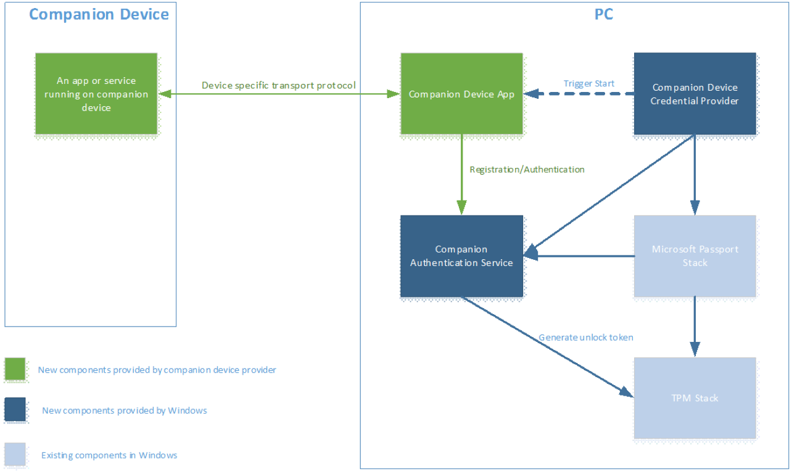
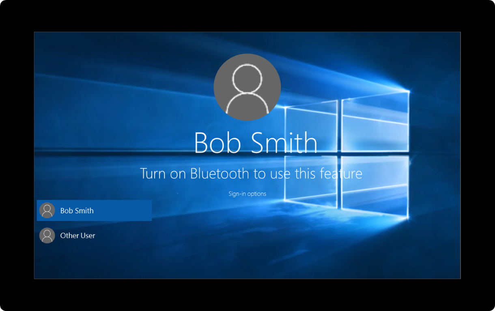

# <a name="windows-unlock-with-windows-hello-companion-iot-devices"></a>Windows Hello 도우미(IoT) 장치에서 Windows 잠금 해제

Windows Hello 도우미 장치는 사용자 인증 환경을 향상하기 위해 Windows 10 데스크톱과 함께 실행할 수 있습니다. Windows Hello 도우미 장치 프레임워크를 사용하면 도우미 장치는 생체 인식을 사용할 수 없는 경우(예: Windows 10 데스크톱에 얼굴 인증용 카메라 또는 지문 판독기를 사용할 수 없는 경우)에도 Windows Hello에 풍부한 환경을 제공할 수 있습니다.

> **참고** Windows Hello 도우미 장치 프레임워크는 일부 앱 개발자는 사용할 수 없는 특수 기능입니다. 이 프레임워크를 사용하려면 Microsoft에서 앱을 구체적으로 프로비전해야 하며 해당 매니페스트에 제한된 *secondaryAuthenticationFactor* 접근 권한 값을 나열해야 합니다. 승인을 얻으려면 [cdfonboard@microsoft.com](mailto:cdfonboard@microsoft.com)으로 문의하세요.

## <a name="introduction"></a>소개

> 동영상 개요는 Channel 9의 빌드 2016에서 [IoT 장치에서 Windows 잠금 해제](https://channel9.msdn.com/Events/Build/2016/P491)(영문) 세션을 참조하세요.

> 코드 샘플은 [Windows Hello 도우미 장치 프레임워크 Github 리포지토리](https://github.com/Microsoft/companion-device-framework)를 참조하세요.

### <a name="use-cases"></a>사용 사례

다양한 방법으로 Windows Hello 도우미 장치 프레임워크를 사용하여 도우미 장치로 멋진 Windows 잠금 해제 환경을 빌드할 수 있습니다. 예를 들어 사용자는 다음과 같은 작업을 수행할 수 있습니다.

- USB를 통해 도우미 장치를 PC에 연결하고, 도우미 장치에서 단추를 터치하고, 자동으로 PC 잠금을 해제합니다.
- Bluetooth를 통해 이미 PC와 페어링되어 있는 휴대폰을 휴대합니다. PC에서 스페이스바를 누르면 휴대폰이 알림을 받습니다. 승인하면 PC 잠금이 해제됩니다.
- NFC 리더에 도우미 장치를 탭하여 PC 잠금을 빠르게 해제합니다.
- 착용자가 이미 인증된 피트니스 밴드를 착용합니다. PC에 근접하고 특정 제스처(예: 박수)를 수행하면 PC 잠금이 해제됩니다.

### <a name="biometric-enabled-windows-hello-companion-devices"></a>생체 인식 지원 Windows Hello 도우미 장치

도우미 장치에서 생체 인식을 지원하는 경우 [Windows 생체 인식 프레임워크](https://msdn.microsoft.com/library/windows/hardware/mt608302(v=vs.85).aspx)가 Windows Hello 도우미 장치 프레임워크보다 더 나은 솔루션일 수 있습니다. [cdfonboard@microsoft.com](mailto:cdfonboard@microsoft.com)으로 문의하시면 올바르게 접근하실 수 있도록 돕겠습니다.

### <a name="components-of-the-solution"></a>솔루션의 구성 요소

아래 다이어그램은 솔루션의 구성 요소 및 빌드 담당자를 보여 줍니다.



Windows Hello 도우미 장치 프레임워크는 Windows에서 실행되는 서비스(이 문서에서는 도우미 인증 서비스라고 함)로 구현됩니다. 이 서비스는 Windows Hello 도우미 장치에 저장된 HMAC 키로 보호되어야 하는 잠금 해제 토큰을 생성해야 합니다. 이 때문에 잠금 해제 토큰에 액세스하려면 Windows Hello 도우미 장치가 있어야 합니다. 각 (PC, Windows 사용자) 튜플마다 고유한 잠금 해제 토큰 하나가 있습니다.

Windows Hello 도우미 장치 프레임워크와 통합하려면 다음 사항이 필요합니다.

- Windows 앱 스토어에서 다운로드한 Windows Hello 도우미 장치용 [UWP(유니버설 Windows 플랫폼)](https://msdn.microsoft.com/windows/uwp/get-started/universal-application-platform-guide) 도우미 장치 앱 
- Windows Hello 도우미 장치에 256비트 HMAC 키 두 개를 만들고 SHA-256을 사용하여 해당 키로 HMAC를 생성하는 기능
- 제대로 구성된 Windows 10 데스크톱의 보안 설정 도우미 인증 서비스를 사용하려면 Windows Hello 도우미 장치를 연결하기 전에 이 PIN을 설정해야 합니다. 사용자는 설정 &gt; 계정 &gt; 로그인 옵션을 통해 PIN을 설정해야 합니다.

위의 요구 사항 외에도 Windows Hello 도우미 장치 앱은 다음을 담당합니다.

- 초기 등록의 사용자 환경 및 브랜딩과 이후 Windows Hello 도우미 장치의 등록 취소
- 백그라운드에서 실행, Windows Hello 도우미 장치 검색, Windows Hello 도우미 장치 및 도우미 인증 서비스에 통신
- 오류 처리

일반적으로 도우미 장치는 피트니스 밴드 초기 설정과 같은 초기 설정용 앱과 함께 제공됩니다. 이 문서에 설명된 기능은 해당 앱에 포함될 수 있으며, 별도의 앱이 필요하지 않도록 해야 합니다.  

### <a name="user-signals"></a>사용자 신호

각 Windows Hello 도우미 장치는 세 가지 사용자 신호를 지원하는 앱과 결합되어야 합니다. 이러한 신호는 동작 또는 제스처의 형태일 수 있습니다.

- **의도 신호**: 사용자가 Windows Hello 도우미 장치의 단추 누르기 등을 통해 잠금 해제 의도를 표시할 수 있습니다. **Windows Hello 도우미 장치** 쪽에서 의도 신호를 수집해야 합니다.
- **사용자 현재 상태 신호**: 사용자의 현재 상태를 증명합니다. 예를 들어 Windows Hello 도우미 장치에서 PC 잠금 해제에 사용하기 전에 PIN을 요구할 수도 있고(PC PIN 아님), 단추 누르기를 요구할 수도 있습니다.
- **명확성 신호**: Windows Hello 도우미 장치에서 여러 옵션을 사용할 수 있는 경우 사용자가 잠금 해제하려는 Windows 10 데스크톱을 식별합니다.

이러한 사용자 신호를 원하는 개수만큼 하나로 결합할 수 있습니다. 사용자 현재 상태 및 의도 신호는 사용할 때마다 필요합니다.

### <a name="registration-and-future-communication-between-a-pc-and-windows-hello-companion-devices"></a>등록 및 PC와 Windows Hello 도우미 장치 간의 이후 통신

Windows Hello 도우미 장치가 Windows Hello 도우미 장치 프레임워크에 연결되려면 먼저 프레임워크에 등록되어야 합니다. 등록 환경은 Windows Hello 도우미 장치 앱이 완전히 소유합니다.

Windows Hello 도우미 장치와 Windows 10 데스크톱 장치 간의 관계는 일대다일 수 있습니다(즉, 한 도우미 장치를 많은 Windows 10 데스크톱 장치에 사용할 수 있음). 그러나 각 Windows Hello 도우미 장치는 각 Windows 10 데스크톱 장치에서 한 사용자에만 사용할 수 있습니다.   

Windows Hello 도우미 장치가 PC와 통신하려면 사용할 전송에 동의해야 합니다. 이러한 선택은 Windows Hello 도우미 장치 앱이 결정하며, Windows Hello 도우미 장치 프레임워크는 Windows Hello 도우미 장치와 Windows 10 데스크톱 장치 쪽의 Windows Hello 도우미 장치 앱 간에 사용되는 프로토콜이나 전송 유형(USB, NFC, WiFi, BT, BLE 등)에 어떠한 제한도 적용하지 않습니다. 그러나 이 문서의 "보안 요구 사항" 섹션에 설명된 대로 전송 계층에 대한 특정 보안 고려 사항을 제안합니다. 이러한 요구 사항을 제공하는 것은 장치 공급자의 책임입니다. 프레임워크는 제공하지 않습니다.


## <a name="user-interaction-model"></a>사용자 조작 모델

### <a name="windows-hello-companion-device-app-discovery-installation-and-first-time-registration"></a>Windows Hello 도우미 장치 앱 검색, 설치 및 최초 등록

일반적인 사용자 워크플로는 다음과 같습니다.

- 사용자가 해당 Windows Hello 도우미 장치로 잠금을 해제하려는 각 대상 Windows 10 데스크톱 장치에서 PIN을 설정합니다.
- 사용자가 Windows 10 데스크톱 장치에서 Windows Hello 도우미 장치 앱을 실행하여 Windows 10 데스크톱에 Windows Hello 도우미 장치를 등록합니다.

참고:

- Windows Hello 도우미 장치 앱의 검색, 다운로드 및 시작을 간소화하고, 가능하면 자동화하는 것이 좋습니다(예: Windows 10 데스크톱 장치 쪽에서 NFC 리더에 Windows Hello 도우미 장치 앱을 탭하면 앱을 다운로드할 수 있음). 그러나 이는 Windows Hello 도우미 장치와 Windows Hello 도우미 장치 앱의 책임입니다.
- 엔터프라이즈 환경에서는 MDM을 통해 Windows Hello 도우미 장치 앱을 배포할 수 있습니다.
- Windows Hello 도우미 장치 앱은 등록의 일부로 발생하는 모든 오류 메시지를 사용자에게 표시합니다.

### <a name="registration-and-de-registration-protocol"></a>등록 및 등록 취소 프로토콜

다음 다이어그램은 등록하는 동안 Windows Hello 도우미 장치가 도우미 인증 서비스와 상호 작용하는 방식을 보여 줍니다.  


프로토콜에서 사용되는 두 개의 키가 있습니다.

- 장치 키(**devicekey**): PC에서 Windows 잠금을 해제하는 데 필요한 잠금 해제 토큰을 보호하는 데 사용됩니다.
- 인증 키(**authkey**): Windows Hello 도우미 장치와 도우미 인증 서비스를 상호 인증하는 데 사용됩니다.

장치 키와 인증 키는 등록 시 Windows Hello 도우미 장치 앱과 Windows Hello 도우미 장치 간에 교환됩니다. 따라서 Windows Hello 도우미 장치 앱과 Windows Hello 도우미 장치는 보안 전송을 사용하여 키를 보호해야 합니다.

또한 위의 다이어그램에는 Windows Hello 도우미 장치에서 두 개의 HMAC 키가 생성되는 것으로 표시되지만 앱이 키를 생성하여 저장을 위해 Windows Hello 도우미 장치로 보낼 수도 있습니다.

### <a name="starting-authentication-flows"></a>인증 흐름 시작

사용자가 Windows Hello 도우미 장치 프레임워크를 사용하여 Windows 10 데스크톱에 대한 로그인 흐름을 시작하는 방법에는 다음 두 가지가 있습니다(즉, 의도 신호 제공).

- 노트북의 덮개를 열거나, PC에서 스페이스바를 누르거나 살짝 위로 밉니다.
- Windows Hello 도우미 장치 쪽에서 제스처 또는 작업을 수행합니다.

시작점을 선택하는 것은 Windows Hello 도우미 장치의 선택입니다. Windows Hello 도우미 장치 프레임워크는 옵션 1이 발생할 때 도우미 장치 앱에 알립니다. 옵션 2의 경우 Windows Hello 도우미 장치 앱이 도우미 장치를 쿼리하여 해당 이벤트가 캡처되었는지 확인해야 합니다. 이렇게 하면 잠금 해제가 성공하기 전에 Windows Hello 도우미 장치가 의도 신호를 수집할 수 있습니다.

### <a name="windows-hello-companion-device-credential-provider"></a>Windows Hello 도우미 장치 자격 증명 공급자

Windows 10에는 모든 Windows Hello 도우미 장치를 처리하는 새 자격 증명 공급자가 있습니다.

Windows Hello 도우미 장치 자격 증명 공급자는 트리거 활성화를 통해 도우미 장치 백그라운드 작업을 시작해야 합니다. 트리거는 PC가 절전 모드에서 해제되고 잠금 화면이 표시될 때 처음 설정됩니다. 두 번째는 PC가 로그온 UI로 전환되고 Windows Hello 도우미 장치 자격 증명 공급자가 선택한 타일인 경우입니다.

Windows Hello 도우미 장치 앱의 도우미 라이브러리는 잠금 화면 상태 변경을 수신 대기하고 Windows Hello 도우미 장치 백그라운드 작업에 해당하는 이벤트를 보냅니다.

여러 Windows Hello 도우미 장치 백그라운드 작업이 있는 경우 인증 프로세스를 완료한 첫 번째 백그라운드 작업이 PC의 잠금을 해제합니다. 도우미 장치 인증 서비스는 나머지 인증 호출을 무시합니다.

Windows Hello 도우미 장치 쪽 환경은 Windows Hello 도우미 장치 앱이 소유하고 관리합니다. Windows Hello 도우미 장치 프레임워크는 사용자 환경의 이 부분을 제어할 수 없습니다. 보다 구체적으로, 도우미 인증 공급자는 해당 백그라운드 앱을 통해 Windows Hello 도우미 장치 앱에 로그온 UI의 상태 변경(예: 잠금 화면이 방금 해제됨 또는 사용자가 스페이스바를 눌러 잠금 화면을 방금 해제함)을 알리며, 이를 중심으로 환경을 작성하는 것은 Windows Hello 도우미 장치 앱의 책임입니다(예: 사용자가 스페이스바를 눌러 잠금 화면을 해제하면 USB를 통해 장치를 찾기 시작함).

Windows Hello 도우미 장치 프레임워크는 Windows Hello 도우미 장치 앱이 선택할 수 있는 (지역화된) 텍스트 및 오류 메시지를 제공합니다. 이러한 텍스트는 잠금 화면 위나 로그온 UI에 표시됩니다. 자세한 내용은 메시지 및 오류 처리 섹션을 참조하세요.

### <a name="authentication-protocol"></a>인증 프로토콜

Windows Hello 도우미 장치 앱과 관련된 백그라운드 작업이 트리거로 시작되면 Windows Hello 도우미 장치에 도우미 인증 서비스에서 계산된 HMAC 값의 유효성을 검사하고 다음 두 개의 HMAC 값 계산을 지원하도록 요청해야 합니다.
- 서비스 HMAC 유효성 검사 = HMAC(인증 키, 서비스 nonce || 장치 nonce || 세션 nonce)
- nonce가 있는 장치 키의 HMAC 계산
- 첫 번째 HMAC 값이 도우미 인증 서비스에서 생성된 nonce와 연결된 인증 키의 HMAC 계산

두 번째 계산된 값은 서비스에서 장치를 인증하고 전송 채널의 재생 공격을 방지하는 데 사용됩니다.


## <a name="lifecycle-management"></a>수명 주기 관리

### <a name="register-once-use-everywhere"></a>한 번 등록, 어디서나 사용

백 엔드 서버가 없으면 사용자가 각 Windows 10 데스크톱 장치에 Windows Hello 도우미 장치를 개별적으로 등록해야 합니다.

도우미 장치 공급업체 또는 OEM은 사용자 Windows 10 데스크톱 또는 모바일 장치에 등록 상태를 로밍할 웹 서비스를 구현할 수 있습니다. 자세한 내용은 서비스 로밍, 해지 및 필터링 섹션을 참조하세요.

### <a name="pin-management"></a>PIN 관리

도우미 장치를 사용하려면 먼저 Windows 10 데스크톱 장치에서 PIN을 설정해야 합니다. 이렇게 하면 해당 Windows Hello 도우미 장치가 작동하지 않을 경우 사용자가 백업을 사용할 수 있습니다. PIN은 Windows에서 관리하며 해당 앱에 표시되지 않습니다. 사용자가 변경하려면 설정 &gt; 계정 &gt; 로그인 옵션으로 이동합니다.

### <a name="management-and-policy"></a>관리 및 정책

사용자는 해당 데스크톱 장치에서 Windows Hello 도우미 장치 앱을 실행하여 Windows 10 데스크톱에서 Windows Hello 도우미 장치를 제거할 수 있습니다.

엔터프라이즈는 다음 두 가지 옵션으로 Windows Hello 도우미 장치 프레임워크를 제어할 수 있습니다.

- 기능 켜기 또는 끄기
- Windows AppLocker를 사용하여 허용되는 Windows Hello 도우미 장치의 허용 목록 정의

Windows Hello 도우미 장치 프레임워크는 사용할 수 있는 Windows Hello 도우미 장치의 인벤토리를 유지하는 중앙 집중식 방법이나 허용되는 Windows Hello 도우미 장치 유형 인스턴스를 추가로 필터링하는 방법(예: 일련 번호가 X와 Y 사이에 있는 도우미 장치만 허용됨)을 지원하지 않습니다. 그러나 앱 개발자가 이러한 기능을 제공하는 서비스를 빌드할 수 있습니다. 자세한 내용은 서비스 로밍, 해지 및 필터링 섹션을 참조하세요.

### <a name="revocation"></a>해지

Windows Hello 도우미 장치 프레임워크는 특정 Windows 10 데스크톱 장치에서 도우미 장치의 원격 제거를 지원하지 않습니다. 대신 사용자는 Windows 10 데스크톱에서 실행되는 Windows Hello 도우미 장치 앱을 통해 Windows Hello 도우미 장치를 제거할 수 있습니다.

그러나 도우미 장치 공급업체가 원격 해지 기능을 제공하는 서비스를 빌드할 수 있습니다. 자세한 내용은 서비스 로밍, 해지 및 필터링 섹션을 참조하세요.

### <a name="roaming-and-filter-services"></a>서비스 로밍 및 필터링

도우미 장치 공급업체는 다음과 같은 시나리오에 사용할 수 있는 웹 서비스를 구현할 수 있습니다.

- 엔터프라이즈용 필터 서비스: 엔터프라이즈는 해당 환경에서 작동할 수 있는 Windows Hello 도우미 장치 집합을 특정 공급업체의 몇몇 장치로만 제한할 수 있습니다. 예를 들어 Contoso 회사는 공급업체 X로부터 모델 Y를 10,000개 주문한 다음 해당 장치만 Contoso 도메인에서 작동하고 공급업체 X의 다른 장치 모델은 작동하지 않도록 할 수 있습니다.
- 인벤토리: 엔터프라이즈는 엔터프라이즈 환경에서 사용되는 기존 도우미 장치 목록을 확인할 수 있습니다.
- 실시간 해지: 직원이 장치를 분실했거나 도난당했다고 보고할 경우 웹 서비스를 사용하여 해당 장치를 해지할 수 있습니다.
- 로밍: 사용자가 도우미 장치를 한 번만 등록하면 모든 Windows 10 데스크톱 및 모바일에서 작동합니다.

이러한 기능을 구현하려면 Windows Hello 도우미 장치 앱이 등록 및 사용 시 웹 서비스에 확인해야 합니다. Windows Hello 도우미 장치 앱은 하루에 한 번만 웹 서비스 확인을 요구하는 등 캐시된 로그온 시나리오에 최적화될 수 있습니다(이 경우 해지 시간이 최대 1일까지 연장됨).  

## <a name="windows-hello-companion-device-framework-api-model"></a>Windows Hello 도우미 장치 프레임워크 API 모델

### <a name="overview"></a>개요

Windows Hello 도우미 장치 앱에는 두 가지 구성 요소가 있어야 합니다. 하나는 장치 등록 및 등록 취소를 위한 UI가 있는 포그라운드 앱이고, 다른 하나는 인증을 처리하는 백그라운드 작업입니다.

전체 API 흐름은 다음과 같습니다.

1. Windows Hello 도우미 장치 등록
    * 장치가 근처에 있고 해당 접근 권한 값을 쿼리하는지(필요한 경우) 확인
    * 두 개의 HMAC 키 생성(도우미 장치 쪽 또는 앱 쪽)
    * RequestStartRegisteringDeviceAsync 호출
    * FinishRegisteringDeviceAsync 호출
    * Windows Hello 도우미 장치 앱이 HMAC 키를 저장하고(지원되는 경우) Windows Hello 도우미 장치 앱이 복사본을 삭제하는지 확인
2. 백그라운드 작업 등록
3. 백그라운드 작업에서 올바른 이벤트 대기
    * WaitingForUserConfirmation: 인증 흐름을 시작하는 데 Windows Hello 도우미 장치 쪽 사용자 작업/제스처가 필요한 경우 이 이벤트 대기
    * CollectingCredential: Windows Hello 도우미 장치가 PC 쪽 사용자 작업/제스처(예: 스페이스바 누르기)를 사용하여 인증 흐름을 시작하는 경우 이 이벤트 대기
    * 스마트 카드와 같은 기타 트리거: 올바른 API를 호출하기 위해 현재 인증 상태를 쿼리해야 합니다.
4. ShowNotificationMessageAsync를 호출하여 사용자에게 오류 메시지 또는 필요한 다음 단계에 대해 알립니다. 의도 신호가 수집된 후에만 이 API를 호출합니다.
5. 잠금 해제
    * 의도 및 사용자 현재 상태 신호가 수집되었는지 확인
    * StartAuthenticationAsync 호출
    * 도우미 장치와 통신하여 필요한 HMAC 작업 수행
    * FinishAuthenticationAsync 호출
6. 사용자가 요청할 경우(예: 도우미 장치를 분실한 경우) Windows Hello 도우미 장치 등록 취소
    * FindAllRegisteredDeviceInfoAsync를 통해 로그인한 사용자에 대한 Windows Hello 도우미 장치 열거
    * UnregisterDeviceAsync를 사용하여 등록 취소

### <a name="registration-and-de-registration"></a>등록 및 등록 취소

등록하려면 도우미 인증 서비스에 대한 두 개의 API 호출, RequestStartRegisteringDeviceAsync 및 FinishRegisteringDeviceAsync가 필요합니다.

이러한 호출을 수행하기 전에 Windows Hello 도우미 장치 앱은 Windows Hello 도우미 장치를 사용할 수 있는지 확인해야 합니다. Windows Hello 도우미 장치가 HMAC 키(인증 및 장치 키)를 생성하는 경우 Windows Hello 도우미 장치 앱은 위의 두 호출을 수행하기 전에 도우미 장치에 키를 생성하도록 요청해야 합니다. Windows Hello 도우미 장치 앱이 HMAC 키를 생성하는 경우 위의 두 호출을 수행하기 전에 생성해야 합니다.

또한 첫 번째 API 호출(RequestStartRegisteringDeviceAsync)의 일부로 Windows Hello 도우미 장치 앱은 장치 접근 권한 값을 결정하고 API 호출의 일부로 전달할 준비를 해야 합니다(예: Windows Hello 도우미 장치가 HMAC 키에 대해 보안 저장소를 지원하는지 여부). 동일한 Windows Hello 도우미 장치 앱을 사용하여 동일한 도우미 장치의 여러 버전을 관리하며 해당 접근 권한 값이 변경되어 결정하는 데 장치 쿼리가 필요한 경우 첫 번째 API 호출 전에 이 쿼리를 수행하는 것이 좋습니다.   

첫 번째 API(RequestStartRegisteringDeviceAsync)는 두 번째 API(FinishRegisteringDeviceAsync)에서 사용되는 핸들을 반환합니다. 첫 번째 등록 호출은 PIN 프롬프트를 시작하여 사용자가 있는지 확인합니다. PIN이 설정되지 않은 경우에는 이 호출이 실패합니다. Windows Hello 도우미 장치 앱은 KeyCredentialManager.IsSupportedAsync 호출을 통해 PIN의 설정 여부를 쿼리할 수도 있습니다. 정책에서 Windows Hello 도우미 장치를 사용하지 않도록 설정한 경우 RequestStartRegisteringDeviceAsync 호출도 실패할 수 있습니다.

첫 번째 호출의 결과는 SecondaryAuthenticationFactorRegistrationStatus 열거형을 통해 반환됩니다.

```C#
{
    Failed = 0,         // Something went wrong in the underlying components
    Started,            // First call succeeded
    CanceledByUser,     // User cancelled PIN prompt
    PinSetupRequired,   // PIN is not set up
    DisabledByPolicy,   // Companion device framework or this app is disabled
}
```

두 번째 호출(FinishRegisteringDeviceAsync)에서 등록을 완료합니다. 등록 프로세스의 일부로, Windows Hello 도우미 장치 앱은 도우미 장치 구성 데이터를 도우미 인증 서비스에 저장할 수 있습니다. 이 데이터에는 4K 크기 제한이 있습니다. 이 데이터는 인증 시 Windows Hello 도우미 장치 앱에 제공됩니다. 예를 들어 이 데이터를 사용하여 Windows Hello 도우미 장치에 연결하거나(예: MAC 주소), Windows Hello 도우미 장치에 저장소가 없고 도우미 장치가 저장을 위해 PC를 사용하려는 경우 구성 데이터를 사용할 수 있습니다. 구성 데이터의 일부로 저장된 모든 중요한 데이터는 Windows Hello 도우미 장치만 알고 있는 키로 암호화해야 합니다. 또한 Windows 서비스에서 구성 데이터를 저장하는 경우 Windows Hello 도우미 장치 앱이 사용자 프로필 간에 사용할 수 있습니다.

Windows Hello 도우미 장치 앱은 AbortRegisteringDeviceAsync를 호출하여 등록을 취소하고 오류 코드를 전달할 수 있습니다. 도우미 인증 서비스는 원격 분석 데이터에 오류를 기록합니다. 이 호출의 좋은 예는 Windows Hello 도우미 장치에서 문제가 발생하여 등록을 완료할 수 없는 경우입니다(예: HMAC 키를 저장할 수 없거나 BT 연결이 끊어진 경우).

Windows Hello 도우미 장치 앱은 Windows 10 데스크톱에서 Windows Hello 도우미 장치 등록을 취소하는 옵션을 사용자에게 제공해야 합니다(예: 도우미 장치를 분실했거나 최신 버전을 구입한 경우). 사용자가 해당 옵션을 선택할 경우 Windows Hello 도우미 장치 앱은 UnregisterDeviceAsync를 호출해야 합니다. Windows Hello 도우미 장치 앱의 이 호출은 도우미 장치 인증 서비스에서 특정 장치 ID 및 호출자 앱의 AppId에 해당하는 모든 데이터(HMAC 키 포함)를 PC 쪽에서 삭제하도록 트리거합니다. 이 API 호출은 Windows Hello 도우미 장치 앱 또는 도우미 장치 쪽에서 HMAC 키를 삭제하지 않습니다. 해당 작업은 Windows Hello 도우미 장치 앱이 구현해야 합니다.

Windows Hello 도우미 장치 앱은 등록 및 등록 취소 단계에서 발생하는 오류 메시지를 표시해야 합니다.

```C#
using System;
using Windows.Security.Authentication.Identity.Provider;
using Windows.Storage.Streams;
using Windows.Security.Cryptography;
using Windows.UI.Popups;

namespace SecondaryAuthFactorSample
{
    public class DeviceRegistration
    {

        public void async OnRegisterButtonClick()
        {
            //
            // Pseudo function, the deviceId should be retrieved by the application from the device
            //
            string deviceId = await ReadSerialNumberFromDevice();

            IBuffer deviceKey = CryptographicBuffer.GenerateRandom(256/8);
            IBuffer mutualAuthenticationKey = CryptographicBuffer.GenerateRandom(256/8);

            SecondaryAuthenticationFactorRegistration registrationResult =
                await SecondaryAuthenticationFactorRegistration.RequestStartRegisteringDeviceAsync(
                    deviceId,  // deviceId: max 40 wide characters. For example, serial number of the device
                    SecondaryAuthenticationFactorDeviceCapabilities.SecureStorage |
                        SecondaryAuthenticationFactorDeviceCapabilities.HMacSha256 |
                        SecondaryAuthenticationFactorDeviceCapabilities.StoreKeys,
                    "My test device 1", // deviceFriendlyName: max 64 wide characters. For example: John's card
                    "SAMPLE-001", // deviceModelNumber: max 32 wide characters. The app should read the model number from device.
                    deviceKey,
                    mutualAuthenticationKey);

            switch(registerResult.Status)
            {
            case SecondaryAuthenticationFactorRegistrationStatus.Started:
                //
                // Pseudo function:
                // The app needs to retrieve the value from device and set into opaqueBlob
                //
                IBuffer deviceConfigData = ReadConfigurationDataFromDevice();

                if (deviceConfigData != null)
                {
                    await registrationResult.Registration.FinishRegisteringDeviceAsync(deviceConfigData); //config data limited to 4096 bytes
                    MessageDialog dialog = new MessageDialog("The device is registered correctly.");
                    await dialog.ShowAsync();
                }
                else
                {
                    await registrationResult.Registration.AbortRegisteringDeviceAsync("Failed to connect to the device");
                    MessageDialog dialog = new MessageDialog("Failed to connect to the device.");
                    await dialog.ShowAsync();
                }
                break;

            case SecondaryAuthenticationFactorRegistrationStatus.CanceledByUser:
                MessageDialog dialog = new MessageDialog("You didn't enter your PIN.");
                await dialog.ShowAsync();
                break;

            case SecondaryAuthenticationFactorRegistrationStatus.PinSetupRequired:
                MessageDialog dialog = new MessageDialog("Please setup PIN in settings.");
                await dialog.ShowAsync();
                break;

            case SecondaryAuthenticationFactorRegistrationStatus.DisabledByPolicy:
                MessageDialog dialog = new MessageDialog("Your enterprise prevents using this device to sign in.");
                await dialog.ShowAsync();
                break;
            }
        }

        public void async UpdateDeviceList()
        {
            IReadOnlyList<SecondaryAuthenticationFactorInfo> deviceInfoList =
                await SecondaryAuthenticationFactorRegistration.FindAllRegisteredDeviceInfoAsync(
                    SecondaryAuthenticationFactorDeviceFindScope.User);

            if (deviceInfoList.Count > 0)
            {
                foreach (SecondaryAuthenticationFactorInfo deviceInfo in deviceInfoList)
                {
                    //
                    // Add deviceInfo.FriendlyName and deviceInfo.DeviceId into a combo box
                    //
                }
            }
        }

        public void async OnUnregisterButtonClick()
        {
            string deviceId;
            //
            // Read the deviceId from the selected item in the combo box
            //
            await SecondaryAuthenticationFactorRegistration.UnregisterDeviceAsync(deviceId);
        }
    }
}
```

### <a name="authentication"></a>인증

인증하려면 도우미 인증 서비스에 대한 두 개의 API 호출, StartAuthenticationAsync 및 FinishAuthencationAsync가 필요합니다.

첫 번째 시작 API는 두 번째 API에서 사용되는 핸들을 반환합니다.  특히, 첫 번째 호출은 다른 항목과 연결된 경우 Windows Hello 도우미 장치에 저장된 장치 키와 HMAC되어야 하는 nonce를 반환합니다. 두 번째 호출은 장치 키와 HMAC된 결과를 반환하며 성공적인 인증으로 끝날 수 있습니다(즉, 사용자에게 해당 데스크톱이 표시됨).

정책에서 초기 등록 후 해당 Windows Hello 도우미 장치를 사용하지 않도록 설정한 경우 첫 번째 시작 API(StartAuthenticationAsync)가 실패할 수 있습니다. WaitingForUserConfirmation 또는 CollectingCredential 상태 외부에서 API 호출을 수행한 경우에도 실패할 수 있습니다(이 섹션의 뒷부분에서 자세히 설명). 등록되지 않은 도우미 장치 앱이 호출하는 경우에도 실패할 수 있습니다. SecondaryAuthenticationFactorAuthenticationStatus 열거형은 가능한 결과를 요약합니다.

```C#
{
    Failed = 0,                     // Something went wrong in the underlying components
    Started,
    UnknownDevice,                  // Companion device app is not registered with framework
    DisabledByPolicy,               // Policy disabled this device after registration
    InvalidAuthenticationStage,     // Companion device framework is not currently accepting
                                    // incoming authentication requests
}
```

첫 번째 호출에서 제공한 nonce가 만료되면(20초) 두 번째 API 호출(FinishAuthencationAsync)이 실패할 수 있습니다. SecondaryAuthenticationFactorFinishAuthenticationStatus 열거형은 가능한 결과를 캡처합니다.

```C#
{
    Failed = 0,     // Something went wrong in the underlying components
    Completed,      // Success
    NonceExpired,   // Nonce is expired
}
```

두 API 호출(StartAuthenticationAsync 및 FinishAuthencationAsync)의 타이밍은 Windows Hello 도우미 장치가 의도, 사용자 현재 상태 및 명확성 신호를 수집하는 방법과 맞아야 합니다(자세한 내용은 사용자 신호 참조). 예를 들어 의도 신호를 사용할 수 있을 때까지 두 번째 호출이 제출되지 않아야 합니다. 즉, 사용자가 해당 의도를 표시하지 않은 경우 PC 잠금이 해제되면 안 됩니다. 보다 명확한 설명을 위해, Bluetooth 근접 연결이 PC 잠금 해제에 사용된다고 가정하면 명시적 의도 신호를 수집해야 합니다. 그렇지 않으면 사용자가 주방에 가는 도중 PC 옆을 지나갈 때 PC 잠금이 해제됩니다. 또한 첫 번째 호출에서 반환된 nonce는 시간이 제한되며(20초) 일정 기간 후에 만료됩니다. 따라서 첫 번째 호출은 Windows Hello 도우미 장치 앱이 도우미 장치 현재 상태를 잘 나타내는 경우에만 수행해야 합니다(예: 도우미 장치가 USB 포트에 삽입되거나 NFC 리더에 탭된 경우). Bluetooth를 사용하는 경우 PC 쪽 배터리에 영향을 주지 않거나 Windows Hello 도우미 장치 현재 상태를 확인할 때 해당 시점에서 진행 중인 다른 Bluetooth 활동에 영향을 주지 않도록 주의해야 합니다. 또한 사용자 현재 상태 신호를 제공해야 하는 경우(예: PIN 입력) 해당 신호가 수집된 후에만 첫 번째 인증 호출을 수행하는 것이 좋습니다.

Windows Hello 도우미 장치 프레임워크는 인증 흐름에서 현재 사용자 위치에 대한 전체 그림을 제공하여 Windows Hello 도우미 장치 앱이 위의 두 호출을 수행할 시기를 합리적으로 결정할 수 있도록 도와줍니다. Windows Hello 도우미 장치 프레임워크는 앱 백그라운드 작업에 잠금 상태 변경 알림을 제공하여 이 기능을 제공합니다.


이러한 각 상태의 세부 정보는 다음과 같습니다.

| 상태                         | 설명                                                                                                                                                                                                                                                                                                                                                                                                                                                                                                                                                                                                                                                                                                                                                                                                                                                                                                               |
|----------------------------   |-----------------------------------------------------------------------------------------------------------------------------------------------------------------------------------------------------------------------------------------------------------------------------------------------------------------------------------------------------------------------------------------------------------------------------------------------------------------------------------------------------------------------------------------------------------------------------------------------------------------------------------------------------------------------------------------------------------------------------------------------------------------------------------------------------------------------------------------------------------------------------------------------------------------------    |
| WaitingForUserConfirmation    | 이 상태 변경 알림 이벤트는 잠금 화면이 해제된 경우(예: 사용자가 Windows+L을 누른 경우)에 발생합니다. 이 상태의 장치를 찾는 문제와 관련된 오류 메시지는 요청하지 않는 것이 좋습니다. 일반적으로 의도 신호를 사용할 수 있는 경우에만 메시지를 표시하는 것이 좋습니다. Windows Hello 도우미 장치 앱은 도우미 장치에서 의도 신호(예: NFC 리더에 탭하기, 도우미 장치에서 단추 누르기 또는 박수와 같은 특정 제스처)를 수집하고 도우미 장치 앱 백그라운드 작업이 Windows Hello 도우미 장치에서 의도 신호가 검색되었다는 표시를 받은 경우에 이 상태의 인증에 대한 첫 번째 API 호출을 해야 합니다. 그렇지 않고 Windows Hello 도우미 장치 앱이 PC를 사용하여 인증 흐름을 시작하는 경우(사용자가 잠금 화면을 위로 살짝 밀거나 스페이스바를 누름) Windows Hello 도우미 장치 앱은 다음 상태(CollectingCredential)까지 대기해야 합니다.     |
| CollectingCredential          | 이 상태 변경 알림 이벤트는 사용자가 노트북 덮개를 열거나, 키보드에서 아무 키나 누르거나, 잠금 화면을 위로 살짝 미는 경우에 발생합니다. Windows Hello 도우미 장치가 위의 작업을 사용하여 의도 신호 수집을 시작하는 경우 Windows Hello 도우미 장치 앱이 수집을 시작해야 합니다(예: 사용자가 PC의 잠금을 해제하려는지 여부를 묻는 팝업을 도우미 장치에 표시). Windows Hello 도우미 장치 앱에서 사용자가 Windows Hello 도우미 장치에 사용자 현재 상태를 제공하도록 요구하는 경우 이때 오류 사례를 제공하는 것이 좋습니다.                                                                                                                                                                                                                                                                                                                                            |
| SuspendingAuthentication      | Windows Hello 도우미 장치 앱이 이 상태를 받을 경우 도우미 인증 서비스에서 인증 요청 수락을 중지했음을 의미합니다.                                                                                                                                                                                                                                                                                                                                                                                                                                                                                                                                                                                                                                                                                                                                                                            |
| CredentialCollected           | 이는 다른 Windows Hello 도우미 장치 앱이 두 번째 API를 호출했으며 해당 도우미 인증 서비스에서 제출된 내용을 검증 중임을 의미합니다. 이때 도우미 인증 서비스는 현재 제출된 요청이 검증에 성공하지 못할 경우 다른 인증 요청을 수락하지 않습니다. 다음 상태에 도달할 때까지 Windows Hello 도우미 장치 앱을 계속 확인해야 합니다.                                                                                                                                                                                                                                                                                                                                                                                                                                                                                                                                   |
| CredentialAuthenticated       | 제출한 자격 증명이 제대로 작동했음을 의미합니다. credentialAuthenticated에는 성공한 Windows Hello 도우미 장치의 장치 ID가 있습니다. Windows Hello 도우미 장치 앱은 관련 장치가 성공했는지 확인해야 합니다. 실패한 경우 Windows Hello 도우미 장치 앱은 사후 인증 흐름(예: 도우미 장치의 성공 메시지 또는 해당 장치의 진동)이 표시되지 않도록 해야 합니다. 제출한 자격 증명이 제대로 작동하지 않은 경우 상태가 CollectingCredential 상태로 변경됩니다.                                                                                                                                                                                                                                                                                                                                                                                       |
| StoppingAuthentication        | 인증에 성공했으며 사용자에게 데스크톱이 표시되었습니다. 백그라운드 작업 중단 시간. 백그라운드 작업을 종료하기 전에 StageEvent 처리기를 명시적으로 등록 취소합니다. 이렇게 하면 백그라운드 작업을 빠르게 종료하는 데 도움이 됩니다.                                                                                                                                                                                                                                                                                                                                                                                                                                                                                                                                                                                                                                                                                                                                                                                                                                       |


Windows Hello 도우미 장치 앱은 처음 두 상태의 두 인증 API만 호출해야 합니다. Windows Hello 도우미 장치 앱은 이 이벤트가 발생하는 시나리오를 확인해야 합니다. 잠금 해제 또는 사후 잠금 해제의 두 가지 가능성이 있습니다. 현재는 잠금 해제만 지원됩니다. 이후 릴리스에서는 사후 잠금 해제 시나리오도 지원될 수 있습니다. SecondaryAuthenticationFactorAuthenticationScenario 열거형은 다음 두 가지 옵션을 캡처합니다.

```C#
{
    SignIn = 0,         // Running under lock screen mode
    CredentialPrompt,   // Running post unlock
}
```

전체 코드 샘플:

```C#
using System;
using Windows.Security.Authentication.Identity.Provider;
using Windows.Storage.Streams;
using Windows.Security.Cryptography;
using System.Threading;
using Windows.ApplicationModel.Background;

namespace SecondaryAuthFactorSample
{
    public sealed class AuthenticationTask : IBackgroundTask
    {
        private string _deviceId;
        private static AutoResetEvent _exitTaskEvent = new AutoResetEvent(false);
        private static IBackgroundTaskInstance _taskInstance;
        private BackgroundTaskDeferral _deferral;

        private void Authenticate()
        {
            int retryCount = 0;

            while (retryCount < 3)
            {
                //
                // Pseudo code, the svcAuthNonce should be passed to device or generated from device
                //
                IBuffer svcAuthNonce = CryptographicBuffer.GenerateRandom(256/8);

                SecondaryAuthenticationFactorAuthenticationResult authResult = await
                    SecondaryAuthenticationFactorAuthentication.StartAuthenticationAsync(
                        _deviceId,
                        svcAuthNonce);
                if (authResult.Status != SecondaryAuthenticationFactorAuthenticationStatus.Started)
                {
                    SecondaryAuthenticationFactorAuthenticationMessage message;
                    switch (authResult.Status)
                    {
                        case SecondaryAuthenticationFactorAuthenticationStatus.DisabledByPolicy:
                            message = SecondaryAuthenticationFactorAuthenticationMessage.DisabledByPolicy;
                            break;
                        case SecondaryAuthenticationFactorAuthenticationStatus.InvalidAuthenticationStage:
                            // The task might need to wait for a SecondaryAuthenticationFactorAuthenticationStageChangedEvent
                            break;
                        default:
                            return;
                    }

                    // Show error message. Limited to 512 characters wide
                    await SecondaryAuthenticationFactorAuthentication.ShowNotificationMessageAsync(null, message);
                    return;
                }

                //
                // Pseudo function:
                // The device calculates and returns sessionHmac and deviceHmac
                //
                await GetHmacsFromDevice(
                    authResult.Authentication.ServiceAuthenticationHmac,
                    authResult.Authentication.DeviceNonce,
                    authResult.Authentication.SessionNonce,
                    out deviceHmac,
                    out sessionHmac);
                if (sessionHmac == null ||
                    deviceHmac == null)
                {
                    await authResult.Authentication.AbortAuthenticationAsync(
                        "Failed to read data from device");
                    return;
                }

                SecondaryAuthenticationFactorFinishAuthenticationStatus status =
                    await authResult.Authentication.FinishAuthencationAsync(deviceHmac, sessionHmac);
                if (status == SecondaryAuthenticationFactorFinishAuthenticationStatus.NonceExpired)
                {
                    retryCount++;
                    continue;
                }
                else if (status == SecondaryAuthenticationFactorFinishAuthenticationStatus.Completed)
                {
                    // The credential data is collected and ready for unlock
                    return;
                }
            }
        }

        public void OnAuthenticationStageChanged(
            object sender,
            SecondaryAuthenticationFactorAuthenticationStageChangedEventArgs args)
        {
            // The application should check the args.StageInfo.Stage to determine what to do in next. Note that args.StageInfo.Scenario will have the scenario information (SignIn vs CredentialPrompt).

            switch(args.StageInfo.Stage)
            {
            case SecondaryAuthenticationFactorAuthenticationStage.WaitingForUserConfirmation:
                // Show welcome message
                await SecondaryAuthenticationFactorAuthentication.ShowNotificationMessageAsync(
                    null,
                    SecondaryAuthenticationFactorAuthenticationMessage.WelcomeMessageSwipeUp);
                break;

            case SecondaryAuthenticationFactorAuthenticationStage.CollectingCredential:
                // Authenticate device
                Authenticate();
                break;

            case SecondaryAuthenticationFactorAuthenticationStage.CredentialAuthenticated:
                if (args.StageInfo.DeviceId = _deviceId)
                {
                    // Show notification on device about PC unlock
                }
                break;

            case SecondaryAuthenticationFactorAuthenticationStage.StoppingAuthentication:
                // Quit from background task
                _exitTaskEvent.Set();
                break;
            }

            Debug.WriteLine("Authentication Stage = " + args.StageInfo.AuthenticationStage.ToString());
        }

        //
        // The Run method is the entry point of a background task.
        //
        public void Run(IBackgroundTaskInstance taskInstance)
        {
            _taskInstance = taskInstance;
            _deferral = taskInstance.GetDeferral();

            // Register canceled event for this task
            taskInstance.Canceled += TaskInstanceCanceled;

            // Find all device registred by this application
            IReadOnlyList<SecondaryAuthenticationFactorInfo> deviceInfoList =
                await SecondaryAuthenticationFactorRegistration.FindAllRegisteredDeviceInfoAsync(
                    SecondaryAuthenticationFactorDeviceFindScope.AllUsers);

            if (deviceInfoList.Count == 0)
            {
                // Quit the task silently
                return;
            }
            _deviceId = deviceInfoList[0].DeviceId;
            Debug.WriteLine("Use first device '" + _deviceId + "' in the list to signin");

            // Register AuthenticationStageChanged event
            SecondaryAuthenticationFactorRegistration.AuthenticationStageChanged += OnAuthenticationStageChanged;

            // Wait the task exit event
            _exitTaskEvent.WaitOne();

            _deferral.Complete();
        }

        void TaskInstanceCanceled(IBackgroundTaskInstance sender, BackgroundTaskCancellationReason reason)
        {
            _exitTaskEvent.Set();
        }
    }
}
```

### <a name="register-a-background-task"></a>백그라운드 작업 등록

Windows Hello 도우미 장치 앱은 첫 번째 도우미 장치를 등록할 때 장치와 도우미 장치 인증 서비스 간에 인증 정보를 전달할 백그라운드 작업 구성 요소도 등록해야 합니다.

```C#
using System;
using Windows.Security.Authentication.Identity.Provider;
using Windows.Storage.Streams;
using Windows.ApplicationModel.Background;

namespace SecondaryAuthFactorSample
{
    public class BackgroundTaskManager
    {
        // Register background task
        public static async Task<IBackgroundTaskRegistration> GetOrRegisterBackgroundTaskAsync(
            string bgTaskName,
            string taskEntryPoint)
        {
            // Check if there's an existing background task already registered
            var bgTask = (from t in BackgroundTaskRegistration.AllTasks
                          where t.Value.Name.Equals(bgTaskName)
                          select t.Value).SingleOrDefault();
            if (bgTask == null)
            {
                BackgroundAccessStatus status =
                    BackgroundExecutionManager.RequestAccessAsync().AsTask().GetAwaiter().GetResult();

                if (status == BackgroundAccessStatus.Denied)
                {
                    Debug.WriteLine("Background Execution is denied.");
                    return null;
                }

                var taskBuilder = new BackgroundTaskBuilder();
                taskBuilder.Name = bgTaskName;
                taskBuilder.TaskEntryPoint = taskEntryPoint;
                taskBuilder.SetTrigger(new SecondaryAuthenticationFactorAuthenticationTrigger());
                bgTask = taskBuilder.Register();
                // Background task is registered
            }

            bgTask.Completed += BgTask_Completed;
            bgTask.Progress += BgTask_Progress;

            return bgTask;
        }
    }
}
```

### <a name="errors-and-messages"></a>오류 및 메시지

Windows Hello 도우미 장치 프레임워크는 로그인의 성공 또는 실패에 대한 피드백을 사용자에게 제공해야 합니다. Windows Hello 도우미 장치 프레임워크는 Windows Hello 도우미 장치 앱이 선택할 수 있는 (지역화된) 텍스트 및 오류 메시지를 제공합니다. 이러한 텍스트는 로그온 UI에 표시됩니다.



Windows Hello 도우미 장치 앱은 ShowNotificationMessageAsync를 사용하여 로그온 UI의 일부로 사용자에게 메시지를 표시할 수 있습니다. 의도 신호를 사용할 수 있는 경우 이 API를 호출합니다. 의도 신호는 항상 Windows Hello 도우미 장치 쪽에서 수집해야 합니다.

메시지에는 지침과 오류의 두 종류가 있습니다.

지침 메시지는 잠금 해제 프로세스를 시작하는 방법을 사용자에게 보여 줍니다. 이러한 메시지는 첫 번째 장치 등록 시 잠금 화면에 한 번만 표시되며 다시 표시되지 않습니다. 이러한 메시지는 계속 잠금 화면 아래에 표시됩니다.

오류 메시지는 항상 표시되며 의도 신호가 제공된 이후에도 표시됩니다. 사용자에게 메시지를 표시하기 전에 의도 신호를 수집해야 하며 사용자가 이 Windows Hello 도우미 장치 중 하나를 통해서만 해당 의도를 제공하는 경우 여러 Windows Hello 도우미 장치가 오류 메시지를 표시하기 위해 경합하는 상황이 없어야 합니다. 따라서 Windows Hello 도우미 장치 프레임워크는 큐를 유지 관리하지 않습니다. 호출자가 오류 메시지를 요청하는 경우 5초 동안 표시되며, 이 5초 내에 오류 메시지를 표시하기 위한 다른 모든 요청은 삭제됩니다. 5초가 지나면 다른 호출자가 오류 메시지를 표시할 수 있는 기회가 발생합니다. 호출자로 인한 오류 채널 혼잡은 금지됩니다.

지침 및 오류 메시지는 다음과 같습니다. 장치 이름은 ShowNotificationMessageAsync의 일부로 도우미 장치 앱에 의해 전달되는 매개 변수입니다.

**지침**

- *장치 이름*을 사용하여 로그인하려면 위로 살짝 밀거나 스페이스바를 누르세요.
- "도우미 장치를 설정 중입니다. 잠시 기다리거나 다른 로그인 옵션을 사용하세요.”
- “로그인하려면 *장치 이름*을 NFC 리더에 탭하세요.”
- “*장치 이름*을 찾는 중...”
- “로그인하려면 *장치 이름*을 USB 포트에 연결하세요.”

**오류**

- “로그인 지침은 *장치 이름*을 참조하세요.”
- “*장치 이름*을 사용하여 로그인하려면 Bluetooth를 켜세요.”
- “*장치 이름*을 사용하여 로그인하려면 NFC를 켜세요.”
- “*장치 이름*을 사용하여 로그인하려면 Wi-Fi 네트워크에 연결하세요.”
- “*장치 이름*을 다시 탭하세요.”
- “엔터프라이즈에서 *장치 이름*을 사용한 로그인을 차단합니다. 다른 로그인 옵션을 사용하세요.”
- “로그인하려면 *장치 이름*을 탭하세요.”
- “로그인하려면 *장치 이름*에 손가락을 놓으세요.”
- “로그인하려면 *장치 이름*을 손가락으로 살짝 미세요.”
- “*장치 이름*을 사용하여 로그인할 수 없습니다. 다른 로그인 옵션을 사용하세요.”
- “문제가 발생했습니다. 다른 로그인 옵션을 사용한 다음 *장치 이름*을 다시 설정하세요.”
- “다시 시도하세요.”
- "*장치 이름*에 대한 음성 암호를 말씀하세요."
- “*장치 이름*을 사용하여 로그인할 준비가 되었습니다.”
- "다른 로그인 옵션을 먼저 사용한 다음 *장치 이름*을 사용하여 로그인하세요."

### <a name="enumerating-registered-devices"></a>등록된 장치 열거

Windows Hello 도우미 장치 앱은 FindAllRegisteredDeviceInfoAsync 호출을 통해 등록된 도우미 장치 목록을 열거할 수 있습니다. 이 API는 열거형 SecondaryAuthenticationFactorDeviceFindScope를 통해 정의된 두 개의 쿼리 형식을 지원합니다.

```C#
{
    User = 0,
    AllUsers,
}
```

첫 번째 범위는 로그온한 사용자에 대한 장치 목록을 반환합니다. 두 번째 범위는 해당 PC의 모든 사용자에 대한 목록을 반환합니다. 등록 취소 시 첫 번째 범위를 사용하여 다른 사용자의 Windows Hello 도우미 장치가 등록 취소되지 않도록 해야 합니다. 두 번째 범위는 인증 또는 등록 시 사용해야 합니다. 등록 시 이 열거형은 앱이 동일한 Windows Hello 도우미 장치를 두 번 등록하지 않도록 하는 데 도움이 됩니다.

앱이 이 검사를 수행하지 않는 경우에도 PC에서 이 검사를 수행하며 동일한 Windows Hello 도우미 장치가 두 번 이상 등록되지 않도록 거부합니다. 인증 시 AllUsers 범위를 사용하면 Windows Hello 도우미 장치 앱이 사용자 전환 흐름: 사용자 B가 로그인된 경우 사용자 A 로그온을 지원하는 데 도움이 됩니다. 이렇게 하려면 두 사용자 모두 Windows Hello 도우미 장치 앱을 설치했으며 사용자 A가 PC를 사용하여 도우미 장치를 등록하고 PC가 잠금 화면(또는 로그온 화면) 상태여야 합니다.

## <a name="security-requirements"></a>보안 요구 사항

도우미 인증 서비스는 다음과 같은 보안 보호 기능을 제공합니다.

- 매체 사용자 또는 앱 컨테이너로 실행되는 Windows 10 데스크톱 장치의 맬웨어는 Windows Hello 도우미 장치를 사용하여 PC의 사용자 자격 증명 키(Windows Hello의 일부로 저장됨)에 자동으로 액세스할 수 없습니다.
- Windows 10 데스크톱 장치의 악의적인 사용자는 해당 Windows 10 데스크톱 장치의 다른 사용자에게 속하는 Windows Hello 도우미 장치를 사용하여 동일한 Windows 10 데스크톱 장치에 있는 해당 사용자 자격 증명 키에 자동으로 액세스할 수 없습니다.
- Windows Hello 도우미 장치의 맬웨어는 Windows Hello 도우미 장치 프레임워크용으로 개발된 기능 또는 코드 이용을 포함하여 Windows 10 데스크톱 장치에 있는 사용자 자격 증명 키에 자동으로 액세스할 수 없습니다.
- 악의적인 사용자는 Windows Hello 도우미 장치와 Windows 10 데스크톱 장치 간의 트래픽을 캡처하고 나중에 재생하여 Windows 10 데스크톱 장치의 잠금을 해제할 수 없습니다. 프로토콜에 nonce, authkey 및 HMAC를 사용하면 재생 공격으로부터 보호됩니다.
- 불량 PC의 맬웨어 또는 악의적인 사용자는 Windows Hello 도우미 장치를 사용하여 정상적인 사용자 PC에 액세스할 수 없습니다. 이 작업은 프로토콜에 authkey 및 HMAC를 사용하여 도우미 인증 서비스와 Windows Hello 도우미 장치 간의 상호 인증을 통해 이루어집니다.

위에 열거된 보안 보호 기능을 구현하려면 HMAC 키를 무단 액세스로부터 보호하고 사용자 현재 상태도 확인해야 합니다. 보다 구체적으로, 다음과 같은 요구 사항을 충족해야 합니다.

- Windows Hello 도우미 장치가 복제되지 않도록 보호합니다.
- 등록 시 HMAC 키를 PC로 보낼 때 도청되지 않도록 보호합니다.
- 사용자 현재 상태 신호를 사용할 수 있는지 확인합니다.
