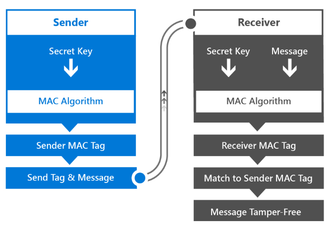

# <a name="intro-to-secure-windows-app-development"></a>보안 Windows 앱 개발 소개


이 소개 문서를 읽으면 앱 설계자 및 개발자가 보안 UWP(유니버설 Windows 플랫폼) 앱 만들기를 가속화하는 다양한 Windows 10 플랫폼 기능을 더 잘 이해할 수 있습니다. 인증, 진행 데이터(data-in-flight) 및 저장 데이터(data-at-rest) 등 다음 각 단계에서 사용할 수 있는 Windows 보안 기능을 사용하는 방법을 자세히 설명합니다. 각 항목에 대한 자세한 내용은 각 장에 포함된 추가 리소스를 검토하여 찾을 수 있습니다.

## <a name="1-introduction"></a>1 소개


보안 앱 개발은 어려울 수 있습니다. 오늘날처럼 빠르게 진행되는 모바일, 소셜, 클라우드 및 복잡한 엔터프라이즈 앱 세상의 고객들은 앱이 전보다 더 빠르게 상용화 및 업데이트되기를 기대합니다. 또한 고객들은 다양한 유형의 디바이스를 사용하므로 앱 환경 만들기는 더욱 복잡해지고 있습니다. Windows 10 UWP(유니버설 Windows 플랫폼)을 빌드하는 경우에는 데스크톱, 랩톱, 태블릿 및 모바일 디바이스 등의 기존 목록이 포함될 수 있으며, 여기에 사물 인터넷, Xbox One, Microsoft Surface Hub 및 HoloLens 등 새로운 디바이스들까지 차차 목록에 추가할 수 있습니다. 개발자는 모든 플랫폼 또는 관련 디바이스에서 앱들이 안전하게 통신하고 데이터를 저장하는지 확인해야 합니다.

다음은 Windows 10 보안 기능을 이용하는 경우의 몇 가지 이점입니다.

-   보안 구성 요소 및 기술에 대한 일관된 API를 사용하여 Windows 10을 지원하는 모든 디바이스에서 보안을 표준화하게 됩니다.
-   이러한 보안 시나리오를 설명하는 사용자 지정 코드를 구현하는 것보다 적게 코드를 작성하고 테스트, 유지합니다.
-   운영 체제를 사용하면 앱 리소스와 로컬 또는 원격 시스템 리소스를 액세스하는 방법을 제어할 수 있으므로 더욱 안정적이고 안전한 앱이 됩니다.

인증하는 동안 특정 서비스에 액세스를 요청하는 사용자의 ID가 유효한지 확인합니다. Windows Hello는 Windows 앱에 더욱 안전한 인증 메커니즘을 만들 수 있도록 하는 Windows 10의 구성 요소입니다. PIN(개인 식별 번호) 또는 사용자의 지문, 얼굴 또는 홍채 같은 생체 인식을 사용하여 앱에 대한 다단계 인증을 구현할 수 있습니다.

진행 데이터(data-in-flight)는 연결 및 연결을 통해 전송되는 메시지를 나타냅니다. 이 예제는 웹 서비스를 사용하여 원격 서버에서 데이터를 검색합니다. SSL(Secure Sockets Layer) 및 HTTPS(Secure Hypertext Transfer Protocol)를 사용하면 전송된 연결 보안이 보장됩니다. 중간 당사자가 이러한 메시지나 무단 앱에 액세스하여 웹 서비스와 통신하지 못하도록 하는 것이 진행 데이터의 보안을 유지하는 키입니다.

마지막으로, 저장 데이터(data-at-rest)는 메모리 또는 저장소 미디어에 상주하는 데이터와 관련이 있습니다. Windows 10에는 앱 사이의 데이터 무단 액세스를 방지하고 디바이스의 데이터 보안을 강화하기 위한 암호화 API를 제공하는 앱 모델이 있습니다. 자격 증명 보관이라는 기능은 운영 체제가 다른 앱이 액세스하지 못하도록 방지하는 디바이스에서 사용자 자격 증명을 안전하게 저장하는 데 사용할 수 있습니다.

## <a name="2-authentication-factors"></a>2 인증 요소


데이터를 보호하려면 액세스를 요청하는 사용자를 식별하고 요청한 데이터 리소스에 액세스할 권한을 부여해야 합니다. 사용자를 식별하는 프로세스는 인증이라고 하며, 리소스에 대한 액세스 권한을 결정하는 것을 권한 부여라고 합니다. 이는 밀접하게 관련된 작업이며, 사용자는 이 두 가지를 구분하지 못할 수 있습니다. 많은 요인(예: 데이터가 한 서버에 있는지 아니면 여러 시스템에 분산되어 있는지 여부)에 따라 상대적으로 간단하거나 복잡할 수 있습니다. 인증 및 권한 부여 서비스를 제공하는 서버를 ID 공급자라고 합니다.

특정 서비스 및/또는 앱에서 인증받기 위해 사용자는 자신이 아는 정보, 보유하고 있는 디바이스 및/또는 신원을 나타내는 정보로 구성된 자격 증명을 활용합니다. 이러한 각 요인을 인증 요소라고 합니다.

-   **사용자 비밀 정보**는 일반적으로 암호이지만 PIN(개인 식별 번호) 또는 “비밀 질문 및 응답 쌍”일 수도 있습니다.
-   **사용자 보유 디바이스**는 사용자에게 고유한 인증 데이터를 포함하고 있는 스마트 카드나 USB 스틱과 같은 하드웨어 메모리 디바이스입니다.
-   **사용자 신원 정보**에는 지문이 종종 포함되지만, 사용자의 음성, 얼굴, ocular(눈) 특성 또는 행동 패턴같이 점점 자주 사용되는 요소들도 있습니다. 이러한 측정치를 데이터로 저장하는 경우 생체 인식이라고 합니다.

사용자가 만든 암호는 본질적으로 인증 요소이기는 하지만 충분하지 않을 때가 많습니다. 암호를 아는 사람이라면 누구든지 해당 암호를 소유한 사용자를 가장할 수 있기 때문입니다. 스마트 카드가 더 높은 수준의 보안을 제공할 수 있지만 도난 또는 분실되거나 잘못된 위치에 둘 수 있습니다. 지문이나 눈 스캔으로 사용자를 인증할 수 있는 컴퓨터 시스템은 가장 편리하면서도 가장 높은 수준의 보안을 제공할 수 있지만 모든 사용자가 사용할 수 없는 비싸고 특수한 하드웨어(예: 얼굴 인식용 Intel RealSense 카메라)가 필요합니다.

따라서 컴퓨터에서 사용하는 인증 방법은 데이터 보안의 복잡하고 중요한 측면입니다. 일반적으로 인증에 더 많은 요소를 사용할수록 컴퓨터의 보안이 더 강화됩니다. 동시에 인증도 사용 가능해야 합니다. 사용자가 일반적으로 하루에도 몇 번씩 시스템에 로그인할 수 있으므로 프로세스가 빨라야 합니다. 인증 유형을 선택할 때는 보안과 사용 편의성 사이에서 절충안을 찾게 됩니다. 단일 요소 인증은 최소의 보안으로 가장 쉽게 사용할 수 있으며, 다단계 인증은 보다 안전하며 요소가 추가될수록 더 복잡해집니다.

## <a name="21-single-factor-authentication"></a>2.1 단일 요소 인증


이 인증 형태는 단일 사용자 자격 증명을 기반으로 합니다. 이는 일반적으로 암호이지만 PIN(개인 식별 번호)도 될 수 있습니다.

단일 요소 인증 프로세스는 다음과 같습니다.

-   사용자가 자신의 사용자 이름 및 암호를 ID 공급자에게 제공합니다. ID 공급자는 사용자 ID의 유효성을 확인하는 서버 프로세스입니다.
-   ID 공급자가 사용자 이름 및 암호가 시스템에 저장된 것과 동일한지 확인합니다. 대부분의 경우에서 암호는 암호화되어 다른 사용자가 읽을 수 없도록 추가 보안을 제공합니다.
-   ID 공급자가 인증의 성공 여부를 나타내는 인증 상태를 반환합니다.
-   성공하면 데이터 교환이 시작됩니다. 실패하면 사용자는 다시 인증을 받아야 합니다.


이 인증 방법은 오늘날 서비스에서 가장 일반적으로 사용됩니다. 또한 유일한 인증 수단으로 사용될 때 가장 취약한 보안 형태이기도 합니다. 암호의 복잡성으로 "비밀 질문"을 요구하고 평상시의 암호를 변경하라고 요구하여 암호를 더 안전하게 만들 수 있지만 이러한 것들은 사용자에게 더 많은 부담이 될 뿐이며 정작 해커에게는 효과적인 제지 방법이 되지 못합니다.

암호의 문제점은 둘 이상의 요소를 가진 시스템보다 더 쉽게 암호를 추측할 수 있다는 것입니다. 소규모 웹 상점에서 사용자 계정 및 해시된 암호를 데이터베이스를 훔쳐 다른 웹 사이트에 사용되는 암호를 사용할 수 있습니다. 복잡한 암호는 기억하기 어려우므로 사용자는 항상 계정을 다시 사용하는 경향이 있습니다. IT 부서의 암호 관리 역시 복원 메커니즘을 제공해야 하고 암호를 자주 업데이트해야 하며 안전한 방식으로 저장해야 한다는 복잡함이 있습니다.

이러한 모든 단점에도 불구하고 단일 요소 인증을 통해 사용자는 자격 증명을 제어할 수 있습니다. 사용자는 자격 증명을 만들고 수정할 수 있으며 인증 프로세스를 위해 키보드만 있으면 됩니다. 바로 이 점이 다단계 인증과 단일 요소 인증을 구별하는 주요 측면입니다.

## <a name="211-web-authentication-broker"></a>2.1.1 웹 인증 브로커


앞에서 설명한 대로, 암호 인증의 문제 중 하나는 IT 부서에 사용자 이름/암호, 복원 메커니즘 등의 기본 관리에 따른 오버헤드가 추가된다는 점입니다. 점점 많이 사용되고 있는 방법은 개방형 인증 표준인 OAuth를 통해 인증을 제공하는 타사 ID 공급자를 이용하는 것입니다.

OAuth를 사용하면 사용자 이름과 암호, 암호 복원 기능 등을 사용하여 데이터베이스를 유지 관리하는 작업을 Facebook, Twitter, Microsoft 같은 ID 공급자에게 "아웃소싱"할 수 있습니다.

사용자는 이러한 플랫폼에서 자신의 ID를 완전히 제어할 수 있지만, 앱은 사용자가 인증된 후 ID 공급자에게 토큰을 요청하고 사용자의 동의에 따라 인증된 사용자에게 권한을 부여할 수 있습니다.

Windows 10의 웹 인증 브로커는 인증 및 권한 부여 프로토콜(예: OAuth 및 OpenID)을 사용하기 위해 API 집합 및 앱용 인프라를 제공합니다. 앱은 [**WebAuthenticationBroker**](https://msdn.microsoft.com/library/windows/apps/br227025) API를 통해 인증 작업을 시작하고 그 결과로 [**WebAuthenticationResult**](https://msdn.microsoft.com/library/windows/apps/br227038)를 반환합니다. 다음 그림에서 통신 흐름의 개요를 보여 줍니다.


앱은 인증 브로커 역할을 하며 앱의 [**WebView**](https://msdn.microsoft.com/library/windows/apps/br227702)를 통해 ID 공급자와 함께 인증을 시작합니다. ID 공급자가 사용자를 인증한 경우 ID 공급자는 사용자에 대한 정보를 ID 공급자에게 요청하는 데 사용될 수 있는 앱의 토큰을 반환합니다. 보안을 위해 앱을 ID 공급자를 통해 반드시 등록한 후에 ID 공급자와의 인증 프로세스를 중재할 수 있습니다. 이 등록 단계는 공급자마다 다릅니다.

다음은 공급자와 통신하기 위해 [**WebAuthenticationBroker**](https://msdn.microsoft.com/library/windows/apps/br227025) API를 호출할 때 사용하는 일반 워크플로입니다.

-   ID 공급자에 보낼 요청 문자열을 생성합니다. 문자열의 수 및 각 문자열의 정보는 웹 서비스마다 다르지만 일반적으로는 보낼 인증 요청 URL이 있는 요청 URI 문자열과 권한 부여가 완료된 후 사용자를 리디렉션할 URL이 있는 두 URI 문자열을 포함합니다.
-   [**WebAuthenticationBroker.AuthenticateAsync**](https://msdn.microsoft.com/library/windows/apps/br212066)를 호출하여 요청 문자열을 전달한 다음 ID 공급자에게서 응답을 기다립니다.
-   [**WebAuthenticationResult.ResponseStatus**](https://msdn.microsoft.com/library/windows/apps/br227041)를 호출하여 응답을 받을 때의 상태를 가져옵니다.
-   통신이 성공하면 ID 공급자에서 반환된 응답 문자열을 처리합니다. 실패하면 오류를 처리합니다.

통신이 성공하면 ID 공급자에서 반환된 응답 문자열을 처리합니다. 실패하면 오류를 처리합니다.

이 프로세스를 위한 샘플 C# 코드가 아래 나와 있습니다. 정보 및 자세한 연습에 대해서는 [WebAuthenticationBroker](web-authentication-broker.md)를 참조하세요. 전체 코드 샘플을 보려면 [GitHub의 WebAuthenticationBroker 샘플](http://go.microsoft.com/fwlink/p/?LinkId=620622)을 확인하세요.

```cs
string startURL = "https://<providerendpoint>?client_id=<clientid>";
string endURL = "http://<AppEndPoint>";

var startURI = new System.Uri(startURL);
var endURI = new System.Uri(endURL);

try
{
    WebAuthenticationResult webAuthenticationResult = 
        await WebAuthenticationBroker.AuthenticateAsync( 
            WebAuthenticationOptions.None, startURI, endURI);

    switch (webAuthenticationResult.ResponseStatus)
    {
        case WebAuthenticationStatus.Success:
            // Successful authentication. 
            break;
        case WebAuthenticationStatus.ErrorHttp:
            // HTTP error. 
            break;
        default:
            // Other error.
        break;
    }
}
catch (Exception ex)
{
    // Authentication failed. Handle parameter, SSL/TLS, and
    // Network Unavailable errors here. 
}
```

## <a name="22-multi-factor-authentication"></a>2.2 다단계 인증


다단계 인증은 둘 이상의 인증 요소를 이용합니다. 일반적으로 암호같이 "알고 있는 내용"이 휴대폰 또는 스마트 카드같이 "갖고 있는 것"과 결합됩니다. 공격자가 사용자의 암호를 알아도 디바이스 또는 카드가 없으면 여전히 계정에 액세스할 수 없습니다. 또한 디바이스 또는 카드를 알아도 암호가 없으면 공격자에게는 소용이 없습니다. 따라서 다단계 인증은 단일 요소 인증보다 더욱 안전하면서 복잡합니다.

다단계 인증을 사용하는 서비스는 종종 사용자가 두 번째 자격 증명을 받는 방법을 선택하도록 합니다. 이 인증 유형의 예로서 SMS를 사용하여 인증 코드를 사용자의 휴대폰에 보내는 프로세스를 일반적으로 사용합니다.

-   사용자가 자신의 사용자 이름 및 암호를 ID 공급자에게 제공합니다.
-   ID 공급자가 단일 요소 권한 부여에서와 같이 사용자 이름과 암호를 확인한 다음 시스템에 저장된 사용자의 휴대폰 번호를 조회합니다.
-   서버는 생성된 인증 코드가 포함된 SMS 메시지를 사용자의 휴대폰에 보냅니다.
-   사용자는 사용자에게 표시된 형식을 통해 인증 코드를 ID 공급자에 제공합니다.
-   ID 공급자는 두 자격 증명 인증의 성공 여부를 나타내는 인증 상태를 반환합니다.
-   성공하면 데이터 교환이 시작됩니다. 그렇지 않으면 사용자는 다시 인증을 받아야 합니다.


표시된 것처럼 이 프로세스는 두 번째 사용자 자격 증명이 사용자에 의해 만들어지거나 제공되지 않고 사용자에게 전송된다는 점에서 단일 요소 인증과 다릅니다. 그렇기 때문에 사용자는 필요한 자격 증명을 완전히 제어하지 못합니다. 이는 스마트 카드가 두 번째 자격 증명으로 사용될 때에도 적용됩니다. 조직이 해당 자격 증명을 만들고 사용자에게 이 자격 증명을 제공하는 것을 담당합니다.

## <a name="221-azure-active-directory"></a>2.2.1 Azure Active Directory


Azure AD(Azure Active Directory)는 단일 요소 인증 또는 다단계 인증에서 ID 공급자 역할을 할 수 있는 클라우드 기반 ID 및 액세스 관리 서비스입니다. Azure AD 인증은 인증 코드 여부에 관계없이 사용할 수 있습니다.

Azure AD는 단일 요소 인증을 구현할 수도 있지만 기업은 일반적으로 다단계 요소 인증의 더 높은 보안을 필요로 합니다. 다단계 요소 인증 구성에서 Azure AD 계정으로 인증하는 사용자는 휴대폰이나 Azure Authenticator 모바일 앱에 SMS 메시지로 인증 코드를 보낼 수 있습니다.

또한 Azure AD를 OAuth 공급자로 사용하여 표준 사용자에게 다양한 플랫폼 간 앱에 대한 인증 및 권한 부여 메커니즘을 제공할 수 있습니다. 자세한 내용은 [Azure Active Directory](https://azure.microsoft.com/services/active-directory/) 및 [Azure에서 다단계 인증](https://azure.microsoft.com/services/multi-factor-authentication/)을 참조하세요.

## <a name="24-windows-hello"></a>2.4 Windows Hello


Windows 10에서는 편리한 다단계 인증 메커니즘이 운영 체제에 빌드되었습니다. Windows Hello는 Windows 10에 새롭게 기본 제공되는 생체 인식 로그인 시스템입니다. 이 시스템은 운영 체제에 내장되어 있기 때문에 얼굴 또는 지문 식별을 통해 사용자 디바이스의 잠금을 해제할 수 있습니다. Windows 보안 자격 증명 저장소는 디바이스의 생체 인식 데이터를 보호합니다.

Windows Hello는 디바이스에서 개별 사용자를 인식하기 위한 강력한 방법으로, 사용자와 요청된 서비스 또는 데이터 항목 간의 경로에 대한 첫 번째 부분을 해결합니다. 장치에서 사용자를 인식한 후 요청된 리소스에 대한 액세스를 허용할지 여부를 결정하려면 먼저 사용자를 인증해야 합니다. Windows Hello도 Windows에 완전히 통합된 강력한 2FA(2단계 인증)를 제공하며 재사용 가능한 암호를 특정 장치 및 생체 인식 제스처 또는 PIN의 조합으로 대체합니다. PIN은 Microsoft 계정 등록의 일부로 사용자가 지정합니다.

그러나 Windows Hello는 기존 2FA 시스템을 대체하는 데 그치는 것은 아닙니다. 개념적으로 보면 스마트 카드와 유사합니다. 문자열 비교 대신 암호화 기본 방식을 사용하여 인증을 수행하고 사용자의 주요 자료를 위조 방지 하드웨어 내에서 보호합니다. Microsoft Hello는 스마트 카드 배포에 필요한 추가 인프라 구성 요소가 필요하지 않습니다. 특히, 현재 PKI(공개 키 인프라)가 없어도 인증서를 관리할 수 있습니다. Windows Hello는 가상 스마트 카드의 배포 유연성과 물리적 스마트 카드의 강력한 보안과 같은 스마트 카드 기술의 주요 장점만 가져오고 단점은 제외하였습니다.

사용자가 장치를 인증할 수 있으려면 먼저 장치를 Windows Hello에 등록해야 합니다. Windows Hello는 한 당사자가 공개 키를 사용하여 데이터를 암호화하면 다른 당사자는 개인 키를 사용하여 해독할 수 있는 비대칭(공개/개인 키) 암호화를 사용합니다. Windows Hello의 경우에는 공개/개인 키 쌍 집합을 만들고 장치의 TPM(신뢰할 수 있는 플랫폼 모듈) 칩에 개인 키를 씁니다. 디바이스가 등록된 후 UWP 앱은 시스템 API를 호출하여 서버에서 사용자를 등록하는 데 사용하는 사용자의 공개 키를 검색할 수 있습니다.

앱의 등록 워크플로는 다음과 같을 수 있습니다.


수집한 등록 정보에는 이처럼 간단한 시나리오에서 더 많은 식별 정보가 포함될 수 있습니다. 예를 들어, 앱이 은행 업무용 보안 서비스 같은 것에 액세스할 경우에는 등록 프로세스의 일부로 ID 증명과 다른 작업을 요청해야 합니다. 모든 조건이 충족되면 이 사용자의 공개 키가 백 엔드에 저장되고 다음에 사용자가 서비스를 사용하려고 할 때 유효성을 확인하는 데 사용됩니다.

Windows Hello에 대한 자세한 내용은 [Windows Hello 가이드](https://msdn.microsoft.com/library/mt589441) 및 [Windows Hello 개발자 가이드](microsoft-passport.md)를 참조하세요.

## <a name="3-data-in-flight-security-methods"></a>3 진행 데이터(data-in-flight) 보안 방법


진행 데이터(data-in-flight) 보안 방법은 네트워크에 연결된 디바이스 간에 전송 중인 데이터에 적용됩니다. 데이터는 개인 회사 인트라넷의 높은 수준의 보안 환경에 있는 시스템 간 또는 웹의 비보안 환경에 있는 클라이언트와 웹 서비스 간에 전송될 수 있습니다. Windows 10은 네트워킹 API를 통해 SSL과 같은 표준을 지원하고 Azure API 관리와 같은 기술을 사용하여 작동합니다. Azure API를 통해 개발자는 해당 앱에 대한 적절한 보안 수준을 확보할 수 있습니다.

## <a name="31-remote-system-authentication"></a>3.1 원격 시스템 인증


원격 컴퓨터 시스템과의 통신이 발생하게 되는 두 가지 일반적인 시나리오가 있습니다.

-   로컬 서버는 직접 연결을 통해 사용자를 인증합니다. 예를 들어 서버와 클라이언트가 회사 인트라넷에 있는 경우입니다.
-   웹 서비스는 인터넷을 통해 전달됩니다.

웹 서비스 통신에 대한 보안 요구 사항은 직접 연결 시나리오의 보안 요구 사항보다 높습니다. 이는 데이터가 더 이상 보안 네트워크의 일부가 아니며 데이터를 가로채려는 악의적인 공격자가 될 가능성도 더 높기 때문입니다. 다양한 유형의 디바이스가 서비스에 액세스할 것이므로 WCF와는 반대로 RESTful 서비스로 빌드될 가능성이 큽니다. 따라서 서비스 인증 및 권한 부여 또한 새로운 문제를 가져오게 됩니다. 원격 시스템 보안 통신을 위한 두 가지 요구 사항에 대해 설명하겠습니다.

첫 번째 요구 사항은 메시지 기밀성입니다. 클라이언트와 웹 서비스 간에 전달되는 정보(예: 사용자 ID 및 개인 정보)는 전송 동안에 제3자가 읽을 수 없어야 합니다. 이 작업은 일반적으로 메시지가 전송되는 연결을 암호화하고 메시지 자체를 암호화하여 수행됩니다. 개인/공개 키 암호화에 있어서 공개 키는 누구든지 사용할 수 있으며 특정 수신자로 보낼 메시지를 암호화하는 데 사용됩니다. 개인 키는 수신자만 보유하며 메시지의 암호를 해독하는 데만 사용됩니다.

두 번째 요구 사항은 메시지 무결성입니다. 클라이언트 및 웹 서비스는 받은 메시지가 상대방이 보내려던 메시지이고 해당 메시지가 전송 중에 변경되지 않았는지 확인할 수 있어야 합니다. 이를 수행하는 방법은 디지털 서명을 사용하여 메시지를 서명하고 인증서 인증을 사용하는 것입니다.

## <a name="32-ssl-connections"></a>3.2 SSL 연결


클라이언트에 보안 연결을 설정하고 유지 관리하기 위해 웹 서비스가 SSL(Secure Sockets Layer)을 사용하며 이는 HTTPS(Secure Hypertext Transfor Protocol)에서 지원됩니다. SSL은 서버 인증서뿐만 아니라 공개 키 암호화를 지원하여 메시지 기밀성 및 무결성을 제공합니다. SSL은 TLS(전송 계층 보안)로 대체되지만 TLS를 종종 SSL이라고도 합니다.

클라이언트가 서버에서 리소스에 대한 액세스를 요청하면 SSL은 서버와 협상 프로세스를 시작합니다. 이를 SSL 핸드셰이크라고 합니다. SSL 연결 기간 동안 암호화 수준, 공개 및 개인 암호화 키 집합 및 클라이언트와 서버 인증서의 ID 정보가 모든 통신의 기초로 합의됩니다. 또한 이때 서버가 클라이언트에게 인증을 받으라고 요구할 수도 있습니다. 연결이 설정되면 모든 메시지가 연결이 닫힐 때까지 협상된 공개 키로 암호화됩니다.

## <a name="321-ssl-pinning"></a>3.2.1 SSL 고정


SSL은 암호화 및 인증서를 사용하여 메시지 기밀성을 제공할 수 있지만 클라이언트와 통신 중인 서버가 클라이언트가 원하는 서버인지 확인하는 작업은 전혀 없습니다. 무단 침입자가 서버의 동작을 모방하여 클라이언트가 전송하는 중요한 데이터를 가로챌 수 있습니다. 이 문제를 방지하기 위해 SSL 고정이라는 기술을 사용하면 서버 인증서가 클라이언트가 기대하고 신뢰하는 인증서인지 확인할 수 있습니다.

앱에서 SSL 고정을 구현하는 몇 가지 다른 방법이 있으며 각각 고유한 장점과 단점이 있습니다. 가장 쉬운 방법은 앱 패키지 매니페스트의 인증서 선언을 통하는 것입니다. 이 선언을 통해 앱 패키지가 디지털 인증서를 설치하고 해당 인증서에 대해 단독 트러스트를 지정할 수 있습니다. 그 결과 인증서 체인에 해당 인증서가 있는 앱과 서버 간에만 SSL 연결이 허용됩니다. 또한 신뢰할 수 있는 공용 인증 기관에서는 타사 종속성이 필요 없으므로 이 메커니즘에서는 자체 서명된 인증의 보안 사용이 가능합니다.


유효성 검사 논리를 더욱 제어하기 위해 HTTPS 요청에 대한 응답으로 서버에서 반환된 인증서의 유효성 검사에 API를 사용할 수 있습니다. 이 방법을 사용하려면 요청을 보내고 응답을 검사해야 하므로 요청에서 중요한 정보를 실제로 보내기 전에 유효성 검사로 이 방법을 추가해야 합니다.

다음 C# 코드는 이 SSL 고정 방법을 보여 줍니다. **ValidateSSLRoot** 메서드는 [**HttpClient**](https://msdn.microsoft.com/library/windows/apps/dn298639) 클래스를 사용하여 HTTP 요청을 실행합니다. 클라이언트가 응답을 전송한 후 [**RequestMessage.TransportInformation.ServerIntermediateCertificates**](https://msdn.microsoft.com/library/windows/apps/dn279681) 컬렉션을 사용하여 서버에서 반환된 인증서를 검사할 수 있습니다. 그런 다음 클라이언트는 포함된 지문을 사용하여 전체 인증서 체인의 유효성을 검사할 수 있습니다. 이 방법을 사용하는 경우 서버 인증서가 만료되고 갱신되면 앱에서 인증서 지문을 업데이트해야 합니다.

```cs
private async Task ValidateSSLRoot()
{
    // Send a get request to Bing
    var httpClient = new HttpClient();
    var bingUri = new Uri("https://www.bing.com");
    HttpResponseMessage response = 
        await httpClient.GetAsync(bingUri);

    // Get the list of certificates that were used to
    // validate the server's identity
    IReadOnlyList<Certificate> serverCertificates = response.RequestMessage.TransportInformation.ServerIntermediateCertificates;
  
    // Perform validation
    if (!ValidateCertificates(serverCertificates))
    {
        // Close connection as chain is not valid
        return;
    }
    // Validation passed, continue with connection to service
}

private bool ValidateCertificates(IReadOnlyList<Certificate> certs)
{
    // In this example, we iterate through the certificates
    // and check that the chain contains
    // one specific certificate we are expecting
    foreach (var cert in certs)
    {
        byte[] thumbprint = cert.GetHashValue();

        // Check if the thumbprint matches whatever you 
        // are expecting
        var expected = new byte[] { 212, 222, 32, 208, 94, 102, 
            252, 83, 254, 26, 80, 136, 44, 120, 219, 40, 82, 202, 
            228, 116 };

        // ThumbprintMatches does the byte[] comparison 
        if (ThumbprintMatches(thumbprint, expected))
        {
            return true;
        }
    }
    return false;
}
```

## <a name="33-publishing-and-securing-access-to-rest-apis"></a>3.3 REST API에 대한 액세스 게시 및 보안


웹 서비스에 대한 액세스 권한을 가지려면 API 호출이 이루어질 때마다 인증이 필요합니다. 성능 및 크기를 제어할 수 있는지 여부는 웹 서비스가 웹에서 노출될 때 고려해야 할 사항이기도 합니다. Azure API 관리는 세 가지 수준에서 기능을 제공하는 동안 웹에서 API를 노출하는 데 도움이 되는 서비스입니다.

API의 **Publishers/Administrators**는 Azure API 관리의 게시자 포털을 통해 API를 쉽게 구성할 수 있습니다. 여기서 API 집합을 만들 수 있으며 이에 대한 액세스를 관리하여 누구에게 어떤 API에 대한 액세스 권한을 줄지 제어할 수 있습니다.

이 API에 액세스하려는 **Developers**는 즉시 액세스 권한을 제공하거나 게시자/관리자에게 승인을 요청할 수 있는 개발자 포털을 통해 요청을 할 수 있습니다. 또한 개발자는 개발자 포털에서 API 설명서 및 샘플 코드를 보고 웹 서비스에서 제공하는 API를 신속히 채택할 수도 있습니다.

그런 다음 이 개발자가 생성하는 **apps**은 Azure API 관리에서 제공하는 프록시를 통해 API에 액세스할 수 있습니다. 두 프록시 모두 게시자/관리자의 서버에서 API의 실제 끝점을 감추는 숨기기 계층을 제공하며, 한 API 호출이 다른 API로 리디렉션되는 경우 노출된 API가 일관성을 유지하도록 하기 위해 API 번역 같은 추가 논리를 포함할 수도 있습니다. 또한 IP 필터링을 사용하면 특정 IP 도메인 또는 도메인 집합에서 발생하는 API 호출을 차단할 수 있습니다. Azure API 관리는 API 키라는 공개 키 집합을 사용하여 웹 서비스를 안전하게 유지하여 각 API 호출을 인증하고 권한 부여합니다. 권한 부여가 실패하는 경우 API 및 지원 기능에 대한 액세스가 차단됩니다.

Azure API 관리는 서비스(제한이라는 프로시저)에 API 호출 수를 줄여서 웹 서비스의 성능을 최적화할 수도 있습니다. 자세한 내용은 [Azure API 관리](https://azure.microsoft.com/services/api-management/) 및 [AzureCon 2015에서 Azure API 관리](https://channel9.msdn.com/events/Microsoft-Azure/AzureCon-2015/ACON313)를 참조하세요.

## <a name="4-data-at-rest-security-methods"></a>4 저장 데이터(data-at-rest) 보안 메서드


데이터가 디바이스에 도착할 때 해당 데이터를 "저장 데이터(data-at-rest)"라고 합니다. 이 데이터는 권한이 없는 사용자 또는 앱이 액세스할 수 없도록 안전한 방법으로 디바이스에 저장되어야 합니다. Windows 10의 앱 모델에서는 많은 기능으로 앱에서 저장한 데이터가 기본적으로 해당 앱에만 액세스할 수 있도록 하지만 필요할 때는 데이터를 공유하기 위해 API를 제공합니다. 또한 데이터를 암호화하고 자격 증명을 안전하게 저장할 수 있도록 추가 API를 사용할 수도 있습니다.

## <a name="41-windows-app-model"></a>4.1 Windows 앱 모델


일반적으로 Windows에는 앱에 대한 정의가 없습니다. 가장 흔히 실행 파일(.exe)이라고 하지만 설치, 상태 저장, 실행 길이, 버전 관리, OS 통합 및 앱 간 통신은 정의에 들어가지 않습니다. 유니버설 Windows 플랫폼 모델에서는 설치, 런타임 환경, 리소스 관리, 업데이트, 데이터 모델 및 설치 제거를 다루는 앱 모델을 정의합니다.

Windows 10 앱은 기본적으로 권한이 제한되어 있으므로 컨테이너에서 실행됩니다(사용자가 추가 권한을 요청하여 허가를 받을 수 있음). 예를 들어, 앱에서 시스템 파일에 액세스하려는 경우 [**Windows.Storage.Pickers**](https://msdn.microsoft.com/library/windows/apps/br207928) 네임스페이스의 파일 선택기를 사용하여 사용자에게 파일을 선택하도록 할 수 있습니다(파일에 직접 액세스는 불가). 다른 예로, 앱에서 사용자의 위치 데이터에 액세스하려면 위치 디바이스 정보 값 요구를 선언하여 다운로드 시에 이 앱이 사용자에게 사용자 위치 액세스를 요청할 수 있도록 해야 합니다. 그에 앞서 앱이 처음으로 사용자의 위치에 액세스하려는 경우에는 데이터 액세스 권한을 요청하는 추가 동의 확인 프롬프트가 나타납니다.

이 앱 모델은 앱에 대한 "감옥" 역할을 합니다. 다시 말하면 접근할 수는 없지만 외부에서 다가가지 못할 "성"은 아니라는 것입니다(물론 관리자 권한을 가진 응용 프로그램은 액세스 가능). 조직/IT가 어떤 (Win32) 앱의 실행을 허용할지 지정할 수 있게 하는 Windows 10의 Device Guard는 이 액세스를 추가로 제한하는 데 도움이 될 수 있습니다.

또한 앱 모델은 앱 수명 주기를 관리합니다. 예를 들어, 기본적으로 앱의 백그라운드 실행을 제한합니다. 즉, 앱이 백그라운드로 가자마자 프로세스는 일시 중단되고(앱 일시 중단을 코드로 작성하도록 짧은 시간을 준 뒤) 메모리는 동결됩니다. 운영 체제는 앱이 특정 백그라운드 작업 실행을 요청하는 메커니즘을 제공합니다(인터넷/Bluetooth 연결, 전원 변경 등 다양한 이벤트에 의해 트리거되는 일정에 따라서 그리고 음악 재생이나 GPS 추적 등의 특정 시나리오에 따라서).

디바이스의 메모리 리소스가 부족해지는 경우 Windows는 앱을 종료하여 메모리 공간을 확보합니다. 이 수명 주기 모델은 일시 중단과 종료 사이에 주어진 추가 시간이 없기 때문에 앱이 일시 중단될 때마다 데이터를 강제로 유지하도록 합니다.

자세한 내용은 [유니버설: Windows 10 응용 프로그램의 수명 주기 이해](https://visualstudiomagazine.com/articles/2015/09/01/its-universal.aspx)를 참조하세요.

## <a name="42-stored-credential-protection"></a>4.2 저장된 자격 증명 보호


인증된 서비스에 액세스하는 Windows 앱은 로컬 디바이스에 해당 자격 증명을 저장하는 옵션을 사용자에게 제공하는 경우가 많습니다. 이는 사용자에게 편리한 기능입니다. 사용자가 사용자 이름 및 암호를 제공한 경우 다음에 앱을 시작할 때 자동으로 해당 사용자 이름 및 암호를 사용합니다. 공격자가 저장된 이 데이터에 대한 액세스 권한을 얻는 경우 보안 문제가 될 수 있으므로 Windows 10은 Windows 앱이 보안 자격 증명 보관에 사용자 자격 증명을 저장하는 기능을 제공합니다. 앱은 앱의 저장소 컨테이너에 자격 증명을 저장하지 않고 자격 증명 보관 API를 호출하여 자격 증명 보관에 저장하고 검색합니다. 자격 증명 보관은 운영 체제에서 관리되지만 액세스가 자격 증명을 저장하는 앱에 제한되며 자격 증명 저장을 위해 안전한 관리형 솔루션을 제공합니다.

사용자가 저장할 자격 증명을 제공하는 경우 앱은 [**Windows.Security.Credentials**](https://msdn.microsoft.com/library/windows/apps/br227089) 네임스페이스의 [**PasswordVault**](https://msdn.microsoft.com/library/windows/apps/br227081) 개체를 사용하여 자격 증명 보관에 대한 참조를 가져옵니다. 그런 다음 Windows 앱에 대한 식별자와 사용자 이름 및 암호가 포함된 [**PasswordCredential**](https://msdn.microsoft.com/library/windows/apps/br227061) 개체를 만듭니다. 이는 자격 증명 보관에 자격 증명을 저장하기 위한 [**PasswordVault.Add**](https://msdn.microsoft.com/library/windows/apps/hh701231) 메서드로 전달됩니다. 다음의 C# 코드 예제에서는 이를 수행하는 방법을 보여 줍니다.

```cs
var vault = new PasswordVault();
vault.Add(new PasswordCredential("My App", username, password));
```

다음 C# 코드 예제에서 앱이 [**PasswordVault**](https://msdn.microsoft.com/library/windows/apps/br227081) 개체의 [**FindAllByResource**](https://msdn.microsoft.com/library/windows/apps/br227083) 메서드를 호출하여 앱에 해당하는 모든 자격 증명을 요청합니다. 둘 이상 반환되면 해당 사용자의 이름을 입력하라는 메시지가 사용자에게 표시됩니다. 자격 증명이 자격 증명 보관에 없는 경우 앱에서 이를 위한 메시지가 사용자에게 표시됩니다. 그러면 사용자가 자격 증명을 사용하여 서버에 로그인됩니다.

```cs
private string resourceName = "My App";
private string defaultUserName;

private void Login()
{
    PasswordCredential loginCredential = GetCredentialFromLocker();

    if (loginCredential != null)
    {
        // There is a credential stored in the locker.
        // Populate the Password property of the credential
        // for automatic login.
        loginCredential.RetrievePassword();
    }
    else
    {
        // There is no credential stored in the locker.
        // Display UI to get user credentials.
        loginCredential = GetLoginCredentialUI();
    }
    // Log the user in.
    ServerLogin(loginCredential.UserName, loginCredential.Password);
}

private PasswordCredential GetCredentialFromLocker()
{
    PasswordCredential credential = null;

    var vault = new PasswordVault();
    var credentialList = vault.FindAllByResource(resourceName);

    if (credentialList.Count == 1)
    {
        credential = credentialList[0];
    }
    else if (credentialList.Count > 0)
    {
        // When there are multiple usernames,
        // retrieve the default username. If one doesn't
        // exist, then display UI to have the user select
        // a default username.
        defaultUserName = GetDefaultUserNameUI();

        credential = vault.Retrieve(resourceName, defaultUserName);
    }
    return credential;
}
```

자세한 내용은 [자격 증명 보관](credential-locker.md)을 참조하세요.

## <a name="43-stored-data-protection"></a>4.3 저장된 데이터 보호


데이터가 저장되었을 때 일반적으로 저장 데이터(data-at-rest)라고 하며 이를 암호화하면 권한이 없는 사용자가 저장된 데이터에 액세스하지 못하도록 할 수 있습니다. 데이터를 암호화는 두 가지 일반적인 메커니즘은 대칭 키 또는 비대칭 키를 사용하는 것입니다. 그러나 데이터 암호화는 데이터를 보낸 시간과 저장한 시간 사이에 데이터가 변경되지 않는다고 보장할 수 없습니다. 즉, 데이터 무결성을 보장할 수 없습니다. 이 문제를 해결하는 일반적인 기술은 메시지 인증 코드, 해시 및 디지털 서명을 사용하는 것입니다.

## <a name="431-data-encryption"></a>4.3.1 데이터 암호화


대칭형 암호화를 사용하면 발신자와 수신자가 동일한 키를 사용하여 데이터를 암호화하고 암호 해독합니다. 이 접근 방식의 과제는 키를 공유하므로 양쪽 모두 그 키를 알고 있다는 것입니다.

이에 대한 한 가지 해결책은 공개/개인 키 쌍이 사용되는 비대칭형 암호화입니다. 공개 키는 메시지를 암호화하는 모두가 자유롭게 공유할 수 있습니다. 개인 키는 사용자만 데이터의 암호를 해독하기 위해 사용할 수 있도록 항상 비밀로 유지됩니다. 공개 키의 검색에 허용되는 일반적인 기술은 간단히 인증서라고도 하는 디지털 인증서를 사용하는 것입니다. 인증서에는 공개 키뿐만 아니라 이름, 발급자, 메일 주소 및 국가와 같은 사용자 또는 서버에 대한 정보가 들어 있습니다.

Windows 앱 개발자는 [**SymmetricKeyAlgorithmProvider**](https://msdn.microsoft.com/library/windows/apps/br241537) 및 [**AsymmetricKeyAlgorithmProvider**](https://msdn.microsoft.com/library/windows/apps/br241478) 클래스를 사용하여 해당 UWP 앱에서 대칭형 및 비대칭형 암호화를 구현할 수 있습니다. 또한 [**CryptographicEngine**](https://msdn.microsoft.com/library/windows/apps/br241490) 클래스가 데이터를 암호화하고 암호 해독하고 콘텐츠를 서명하고 디지털 서명을 확인하는 데 사용할 수 있습니다. 또한 앱은 [**Windows.Security.Cryptography.DataProtection**](https://msdn.microsoft.com/library/windows/apps/br241585) 네임스페이스의 [**DataProtectionProvider**](https://msdn.microsoft.com/library/windows/apps/br241559) 클래스를 사용하여 저장된 로컬 데이터를 암호화하고 암호 해독할 수 있습니다.

## <a name="432-detecting-message-tampering-macs-hashes-and-signatures"></a>4.3.2 메시지 변조(MAC, 해시 및 서명) 검색


MAC는 대칭 키(비밀 키라고도 함)를 사용한 결과인 코드(또는 태그)이거나 MAC 암호화 알고리즘의 입력으로 사용되는 메시지입니다. 메시지를 전송하기 전에 발신자와 수신자가 비밀 키 및 알고리즘에 동의합니다.

MAC에서 다음과 같은 메시지를 확인합니다.

-   발신자가 MAC 알고리즘에 대한 입력으로 비밀 키를 사용하여 MAC 태그를 파생합니다.
-   발신자가 MAC 태그 및 메시지를 수신자에게 보냅니다.
-   수신자가 MAC 알고리즘에 대한 입력으로 사용하는 비밀 키 및 메시지를 사용하여 MAC 태그를 파생합니다.
-   수신자가 MAC 태그를 발신자의 MAC 태그와 비교합니다. 두 태그가 서로 같으면 메시지가 변조되지 않은 것입니다.



Windows 앱은 [**MacAlgorithmProvider**](https://msdn.microsoft.com/library/windows/apps/br241530) 클래스 호출을 통해 키를 생성하고 [**CryptographicEngine**](https://msdn.microsoft.com/library/windows/apps/br241490) 클래스 호출을 통해 MAC 암호화 알고리즘을 수행하여 MAC 메시지 확인을 구현할 수 있습니다.

## <a name="433-using-hashes"></a>4.3.3 해시 사용


해시 함수는 임의로 긴 데이터 블록을 사용하고 해시 값이라는 고정 크기의 비트 문자열을 반환하는 암호화 알고리즘입니다. 이 작업을 수행할 수 있는 해시 함수의 전체 패밀리가 있습니다.

위의 메시지 전송 시나리오에서 MAC 대신 해시 값을 사용할 수 있습니다. 발신자가 해시 값 및 메시지를 보내고 수신자가 발신자의 해시 값 및 메시지에서 나온 고유한 해시 값을 파생하여 두 해시 값을 비교합니다. Windows 10에서 실행되는 앱은 [**HashAlgorithmProvider**](https://msdn.microsoft.com/library/windows/apps/br241511) 클래스를 호출하여 사용 가능한 해시 알고리즘을 열거하고 그중 하나를 실행할 수 있습니다. [**CryptographicHash**](https://msdn.microsoft.com/library/windows/apps/br241498) 클래스는 해시 값을 나타냅니다. [**CryptographicHash.GetValueAndReset**](https://msdn.microsoft.com/library/windows/apps/hh701376) 메서드를 사용하면 사용할 때마다 개체를 다시 만들지 않고도 여러 데이터를 반복적으로 해시할 수 있습니다. **CryptographicHash** 클래스의 Append 메서드는 해시할 버퍼에 새 데이터를 추가합니다. 이 전체 프로세스는 다음 C# 코드 예제에서 보여 줍니다.

```cs
public void SampleReusableHash()
{
    // Create a string that contains the name of the
    // hashing algorithm to use.
    string strAlgName = HashAlgorithmNames.Sha512;

    // Create a HashAlgorithmProvider object.
    HashAlgorithmProvider objAlgProv = HashAlgorithmProvider.OpenAlgorithm(strAlgName);

    // Create a CryptographicHash object. This object can be reused to continually
    // hash new messages.
    CryptographicHash objHash = objAlgProv.CreateHash();

    // Hash message 1.
    string strMsg1 = "This is message 1";
    IBuffer buffMsg1 = CryptographicBuffer.ConvertStringToBinary(strMsg1, BinaryStringEncoding.Utf16BE);
    objHash.Append(buffMsg1);
    IBuffer buffHash1 = objHash.GetValueAndReset();

    // Hash message 2.
    string strMsg2 = "This is message 2";
    IBuffer buffMsg2 = CryptographicBuffer.ConvertStringToBinary(strMsg2, BinaryStringEncoding.Utf16BE);
    objHash.Append(buffMsg2);
    IBuffer buffHash2 = objHash.GetValueAndReset();

    // Convert the hashes to string values (for display);
    string strHash1 = CryptographicBuffer.EncodeToBase64String(buffHash1);
    string strHash2 = CryptographicBuffer.EncodeToBase64String(buffHash2);
}
```

## <a name="434-digital-signatures"></a>4.3.4 디지털 서명


디지털 서명된 저장 메시지의 데이터 무결성은 MAC 인증과 유사한 방식으로 확인됩니다. 디지털 서명 워크플로가 작동하는 방법은 다음과 같습니다.

-   발신자가 해시 알고리즘에 대한 입력으로 메시지를 사용하여 해시 값(다이제스트라고도 함)을 파생합니다.
-   발신자가 개인 키를 사용하여 다이제스트를 암호화합니다.
-   발신자가 메시지, 암호화된 다이제스트 및 사용된 해시 알고리즘 이름을 보냅니다.
-   수신자가 공개 키를 사용하여 수신한 암호화된 다이제스트를 암호 해독합니다. 그런 다음 메시지를 해시하는 해시 알고리즘을 사용하여 고유한 다이제스트를 만듭니다. 마지막으로 수신자가 두 개의 다이제스트(수신해서 암호 해독한 다이제스트 및 만든 다이제스트)를 비교합니다. 두 개가 일치하면 수신자는 개인 키의 소유자가 보낸 메시지라고 확신할 수 있습니다. 그러므로 소유자가 자신이 누구인지 말한 것이 사실이고 전송 중에 메시지가 변조되지 않은 것입니다.


해시 알고리즘은 매우 빠르므로 대용량 메시지에서도 해시 값이 빠르게 파생될 수 있습니다. 결과로 파생된 해시 값은 임의의 길이이며 전체 메시지보다 짧을 수 있으므로 전체 메시지가 아닌 다이제스트만 암호화하고 암호 해독하도록 공개 키 및 개인 키를 사용하는 것이 최적의 방법입니다.

자세한 내용은 [디지털 서명](https://msdn.microsoft.com/library/windows/desktop/aa381977), [MAC, 해시, 서명](macs-hashes-and-signatures.md) 및 [암호화](cryptography.md)에 관한 기사를 참조하세요.

## <a name="5-summary"></a>5 요약


Windows 10의 유니버설 Windows 플랫폼은 다양한 보안 앱을 만드는 데에 운영 체제 기능을 활용하는 방법을 제공합니다. 단일 요소 인증, 다단계 인증, OAuth ID 공급자를 사용하여 조정된 인증 등의 여러 가지 인증 시나리오에서 API는 인증과 관련된 가장 일반적인 문제를 완화하기 위해 존재합니다. Windows Hello에서는 사용자를 인식하고 적절한 식별을 우회하려는 노력을 적극적으로 방어하는 새로운 생체 인식 로그인 시스템을 제공합니다. 또한 신뢰할 수 있는 플랫폼 모듈 외부에서 표시 또는 사용할 수 없는 여러 계층의 키와 인증서를 제공합니다. 또한 선택적으로 증명 확인 키 및 인증서를 사용하여 추가 보안 계층도 적용할 수 있습니다.

실행 데이터를 보호하기 위해 API는 SSL을 통해 원격 시스템과 안전하게 통신하면서 SSL 고정을 이용하여 서버의 신뢰성을 확인할 가능성을 제공합니다. API를 안전하게 제어된 방식으로 게시한다는 것은 Azure API 관리가 API 끝점의 추가 난독 처리를 제공하는 프록시를 사용하여 웹을 통해 API를 노출하기 위한 강력한 구성 옵션을 제공하는 방법으로 도움을 주는 것을 의미합니다. 이러한 API에 대한 액세스는 API 키를 사용하여 보호되며 API 호출은 성능 제어를 위해 제한될 수 있습니다.

데이터가 디바이스에 도착하면 Windows 앱 모델은 앱이 설치 및 업데이트되는 방법과 그 데이터에 액세스하는 방법을 보다 잘 제어할 수 있도록 하면서 다른 앱이 무단으로 데이터에 액세스하지 못하게 합니다. 자격 증명 보관은 운영 체제에 의해 관리되는 사용자 자격 증명의 보안 저장소를 제공할 수 있으며 다른 데이터는 유니버설 Windows 플랫폼에서 제공하는 API 해시 및 암호화를 사용하여 디바이스에서 보호할 수 있습니다.

## <a name="6-resources"></a>6 리소스


### <a name="61-how-to-articles"></a>6.1 방법 문서

-   [인증 및 사용자 ID](authentication-and-user-identity.md)
-   [Windows Hello](microsoft-passport.md)
-   [자격 증명 보관](credential-locker.md)
-   [웹 인증 브로커](web-authentication-broker.md)
-   [지문 생체 인식](fingerprint-biometrics.md)
-   [스마트 카드](smart-cards.md)
-   [공유 인증서](share-certificates.md)
-   [암호화](cryptography.md)
-   [인증서](certificates.md)
-   [암호화 키](cryptographic-keys.md)
-   [데이터 보호](data-protection.md)
-   [MAC, 해시, 서명](macs-hashes-and-signatures.md)
-   [암호화에 대한 내보내기 제한](export-restrictions-on-cryptography.md)
-   [일반적인 암호화 작업](common-cryptography-tasks.md)

### <a name="62-code-samples"></a>6.2 코드 샘플

-   [자격 증명 보관](https://github.com/Microsoft/Windows-universal-samples/blob/master/Samples/PasswordVault)
-   [자격 증명 선택](https://github.com/Microsoft/Windows-universal-samples/blob/master/Samples/CredentialPicker)
-   [Azure 로그인으로 디바이스 잠금](https://github.com/Microsoft/Windows-universal-samples/blob/master/Samples/DeviceLockdownAzureLogin)
-   [엔터프라이즈 데이터 보호](https://github.com/Microsoft/Windows-universal-samples/blob/master/Samples/EnterpriseDataProtection)
-   [KeyCredentialManager](https://github.com/Microsoft/Windows-universal-samples/blob/master/Samples/KeyCredentialManager)
-   [스마트 카드](https://github.com/Microsoft/Windows-universal-samples/blob/master/Samples/SmartCard)
-   [웹 계정 관리](https://github.com/Microsoft/Windows-universal-samples/blob/master/Samples/WebAccountManagement)
-   [WebAuthenticationBroker](https://github.com/Microsoft/Windows-universal-samples/blob/master/Samples/WebAuthenticationBroker)

### <a name="63-api-reference"></a>6.3 API 참조

-   [**Windows.Security.Authentication.OnlineId**](https://msdn.microsoft.com/library/windows/apps/hh701371)
-   [**Windows.Security.Authentication.Web**](https://msdn.microsoft.com/library/windows/apps/br227044)
-   [**Windows.Security.Authentication.Web.Core**](https://msdn.microsoft.com/library/windows/apps/dn921967)
-   [**Windows.Security.Authentication.Web.Provider**](https://msdn.microsoft.com/library/windows/apps/dn921965)
-   [**Windows.Security.Credentials**](https://msdn.microsoft.com/library/windows/apps/br227089)
-   [**Windows.Security.Credentials**](https://msdn.microsoft.com/library/windows/apps/br227089)
-   [**Windows.Security.Credentials.UI**](https://msdn.microsoft.com/library/windows/apps/hh701356)
-   [**Windows.Security.Cryptography**](https://msdn.microsoft.com/library/windows/apps/br241404)
-   [**Windows.Security.Cryptography.Certificates**](https://msdn.microsoft.com/library/windows/apps/br241476)
-   [**Windows.Security.Cryptography.Core**](https://msdn.microsoft.com/library/windows/apps/br241547)
-   [**Windows.Security.Cryptography.DataProtection**](https://msdn.microsoft.com/library/windows/apps/br241585)
-   [**Windows.Security.ExchangeActiveSyncProvisioning**](https://msdn.microsoft.com/library/windows/apps/hh701506)
-   [**Windows.Security.EnterpriseData**](https://msdn.microsoft.com/library/windows/apps/dn279153)
