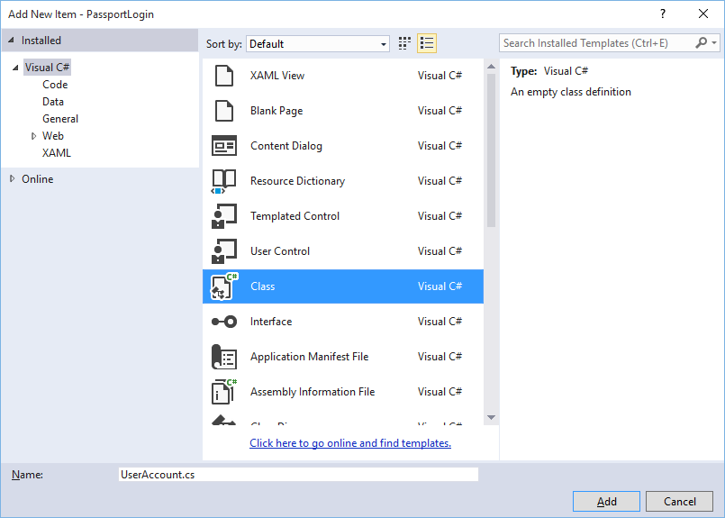

# <a name="create-a-windows-hello-login-service"></a>Windows Hello 로그인 서비스 만들기

\[일부 정보는 상업용으로 출시되기 전에 상당 부분 수정될 수 있는 시험판 제품과 관련이 있습니다. Microsoft는 여기에 제공된 정보에 관한 명시적 또는 묵시적 보증을 하지 않습니다.\]

이제 Windows 10 UWP(유니버설 Windows 플랫폼) 앱에서 기존 사용자 이름 및 암호 인증 시스템의 대안으로 Windows Hello를 사용하는 방법을 안내해드리는 전체 과정의 제2부를 시작하겠습니다. 이 문서에서는 1부 [Windows Hello 로그인 앱](microsoft-passport-login.md)의 마지막 내용을 이어 받아, 기능을 확장하여 Windows Hello를 기존 응용 프로그램에 통합하는 방법을 알려드립니다.

이 프로젝트를 빌드하려면 C# 및 XAML 사용 경험이 약간 필요합니다. 또한 Windows 10 컴퓨터에서 Visual Studio 2015(Community Edition 이상)를 사용해야 합니다.

## <a name="exercise-1-server-side-logic"></a>연습 1: 서버 쪽 논리


이 연습에서는 첫 번째 랩에 빌드된 Windows Hello 응용 프로그램을 시작하고 로컬 모의 서버와 데이터베이스를 만듭니다. 이 실습 교육의 목적은 Windows Hello를 기존 시스템에 통합하는 방법을 알려드리는 것입니다. 모의 서버와 모의 데이터베이스를 사용하여 관련이 없는 설정을 다수 제거합니다. 자체 응용 프로그램에서는 실제 서비스 및 데이터베이스로 모의 개체를 교체해야 합니다.

-   시작하려면 첫 번째 Passport 실습 교육에서 PassportLogin 솔루션을 엽니다.
-   모의 서버와 모의 데이터베이스를 구현하는 작업부터 시작합니다. "AuthService"라는 새 폴더를 만듭니다. 솔루션 탐색기에서 "PassportLogin(유니버설 Windows)" 솔루션을 마우스 오른쪽 단추로 클릭하고 추가 &gt; 새 폴더를 선택합니다.
-   모의 데이터베이스에 저장할 데이터에 대한 모델로 사용할 UserAccount 및 PassportDevices 클래스를 만듭니다. UserAccount는 기존 인증 서버에 구현된 사용자 모델과 유사합니다. AuthService 폴더를 마우스 오른쪽 단추로 클릭하고 "UserAccount.cs"라는 새 클래스를 추가합니다.

    

    

-   클래스 정의를 public으로 변경한 후 다음 public 속성을 추가합니다. 다음과 같은 참조가 필요합니다.

    ```cs
    using System.ComponentModel.DataAnnotations;
     
    namespace PassportLogin.AuthService
    {
        public class UserAccount
        {
            [Key, Required]
            public Guid UserId { get; set; }
            [Required]
            public string Username { get; set; }
            public string Password { get; set; }
            // public List<PassportDevice> PassportDevices = new List<PassportDevice>();
        }
    }
    ```

    주석으로 처리된 PassportDevices 목록을 확인했을 수 있습니다. 이는 현재 구현에서 기존 사용자 모델에 적용해야 하는 수정 작업입니다. PassportDevices 목록에는 deviceID, Windows Hello에서 만든 공개 키 및 [**KeyCredentialAttestationResult**](https://msdn.microsoft.com/library/windows/apps/dn973034)가 포함됩니다. 이 실습 교육의 경우 TPM(신뢰할 수 있는 플랫폼 모듈) 칩이 있는 디바이스에서 Windows Hello만 이것들을 제공하므로 keyAttestationResult를 구현해야 합니다. **KeyCredentialAttestationResult**는 여러 속성의 조합이며 데이터베이스에 저장 및 로드하기 위해 분할해야 합니다.

-   "PassportDevice.cs"라는 AuthService 폴더에 새 클래스를 만듭니다. 위에서 설명한 것처럼 이것은 Windows Hello 디바이스용 모델입니다. 클래스 정의를 public으로 변경하고 다음 속성을 추가합니다.

    ```cs
    namespace PassportLogin.AuthService
    {
        public class PassportDevice
        {
            // These are the new variables that will need to be added to the existing UserAccount in the Database
            // The DeviceName is used to support multiple devices for the one user.
            // This way the correct public key is easier to find as a new public key is made for each device.
            // The KeyAttestationResult is only used if the User device has a TPM (Trusted Platform Module) chip, 
            // in most cases it will not. So will be left out for this hands on lab.
            public Guid DeviceId { get; set; }
            public byte[] PublicKey { get; set; }
            // public KeyCredentialAttestationResult KeyAttestationResult { get; set; }
        }
    }
    ```

-   UserAccount.cs에서 되돌아가 Windows Hello 디바이스 목록의 주석 처리를 제거합니다.

    ```cs
    using System.Collections.Generic;
     
    namespace PassportLogin.AuthService
    {
        public class UserAccount
        {
            [Key, Required]
            public Guid UserId { get; set; }
            [Required]
            public string Username { get; set; }
            public string Password { get; set; }
            public List<PassportDevice> PassportDevices = new List<PassportDevice>();
        }
    }
    ```

-   만든 UserAccount 및 PassportDevice에 대한 모델과 함께 모의 데이터베이스로 사용할 다른 새 클래스를 AuthService에 만들어야 합니다. 사용자 계정 목록을 로컬로 저장하고 로드하는 모의 데이터베이스이기 때문입니다. 실제 환경에서는 데이터베이스 구현이 됩니다. "MockStore.cs"라는 AuthService에 새 클래스를 만듭니다. 클래스 정의를 public으로 변경합니다.
-   모의 저장소에서 사용자 계정 목록을 로컬로 저장하고 로드하므로 XmlSerializer를 사용하여 해당 목록을 저장하고 로드하는 논리를 구현할 수 있습니다. 또한 파일 이름과 저장 위치를 기억해야 합니다. MockStore.cs에서 다음을 구현합니다.

```cs
    using System.IO;
    using System.Linq;
    using System.Xml.Serialization;
    using Windows.Storage;

    namespace PassportLogin.AuthService
    {
        public class MockStore
        {
            private const string USER_ACCOUNT_LIST_FILE_NAME = "userAccountsList.txt";
            // This cannot be a const because the LocalFolder is accessed at runtime
            private string _userAccountListPath = Path.Combine(
                ApplicationData.Current.LocalFolder.Path, USER_ACCOUNT_LIST_FILE_NAME);
            private List<UserAccount> _mockDatabaseUserAccountsList;
     
    #region Save and Load Helpers
            /// <summary>
            /// Create and save a useraccount list file. (Replacing the old one)
            /// </summary>
            private async void SaveAccountListAsync()
            {
                string accountsXml = SerializeAccountListToXml();
     
                if (File.Exists(_userAccountListPath))
                {
                    StorageFile accountsFile = await StorageFile.GetFileFromPathAsync(_userAccountListPath);
                    await FileIO.WriteTextAsync(accountsFile, accountsXml);
                }
                else
                {
                    StorageFile accountsFile = await ApplicationData.Current.LocalFolder.CreateFileAsync(USER_ACCOUNT_LIST_FILE_NAME);
                    await FileIO.WriteTextAsync(accountsFile, accountsXml);
                }
            }
     
            /// <summary>
            /// Gets the useraccount list file and deserializes it from XML to a list of useraccount objects.
            /// </summary>
            /// <returns>List of useraccount objects</returns>
            private async void LoadAccountListAsync()
            {
                if (File.Exists(_userAccountListPath))
                {
                    StorageFile accountsFile = await StorageFile.GetFileFromPathAsync(_userAccountListPath);
     
                    string accountsXml = await FileIO.ReadTextAsync(accountsFile);
                    DeserializeXmlToAccountList(accountsXml);
                }
     
                // If the UserAccountList does not contain the sampleUser Initialize the sample users
                // This is only needed as it in a Hand on Lab to demonstrate a user migrating
                // In the real world user accounts would just be in a database
                if (!_mockDatabaseUserAccountsList.Any(f => f.Username.Equals("sampleUsername")))
                {
                    //If the list is empty InitializeSampleAccounts and return the list
                    //InitializeSampleUserAccounts();
                }
            }
     
            /// <summary>
            /// Uses the local list of accounts and returns an XML formatted string representing the list
            /// </summary>
            /// <returns>XML formatted list of accounts</returns>
            private string SerializeAccountListToXml()
            {
                XmlSerializer xmlizer = new XmlSerializer(typeof(List<UserAccount>));
                StringWriter writer = new StringWriter();
                xmlizer.Serialize(writer, _mockDatabaseUserAccountsList);
                return writer.ToString();
            }
     
            /// <summary>
            /// Takes an XML formatted string representing a list of accounts and returns a list object of accounts
            /// </summary>
            /// <param name="listAsXml">XML formatted list of accounts</param>
            /// <returns>List object of accounts</returns>
            private List<UserAccount> DeserializeXmlToAccountList(string listAsXml)
            {
                XmlSerializer xmlizer = new XmlSerializer(typeof(List<UserAccount>));
                TextReader textreader = new StreamReader(new MemoryStream(Encoding.UTF8.GetBytes(listAsXml)));
                return _mockDatabaseUserAccountsList = (xmlizer.Deserialize(textreader)) as List<UserAccount>;
            }
    #endregion
        }
    }
```

-   Load 메서드에서 InitializeSampleUserAccounts 메서드가 주석으로 처리된 것을 알 수 있습니다. MockStore.cs에서 이 메서드를 만들어야 합니다. 이 메서드는 로그인이 수행될 수 있도록 사용자 계정 목록을 채웁니다. 실제 환경에서 사용자 데이터베이스는 이미 채워집니다. 이 단계에서 사용자 목록 및 호출 부하를 초기화할 생성자도 만듭니다.

    ```cs
    namespace PassportLogin.AuthService
    {
        public class MockStore
        {
            private const string USER_ACCOUNT_LIST_FILE_NAME = "userAccountsList.txt";
            // This cannot be a const because the LocalFolder is accessed at runtime
            private string _userAccountListPath = Path.Combine(
                ApplicationData.Current.LocalFolder.Path, USER_ACCOUNT_LIST_FILE_NAME);
            private List<UserAccount> _mockDatabaseUserAccountsList;
     
            public MockStore()
            {
                _mockDatabaseUserAccountsList = new List& lt; UserAccount & gt; ();
                LoadAccountListAsync();
            }

            private void InitializeSampleUserAccounts()
            {
                // Create a sample Traditional User Account that only has a Username and Password
                // This will be used initially to demonstrate how to migrate to use Windows Hello

                UserAccount sampleUserAccount = new UserAccount()
                {
                    UserId = Guid.NewGuid(),
                    Username = "sampleUsername",
                    Password = "samplePassword",
                };

                // Add the sampleUserAccount to the _mockDatabase
                _mockDatabaseUserAccountsList.Add(sampleUserAccount);
                SaveAccountListAsync();
            }
        }
    }
    ```

-   이제 InitalizeSampleUserAccounts 메서드가 있으므로 LoadAccountListAsync 메서드에서 메서드 호출의 주석 처리를 제거합니다.

    ```cs
    private async void LoadAccountListAsync()
    {
        if (File.Exists(_userAccountListPath))
        {
            StorageFile accountsFile = await StorageFile.GetFileFromPathAsync(_userAccountListPath);

            string accountsXml = await FileIO.ReadTextAsync(accountsFile);
            DeserializeXmlToAccountList(accountsXml);
        }

        // If the UserAccountList does not contain the sampleUser Initialize the sample users
        // This is only needed as it in a Hand on Lab to demonstrate a user migrating
        // In the real world user accounts would just be in a database
        if (!_mockDatabaseUserAccountsList.Any(f = > f.Username.Equals("sampleUsername")))
                {
            //If the list is empty InitializeSampleAccounts and return the list
            InitializeSampleUserAccounts();
        }
    }
    ```

-   이제 모의 저장소의 사용자 계정 목록을 저장하고 로드할 수 있습니다. 응용 프로그램의 다른 부분에 이 목록에 대한 액세스 권한이 있으므로 이 데이터를 검색하려면 몇 가지 메서드가 있어야 합니다. InitializeSampleUserAccounts 메서드 아래에 다음 get 메서드를 추가합니다. 그러면 사용자 ID, 단일 사용자, 특정 Windows Hello 디바이스 사용자 목록을 가져올 수 있으며, 특정 디바이스에서 사용자의 공개 키를 가져올 수도 있습니다.

    ```cs
    public Guid GetUserId(string username)
    {
        if (_mockDatabaseUserAccountsList.Any())
        {
            UserAccount account = _mockDatabaseUserAccountsList.FirstOrDefault(f => f.Username.Equals(username));
            if (account != null)
            {
                return account.UserId;
            }
        }
        return Guid.Empty;
    }

    public UserAccount GetUserAccount(Guid userId)
    {
        return _mockDatabaseUserAccountsList.FirstOrDefault(f => f.UserId.Equals(userId));
    }

    public List<UserAccount> GetUserAccountsForDevice(Guid deviceId)
    {
        List<UserAccount> usersForDevice = new List<UserAccount>();

        foreach (UserAccount account in _mockDatabaseUserAccountsList)
        {
            if (account.PassportDevices.Any(f => f.DeviceId.Equals(deviceId)))
            {
                usersForDevice.Add(account);
            }
        }

        return usersForDevice;
    }

    public byte[] GetPublicKey(Guid userId, Guid deviceId)
    {
        UserAccount account = _mockDatabaseUserAccountsList.FirstOrDefault(f => f.UserId.Equals(userId));
        if (account != null)
        {
            if (account.PassportDevices.Any())
            {
                return account.PassportDevices.FirstOrDefault(p => p.DeviceId.Equals(deviceId)).PublicKey;
            }
        }
        return null;
    }
    ```

-   구현할 다음 메서드에서는 계정 추가 및 제거뿐 아니라 디바이스 제거까지 단순 작업을 처리합니다. Windows Hello는 디바이스별로 지정되므로 디바이스 제거가 필요합니다. Windows Hello는 로그인하는 각 디바이스에 대해 새로운 공개 키 및 개인 키 쌍을 만듭니다. 이는 로그인하는 각 디바이스에 대해 다른 암호를 가지는 것과 같습니다. 다만 서버에서 기억하는 모든 암호를 기억할 필요는 없습니다. MockStore.cs에 다음 메서드를 추가합니다.

    ```cs
    public UserAccount AddAccount(string username)
    {
        UserAccount newAccount = null;
        try
        {
            newAccount = new UserAccount()
            {
                UserId = Guid.NewGuid(),
                Username = username,
            };

            _mockDatabaseUserAccountsList.Add(newAccount);
            SaveAccountListAsync();
        }
        catch (Exception)
        {
            throw;
        }
        return newAccount;
    }

    public bool RemoveAccount(Guid userId)
    {
        UserAccount userAccount = GetUserAccount(userId);
        if (userAccount != null)
        {
            _mockDatabaseUserAccountsList.Remove(userAccount);
            SaveAccountListAsync();
            return true;
        }
        return false;
    }

    public bool RemoveDevice(Guid userId, Guid deviceId)
    {
        UserAccount userAccount = GetUserAccount(userId);
        PassportDevice deviceToRemove = null;
        if (userAccount != null)
        {
            foreach (PassportDevice device in userAccount.PassportDevices)
            {
                if (device.DeviceId.Equals(deviceId))
                {
                    deviceToRemove = device;
                    break;
                }
            }
        }

        if (deviceToRemove != null)
        {
            //Remove the PassportDevice
            userAccount.PassportDevices.Remove(deviceToRemove);
            SaveAccountListAsync();
        }

        return true;
    }
    ```

- MockStore 클래스에서 Windows Hello 관련 정보를 기존 UserAccount에 추가할 메서드를 추가합니다. 이 메서드는 PassportUpdateDetails라고 하며 사용자를 확인하는 매개 변수 및 Windows Hello 세부 정보를 사용합니다. KeyAttestationResult는 PassportDevice를 만들 때 주석으로 처리되었으며 실제 환경의 응용 프로그램에서 필요합니다.

    ```cs
    using Windows.Security.Credentials;

    public void PassportUpdateDetails(Guid userId, Guid deviceId, byte[] publicKey, 
        KeyCredentialAttestationResult keyAttestationResult)
    {
        UserAccount existingUserAccount = GetUserAccount(userId);
        if (existingUserAccount != null)
        {
            if (!existingUserAccount.PassportDevices.Any(f => f.DeviceId.Equals(deviceId)))
            {
                existingUserAccount.PassportDevices.Add(new PassportDevice()
                {
                    DeviceId = deviceId,
                    PublicKey = publicKey,
                    // KeyAttestationResult = keyAttestationResult
                });
            }
        }
        SaveAccountListAsync();
    }
    ```

- 이제 MockStore 클래스가 완료되어 private으로 간주되어야 하는 데이터베이스를 나타냅니다. MockStore에 액세스하려면 AuthService 클래스에서 데이터베이스 데이터를 조작해야 합니다. AuthService 폴더에서 "AuthService.cs"라는 새 클래스를 만듭니다. 클래스 정의를 public으로 변경하고 단일 인스턴스만 만들어지도록 singleton 인스턴스 패턴을 추가합니다.

    ```cs
    namespace PassportLogin.AuthService
    {
        public class AuthService
        {
            // Singleton instance of the AuthService
            // The AuthService is a mock of what a real world server and service implementation would be
            private static AuthService _instance;
            public static AuthService Instance
            {
                get
                {
                    if (null == _instance)
                    {
                        _instance = new AuthService();
                    }
                    return _instance;
                }
            }

            private AuthService()
            { }
        }
    }
    ```

-   AuthService 클래스에서는 MockStore 클래스의 인스턴스를 만들고 MockStore 개체의 속성에 대한 액세스 권한을 제공해야 합니다.

    ```cs
    namespace PassportLogin.AuthService
    {
        public class AuthService
        {
            //Singleton instance of the AuthService
            //The AuthService is a mock of what a real world server and database implementation would be
            private static AuthService _instance;
            public static AuthService Instance
            {
                get
                {
                    if (null == _instance)
                    {
                        _instance = new AuthService();
                    }
                    return _instance;
                }
            }
     
            private MockStore _mockStore = new MockStore();
     
            public Guid GetUserId(string username)
            {
                return _mockStore.GetUserId(username);
            }
     
            public UserAccount GetUserAccount(Guid userId)
            {
                return _mockStore.GetUserAccount(userId);
            }
     
            public List<UserAccount> GetUserAccountsForDevice(Guid deviceId)
            {
                return _mockStore.GetUserAccountsForDevice(deviceId);
            }
        }
    }
    ```

-   MockStore 개체의 Passport 세부 정보를 추가, 제거 및 업데이트하는 메서드에 액세스할 AuthService 클래스의 메서드가 있어야 합니다. AuthService 클래스 파일의 끝에 다음 메서드를 추가합니다.

    ```cs
    using Windows.Security.Credentials;

    public void Register(string username)
    {
        _mockStore.AddAccount(username);
    }

    public bool PassportRemoveUser(Guid userId)
    {
        return _mockStore.RemoveAccount(userId);
    }

    public bool PassportRemoveDevice(Guid userId, Guid deviceId)
    {
        return _mockStore.RemoveDevice(userId, deviceId);
    }

    public void PassportUpdateDetails(Guid userId, Guid deviceId, byte[] publicKey, 
        KeyCredentialAttestationResult keyAttestationResult)
    {
        _mockStore.PassportUpdateDetails(userId, deviceId, publicKey, keyAttestationResult);
    }
    ```

-   AuthService 클래스에서 자격 증명의 유효성을 검사하는 메서드를 제공해야 합니다. 이 메서드는 사용자 이름과 암호를 사용하며 계정이 있는지 그리고 암호가 유효한지 확인합니다. 이 메서드는 사용자가 인증되었는지 확인하며 기존 시스템에 동일한 메서드가 있습니다. 다음 ValidateCredentials를 AuthService.cs 파일에 추가합니다.

    ```cs
    public bool ValidateCredentials(string username, string password)
    {
        if (!string.IsNullOrEmpty(username) && !string.IsNullOrEmpty(password))
        {
            // This would be used for existing accounts migrating to use Passport
            Guid userId = GetUserId(username);
            if (userId != Guid.Empty)
            {
                UserAccount account = GetUserAccount(userId);
                if (account != null)
                {
                    if (string.Equals(password, account.Password))
                    {
                        return true;
                    }
                }
            }
        }
        return false;
    }
    ```

-   클라이언트에게 청구하는 사용자의 유효성을 검증하기 위해 질문을 반환할 요청 질문 메서드가 AuthService 클래스에 있어야 합니다. 그런 다음 AuthService 클래스에 서명된 질문을 클라이언트에게서 다시 받는 메서드가 필요합니다. 이 실습 교육의 경우 서명된 질문이 완료되었는지 확인하는 메서드가 완료되지 않은 채 남아 있습니다. Windows Hello를 기존 인증 시스템에 구현할 때마다 약간씩 달라집니다. 서버에 저장된 공개 키는 클라이언트가 서버에 반환한 결과와 일치해야 합니다. 이러한 두 메서드를 AuthService.cs에 추가합니다.

    ```cs
    using Windows.Security.Cryptography;
    using Windows.Storage.Streams;

    public IBuffer PassportRequestChallenge()
    {
        return CryptographicBuffer.ConvertStringToBinary("ServerChallenge", BinaryStringEncoding.Utf8);
    }

    public bool SendServerSignedChallenge(Guid userId, Guid deviceId, byte[] signedChallenge)
    {
        // Depending on your company polices and procedures this step will be different
        // It is at this point you will need to validate the signedChallenge that is sent back from the client.
        // Validation is used to ensure the correct user is trying to access this account. 
        // The validation process will use the signedChallenge and the stored PublicKey 
        // for the username and the specific device signin is called from.
        // Based on the validation result you will return a bool value to allow access to continue or to block the account.

        // For this sample validation will not happen as a best practice solution does not apply and will need to 
           // be configured for each company.
        // Simply just return true.

        // You could get the User's Public Key with something similar to the following:
        byte[] userPublicKey = _mockStore.GetPublicKey(userId, deviceId);
        return true;
    }
    ```

## <a name="exercise-2-client-side-logic"></a>연습 2: 클라이언트 쪽 논리

이 연습에서 AuthService 클래스를 사용하도록 클라이언트 쪽 뷰 및 도우미 클래스를 첫 번째 랩에서 변경합니다. 실제 환경에서 AuthService가 인증 서버가 되고 서버에서 데이터를 보내고 받으려면 Web API를 사용해야 합니다. 이 실습 교육의 경우 단순화를 위해 클라이언트와 서버 모두 로컬입니다. 목표는 Windows Hello API 사용법을 배우는 것입니다.

-   AuthService 클래스에서 계정 목록을 로드하는 MockStore의 인스턴스를 만들므로 MainPage.xaml.cs에서 로드된 메서드의 AccountHelper.LoadAccountListAsync 메서드 호출을 제거할 수 있습니다. 이제 로드된 메서드는 아래와 같이 표시되어야 합니다. 아무것도 대기하고 있지 않으므로 비동기 메서드 정의가 제거됩니다.

    ```cs
    private void MainPage_Loaded(object sender, RoutedEventArgs e)
    {
        Frame.Navigate(typeof(UserSelection));
    }
    ```

-   Passport 입력을 요청하도록 로그인 페이지 인터페이스를 업데이트합니다. 이 실습 교육에서는 기존 시스템을 마이그레이션하여 Windows Hello를 사용하도록 하는 방법과 기존 계정이 사용자 이름 및 암호를 얻는 방법을 알려드립니다. 또한 XAML 하단의 설명이 기본 암호를 포함하도록 업데이트합니다. Login.xaml에서 다음 XAML 업데이트

    ```xml
    <Grid Background="{ThemeResource ApplicationPageBackgroundThemeBrush}">
      <StackPanel Orientation="Vertical">
        <TextBlock Text="Login" FontSize="36" Margin="4" TextAlignment="Center"/>

        <TextBlock x:Name="ErrorMessage" Text="" FontSize="20" Margin="4" Foreground="Red" TextAlignment="Center"/>

        <TextBlock Text="Enter your credentials below" Margin="0,0,0,20"
                   TextWrapping="Wrap" Width="300"
                   TextAlignment="Center" VerticalAlignment="Center" FontSize="16"/>

        <StackPanel Orientation="Horizontal" HorizontalAlignment="Center">
          <!-- Username Input -->
          <TextBlock x:Name="UserNameTextBlock" Text="Username: "
                 FontSize="20" Margin="4" Width="100"/>
          <TextBox x:Name="UsernameTextBox" PlaceholderText="sampleUsername" Width="200" Margin="4"/>
        </StackPanel>

        <StackPanel Orientation="Horizontal" HorizontalAlignment="Center">
          <!-- Password Input -->
          <TextBlock x:Name="PasswordTextBlock" Text="Password: "
                 FontSize="20" Margin="4" Width="100"/>
          <PasswordBox x:Name="PasswordBox" PlaceholderText="samplePassword" Width="200" Margin="4"/>
        </StackPanel>

        <Button x:Name="PassportSignInButton" Content="Login" Background="DodgerBlue" Foreground="White"
            Click="PassportSignInButton_Click" Width="80" HorizontalAlignment="Center" Margin="0,20"/>

        <TextBlock Text="Don't have an account?"
                    TextAlignment="Center" VerticalAlignment="Center" FontSize="16"/>
        <TextBlock x:Name="RegisterButtonTextBlock" Text="Register now"
                   PointerPressed="RegisterButtonTextBlock_OnPointerPressed"
                   Foreground="DodgerBlue"
                   TextAlignment="Center" VerticalAlignment="Center" FontSize="16"/>

        <Border x:Name="PassportStatus" Background="#22B14C"
                   Margin="0,20" Height="100">
          <TextBlock x:Name="PassportStatusText" Text="Windows Hello is ready to use!"
                 Margin="4" TextAlignment="Center" VerticalAlignment="Center" FontSize="20"/>
        </Border>

        <TextBlock x:Name="LoginExplaination" FontSize="24" TextAlignment="Center" TextWrapping="Wrap" 
            Text="Please Note: To demonstrate a login, validation will only occur using the default username 
            'sampleUsername' and default password 'samplePassword'"/>

      </StackPanel>
    </Grid>
    ```

-   로그인 클래스 코드 숨김에서 클래스 맨 위의 Account private 변수를 변경하여 UserAccount가 되도록 해야 합니다. 형식을 캐스트할 OnNavigateTo 이벤트를 변경하여 UserAccount가 되도록 합니다. 다음과 같은 참조가 필요합니다.

    ```cs
    using PassportLogin.AuthService;

    namespace PassportLogin.Views
    {
        public sealed partial class Login : Page
        {
            private UserAccount _account;
            private bool _isExistingAccount;

            public Login()
            {
                this.InitializeComponent();
            }

            protected override async void OnNavigatedTo(NavigationEventArgs e)
            {
                //Check Windows Hello is setup and available on this machine
                if (await MicrosoftPassportHelper.MicrosoftPassportAvailableCheckAsync())
                {
                    if (e.Parameter != null)
                    {
                        _isExistingAccount = true;
                        //Set the account to the existing account being passed in
                        _account = (UserAccount)e.Parameter;
                        UsernameTextBox.Text = _account.Username;
                        SignInPassport();
                    }
                }
            }
        }
    }
    ```

-   로그인 페이지에서 이전 계정 개체 대신 UserAccount 개체를 사용하므로 MicrosoftPassportHelper.cs를 업데이트하여 일부 메서드에 대해 UserAccount를 매개 변수로 사용해야 합니다. CreatePassportKeyAsync, RemovePassportAccountAsync 및 GetPassportAuthenticationMessageAsync 메서드에 대해 다음 매개 변수를 변경해야 합니다. UserAccount 클래스에는 UserId에 대한 Guid가 있으므로 더 많은 곳에서 더 특정한 ID를 사용하기 시작합니다.

    ```cs
    public static async Task<bool> CreatePassportKeyAsync(Guid userId, string username)
    {
        KeyCredentialRetrievalResult keyCreationResult = await KeyCredentialManager.RequestCreateAsync(username, KeyCredentialCreationOption.ReplaceExisting);
    }

    public static async void RemovePassportAccountAsync(UserAccount account)
    {

    }
    public static async Task<bool> GetPassportAuthenticationMessageAsync(UserAccount account)
    {
        KeyCredentialRetrievalResult openKeyResult = await KeyCredentialManager.OpenAsync(account.Username);
        //Calling OpenAsync will allow the user access to what is available in the app and will not require user credentials again.
        //If you wanted to force the user to sign in again you can use the following:
        //var consentResult = await Windows.Security.Credentials.UI.UserConsentVerifier.RequestVerificationAsync(account.Username);
        //This will ask for the either the password of the currently signed in Microsoft Account or the PIN used for Windows Hello.

        if (openKeyResult.Status == KeyCredentialStatus.Success)
        {
            //If OpenAsync has succeeded, the next thing to think about is whether the client application requires access to backend services.
            //If it does here you would Request a challenge from the Server. The client would sign this challenge and the server
            //would check the signed challenge. If it is correct it would allow the user access to the backend.
            //You would likely make a new method called RequestSignAsync to handle all this
            //e.g. RequestSignAsync(openKeyResult);
            //Refer to the second Windows Hello sample for information on how to do this.

            //For this sample there is not concept of a server implemented so just return true.
            return true;
        }
        else if (openKeyResult.Status == KeyCredentialStatus.NotFound)
        {
            //If the _account is not found at this stage. It could be one of two errors. 
            //1. Windows Hello has been disabled
            //2. Windows Hello has been disabled and re-enabled cause the Windows Hello Key to change.
            //Calling CreatePassportKey and passing through the account will attempt to replace the existing Windows Hello Key for that account.
            //If the error really is that Windows Hello is disabled then the CreatePassportKey method will output that error.
            if (await CreatePassportKeyAsync(account.UserId, account.Username))
            {
                //If the Passport Key was again successfully created, Windows Hello has just been reset.
                //Now that the Passport Key has been reset for the _account retry sign in.
                return await GetPassportAuthenticationMessageAsync(account);
            }
        }

        // Can't use Passport right now, try again later
        return false;
    }
    ```

-   Login.xaml.cs 파일의 SignInPassport 메서드에서 AccountHelper 대신 AuthService를 사용하도록 업데이트해야 합니다. 자격 증명의 유효성 검사는 AuthService를 통해 수행합니다. 이 실습 교육의 경우 유일하게 구성된 계정은 "sampleUsername"입니다. 이 계정은 MockStore.cs의 InitializeSampleUserAccounts 메서드에 만들어집니다. 이제 Login.xaml.cs에서 SignInPassport 메서드를 업데이트하여 아래 코드 조각을 반영합니다.

    ```cs
    private async void SignInPassportAsync()
    {
        if (_isExistingLocalAccount)
        {
            if (await MicrosoftPassportHelper.GetPassportAuthenticationMessageAsync(_account))
            {
                Frame.Navigate(typeof(Welcome), _account);
            }
        }
        else if (AuthService.AuthService.Instance.ValidateCredentials(UsernameTextBox.Text, PasswordBox.Password))
        {
            Guid userId = AuthService.AuthService.Instance.GetUserId(UsernameTextBox.Text);

            if (userId != Guid.Empty)
            {
                //Now that the account exists on server try and create the necessary passport details and add them to the account
                bool isSuccessful = await MicrosoftPassportHelper.CreatePassportKeyAsync(userId, UsernameTextBox.Text);
                if (isSuccessful)
                {
                    Debug.WriteLine("Successfully signed in with Windows Hello!");
                    //Navigate to the Welcome Screen. 
                    _account = AuthService.AuthService.Instance.GetUserAccount(userId);
                    Frame.Navigate(typeof(Welcome), _account);
                }
                else
                {
                    //The passport account creation failed.
                    //Remove the account from the server as passport details were not configured
                    AuthService.AuthService.Instance.PassportRemoveUser(userId);

                    ErrorMessage.Text = "Account Creation Failed";
                }
            }
        }
        else
        {
            ErrorMessage.Text = "Invalid Credentials";
        }
    }
    ```

-   Windows Hello는 각 디바이스의 계정마다 다른 공개 키 및 개인 키 쌍을 만들므로 환영 페이지에서는 로그인된 계정에 대한 등록 디바이스 목록을 표시하고 각 디바이스를 무시할 수 있도록 허용해야 합니다. Welcome.xaml에서 다음 XAML을 ForgetButton 아래에 추가합니다. 이렇게 하면 무시 디바이스 단추, 오류 텍스트 영역 및 모든 디바이스를 표시할 목록을 구현하게 됩니다.

    ```xml
    <Grid Background="{ThemeResource ApplicationPageBackgroundThemeBrush}">
      <StackPanel Orientation="Vertical">
        <TextBlock x:Name="Title" Text="Welcome" FontSize="40" TextAlignment="Center"/>
        <TextBlock x:Name="UserNameText" FontSize="28" TextAlignment="Center" Foreground="Black"/>

        <Button x:Name="BackToUserListButton" Content="Back to User List" Click="Button_Restart_Click"
               HorizontalAlignment="Center" Margin="0,20" Foreground="White" Background="DodgerBlue"/>

        <Button x:Name="ForgetButton" Content="Forget Me" Click="Button_Forget_User_Click"
               Foreground="White"
               Background="Gray"
               HorizontalAlignment="Center"/>

        <Button x:Name="ForgetDeviceButton" Content="Forget Device" Click="Button_Forget_Device_Click"
               Foreground="White"
               Background="Gray"
               Margin="0,40,0,20"
               HorizontalAlignment="Center"/>

        <TextBlock x:Name="ForgetDeviceErrorTextBlock" Text="Select a device first"
                  TextWrapping="Wrap" Width="300" Foreground="Red"
                  TextAlignment="Center" VerticalAlignment="Center" FontSize="16" Visibility="Collapsed"/>

        <ListView x:Name="UserListView" MaxHeight="500" MinWidth="350" Width="350" HorizontalAlignment="Center">
          <ListView.ItemTemplate>
            <DataTemplate>
              <Grid Background="Gray" Height="50" Width="350" HorizontalAlignment="Center" VerticalAlignment="Stretch" >
                <TextBlock Text="{Binding DeviceId}" HorizontalAlignment="Center" TextAlignment="Center" VerticalAlignment="Center"
                          Foreground="White"/>
              </Grid>
            </DataTemplate>
          </ListView.ItemTemplate>
        </ListView>
      </StackPanel>
    </Grid>
    ```

-   Welcome.xaml.cs 파일에서 클래스의 맨 위쪽에 있는 private Account 변수를 private UserAccount 변수가 되도록 변경해야 합니다. 그런 다음 OnNavigatedTo 메서드를 업데이트하여 AuthService를 사용하고 현재 계정에 대한 정보를 검색합니다. 계정 정보가 있으면 디바이스를 표시하도록 목록의 itemsource를 설정할 수 있습니다. AuthService 네임스페이스에 대한 참조를 추가해야 합니다.

    ```cs
    using PassportLogin.AuthService;

    namespace PassportLogin.Views
    {
        public sealed partial class Welcome : Page
        {
            private UserAccount _activeAccount;

            public Welcome()
            {
                InitializeComponent();
            }

            protected override void OnNavigatedTo(NavigationEventArgs e)
            {
                _activeAccount = (UserAccount)e.Parameter;
                if (_activeAccount != null)
                {
                    UserAccount account = AuthService.AuthService.Instance.GetUserAccount(_activeAccount.UserId);
                    if (account != null)
                    {
                        UserListView.ItemsSource = account.PassportDevices;
                        UserNameText.Text = account.Username;
                    }
                }
            }
        }
    }
    ```

-   계정을 제거할 때 AuthService를 사용하므로 Button\_Forget\_User\_Click 메서드의 AccountHelper에 대한 참조를 제거할 수 있습니다. 이제 메서드가 아래와 같이 표시됩니다.

    ```cs
    private void Button_Forget_User_Click(object sender, RoutedEventArgs e)
    {
        //Remove it from Windows Hello
        MicrosoftPassportHelper.RemovePassportAccountAsync(_activeAccount);

        Debug.WriteLine("User " + _activeAccount.Username + " deleted.");

        //Navigate back to UserSelection page.
        Frame.Navigate(typeof(UserSelection));
    }
    ```

-   MicrosoftPassportHelper 메서드에서는 계정을 제거하는 데 AuthService를 사용하지 않습니다. AuthService를 호출하고 userId를 전달해야 합니다.

    ```cs
    public static async void RemovePassportAccountAsync(UserAccount account)
    {
        //Open the account with Windows Hello
        KeyCredentialRetrievalResult keyOpenResult = await KeyCredentialManager.OpenAsync(account.Username);

        if (keyOpenResult.Status == KeyCredentialStatus.Success)
        {
            // In the real world you would send key information to server to unregister
            AuthService.AuthService.Instance.PassportRemoveUser(account.UserId);
        }

        //Then delete the account from the machines list of Passport Accounts
        await KeyCredentialManager.DeleteAsync(account.Username);
    }
    ```

-   환영 페이지 클래스 구현을 완료하려면 디바이스가 제거될 수 있도록 하는 메서드를 MicrosoftPassportHelper.cs에 만들어야 합니다. AuthService에서 PassportRemoveDevice를 호출할 새 메서드를 만듭니다.

    ```cs
    public static void RemovePassportDevice(UserAccount account, Guid deviceId)
    {
        AuthService.AuthService.Instance.PassportRemoveDevice(account.UserId, deviceId);
    }
    ```

-   Welcome.xaml.cs에서 디바이스 무시 클릭 이벤트를 구현합니다. 이는 디바이스 목록에서 선택한 디바이스를 사용하고 Passport 도우미를 사용하여 디바이스 제거를 호출합니다.

    ```cs
    private void Button_Forget_Device_Click(object sender, RoutedEventArgs e)
    {
        PassportDevice selectedDevice = UserListView.SelectedItem as PassportDevice;
        if (selectedDevice != null)
        {
            //Remove it from Windows Hello
            MicrosoftPassportHelper.RemovePassportDevice(_activeAccount, selectedDevice.DeviceId);

            Debug.WriteLine("User " + _activeAccount.Username + " deleted.");

            if (!UserListView.Items.Any())
            {
                //Navigate back to UserSelection page.
                Frame.Navigate(typeof(UserSelection));
            }
        }
        else
        {
            ForgetDeviceErrorTextBlock.Visibility = Visibility.Visible;
        }
    }
    ```

-   업데이트할 다음 페이지는 UserSelection 페이지입니다. UserSelection 페이지에서는 현재 디바이스에 대한 모든 사용자 계정을 검색하는 데 AuthService를 사용해야 합니다. 현재 해당 디바이스에 대한 사용자 계정을 반환할 수 있도록 디바이스 ID를 가져와서 AuthService에 전달하는 방법이 없습니다. Utils 폴더에 "Helpers.cs"라는 새 클래스를 만듭니다. 클래스 정의를 public static이 되도록 변경한 다음 현재 디바이스 ID를 검색할 수 있도록 다음 메서드를 추가합니다.

    ```cs
    using Windows.Security.ExchangeActiveSyncProvisioning;

    namespace PassportLogin.Utils
    {
        public static class Helpers
        {
            public static Guid GetDeviceId()
            {
                //Get the Device ID to pass to the server
                EasClientDeviceInformation deviceInformation = new EasClientDeviceInformation();
                return deviceInformation.Id;
            }
        }
    }
    ```

-   UserSelection 페이지 클래스에서 사용자 인터페이스가 아닌 코드 숨김만 변경해야 합니다. UserSelection.xaml.cs에서 로드된 메서드와 사용자 선택 메서드를 업데이트하여 Account 클래스 대신 UserAccount 클래스를 사용합니다. 또한 AuthService를 통해 이 디바이스에 대한 모든 사용자를 가져와야 합니다.

    ```cs
    using System.Linq;
    using PassportLogin.AuthService;

    namespace PassportLogin.Views
    {
        public sealed partial class UserSelection : Page
        {
            public UserSelection()
            {
                InitializeComponent();
                Loaded += UserSelection_Loaded;
            }

            private void UserSelection_Loaded(object sender, RoutedEventArgs e)
            {
                List<UserAccount> accounts = AuthService.AuthService.Instance.GetUserAccountsForDevice(Helpers.GetDeviceId());

                if (accounts.Any())
                {
                    UserListView.ItemsSource = accounts;
                    UserListView.SelectionChanged += UserSelectionChanged;
                }
                else
                {
                    //If there are no accounts navigate to the LoginPage
                    Frame.Navigate(typeof(Login));
                }
            }

            /// <summary>
            /// Function called when an account is selected in the list of accounts
            /// Navigates to the Login page and passes the chosen account
            /// </summary>
            private void UserSelectionChanged(object sender, RoutedEventArgs e)
            {
                if (((ListView)sender).SelectedValue != null)
                {
                    UserAccount account = (UserAccount)((ListView)sender).SelectedValue;
                    if (account != null)
                    {
                        Debug.WriteLine("Account " + account.Username + " selected!");
                    }
                    Frame.Navigate(typeof(Login), account);
                }
            }
        }
    }
    ```

-   PassportRegister 페이지에서 코드 숨김을 업데이트해야 하며 사용자 인터페이스는 변경할 필요가 없습니다. PassportRegister.xaml.cs에서 클래스 맨 위쪽의 private Account 변수는 더 이상 필요하지 않으므로 제거합니다. RegisterButton 클릭 이벤트를 업데이트하여 AuthService를 사용합니다. 이 메서드에서 새 UserAccount를 만든 다음 Passport 세부 정보를 업데이트하려고 합니다. Passport에서 Passport 키를 만들지 못한 경우 등록 프로세스가 실패했으므로 계정이 제거됩니다.

    ```cs
    private async void RegisterButton_Click_Async(object sender, RoutedEventArgs e)
    {
        ErrorMessage.Text = "";

        //Validate entered credentials are acceptable
        if (!string.IsNullOrEmpty(UsernameTextBox.Text))
        {
            //Register an Account on the AuthService so that we can get back a userId
            AuthService.AuthService.Instance.Register(UsernameTextBox.Text);
            Guid userId = AuthService.AuthService.Instance.GetUserId(UsernameTextBox.Text);

            if (userId != Guid.Empty)
            {
                //Now that the account exists on server try and create the necessary passport details and add them to the account
                bool isSuccessful = await MicrosoftPassportHelper.CreatePassportKeyAsync(userId, UsernameTextBox.Text);
                if (isSuccessful)
                {
                    //Navigate to the Welcome Screen. 
                    Frame.Navigate(typeof(Welcome), AuthService.AuthService.Instance.GetUserAccount(userId));
                }
                else
                {
                    //The passport account creation failed.
                    //Remove the account from the server as passport details were not configured
                    AuthService.AuthService.Instance.PassportRemoveUser(userId);

                    ErrorMessage.Text = "Account Creation Failed";
                }
            }
        }
        else
        {
            ErrorMessage.Text = "Please enter a username";
        }
    }
    ```

-   응용 프로그램을 빌드 및 실행합니다(F5). "sampleUsername" 및 "samplePassword" 자격 증명을 사용하여 샘플 사용자 계정으로 로그인합니다. 환영 화면에서 디바이스 무시 단추가 보이지만 디바이스는 없을 수 있습니다. 사용자를 만들거나 마이그레이션하여 Windows Hello로 작업하도록 하는 경우 passport 정보는 AuthService로 푸시되지 않습니다.

    

    

-   passport 정보를 AuthService로 가져오려면 MicrosoftPassportHelper.cs를 업데이트해야 합니다. CreatePassportKeyAsync 메서드에서 성공하는 경우 true를 반환하는 작업 외에 KeyAttestation을 가져오려고 하는 새 메서드를 호출해야 합니다. 이 실습 교육에서는 AuthService에 이 정보를 기록하지 않지만 클라이언트 쪽에서 이 정보를 가져오는 방법을 배우게 됩니다. CreatePassportKeyAsync 메서드를 업데이트합니다.

    ```cs
    public static async Task<bool> CreatePassportKeyAsync(Guid userId, string username)
    {
        KeyCredentialRetrievalResult keyCreationResult = await KeyCredentialManager.RequestCreateAsync(username, KeyCredentialCreationOption.ReplaceExisting);

        switch (keyCreationResult.Status)
        {
            case KeyCredentialStatus.Success:
                Debug.WriteLine("Successfully made key");
                await GetKeyAttestationAsync(userId, keyCreationResult);
                return true;
            case KeyCredentialStatus.UserCanceled:
                Debug.WriteLine("User cancelled sign-in process.");
                break;
            case KeyCredentialStatus.NotFound:
                // User needs to setup Windows Hello
                Debug.WriteLine("Windows Hello is not setup!\nPlease go to Windows Settings and set up a PIN to use it.");
                break;
            default:
                break;
        }

        return false;
    }
    ```

-   MicrosoftPassportHelper.cs에 이 GetKeyAttestationAsync 메서드를 만듭니다. 이 메서드에서는 특정 디바이스에서 각 계정에 대해 Windows Hello가 제공할 수 있는 필요 정보를 모두 가져오는 방법을 설명합니다.

    ```cs
    using Windows.Storage.Streams;

    private static async Task GetKeyAttestationAsync(Guid userId, KeyCredentialRetrievalResult keyCreationResult)
    {
        KeyCredential userKey = keyCreationResult.Credential;
        IBuffer publicKey = userKey.RetrievePublicKey();
        KeyCredentialAttestationResult keyAttestationResult = await userKey.GetAttestationAsync();
        IBuffer keyAttestation = null;
        IBuffer certificateChain = null;
        bool keyAttestationIncluded = false;
        bool keyAttestationCanBeRetrievedLater = false;
        KeyCredentialAttestationStatus keyAttestationRetryType = 0;

        if (keyAttestationResult.Status == KeyCredentialAttestationStatus.Success)
        {
            keyAttestationIncluded = true;
            keyAttestation = keyAttestationResult.AttestationBuffer;
            certificateChain = keyAttestationResult.CertificateChainBuffer;
            Debug.WriteLine("Successfully made key and attestation");
        }
        else if (keyAttestationResult.Status == KeyCredentialAttestationStatus.TemporaryFailure)
        {
            keyAttestationRetryType = KeyCredentialAttestationStatus.TemporaryFailure;
            keyAttestationCanBeRetrievedLater = true;
            Debug.WriteLine("Successfully made key but not attestation");
        }
        else if (keyAttestationResult.Status == KeyCredentialAttestationStatus.NotSupported)
        {
            keyAttestationRetryType = KeyCredentialAttestationStatus.NotSupported;
            keyAttestationCanBeRetrievedLater = false;
            Debug.WriteLine("Key created, but key attestation not supported");
        }

        Guid deviceId = Helpers.GetDeviceId();
        //Update the Pasport details with the information we have just gotten above.
        //UpdatePassportDetails(userId, deviceId, publicKey.ToArray(), keyAttestationResult);
    }
    ```

-   방금 추가한 GetKeyAttestationAsync 메서드에서 마지막 행이 주석 처리되었음을 알았을 수 있습니다. 이 마지막 행은 사용자 만드는 새로운 메서드가 되며 모든 Windows Hello 정보를 AuthService로 보냅니다. 실제 환경에서는 그 정보를 Web API가 있는 실제 서버로 전송해야 합니다.

    ```cs
    using System.Runtime.InteropServices.WindowsRuntime;

    public static bool UpdatePassportDetails(Guid userId, Guid deviceId, byte[] publicKey, KeyCredentialAttestationResult keyAttestationResult)
    {
        //In the real world you would use an API to add Passport signing info to server for the signed in _account.
        //For this tutorial we do not implement a WebAPI for our server and simply mock the server locally 
        //The CreatePassportKey method handles adding the Windows Hello account locally to the device using the KeyCredential Manager

        //Using the userId the existing account should be found and updated.
        AuthService.AuthService.Instance.PassportUpdateDetails(userId, deviceId, publicKey, keyAttestationResult);
        return true;
    }
    ```

-   Windows Hello 정보가 AuthService로 전송되도록 GetKeyAttestationAsync 메서드에서 마지막 줄의 주석 처리를 제거합니다.
-   이전처럼 응용 프로그램을 빌드 및 실행하고 기본 자격 증명으로 로그인합니다. 이제 환영 화면에서 디바이스 ID가 표시되는지 확인합니다. 다른 디바이스에서 로그인한 경우에도 여기에 표시됩니다(클라우드 호스트된 인증 서비스가 있는 경우). 이 실습 교육의 경우 실제 디바이스 ID가 표시됩니다. 실제 구현에서는 사람이 이해할 수 있고 각 디바이스를 확인하는 데 사용할 수 있는 식별 이름을 표시하는 것이 좋습니다.

    

-   21. 이 실습 교육의 최종 단계로, 사용자가 사용자 선택 페이지에서 선택하고 다시 로그인할 때 사용자에 대한 요청 및 질문이 필요합니다. AuthService에는 질문을 요청하도록 만든 두 메서드가 있으며, 하나는 서명된 질문을 사용합니다. MicrosoftPassportHelper.cs에서 "RequestSignAsync"라는 새 메서드를 만듭니다. 이렇게 하려면 AuthService의 질문을 요청하고 Passport API를 사용하여 해당 질문을 로컬로 서명하고 서명된 질문을 AuthService에 보냅니다. 이 실습 교육에서 AuthService는 서명된 질문을 받고 true를 반환합니다. 실제 구현에서 질문이 올바른 디바이스에서 올바른 사용자에 의해 서명되었는지 확인할 수 있도록 확인 메커니즘을 구현해야 합니다. 아래 메서드를 MicrosoftPassportHelper.cs에 추가합니다.

    ```cs
    private static async Task<bool> RequestSignAsync(Guid userId, KeyCredentialRetrievalResult openKeyResult)
    {
        // Calling userKey.RequestSignAsync() prompts the uses to enter the PIN or use Biometrics (Windows Hello).
        // The app would use the private key from the user account to sign the sign-in request (challenge)
        // The client would then send it back to the server and await the servers response.
        IBuffer challengeMessage = AuthService.AuthService.Instance.PassportRequestChallenge();
        KeyCredential userKey = openKeyResult.Credential;
        KeyCredentialOperationResult signResult = await userKey.RequestSignAsync(challengeMessage);

        if (signResult.Status == KeyCredentialStatus.Success)
        {
            // If the challenge from the server is signed successfully
            // send the signed challenge back to the server and await the servers response
            return AuthService.AuthService.Instance.SendServerSignedChallenge(
                userId, Helpers.GetDeviceId(), signResult.Result.ToArray());
        }
        else if (signResult.Status == KeyCredentialStatus.UserCanceled)
        {
            // User cancelled the Windows Hello PIN entry.
        }
        else if (signResult.Status == KeyCredentialStatus.NotFound)
        {
            // Must recreate Windows Hello key
        }
        else if (signResult.Status == KeyCredentialStatus.SecurityDeviceLocked)
        {
            // Can't use Windows Hello right now, remember that hardware failed and suggest restart
        }
        else if (signResult.Status == KeyCredentialStatus.UnknownError)
        {
            // Can't use Windows Hello right now, try again later
        }

        return false;
    }
    ```

-   22. MicrosoftPassportHelper 클래스에서 GetPassportAuthenticationMessageAsync 메서드의 RequestSignAsync 메서드를 호출합니다.

    ```cs
    public static async Task<bool> GetPassportAuthenticationMessageAsync(UserAccount account)
    {
        KeyCredentialRetrievalResult openKeyResult = await KeyCredentialManager.OpenAsync(account.Username);
        // Calling OpenAsync will allow the user access to what is available in the app and will not require user credentials again.
        // If you wanted to force the user to sign in again you can use the following:
        // var consentResult = await Windows.Security.Credentials.UI.UserConsentVerifier.RequestVerificationAsync(account.Username);
        // This will ask for the either the password of the currently signed in Microsoft Account or the PIN used for Windows Hello.

        if (openKeyResult.Status == KeyCredentialStatus.Success)
        {
            //If OpenAsync has succeeded, the next thing to think about is whether the client application requires access to backend services.
            //If it does here you would Request a challenge from the Server. The client would sign this challenge and the server
            //would check the signed challenge. If it is correct it would allow the user access to the backend.
            //You would likely make a new method called RequestSignAsync to handle all this
            //e.g. RequestSignAsync(openKeyResult);
            //Refer to the second Windows Hello sample for information on how to do this.

            return await RequestSignAsync(account.UserId, openKeyResult);
        }
        else if (openKeyResult.Status == KeyCredentialStatus.NotFound)
        {
            //If the _account is not found at this stage. It could be one of two errors. 
            //1. Windows Hello has been disabled
            //2. Windows Hello has been disabled and re-enabled cause the Windows Hello Key to change.
            //Calling CreatePassportKey and passing through the account will attempt to replace the existing Windows Hello Key for that account.
            //If the error really is that Windows Hello is disabled then the CreatePassportKey method will output that error.
            if (await CreatePassportKeyAsync(account.UserId, account.Username))
            {
                //If the Passport Key was again successfully created, Windows Hello has just been reset.
                //Now that the Passport Key has been reset for the _account retry sign in.
                return await GetPassportAuthenticationMessageAsync(account);
            }
        }

        // Can't use Windows Hello right now, try again later
        return false;
    }
    ```

-   이 연습 전체에서는 AuthService를 사용하도록 클라이언트 쪽 응용 프로그램을 업데이트했습니다. 이 작업을 수행하여 Account 클래스 및 AccountHelper 클래스에 대한 필요성을 제거할 수 있었습니다. Account 클래스, Models 폴더 및 Utils 폴더의 AccountHelper 클래스를 삭제합니다. 솔루션이 성공적으로 빌드되려면 먼저 응용 프로그램 전체에서 Models 네임스페이스에 대한 모든 참조를 제거해야 합니다.
-   응용 프로그램을 빌드 및 실행하고 모의 서비스 및 데이터베이스로 Windows Hello를 경험해 보세요.

이 실습 교육에서는 Windows 10 컴퓨터에서 인증을 사용할 때 암호의 필요성을 대체하기 위해 Windows Hello API를 사용하는 방법에 대해 알아보았습니다. 기존 시스템에서 암호를 유지 관리하고 분실한 암호를 지원하려면 얼마나 많은 작업을 수행해야 하는지를 감안할 때 이 새로운 Windows Hello 인증 시스템으로 전환하면 이점이 있음을 알 수 있습니다.

서비스와 서버 쪽에서 인증을 구현하는 방법의 세부 정보에 대해서는 연습으로 남겨 두었습니다. 대부분 Windows Hello로 작업을 시작하기 위해 마이그레이션해야 하는 기존 시스템이 있고 각 시스템의 세부 정보가 다를 것으로 예상됩니다.

## <a name="related-topics"></a>관련 항목

* [Windows Hello](microsoft-passport.md)
* [Windows Hello 로그인 앱](microsoft-passport-login.md)