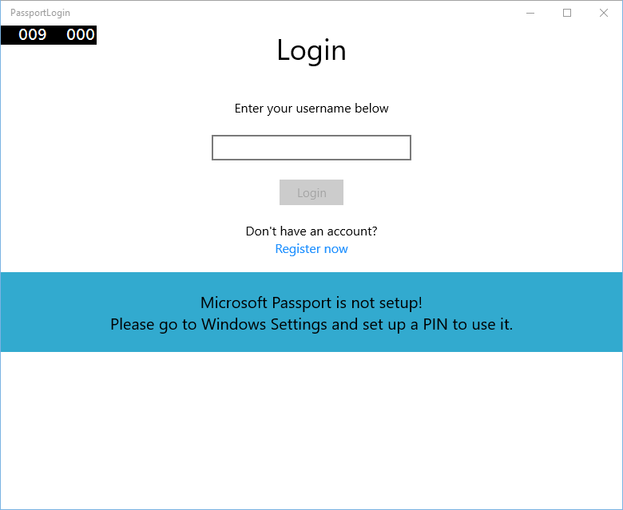

# <a name="create-a-windows-hello-login-app"></a>Windows Hello 로그인 앱 만들기


\[일부 정보는 상업용으로 출시되기 전에 상당 부분 수정될 수 있는 시험판 제품과 관련이 있습니다. Microsoft는 여기에 제공된 정보에 대해 명시적 또는 묵시적 보증을 하지 않습니다.\]

이 문서는 기존 사용자 이름 및 암호 인증 시스템의 대안으로 Windows Hello를 사용하는 Windows 10 UWP(유니버설 Windows 플랫폼) 앱을 만드는 방법을 안내하는 전체 연습의 제1부입니다. 앱은 사용자 이름으로 로그인하고 각 계정에 Hello 키를 만듭니다. 이 계정들은 Windows Hello 구성의 Windows 설정에 설정된 PIN의 보호를 받습니다.

이 연습은 앱을 빌드하고 백 엔드 서비스에 접속하는 두 부분으로 나뉘어 있습니다. 이 문서를 마치면 제2부: [Windows Hello 로그인 서비스](microsoft-passport-login-auth-service.md)를 계속 진행하세요.

시작하기 전에 Windows Hello 작동 방식을 전반적으로 이해하기 위해 [Windows Hello](microsoft-passport.md) 개요를 읽으셔야 합니다.

## <a name="get-started"></a>시작


이 프로젝트를 빌드하려면 C# 및 XAML을 사용해 본 경험이 있어야 합니다. 사용 하 고 Visual Studio 2015도 해야 (커뮤니티 버전 이상에서 작동할), 또는 Windows 10 컴퓨터에서 Visual Studio의 이후 버전입니다. Visual Studio 2015 필요한 최소 버전 이지만, 최신 개발자 및 보안 업데이트에 대 한 최신 버전의 Visual Studio를 사용 하는 것이 좋습니다.

-   Visual Studio를 열고 파일을 선택 > 새로 만들기 > 프로젝트입니다.
-   "새 프로젝트" 창이 열립니다. 템플릿 &gt; Visual C#으로 이동합니다.
-   비어 있는 앱(유니버설 Windows)을 선택하고 응용 프로그램의 이름을 "PassportLogin"으로 지정합니다.
-   새 응용 프로그램을 빌드 및 실행(F5)하면 화면에 빈 창이 표시됩니다. 응용 프로그램을 닫습니다.


## <a name="exercise-1-login-with-microsoft-passport"></a>연습 1: Microsoft Passport를 사용하여 로그인


이 연습에서는 컴퓨터에 Windows Hello가 설정되어 있는지 확인하는 방법과 Windows Hello를 사용하여 계정에 로그인하는 방법을 알아봅니다.

-   새 프로젝트에서 솔루션에 "Views"라는 새 폴더를 만듭니다. 이 폴더에는 이 샘플에서 이동할 페이지가 포함됩니다. 솔루션 탐색기에서 프로젝트를 마우스 오른쪽 단추로 클릭하고 추가 > 새 폴더를 선택한 다음 폴더 이름을 Views로 바꿉니다.

    

-   새 Views 폴더를 마우스 오른쪽 단추로 클릭하고 추가 > 새 항목을 선택한 후 빈 페이지를 선택합니다. 이 페이지의 이름을 "Login.xaml"로 지정합니다.

    

-   새 로그인 페이지에 대한 사용자 인터페이스를 정의하려면 다음 XAML을 추가합니다. 이 XAML은 다음 자식 항목에 맞게 StackPanel을 정의합니다.

    -   제목을 포함하는 TextBlock
    -   오류 메시지에 대한 TextBlock
    -   입력할 사용자 이름에 대한 TextBox
    -   등록 페이지로 이동하는 단추
    -   Windows Hello의 상태를 포함하는 TextBlock
    -   백 엔드 또는 구성된 사용자가 없을 때 로그인 페이지를 설명하는 TextBlock

    ```xml
    <Grid Background="{ThemeResource ApplicationPageBackgroundThemeBrush}">
      <StackPanel Orientation="Vertical">
        <TextBlock Text="Login" FontSize="36" Margin="4" TextAlignment="Center"/>
        <TextBlock x:Name="ErrorMessage" Text="" FontSize="20" Margin="4" Foreground="Red" TextAlignment="Center"/>
        <TextBlock Text="Enter your username below" Margin="0,0,0,20"
                   TextWrapping="Wrap" Width="300"
                   TextAlignment="Center" VerticalAlignment="Center" FontSize="16"/>
        <TextBox x:Name="UsernameTextBox" Margin="4" Width="250"/>
        <Button x:Name="PassportSignInButton" Content="Login" Background="DodgerBlue" Foreground="White"
            Click="PassportSignInButton_Click" Width="80" HorizontalAlignment="Center" Margin="0,20"/>
        <TextBlock Text="Don't have an account?"
                    TextAlignment="Center" VerticalAlignment="Center" FontSize="16"/>
        <TextBlock x:Name="RegisterButtonTextBlock" Text="Register now"
                   PointerPressed="RegisterButtonTextBlock_OnPointerPressed"
                   Foreground="DodgerBlue"
                   TextAlignment="Center" VerticalAlignment="Center" FontSize="16"/>
        <Border x:Name="PassportStatus" Background="#22B14C"
                   Margin="0,20" Height="100" >
          <TextBlock x:Name="PassportStatusText" Text="Microsoft Passport is ready to use!"
                 Margin="4" TextAlignment="Center" VerticalAlignment="Center" FontSize="20"/>
        </Border>
        <TextBlock x:Name="LoginExplaination" FontSize="24" TextAlignment="Center" TextWrapping="Wrap" 
            Text="Please Note: To demonstrate a login, validation will only occur using the default username 'sampleUsername'"/>
      </StackPanel>
    </Grid>
    ```

-   솔루션 빌드를 위해 몇 가지 메서드를 코드 숨김에 추가해야 합니다. F7 키를 누르거나 솔루션 탐색기를 사용하여 Login.xaml.cs를 엽니다. 로그인 및 등록 이벤트를 처리하기 위해 다음 두 이벤트 메서드를 추가합니다. 여기서 이 메서드는 ErrorMessage.Text를 빈 문자열로 설정합니다.

    ```cs
    namespace PassportLogin.Views
    {
        public sealed partial class Login : Page
        {
            public Login()
            {
                this.InitializeComponent();
            }
     
            private void PassportSignInButton_Click(object sender, RoutedEventArgs e)
            {
                ErrorMessage.Text = "";
            }
            private void RegisterButtonTextBlock_OnPointerPressed(object sender, PointerRoutedEventArgs e)
            {
                ErrorMessage.Text = "";
            }
        }
    }
    ```

-   로그인 페이지를 렌더링하기 위해 MainPage가 로드될 때 로그인 페이지로 이동하도록 MainPage 코드를 편집합니다. MainPage.xaml.cs 파일을 엽니다. 솔루션 탐색기에서 MainPage.xaml.cs를 두 번 클릭합니다. MainPage.xaml.cs를 찾을 수 없으면 MainPage.xaml 옆의 작은 화살표를 클릭하여 코드 숨김을 표시합니다. 로그인 페이지로 이동하는 로드된 이벤트 처리기 메서드를 만듭니다. Views 네임스페이스에 대한 참조를 추가해야 합니다.

    ```cs
    using PassportLogin.Views;
     
    namespace PassportLogin
    {
        public sealed partial class MainPage : Page
        {
            public MainPage()
            {
                this.InitializeComponent();
                Loaded += MainPage_Loaded;
            }
     
            private void MainPage_Loaded(object sender, RoutedEventArgs e)
            {
                Frame.Navigate(typeof(Login));
            }
        }
    }
    ```

-   로그인 페이지에서 Windows Hello를 이 컴퓨터에서 사용할 수 있는지 확인하는 OnNavigatedTo 이벤트를 처리해야 합니다. Login.xaml.cs에서 다음을 구현합니다. MicrosoftPassportHelper 개체가 오류를 표시하는데 이는 아직 구현하지 않았기 때문입니다.

    ```cs
    public sealed partial class Login : Page
    {
        public Login()
        {
            this.InitializeComponent();
        }
     
        protected override async void OnNavigatedTo(NavigationEventArgs e)
        {
            // Check Microsoft Passport is setup and available on this machine
            if (await MicrosoftPassportHelper.MicrosoftPassportAvailableCheckAsync())
            {
            }
            else
            {
                // Microsoft Passport is not setup so inform the user
                PassportStatus.Background = new SolidColorBrush(Windows.UI.Color.FromArgb(255, 50, 170, 207));
                PassportStatusText.Text = "Microsoft Passport is not setup!\n" + 
                    "Please go to Windows Settings and set up a PIN to use it.";
                PassportSignInButton.IsEnabled = false;
            }
        }
    }
    ```

-   MicrosoftPassportHelper 클래스를 만들려면 솔루션 PassportLogin(유니버설 Windows)을 마우스 오른쪽 단추로 클릭하고 추가 &gt; 새 폴더를 클릭합니다. 이 폴더의 이름을 Utils로 지정합니다.

    

-   Utils 폴더를 마우스 오른쪽 단추로 클릭하고 추가 &gt; 클래스를 클릭합니다. 이 클래스 이름을 "MicrosoftPassportHelper.cs"로 지정합니다.
-   MicrosoftPassportHelper의 클래스 정의를 public static으로 변경한 후 Windows Hello를 사용할 준비가 되었는지 여부를 사용자에게 알려주는 다음 메서드를 추가합니다. 필요한 네임스페이스를 추가해야 합니다.

    ```cs
    using System;
    using System.Diagnostics;
    using System.Threading.Tasks;
    using Windows.Security.Credentials;
     
    namespace PassportLogin.Utils
    {
        public static class MicrosoftPassportHelper
        {
            /// <summary>
            /// Checks to see if Passport is ready to be used.
            /// 
            /// Passport has dependencies on:
            ///     1. Having a connected Microsoft Account
            ///     2. Having a Windows PIN set up for that _account on the local machine
            /// </summary>
            public static async Task<bool> MicrosoftPassportAvailableCheckAsync()
            {
                bool keyCredentialAvailable = await KeyCredentialManager.IsSupportedAsync();
                if (keyCredentialAvailable == false)
                {
                    // Key credential is not enabled yet as user 
                    // needs to connect to a Microsoft Account and select a PIN in the connecting flow.
                    Debug.WriteLine("Microsoft Passport is not setup!\nPlease go to Windows Settings and set up a PIN to use it.");
                    return false;
                }
     
                return true;
            }
        }
    }
    ```

-   Login.xaml.cs에 Utils 네임스페이스에 대한 참조를 추가합니다. 이렇게 하면 OnNavigatedTo 메서드의 오류가 해결됩니다.

    ```cs
    using PassportLogin.Utils;
    ```

-   응용 프로그램을 빌드 및 실행합니다(F5). 로그인 페이지로 이동하면, Hello를 사용할 준비가 되었을 때 Windows Hello 배너가 표시됩니다. 컴퓨터에 Windows Hello 상태를 나타내는 녹색 또는 파란색 배너가 표시됩니다.

    

    

-   그 다음으로 할 것은 로그인 논리를 작성하는 것입니다. "Models"라는 새 폴더를 만듭니다.
-   Models 폴더에 "Account.cs"라는 새 클래스를 만듭니다. 이 클래스는 계정 모델 역할을 합니다. 샘플이므로 사용자 이름만 포함합니다. 클래스 정의를 public으로 변경하고 Username 속성을 추가합니다.
    
    ```cs
    namespace PassportLogin.Models
    {
        public class Account
        {
            public string Username { get; set; }
        }
    }
    ```

-   계정을 처리할 방법이 필요합니다. 이 실습 연습에 대한 서버나 데이터베이스가 없으므로 사용자 목록을 로컬로 저장하고 로드합니다. Utils 폴더를 마우스 오른쪽 단추로 클릭하고 "AccountHelper.cs"라는 새 클래스를 추가합니다. 클래스 정의를 public static으로 변경합니다. AccountHelper는 계정 목록을 로컬로 저장하고 로드하는 데 필요한 모든 메서드를 포함하는 정적 클래스입니다. 저장 및 로드는 XmlSerializer를 사용하여 수행됩니다. 또한 저장한 파일과 위치를 기억해야 합니다. 추가 네임스페이스를 참조해야 합니다.
    
    ```cs
    using System.IO;
    using System.Xml.Serialization;
    using Windows.Storage;
    using PassportLogin.Models;

    namespace PassportLogin.Utils
    {
        public static class AccountHelper
        {
            // In the real world this would not be needed as there would be a server implemented that would host a user account database.
            // For this tutorial we will just be storing accounts locally.
            private const string USER_ACCOUNT_LIST_FILE_NAME = "accountlist.txt";
            private static string _accountListPath = Path.Combine(ApplicationData.Current.LocalFolder.Path, USER_ACCOUNT_LIST_FILE_NAME);
            public static List<Account> AccountList = new List<Account>();
     
            /// <summary>
            /// Create and save a useraccount list file. (Updating the old one)
            /// </summary>
            private static async void SaveAccountListAsync()
            {
                string accountsXml = SerializeAccountListToXml();
     
                if (File.Exists(_accountListPath))
                {
                    StorageFile accountsFile = await StorageFile.GetFileFromPathAsync(_accountListPath);
                    await FileIO.WriteTextAsync(accountsFile, accountsXml);
                }
                else
                {
                    StorageFile accountsFile = await ApplicationData.Current.LocalFolder.CreateFileAsync(USER_ACCOUNT_LIST_FILE_NAME);
                    await FileIO.WriteTextAsync(accountsFile, accountsXml);
                }
            }
     
            /// <summary>
            /// Gets the useraccount list file and deserializes it from XML to a list of useraccount objects.
            /// </summary>
            /// <returns>List of useraccount objects</returns>
            public static async Task<List<Account>> LoadAccountListAsync()
            {
                if (File.Exists(_accountListPath))
                {
                    StorageFile accountsFile = await StorageFile.GetFileFromPathAsync(_accountListPath);
     
                    string accountsXml = await FileIO.ReadTextAsync(accountsFile);
                    DeserializeXmlToAccountList(accountsXml);
                }
     
                return AccountList;
            }
     
            /// <summary>
            /// Uses the local list of accounts and returns an XML formatted string representing the list
            /// </summary>
            /// <returns>XML formatted list of accounts</returns>
            public static string SerializeAccountListToXml()
            {
                XmlSerializer xmlizer = new XmlSerializer(typeof(List<Account>));
                StringWriter writer = new StringWriter();
                xmlizer.Serialize(writer, AccountList);
     
                return writer.ToString();
            }
     
            /// <summary>
            /// Takes an XML formatted string representing a list of accounts and returns a list object of accounts
            /// </summary>
            /// <param name="listAsXml">XML formatted list of accounts</param>
            /// <returns>List object of accounts</returns>
            public static List<Account> DeserializeXmlToAccountList(string listAsXml)
            {
                XmlSerializer xmlizer = new XmlSerializer(typeof(List<Account>));
                TextReader textreader = new StreamReader(new MemoryStream(Encoding.UTF8.GetBytes(listAsXml)));
     
                return AccountList = (xmlizer.Deserialize(textreader)) as List<Account>;
            }
        }
    }
    ```

-   다음은 로컬 계정 목록에서 계정을 추가하고 제거하는 방법을 구현합니다. 이러한 작업은 각각의 목록을 저장합니다. 이 실습 연습에 필요한 마지막 메서드는 유효성 검사 메서드입니다. 사용자의 인증 서버나 데이터베이스가 없으므로 이 메서드는 하드 코드된 단일 사용자에 대해 유효성을 검사합니다. 이러한 메서드는 AccountHelper 클래스에 추가해야 합니다.
    
    ```cs
    public static Account AddAccount(string username)
            {
                // Create a new account with the username
                Account account = new Account() { Username = username };
                // Add it to the local list of accounts
                AccountList.Add(account);
                // SaveAccountList and return the account
                SaveAccountListAsync();
                return account;
            }
     
            public static void RemoveAccount(Account account)
            {
                // Remove the account from the accounts list
                AccountList.Remove(account);
                // Re save the updated list
                SaveAccountListAsync();
            }
     
            public static bool ValidateAccountCredentials(string username)
            {
                // In the real world, this method would call the server to authenticate that the account exists and is valid.
                // For this tutorial however we will just have a existing sample user that is just "sampleUsername"
                // If the username is null or does not match "sampleUsername" it will fail validation. In which case the user should register a new passport user
     
                if (string.IsNullOrEmpty(username))
                {
                    return false;
                }
     
                if (!string.Equals(username, "sampleUsername"))
                {
                    return false;
                }
     
                return true;
            }
    ```

-   다음으로 사용자의 로그인 요청을 처리해야 합니다. Login.xaml.cs에 현재 계정 로그인을 보관하는 새 private 변수를 만듭니다. 그런 다음 새 메서드 호출 SignInPassport를 추가합니다. AccountHelper.ValidateAccountCredentials 메서드를 사용하여 계정 자격 증명의 유효성을 검사합니다. 입력한 사용자 이름이 이전 단계에서 설정한 하드 코드된 문자열 값과 같으면 이 메서드는 부울 값을 반환합니다. 이 샘플의 경우 하드 코드된 값은 "sampleUsername"입니다.

    ```cs
    using PassportLogin.Models;
    using PassportLogin.Utils;
    using System.Diagnostics;
     
    namespace PassportLogin.Views
    {
        public sealed partial class Login : Page
        {
            private Account _account;
     
            public Login()
            {
                this.InitializeComponent();
            }
     
            protected override async void OnNavigatedTo(NavigationEventArgs e)
            {
                // Check Microsoft Passport is setup and available on this machine
                if (await MicrosoftPassportHelper.MicrosoftPassportAvailableCheckAsync())
                {
                }
                else
                {
                    // Microsoft Passport is not setup so inform the user
                    PassportStatus.Background = new SolidColorBrush(Windows.UI.Color.FromArgb(255, 50, 170, 207));
                    PassportStatusText.Text = "Microsoft Passport is not setup!\nPlease go to Windows Settings and set up a PIN to use it.";
                    PassportSignInButton.IsEnabled = false;
                }
            }
     
            private void PassportSignInButton_Click(object sender, RoutedEventArgs e)
            {
                ErrorMessage.Text = "";
                SignInPassport();
            }
     
            private void RegisterButtonTextBlock_OnPointerPressed(object sender, PointerRoutedEventArgs e)
            {
                ErrorMessage.Text = "";
            }
     
            private async void SignInPassport()
            {
                if (AccountHelper.ValidateAccountCredentials(UsernameTextBox.Text))
                {
                    // Create and add a new local account
                    _account = AccountHelper.AddAccount(UsernameTextBox.Text);
                    Debug.WriteLine("Successfully signed in with traditional credentials and created local account instance!");
     
                    //if (await MicrosoftPassportHelper.CreatePassportKeyAsync(UsernameTextBox.Text))
                    //{
                    //    Debug.WriteLine("Successfully signed in with Microsoft Passport!");
                    //}
                }
                else
                {
                    ErrorMessage.Text = "Invalid Credentials";
                }
            }
        }
    }
    ```

-   MicrosoftPassportHelper의 메서드를 참조한 주석으로 처리된 코드를 확인했을 수 있습니다. MicrosoftPassportHelper.cs에서 CreatePassportKeyAsync라는 새 메서드를 추가합니다. 이 메서드는 [**KeyCredentialManager**](https://msdn.microsoft.com/library/windows/apps/dn973043)에서 Windows Hello API를 사용합니다. [**RequestCreateAsync**](https://msdn.microsoft.com/library/windows/apps/dn973048)를 호출하면 *accountId* 및 로컬 컴퓨터에 해당하는 Passport 키가 생성됩니다. 실제 시나리오에서 이를 구현해 보려면 switch 문의 주석을 확인하세요.

    ```cs
    /// <summary>
    /// Creates a Passport key on the machine using the _account id passed.
    /// </summary>
    /// <param name="accountId">The _account id associated with the _account that we are enrolling into Passport</param>
    /// <returns>Boolean representing if creating the Passport key succeeded</returns>
    public static async Task<bool> CreatePassportKeyAsync(string accountId)
    {
        KeyCredentialRetrievalResult keyCreationResult = await KeyCredentialManager.RequestCreateAsync(accountId, KeyCredentialCreationOption.ReplaceExisting);

        switch (keyCreationResult.Status)
        {
            case KeyCredentialStatus.Success:
                Debug.WriteLine("Successfully made key");

                // In the real world authentication would take place on a server.
                // So every time a user migrates or creates a new Microsoft Passport account Passport details should be pushed to the server.
                // The details that would be pushed to the server include:
                // The public key, keyAttesation if available, 
                // certificate chain for attestation endorsement key if available,  
                // status code of key attestation result: keyAttestationIncluded or 
                // keyAttestationCanBeRetrievedLater and keyAttestationRetryType
                // As this sample has no concept of a server it will be skipped for now
                // for information on how to do this refer to the second Passport sample

                //For this sample just return true
                return true;
            case KeyCredentialStatus.UserCanceled:
                Debug.WriteLine("User cancelled sign-in process.");
                break;
            case KeyCredentialStatus.NotFound:
                // User needs to setup Microsoft Passport
                Debug.WriteLine("Microsoft Passport is not setup!\nPlease go to Windows Settings and set up a PIN to use it.");
                break;
            default:
                break;
        }

        return false;
    }
    ```

-   이제 CreatePassportKeyAsync 메서드를 만들었으므로 Login.xaml.cs 파일로 돌아가 SignInPassport 메서드 내에서 코드 주석 처리를 제거합니다.

    ```cs
    private async void SignInPassport()
    {
        if (AccountHelper.ValidateAccountCredentials(UsernameTextBox.Text))
        {
            //Create and add a new local account
            _account = AccountHelper.AddAccount(UsernameTextBox.Text);
            Debug.WriteLine("Successfully signed in with traditional credentials and created local account instance!");

            if (await MicrosoftPassportHelper.CreatePassportKeyAsync(UsernameTextBox.Text))
            {
                Debug.WriteLine("Successfully signed in with Microsoft Passport!");
            }
        }
        else
        {
            ErrorMessage.Text = "Invalid Credentials";
        }
    }
    ```

-   응용 프로그램을 빌드 및 실행합니다. 로그인 페이지로 이동합니다. "sampleUsername"을 입력하고 로그인을 클릭합니다. PIN을 입력하라는 Windows Hello 프롬프트가 표시됩니다. PIN을 올바르게 입력하면 CreatePassportKeyAsync 메서드가 Windows Hello 키를 만들 수 있습니다. 출력 창을 모니터링하여 성공을 나타내는 메시지가 표시되는지 확인합니다.

    

## <a name="exercise-2-welcome-and-user-selection-pages"></a>연습 2: 환영 및 사용자 선택 페이지


이 연습은 이전 연습에서 계속됩니다. 성공적으로 로그인하면 계정에서 로그아웃하거나 계정을 삭제할 수 있는 환영 페이지가 표시되어야 합니다. Windows Hello는 모든 컴퓨터에 대해 키를 만들므로 해당 컴퓨터에 로그인한 모든 사용자를 표시하는 사용자 선택 화면을 만들 수 있습니다. 그런 다음 사용자는 이러한 계정 중 하나를 선택하고 컴퓨터에 액세스하도록 이미 인증되었기 때문에 암호를 다시 입력하지 않고도 환영 화면으로 바로 이동할 수 있습니다.

-   Views 폴더에 "Welcome.xaml"이라는 새 빈 페이지를 추가합니다. 사용자 인터페이스를 완료하려면 다음 XAML을 추가합니다. 제목, 로그인된 사용자 이름 및 두 개의 단추가 표시됩니다. 단추 중 하나는 사용자 목록(나중에 만듦)으로 이동하는 단추이며 다른 단추는 이 사용자를 무시하기 위한 단추입니다.

    ```xml
    <Grid Background="{ThemeResource ApplicationPageBackgroundThemeBrush}">
      <StackPanel Orientation="Vertical">
        <TextBlock x:Name="Title" Text="Welcome" FontSize="40" TextAlignment="Center"/>
        <TextBlock x:Name="UserNameText" FontSize="28" TextAlignment="Center" Foreground="Black"/>

        <Button x:Name="BackToUserListButton" Content="Back to User List" Click="Button_Restart_Click"
                HorizontalAlignment="Center" Margin="0,20" Foreground="White" Background="DodgerBlue"/>

        <Button x:Name="ForgetButton" Content="Forget Me" Click="Button_Forget_User_Click"
                Foreground="White"
                Background="Gray"
                HorizontalAlignment="Center"/>
      </StackPanel>
    </Grid>
    ```

-   Welcome.xaml.cs 코드 숨김 파일에 로그인된 계정을 보관하는 새 private 변수를 추가합니다. OnNavigateTo 이벤트를 재정의하는 메서드를 구현해야 하며 이는 환영 페이지에 전달된 계정을 저장합니다. 또한 XAML에 정의된 두 개의 단추에 대한 클릭 이벤트를 구현해야 합니다. Models 및 Utils 폴더에 대한 참조가 필요합니다.

    ```cs
    using PassportLogin.Models;
    using PassportLogin.Utils;
    using System.Diagnostics;
     
    namespace PassportLogin.Views
    {
        public sealed partial class Welcome : Page
        {
            private Account _activeAccount;
     
            public Welcome()
            {
                InitializeComponent();
            }
     
            protected override void OnNavigatedTo(NavigationEventArgs e)
            {
                _activeAccount = (Account)e.Parameter;
                if (_activeAccount != null)
                {
                    UserNameText.Text = _activeAccount.Username;
                }
            }
     
            private void Button_Restart_Click(object sender, RoutedEventArgs e)
            {
            }
     
            private void Button_Forget_User_Click(object sender, RoutedEventArgs e)
            {
                // Remove it from Microsoft Passport
                // MicrosoftPassportHelper.RemovePassportAccountAsync(_activeAccount);
     
                // Remove it from the local accounts list and resave the updated list
                AccountHelper.RemoveAccount(_activeAccount);
     
                Debug.WriteLine("User " + _activeAccount.Username + " deleted.");
            }
        }
    }
    ```

-   사용자 무시 클릭 이벤트에서 주석 처리된 줄을 확인했을 수 있습니다. 로컬 목록에서 제거할 계정이지만 현재로서는 Windows Hello에서 제거할 방법이 없습니다. MicrosoftPassportHelper.cs에 Windows Hello 사용자를 제거할 새 메서드를 구현해야 합니다. 이 메서드는 다른 Windows Hello API를 사용하여 계정을 열고 삭제합니다. 실제 환경에서는 계정을 삭제할 때 사용자 데이터베이스가 여전히 유효하도록 서버나 데이터베이스에 알려야 합니다. Models 폴더에 대한 참조가 필요합니다.

    ```cs
    using PassportLogin.Models;

    /// <summary>
    /// Function to be called when user requests deleting their account.
    /// Checks the KeyCredentialManager to see if there is a Passport for the current user
    /// Then deletes the local key associated with the Passport.
    /// </summary>
    public static async void RemovePassportAccountAsync(Account account)
    {
        // Open the account with Passport
        KeyCredentialRetrievalResult keyOpenResult = await KeyCredentialManager.OpenAsync(account.Username);

        if (keyOpenResult.Status == KeyCredentialStatus.Success)
        {
            // In the real world you would send key information to server to unregister
            //e.g. RemovePassportAccountOnServer(account);
        }

        // Then delete the account from the machines list of Passport Accounts
        await KeyCredentialManager.DeleteAsync(account.Username);
    }
    ```

-   Welcome.xaml.cs로 돌아가 RemovePassportAccountAsync를 호출하는 줄의 주석 처리를 제거합니다.

    ```cs
    private void Button_Forget_User_Click(object sender, RoutedEventArgs e)
    {
        // Remove it from Microsoft Passport
        MicrosoftPassportHelper.RemovePassportAccountAsync(_activeAccount);
     
        // Remove it from the local accounts list and resave the updated list
        AccountHelper.RemoveAccount(_activeAccount);
     
        Debug.WriteLine("User " + _activeAccount.Username + " deleted.");
    }
    ```

-   Login.xaml.cs의 SignInPassport 메서드에서 CreatePassportKeyAsync가 성공적으로 수행되면 환영 화면으로 이동하고 계정을 전달해야 합니다.

    ```cs
    private async void SignInPassport()
    {
        if (AccountHelper.ValidateAccountCredentials(UsernameTextBox.Text))
        {
            // Create and add a new local account
            _account = AccountHelper.AddAccount(UsernameTextBox.Text);
            Debug.WriteLine("Successfully signed in with traditional credentials and created local account instance!");

            if (await MicrosoftPassportHelper.CreatePassportKeyAsync(UsernameTextBox.Text))
            {
                Debug.WriteLine("Successfully signed in with Microsoft Passport!");
                Frame.Navigate(typeof(Welcome), _account);
            }
        }
        else
        {
            ErrorMessage.Text = "Invalid Credentials";
        }
    }
    ```

-   응용 프로그램을 빌드 및 실행합니다. "sampleUsername"으로 로그인하고 로그인을 클릭합니다. PIN을 입력하고 성공하면 환영 화면으로 이동해야 합니다. 사용자 무시를 클릭하고 출력 창을 모니터링하여 사용자가 삭제되었는지 확인합니다. 사용자를 삭제할 때 환영 페이지는 그대로 유지됩니다. 앱에서 찾아갈 수 있는 사용자 선택 페이지를 만들어야 합니다.

    

-   Views 폴더에 "UserSelection.xaml"이라는 빈 페이지를 새로 만들고 사용자 인터페이스를 정의하기 위해 다음 XAML을 추가합니다. 이 페이지는 로컬 계정 목록의 모든 사용자를 표시하는 [**ListView**](https://msdn.microsoft.com/library/windows/apps/br242878)와 사용자가 다른 계정을 추가할 수 있는 로그인 페이지로 이동하는 단추를 포함합니다.

    ```xml
    <Grid Background="{ThemeResource ApplicationPageBackgroundThemeBrush}">
      <StackPanel Orientation="Vertical">
        <TextBlock x:Name="Title" Text="Select a User" FontSize="36" Margin="4" TextAlignment="Center" HorizontalAlignment="Center"/>

        <ListView x:Name="UserListView" Margin="4" MaxHeight="200" MinWidth="250" Width="250" HorizontalAlignment="Center">
          <ListView.ItemTemplate>
            <DataTemplate>
              <Grid Background="DodgerBlue" Height="50" Width="250" HorizontalAlignment="Stretch" VerticalAlignment="Stretch">
                <TextBlock Text="{Binding Username}" HorizontalAlignment="Center" TextAlignment="Center" VerticalAlignment="Center" Foreground="White"/>
              </Grid>
            </DataTemplate>
          </ListView.ItemTemplate>
        </ListView>

        <Button x:Name="AddUserButton" Content="+" FontSize="36" Width="60" Click="AddUserButton_Click" HorizontalAlignment="Center"/>
      </StackPanel>
    </Grid>
    ```

-   UserSelection.xaml.cs에서 로컬 목록에 계정이 없는 경우 로그인 페이지로 이동하는 로드된 메서드를 구현합니다. 또한 ListView에 대한 SelectionChanged 이벤트와 단추에 대한 클릭 이벤트를 구현합니다.

    ```cs
    using System.Diagnostics;
    using PassportLogin.Models;
    using PassportLogin.Utils;

    namespace PassportLogin.Views
    {
        public sealed partial class UserSelection : Page
        {
            public UserSelection()
            {
                InitializeComponent();
                Loaded += UserSelection_Loaded;
            }

            private void UserSelection_Loaded(object sender, RoutedEventArgs e)
            {
                if (AccountHelper.AccountList.Count == 0)
                {
                    //If there are no accounts navigate to the LoginPage
                    Frame.Navigate(typeof(Login));
                }


                UserListView.ItemsSource = AccountHelper.AccountList;
                UserListView.SelectionChanged += UserSelectionChanged;
            }

            /// <summary>
            /// Function called when an account is selected in the list of accounts
            /// Navigates to the Login page and passes the chosen account
            /// </summary>
            private void UserSelectionChanged(object sender, RoutedEventArgs e)
            {
                if (((ListView)sender).SelectedValue != null)
                {
                    Account account = (Account)((ListView)sender).SelectedValue;
                    if (account != null)
                    {
                        Debug.WriteLine("Account " + account.Username + " selected!");
                    }
                    Frame.Navigate(typeof(Login), account);
                }
            }

            /// <summary>
            /// Function called when the "+" button is clicked to add a new user.
            /// Navigates to the Login page with nothing filled out
            /// </summary>
            private void AddUserButton_Click(object sender, RoutedEventArgs e)
            {
                Frame.Navigate(typeof(Login));
            }
        }
    }
    ```

<!-- -->

-   앱에서 UserSelection 페이지로 이동하려는 위치가 몇 군데 있습니다. MainPage.xaml.cs에서는 로그인 페이지 대신 UserSelection 페이지로 이동합니다. MainPage에서 로드된 이벤트를 사용하는 동안 UserSelection 페이지가 계정이 있는지 확인할 수 있도록 계정 목록을 로드해야 합니다. 로드된 메서드를 비동기로 변경하고 Utils 폴더에 대한 참조를 추가해야 합니다.

    ```cs
    using PassportLogin.Utils;

    private async void MainPage_Loaded(object sender, RoutedEventArgs e)
    {
        // Load the local Accounts List before navigating to the UserSelection page
        await AccountHelper.LoadAccountListAsync();
        Frame.Navigate(typeof(UserSelection));
    }
    ```

-   다음으로 환영 페이지에서 UserSelection 페이지로 이동하려고 합니다. 두 클릭 이벤트에서 모두 UserSelection 페이지로 다시 이동합니다.

    ```cs
    private void Button_Restart_Click(object sender, RoutedEventArgs e)
    {
        Frame.Navigate(typeof(UserSelection));
    }

    private void Button_Forget_User_Click(object sender, RoutedEventArgs e)
    {
        // Remove it from Microsoft Passport
        MicrosoftPassportHelper.RemovePassportAccountAsync(_activeAccount);

        // Remove it from the local accounts list and resave the updated list
        AccountHelper.RemoveAccount(_activeAccount);

        Debug.WriteLine("User " + _activeAccount.Username + " deleted.");

        // Navigate back to UserSelection page.
        Frame.Navigate(typeof(UserSelection));
    }
    ```

-   로그인 페이지에 UserSelection 페이지 목록에서 선택한 계정에 로그인하는 코드가 필요합니다. OnNavigatedTo 이벤트에서 이동에 전달된 계정을 저장합니다. 기존 계정인지 식별하는 새 private 변수를 추가하는 작업부터 시작합니다. 그런 다음 OnNavigatedTo 이벤트를 처리합니다.

    ```cs
    namespace PassportLogin.Views
    {
        public sealed partial class Login : Page
        {
            private Account _account;
            private bool _isExistingAccount;

            public Login()
            {
                InitializeComponent();
            }

            /// <summary>
            /// Function called when this frame is navigated to.
            /// Checks to see if Microsoft Passport is available and if an account was passed in.
            /// If an account was passed in set the "_isExistingAccount" flag to true and set the _account
            /// </summary>
            protected override async void OnNavigatedTo(NavigationEventArgs e)
            {
                // Check Microsoft Passport is setup and available on this machine
                if (await MicrosoftPassportHelper.MicrosoftPassportAvailableCheckAsync())
                {
                    if (e.Parameter != null)
                    {
                        _isExistingAccount = true;
                        // Set the account to the existing account being passed in
                        _account = (Account)e.Parameter;
                        UsernameTextBox.Text = _account.Username;
                        SignInPassport();
                    }
                }
                else
                {
                    // Microsoft Passport is not setup so inform the user
                    PassportStatus.Background = new SolidColorBrush(Windows.UI.Color.FromArgb(255, 50, 170, 207));
                    PassportStatusText.Text = "Microsoft Passport is not setup!\n" + 
                        "Please go to Windows Settings and set up a PIN to use it.";
                    PassportSignInButton.IsEnabled = false;
                }
            }
        }
    }
    ```

-   선택한 계정에 로그인하려면 SignInPassport 메서드를 업데이트해야 합니다. 계정이 이미 만들어진 Passport 키를 가지고 있기 때문에 MicrosoftPassportHelper는 Passport가 있는 계정을 여는 또 다른 메서드가 필요합니다. Passport가 있는 기존 사용자에 로그인하는 새로운 메서드를 MicrosoftPassportHelper.cs에 구현합니다. 코드의 각 부분에 대한 자세한 내용은 코드 주석을 참조하세요.

    ```cs
    /// <summary>
    /// Attempts to sign a message using the Passport key on the system for the accountId passed.
    /// </summary>
    /// <returns>Boolean representing if creating the Passport authentication message succeeded</returns>
    public static async Task<bool> GetPassportAuthenticationMessageAsync(Account account)
    {
        KeyCredentialRetrievalResult openKeyResult = await KeyCredentialManager.OpenAsync(account.Username);
        // Calling OpenAsync will allow the user access to what is available in the app and will not require user credentials again.
        // If you wanted to force the user to sign in again you can use the following:
        // var consentResult = await Windows.Security.Credentials.UI.UserConsentVerifier.RequestVerificationAsync(account.Username);
        // This will ask for the either the password of the currently signed in Microsoft Account or the PIN used for Microsoft Passport.

        if (openKeyResult.Status == KeyCredentialStatus.Success)
        {
            // If OpenAsync has succeeded, the next thing to think about is whether the client application requires access to backend services.
            // If it does here you would Request a challenge from the Server. The client would sign this challenge and the server
            // would check the signed challenge. If it is correct it would allow the user access to the backend.
            // You would likely make a new method called RequestSignAsync to handle all this
            // e.g. RequestSignAsync(openKeyResult);
            // Refer to the second Microsoft Passport sample for information on how to do this.

            // For this sample there is not concept of a server implemented so just return true.
            return true;
        }
        else if (openKeyResult.Status == KeyCredentialStatus.NotFound)
        {
            // If the _account is not found at this stage. It could be one of two errors. 
            // 1. Microsoft Passport has been disabled
            // 2. Microsoft Passport has been disabled and re-enabled cause the Microsoft Passport Key to change.
            // Calling CreatePassportKey and passing through the account will attempt to replace the existing Microsoft Passport Key for that account.
            // If the error really is that Microsoft Passport is disabled then the CreatePassportKey method will output that error.
            if (await CreatePassportKeyAsync(account.Username))
            {
                // If the Passport Key was again successfully created, Microsoft Passport has just been reset.
                // Now that the Passport Key has been reset for the _account retry sign in.
                return await GetPassportAuthenticationMessageAsync(account);
            }
        }

        // Can't use Passport right now, try again later
        return false;
    }
    ```

-   기존 계정을 처리하도록 Login.xaml.cs에서 SignInPassport 메서드를 업데이트합니다. 이렇게 하면 MicrosoftPassportHelper.cs에서 새 메서드를 사용합니다. 성공하면 계정에 로그인하고 환영 화면으로 이동합니다.

    ```cs
    private async void SignInPassport()
    {
        if (_isExistingAccount)
        {
            if (await MicrosoftPassportHelper.GetPassportAuthenticationMessageAsync(_account))
            {
                Frame.Navigate(typeof(Welcome), _account);
            }
        }
        else if (AccountHelper.ValidateAccountCredentials(UsernameTextBox.Text))
        {
            //Create and add a new local account
            _account = AccountHelper.AddAccount(UsernameTextBox.Text);
            Debug.WriteLine("Successfully signed in with traditional credentials and created local account instance!");

            if (await MicrosoftPassportHelper.CreatePassportKeyAsync(UsernameTextBox.Text))
            {
                Debug.WriteLine("Successfully signed in with Microsoft Passport!");
                Frame.Navigate(typeof(Welcome), _account);
            }
        }
        else
        {
            ErrorMessage.Text = "Invalid Credentials";
        }
    }
    ```

-   응용 프로그램을 빌드 및 실행합니다. "sampleUsername"으로 로그인합니다. PIN을 입력하고 성공하면 환영 화면으로 이동합니다. 사용자 목록으로 돌아가기를 클릭합니다. 이제 목록에 사용자가 표시됩니다. 이 Passport를 클릭하면 암호 등을 다시 입력하지 않고도 다시 로그인할 수 있습니다.

    

## <a name="exercise-3-registering-a-new-windows-hello-user"></a>연습 3: 새 Windows Hello 사용자 등록


이 연습에서는 Windows Hello가 있는 새 계정을 만드는 새 페이지를 작성합니다. 새 페이지는 로그인 페이지가 작동하는 방식과 유사하게 작동합니다. 로그인 페이지는 Windows Hello를 사용하도록 마이그레이션하는 기존 사용자를 위해 구현되었습니다. PassportRegister 페이지는 새 사용자를 위한 Windows Hello 등록을 만듭니다.

-   Views 폴더에 "PassportRegister.xaml"이라는 빈 페이지를 새로 만듭니다. XAML에서 사용자 인터페이스를 설정하기 위해 다음을 추가합니다. 여기 인터페이스는 로그인 페이지와 비슷합니다.

    ```xml
    <Grid Background="{ThemeResource ApplicationPageBackgroundThemeBrush}">
      <StackPanel Orientation="Vertical">
        <TextBlock x:Name="Title" Text="Register New Passport User" FontSize="24" Margin="4" TextAlignment="Center"/>

        <TextBlock x:Name="ErrorMessage" Text="" FontSize="20" Margin="4" Foreground="Red" TextAlignment="Center"/>

        <TextBlock Text="Enter your new username below" Margin="0,0,0,20"
                   TextWrapping="Wrap" Width="300"
                   TextAlignment="Center" VerticalAlignment="Center" FontSize="16"/>

        <TextBox x:Name="UsernameTextBox" Margin="4" Width="250"/>

        <Button x:Name="PassportRegisterButton" Content="Register" Background="DodgerBlue" Foreground="White"
            Click="RegisterButton_Click_Async" Width="80" HorizontalAlignment="Center" Margin="0,20"/>

        <Border x:Name="PassportStatus" Background="#22B14C"
                   Margin="4" Height="100">
          <TextBlock x:Name="PassportStatusText" Text="Microsoft Passport is ready to use!" FontSize="20"
                 Margin="4" TextAlignment="Center" VerticalAlignment="Center"/>
        </Border>
      </StackPanel>
    </Grid>
    ```

-   PassportRegister.xaml.cs 코드 숨김 파일에서 private Account 변수와 Register 단추에 대한 클릭 이벤트를 구현합니다. 새 로컬 계정을 추가하고 Passport 키를 만듭니다.

    ```cs
    using PassportLogin.Models;
    using PassportLogin.Utils;

    namespace PassportLogin.Views
    {
        public sealed partial class PassportRegister : Page
        {
            private Account _account;

            public PassportRegister()
            {
                InitializeComponent();
            }

            private async void RegisterButton_Click_Async(object sender, RoutedEventArgs e)
            {
                ErrorMessage.Text = "";

                //In the real world you would normally validate the entered credentials and information before 
                //allowing a user to register a new account. 
                //For this sample though we will skip that step and just register an account if username is not null.

                if (!string.IsNullOrEmpty(UsernameTextBox.Text))
                {
                    //Register a new account
                    _account = AccountHelper.AddAccount(UsernameTextBox.Text);
                    //Register new account with Microsoft Passport
                    await MicrosoftPassportHelper.CreatePassportKeyAsync(_account.Username);
                    //Navigate to the Welcome Screen. 
                    Frame.Navigate(typeof(Welcome), _account);
                }
                else
                {
                    ErrorMessage.Text = "Please enter a username";
                }
            }
        }
    }
    ```

-   Register를 클릭하면 로그인 페이지에서 이 페이지로 이동해야 합니다.

    ```cs
    private void RegisterButtonTextBlock_OnPointerPressed(object sender, PointerRoutedEventArgs e)
    {
        ErrorMessage.Text = "";
        Frame.Navigate(typeof(PassportRegister));
    }
    ```

-   응용 프로그램을 빌드 및 실행합니다. 새 사용자를 등록하려고 합니다. 사용자 목록으로 돌아가 해당 사용자 및 로그인을 선택할 수 있는지 확인합니다.

    

이 실습에서는 새로운 Windows Hello API를 사용하여 기존 사용자를 인증하고 신규 사용자의 계정을 만드는 데 필요한 필수 기술을 배웠습니다. 이 새로운 기술을 사용하면 사용자가 응용 프로그램에 대한 암호를 기억하지 않아도 사용자 인증으로 응용 프로그램을 계속 보호할 수 있습니다. Windows 10에서는 Windows Hello의 새 인증 기술을 사용하여 생체 인식 로그인 옵션을 지원합니다.

## <a name="related-topics"></a>관련 항목

* [Windows Hello](microsoft-passport.md)
* [Windows Hello 로그인 서비스](microsoft-passport-login-auth-service.md)
