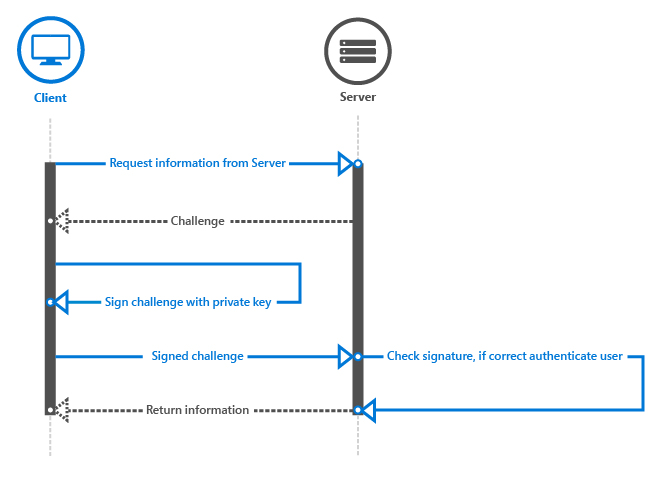

# <a name="windows-hello"></a>Windows Hello


이 문서에서는 Windows 10 운영 체제의 일부로 제공되는 새로운 Windows Hello 기술에 대해 설명하고, 개발자가 이 기술을 구현함으로써 UWP(유니버설 Windows 플랫폼) 앱 및 백 엔드 서비스를 보호하는 방법을 살펴봅니다. 여기서는 기존 자격 증명의 사용으로 발생되는 위협 요소를 완화할 수 있는 이러한 기술의 특징에 대해 중점적으로 설명하고 Windows 10 롤아웃의 일부로 이러한 기술을 디자인 및 배포하는 방법에 대한 지침을 제공합니다.

이 문서는 앱 개발에 중점을 둡니다. Windows Hello의 아키텍처 및 구현에 대한 자세한 내용은 [TechNet의 Windows Hello 가이드](https://technet.microsoft.com/library/mt589441.aspx)를 참조하세요.

전체 코드 샘플을 보려면 [GitHub의 Windows Hello 코드 샘플](http://go.microsoft.com/fwlink/?LinkID=717812)을 참조하세요.

Windows Hello 및 백업 인증 서비스를 사용하여 UWP 앱을 만드는 방법의 단계별 연습은 [Windows Hello 로그인 앱](microsoft-passport-login.md) 및 [Windows Hello 로그인 서비스](microsoft-passport-login-auth-service.md) 문서를 참조하세요.

## <a name="1-introduction"></a>1 소개


정보 보안에 관한 기본 가정은 시스템에서 사용자를 식별할 수 있다는 것입니다. 사용자를 식별하면 시스템에서 사용자의 신원이 적절하게 확인되었는지 결정(인증 프로세스)한 다음 올바르게 인증된 사용자가 수행할 수 있는 작업을 결정(권한 부여)할 수 있습니다. 전 세계에 배포된 대다수 컴퓨터 시스템에서는 인증 및 권한 부여를 결정하는 수단으로 사용자 자격 증명을 사용합니다. 즉, 이러한 시스템은 보안을 위한 기반으로 사용자가 만든 재사용 가능한 암호를 사용합니다. 인증이 "사용자가 무엇을 알고 있고, 갖고 있고, 또 누구인지"와 관련된다는 말은 재사용 가능한 암호 자체가 인증 요소이므로 암호를 알고 있는 누구나가 소유자로 가장할 수 있다는 것을 의미합니다.

## <a name="11-problems-with-traditional-credentials"></a>1.1 기존 자격 증명의 문제


1960년대 중반 Fernando Corbató가 Massachusetts Institute of Technology의 팀원들과 함께 암호 사용을 주장한 이후, 사용자와 관리자는 암호를 사용하여 사용자 인증 및 권한 부여를 처리해야 했습니다. 시간이 지남에 따라 암호 저장 및 사용 기술은 더욱 진보했지만(예를 들어 보안 해시 및 솔트 사용) 여전히 두 가지 문제가 있습니다. 암호를 쉽게 복제할 수 있고 도용하기도 쉽다는 점입니다. 뿐만 아니라 잘못 구현할 경우 보안 문제가 발생할 수 있으므로 편리성과 보안성을 적절히 조절해야 합니다.

## <a name="111-credential-theft"></a>1.1.1 자격 증명 도용


암호의 가장 큰 위험은 공격자가 쉽게 도용할 수 있다는 점입니다. 암호를 입력, 처리 또는 저장하는 모든 위치는 취약합니다. 예를 들어 공격자는 응용 프로그램 서버로의 네트워크 트래픽을 도청하거나, 응용 프로그램 또는 디바이스에 맬웨어를 이식하거나, 디바이스에서 사용자 키스트로크를 기록하거나, 사용자가 입력하는 글자를 확인하는 등의 방법으로 인증 서버에서 암호 또는 해시 모음을 훔칠 수 있습니다. 이것이 가장 일반적인 공격 방법입니다.

또한 공격자가 비보안 네트워크를 도청하여 유효한 자격 증명을 캡처한 다음 나중에 유효한 사용자를 가장하는 자격 증명 재생의 위험이 있습니다. Kerberos 및 OAuth를 비롯한 대부분의 인증 프로토콜은 자격 증명 교환 프로세스에 타임스탬프를 포함시켜 재생 공격으로부터 보호하지만 이런 방법은 사용자가 처음 티켓을 얻기 위해 제공하는 암호가 아니라 인증 시스템에서 발급한 토큰만 보호합니다.

## <a name="112-credential-reuse"></a>1.1.2 자격 증명 다시 사용


메일 주소를 사용자 이름으로 사용하는 경우가 많은데 이 방법은 문제를 더 악화시킵니다. 공격자가 한 시스템에 침투하여 사용자 이름-암호 쌍을 알아낸 다음 동일한 쌍을 다른 시스템에 대해 시도할 수 있습니다. 이러한 방법으로 한 시스템에 침투한 공격자가 다른 시스템으로 연쇄 침투하는 사례는 놀랄 정도로 많습니다. 메일 주소를 사용자 이름으로 사용하면 이 가이드의 뒷부분에 나오는 추가 문제로 이어질 수 있습니다.

## <a name="12-solving-credential-problems"></a>1.2 자격 증명 문제 해결


암호로 인해 발생할 수 있는 문제를 해결하는 것은 어렵습니다. 사용자가 암호를 재사용, 공유 또는 기록해 둘 수 있기 때문에 암호 정책을 강화하는 것만으로는 이 문제를 해결할 수 없습니다. 인증 보안에 대한 사용자 교육도 중요하지만 교육만으로 문제를 해결할 수도 없습니다.

Windows Hello는 기존 자격 증명을 확인하고 생체 인식 또는 PIN 기반 사용자 제스처로 보호되는 디바이스별 자격 증명을 만들어 암호를 강력한 2FA(2단계 인증)로 바꿉니다. 


## <a name="2-what-is-windows-hello"></a>2 Windows Hello란?


Windows Hello는 Windows 10이 기본 제공하는 새로운 생체 인식 로그인 시스템의 이름입니다. 이 시스템은 운영 체제에 내장되어 있기 때문에 얼굴 또는 지문 식별을 통해 사용자 장치의 잠금을 해제할 수 있습니다. 사용자가 장치별 자격 증명에 액세스하기 위해 고유한 생체 인식 식별자를 제공하면 인증이 시작됩니다. 이는 장치를 훔친 공격자에게 PIN이 없으면 로그온할 수 없음을 뜻합니다. Windows 보안 자격 증명 저장소는 장치의 생체 인식 데이터를 보호합니다. Windows Hello를 사용하여 장치 잠금을 해제하면 권한 있는 사용자가 모든 Windows 환경, 앱, 데이터, 웹 사이트 및 서비스에 액세스할 수 있습니다.

Windows Hello 인증자를 Hello라고 합니다. Hello는 개별 디바이스 및 특정 사용자의 조합에만 있습니다. Hello는 디바이스 간에 로밍되지 않고 서버 또는 호출 앱과 공유되지 않으며 디바이스에서 쉽게 추출할 수 없습니다. 여러 사용자가 디바이스를 공유하는 경우 각 사용자가 자신의 계정을 설정해야 합니다. 모든 계정이 해당 디바이스의 고유 Hello를 갖게 됩니다. Hello는 저장된 자격 증명을 잠금 해제하는 데 사용할 수 있는 토큰이라고 생각할 수 있습니다. Hello 자체는 사용자를 앱이나 서비스에 인증하지 않지만 인증할 수 있는 자격 증명을 해제합니다. 즉, Hello는 사용자 자격 증명이 아니라 인증 프로세스에 대한 두 번째 요소입니다.

## <a name="21-windows-hello-authentication"></a>2.1 Windows Hello 인증


Windows Hello는 디바이스에서 개별 사용자를 인식하기 위한 강력한 방법으로, 사용자와 요청된 서비스 또는 데이터 항목 간의 경로에 대한 첫 번째 부분을 해결합니다. 디바이스에서 사용자를 인식한 후 요청된 리소스에 대한 액세스를 허용할지 여부를 결정하려면 먼저 사용자를 인증해야 합니다. Windows Hello는 Windows에 완전히 통합된 강력한 2FA 방식이며 재사용할 수 있는 암호를 특정 디바이스와 생체 인식 제스처 또는 PIN의 조합으로 대체합니다.

그러나 Windows Hello는 기존 2FA 시스템을 대체하는 데 그치는 것은 아닙니다. 개념적으로 보면 스마트 카드와 유사합니다. 문자열 비교 대신 암호화 기본 방식을 사용하여 인증을 수행하고 사용자의 주요 자료를 변조 방지 하드웨어 내에서 보호합니다. Windows Hello에는 스마트 카드 배포에 필요한 추가 인프라 구성 요소도 필요하지 않습니다. 특히 현재 PKI(공개 키 인프라)가 없는 경우에는 인증서 관리를 위한 PKI가 필요 없습니다. Windows Hello는 가상 스마트 카드의 배포 유연성과 물리적 스마트 카드의 강력한 보안과 같은 스마트 카드 기술의 주요 장점만 가져오고 단점은 제외하였습니다.

## <a name="22-how-windows-hello-works"></a>2.2 Windows Hello의 작동 방식


사용자가 자신의 컴퓨터에서 Windows Hello를 설정하면 Windows Hello는 해당 디바이스에 새 공개-개인 키 쌍을 만듭니다. TPM([신뢰할 수 있는 플랫폼 모듈](https://technet.microsoft.com/itpro/windows/keep-secure/trusted-platform-module-overview))은 이 개인 키를 생성하고 보호합니다. 디바이스에 TPM 칩이 없는 경우 개인 키는 소프트웨어에 의해 암호화되고 보호됩니다. 그 외에도 TPM 지원 디바이스는 TPM에 키가 바인딩되어 있음을 증명하는 데 사용할 수 있는 데이터 블록을 생성합니다. 예를 들어 솔루션에서 이 증명 정보를 사용하여 사용자에게 다른 권한 부여 수준이 승인되었는지 여부를 확인할 수 있습니다.

디바이스에서 Windows Hello를 사용하려면 사용자가 Azure Active Directory 계정 또는 Windows 설정에 연결된 Microsoft 계정이 있어야 합니다.

## <a name="221-how-keys-are-protected"></a>2.2.1 키 보호 방법


키 자료가 생성될 때마다 공격으로부터 보호해야 합니다. 가장 강력한 보호 방법은 특수 하드웨어를 사용하는 것입니다. 오랫동안 보안에 중요한 응용 프로그램의 키를 생성, 저장 및 처리하는 데 HSM(하드웨어 보안 모듈)이 사용되었습니다. 스마트 카드는 특수한 유형의 HSM으로서, 신뢰할 수 있는 컴퓨팅 그룹 TPM 표준을 준수하는 디바이스입니다. 가능한 경우 Windows Hello 구현은 온보드 TPM 하드웨어를 이용하여 키를 생성, 저장, 처리합니다. 그러나 Windows Hello과 Windows Hello for Work는 온보드 TPM이 필요하지 않습니다.

가능한 경우 TPM 하드웨어를 사용하는 것이 좋습니다. TPM은 PIN 무차별 암호 대입 공격(brute-force attack)을 포함하여 여러 가지 알려진 잠재적 공격으로부터 보호합니다. TPM은 계정 잠금 이후 추가 보호 계층도 제공합니다. TPM이 키 자료를 잠그면 사용자는 PIN을 재설정해야 합니다. PIN을 재설정한다는 것은 이전 키 자료로 암호화된 모든 키와 인증서을 제거함을 뜻합니다.

## <a name="222-authentication"></a>2.2.2 인증


사용자가 보호된 키 자료에 액세스하려고 하면 PIN 또는 생체 인식 제스처를 입력하여 디바이스 잠금을 해제한 사용자에 대한 인증 프로세스가 시작됩니다. 이러한 프로세스를 "키 릴리스"라고도 합니다.

한 응용 프로그램에서 다른 응용 프로그램의 키를 사용할 수 없으며, 사용자는 다른 사용자의 키를 사용할 수 없습니다. 이러한 키는 ID 공급자 또는 IDP로 전송된 특정 리소스에 대한 액세스 요청에 서명하는 데 사용됩니다. 응용 프로그램에서는 특정 API를 사용하여 특정 작업을 위한 키 자료를 요구하는 작업을 요청할 수 있습니다. 이러한 API를 통한 액세스에는 사용자 제스처를 통한 명시적 유효성 검사가 필요하며, 요청하는 응용 프로그램에 키 자료가 공개되지 않습니다. 그 대신에 응용 프로그램이 데이터 서명과 같은 특정 작업을 요청하고 Windows Hello 계층에서 실제 작업을 처리하여 결과를 반환합니다.

## <a name="23-getting-ready-to-implement-windows-hello"></a>2.3 Windows Hello 구현 준비


Windows Hello 작동 방식에 대해 기본적인 사항을 이해했으므로 이제 응용 프로그램에서 Windows Hello를 구현하는 방법에 대해 살펴보겠습니다.

Windows Hello를 사용하여 구현할 수 있는 여러 가지 시나리오가 있습니다. 예를 들어 디바이스에서 앱에 로그온하는 경우가 있습니다. 다른 흔한 예로 서비스에 대해 인증하는 경우를 들 수 있습니다. 로그온 이름과 암호를 사용하는 대신 Windows Hello를 사용하게 됩니다. 다음 장에서는 Windows Hello를 사용하여 서비스에 대해 인증하는 방법, 기존 사용자 이름/암호 시스템을 Windows Hello 시스템으로 변환하는 방법 등을 포함하여 몇 가지 시나리오 구현에 대해 살펴보겠습니다.

마지막으로, Windows Hello API는 앱에 사용할 운영 체제와 일치하는 Windows 10 SDK를 사용해야 한다는 점에 유의하세요. 즉, Windows 10에 배포될 앱에는 10.0.10240 Windows SDK를 사용하고 Windows 10 버전 1511에 배포될 앱에는 10.0.10586을 사용해야 합니다.

## <a name="3-implementing-windows-hello"></a>3 Windows Hello 구현


이 장에서는 기존 인증 시스템이 없는 개발 가능 시나리오부터 시작합니다. 그리고 Windows Hello를 구현하는 방법을 설명합니다.

다음 섹션에서는 기존 사용자 이름 및 암호 시스템에서 마이그레이션하는 방법을 다룹니다. 그러나 그 장에 관심이 더 가더라도 우선 필요한 코드와 프로세스에 대한 기본적인 지식을 얻기 위해 이 장을 훑어보는 것이 좋습니다.

## <a name="31-enrolling-new-users"></a>3.1 새 사용자 등록


Windows Hello를 사용하는 새 서비스, 그리고 새 디바이스에 등록할 준비가 된 가상의 새 사용자부터 시작하겠습니다.

첫 번째 단계는 Windows Hello를 사용할 수 있는 사용자인지 확인하는 것입니다. 앱은 사용자 설정 및 시스템 기능을 확인하여 사용자 ID 키를 만들 수 있는지 확인합니다. 사용자가 아직 Windows Hello를 활성화하지 않았음을 앱이 확인하면 사용자가 그 앱을 사용하기 전에 이를 설정하라는 메시지가 표시됩니다.

Windows Hello를 사용하려면 사용자가 OOBE(첫 실행 경험)에서 설정하지 않은 경우, Windows 설정에서 PIN을 설정하기만 하면 됩니다.

다음 코드 줄은 사용자가 Windows Hello를 사용하도록 설정했는지 여부를 간단히 확인하는 방법입니다.

```cs
var keyCredentialAvailable = await KeyCredentialManager.IsSupportedAsync();
if (!keyCredentialAvailable)
{
   // User didn't set up PIN yet
   return;
}
```

다음 단계는 서비스 등록을 위해 사용자에게 정보를 요청하는 것입니다. 사용자 이름, 성, 메일 주소 및 고유한 사용자 이름을 요청할 수도 있습니다. 메일 주소를 고유 식별자로 사용할 수 있습니다. 그것은 개발자가 결정 합니다.

이 시나리오에서는 메일 주소를 사용자의 고유 식별자로 사용합니다. 사용자가 등록되면 주소가 유효한지 확인하기 위해 유효성 검사 메일을 보내는 것이 좋습니다. 그러면 필요한 경우 계정을 재설정하는 메커니즘이 제공됩니다.

사용자가 자신의 PIN을 설정한 경우 앱은 사용자의 [**KeyCredential**](https://msdn.microsoft.com/library/windows/apps/dn973029)을 만듭니다. 앱은 또한 키가 TPM에서 생성되었음을 입증하는 암호화된 증거를 제공하는 키 증명 정보를 가져올 수도 있습니다. 사용 중인 디바이스를 등록하도록, 생성된 공개 키와 (선택적으로) 증명 정보가 백 엔드 서버로 전송됩니다. 모든 디바이스에서 생성된 모든 키 쌍은 고유합니다.

[**KeyCredential**](https://msdn.microsoft.com/library/windows/apps/dn973029)을 만드는 코드는 다음과 같습니다.

```cs
var keyCreationResult = await KeyCredentialManager
    .RequestCreateAsync(AccountId, KeyCredentialCreationOption.ReplaceExisting);
```

[**RequestCreateAsync**](https://msdn.microsoft.com/library/windows/apps/dn973048)는 공개 키 및 개인 키를 만드는 부분입니다. 디바이스에 적절한 TPM 칩이 있는 경우 API는 개인 키와 공개 키를 만들어 그 결과를 저장하도록 이 TPM 칩에 요청합니다. 이러한 TPM 칩이 없으면 OS에서 코드에 키 쌍이 만들어집니다. 생성된 개인 키에 대해 앱에서 직접 액세스하는 방법은 없습니다. 키 쌍 생성의 일부분이 결과 증명 정보이기도 합니다. 증명에 대한 자세한 내용은 다음 섹션을 참조하세요.

디바이스에서 키 쌍과 증명 정보가 만들어지면 공개 키, (선택적으로) 증명 정보, 고유 식별자(예: 메일 주소) 등을 백 엔드 등록 서비스로 전송하여 백 엔드에 저장해야 합니다.

사용자가 여러 디바이스에서 앱에 액세스할 수 있도록 하려면 백 엔드 서비스에서 동일한 사용자에 대해 여러 개의 키를 저장할 수 있어야 합니다. 모든 키가 디바이스별로 고유하므로 이러한 키는 모두 동일 사용자와 연결되어 저장됩니다. 디바이스 식별자는 사용자를 인증할 때 서버 부분을 최적화하는 데 도움이 될 수 있습니다. 이에 대해서는 다음 장에서 자세히 살펴보겠습니다.

백 엔드에서 이 정보를 저장하는 샘플 데이터베이스 스키마는 다음과 같습니다.


등록 논리는 다음과 같이 전개될 수 있습니다.


물론 수집한 등록 정보에는 간단한 시나리오에 포함된 것보다 훨씬 더 많은 식별 정보가 포함될 수 있습니다. 예를 들어, 앱이 은행 업무용 보안 서비스 같은 것에 액세스할 경우에는 등록 프로세스의 일부로 ID 증명과 다른 작업을 요청해야 합니다. 모든 조건이 충족되면 이 사용자의 공개 키가 백 엔드에 저장되고 다음에 사용자가 서비스를 사용하려고 할 때 유효성을 확인하는 데 사용됩니다.

```cs
using System;
using System.Runtime;
using System.Threading.Tasks;
using Windows.Storage.Streams;
using Windows.Security.Credentials;

static async void RegisterUser(string AccountId)
{
    var keyCredentialAvailable = await KeyCredentialManager.IsSupportedAsync();
    if (!keyCredentialAvailable)
    {
        // The user didn't set up a PIN yet
        return;
    }

    var keyCreationResult = await KeyCredentialManager.RequestCreateAsync(AccountId, KeyCredentialCreationOption.ReplaceExisting);
    if (keyCreationResult.Status == KeyCredentialStatus.Success)
    {
        var userKey = keyCreationResult.Credential;
        var publicKey = userKey.RetrievePublicKey();
        var keyAttestationResult = await userKey.GetAttestationAsync();
        IBuffer keyAttestation = null;
        IBuffer certificateChain = null;
        bool keyAttestationIncluded = false;
        bool keyAttestationCanBeRetrievedLater = false;

        keyAttestationResult = await userKey.GetAttestationAsync();
        KeyCredentialAttestationStatus keyAttestationRetryType = 0;

        if (keyAttestationResult.Status == KeyCredentialAttestationStatus.Success)
        {
            keyAttestationIncluded = true;
            keyAttestation = keyAttestationResult.AttestationBuffer;
            certificateChain = keyAttestationResult.CertificateChainBuffer;
        }
        else if (keyAttestationResult.Status == KeyCredentialAttestationStatus.TemporaryFailure)
        {
            keyAttestationRetryType = KeyCredentialAttestationStatus.TemporaryFailure;
            keyAttestationCanBeRetrievedLater = true;
        }
        else if (keyAttestationResult.Status == KeyCredentialAttestationStatus.NotSupported)
        {
            keyAttestationRetryType = KeyCredentialAttestationStatus.NotSupported;
            keyAttestationCanBeRetrievedLater = true;
        }
    }
    else if (keyCreationResult.Status == KeyCredentialStatus.UserCanceled ||
        keyCreationResult.Status == KeyCredentialStatus.UserPrefersPassword)
    {
        // Show error message to the user to get confirmation that user
        // does not want to enroll.
    }
}
```

## <a name="311-attestation"></a>3.1.1 증명


키 쌍을 만들 때 TPM 칩에 의해 생성된 증명 정보를 요청하는 옵션도 있습니다. 선택적인 이 정보는 등록 프로세스의 일환으로 서버로 전송할 수 있습니다. TPM 키 증명은 키가 TPM에 바인딩되었음을 암호 방식으로 증명하는 프로토콜입니다. 이 유형의 증명을 사용하여 특정 컴퓨터의 TPM에서 특정 암호화 작업이 발생했음을 보증할 수 있습니다.

생성된 RSA 키, 증명서, AIK 인증서가 서버에 수신되면 서버는 다음 항목을 확인해야 합니다.

-   AIK 인증서 서명이 유효합니다.
-   AIK 인증서가 신뢰할 수 있는 루트로 연결됩니다.
-   AIK 인증서와 인증서 체인이 EKU OID "2.23.133.8.3"(식별 이름은 "증명 확인 키 인증서")에 대해 활성화되었습니다.
-   AIK 인증서의 시간이 유효합니다.
-   체인 내 모든 발급 CA 인증서의 시간이 유효하며 인증서가 해지되지 않았습니다.
-   증명서의 형식이 올바릅니다.
-   [**KeyAttestation**](https://msdn.microsoft.com/library/windows/apps/dn298288) BLOB에 대한 서명에 AIK 공개 키를 사용합니다.
-   [**KeyAttestation**](https://msdn.microsoft.com/library/windows/apps/dn298288) BLOB에 포함된 공개 키가 클라이언트에서 증명서와 함께 전송한 공개 RSA 키와 일치합니다.

이러한 조건에 따라 앱은 사용자에게 다른 권한 부여 수준을 할당할 수도 있습니다. 예를 들어 이러한 검사 중 하나에 실패하는 경우, 사용자를 등록하지 않거나 사용자가 할 수 있는 것을 제한할 수 있습니다.

## <a name="32-logging-on-with-windows-hello"></a>3.2 Windows Hello로 로그온


시스템에 등록한 사용자는 앱을 사용할 수 있습니다. 시나리오에 따라 사용자에게 앱을 사용하려면 먼저 인증하도록 요청하거나 사용자에게 백 엔드 서비스를 사용하기 시작하면 인증하도록 요청할 수 있습니다.

## <a name="33-force-the-user-to-sign-in-again"></a>3.3 사용자에게 다시 로그인하도록 강제


일부 시나리오에서는 앱에 액세스하기 전에 또는 앱 내에서 특정 작업을 수행하기 전에 사용자가 현재 로그인한 사용자가 맞는지 입증하기를 원할 수도 있습니다. 예를 들어, 뱅킹 앱이 서버에 전송 금액 명령을 전송하기 전에 트랜잭션을 시도하는 로그인한 디바이스를 찾은 사용자가 아닌 사용자인지 확인할 수도 있습니다. 이 경우 [**UserConsentVerifier**](https://msdn.microsoft.com/library/windows/apps/dn279134) 클래스를 사용하면 사용자에게 앱에 다시 로그인하도록 강제할 수 있습니다. 다음 코드 줄은 사용자에게 자격 증명을 입력하도록 강제합니다.

다음 코드 줄은 사용자에게 자격 증명을 입력하도록 강제합니다.

```cs
UserConsentVerificationResult consentResult = await UserConsentVerifier.RequestVerificationAsync("userMessage");
if (consentResult.Equals(UserConsentVerificationResult.Verified))
{
   // continue
}
```

물론 다음 장의 설명대로, 사용자에게 PIN 코드나 생체 인식 자격 증명을 입력하도록 요구하는 서버와 함께 시도 응답 메커니즘을 사용할 수도 있습니다. 개발자가 구현해야 하는 시나리오에 따라 다릅니다. 다음 섹션에서 이 메커니즘에 대해 설명합니다.

## <a name="34-authentication-at-the-backend"></a>3.4 백 엔드에서 인증


앱에서 보호된 백 엔드 서비스에 액세스하려는 경우 서비스는 앱에 시도를 보냅니다. 앱에서는 사용자의 개인 키를 사용하여 시도에 서명하고 시도를 다시 서버로 보냅니다. 서버에서는 사용자의 공개 키를 저장했으므로 표준 암호 API를 사용하여 메시지가 올바른 개인 키를 사용해 서명되었는지 확인합니다. 클라이언트 서명은 Windows Hello API를 통해 이루어지며, 개발자는 모든 사용자의 개인 키에 액세스할 수 없습니다.

서비스에서는 키를 검사하는 것 외에도 키 증명을 확인하여 디바이스에서 키가 저장되는 방법에 대해 제한이 호출되었는지 여부를 확인할 수도 있습니다. 예를 들어 디바이스에서 TPM을 사용하여 키를 보호하는 경우 TPM 없이 키를 저장하는 디바이스에 비해 더 안전합니다. 백 엔드 논리는 예를 들어 TPM이 사용되지 않은 경우 위험을 줄이기 위해 사용자가 특정 금액만 이체할 수 있도록 결정할 수 있습니다.

증명은 버전 2.0 이상인 TPM 칩을 사용하는 디바이스에서만 사용할 수만 있습니다. 따라서 이 정보를 사용하지 못하는 디바이스도 있을 수 있습니다.

클라이언트 워크플로는 다음 차트와 비슷하게 전개될 수 있습니다.


앱이 백 엔드에서 서비스를 호출하면 서버는 시도를 전송합니다. 다음 코드를 통해 이 시도에 서명이 됩니다.

```cs
var openKeyResult = await KeyCredentialManager.OpenAsync(AccountId);

if (openKeyResult.Status == KeyCredentialStatus.Success)
{
    var userKey = openKeyResult.Credential;
    var publicKey = userKey.RetrievePublicKey();
    var signResult = await userKey.RequestSignAsync(message);
    
    if (signResult.Status == KeyCredentialStatus.Success)
    {
        return signResult.Result;
    }
    else if (signResult.Status == KeyCredentialStatus.UserPrefersPassword)
    {
        
    }
}
```

첫 번째 줄 [**KeyCredentialManager.OpenAsync**](https://msdn.microsoft.com/library/windows/apps/dn973046)에서는 키 핸들을 열도록 OS에 요청합니다. 이 과정이 완료되면 [**KeyCredential.RequestSignAsync**](https://msdn.microsoft.com/library/windows/apps/dn973058) 메서드를 사용하여 시도 메시지에 서명할 수 있으며, 이 경우 Windows Hello를 통해 OS에서 사용자 PIN 또는 생체 인식 정보를 요청합니다. 개발자는 절대로 사용자의 개인 키에 액세스할 수 없습니다. API를 통해 모두 안전하게 보관됩니다.

API는 개인 키를 사용해 시도에 서명하도록 OS에 요청하며, 그러면 시스템은 사용자에게 PIN 코드나 구성된 생체 인식 로그온을 요구합니다. 올바른 정보가 입력되면 시스템은 암호화 기능을 수행하고 시도에 서명하도록 TPM 칩에 요청합니다. TPM을 사용할 수 없는 경우에는 대체 소프트웨어 솔루션을 사용할 수 있습니다. 클라이언트는 서명된 시도를 다시 서버에 전송해야 합니다.

기본 시도-응답 흐름은 다음 순서도에 나와 있습니다.



다음으로 서버는 서명의 유효성을 검사해야 합니다. 공개 키를 요청하고 이후 유효성 검사에 사용하도록 서버에 보내면 ASN.1 인코딩된 publicKeyInfo BLOB에 포함됩니다. [GitHub의 Windows Hello 코드 샘플](http://go.microsoft.com/fwlink/?LinkID=717812)을 보면 ASN.1로 인코딩된 BLOB을 더 흔히 사용되는 CNG BLOB으로 변환하는 Crypt32 함수를 래핑하는 도우미 클래스가 있는 것을 확인할 수 있습니다. 이 BLOB에는 공개 키 알고리즘(RSA 및 RSA 공개 키)이 포함됩니다.

CNG BLOB으로 변환된 후에는 사용자 공개 키와 비교하여 서명된 시도의 유효성을 검사해야 합니다. 모두가 자신만의 고유 시스템이나 백 엔드 기술을 사용하므로 이 논리를 구현하는 일반적인 방법은 없습니다. Microsoft는 SHA256을 해시 알고리즘으로 사용하고 SignaturePadding용으로 Pkcs1을 사용하므로 클라이언트로부터 전달되는 서명된 응답의 유효성을 검사할 때는 이를 사용해야 합니다. 서버 쪽 .NET 4.6에서 이를 수행하는 방법은 샘플을 참조해야 하지만, 일반적으로 다음과 같습니다.

```cs
using (RSACng pubKey = new RSACng(publicKey))
{
   retval = pubKey.VerifyData(originalChallenge, responseSignature,  HashAlgorithmName.SHA256, RSASignaturePadding.Pkcs1); 
}
```

Microsoft는 저장된 공개 키(RSA 키)를 읽습니다. Microsoft는 공개 키를 사용하여 서명된 시도 메시지의 유효성을 검사하고 검사에 통과하면 해당 사용자에게 권한을 부여합니다. 사용자가 인증되면 앱에서는 백 엔드 서비스를 정상으로 호출할 수 있습니다.

전체 코드는 다음과 같을 수 있습니다.

```cs
using System;
using System.Runtime;
using System.Threading.Tasks;
using Windows.Storage.Streams;
using Windows.Security.Cryptography;
using Windows.Security.Cryptography.Core;
using Windows.Security.Credentials;

static async Task<IBuffer> GetAuthenticationMessageAsync(IBuffer message, String AccountId)
{
    var openKeyResult = await KeyCredentialManager.OpenAsync(AccountId);

    if (openKeyResult.Status == KeyCredentialStatus.Success)
    {
        var userKey = openKeyResult.Credential;
        var publicKey = userKey.RetrievePublicKey();
        var signResult = await userKey.RequestSignAsync(message);
        if (signResult.Status == KeyCredentialStatus.Success)
        {
            return signResult.Result;
        }
        else if (signResult.Status == KeyCredentialStatus.UserCanceled)
        {
            // Launch app-specific flow to handle the scenario 
            return null;
        }
    }
    else if (openKeyResult.Status == KeyCredentialStatus.NotFound)
    {
        // PIN reset has occurred somewhere else and key is lost.
        // Repeat key registration
        return null;
    }
    else
    {
        // Show custom UI because unknown error has happened.
        return null;
    }
}
```

올바른 시도-응답 메커니즘을 구현하는 것은 이 문서의 범위를 벗어나지만 재생 공격이나 메시지 가로채기(man-in-the-middle) 공격 등을 방지하는 보안 메커니즘을 만들기 위해서는 많이 고려해야 할 부분입니다.

## <a name="35-enrolling-another-device"></a>3.5 다른 디바이스 등록


요즘에는 사용자가 여러 디바이스에 동일한 앱을 설치하여 사용하는 경우가 흔합니다. 여러 디바이스에서 Windows Hello를 사용하는 경우 어떻게 작동하나요?

Windows Hello를 사용하면 모든 디바이스가 고유한 개인 키와 공개 키 집합을 만듭니다. 즉, 사용자가 여러 디바이스를 사용할 수 있게 하려면 백 엔드에서 이 사용자의 여러 공개 키를 저장할 수 있어야 합니다. 테이블 구조의 예를 보려면 섹션 2.1의 데이터베이스 다이어그램을 참조하세요.

다른 디바이스를 등록하는 과정은 사용자를 처음 등록하는 것과 거의 같습니다. 다만 새 디바이스에 등록하는 사용자가 자신이 주장하는 사람이 실제로 맞는지 확인해야 합니다. 요즈음 사용되는 2단계 인증 메커니즘을 통해 이를 확인할 수 있습니다. 안전한 방식으로 이를 수행하는 방법은 몇 가지가 있습니다. 각 시나리오에 따라 방법이 다릅니다.

예를 들어 로그인 이름과 암호를 여전히 사용하는 경우 2단계 인증 메커니즘을 사용하여 사용자를 인증하고 SMS나 메일과 같은 확인 방법 중 하나를 사용하도록 요청할 수 있습니다. 로그인 이름과 암호가 없는 경우에는 이미 등록된 디바이스 중 하나를 사용하고 해당 디바이스에서 앱에 알림을 보낼 수도 있습니다. 이 예로 MSA 인증자 앱을 들 수 있습니다. 즉, 사용자에 대한 추가 디바이스를 등록하려면 공용 2FA 메커니즘을 사용해야 합니다.

새 디바이스를 등록하는 코드는 (앱 내에서) 해당 사용자를 처음 등록할 때와 정확히 같습니다.

```cs
var keyCreationResult = await KeyCredentialManager.RequestCreateAsync(
    AccountId, KeyCredentialCreationOption.ReplaceExisting);
```

사용자가 등록되는 디바이스를 더 쉽게 인식할 수 있게 만들려면 등록 과정의 일부로 디바이스 이름 또는 다른 식별자를 전송하도록 선택하면 됩니다. 이렇게 하면 예를 들어 사용자가 디바이스 분실 시 디바이스 등록을 해제할 수 있는 서비스를 백 엔드에 구현하려고 할 때 유용합니다.

## <a name="36-using-multiple-accounts-in-your-app"></a>3.6 앱에서 여러 계정 사용


단일 계정에 대해 여러 디바이스를 지원할 뿐만 아니라 단일 앱에서 여러 계정을 지원하는 것도 일반적입니다. 예를 들어 앱 내에서 여러 Twitter 계정에 접속하는 경우가 있습니다. Windows Hello를 사용하면 여러 키 쌍을 만들어 앱 내에서 여러 계정을 지원할 수 있습니다.

이렇게 하는 한 가지 방법은 이전 장에서 사용한 사용자 이름 또는 고유 식별자를 격리된 저장소에 저장하는 것입니다. 따라서 새 계정을 만들 때마다 해당 계정 ID를 격리된 저장소에 저장하게 됩니다.

앱의 UI에서 이전에 생성된 계정 중 하나를 선택하거나 새 계정에 등록하도록 제안할 수 있습니다. 새 계정을 만드는 흐름은 앞에서 설명한 것과 같습니다. 계정 선택은 저장된 계정을 화면에 나열하면서 시작됩니다. 사용자가 계정을 선택하면 계정 ID를 사용하여 해당 사용자를 앱에 로그온합니다.

```cs
var openKeyResult = await KeyCredentialManager.OpenAsync(AccountId);
```

흐름의 나머지 부분은 앞에서 설명한 것과 같습니다. 분명히 말하자면 이러한 계정은 모두 동일한 Windows 계정을 가진 단일 디바이스에 사용되므로 동일한 PIN 또는 생체 인식 제스처에 의해 보호됩니다.

## <a name="4-migrating-an-existing-system-to-windows-hello"></a>4 기존 시스템을 Windows Hello로 마이그레이션하기


이 짧은 섹션에서는 사용자 이름 및 해시된 암호를 저장하는 데이터베이스를 사용하는 기존 유니버설 Windows 플랫폼 앱 및 백 엔드 시스템이 있다고 가정합니다. 이러한 앱은 앱이 시작되면 사용자로부터 자격 증명을 수집하며 백 엔드 시스템이 인증 질문을 반환할 때 그 자격 증명을 사용합니다.

여기서는 Windows Hello가 작동하도록 하기 위해 변경 또는 대체해야 할 부분에 대해 설명합니다.

대부분의 방법을 이전 장에서 이미 설명했습니다. Windows Hello를 기존 시스템에 추가하려면 코드의 등록 및 인증 부분에 몇 가지 다른 흐름을 추가해야 합니다.

한 가지 방법은 사용자가 업그레이드 시기를 선택할 수 있도록 하는 것입니다. 사용자가 앱에 로그온한 후에 해당 앱과 OS에서 Windows Hello를 지원할 수 있음을 감지하면, 더 안전한 이 최신 시스템을 사용하기 위해 자격 증명을 업그레이드할지 사용자에게 물어볼 수 있습니다. 사용자가 Windows Hello를 사용할 수 있는지 여부를 확인하려면 다음 코드를 사용하면 됩니다.

```cs
var keyCredentialAvailable = await KeyCredentialManager.IsSupportedAsync();
```

UI는 다음과 같습니다.


사용자가 Windows Hello를 사용하기로 한 경우, 앞의 설명대로 [**KeyCredential**](https://msdn.microsoft.com/library/windows/apps/dn973029)을 만듭니다. 백 엔드 등록 서버는 데이터베이스에 공개 키와 증명서(선택 사항)를 추가합니다. 사용자가 이미 사용자 이름 및 암호를 사용하여 인증되었기 때문에 서버에서는 새 자격 증명을 데이터베이스에 있는 현재 사용자 정보에 연결할 수 있습니다. 데이터베이스 모델은 앞에서 설명한 예제와 동일한 것일 수 있습니다.

앱에서 사용자 [**KeyCredential**](https://msdn.microsoft.com/library/windows/apps/dn973029)을 만든 경우 이 사용자 ID를 격리된 저장소에 저장하여 앱 재시작 시 사용자가 목록에서 이 계정을 선택할 수 있도록 합니다. 이 시점부터는 이전 장에서 설명한 예시의 흐름을 그대로 따릅니다.

전체 Windows Hello로 마이그레이션하는 시나리오에서 마지막 단계는 앱에서 로그온 이름 및 암호 옵션을 사용하지 않도록 설정한 후 저장해 둔 해시 암호를 데이터베이스에서 제거하는 것입니다.

## <a name="5-summary"></a>5 요약


Windows 10에서는 수준이 더 높으면서도 간편하게 구현할 수 있는 보안을 도입했습니다. Windows Hello에서는 사용자를 인식하고 적절한 식별을 우회하려는 노력을 적극적으로 방어하는 새로운 생체 인식 로그인 시스템을 제공합니다. 그 다음에는 신뢰할 수 있는 플랫폼 모듈 외부에서 표시 또는 사용할 수 없는 여러 계층의 키와 인증서를 제공할 수 있습니다. 또한 선택적으로 증명 확인 키 및 인증서를 사용하여 추가 보안 계층도 적용할 수 있습니다.

개발자는 이러한 기술의 디자인과 배포에 대한 이 지침을 사용하여 앱 및 백 엔드 서비스를 보호하기 위해 손쉽게 Windows 10 롤아웃에 보안 인증을 추가할 수 있습니다. 필요한 코드는 최소한이며 이해하기 쉽습니다. Windows 10은 어려운 작업을 수행합니다.

유연한 구현 옵션 덕분에 Windows Hello가 기존 인증 시스템을 대체하거나 기존 인증 시스템과 함께 작동할 수 있습니다. 배포 환경은 불편함이 없으며 경제적입니다. 추가 인프라 없이 Windows 10 보안을 배포할 수 있습니다. Microsoft Hello를 운영 체제에 기본으로 제공하는 Windows 10은 최근에 개발자가 직면한 인증 문제를 가장 안전하게 해결해줍니다.

임무가 완수되었습니다! 인터넷을 더욱 안전하게 만든 것이죠!

## <a name="6-resources"></a>6 리소스


### <a name="61-articles-and-sample-code"></a>6.1 문서 및 샘플 코드

-   [Windows Hello 개요](http://windows.microsoft.com/windows-10/getstarted-what-is-hello)
-   [Windows Hello 구현 세부 정보](https://msdn.microsoft.com/library/mt589441)
-   [GitHub의 Windows Hello 코드 샘플](http://go.microsoft.com/fwlink/?LinkID=717812)

### <a name="62-terminology"></a>6.2 용어

|                     |                                                                                                                                                                                                                                                                                                                                                                                                                                                                                                                               |
|---------------------|-------------------------------------------------------------------------------------------------------------------------------------------------------------------------------------------------------------------------------------------------------------------------------------------------------------------------------------------------------------------------------------------------------------------------------------------------------------------------------------------------------------------------------|
| AIK                 | 증명 ID 키는 마이그레이션 불가능한 키의 속성에 서명하고 확인을 위해 신뢰 당사자에게 속성 및 서명을 제공함으로써 암호화 증명(TPM 키 증명)을 제공하는 데 사용됩니다. 결과로 얻게 되는 서명을 "증명서"라고 합니다. 서명은 AIK 개인 키(이 키를 생성한 TPM에서만 사용 가능)를 사용하여 생성되므로 신뢰 당사자는 증명된 키가 진정으로 마이그레이션 불가능한 키이며 해당 TPM 외부에서 사용할 수 없다는 점을 신뢰할 수 있습니다. |
| AIK 인증서     | AIK 인증서는 TPM 내에서 AIK의 존재를 입증하는 데 사용됩니다. 또한 AIK에서 인증된 다른 키가 이 특정 TPM에서 발생했음을 입증하는 데에도 사용됩니다.                                                                                                                                                                                                                                                                                                                                              |
| IDP                 | IDP는 ID 공급자입니다. Microsoft 계정에 대해 Microsoft에서 제공하는 IDP 빌드를 예로 들 수 있습니다. 응용 프로그램에서 MSA를 사용하여 인증해야 할 때마다 MSA IDP를 호출할 수 있습니다.                                                                                                                                                                                                                                                                                                                                        |
| PKI                 | 공개 키 인프라로서, 일반적으로 조직 자체에서 호스트되는 환경을 가리키는 데 사용되며 키 생성, 키 호출 등을 담당합니다.                                                                                                                                                                                                                                                                                                                                                           |
| TPM                 | 신뢰할 수 있는 플랫폼 모듈을 사용하면 개인 키가 TPM 외부에서 노출되거나 사용되지 않는(즉, 키 마이그레이션 불가능) 방식으로 암호화 공개/개인 키 쌍을 만들 수 있습니다.                                                                                                                                                                                                                                                                                                               |
| TPM 키 증명 | 키가 TPM에 바인딩되었음을 암호화 방식으로 증명하는 프로토콜입니다. 이 유형의 증명을 사용하여 특정 컴퓨터의 TPM에서 특정 암호화 작업이 발생했음을 보증할 수 있습니다.                                                                                                                                                                                                                                                                                                                       |

 

## <a name="related-topics"></a>관련 항목

* [Windows Hello 로그인 앱](microsoft-passport-login.md)
* [Windows Hello 로그인 서비스](microsoft-passport-login-auth-service.md)