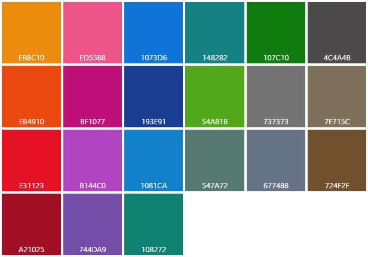

# 색

색은 앱의 다양한 수준의 정보를 통해 탐색하는 직관적인 방식을 제공하며 상호 작용 모델을 강화하는 데 중요한 도구 역할을 합니다.

Windows에서 색도 개인 고유의 것입니다. 색과 밝은 테마를 선택하거나 어두운 테마를 선택하여 환경에 전체적으로 반영할 수 있습니다.

## 테마 컬러

사용자는 *설정 &gt; 개인 설정 &gt; 색*에서 강조색이라고 하는 단일 색을 선택할 수 있습니다. 사용자는 48색 견본의 큐레이팅된 집합에서 테마를 선택할 수 있습니다(TV에 적합한 21색 색상표가 포함된 Xbox의 경우 제외).

<!-- Alternate version for the dev center. Need to add hex values. -->
 기본 테마 컬러

 Xbox 테마 컬러


사용자가 테마 컬러를 선택하면 시스템 테마의 일부로 나타납니다. 영향을 받는 영역은 시작, 작업 표시줄, 창 크롬, [공용 컨트롤](https://dev.windows.com/design/controls-patterns) 내의 선택한 상호 작용 상태 및 하이퍼링크입니다. 각 앱은 해당 앱의 입력 체계, 배경 및 상호 작용에 테마 컬러를 추가로 통합하거나 재정의하여 특정 브랜딩을 유지합니다.

## 색상표 구성 요소

테마 컬러를 선택하면 색 광도의 HSB 값에 따라 테마 컬러의 밝고 어두운 음영이 만들어집니다. 앱은 음영 변형을 사용하여 시각적 계층 구조를 만들고 상호 작용 지침을 제공할 수 있습니다.

하이퍼링크는 기본적으로 사용자의 테마 컬러를 사용 합니다. 페이지 배경이 유사한 색인 경우 효과적인 대비를 위해 하이퍼링크에 테마 음영을 더 밝거나 더 어둡게 지정할 수 있습니다.

 기본 테마 컬러의 다양한 음영(밝음/어두움)입니다.

 디자인 사양에 색 논리가 적용되는 방법에 대한 예입니다.

**참고**  XAML에서 `SystemAccentColor`라는 [테마 리소스](https://msdn.microsoft.com/library/windows/apps/Mt187274.aspx)가 기본 테마 컬러로 표시됩니다. `SystemAccentColorLight3`, `SystemAccentColorLight2`, `SystemAccentColorLight1`, `SystemAccentColorDark1`, `SystemAccentColorDark2`, 및 `SystemAccentColorDark3`를 음영으로 사용할 수 있습니다. 또한 [UISettings.GetColorValue](https://msdn.microsoft.com/library/windows/apps/windows.ui.viewmanagement.uisettings.getcolorvalue.aspx) 및 [UIColorType](https://msdn.microsoft.com/library/windows/apps/windows.ui.viewmanagement.uicolortype.aspx) 열거를 통해 프로그래밍 방식으로 사용할 수 있습니다.

## 색 테마 지정

사용자는 또한 시스템에 대해 밝거나 어두운 테마를 선택할 수 있습니다. 일부 앱은 사용자의 기본 설정에 따라 해당 테마를 변경하도록 선택하지만 옵트아웃(opt out)하는 앱도 있습니다.

밝은 테마를 사용하는 앱은 생산성 앱과 관련된 시나리오에 적합합니다. 예제는 Microsoft Office와 함께 사용할 수 있는 앱의 제품군입니다. 밝은 테마는 장기간의 작업과 함께 긴 길이의 텍스트를 읽기 쉽게 합니다.

어두운 테마는 미디어 중심인 앱의 콘텐츠 또는 풍부한 동영상 및 이미지로 사용자가 나타내려는 시나리오의 대비를 더 잘 보이도록 해 줍니다. 이러한 시나리오에서는 영화 시청 환경이 기본 작업일 수 있지만 읽기는 반드시 기본 작업이지는 않으며 주변 조명이 어두운 상태에서 표시됩니다.

앱이 이러한 설명과 맞지 않는 경우 다음 시스템 테마를 고려하면 사용자에게 적합한 테마를 결정할 수 있습니다.

테마를 더 쉽게 디자인하기 위해 Windows에서는 자동으로 테마에 맞게 조정되는 추가 색상표를 제공합니다.

<!-- OP version -->
### 밝은 테마
#### 기본

#### 대체

#### 목록

#### 크롬

### 어두운 테마
#### 기본

#### 대체

#### 목록

#### 크롬


## 테마 변경

App.xaml에서 **RequestedTheme** 속성을 변경하여 쉽게 테마를 변경할 수 있습니다.

```XAML
<Application
    x:Class="App9.App"
    xmlns="http://schemas.microsoft.com/winfx/2006/xaml/presentation"
    xmlns:x="http://schemas.microsoft.com/winfx/2006/xaml"
    xmlns:local="using:App9"
    RequestedTheme="Dark">

</Application>
```

**RequestedTheme**를 제거하면 응용 프로그램에 사용자의 앱 모드 설정이 적용되고 어둡거나 밝은 테마로 앱을 표시하도록 선택할 수 있음을 의미합니다. 

테마는 앱의 모양에 큰 영향을 미치므로 앱을 만들 때 테마를 고려해야 합니다.

## 접근성

색상표는 화면 사용에 최적화됩니다. 최적화된 읽기 환경을 위해 배경에 대한 텍스트 대비를 4.5: 1로 유지하는 것이 좋습니다. [명암비](http://leaverou.github.io/contrast-ratio/)와 같이 무료로 색 통과 여부를 테스트할 수 있는 많은 도구가 있습니다.

## 관련 문서

* [XAML 스타일](https://msdn.microsoft.com/windows/uwp/controls-and-patterns/xaml-theme-resources)
* [XAML 테마 리소스](https://msdn.microsoft.com/windows/uwp/controls-and-patterns/xaml-theme-resources)


<!--HONumber=Aug16_HO3-->


