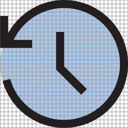
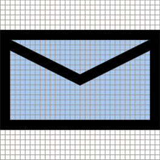
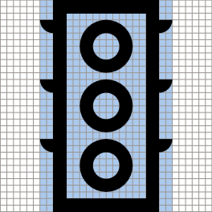
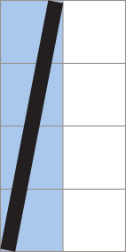
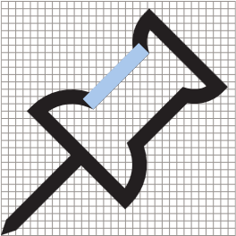
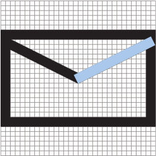
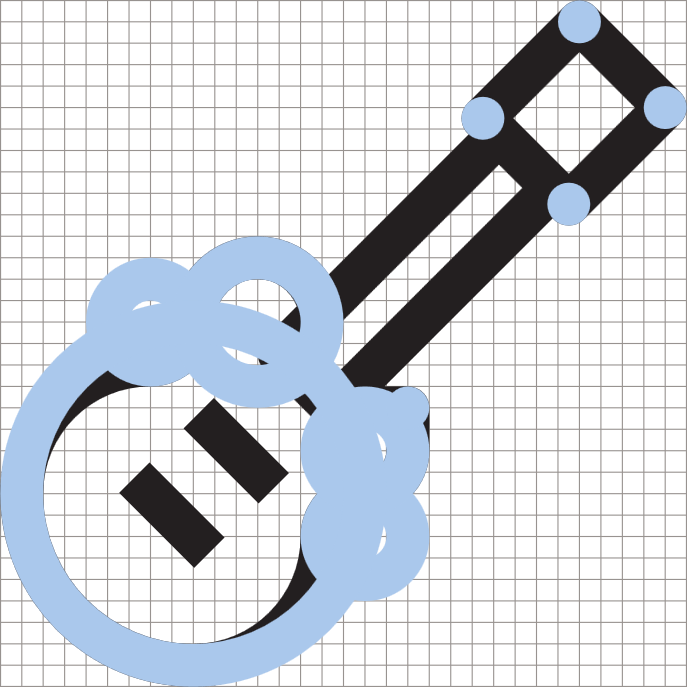
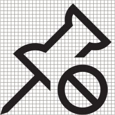

# UWP 앱의 아이콘

<link rel="stylesheet" href="https://az835927.vo.msecnd.net/sites/uwp/Resources/css/custom.css">

좋은 아이콘은 입력 체계 및 디자인 언어의 나머지 부분과 조화를 이룹니다. 상징을 혼합하지 않고 필요한 사항만 가능한 빠르고 단순하게 전달합니다. 

## 선형 배율 크기 램프 

<table>
    <tr> 
        <td>16px x 16px</td>
        <td>24px x 24px</td>
        <td>32px x 32px</td>
        <td>48px x 48px</td>
    </tr>
    <tr> 
        <td></td>
        <td></td>
        <td></td>
        <td></td>
    </tr>
</table>

## 일반적인 모양

아이콘은 일반적으로 안쪽 여백이 거의 없이 주어진 공간을 최대화해야 합니다. 이러한 모양은 기본 모양의 크기 조정을 위한 시작점을 제공합니다. 

아이콘의 방향에 해당하는 모양을 사용하고 이러한 기본 매개 변수를 중심으로 작성합니다. 아이콘이 모양 내부를 완전히 채우거나 맞지 않아도 되며, 최적 균형을 위해 필요에 따라 조정할 수 있습니다. 

<table class="uwpd-noborder">
    <tr>
        <td>원<td>
        <td>정사각형</td>
        <td>삼각형</td>
    </tr>
    <tr>
        <td><td>
        <td></td>
        <td></td>
    </tr>
        <tr>
        <td>가로 사각형<td>
        <td colspan="2">세로 사각형</td>        
        </tr>
    <tr>
        <td><td>
        <td colspan="2"></td>
         
    </tr>

</table>

## 각도

동일한 그리드 및 선 두께를 사용하는 것 외에도 아이콘은 공통 요소를 사용하여 생성됩니다. 

모양을 작성할 때 이러한 각도만 사용하면 모든 아이콘에서 일관성이 만들어지고 아이콘이 제대로 렌더링됩니다. 

아이콘을 만들 때 이러한 선을 결합, 연결, 회전 및 반사할 수 있습니다. 

<table>
    <tr>
        <td>**1:1** 45°</td>
        <td>**1:2** 26.57°(세로) 63.43°(가로)</td>
        <td>**1:3** 18.43°(세로) 71.57°(가로)</td>
        <td>**1:4** 14.04°(세로) 75.96°(가로)</td>
    </tr>
    <tr>
        
        <td></td>
        <td></td>
        <td></td>
        <td></td>
    </tr>  
</table>

예를 들면 다음과 같습니다.

<table>
    <tr>
        <td></td>
        <td></td>
        <td></td>
        <td></td>
    </tr>
</table>

## 곡선

곡선은 전체 원의 섹션에서 생성되며, 픽셀 그리드에 맞춰야 하는 경우가 아니면 기울이면 안 됩니다. 

<table>
    <tr>
        <td>1/4 원</td>
        <td>1/8 원</td>
    </tr>
    <tr>
        <td></td>
        <td></td>
    </tr>
    <tr>
        <td></td>
        <td></td>
    </tr>    
</table>

## 기하 도형 생성

아이콘을 생성할 때는 순수 기하 도형만 사용하는 것이 좋습니다.

## 채워진 도형 

필요한 경우 아이콘에 채워진 도형이 포함될 수 있지만 32px × 32px에서 4px를 넘지 않아야 합니다. 채워진 원은 6px × 6px보다 크지 않아야 합니다. 

## 배지

"배지"는 기본 아이콘 요소와 통합되지 않는, 아이콘에 추가된 요소를 설명하는 데 사용되는 일반 용어입니다. 일반적으로 상태, 작업 등 아이콘에 대한 기타 정보를 전달합니다. 다른 일반 용어에는 오버레이, 주석, 한정자 등이 있습니다. 

상태 배지는 아이콘 위에 있는 채워진 컬러 개체를 사용하고, 작업 배지는 동일한 단색 스타일과 선 두께로 아이콘에 통합됩니다.

<table>
<tr>
    <td>일반적인 상태 배지</td>
    <td>일반적인 작업 배지</td>
</tr>
<tr>
    <td></td>
    <td></td>
</tr>
</table>

### 배지 색 

컬러 배지는 아이콘 상태를 전달하는 용도로만 사용해야 합니다. 상태 배지에 사용된 색은 사용자에게 감정적인 특정 메시지를 전달합니다. 

<table>
<tr><td>녹색 - #128B44</td><td>파랑 - #2C71B9</td><td>노랑 - #FDC214</td></tr>
<tr><td>양: 완료, 완료됨 </td><td>중립: 도움말, 알림 </td><td>주의: 알림, 경고 </td></tr>
<tr><td></td><td></td>
<td></td></tr>
</table>

### 배지 위치

모든 상태 또는 작업의 기본 위치는 오른쪽 아래입니다. 디자인에서 허용되지 않는 경우에만 다른 위치를 사용합니다. 

### 배지 크기 조정

배지 크기는 32px × 32px 그리드에서 10-18 px로 조정해야 합니다. 

## 관련 문서

* [타일 및 아이콘 자산에 대한 지침](../controls-and-patterns/tiles-and-notifications-app-assets.md)

<!--HONumber=Dec16_HO2-->

