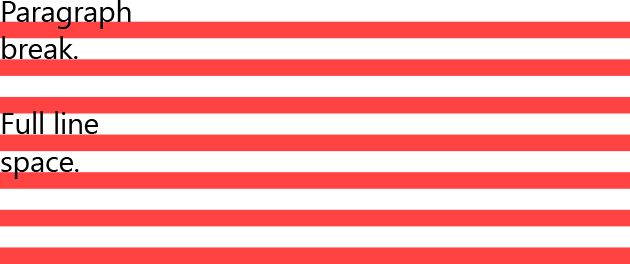
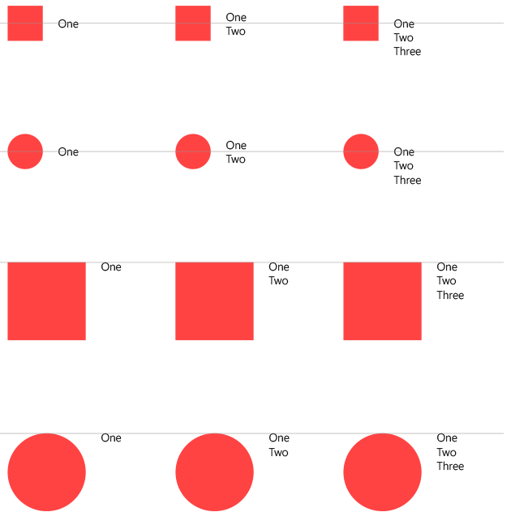

# <a name="typography"></a>입력 체계

언어의 시각적인 표현으로써 입력 체계의 주요 작업은 명확하게 하는 것입니다. 입력 체계의 스타일이 그 목표를 방해해서는 안 됩니다. 그러나 입력 체계는 레이아웃 구성 요소로서(디자인의 밀도 및 복잡성에 큰 영향을 미침), 그리고 해당 디자인의 사용자 환경에서도 중요한 역할을 합니다.

## <a name="typeface"></a>서체

모든 Microsoft 디지털 디자인에서 사용하도록 Segoe UI를 선택했습니다. Segoe UI는 다양한 문자를 제공하며, 여러 크기 및 픽셀 밀도에서 최적 가독성을 유지하도록 설계되었습니다. 시스템의 콘텐츠를 보완하는 깔끔하고 밝고 개방적인 아름다움을 제공합니다.


## <a name="weights"></a>두께

단순성과 효율성을 중심으로 입력 체계에 접근합니다. 하나의 서체, 최소 두께 및 크기, 명확한 계층 구조를 사용하도록 선택합니다. 위치 및 맞춤은 지정된 언어의 기본 스타일을 따릅니다. 영어에서 순서는 왼쪽에서 오른쪽, 위에서 아래로 진행됩니다. 텍스트와 이미지 간의 관계는 명확하고 간단합니다.


## <a name="line-spacing"></a>줄 간격


줄 간격은 글꼴 크기의 125%로 계산되어야 하며, 필요한 경우 가장 가까운 4의 배수로 반올림됩니다. 예를 들어 15px Segoe UI에서 15px의 125%는 18.75px입니다. 4px 그리드를 유지하기 위해 반올림하여 줄 높이를 20px로 설정하는 것이 좋습니다. 이렇게 하면 좋은 읽기 환경과 충분한 분음 부호 공간이 보장됩니다. 구체적인 예는 아래의 유형 램프 섹션을 참조하세요.

큰 형식을 작은 형식 위에 겹치는 경우 큰 형식의 마지막 기준선에서 작은 형식의 첫 번째 기준선까지의 거리는 큰 형식의 줄 높이와 같아야 합니다.


XAML에서 이 작업을 수행하려면 두 개의 [TextBlock](https://msdn.microsoft.com/en-us/library/windows/apps/windows.ui.xaml.controls.textblock.aspx)을 겹치고 적절한 여백을 설정합니다.

```xml
<StackPanel Width="200">
    <!-- Setting a bottom margin of 3px on the header
         puts the baseline of the body text exactly 24px
         below the baseline of the header. 24px is the
         recommended line height for a 20px font size,
         which is what's set in SubtitleTextBlockStyle.
         The bottom margin will be different for
         different font size pairings. -->
    <TextBlock
        Style="{StaticResource SubtitleTextBlockStyle}"
        Margin="0,0,0,3"
        Text="Header text" />
    <TextBlock
        Style="{StaticResource BodyTextBlockStyle}"
        TextWrapping="Wrap"
        Text="This line of text should be positioned where the above header would have wrapped." />
</StackPanel>
```


## <a name="kerning-and-tracking"></a>커닝 및 추적

Segoe는 부드럽고 친숙한 모양을 가진 인간 중심의 서체로, 필기 텍스트 기반의 유기적이고 개방적인 형태를 사용합니다. 최적 가독성을 보장하고 인간 중심의 무결성을 유지하려면 커닝 및 추적 설정에 특정 값이 있어야 합니다.

커닝을 "메트릭"으로 설정해야 하고 추적을 "0"으로 설정해야 합니다.


## <a name="word-and-letter-spacing"></a>단어 및 문자 간격

커닝 및 추적과 마찬가지로 단어 간격 및 문자 간격은 특정 설정을 사용하여 최적 가독성과 인간 중심의 무결성을 보장합니다.

기본적으로 단어 간격은 항상 100%이고 문자 간격은 "0"으로 설정해야 합니다.


**참고**&nbsp;&nbsp;XAML 텍스트 컨트롤에서는 커닝 제어를 위해 [Typogrphy.Kerning](https://msdn.microsoft.com/en-us/library/windows/apps/windows.ui.xaml.documents.typography.kerning.aspx)을, 추적 제어를 위해 [FontStretch](https://msdn.microsoft.com/en-us/library/windows/apps/windows.ui.xaml.controls.control.fontstretch.aspx)를 사용합니다. 기본적으로 Typography.Kerning은 “true”로, FontStretch는 “Normal”로 설정되어 있으며, 이것이 권장되는 값입니다.


## <a name="alignment"></a>맞춤

일반적으로 형식의 시각적 요소 및 열은 왼쪽 맞춤으로 두는 것이 좋습니다. 대부분의 경우 이 왼쪽 맞춤 방법은 일관된 콘텐츠 고정과 균일한 레이아웃을 제공합니다.


## <a name="line-endings"></a>줄의 끝

입력 체계가 왼쪽 맞춤으로 배치되지 않은 경우 줄의 끝을 맞추고 하이픈 사용을 피하세요.


## <a name="paragraphs"></a>단락

정렬된 열 가장자리를 제공하려면 들여쓰기 없이 줄을 건너뛰어 단락을 표시해야 합니다.



## <a name="character-count"></a>문자 수

줄이 너무 짧으면 눈은 왼쪽과 오른쪽으로 너무 자주 이동해야 하므로 독자의 리듬이 깨어집니다. 가능하면 읽기 쉽도록 줄당 50-60자를 사용하는 것이 가장 좋습니다.

Segoe는 다양한 문자를 제공하며, 작고 큰 크기와 낮고 높은 픽셀 밀도에서 최적 가독성을 유지하도록 설계되었습니다. 텍스트 열 줄에 최적 문자 수를 사용하면 응용 프로그램에서 좋은 가독성이 보장됩니다.

줄이 너무 길면 눈을 피로하게 하고 사용자에게 혼동을 줄 수 있습니다. 줄이 너무 짧으면 독자의 눈이 너무 많이 이동해야 하며 피로감을 유발할 수 있습니다.


## <a name="hanging-text-alignment"></a>내어쓰기 텍스트 맞춤

아이콘 크기 및 텍스트 양에 따라 다양한 방법으로 텍스트와 아이콘의 가로 맞춤을 처리할 수 있습니다. 한 줄 또는 여러 줄의 텍스트가 아이콘 높이 내에 들어가는 경우 텍스트를 세로로 가운데에 배치해야 합니다.

텍스트 높이가 아이콘 높이를 넘어가면 첫 번째 텍스트 줄을 세로로 맞춰야 하며 추가 텍스트는 아래로 자연스럽게 진행되어야 합니다. 대문자, 올림 영자 및 내림 영자 높이가 큰 문자를 사용하는 경우 동일한 맞춤 지침을 준수하도록 주의해야 합니다.



**참고**&nbsp;&nbsp;XAML의 [TextBlock.TextLineBounds](https://msdn.microsoft.com/en-us/library/windows/apps/windows.ui.xaml.controls.textblock.textlinebounds.aspx) 속성은 대문자 높이와 기본 글꼴 메트릭에 대한 액세스를 제공합니다. 또한 글씨를 세로 중간이나 위쪽에 맞추기 위해서도 사용할 수 있습니다.

## <a name="clipping-and-ellipses"></a>클리핑 및 줄임표

기본적으로 클리핑 - redline으로 달리 지정되지 않은 경우 텍스트가 줄 바꿈된다고 가정합니다. 줄 바꿈되지 않는 텍스트를 사용하는 경우 줄임표 대신 클리핑을 사용하는 것이 좋습니다. 클리핑은 컨테이너 가장자리, 디바이스 가장자리, 스크롤 막대 가장자리 등에서 발생할 수 있습니다.

예외 - 잘 정의되지 않은(예: 차별화된 배경색 없음) 컨테이너의 경우 줄 바꿈되지 않는 텍스트를 redline으로 처리하여 "..." 줄임표를 사용할 수 있습니다.


## <a name="type-ramp"></a>유형 램프
유형 램프는 헤드라인과 본문 텍스트 간에 중요한 디자인 관계를 설정하고 각 수준 간의 명확하고 쉽게 이해할 수 있는 계층 구조를 보장합니다. 이 계층 구조는 사용자가 서면 통신을 쉽게 탐색할 수 있는 구조를 만듭니다.

 모든 크기는 유효 픽셀 단위입니다. 


**참고**&nbsp;&nbsp;대부분의 램프 수준은 `*TextBlockStyle` 명명 규칙(예: `HeaderTextBlockStyle`)을 따르는 XAML [정적 리소스](https://msdn.microsoft.com/en-us/library/windows/apps/Mt187274.aspx#the_xaml_type_ramp)로 사용할 수 있습니다.


## <a name="primary-and-secondary-text"></a>기본 및 보조 텍스트

유형 램프 이상의 추가 계층 구조를 만들려면 보조 텍스트를 60% 불투명도로 설정합니다. [테마 색상표](color.md#color-theming)에서 BaseMedium을 사용합니다. 기본 텍스트는 항상 100% 불투명도 또는 BaseHigh여야 합니다.


## <a name="all-caps-titles"></a>모두 대문자 제목

특정 페이지 제목은 모두 대문자로 표시하여 또 다른 차원의 계층 구조를 추가해야 합니다. 이러한 제목은 문자 간격을 75 1/1000em으로 설정해서 BaseAlt를 사용해야 합니다. 앱 탐색에 도움이 되도록 이러한 처리를 사용할 수도 있습니다.

그러나 특정 언어에서 대문자로 표시할 경우 적절한 이름의 의미가 변경되므로 이름 또는 사용자 입력 기반의 페이지 제목은 모든 대문자로 변환하지 *않도록* 해야 합니다.


**권장 사항**


* 대부분의 텍스트에 Body를 사용합니다.
* 공간이 제한된 경우 제목에 Base를 사용합니다.
* SubtitleAlt를 통합하여 최상위 수준 콘텐츠를 강조해서 대비 및 계층 구조를 만듭니다.


**금지 사항**


* 긴 문자열 또는 기본 작업에는 캡션을 사용하지 않습니다.
* 텍스트가 줄 바꿈되어야 하는 경우 Header 또는 Subheader를 사용하지 않습니다.
* 동일한 페이지에서 Subtitle 및 SubtitleAlt를 함께 사용하지 않습니다.


## <a name="related-articles"></a>관련 문서

* [텍스트 컨트롤](../controls-and-patterns/text-controls.md)


<!--HONumber=Dec16_HO1-->


