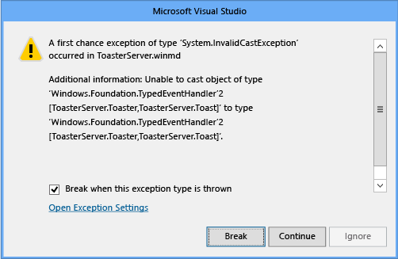

# <a name="raising-events-in-windows-runtime-components"></a>Windows 런타임 구성 요소에서 이벤트 발생
> [!NOTE]
> 이벤트 발생 하는 방법을 알아보려면는 [C + + WinRT](../cpp-and-winrt-apis/intro-to-using-cpp-with-winrt.md) Windows 런타임 구성 요소를 참조 하세요 [작성 이벤트 C + + WinRT](../cpp-and-winrt-apis/author-events.md).

Windows 런타임 구성 요소가 백그라운드 스레드(작업자 스레드)에서 사용자 정의 대리자 형식의 이벤트를 발생시키며 JavaScript가 이벤트를 받을 수 있게 하려는 경우 다음 방법 중 하나로 구현 및/또는 발생시킬 수 있습니다.

-   (옵션 1) [Windows.UI.Core.CoreDispatcher](https://msdn.microsoft.com/library/windows/apps/windows.ui.core.coredispatcher.aspx)를 통해 이벤트를 발생시켜 이벤트를 JavaScript 스레드 컨텍스트로 마샬링합니다. 일반적으로 이것이 최상의 옵션이지만 일부 시나리오에서는 가장 빠른 성능을 제공하지 않을 수도 있습니다.
-   (옵션 2) [Windows.Foundation.EventHandler](https://msdn.microsoft.com/library/windows/apps/br206577.aspx)&lt;Object&gt;를 사용하지만 형식 정보가 손실됩니다(이벤트 유형 정보가 손실됨). 옵션 1이 불가능하거나 성능이 부적절한 경우 형식 정보가 손실되어도 되면 두 번째 선택 항목으로 사용하기에 적합합니다.
-   (옵션 3) 구성 요소에 대한 고유한 프록시 및 스텁을 만듭니다. 이 옵션은 구현하기 가장 어렵지만 형식 정보가 유지되며 까다로운 시나리오에서 옵션 1에 비해 더 나은 성능을 제공할 수 있습니다.

이러한 옵션 중 하나를 사용하지 않고 백그라운드 스레드에서 이벤트를 발생시킬 경우 JavaScript 클라이언트에 이벤트가 수신되지 않습니다.

## <a name="background"></a>배경

모든 Windows 런타임 구성 요소 및 앱은 어떤 언어로 만들든지 관계없이 기본적으로 COM 개체입니다. Windows API에서는 대부분의 구성 요소가 백그라운드 스레드 및 UI 스레드에서 개체와 똑같이 잘 통신할 수 있는 Agile COM 개체입니다. COM 개체를 Agile로 설정할 수 없는 경우 UI 스레드-백그라운드 스레드 경계를 넘어 다른 COM 개체와 통신하려면 프록시 및 스텁으로 알려진 도우미 개체가 필요합니다. COM 용어로 이를 스레드 아파트 간 통신이라고 합니다.

Windows API의 개체는 대부분 Agile이거나 프록시 및 스텁이 기본 제공되어 있습니다. 그러나 Windows.Foundation.[TypedEventHandler&lt;TSender, TResult&gt;](https://msdn.microsoft.com/library/windows/apps/br225997.aspx) 같은 제네릭 형식의 경우 형식 인수를 제공할 때까지 완전한 형식이 아니기 때문에 해당 프록시 및 스텁을 만들 수 없습니다. 프록시 또는 스텁이 없을 경우 문제가 되는 것은 JavaScript 클라이언트뿐이지만 C++ 또는 .NET 언어뿐 아니라 JavaScript에서 구성 요소를 사용할 수 있게 하려면 다음 세 가지 옵션 중 하나를 사용해야 합니다.

## <a name="option-1-raise-the-event-through-the-coredispatcher"></a>(옵션 1) CoreDispatcher를 통해 이벤트 발생

[Windows.UI.Core.CoreDispatcher](https://msdn.microsoft.com/library/windows/apps/windows.ui.core.coredispatcher.aspx)를 사용하여 사용자 정의 대리자 형식의 이벤트를 보낼 수 있으며, JavaScript가 받을 수 있습니다. 어떤 옵션을 사용할지 잘 모르겠으면 이 옵션을 먼저 시도해 보세요. 이벤트 발생과 이벤트 처리 간의 대기 시간이 문제가 되는 경우 다른 옵션 중 하나를 시도합니다.

다음 예제에서는 CoreDispatcher를 사용하여 강력한 형식의 이벤트를 발생시키는 방법을 보여 줍니다. 형식 인수가 개체가 아니라 알림인지 확인합니다.

```csharp
public event EventHandler<Toast> ToastCompletedEvent;
private void OnToastCompleted(Toast args)
{
    var completedEvent = ToastCompletedEvent;
    if (completedEvent != null)
    {
        completedEvent(this, args);
    }
}

public void MakeToastWithDispatcher(string message)
{
    Toast toast = new Toast(message);
    // Assume you have a CoreDispatcher at class scope.
    // Initialize it here, then use it from the background thread.
    var window = Windows.UI.Core.CoreWindow.GetForCurrentThread();
    m_dispatcher = window.Dispatcher;

    Task.Run( () =>
    {
        if (ToastCompletedEvent != null)
        {
            m_dispatcher.RunAsync(CoreDispatcherPriority.Normal,
            new DispatchedHandler(() =>
            {
                this.OnToastCompleted(toast);
            })); // end m_dispatcher.RunAsync
         }
     }); // end Task.Run
}
```

## <a name="option-2-use-eventhandlerltobjectgt-but-lose-type-information"></a>(옵션 2) EventHandler&lt;Object&gt;를 사용하지만 형식 정보 손실

백그라운드 스레드에서 이벤트를 전송하는 또 다른 방법은 [Windows.Foundation.EventHandler](https://msdn.microsoft.com/library/windows/apps/br206577.aspx)&lt;Object&gt;를 이벤트 유형으로 사용하는 것입니다. Windows는 제네릭 형식의 구체적인 인스턴스화와 해당 프록시 및 스텁을 제공합니다. 단점은 이벤트 인수의 형식 정보와 보낸 사람이 손실된다는 것입니다. C++ 및 .NET 클라이언트는 설명서를 통해 이벤트가 수신될 때 다시 캐스팅할 형식을 알고 있어야 합니다. JavaScript 클라이언트는 원래 형식 정보가 필요하지 않습니다. 메타데이터의 해당 이름에 따라 인수 속성을 찾습니다.

이 예제에서는 C#에서 Windows.Foundation.EventHandler&lt;Object&gt;를 사용하는 방법을 보여 줍니다.

```csharp
public sealed Class1
{
// Declare the event
public event EventHandler<Object> ToastCompletedEvent;

    // Raise the event
    public async void MakeToast(string message)
    {
        Toast toast = new Toast(message);
        // Fire the event from a background thread to allow this thread to continue
        Task.Run(() =>
        {
            if (ToastCompletedEvent != null)
            {
                OnToastCompleted(toast);
            }
        });
    }

    private void OnToastCompleted(Toast args)
    {
        var completedEvent = ToastCompletedEvent;
        if (completedEvent != null)
        {
            completedEvent(this, args);
        }
    }
}
```

아래와 같이 JavaScript 쪽에서 이 이벤트를 사용합니다.

```javascript
toastCompletedEventHandler: function (event) {
   var toastType = event.toast.toastType;
   document.getElementById("toasterOutput").innerHTML = "<p>Made " + toastType + " toast</p>";
}
```

## <a name="option-3-create-your-own-proxy-and-stub"></a>(옵션 3) 고유한 프록시 및 스텁 만들기

완전하게 보존된 형식 정보가 있는 사용자 정의 이벤트 유형에서 성능을 향상시키려면 고유한 프록시 및 스텁 개체를 만들고 앱 패키지에 포함해야 합니다. 일반적으로 다른 두 옵션이 모두 부적절한 드문 경우에만 이 옵션을 사용해야 합니다. 또한 이 옵션이 다른 두 옵션보다 더 나은 성능을 제공한다는 보장은 없습니다. 실제 성능은 여러 요인에 따라 달라집니다. Visual Studio 프로파일러 또는 다른 프로파일링 도구를 사용하여 응용 프로그램의 실제 성능을 측정하고 이벤트가 사실상 병목인지 여부를 확인할 수 있습니다.

이 문서의 나머지 부분에서는 C#을 사용하여 Windows 런타임 구성 요소를 만든 후 C++를 사용하여 비동기 작업에서 구성 요소에 의해 발생한 Windows.Foundation.TypedEventHandler&lt;TSender, TResult&gt; 이벤트를 JavaScript가 사용할 수 있도록 하는 프록시 및 스텁에 대한 DLL을 만드는 방법을 보여 줍니다. C++ 또는 Visual Basic을 사용하여 구성 요소를 만들 수도 있습니다. 프록시와 스텁을 만드는 단계는 동일합니다. 이 연습은 Windows 런타임 In Process 구성 요소 샘플(C++/CX) 만들기를 기반으로 하며 해당 용도를 설명하는 데 도움이 됩니다.

이 연습은 다음 부분으로 이루어져 있습니다.

-   여기서는 두 가지 기본 Windows 런타임 클래스를 만듭니다. 한 클래스는 [Windows.Foundation.TypedEventHandler&lt;TSender, TResult&gt;](https://msdn.microsoft.com/library/windows/apps/br225997.aspx) 형식의 이벤트를 표시하고 다른 클래스는 JavaScript에 TValue의 인수로 반환되는 형식입니다. 두 클래스는 이후 단계를 완료할 때까지 JavaScript와 통신할 수 없습니다.
-   이 앱은 기본 클래스 개체를 활성화하고, 메서드를 호출한 다음 Windows 런타임 구성 요소에 의해 발생한 이벤트를 처리합니다.
-   이러한 작업은 프록시 및 스텁 클래스를 생성하는 도구에 필요합니다.
-   그런 다음 IDL 파일을 사용하여 프록시 및 스텁에 대한 C 소스 코드를 생성합니다.
-   COM 런타임이 찾을 수 있도록 프록시-스텁 개체를 등록하고 앱 프로젝트에서 프록시-스텁 DLL을 참조합니다.

## <a name="to-create-the-windows-runtime-component"></a>Windows 런타임 구성 요소를 만들려면

Visual Studio의 메뉴 모음에서 **파일 &gt; 새 프로젝트**를 선택합니다. **새 프로젝트** 대화 상자에서 **JavaScript &gt; 유니버설 Windows**를 확장하고 **빈 앱**을 선택합니다. 프로젝트 이름을 ToasterApplication으로 지정하고 **확인** 단추를 선택합니다.

C# Windows 런타임 구성 요소를 솔루션에 추가합니다. 솔루션 탐색기에서 솔루션의 바로 가기 메뉴를 열고 **추가 &gt; 새 프로젝트**를 선택합니다. 확장 **Visual C# &gt; Microsoft Store** 한 다음 **Windows 런타임 구성 요소**를 선택 합니다. 프로젝트 이름을 ToasterComponent로 지정하고 **확인** 단추를 선택합니다. ToasterComponent는 이후 단계에서 만들 구성 요소의 루트 네임스페이스가 됩니다.

솔루션 탐색기에서 솔루션의 바로 가기 메뉴를 열고 **속성**을 선택합니다. **속성 페이지** 대화 상자의 왼쪽 창에서 **구성 속성**을 선택하고 대화 상자 맨 위에서 **구성**을 **디버그**로, **플랫폼**을 x86, x64 또는 ARM으로 설정합니다. **확인** 단추를 선택합니다.

**중요** 플랫폼 = 나중에 솔루션에 추가할 네이티브 코드 Win32 DLL에 유효하지 않으므로 모든 CPU는 작동하지 않습니다.

솔루션 탐색기에서 class1.cs의 이름을 프로젝트 이름과 일치하도록 ToasterComponent.cs로 바꿉니다. Visual Studio에서 파일의 클래스 이름을 새 파일 이름과 일치하도록 자동으로 바꿉니다.

.cs 파일에서 Windows.Foundation 네임스페이스에 대한 using 지시문을 추가하여 TypedEventHandler를 범위로 가져옵니다.

프록시 및 스텁이 필요한 경우 구성 요소에서 인터페이스를 사용하여 공용 멤버를 표시해야 합니다. ToasterComponent.cs에서 toaster에 대한 인터페이스와 toaster가 생성하는 알림에 대한 인터페이스를 정의합니다.

**참고** C#에서는 이 단계를 건너뛸 수 있습니다. 대신, 먼저 클래스를 만든 후 해당 바로 가기 메뉴를 열고 **리팩터링 &gt; 인터페이스 추출**을 선택합니다. 생성된 코드에서 수동으로 인터페이스에 공개 접근성을 제공합니다.

```csharp
    public interface IToaster
        {
            void MakeToast(String message);
            event TypedEventHandler<Toaster, Toast> ToastCompletedEvent;

        }
        public interface IToast
        {
            String ToastType { get; }
        }
```

IToast 인터페이스에는 알림 유형을 설명하기 위해 검색할 수 있는 문자열이 있습니다. IToaster 인터페이스에는 알림을 만들 메서드 및 알림이 만들어졌음을 나타내는 이벤트가 있습니다. 이 이벤트는 알림의 특정 부분(즉, 형식)을 반환하므로 형식화된 이벤트라고 합니다.

다음에는 이러한 인터페이스를 구현하며 나중에 프로그래밍할 JavaScript 앱에서 액세스할 수 있도록 public 및 sealed인 클래스가 필요합니다.

```csharp
    public sealed class Toast : IToast
        {
            private string _toastType;

            public string ToastType
            {
                get
                {
                    return _toastType;
                }
            }
            internal Toast(String toastType)
            {
                _toastType = toastType;
            }

        }
        public sealed class Toaster : IToaster
        {
            public event TypedEventHandler<Toaster, Toast> ToastCompletedEvent;

            private void OnToastCompleted(Toast args)
            {
                var completedEvent = ToastCompletedEvent;
                if (completedEvent != null)
                {
                    completedEvent(this, args);
                }
            }

            public void MakeToast(string message)
            {
                Toast toast = new Toast(message);
                // Fire the event from a thread-pool thread to enable this thread to continue
                Windows.System.Threading.ThreadPool.RunAsync(
                (IAsyncAction action) =>
                {
                    if (ToastCompletedEvent != null)
                    {
                        OnToastCompleted(toast);
                    }
                });
           }
        }
```

앞의 코드에서 알림을 만든 후 스레드 풀 작업 항목을 회전하여 알림을 발생시킵니다. IDE에서 비동기 호출에 awaiIt 키워드를 적용하도록 제안할 수도 있지만 이 경우에는 메서드가 작업 결과에 따라 달라지는 작업을 수행하지 않으므로 필요하지 않습니다.

**참고** 앞의 코드에서 비동기 호출은 ThreadPool.RunAsync만 사용하여 백그라운드 스레드에서 이벤트를 발생시키는 간단한 방법을 보여 줍니다. 다음 예제와 같이 이 특정 메서드를 작성할 수 있으며, .NET 작업 스케줄러에서 자동으로 async/await 호출을 UI 스레드로 다시 마샬링하기 때문에 제대로 작동합니다.
  
```csharp
    public async void MakeToast(string message)
    {
        Toast toast = new Toast(message)
        await Task.Delay(new Random().Next(1000));
        OnToastCompleted(toast);
    }
```

프로젝트를 빌드할 경우 완전히 구축 해야 합니다.

## <a name="to-program-the-javascript-app"></a>JavaScript 앱의 프로그래밍

이제 단추를 알림 확인을 방금 정의한 클래스를 사용 하도록 할 수 JavaScript 앱에 추가 수 있습니다. 이 작업을 수행 하에서는 방금 만든 ToasterComponent 프로젝트에 대 한 참조를 추가 해야 했습니다. 솔루션 탐색기에서 toasterapplication으로 지정 프로젝트에 대 한 바로 가기 메뉴를 열고, 선택 **추가 &gt; 참조**, **새 참조 추가** 단추를 선택 합니다. 솔루션에서 왼쪽된 창에서 참조 추가 대화 상자에서 구성 요소 프로젝트를 선택 하 고 가운데 창에서 ToasterComponent을 선택 합니다. **확인** 단추를 선택합니다.

솔루션 탐색기에서 toasterapplication으로 지정 프로젝트에 대 한 바로 가기 메뉴를 열고 선택한 후 **시작 프로젝트로 설정**합니다.

Default.js 파일의 끝 구성 요소를 호출 하 고 그에 따른 다시 호출 하는 함수를 포함 하는 네임 스페이스를 추가 합니다. 네임 스페이스에는 두 함수를 알림 및 알림 완료 이벤트를 처리할 생깁니다. MakeToast 구현 Toaster 개체를 만듭니다, 그리고 이벤트 처리기를 등록 하 고 알림을 만듭니다. 지금 까지는 이벤트 처리기 그다지, 다음과 같이 합니다.

```javascript
    WinJS.Namespace.define("ToasterApplication"), {
       makeToast: function () {

          var toaster = new ToasterComponent.Toaster();
          //toaster.addEventListener("ontoastcompletedevent", ToasterApplication.toastCompletedEventHandler);
          toaster.ontoastcompletedevent = ToasterApplication.toastCompletedEventHandler;
          toaster.makeToast("Peanut Butter");
       },

       toastCompletedEventHandler: function(event) {
           // The sender of the event (the delegate's first type parameter)
           // is mapped to event.target. The second argument of the delegate
           // is contained in event, which means in this case event is a
           // Toast class, with a toastType string.
           var toastType = event.toastType;

           document.getElementById('toastOutput').innerHTML = "<p>Made " + toastType + " toast</p>";
        },
    });
```

MakeToast 함수 단추를 연결할 수 있어야 합니다. 단추 및 일부 공간 알림을 만드는 결과 출력을 포함 하도록 업데이트 default.html:

```html
    <body>
        <h1>Click the button to make toast</h1>
        <button onclick="ToasterApplication.makeToast()">Make Toast!</button>
        <div id="toasterOutput">
            <p>No Toast Yet...</p>
        </div>
    </body>
```

TypedEventHandler를 사용 하는 실현할 수 없는 경우에서는 이제 수 로컬 컴퓨터에서 앱을 실행 하 고 알림 단추를 클릭 합니다. 하지만, 앱에서 아무 작업도 합니다. 그 이유를 확인 하려면는 ToastCompletedEvent 발생 하는 관리 코드를 디버그 해 보겠습니다. 프로젝트를 중지 하 고 메뉴 모음에서 선택 **디버그 &gt; Toaster 응용 프로그램 속성**. **디버거 형식** 을 변경 **만 관리**합니다. 메뉴 모음에서 선택 다시 **디버그 &gt; 예외**을 **공용 언어 런타임 예외**를 선택 합니다.

이제 앱을 실행 하 고 만들기 알림 단추를 클릭 합니다. 디버거 잘못 된 캐스팅 예외를 catch합니다. 해당 메시지 로부터 명확 하지는 않지만 해당 인터페이스에 대 한 프록시 없으므로이 예외가 발생 합니다.



프록시 및 스텁을 구성 요소를 만드는 첫 번째 단계는 인터페이스에는 고유 ID 또는 GUID를 추가 하는 것입니다. 그러나 사용 하는 GUID 형식은 C#, Visual Basic 또는 다른.NET 언어 또는 c + +에서 코딩 하는 여부에 따라 다릅니다.

## <a name="to-generate-guids-for-the-components-interfaces-c-and-other-net-languages"></a>구성 요소의 인터페이스 (C# 및 다른.NET 언어)에 대 한 Guid를 생성 하려면

메뉴 모음에서 선택 도구 &gt; GUID 만들기. 대화 상자에서 5를 선택 합니다. \[Guid ("xxxxxxxx xxxx... xxxx) \]. 새 GUID 단추를 선택 하 고 복사 단추를 선택 합니다.


인터페이스 정의 돌아가서 다음 다음 예와 같이 IToaster 인터페이스 직전 새 GUID를 붙여넣습니다. (이 예제에서 GUID를 사용 하지 마세요. 모든 고유한 인터페이스 있어야는 고유한 GUID입니다.)

```cpp
[Guid("FC198F74-A808-4E2A-9255-264746965B9F")]
        public interface IToaster...
```

사용 하 여 추가 System.Runtime.InteropServices 네임 스페이스에 대 한 지시문 합니다.

IToast 인터페이스에 대해 이러한 단계를 반복 합니다.

## <a name="to-generate-guids-for-the-components-interfaces-c"></a>구성 요소의 인터페이스 (c + +)에 대 한 Guid를 생성 하려면

메뉴 모음에서 선택 도구 &gt; GUID 만들기. 대화 상자에서 3을 선택 합니다. 정적 const 구조체 GUID = {...} 합니다. 새 GUID 단추를 선택 하 고 복사 단추를 선택 합니다.

IToaster 인터페이스 정의 직전 GUID를 붙여 넣습니다. 붙여넣기를 수행 하면 후 GUID 다음 예제와 유사 합니다. (이 예제에서 GUID를 사용 하지 마세요. 모든 고유한 인터페이스 있어야는 고유한 GUID입니다.)
```cpp
// {F8D30778-9EAF-409C-BCCD-C8B24442B09B}
    static const GUID <<name>> = { 0xf8d30778, 0x9eaf, 0x409c, { 0xbc, 0xcd, 0xc8, 0xb2, 0x44, 0x42, 0xb0, 0x9b } };
```
사용 하 여 추가 Windows.Foundation.Metadata GuidAttribute 고객에 게 제공 범위에 대 한 지시문 합니다.

이제 수동으로 변환 const GUID는 GuidAttribute 다음 예와 같이 형식이 되도록 합니다. 대괄호와 괄호 중괄호는 대체 후행 세미콜론 제거 되는 볼 수 있습니다.
```cpp
// {E976784C-AADE-4EA4-A4C0-B0C2FD1307C3}
    [GuidAttribute(0xe976784c, 0xaade, 0x4ea4, 0xa4, 0xc0, 0xb0, 0xc2, 0xfd, 0x13, 0x7, 0xc3)]
    public interface IToaster
    {...
```
IToast 인터페이스에 대해 이러한 단계를 반복 합니다.

이제 인터페이스 고유 Id가 있는 수 IDL 파일 winmdidl 명령줄 도구에.winmd 파일을 저장 하 여 만들고 MIDL 명령줄 도구에 해당 IDL 파일을 저장 하 여 프록시 및 스텁 C 소스 코드를 생성 합니다. Visual Studio 우리에 대 한 경우 이렇게 다음 단계에 표시 된 대로 사후 빌드 이벤트를 만듭니다.

## <a name="to-generate-the-proxy-and-stub-source-code"></a>프록시를 생성 하 여 소스 코드 스텁

솔루션 탐색기에서 사용자 지정 빌드 후 이벤트를 추가 하려면 ToasterComponent 프로젝트에 대 한 바로 가기 메뉴를 열고 하 고 속성을 선택 합니다. 속성 페이지의 왼쪽된 창에서 빌드 이벤트를 선택 하 고 편집 post-build 단추를 선택 합니다. 다음 명령을 post-build 명령줄에 추가 합니다. (배치 파일 불러 야 먼저 winmdidl 도구를 찾으려면 환경 변수를 설정 합니다.)

```cpp
call "$(DevEnvDir)..\..\vc\vcvarsall.bat" $(PlatformName)
winmdidl /outdir:output "$(TargetPath)"
midl /metadata_dir "%WindowsSdkDir%References\CommonConfiguration\Neutral" /iid "$(ProjectDir)$(TargetName)_i.c" /env win32 /h "$(ProjectDir)$(TargetName).h" /winmd "Output\$(TargetName).winmd" /W1 /char signed /nologo /winrt /dlldata "$(ProjectDir)dlldata.c" /proxy "$(ProjectDir)$(TargetName)_p.c" "Output\$(TargetName).idl"
```

**중요**  팔 또는 x64에 대 한 프로젝트 구성, x64 또는 arm32 MIDL /env 매개 변수를 변경 합니다.

IDL 파일.winmd 파일 변경 될 때마다 다시 생성 하는지, **사후 빌드 이벤트를 실행** 하려면 변경 **빌드 프로젝트 출력을 업데이트 하는 경우.**
이 빌드 이벤트 속성 페이지가 같아야: 

생성 및 컴파일하는 IDL 솔루션을 다시 빌드하십시오.

MIDL ToasterComponent.h, ToasterComponent_i.c, ToasterComponent_p.c와 ToasterComponent 프로젝트 디렉터리에 dlldata.c 솔루션을 올바르게 컴파일된 있는지 확인할 수 있습니다.

## <a name="to-compile-the-proxy-and-stub-code-into-a-dll"></a>프록시를 컴파일하고 DLL에 코드 스텁

했으므로 필수 파일, DLL, c + + 파일을 생성 하도록 컴파일할 수 있습니다. 가능한 한 쉽게이 확인 하려면 프록시 빌드를 지 원하는를 새 프로젝트를 추가 합니다. Toasterapplication으로 지정 솔루션에 대 한 바로 가기 메뉴를 열고 다음 선택 **추가 > 새 프로젝트**. **새 프로젝트** 대화 상자의 왼쪽된 창에서 확장 **Visual c + + &gt; Windows &gt; 유니버설 Windows**, 가운데 창에서 **DLL (UWP 앱)을**선택 합니다. (C + + Windows 런타임 구성 요소 프로젝트를 아닌지 확인 합니다.) 프록시 프로젝트 이름을 하 고 **확인** 단추를 선택 합니다. 이러한 파일은 C# 클래스에서 변경 된 경우 사후 빌드 이벤트에 의해 업데이트 됩니다.

기본적으로 프록시 프로젝트 헤더.h 파일 및 c + +.cpp 파일을 생성합니다. DLL MIDL에서 생성 된 파일에서 빌드되면 때문에.h 및.cpp 파일은 필요 하지 않습니다. 솔루션 탐색기에서 해당 바로 가기 메뉴를 열고 **제거**를 선택한 다음 삭제를 확인 합니다.

이제 프로젝트를 빈 했으므로 추가할 수 있습니다 다시 MIDL 생성 파일. 프록시 프로젝트에 대 한 바로 가기 메뉴를 열고 다음 선택 **추가 > 기존 항목.** 대화 상자에서 ToasterComponent 프로젝트 디렉터리로 이동 하 고 이러한 파일 선택: ToasterComponent.h, ToasterComponent_i.c, ToasterComponent_p.c, dlldata.c 파일. **추가** 단추를 선택 합니다.

프록시 프로젝트에서 dlldata.c에 설명 된 DLL 내보내기 정의 하려면.def 파일을 만듭니다. 프로젝트에 대 한 바로 가기 메뉴를 열고 다음 선택 **추가 > 새 항목**. 대화 상자의 왼쪽된 창에서 코드를 선택 하 고 가운데 창에서 모듈 정의 파일을 선택 합니다. 파일 proxies.def 이름을 지정 하 고 **추가** 단추를 선택 합니다. 이.def 파일을 열고 dlldata.c에 정의 된 내보내기를 포함 하도록 수정 합니다.

```cpp
EXPORTS
    DllCanUnloadNow         PRIVATE
    DllGetClassObject       PRIVATE
```

프로젝트를 빌드할 경우 실패 합니다. 이 프로젝트를 올바르게 컴파일하려면 프로젝트는 컴파일하고 연결 하는 방법을 변경 해야 합니다. 솔루션 탐색기에서 프록시 프로젝트에 대 한 바로 가기 메뉴를 열고 하 고 **속성**을 선택 합니다. 속성 페이지를 다음과 같이 변경 합니다.

왼쪽된 창에서 선택 **C/c + + > 전처리기**, 오른쪽 창에서 다음 선택 **전처리기 정의**아래쪽 화살표 단추를 선택 하 고 **편집**을 선택 합니다. 상자에 이러한 정의 추가 합니다.

```cpp
WIN32;_WINDOWS
```
아래 **C/c + + > 미리 컴파일된 헤더** **미리 컴파일된 헤더 사용 안 함**, **미리 컴파일된 헤더** 를 변경 하 고 **적용** 단추를 선택 합니다.

아래 **링커 > 일반**를 **가져오기 라이브러리 무시** **가**s, 변경 하 고 **적용** 단추를 선택 합니다.

아래 **링커 > 입력**, **추가 종속성**선택, 아래쪽 화살표 단추를 선택 하 고 **편집**을 선택 합니다. 이 텍스트 상자에 추가 합니다.

```cpp
rpcrt4.lib;runtimeobject.lib
```

이러한 라이브러리 목록 행에 직접 붙여 넣을지 않습니다. **편집** 상자를 사용 하 여 Visual Studio에서 MSBuild 올바른 추가 종속성을 유지 하 고 있는지 확인 합니다.

이러한 변경 내용을 했으면 **속성 페이지** 대화 상자에서 **확인** 단추를 선택 합니다.

다음으로 ToasterComponent 프로젝트에 종속성을 수행 합니다. 이렇게 하면 프록시 프로젝트 빌드 전에 Toaster는 빌드합니다. Toaster 프로젝트는 프록시를 빌드하는 데 파일을 생성 해야 하기 때문에 이것이 필요 합니다.

프록시 프로젝트에 대 한 바로 가기 메뉴를 열고 프로젝트 종속성을 선택 합니다. 프록시 프로젝트는 Visual Studio 빌드를 하는 올바른 순서로 되도록 ToasterComponent 프로젝트를에 따라 달라 집니다 나타내려면 확인란을 선택 합니다.

솔루션 빌드를 선택 하 여도 올바르게 확인 **빌드 > 솔루션 다시** Visual Studio 메뉴 모음에서.


## <a name="to-register-the-proxy-and-stub"></a>프록시 및 스텁을 등록

Toasterapplication으로 지정 프로젝트에서 package.appxmanifest에 대 한 바로 가기 메뉴를 열고 선택한 후 **사용 하 여 엽니다**. 연결 프로그램 대화 상자에서 **XML 텍스트 편집기** 를 선택 하 고 **확인** 단추를 선택 합니다. windows.activatableClass.proxyStub 확장 등록 및는 프록시에서 Guid를 기반으로 제공 하는 일부 XML에 붙여 하겠습니다. .Appxmanifest 파일에서 사용 하 여 Guid를 찾으려면 ToasterComponent_i.c를 엽니다. 다음 예에서 것과 유사한 항목을 찾습니다. 또한 IToast, IToaster에 대 한 정의 인식 하 고 세 번째 인터페이스가-두 매개 변수가 있는 형식화 된 이벤트 처리기를: Toaster 및 알림 메시지. 이 Toaster 클래스에 정의 된 이벤트와 일치 합니다. IToast 및 IToaster Guid C# 파일의 인터페이스에 정의 된 Guid와 일치 하는지 확인 합니다. 형식화 된 이벤트 처리기 인터페이스 자동 생성 된 이기 때문에이 인터페이스의 GUID 자동으로 생성 이기도 합니다.

```cpp
MIDL_DEFINE_GUID(IID, IID___FITypedEventHandler_2_ToasterComponent__CToaster_ToasterComponent__CToast,0x1ecafeff,0x1ee1,0x504a,0x9a,0xf5,0xa6,0x8c,0x6f,0xb2,0xb4,0x7d);

MIDL_DEFINE_GUID(IID, IID___x_ToasterComponent_CIToast,0xF8D30778,0x9EAF,0x409C,0xBC,0xCD,0xC8,0xB2,0x44,0x42,0xB0,0x9B);

MIDL_DEFINE_GUID(IID, IID___x_ToasterComponent_CIToaster,0xE976784C,0xAADE,0x4EA4,0xA4,0xC0,0xB0,0xC2,0xFD,0x13,0x07,0xC3);
```

이제 우리 Guid, 추가 노드와 이름 확장의 package.appxmanifest에 붙여 넣습니다 복사한 다음 다시 포맷 합니다. 매니페스트 항목에는 다음 예제와 유사-하지만 다시 고유한 Guid를 사용 해야 합니다. XML에서 클래스 Id GUID ITypedEventHandler2 동일 인지 확인 합니다. 이 GUID ToasterComponent_i.c에 나열 된 첫 번째 때문입니다. 여기서 Guid 대/소문자를 구분 하지 않습니다. IToast 및 IToaster Guid를 수동으로 다시 포맷, 대신 인터페이스 정의로 다시 돌아가 올바른 형식은 GuidAttribute 값을 가져올 수 있습니다. C + +에서는 주석에 잘못 포맷 GUID가 있습니다. 어떤 경우에 클래스 Id와 이벤트 처리기에 사용 되는 GUID 수동으로 다시 포맷 해야 합니다.

```cpp
      <Extensions> <!--Use your own GUIDs!!!-->
        <Extension Category="windows.activatableClass.proxyStub">
          <ProxyStub ClassId="1ecafeff-1ee1-504a-9af5-a68c6fb2b47d">
            <Path>Proxies.dll</Path>
            <Interface Name="IToast" InterfaceId="F8D30778-9EAF-409C-BCCD-C8B24442B09B"/>
            <Interface Name="IToaster"  InterfaceId="E976784C-AADE-4EA4-A4C0-B0C2FD1307C3"/>  
            <Interface Name="ITypedEventHandler_2_ToasterComponent__CToaster_ToasterComponent__CToast" InterfaceId="1ecafeff-1ee1-504a-9af5-a68c6fb2b47d"/>
          </ProxyStub>      
        </Extension>
      </Extensions>
```

패키지 노드를의 직계 자식 노드의 예를 들어 리소스 피어와 확장 XML 노드를 붙여 넣습니다.

이 이동 하기 전에 중요 있는지 확인 합니다.

-   ProxyStub 클래스 Id ToasterComponent\_i.c 파일에서 첫 번째 GUID로 설정 됩니다. 클래스 Id에 대 한이 파일에 정의 된 첫 번째 GUID를 사용 합니다. (이 일 수 ITypedEventHandler2 GUID와 동일 합니다.)
-   경로 이진 프록시 패키지 상대 경로는입니다. (이 연습에서는 proxies.dll은 ToasterApplication.winmd와 동일한 폴더에 있습니다.)
-   Guid는 올바른 형식입니다. (이 오류가 발생 하기 쉽습니다.)
-   매니페스트에 인터페이스 Id ToasterComponent\_i.c 파일에 Iid와 일치 합니다.
-   인터페이스 이름이 매니페스트의 고유있지 않습니다. 이러한 시스템에서 사용 하지 않으므로, 값을 선택할 수 있습니다. 사용자가 정의한 인터페이스를 명확 하 게 일치 하는 인터페이스 이름을 선택 하는 것이 좋습니다. 생성 된 인터페이스에 대 한 이름을 생성 된 인터페이스 중 수행 해야 합니다. ToasterComponent\_i.c 파일 인터페이스 이름을 생성 하는 데 사용할 수 있습니다.

이제 솔루션을 실행 하려고 하면 하면 오류가 발생 하는 proxies.dll 페이로드의 일부가 아닙니다. Toasterapplication으로 지정 하는 프로젝트에 **참조** 폴더에 대 한 바로 가기 메뉴를 열고 **참조 추가**선택 합니다. 프록시 프로젝트 옆의 확인란을 선택 합니다. 또한 ToasterComponent 옆의 확인란을 선택도 선택 되어 있는지 확인 합니다. **확인** 단추를 선택합니다.

프로젝트 빌드 이제 해야 합니다. 프로젝트를 실행 하 고 알림 메시지를 만들 수 있는지 확인 합니다.

## <a name="related-topics"></a>관련 항목

* [C++로 Windows 런타임 구성 요소 만들기](creating-windows-runtime-components-in-cpp.md)
