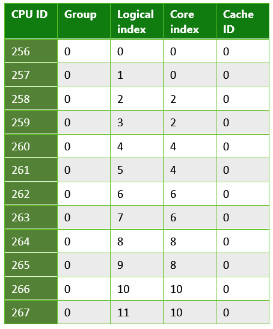
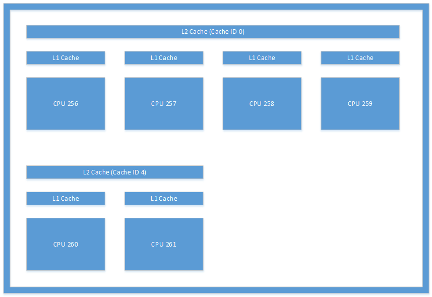

# <a name="cpusets-for-game-development"></a>게임 개발용 CPUSets

## <a name="introduction"></a>소개

UWP(유니버설 Windows 플랫폼)는 광범위한 소비자 전자 디바이스의 핵심입니다. 따라서 게임에서 포함 앱, 서버에서 실행되는 엔터프라이즈 소프트웨어에 이르는 모든 유형의 응용 프로그램에 대한 요구 사항을 처리하기 위해 UWP에는 범용 API가 필요합니다. API에서 제공하는 올바른 정보를 활용하여 게임이 모든 하드웨어에서 최상으로 실행되도록 할 수 있습니다.

## <a name="cpusets-api"></a>CPUSets API

CPUSets API를 사용하면 스레드를 예약하기 위해 사용할 수 있는 CPU 집합을 제어할 수 있습니다. 스레드가 예약되는 위치를 제어하기 위해 두 함수를 사용할 수 있습니다.
- **SetProcessDefaultCpuSets** – 이 함수를 사용하여 특정 CPU 집합에 할당되지 않은 새 스레드가 실행될 수 있는 CPU 집합을 지정할 수 있습니다.
- **SetThreadSelectedCpuSets** – 이 함수를 사용하여 특정 스레드가 실행될 수 있는 CPU 집합을 제한할 수 있습니다.

**SetProcessDefaultCpuSets** 함수를 사용하지 않는 경우 새로 만들어진 스레드는 프로세스에서 사용할 수 있는 임의의 CPU 집합에서 예약될 수 있습니다. 이 섹션에서는 CPUSets API의 기본 사항을 설명합니다.

### <a name="getsystemcpusetinformation"></a>GetSystemCpuSetInformation

정보를 수집하는 데 사용되는 첫 번째 API는 **GetSystemCpuSetInformation** 함수입니다. 이 함수는 제목 코드에서 제공하는 **SYSTEM_CPU_SET_INFORMATION** 개체의 배열에 정보를 채웁니다. 대상의 메모리는 게임 코드에서 할당되어야 하며 그 크기는 **GetSystemCpuSetInformation** 자체를 호출하여 결정됩니다. 이를 위해서는 다음 예제와 같이 **GetSystemCpuSetInformation**을 두 번 호출해야 합니다.

```
unsigned long size;
HANDLE curProc = GetCurrentProcess();
GetSystemCpuSetInformation(nullptr, 0, &size, curProc, 0);

std::unique_ptr<uint8_t[]> buffer(new uint8_t[size]);

PSYSTEM_CPU_SET_INFORMATION cpuSets = reinterpret_cast<PSYSTEM_CPU_SET_INFORMATION>(buffer.get());
  
GetSystemCpuSetInformation(cpuSets, size, &size, curProc, 0);
```

반환되는 **SYSTEM_CPU_SET_INFORMATION**의 각 인스턴스에는 CPU 집합이라고도 하는 하나의 고유한 처리 장치에 대한 정보가 포함되어 있습니다. 이는 반드시 고유한 실제 하드웨어 항목을 나타내는 것을 의미하지는 않습니다. 하이퍼스레딩을 활용하는 CPU에는 단일한 물리적 처리 코어에서 실행되는 여러 논리 코어가 있습니다. 동일한 물리적 코어에 있는 여러 논리 코어에서 스레드를 여러 개 예약하면 커널 수준에서 추가 작업이 수행될 필요가 없으므로 하드웨어 수준의 리소스 최적화가 가능합니다. 동일한 물리적 코어에 있는 서로 다른 논리 코어에서 예약된 두 스레드는 CPU 시간을 공유해야 하지만 동일한 논리 코어에 예약된 경우보다 효율적으로 실행됩니다.

### <a name="systemcpusetinformation"></a>SYSTEM_CPU_SET_INFORMATION

**GetSystemCpuSetInformation**에서 반환된 이 데이터 구조체의 각 인스턴스에 있는 정보에는 스레드가 예약될 수 있는 고유한 처리 장치에 대한 정보가 포함되어 있습니다. 대상 디바이스의 가능한 범위 때문에 **SYSTEM_CPU_SET_INFORMATION** 데이터 구조체의 많은 정보가 게임 개발에 해당하지 않을 수 있습니다. 표 1에서는 게임 개발에 유용한 데이터 멤버에 대해 설명합니다.

 **표 1. 게임 개발에 유용한 데이터 멤버**

| 멤버 이름  | 데이터 형식 | 설명 |
| ------------- | ------------- | ------------- |
| 종류  | CPU_SET_INFORMATION_TYPE  | 구조체에 있는 정보의 유형입니다. 이 멤버의 값이 **CpuSetInformation**이 아닌 경우 이 멤버는 무시되어야 합니다.  |
| Id  | unsigned long  | 지정된 CPU 집합의 ID입니다. **SetThreadSelectedCpuSets**와 같은 CPU 집합 함수와 함께 사용해야 하는 ID입니다.  |
| Group  | unsigned short  | CPU 집합의 "프로세서 그룹"을 지정합니다. 프로세서 그룹은 PC에 64개가 넘는 논리 코어가 포함될 수 있도록 하고 시스템이 실행되는 동안 CPU의 핫 스와핑을 허용합니다. 둘 이상의 그룹이 포함된 서버가 아닌 PC를 보기는 흔치 않습니다. 큰 서버나 서버 팜에서 실행될 응용 프로그램을 작성하지 않는 한 대부분의 소비자 PC에는 프로세서 그룹이 하나만 있기 때문에 단일 그룹에서 CPU 집합을 사용하는 것이 좋습니다. 이 구조체의 다른 모든 값은 그룹에 상대적입니다.  |
| LogicalProcessorIndex  | unsigned char  | CPU 집합의 그룹 상대 인덱스  |
| CoreIndex  | unsigned char  | CPU 집합이 위치한 물리적 CPU 코어의 그룹 상대 인덱스  |
| LastLevelCacheIndex  | unsigned char  | 이 CPU 집합과 연결된 마지막 캐시의 그룹 상대 인덱스. 시스템에서 NUMA 노드를 활용하지 않는 한 가장 느린 캐시이며, 대개 L2 또는 L3 캐시입니다.  |

<br />

다른 데이터 멤버는 소비자 PC 또는 다른 소비자 디바이스의 CPU를 설명할 가능성이 적고 유용할 것 같지 않은 정보를 제공합니다. 반환된 데이터에서 제공하는 정보를 사용하여 다양한 방식으로 스레드를 구성할 수 있습니다. 이 백서의 [게임 개발에 대한 고려 사항](#considerations-for-game-development) 섹션에서는 이 데이터를 활용하여 스레드 할당을 최적화하는 몇 가지 방법을 설명합니다.

다음은 다양한 유형의 하드웨어에서 실행되는 UWP 응용 프로그램에서 수집된 정보 유형의 몇 가지 예입니다.

**표 2. Microsoft Lumia 950에서 실행되는 UWP 앱에서 반환된 정보. 마지막 수준 캐시가 여러 개인 시스템의 예입니다. Lumia 950에는 듀얼 코어 ARM Cortex A57 및 쿼드 코어 ARM Cortex A53 CPU가 포함된 Qualcomm 808 Snapdragon 프로세스가 있습니다.**

  

**표 3. 일반 PC에서 실행되는 UWP 앱에서 반환된 정보. 하이퍼스레딩을 사용하는 시스템의 예입니다. 각 물리적 코어에는 스레드가 예약될 수 있는 논리 코어가 두 개 있습니다. 이 경우 시스템에 Intel Xenon CPU E5-2620이 포함되어 있습니다.**

  

**표 4. 쿼드 코어 Microsoft Surface Pro 4에서 실행되는 UWP 앱에서 반환된 정보. 이 시스템에는 Intel Core i5-6300 CPU가 있습니다.**

  

### <a name="setthreadselectedcpusets"></a>SetThreadSelectedCpuSets

CPU 집합에 대한 정보를 사용할 수 있으므로 이 정보를 사용하여 스레드를 구성할 수 있습니다. **CreateThread**를 사용하여 만든 스레드의 핸들은 스레드가 예약될 수 있는 CPU 집합의 ID 배열과 함께 이 함수에 전달됩니다. 이 함수를 사용하는 예가 다음 코드에 나와 있습니다.

```
HANDLE audioHandle = CreateThread(nullptr, 0, AudioThread, nullptr, 0, nullptr);
unsigned long cores [] = { cpuSets[0].CpuSet.Id, cpuSets[1].CpuSet.Id };
SetThreadSelectedCpuSets(audioHandle, cores, 2);
```
이 예제에서는 스레드가 **AudioThread**로 선언된 함수를 기반으로 만들어집니다. 그런 다음 이 스레드가 두 CPU 집합 중 하나에 예약되도록 허용됩니다. CPU 집합의 스레드 소유권은 독점적이 아닙니다. 특정 CPU 집합에 잠겨 있지 않은 상태로 만들어진 스레드는 **AudioThread**에서 시간을 사용할 수 있습니다. 마찬가지로, 만들어진 다른 스레드는 이후에 이러한 CPU 집합 중 하나 또는 둘 다에 잠겨 있을 수도 있습니다.

### <a name="setprocessdefaultcpusets"></a>SetProcessDefaultCpuSets

**SetThreadSelectedCpuSets**의 반대가 **SetProcessDefaultCpuSets**입니다. 스레드는 만들어질 때 특정 CPU 집합에 잠겨 있을 필요가 없습니다. 이러한 스레드가 특정 CPU 집합(예: 렌더링 스레드 또는 오디오 스레드에서 사용되는 CPU 집합)에서 실행되지 않게 하려면 이 함수를 사용하여 이러한 스레드가 예약될 수 있는 코어를 지정할 수 있습니다.

## <a name="considerations-for-game-development"></a>게임 개발에 대한 고려 사항

지금까지 살펴봤듯이 CPUSets API는 스레드 예약 측면에서 많은 정보와 유연성을 제공합니다. 상향식 접근법으로 이 데이터의 사용 방법을 찾으려는 대신 일반적인 시나리오를 수용하기 위해 데이터를 사용하는 방법을 찾는 하향식 접근법을 택하는 것이 더 효과적입니다.

### <a name="working-with-time-critical-threads-and-hyperthreading"></a>시간이 중요한 스레드 및 하이퍼스레딩 작업

이 방법은 게임에 상대적으로 적은 CPU 시간이 필요한 다른 작업자 스레드와 함께 실시간으로 실행되어야 하는 스레드가 몇 개 있는 경우 효과적입니다. 연속되는 배경 음악과 같은 일부 작업은 최적의 게임 환경을 위해 중단 없이 실행되어야 합니다. 오디오 스레드의 단일 프레임 결핍조차도 튕김이나 결함을 발생시킬 수 있으므로 프레임마다 필요한 양의 CPU 시간을 받는 것이 중요합니다.

**SetThreadSelectedCpuSets**를 **SetProcessDefaultCpuSets**와 함께 사용하면 작업량이 많은 스레드가 작업자 스레드에 의해 중단되지 않고 유지될 수 있습니다. **SetThreadSelectedCpuSets**를 사용하여 작업량이 많은 스레드를 특정 CPU 집합에 할당할 수 있습니다. 그런 다음 **SetProcessDefaultCpuSets**를 사용하여 만들어진 모든 할당되지 않은 스레드가 다른 CPU 집합에 배치되도록 할 수 있습니다. 하이퍼스레딩을 사용하는 CPU의 경우 동일한 물리적 코어의 논리 코어도 고려해야 합니다. 실시간 응답 성능으로 실행하려는 스레드와 동일한 물리적 코어를 공유하는 논리 코어에서 작업자 스레드가 실행되도록 허용하면 안 됩니다. 다음 코드에서는 PC에서 하이퍼스레딩을 사용하는지 여부를 확인하는 방법을 보여 줍니다.

```
unsigned long retsize = 0;
(void)GetSystemCpuSetInformation( nullptr, 0, &retsize,
    GetCurrentProcess(), 0);
 
std::unique_ptr<uint8_t[]> data( new uint8_t[retsize] );
if ( !GetSystemCpuSetInformation(
    reinterpret_cast<PSYSTEM_CPU_SET_INFORMATION>( data.get() ),
    retsize, &retsize, GetCurrentProcess(), 0) )
{
    // Error!
}
 
std::set<DWORD> cores;
std::vector<DWORD> processors;
uint8_t const * ptr = data.get();
for( DWORD size = 0; size < retsize; ) {
    auto info = reinterpret_cast<const SYSTEM_CPU_SET_INFORMATION*>( ptr );
    if ( info->Type == CpuSetInformation ) {
         processors.push_back( info->CpuSet.Id );
         cores.insert( info->CpuSet.CoreIndex );
    }
    ptr += info->Size;
    size += info->Size;
}
 
bool hyperthreaded = processors.size() != cores.size();
```

시스템에서 하이퍼스레딩을 사용하는 경우 기본 CPU 집합에 실시간 스레드와 동일한 물리적 코어의 논리 코어가 포함되지 않아야 합니다. 시스템에서 하이퍼스레딩을 사용하지 않는 경우에는 기본 CPU 집합에 오디오 스레드를 실행하는 CPU 집합과 동일한 코어가 포함되지 않도록 하기만 하면 됩니다.

물리적 코어를 기준으로 스레드를 구성하는 예는 [추가 리소스](#additional-resources) 섹션에 연결된 GitHub 리포지토리에서 사용할 수 있는 CPUSets 샘플에서 찾을 수 있습니다.

### <a name="reducing-the-cost-of-cache-coherence-with-last-level-cache"></a>마지막 수준 캐시를 사용하여 캐시 일관성 비용 절감

캐시 일관성은 캐시된 메모리가 같은 데이터를 대상으로 작동하는 여러 하드웨어 리소스에서 동일함을 나타내는 개념입니다. 스레드가 여러 코어에 예약되어 있지만 동일한 데이터를 대상으로 작업하는 경우 서로 다른 캐시에 있는 해당 데이터의 개별 복사본을 대상으로 작업 중일 수 있습니다. 올바른 결과를 얻기 위해 이러한 캐시는 서로 일관성 있게 유지되어야 합니다. 여러 캐시 간에 일관성을 유지하는 것은 상대적으로 비용이 많이 들지만 모든 다중 코어 시스템이 작동하는 데 필수적입니다. 또한 캐시 일관성 유지는 클라이언트 코드의 제어를 완전히 벗어납니다. 기본 시스템은 코어 간의 공유 메모리 리소스에 액세스하여 캐시를 최신 상태로 유지하기 위해 독립적으로 작동합니다.

게임에 특히 많은 양의 데이터를 공유하는 여러 스레드가 있는 경우 마지막 수준 캐시를 공유하는 CPU 집합에 스레드가 예약되도록 하여 캐시 일관성 비용을 최소화할 수 있습니다. 마지막 수준 캐시는 NUMA 노드를 사용하지 않는 시스템의 코어에서 사용할 수 있는 가장 느린 캐시입니다. 게임 PC에서 NUMA 노드를 사용하는 경우는 매우 드뭅니다. 코어에서 마지막 수준 캐시를 공유하지 않는 경우 일관성을 유지하려면 더 높은 수준의(따라서 속도가 더 느린) 메모리 리소스에 액세스해야 합니다. 캐시 및 물리적 코어를 공유하는 개별 CPU 집합에 두 스레드를 잠그면 해당 스레드가 지정된 프레임에서 50% 이상의 시간을 필요로 하지 않는 경우 각기 다른 물리적 코어에 스레드를 예약하는 경우보다 성능이 훨씬 향상됩니다. 

이 코드 예제에서는 자주 통신하는 스레드가 마지막 수준 캐시를 공유할 수 있는지 여부를 확인하는 방법을 보여 줍니다.

```
unsigned long retsize = 0;
(void)GetSystemCpuSetInformation(nullptr, 0, &retsize,
    GetCurrentProcess(), 0);
 
std::unique_ptr<uint8_t[]> data(new uint8_t[retsize]);
if (!GetSystemCpuSetInformation(
    reinterpret_cast<PSYSTEM_CPU_SET_INFORMATION>(data.get()),
    retsize, &retsize, GetCurrentProcess(), 0))
{
    // Error!
}
 
unsigned long count = retsize / sizeof(SYSTEM_CPU_SET_INFORMATION);
bool sharedcache = false;
 
std::map<unsigned char, std::vector<SYSTEM_CPU_SET_INFORMATION>> cachemap;
for (size_t i = 0; i < count; ++i)
{
    auto cpuset = reinterpret_cast<PSYSTEM_CPU_SET_INFORMATION>(data.get())[i];
    if (cpuset.Type == CPU_SET_INFORMATION_TYPE::CpuSetInformation)
    {
        if (cachemap.find(cpuset.CpuSet.LastLevelCacheIndex) == cachemap.end())
        {
            std::pair<unsigned char, std::vector<SYSTEM_CPU_SET_INFORMATION>> newvalue;
            newvalue.first = cpuset.CpuSet.LastLevelCacheIndex;
            newvalue.second.push_back(cpuset);
            cachemap.insert(newvalue);
        }
        else
        {
            sharedcache = true;
            cachemap[cpuset.CpuSet.LastLevelCacheIndex].push_back(cpuset);
        }
    }
}
```

그림 1에 나와 있는 캐시 레이아웃은 시스템에서 볼 수 있는 레이아웃 유형의 예입니다. 이 그림은 Microsoft Lumia 950에 있는 캐시를 나타낸 것입니다. CPU 256과 CPU 260 간에 발생하는 스레드 간 통신은 시스템에서 L2 캐시의 일관성을 유지해야 하므로 상당한 오버헤드를 유발합니다.

**그림 1. Microsoft Lumia 950 디바이스에 있는 캐시 아키텍처**



## <a name="summary"></a>요약

UWP 개발에 사용할 수 있는 CPUSets API는 다중 스레딩 옵션에 대한 상당한 양의 정보와 제어 기능을 제공합니다. Windows 개발을 위한 이전의 다중 스레드 API와 비교할 때 더 복잡해졌으므로 학습 기간이 어느 정도 필요하지만, 유연성 향상으로 결국 다양한 소비자 PC와 기타 하드웨어 대상 전체에서 성능을 높일 수 있습니다. 

## <a name="additional-resources"></a>추가 리소스
- [CPU 집합(MSDN)](https://msdn.microsoft.com/library/windows/desktop/mt186420(v=vs.85).aspx)
- [ATG에서 제공한 CPUSets 샘플](https://github.com/Microsoft/Xbox-ATG-Samples/tree/master/Samples/System/CPUSets)
- [Xbox One의 UWP](index.md)

