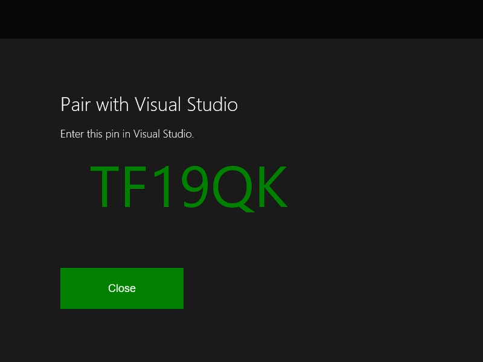

# Xbox 개발 환경에서의 UWP 설정

Xbox 개발 환경에서 UWP(유니버설 Windows 플랫폼)는 로컬 네트워크를 통해 Xbox One 본체에 연결된 개발 PC로 구성됩니다.
개발 PC에는 Windows 10, Visual Studio 2017 또는 Visual Studio 2015 업데이트 3, Windows 10 SDK 빌드 14393 이상, 그리고 다양한 지원 도구가 필요합니다.

이 문서에서는 개발 환경의 설정 및 테스트 단계를 설명합니다.

## Visual Studio 설치

1. Visual Studio 2017, Visual Studio 2015 업데이트 3 또는 Visual Studio의 최신 릴리스를 설치 합니다. 설치에 대한 자세한 내용은 [Windows 10용 다운로드 및 도구](https://dev.windows.com/downloads)를 참조하세요. 개발자와 보안에 대 한 최신 업데이트를 받을 수 있도록 최신 버전의 Visual Studio를 사용 하는 것이 좋습니다.

2. Visual Studio 2017을 설치하는 경우 **유니버설 Windows 플랫폼 개발** 작업을 선택하도록 하세요. C++ 개발자인 경우에도 **유니버설 Windows 플랫폼 개발** 아래의 오른쪽 **요약** 창의 **C++ 유니버설 Windows 플랫폼 도구** 확인란을 선택하도록 하세요. 이는 기본 설치에 포함되지 않습니다.

    

    Visual Studio 2015 업데이트 3을 설치하는 경우 **유니버설 Windows 앱 개발 도구** 확인란이 선택되었는지 확인합니다.

    

## Windows 10 SDK 설정

최신 Windows 10 SDK를 설치합니다. 이는 Visual Studio 설치에 포함되지만 이를 별도로 다운로드하려면 [Windows 10 SDK](https://developer.microsoft.com/windows/downloads/windows-10-sdk)를 참조하세요.

## 개발자 모드 사용

개발 PC에서 앱을 배포하기 전에 개발자 모드를 사용하도록 설정해야 합니다. **설정** 앱에서 **업데이트 및 보안** / **개발자용**으로 이동하고 **개발자 기능 사용**에서 **개발자 모드**를 선택합니다.

## Xbox One 설정

Xbox One에 앱을 배포하려면 먼저 사용자가 본체에 로그인되어 있어야 합니다. 기존 Xbox Live 계정을 사용하거나, 개발자 모드에서 콘솔용 계정을 새로 만들 수 있습니다. 

## 첫 번째 앱 만들기

1. 개발 PC가 대상 Xbox One 본체와 동일한 로컬 네트워크에 있는지 확인합니다. 일반적으로 이는 동일한 라우터를 사용하고 동일한 서브넷에 있어야 함을 의미합니다. 유선 네트워크 연결을 사용하는 것이 좋습니다.

2. Xbox One 본체가 개발자 모드에 있는지 확인합니다.  자세한 내용은 [Xbox One 개발자 모드 활성화](devkit-activation.md)를 참조하세요.

3. UWP 앱에 사용할 프로그래밍 언어를 결정합니다.

4. Visual Studio에서 개발 PC의 **새로 만들기 / 프로젝트**를 선택합니다.

5. **새 프로젝트** 창에서 **Windows 유니버설 / 빈 앱(유니버설 Windows)** 을 선택합니다.

### C# 프로젝트 시작

  

1. **새 유니버설 Windows 프로젝트** 대화 상자에서 **최소 버전** 드롭다운에서 빌드 14393 이상을 선택합니다. **대상 버전** 드롭다운에서 최신 SDK를 선택합니다. **개발자 모드** 대화 상자가 나타날 경우 **확인**을 클릭합니다. 새 비어 있는 앱을 만듭니다.

2. 원격 디버깅을 위한 개발 환경을 구성합니다.

    a. **솔루션 탐색기**에서 프로젝트를 마우스 오른쪽 단추로 클릭한 다음 **속성**을 선택합니다.

    b. **디버그** 탭에서 **플랫폼**을 **x64**로 변경합니다. (x86은 이제 Xbox에서 지원되는 플랫폼이 아닙니다.)

    c. **시작 옵션**에서 **대상 장치**를 **원격 컴퓨터**로 변경합니다.

    d. **원격 컴퓨터**에 시스템 IP 주소 또는 Xbox One 본체의 호스트 이름을 입력합니다. IP 주소 또는 호스트 이름을 얻는 방법에 대한 자세한 내용은 [Xbox One 도구 소개](introduction-to-xbox-tools.md)를 참조하세요.

    e. **인증 모드** 드롭다운 목록에서 **유니버설(암호화되지 않은 프로토콜)** 을 선택합니다.

    

### C++ 프로젝트 시작

  

1. **새 유니버설 Windows 프로젝트** 대화 상자에서 **최소 버전** 드롭다운에서 빌드 14393 이상을 선택합니다. **대상 버전** 드롭다운에서 최신 SDK를 선택합니다. **개발자 모드** 대화 상자가 나타날 경우 **확인**을 클릭합니다. 새 비어 있는 앱을 만듭니다.

2. 원격 디버깅을 위한 개발 환경을 구성합니다.

   a. **솔루션 탐색기**에서 프로젝트를 마우스 오른쪽 단추로 클릭한 다음 **속성**을 선택합니다.

   b. **디버깅** 탭에서 **실행할 디버거**를 **원격 컴퓨터**로 변경합니다.

   c. **컴퓨터 이름**에 시스템 IP 주소 또는 Xbox One 본체의 호스트 이름을 입력합니다. IP 주소 또는 호스트 이름을 얻는 방법에 대한 자세한 내용은 [Xbox One 도구 소개](introduction-to-xbox-tools.md)를 참조하세요.

   d. **인증 유형** 드롭다운 목록에서 **유니버설(암호화되지 않은 프로토콜)** 을 선택합니다.

   e. **플랫폼** 드롭다운에서 **x64**를 선택합니다.

    

### 디바이스와 Visual Studio PIN 페어링

1. 설정을 저장하고 Xbox One 본체가 개발자 모드인지 확인합니다.

2. Visual Studio에서 프로젝트를 연 상태로 F5를 누릅니다.

3. 이번이 첫 번째 배포인 경우 Visual Studio에 디바이스를 PIN 페어링하라는 대화 상자가 나타날 수 있습니다.

    a. PIN을 얻으려면 Xbox One 본체의 홈 화면에서 **개발자 홈**을 엽니다.

    b. **홈** 탭의 **바로 가기**에서 **Visual Studio 표시 핀**을 선택합니다.
  
    

    c. **Visual Studio와 페어링** 대화 상자에 PIN을 입력합니다. 다음 PIN은 예시일 뿐이며, 사용자에 따라 다릅니다.

    

    d. 배포 오류가 있는 경우 **출력** 창에 나타납니다.

축하합니다. Xbox에서 첫 UWP 앱을 성공적으로 만들고 배포했습니다.

## 참고 항목
- [Xbox One 개발자 모드 활성화](devkit-activation.md)  
- [Windows 10용 다운로드 및 도구](https://dev.windows.com/downloads)  
- [Windows 참가자 프로그램](http://go.microsoft.com/fwlink/?LinkId=780552)  
- [Xbox One 도구 소개](introduction-to-xbox-tools.md) 
- [Xbox One의 UWP](index.md)