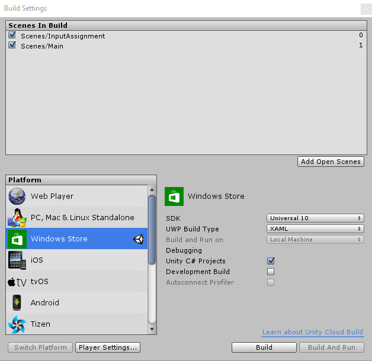

# Xbox의 UWP에 Unity 게임 가져오기

이 단계별 자습서에서는 빌드하여 배포할 준비가 된 게임이 Unity에 이미 있다고 가정합니다.

[이 자습서의 비디오 버전](https://www.youtube.com/watch?v=f0Ptvw7k-CE)도 참조하세요.

Unity UWP 프로젝트 버전을 찾고 있나요? [UWP 프로젝트 버전 제어](development-lanes-unity-versioning.md)를 참조하세요.

## 0단계: Unity가 올바르게 설치되었는지 확인

Unity를 설치할 때 다음과 같은 구성 요소를 선택해야 합니다.

## 1단계: UWP 솔루션 빌드

Unity 게임 프로젝트에서 **파일 -> 빌드 설정**에 있는 **빌드 설정** 창을 열고 Microsoft Store 옵션 메뉴로 이동합니다.

**SDK** 설정을 **유니버설 10**으로 설정했는지 확인한 다음 **빌드** 단추를 선택하면 대상 폴더를 요청하는 파일 탐색기 창이 시작됩니다. 프로젝트의 **Assets** 디렉터리에 **UWP**라는 폴더를 만들고 이 폴더를 빌드의 대상 폴더로 선택합니다.

이제 Unity에서 UWP 게임을 배포하는 데 사용할 새 Visual Studio 솔루션을 만들었습니다.

## 2단계: 게임 배포

**UWP** 폴더에서 새로 생성된 솔루션을 열고 대상 플랫폼을 **x64**로 변경합니다.

게임에 대한 UWP Visual Studio 솔루션이 마련되었으므로 [이 단계를 수행하여](getting-started.md) 정품 Xbox One에 게임을 성공적으로 배포할 수 있습니다.

## 3단계: 수정 및 다시 빌드

스크립트가 아닌 항목을 변경한 경우 이러한 변경 내용이 게임의 UWP 빌드에 표시되도록 하려면 편집기 내에서 프로젝트를 다시 빌드해야 합니다(__1단계__에서 설명).

## UWP 프로젝트 버전 관리

새롭게 생성된 이 UWP 디렉터리 부분을 버전 제어에 추가해야 하는 몇 가지 일반적인 상황이 있습니다. 예를 들어 새 종속성을 UWP 프로젝트에 추가하는 경우입니다(예: Xbox Live SDK).  이 예제는 [UWP 프로젝트 버전 제어](development-lanes-unity-versioning.md)에서 자세히 살펴봅니다.

## 참고 항목
- [기존 게임을 Xbox로 가져오기](development-lanes-landing.md)
- [Xbox One의 UWP](index.md)
