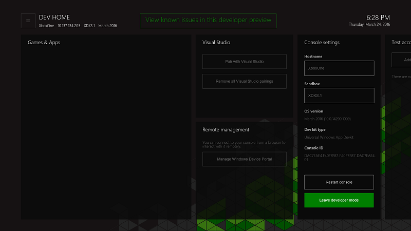

# Xbox One 개발자 모드 비활성화

* [정품 모드로 전환](#switch-to-retail-mode)
* [개발자 모드 활성화 앱을 사용하여 콘솔 비활성화](#deactivate-your-console-using-the-dev-mode-activation-app)  
* [콘솔 다시 설정](#reset-your-console)
* [Windows 개발자 센터를 사용하여 콘솔 비활성화](#deactivate-your-console-using-windows-dev-center)

더 이상 개발을 위해 콘솔을 사용하지 않으려는 경우 다음 단계를 사용하여 개발자 모드를 비활성화합니다.

## 정품 모드로 전환
먼저 Xbox One 콘솔을 정품 모드로 되돌립니다.

1. **개발자 홈**을 엽니다.
2. **Leave developer mode(개발자 모드 나가기)**를 클릭합니다.  콘솔이 정품 모드로 다시 시작됩니다.  

   

이제 다음 방법 중 하나를 사용하여 콘솔을 비활성화합니다.

## 개발자 모드 활성화 앱을 사용하여 콘솔 비활성화

콘솔에서 개발자 모드를 비활성화하는 기본 방법은 개발자 모드 활성화 앱을 사용하는 것입니다. 

1. **내 게임과 앱** > **앱**으로 이동합니다.
  
       
   
2.  개발자 모드 활성화 앱을 엽니다.    
3.  **비활성화**를 클릭합니다.
  

## 콘솔 다시 설정

콘솔을 초기화하여 개발자 모드를 비활성화할 수도 있습니다.  

> [!NOTE]
> 콘솔을 초기화하면 모든 로컬 저장 게임 데이터가 손실됩니다.

콘솔을 초기화하려면 다음 단계를 수행합니다.

1.  **My games &amp; apps(내 게임 및 앱)**로 이동합니다.  
2.  **앱**을 선택한 다음 **설정**을 선택합니다.  
3.  왼쪽 창의 **시스템**으로 이동한 다음 오른쪽 창의 **Console info &amp; updates(콘솔 정보 및 업데이트)**를 선택합니다.  
4.  **Console info &amp; updates(콘솔 정보 및 업데이트)**로 이동합니다.  
   
      
    
5.  **콘솔 다시 설정**을 클릭합니다.
    
    
    
6.  다음으로 **Reset and remove everything(다시 설정 및 모두 제거)**을 클릭합니다. 이 옵션은 콘솔을 원래 정품 상태로 다시 설정합니다.  모든 앱, 게임 및 로컬 저장 데이터가 삭제됩니다. 다른 옵션인 **Reset and keep my games &amp; apps(내 게임 및 앱 다시 설정 및 유지)**를 선택하면 개발자 프로그램에서 콘솔을 제거하지 않습니다.  
   
    

## Windows 개발자 센터를 사용하여 콘솔 비활성화

어떤 이유로든 콘솔에 액세스할 수 없는 경우 Windows 개발자 센터를 사용하여 콘솔에서 개발자 모드를 비활성화할 수도 있습니다.

1. [developer.microsoft.com/xboxdevices](https://developer.microsoft.com/xboxdevices)로 이동합니다.    
2. 개발자 센터 계정을 사용하여 개발자 센터에 로그인합니다.    
3. 콘솔 목록에서 일련 번호, 콘솔 ID 또는 디바이스 ID와 일치하는 비활성화하려는 콘솔을 찾습니다.  
4. **비활성화**를 클릭합니다.  
  

이전에 Xbox One 콘솔이 정품 모드로 되돌아가지 않았으면 지금 전환합니다.

1. **개발자 홈**을 시작합니다.
2. **Leave developer mode(개발자 모드 나가기)**를 클릭합니다.  콘솔이 정품 모드로 다시 시작됩니다.

## 참고 항목
- [Xbox One 개발자 모드 활성화](devkit-activation.md)
- [Xbox One의 UWP](index.md)
