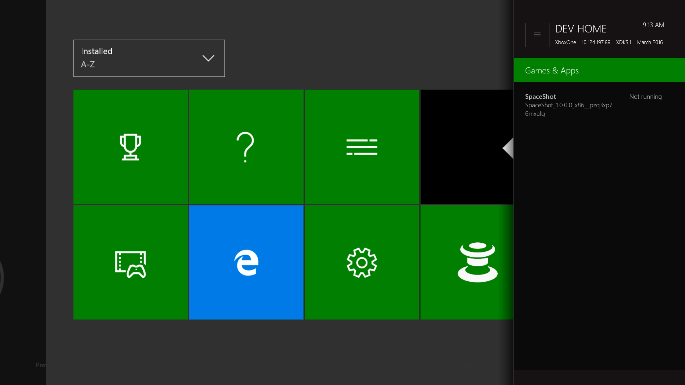
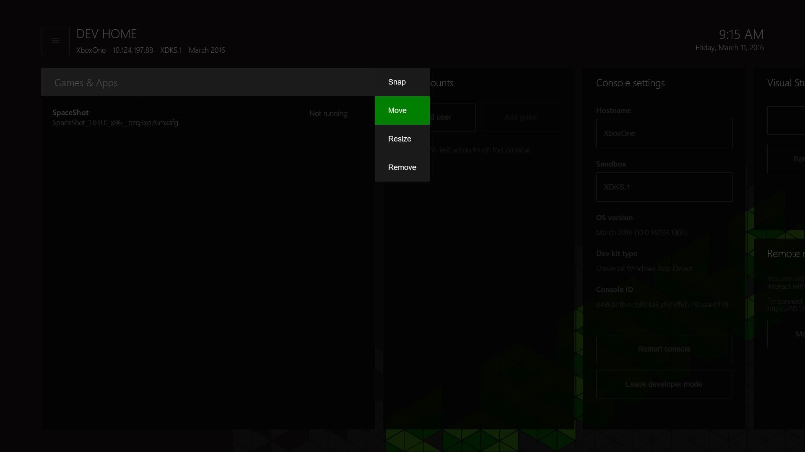

# Xbox One 도구 소개

이 섹션에서는 Windows Device Portal을 사용하는 Xbox One 특정 도구 _개발자 홈_에 대해 설명합니다.

## 개발자 홈

_개발자 홈_은 개발자의 생산성을 지원하도록 설계된 Xbox One 개발 키트의 도구 환경입니다. 개발자 홈은 개발 키트를 관리하고 구성하는 기능을 제공합니다.

개발자 홈을 열려면 홈 화면에서 **개발자 홈** 타일을 선택합니다. 타일이 없으면 콘솔이 개발자 모드가 아닙니다.

  

### User interface(사용자 인터페이스)
개발자 홈 사용자 인터페이스는 다음 섹션에서 설명한 대로 여러 영역으로 나뉩니다. 콘솔 IP 주소와 이름이 여기에 표시됩니다.

  

#### 헤더
헤더는 개발 키트에 대한 중요한 정보를 "한눈에" 보여 줍니다. 여기에는 콘솔 이름, 해당 IP 주소, 콘솔이 있는 Xbox Live 샌드박스, 콘솔에서 실행 중인 운영 체제 버전이 포함됩니다. 헤더 오른쪽에는 편의상 현재 시스템 시간과 날짜가 표시됩니다.

#### 도구 창
헤더 아래에는 구성 가능한 도구 창 집합이 포함된 앱의 주 영역이 있습니다. 이러한 창을 통해 개발자는 다양한 도구와 정보 집합에 대한 액세스를 제공하도록 앱을 사용자 지정할 수 있습니다. 도구에 대한 자세한 내용은 다음 개별 도구 설명을 참조하세요. 도구 창의 레이아웃 및 모양을 구성하는 방법에 대한 자세한 내용은 이 페이지의 뒷부분에 있는 [개발자 홈 사용자 지정](#customizing-dev-home) 섹션을 참조하세요.

#### 주 메뉴
컨트롤러에서 **메뉴** 단추를 누르거나 화면 왼쪽 위에 있는 메뉴("햄버거") 단추로 이동하면 앱 작업 영역의 테마 색과 배경 이미지를 구성하고 앱에 대한 피드백을 제공할 수 있는 주 메뉴에 액세스할 수 있습니다.

  

#### 끌기 모드
테스트 중에 도구에 쉽게 액세스할 수 있도록 제목을 실행하는 동안 개발자 홈의 도구를 측면으로 끌 수 있습니다.

**끌기** 모드에 액세스하려면 적절한 도구의 제목을 선택하고 컨트롤러에서 **보기** 단추를 누른 다음 상황에 맞는 메뉴에서 **끌기**를 선택합니다.

  

개발자 홈이 오른쪽에 맞춰집니다. 평소대로 **Nexus** 단추를 두 번 탭하여 컨텍스트를 전환할 수 있습니다.

  

#### 도구 설명
| 도구  | 기능 |
|-------|--------------|
| 게임 및 앱  | 개발 키트에 설치된 제목 및 앱과 빠르게 열 수 있는 기능을 나열합니다. 또한 게임 및 앱의 PLM(프로세스 수명 관리) 상태를 보고 상황에 맞는 메뉴에서 PLM 상태를 변경할 수도 있습니다. |
| 사용자 | 콘솔에 현재 등록된 사용자를 나열합니다. One-Click 사용자 로그인/로그아웃, 사용자 및 게스트 추가, 사용자 및 게스트의 세부 정보 보기를 사용하도록 설정합니다. |
| [콘솔 설정](#console-settings) | 콘솔 설정과 정보의 "한눈에" 보기 및 편집 옵션을 제공합니다. |
| Visual Studio | 배포를 허용하도록 콘솔과 Visual Studio 인스턴스를 연결할 수 있습니다. 필요한 경우 키트에 대한 UWP 앱 배포를 방지하기 위해 연결된 기존 VS 인스턴스를 지웁니다. |
| [Windows Device Portal](#windows-device-portal) | 키트에서 WDP(브라우저 기반 디바이스 관리 도구)를 사용하도록 설정합니다. |
| Xbox Live 상태 | Xbox Live 서비스의 현재 상태를 제공합니다. |
 
### 개발자 저장소 할당 크기 관리

개발자 저장소에 사용되는 디스크 공간의 크기를 늘리거나 줄이려면 주 메뉴에서 **개발자 저장소 관리**를 선택합니다. **개발자 저장소** 막대의 값을 변경하고 **저장 후 다시 시작**을 선택하여 콘솔을 다시 부팅합니다.

  

### 개발자 홈 사용자 지정

개발자 홈은 사용자 지정 가능하고 개인적으로 설계되었습니다. 배경 이미지 및 테마 색을 선택하여 개발자 홈 환경을 개인 설정할 수 있습니다. 이러한 옵션은 주 메뉴에 있습니다.

#### 도구 크기 조정 및 다시 정렬
도구의 크기나 위치를 변경하려면 제목에 포커스가 있는 동안 상황에 맞는 메뉴 단추(컨트롤러의 **보기** 단추)를 사용합니다. 상황에 맞는 메뉴에서 **이동** 또는 **크기 조정**을 선택합니다.

  

#### 테마 색 및 배경 이미지 변경
주 메뉴에서 **테마 색 변경**을 선택할 수 있습니다. 포커스 강조 표시에 사용된 테마 색을 업데이트하려면 새로운 색을 선택하고 **저장**을 클릭합니다.

  

### 피드백 제공
개발자 홈 또는 도구 프로세스 중 하나에 대한 피드백을 제공하려면 주 메뉴에서 **피드백 제공** 옵션을 선택합니다.

  

## 콘솔 설정
콘솔 설정 도구는 개발 키트의 설정에 대한 빠른 액세스를 제공합니다.

### 콘솔의 호스트 이름 설정
개발 PC에서 콘솔과 통신할 때 콘솔 IP 주소 대신 사용할 Xbox One 개발 키트의 식별 이름(_호스트 이름_이라고 함)을 설정할 수 있습니다. 개발 PC와 개발 키트가 작동하려면 호스트 이름에 대한 동일한 서브넷에 있어야 합니다.  

개발 키트의 호스트 이름을 정의하려면 콘솔 설정 도구로 이동한 다음 __호스트 이름__ 상자에 호스트 이름을 입력합니다.  

> [!NOTE]
> 호스트 이름을 만들 때는 이름 고유성이 적용되지 않습니다. 이름이 중복되지 않도록 주의하세요. 이렇게 하는 한 가지 방법은 일반적으로 조직 내에서 고유한 개발 컴퓨터의 이름에서 호스트 이름을 파생하는 것입니다.

## Windows Device Portal
WDP(Windows Device Portal)는 브라우저 기반 디바이스 관리 환경을 허용하는 OneCore 디바이스 관리 도구입니다.

> [!NOTE]
> WDP에 대한 자세한 내용은 [Windows Device Portal 개요](../debug-test-perf/device-portal.md)를 참조하세요.

Xbox One 콘솔에서 WDP를 사용하도록 설정하려면

1. 홈 화면에서 개발자 홈 타일을 선택합니다.

  

2. 개발자 홈 내에서 **원격 관리** 도구로 이동합니다.

  

3. __Windows Device Portal 관리__를 선택하고 __A__를 누릅니다.
4. __Windows Device Portal 사용__ 확인란을 선택합니다.
5. __사용자 이름__ 및 __암호__를 입력하고 저장합니다. 브라우저에서 개발 키트에 대한 액세스를 인증하는 데 사용됩니다.
6. __설정__ 페이지를 닫고 연결할 _원격 관리_ 도구에 나열된 URL을 확인합니다.
7. 브라우저에 URL을 입력한 다음 구성한 자격 증명으로 로그인합니다.
8. Xbox One 콘솔에서 서명한 보안 인증서는 신뢰할 수 있는 잘 알려진 게시자로 간주되지 않으므로 제공된 인증서에 대해 다음 스크린샷과 유사한 경고가 표시됩니다. **이 웹 사이트를 계속 탐색합니다**를 클릭하여 Windows Device Portal에 액세스합니다.

  

## Xbox 개발자 모드 도우미
Xbox 개발자 모드 도우미는 PC를 종료하지 않고 콘솔에서 작업할 수 있는 도구입니다. 앱에서 콘솔 화면을 보고 입력을 보낼 수 있습니다. 자세한 내용은 [Xbox 개발자 모드 도우미](xbox-dev-mode-companion.md)를 참조하세요.

## 참고 항목
- [UWP용으로 개발하는 경우 Xbox One에서 Fiddler를 사용하는 방법](uwp-fiddler.md)
- [Windows Device Portal 개요](../debug-test-perf/device-portal.md)
- [Xbox One의 UWP](index.md)

----

<!--HONumber=Sep16_HO1-->

